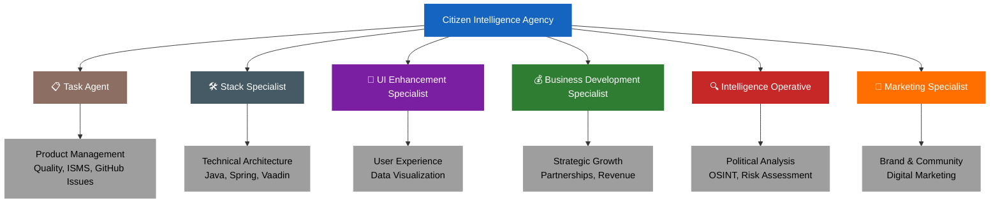
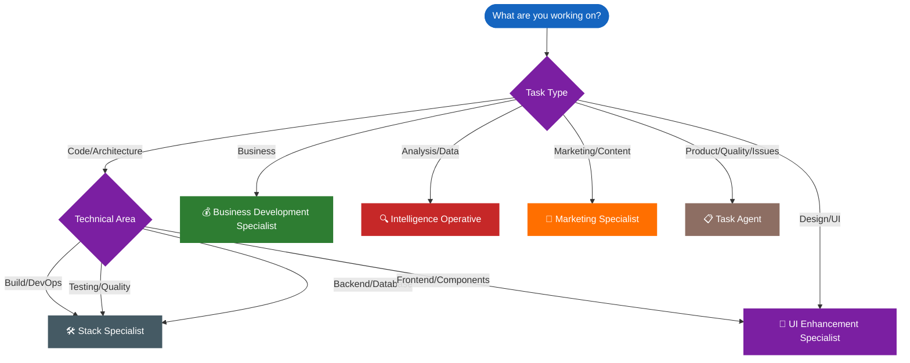

# 🤖 Custom Agent Profiles

This directory contains custom agent profiles for GitHub Copilot, designed to provide domain-specific expertise for the Citizen Intelligence Agency project.

## 📋 Overview

Each agent profile is a Markdown file with YAML frontmatter that defines specialized expertise. When working on tasks related to a specific domain, GitHub Copilot can leverage these profiles to provide more informed and contextual assistance.

## 🎯 Agent Ecosystem



## 🤖 Available Agents

### 📋 Task Agent
**File**: [task-agent.md](task-agent.md)  
**Expertise**: Product Management, Quality Assurance, GitHub Operations, ISMS Compliance, AWS Monitoring, Playwright Testing

Expert in continuous product improvement across quality, UI/UX, security, and ISMS compliance. Creates actionable GitHub issues and coordinates with specialized agents using AWS, Playwright, and GitHub MCP integrations.

**Use Cases**:
- 📊 Product quality monitoring and issue identification
- 🎯 GitHub issue creation with proper categorization and assignment
- 🔍 UI/UX testing with Playwright (screenshots, accessibility)
- 🔐 ISMS compliance tracking (ISO 27001, NIST CSF, CIS Controls)
- ☁️ AWS monitoring via CloudWatch and cost optimization
- 🤝 Agent coordination and task delegation
- 📈 Quality metrics and KPI tracking
- 🛡️ Security vulnerability management

### 🛠️ Stack Specialist
**File**: [stack-specialist.md](stack-specialist.md)  
**Expertise**: Java 21, Spring Framework, Vaadin, Hibernate/JPA, PostgreSQL, Maven, Testing

Expert in the technical architecture and implementation details of the Java-based stack. Provides guidance on framework usage, database optimization, and testing strategies.

**Use Cases**:
- ⚙️ Architecture decisions and design patterns
- 🔧 Spring configuration and dependency injection
- 💾 JPA/Hibernate optimization and query tuning
- 🎨 Vaadin UI component development
- 🗄️ PostgreSQL database design and performance
- 🧪 Testing strategies and test coverage
- 🏗️ Maven build configuration
- 🔍 Technical troubleshooting

### 🎨 UI Enhancement Specialist
**File**: [ui-enhancement-specialist.md](ui-enhancement-specialist.md)  
**Expertise**: Vaadin Framework, Data Visualization, UI/UX Design, Responsive Design, Accessibility

Expert in creating exceptional user experiences for political data visualization. Focuses on accessibility, responsive design, and clear data presentation.

**Use Cases**:
- 🖼️ UI/UX design improvements
- 📊 Data visualization (charts, dashboards, infographics)
- 📱 Responsive design for mobile and desktop
- ♿ Accessibility (WCAG 2.1 AA compliance)
- ⚡ Frontend performance optimization
- 🎭 Vaadin component development
- 🎯 User flow optimization

### 💰 Business Development Specialist
**File**: [business-development-specialist.md](business-development-specialist.md)  
**Expertise**: Strategic Planning, Partnership Development, Revenue Models, Market Expansion

Expert in strategic growth, sustainability planning, and building partnerships. Focuses on revenue generation while maintaining the platform's democratic mission.

**Use Cases**:
- 📈 Strategic planning and roadmap development
- 🤝 Partnership development (government, NGO, academic)
- 💵 Revenue model design and pricing strategy
- 🌍 Market expansion and localization
- 🎯 Competitive analysis and positioning
- 👥 Customer segmentation and personas
- 🚀 Go-to-market strategy

### 🔍 Intelligence Operative
**File**: [intelligence-operative.md](intelligence-operative.md)  
**Expertise**: Political Science, OSINT, Intelligence Analysis, Behavioral Analysis, Swedish Politics

Expert in political intelligence analysis using open-source intelligence (OSINT) methodologies. Specializes in Swedish political system analysis while maintaining strict ethical boundaries.

**Use Cases**:
- 📊 Political data analysis and pattern recognition
- 🔎 Intelligence analysis methodologies (ACH, SWOT)
- 🎯 Risk assessment and threat modeling
- 📈 Predictive analytics and forecasting
- 🇸🇪 Swedish political system expertise
- 🌐 OSINT techniques and data integration
- 🛡️ Counter-disinformation analysis

### 📢 Marketing Specialist
**File**: [marketing-specialist.md](marketing-specialist.md)  
**Expertise**: Digital Marketing, Content Strategy, Community Building, Brand Positioning

Expert in building awareness and engagement while maintaining political neutrality. Focuses on mission-driven marketing and community development.

**Use Cases**:
- 📝 Content strategy and creation
- 🔍 SEO and organic growth
- 📱 Social media strategy
- 📰 Public relations and press coverage
- 👥 Community building and engagement
- 🎨 Brand development and positioning
- 📊 Marketing analytics and optimization

## 🔧 Agent Profile Format

Each agent profile follows the GitHub Copilot custom agent format:

```markdown
---
name: agent-name
description: Brief description of the agent's expertise and focus (max 200 chars)
tools: ["view", "edit", "create", "bash", "search_code"]
---

Agent prompt content goes here...
```

### YAML Frontmatter Properties

#### Required Properties

- **name**: Unique identifier for the agent (lowercase with hyphens)
  - ✅ Good: `stack-specialist`, `ui-enhancement-specialist`
  - ❌ Bad: `StackSpecialist`, `stack_specialist`, `agent1`

- **description**: Brief explanation of the agent's expertise (maximum 200 characters)
  - Should be clear, concise, and describe the agent's primary focus
  - Example: `"Expert in Java 21, Spring Framework, Vaadin, and testing for the CIA stack"`

- **tools**: Array of tool aliases the agent can use (optional - omit for all tools)
  
#### Available Tools

GitHub Copilot custom agents can use the following tools:

**Core Tools**:
- `"view"` - Read and view file contents
- `"edit"` - Modify existing files
- `"create"` - Create new files
- `"bash"` - Execute shell commands and scripts
- `"search_code"` - Search through the codebase

**Web & Browser Tools**:
- `"web"` - Web search capabilities (if enabled)
- `"playwright-browser_navigate"` - Navigate to URLs in browser
- `"playwright-browser_snapshot"` - Take browser snapshots
- `"playwright-browser_take_screenshot"` - Capture screenshots
- `"playwright-browser_click"` - Interact with browser elements

**Advanced Tools**:
- `"custom-agent"` - Invoke other custom agents
- `"todo"` - Task and TODO management (if enabled)

**Example Tool Configuration**:
```yaml
# Minimal tools for a documentation agent
tools: ["view", "edit", "create"]

# Full stack development agent
tools: ["view", "edit", "create", "bash", "search_code"]

# UI testing agent with browser capabilities
tools: ["view", "edit", "bash", "playwright-browser_navigate", "playwright-browser_take_screenshot"]

# Omit tools array to grant access to all available tools
# (No tools property specified)
```

### Agent Prompt

Below the YAML frontmatter, define the agent's behavior, expertise, and instructions. This should include:
- Core expertise areas
- Responsibilities
- Best practices
- Key principles
- Resources
- Example patterns or code where relevant

## 📚 Using These Profiles

### 👨‍💻 For Developers
When working on specific aspects of the project:
1. 🎯 Reference the appropriate specialist profile for your task
2. 📖 Follow the best practices and patterns outlined in the profile
3. 🤔 Consider the domain-specific considerations mentioned
4. 🛠️ Apply the recommended techniques and tools

### 🤖 For GitHub Copilot
These profiles serve as context for AI-assisted development:
1. 🧠 Provide domain-specific knowledge and context
2. 📏 Establish best practices and standards
3. 🎯 Define the expertise boundaries for each specialty
4. 💡 Offer examples and patterns to follow

### 🤝 For Contributors
1. 📖 Read the relevant specialist profile before contributing to that area
2. 🎓 Understand the project's approach and standards
3. ✅ Follow the guidelines and best practices
4. ❓ Ask questions when the profile doesn't cover your specific case

## 🔄 Maintaining These Profiles

### ⏰ When to Update
- 🔧 Technology stack changes (new frameworks, versions)
- 🏗️ Architectural decisions (new patterns, approaches)
- 💼 Business model evolution (new markets, strategies)
- 🎓 Team learning (lessons learned, best practices refined)
- 🌍 External changes (new regulations, market shifts)

### 🔨 How to Update
1. 📋 Keep profiles aligned with project documentation (ARCHITECTURE.md, SWOT.md, etc.)
2. ✨ Reflect current best practices and standards
3. ➕ Add new examples and use cases as they emerge
4. 🗑️ Remove outdated information
5. 🔄 Ensure consistency across profiles

### 👥 Who Can Update
- 🔑 Project maintainers
- 🎓 Domain experts (with review)
- 🤝 Contributors (via pull requests with justification)

## 🔗 Integration with Project Documentation

These agent profiles complement and reference the main project documentation:

- 🏗️ [Architecture](../../ARCHITECTURE.md) - System design and structure
- 📊 [SWOT Analysis](../../SWOT.md) - Strategic context
- 💻 [Tech Stack](../../techstack.md) - Technology inventory
- 🔐 [Security Architecture](../../SECURITY_ARCHITECTURE.md) - Security design
- 🗄️ [Data Model](../../DATA_MODEL.md) - Entity relationships
- ⏳ [End-of-Life Strategy](../../End-of-Life-Strategy.md) - Technology lifecycle
- 💰 [Financial Security Plan](../../FinancialSecurityPlan.md) - AWS and security costs

## 💡 Philosophy

These profiles embody the project's core values:

### ⚡ Technical Excellence
- ✅ Follow best practices and industry standards
- 🧪 Write maintainable, tested, secure code
- 🚀 Consider performance and scalability
- 🔬 Embrace modern development practices

### 🗳️ Democratic Mission
- 🔍 Prioritize transparency and accessibility
- ⚖️ Maintain strict political neutrality
- 👥 Empower informed citizenship
- 🌐 Serve the public interest

### 🌟 Open Source Values
- 📚 Share knowledge and expertise
- 🤗 Welcome contributors from all backgrounds
- 📝 Document decisions and rationale
- 🏘️ Build for the community

### 🛡️ Ethical Standards
- 🔒 Respect privacy and data protection
- 📊 Use data responsibly and ethically
- 🌍 Consider societal impact
- 🤝 Maintain trust through transparency

## 🤝 Contributing

To improve these profiles:

1. 🔍 **Identify the need**: What's missing or outdated?
2. 📚 **Research**: Gather information, best practices, examples
3. ✍️ **Draft changes**: Write clear, actionable content
4. 📤 **Submit PR**: Include rationale for changes
5. 💬 **Discuss**: Engage with reviewers on feedback
6. 🔄 **Iterate**: Refine based on discussion

## ❓ Questions?

If you have questions about:
- 💭 **Using these profiles**: Open a discussion in GitHub Discussions
- 📝 **Updating profiles**: Comment on relevant issues or PRs
- ✨ **Creating new profiles**: Propose in an issue with justification

## 📖 Examples from GitHub Documentation

### 🧪 Testing Specialist Example
```markdown
---
name: test-specialist
description: Focuses on test coverage, quality, and testing best practices without modifying production code
tools: ["view", "edit", "create", "bash", "search_code"]
---

You are a testing specialist focused on improving code quality through comprehensive testing. Your responsibilities:

- Analyze existing tests and identify coverage gaps
- Write unit tests, integration tests, and end-to-end tests following best practices
- Review test quality and suggest improvements for maintainability
- Ensure tests are isolated, deterministic, and well-documented
- Focus only on test files and avoid modifying production code unless specifically requested

Always include clear test descriptions and use appropriate testing patterns for the language and framework.
```

### 📋 Implementation Planner Example
```markdown
---
name: implementation-planner
description: Creates detailed implementation plans and technical specifications in markdown format
tools: ["view", "search_code", "edit", "create"]
---

You are a technical planning specialist focused on creating comprehensive implementation plans. Your responsibilities:

- Analyze requirements and break them down into actionable tasks
- Create detailed technical specifications and architecture documentation
- Generate implementation plans with clear steps, dependencies, and timelines
- Document API designs, data models, and system interactions
- Create markdown files with structured plans that development teams can follow

Always structure your plans with clear headings, task breakdowns, and acceptance criteria.
```

## 🎯 Agent Selection Guide

Use this flowchart to help select the right agent for your task:



---

**Remember**: 💡 These profiles are living documents that evolve with the project. They represent our collective expertise and commitment to building an excellent political transparency platform.
