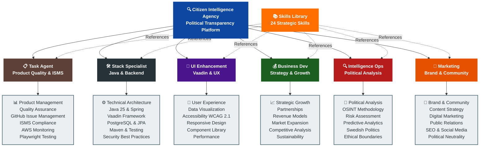
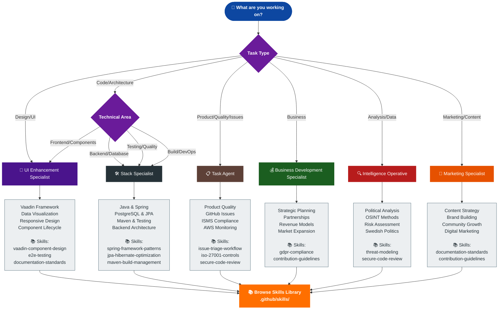

# 🤖 Custom Agent Profiles

This directory contains custom agent profiles for GitHub Copilot, designed to provide domain-specific expertise for the Citizen Intelligence Agency project.

## 📋 Overview

Each agent profile is a Markdown file with YAML frontmatter that defines specialized expertise. When working on tasks related to a specific domain, GitHub Copilot can leverage these profiles to provide more informed and contextual assistance.

## 🎯 Agent Ecosystem

This diagram shows how the six specialized agents work together to support the Citizen Intelligence Agency project. Each agent has a distinct role and area of expertise.


```mermaid
graph TB
    CIA[🔍 Citizen Intelligence Agency<br/>Political Transparency Platform]
    Skills[📚 Skills Library<br/>24 Strategic Skills]
    
    CIA --> Task[📋 Task Agent<br/>Product Quality & ISMS]
    CIA --> Stack[🛠️ Stack Specialist<br/>Java & Backend]
    CIA --> UI[🎨 UI Enhancement<br/>Vaadin & UX]
    CIA --> Biz[💰 Business Dev<br/>Strategy & Growth]
    CIA --> Intel[🔍 Intelligence Ops<br/>Political Analysis]
    CIA --> Market[📢 Marketing<br/>Brand & Community]
    
    Skills -.->|References| Task
    Skills -.->|References| Stack
    Skills -.->|References| UI
    Skills -.->|References| Biz
    Skills -.->|References| Intel
    Skills -.->|References| Market
    
    Task --> PM[📊 Product Management<br/>Quality Assurance<br/>GitHub Issue Management<br/>ISMS Compliance<br/>AWS Monitoring<br/>Playwright Testing]
    Stack --> Tech[⚙️ Technical Architecture<br/>Java 25 & Spring<br/>Vaadin Framework<br/>PostgreSQL & JPA<br/>Maven & Testing<br/>Security Best Practices]
    UI --> UX[🎨 User Experience<br/>Data Visualization<br/>Accessibility WCAG 2.1<br/>Responsive Design<br/>Component Library<br/>Performance]
    Biz --> Growth[📈 Strategic Growth<br/>Partnerships<br/>Revenue Models<br/>Market Expansion<br/>Competitive Analysis<br/>Sustainability]
    Intel --> Analysis[🔎 Political Analysis<br/>OSINT Methodology<br/>Risk Assessment<br/>Predictive Analytics<br/>Swedish Politics<br/>Ethical Boundaries]
    Market --> Brand[📣 Brand & Community<br/>Content Strategy<br/>Digital Marketing<br/>Public Relations<br/>SEO & Social Media<br/>Political Neutrality]
    
    classDef projectNode fill:#0D47A1,stroke:#0D47A1,stroke-width:4px,color:#fff,font-weight:bold
    classDef skillsNode fill:#FF6F00,stroke:#FF6F00,stroke-width:4px,color:#fff,font-weight:bold
    classDef taskNode fill:#5D4037,stroke:#5D4037,stroke-width:3px,color:#fff,font-weight:bold
    classDef stackNode fill:#263238,stroke:#263238,stroke-width:3px,color:#fff,font-weight:bold
    classDef uiNode fill:#4A148C,stroke:#4A148C,stroke-width:3px,color:#fff,font-weight:bold
    classDef bizNode fill:#1B5E20,stroke:#1B5E20,stroke-width:3px,color:#fff,font-weight:bold
    classDef intelNode fill:#B71C1C,stroke:#B71C1C,stroke-width:3px,color:#fff,font-weight:bold
    classDef marketNode fill:#E65100,stroke:#E65100,stroke-width:3px,color:#fff,font-weight:bold
    classDef detailNode fill:#ECEFF1,stroke:#546E7A,stroke-width:2px,color:#263238
    
    class CIA projectNode
    class Skills skillsNode
    class Task taskNode
    class Stack stackNode
    class UI uiNode
    class Biz bizNode
    class Intel intelNode
    class Market marketNode
    class PM,Tech,UX,Growth,Analysis,Brand detailNode
```

### Agent Color Coding
- 🔵 **Blue** - Main Project
- 🟠 **Orange** - Skills Library (referenced by all agents)
- 🟤 **Brown** - Task Agent (Product & Quality)
- ⚫ **Dark Gray** - Stack Specialist (Backend)
- 🟣 **Purple** - UI Enhancement (Frontend)
- 🟢 **Green** - Business Development (Strategy)
- 🔴 **Red** - Intelligence Operative (Analysis)
- 🟧 **Dark Orange** - Marketing Specialist (Brand)

## 🤖 Available Agents

### 📋 Task Agent
**File**: [task-agent.md](task-agent.md)  
**Expertise**: Product Management, Quality Assurance, GitHub Operations, ISMS Compliance, AWS Monitoring, Playwright Testing

Expert in continuous product improvement across quality, UI/UX, security, and ISMS compliance. Creates actionable GitHub issues and coordinates with specialized agents using AWS, Playwright, and GitHub MCP integrations.

**Use Cases**:
- 📊 Product quality monitoring and issue identification
- 🎯 GitHub issue creation with proper categorization and assignment
- 🔍 UI/UX testing with Playwright (screenshots, accessibility)
- 🔐 ISMS compliance tracking (ISO 27001, NIST CSF, CIS Controls)
- ☁️ AWS monitoring via CloudWatch and cost optimization
- 🤝 Agent coordination and task delegation
- 📈 Quality metrics and KPI tracking
- 🛡️ Security vulnerability management

### 🛠️ Stack Specialist
**File**: [stack-specialist.md](stack-specialist.md)  
**Expertise**: Java 21, Spring Framework, Vaadin, Hibernate/JPA, PostgreSQL, Maven, Testing

Expert in the technical architecture and implementation details of the Java-based stack. Provides guidance on framework usage, database optimization, and testing strategies.

**Use Cases**:
- ⚙️ Architecture decisions and design patterns
- 🔧 Spring configuration and dependency injection
- 💾 JPA/Hibernate optimization and query tuning
- 🎨 Vaadin UI component development
- 🗄️ PostgreSQL database design and performance
- 🧪 Testing strategies and test coverage
- 🏗️ Maven build configuration
- 🔍 Technical troubleshooting

### 🎨 UI Enhancement Specialist
**File**: [ui-enhancement-specialist.md](ui-enhancement-specialist.md)  
**Expertise**: Vaadin Framework, Data Visualization, UI/UX Design, Responsive Design, Accessibility

Expert in creating exceptional user experiences for political data visualization. Focuses on accessibility, responsive design, and clear data presentation.

**Use Cases**:
- 🖼️ UI/UX design improvements
- 📊 Data visualization (charts, dashboards, infographics)
- 📱 Responsive design for mobile and desktop
- ♿ Accessibility (WCAG 2.1 AA compliance)
- ⚡ Frontend performance optimization
- 🎭 Vaadin component development
- 🎯 User flow optimization

### 💰 Business Development Specialist
**File**: [business-development-specialist.md](business-development-specialist.md)  
**Expertise**: Strategic Planning, Partnership Development, Revenue Models, Market Expansion

Expert in strategic growth, sustainability planning, and building partnerships. Focuses on revenue generation while maintaining the platform's democratic mission.

**Use Cases**:
- 📈 Strategic planning and roadmap development
- 🤝 Partnership development (government, NGO, academic)
- 💵 Revenue model design and pricing strategy
- 🌍 Market expansion and localization
- 🎯 Competitive analysis and positioning
- 👥 Customer segmentation and personas
- 🚀 Go-to-market strategy

### 🔍 Intelligence Operative
**File**: [intelligence-operative.md](intelligence-operative.md)  
**Expertise**: Political Science, OSINT, Intelligence Analysis, Behavioral Analysis, Swedish Politics

Expert in political intelligence analysis using open-source intelligence (OSINT) methodologies. Specializes in Swedish political system analysis while maintaining strict ethical boundaries.

**Use Cases**:
- 📊 Political data analysis and pattern recognition
- 🔎 Intelligence analysis methodologies (ACH, SWOT)
- 🎯 Risk assessment and threat modeling
- 📈 Predictive analytics and forecasting
- 🇸🇪 Swedish political system expertise
- 🌐 OSINT techniques and data integration
- 🛡️ Counter-disinformation analysis

### 📢 Marketing Specialist
**File**: [marketing-specialist.md](marketing-specialist.md)  
**Expertise**: Digital Marketing, Content Strategy, Community Building, Brand Positioning

Expert in building awareness and engagement while maintaining political neutrality. Focuses on mission-driven marketing and community development.

**Use Cases**:
- 📝 Content strategy and creation
- 🔍 SEO and organic growth
- 📱 Social media strategy
- 📰 Public relations and press coverage
- 👥 Community building and engagement
- 🎨 Brand development and positioning
- 📊 Marketing analytics and optimization

## 📚 Skills Library Integration

### What Are Agent Skills?

Agent Skills are modular, reusable knowledge modules that teach GitHub Copilot how to perform specialized tasks. Introduced in December 2025, skills provide strategic, rule-based guidance that agents can reference during task execution.

**Location**: `.github/skills/` directory  
**Count**: 24 comprehensive skills  
**Total Content**: ~348KB of strategic guidance  
**License**: Apache 2.0

### Skills Categories

Our skills library covers 6 major categories:

#### 🔒 Security-by-Design (5 skills)
- **secure-code-review** - OWASP Top 10, SAST/DAST patterns
- **threat-modeling** - STRIDE framework, attack trees, security architecture
- **secrets-management** - Never commit secrets, HashiCorp Vault usage
- **input-validation** - Sanitization, XSS prevention, SQL injection prevention
- **crypto-best-practices** - AES-256, bcrypt, Argon2, TLS 1.3

#### ✅ ISMS Compliance (5 skills)
- **iso-27001-controls** - Annex A control implementation verification
- **nist-csf-mapping** - Cybersecurity Framework 2.0 alignment
- **cis-controls** - CIS Controls v8 benchmark compliance
- **gdpr-compliance** - Privacy by design, data subject rights
- **security-documentation** - Required security architecture docs

#### 🧪 Testing & Quality (4 skills)
- **unit-testing-patterns** - JUnit 5, Mockito, 80% coverage standard
- **integration-testing** - Spring Test, TestContainers, database testing
- **e2e-testing** - Selenium WebDriver, Playwright patterns
- **code-quality-checks** - SonarCloud, CodeQL, CheckStyle integration

#### 🏗️ Architecture & Design (4 skills)
- **spring-framework-patterns** - Dependency injection, transactions, AOP
- **jpa-hibernate-optimization** - Entity design, N+1 prevention, caching
- **vaadin-component-design** - UI components, data binding, lifecycle
- **c4-architecture-documentation** - C4 model diagrams, documentation

#### 🚀 CI/CD & DevOps (3 skills)
- **github-actions-workflows** - CI/CD pipeline patterns
- **maven-build-management** - Multi-module builds, dependency management
- **postgresql-operations** - Schema migrations, performance tuning

#### 🌐 Open Source & Community (3 skills)
- **contribution-guidelines** - PR workflow, code review standards
- **documentation-standards** - Markdown, Mermaid diagrams, clarity
- **issue-triage-workflow** - Labeling, assignment, prioritization

### Agent-Skills Matrix

This table shows which skills are most relevant for each agent:

#### Security & ISMS Skills

| Skill | Task Agent | Stack Specialist | UI Enhancement | Intelligence | Business Dev | Marketing |
|-------|:----------:|:----------------:|:--------------:|:------------:|:------------:|:---------:|
| secure-code-review | ✅ | ✅ | ✅ | ✅ | ✅ | ⚪ |
| threat-modeling | ✅ | ✅ | ✅ | ✅ | ✅ | ✅ |
| secrets-management | ✅ | ✅ | ✅ | ✅ | ✅ | ✅ |
| input-validation | ✅ | ✅ | ✅ | ✅ | ✅ | ✅ |
| crypto-best-practices | ✅ | ✅ | ⚪ | ✅ | ✅ | ✅ |
| iso-27001-controls | ✅ | ✅ | ✅ | ✅ | ✅ | ✅ |
| nist-csf-mapping | ✅ | ✅ | ✅ | ✅ | ✅ | ✅ |
| cis-controls | ✅ | ✅ | ✅ | ✅ | ✅ | ✅ |
| gdpr-compliance | ✅ | ✅ | ✅ | ✅ | ✅ | ✅ |
| security-documentation | ✅ | ✅ | ✅ | ✅ | ✅ | ✅ |

#### Testing & Quality Skills

| Skill | Task Agent | Stack Specialist | UI Enhancement | Intelligence | Business Dev | Marketing |
|-------|:----------:|:----------------:|:--------------:|:------------:|:------------:|:---------:|
| unit-testing-patterns | ✅ | ✅ | ✅ | ⚪ | ⚪ | ⚪ |
| integration-testing | ✅ | ✅ | ✅ | ⚪ | ⚪ | ⚪ |
| e2e-testing | ✅ | ⚪ | ✅ | ⚪ | ⚪ | ✅ |
| code-quality-checks | ✅ | ✅ | ✅ | ⚪ | ⚪ | ✅ |

#### Architecture & Framework Skills

| Skill | Task Agent | Stack Specialist | UI Enhancement | Intelligence | Business Dev | Marketing |
|-------|:----------:|:----------------:|:--------------:|:------------:|:------------:|:---------:|
| spring-framework-patterns | ⚪ | ✅ | ✅ | ⚪ | ⚪ | ⚪ |
| jpa-hibernate-optimization | ⚪ | ✅ | ⚪ | ⚪ | ⚪ | ⚪ |
| vaadin-component-design | ⚪ | ✅ | ✅ | ⚪ | ⚪ | ⚪ |
| c4-architecture-documentation | ✅ | ✅ | ✅ | ✅ | ✅ | ⚪ |

#### DevOps & Infrastructure Skills

| Skill | Task Agent | Stack Specialist | UI Enhancement | Intelligence | Business Dev | Marketing |
|-------|:----------:|:----------------:|:--------------:|:------------:|:------------:|:---------:|
| github-actions-workflows | ✅ | ✅ | ⚪ | ⚪ | ⚪ | ✅ |
| maven-build-management | ✅ | ✅ | ⚪ | ⚪ | ⚪ | ⚪ |
| postgresql-operations | ✅ | ✅ | ⚪ | ⚪ | ⚪ | ⚪ |

#### Community & Documentation Skills

| Skill | Task Agent | Stack Specialist | UI Enhancement | Intelligence | Business Dev | Marketing |
|-------|:----------:|:----------------:|:--------------:|:------------:|:------------:|:---------:|
| contribution-guidelines | ✅ | ✅ | ✅ | ✅ | ✅ | ✅ |
| documentation-standards | ✅ | ✅ | ✅ | ✅ | ✅ | ✅ |
| issue-triage-workflow | ✅ | ⚪ | ⚪ | ⚪ | ⚪ | ⚪ |

#### Intelligence & OSINT Skills (10 specialized skills)

| Skill | Task Agent | Stack Specialist | UI Enhancement | Intelligence | Business Dev | Marketing |
|-------|:----------:|:----------------:|:--------------:|:------------:|:------------:|:---------:|
| political-science-analysis | ⚪ | ⚪ | ⚪ | ✅ | ✅ | ✅ |
| osint-methodologies | ⚪ | ⚪ | ⚪ | ✅ | ✅ | ⚪ |
| intelligence-analysis-techniques | ⚪ | ⚪ | ⚪ | ✅ | ⚪ | ⚪ |
| swedish-political-system | ⚪ | ⚪ | ⚪ | ✅ | ✅ | ✅ |
| data-science-for-intelligence | ⚪ | ⚪ | ⚪ | ✅ | ⚪ | ⚪ |
| electoral-analysis | ⚪ | ⚪ | ⚪ | ✅ | ⚪ | ⚪ |
| behavioral-analysis | ⚪ | ⚪ | ⚪ | ✅ | ⚪ | ⚪ |
| strategic-communication-analysis | ⚪ | ⚪ | ⚪ | ✅ | ⚪ | ⚪ |
| legislative-monitoring | ⚪ | ⚪ | ⚪ | ✅ | ⚪ | ⚪ |
| risk-assessment-frameworks | ⚪ | ⚪ | ⚪ | ✅ | ⚪ | ⚪ |

**Legend**: ✅ Primary use | ⚪ Occasional use

### Skill Usage Summary by Agent

**Task Agent (23 skills)**:
- All 10 security/ISMS skills
- All 4 testing/quality skills
- All 3 architecture documentation skills
- All 3 DevOps/infrastructure skills
- All 3 community/documentation skills

**Stack Specialist (22 skills)**:
- All 10 security/ISMS skills
- All 4 testing/quality skills
- All 4 architecture/framework skills
- All 3 DevOps/infrastructure skills
- 1 community skill (documentation-standards)

**UI Enhancement Specialist (17 skills)**:
- All 10 security/ISMS skills (especially input-validation for XSS)
- 3 testing/quality skills (unit, integration, e2e)
- 3 architecture skills (vaadin, spring, c4-docs)
- 1 community skill (documentation-standards)

**Intelligence Operative (21 skills)**:
- All 10 security/ISMS skills (GDPR critical for political data)
- All 10 intelligence/OSINT skills (core competency)
- 1 documentation skill

**Business Development Specialist (16 skills)**:
- All 10 security/ISMS skills (critical for B2B/B2G)
- 3 intelligence skills (market context)
- 3 community/documentation skills

**Marketing Specialist (15 skills)**:
- All 10 security/ISMS skills (GDPR for marketing)
- 2 testing skills (e2e, code-quality for website)
- 3 community/intelligence skills (audience understanding)

**Total**: 34 comprehensive skills across 6 specialized agents

### How Agents Use Skills

1. **Contextual Loading**: Copilot automatically loads relevant skills based on task
2. **Reference in Guidance**: Agents reference skills in recommendations
3. **Pattern Application**: Agents follow patterns and checklists from skills
4. **User Education**: Agents teach users about applicable skills
5. **Issue Documentation**: Skills are linked in GitHub issues

### Using Skills Manually

While agents automatically reference skills, developers can explicitly invoke them:

```markdown
@copilot Use the secure-code-review skill to analyze this authentication code
```

```markdown
@copilot Apply the jpa-hibernate-optimization skill to review these queries
```

### Skills Benefits

✅ **Reduced Ambiguity** - Prescriptive, rule-based guidance  
✅ **Security First** - Defense-in-depth principles throughout  
✅ **ISMS Aligned** - Full ISO 27001, NIST CSF, CIS Controls mapping  
✅ **Composable** - Skills reference each other  
✅ **Maintainable** - Clear structure, version controlled  
✅ **Actionable** - Specific code examples and patterns  
✅ **Consistent** - Same patterns across all agents

### Skills Documentation

**Full Documentation**: [.github/skills/README.md](../skills/README.md)

Each skill includes:
- Purpose and triggering scenarios
- Actionable checklists (✅/❌ examples)
- Code examples (good vs bad patterns)
- ISMS compliance mappings
- References to official documentation

## 🔧 Agent Profile Format

Each agent profile is a Markdown file with YAML frontmatter:

```markdown
---
name: agent-name
description: Brief description (max 200 chars)
tools: ["view", "edit", "create", "bash", "search_code"]
---

Agent prompt content (expertise, responsibilities, best practices)...
```

**Frontmatter properties**: `name` (lowercase with hyphens), `description` (max 200 chars), `tools` (array of tool aliases; omit for all tools).

**Available tools**: `view`, `edit`, `create`, `bash`, `search_code`, `web`, `playwright-browser_*`, `custom-agent`, `todo`.

## 📁 Essential Context Files

All agents include a standardized section instructing them to read these critical files at the start of each task:

| File | Purpose |
|------|---------|
| [README.md](../../README.md) | Project mission, features, quality metrics |
| [copilot-setup-steps.yml](../workflows/copilot-setup-steps.yml) | Dev environment: Java 25, Maven 3.9.9, PostgreSQL 18, build commands, workflow permissions |
| [copilot-mcp-config.json](../copilot-mcp-config.json) | MCP servers (github, filesystem, postgres, git), coding standards, security rules, external APIs |
| [.github/skills/](../skills/) | 24 strategic skills for security, ISMS, testing, architecture |

Reading these files ensures agents understand the development environment, available tools, build commands, coding standards, security practices, and project architecture.

## 🆕 Agent Enhancements (January 2026)

All agents have been enhanced with:

### GitHub MCP Insiders Configuration
- Full Model Context Protocol setup
- GitHub Insiders API access
- Advanced toolsets (all tools, all features)
- Cross-repository access via PAT

### ISMS Compliance Integration
- **ISO 27001:2022** - Annex A controls enforcement
- **NIST CSF 2.0** - Framework function mapping
- **CIS Controls v8** - Benchmark compliance
- **GDPR** - Data protection requirements
- **NIS2** - Critical infrastructure requirements

### Decision Frameworks
- Clear security decision criteria
- Code quality thresholds
- Architecture patterns enforcement
- Performance optimization guidelines
- **Result**: Less ambiguity, more decisive action

### Skills Library Integration
- Each agent references 10+ relevant skills
- Automatic skill loading by Copilot
- Consistent patterns across agents
- Security-by-design in all guidance

### Enhanced Documentation
- Mandatory context file reading
- Security-first approach emphasized
- Compliance mapping in all guidance
- Clear acceptance/rejection criteria

## 📚 Using These Profiles

- **Developers**: Reference the appropriate specialist profile for your task and follow its best practices
- **Copilot**: Profiles provide domain-specific context, standards, and expertise boundaries
- **Contributors**: Read the relevant profile before contributing to that area

## 🔄 Maintaining These Profiles

Update profiles when the technology stack, architecture, business model, or best practices change. Keep profiles aligned with project documentation. Maintainers and domain experts can update directly; contributors via pull requests.

## 🔗 Integration with Project Documentation

These agent profiles complement and reference the main project documentation:

- 🏗️ [Architecture](../../ARCHITECTURE.md) - System design and structure
- 📊 [SWOT Analysis](../../SWOT.md) - Strategic context
- 💻 [Tech Stack](../../techstack.md) - Technology inventory
- 🔐 [Security Architecture](../../SECURITY_ARCHITECTURE.md) - Security design
- 🗄️ [Data Model](../../DATA_MODEL.md) - Entity relationships
- ⏳ [End-of-Life Strategy](../../End-of-Life-Strategy.md) - Technology lifecycle
- 💰 [Financial Security Plan](../../FinancialSecurityPlan.md) - AWS and security costs

## 💡 Philosophy

These profiles embody: **Technical Excellence** (best practices, tested/secure code, modern patterns), **Democratic Mission** (transparency, political neutrality, informed citizenship), **Open Source Values** (knowledge sharing, welcoming contributors, community building), and **Ethical Standards** (privacy, responsible data use, societal impact).

## 🤝 Contributing

To improve profiles: identify what's missing, draft changes, and submit a PR with rationale.

## 🎯 Agent Selection Guide

Use this flowchart to help select the right agent for your task:


```mermaid
flowchart TD
    Start([🎯 What are you working on?]) --> Type{Task Type}
    
    Type -->|Code/Architecture| Tech{Technical Area}
    Type -->|Design/UI| UI[🎨 UI Enhancement Specialist]
    Type -->|Business| Biz[💰 Business Development Specialist]
    Type -->|Analysis/Data| Intel[🔍 Intelligence Operative]
    Type -->|Marketing/Content| Market[📢 Marketing Specialist]
    Type -->|Product/Quality/Issues| Task[📋 Task Agent]
    
    Tech -->|Backend/Database| Stack[🛠️ Stack Specialist]
    Tech -->|Frontend/Components| UI
    Tech -->|Testing/Quality| Stack
    Tech -->|Build/DevOps| Stack
    
    UI --> UIDesc[Vaadin Framework<br/>Data Visualization<br/>Responsive Design<br/>Component Lifecycle<br/><br/>📚 Skills:<br/>vaadin-component-design<br/>e2e-testing<br/>documentation-standards]
    Stack --> StackDesc[Java & Spring<br/>PostgreSQL & JPA<br/>Maven & Testing<br/>Backend Architecture<br/><br/>📚 Skills:<br/>spring-framework-patterns<br/>jpa-hibernate-optimization<br/>maven-build-management]
    Task --> TaskDesc[Product Quality<br/>GitHub Issues<br/>ISMS Compliance<br/>AWS Monitoring<br/><br/>📚 Skills:<br/>issue-triage-workflow<br/>iso-27001-controls<br/>secure-code-review]
    Biz --> BizDesc[Strategic Planning<br/>Partnerships<br/>Revenue Models<br/>Market Expansion<br/><br/>📚 Skills:<br/>gdpr-compliance<br/>contribution-guidelines]
    Intel --> IntelDesc[Political Analysis<br/>OSINT Methods<br/>Risk Assessment<br/>Swedish Politics<br/><br/>📚 Skills:<br/>threat-modeling<br/>secure-code-review]
    Market --> MarketDesc[Content Strategy<br/>Brand Building<br/>Community Growth<br/>Digital Marketing<br/><br/>📚 Skills:<br/>documentation-standards<br/>contribution-guidelines]
    
    UIDesc --> Skills[📚 Browse Skills Library<br/>.github/skills/]
    StackDesc --> Skills
    TaskDesc --> Skills
    BizDesc --> Skills
    IntelDesc --> Skills
    MarketDesc --> Skills
    
    classDef startNode fill:#0D47A1,stroke:#0D47A1,stroke-width:3px,color:#fff,font-weight:bold
    classDef decisionNode fill:#6A1B9A,stroke:#6A1B9A,stroke-width:3px,color:#fff,font-weight:bold
    classDef taskNode fill:#5D4037,stroke:#5D4037,stroke-width:2px,color:#fff
    classDef stackNode fill:#263238,stroke:#263238,stroke-width:2px,color:#fff
    classDef uiNode fill:#4A148C,stroke:#4A148C,stroke-width:2px,color:#fff
    classDef bizNode fill:#1B5E20,stroke:#1B5E20,stroke-width:2px,color:#fff
    classDef intelNode fill:#B71C1C,stroke:#B71C1C,stroke-width:2px,color:#fff
    classDef marketNode fill:#E65100,stroke:#E65100,stroke-width:2px,color:#fff
    classDef descNode fill:#ECEFF1,stroke:#546E7A,stroke-width:1px,color:#263238
    classDef skillsNode fill:#FF6F00,stroke:#FF6F00,stroke-width:2px,color:#fff,font-weight:bold
    
    class Start startNode
    class Type,Tech decisionNode
    class Task taskNode
    class Stack stackNode
    class UI uiNode
    class Biz bizNode
    class Intel intelNode
    class Market marketNode
    class UIDesc,StackDesc,TaskDesc,BizDesc,IntelDesc,MarketDesc descNode
    class Skills skillsNode
```

### How to Use This Guide

1. **Start** by identifying what type of work you're doing
2. **Follow the arrows** based on your specific needs
3. **Select the agent** that best matches your task domain
4. **Reference the agent's profile** for detailed capabilities and best practices
5. **Browse the Skills Library** to understand the patterns and guidelines available

---

**Remember**: 💡 These profiles are living documents that evolve with the project.
