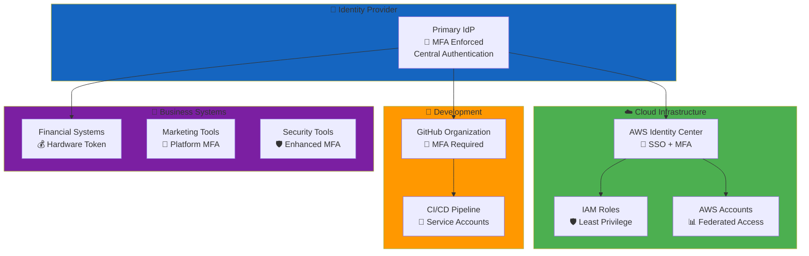
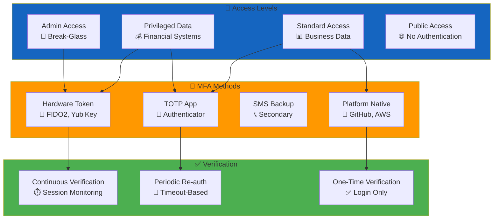
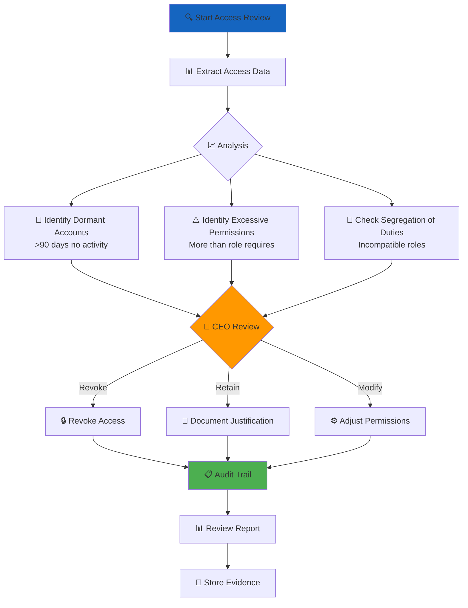

# Access Control Policy Skill

## Purpose

This skill provides systematic guidance for implementing zero-trust access control within the CIA platform, ensuring identity-centric security through role-based access control (RBAC), least privilege principle, multi-factor authentication (MFA), and regular access reviews per ISO 27001 A.5.15, A.8.2, and A.8.3.

## When to Use This Skill

Apply this skill when:
- ✅ Implementing authentication and authorization systems
- ✅ Designing role-based access control (RBAC) models
- ✅ Configuring MFA for privileged accounts
- ✅ Establishing access review procedures
- ✅ Implementing least privilege access controls
- ✅ Setting up identity federation (AWS IAM Identity Center, GitHub SSO)
- ✅ Conducting quarterly access audits
- ✅ Managing privileged access (break-glass procedures)

Do NOT skip for:
- ❌ Internal-only systems (still require authentication)
- ❌ Development environments (may contain production data)
- ❌ Administrative interfaces (highest risk, require MFA)
- ❌ API access (requires API keys, OAuth tokens)

## Zero-Trust Access Architecture

### Identity-Centric Design Principle



### Access Control Matrix

Integration with [Classification Framework](https://github.com/Hack23/ISMS-PUBLIC/blob/main/CLASSIFICATION.md):

| Asset Category | Classification | Access Method | MFA Requirement | Session Timeout | Review Frequency |
|---------------|----------------|---------------|-----------------|-----------------|------------------|
| **RESTRICTED Data** | Extreme | Hardware MFA + Zero Trust | FIDO2 + Backup | 1 hour | Monthly |
| **Cloud Infrastructure** | Very High | Identity Center SSO | Hardware + TOTP | 4 hours | Monthly |
| **Development Platform** | High | Platform MFA + SSH Keys | TOTP + SSH Cert | 8 hours | Quarterly |
| **Financial Systems** | Very High | Provider MFA | Hardware Token | 1 hour | Monthly |
| **Business Intelligence** | Moderate | SSO Integration | TOTP | 24 hours | Semi-Annual |
| **Marketing Platforms** | Public/Internal | Platform Native | Platform MFA | 7 days | Annual |

## Role-Based Access Control (RBAC)

### RBAC Implementation in Spring Security

**Permission Levels and Scope**:

```java
/**
 * RBAC role hierarchy for CIA platform
 * 
 * Implements ISO 27001 A.8.2 (Privileged access rights)
 * 
 * @see <a href="https://github.com/Hack23/ISMS-PUBLIC/blob/main/Access_Control_Policy.md">Access Control Policy</a>
 */
@Configuration
@EnableGlobalMethodSecurity(
    prePostEnabled = true,
    securedEnabled = true,
    jsr250Enabled = true
)
public class SecurityConfig {
    
    @Bean
    public RoleHierarchy roleHierarchy() {
        RoleHierarchyImpl hierarchy = new RoleHierarchyImpl();
        
        // RBAC hierarchy: higher roles inherit lower role permissions
        hierarchy.setHierarchy(
            "ROLE_ADMIN > ROLE_PARTY_ANALYST\n" +
            "ROLE_PARTY_ANALYST > ROLE_AUTHENTICATED_USER\n" +
            "ROLE_AUTHENTICATED_USER > ROLE_GUEST"
        );
        
        return hierarchy;
    }
    
    @Bean
    public SecurityFilterChain filterChain(HttpSecurity http) throws Exception {
        http
            .authorizeHttpRequests(authz -> authz
                // PUBLIC: No authentication required
                .requestMatchers("/api/public/**").permitAll()
                .requestMatchers("/", "/login", "/register").permitAll()
                
                // INTERNAL: Authentication required
                .requestMatchers("/api/internal/**").authenticated()
                
                // CONFIDENTIAL: Specific roles required
                .requestMatchers("/api/party-financial/**")
                    .hasRole("PARTY_ANALYST")
                
                // RESTRICTED: Admin only with MFA
                .requestMatchers("/api/admin/**")
                    .hasRole("ADMIN")
                    .access("@mfaVerifier.isMfaAuthenticated(authentication)")
                
                // Default: Require authentication
                .anyRequest().authenticated()
            )
            .sessionManagement(session -> session
                .sessionCreationPolicy(SessionCreationPolicy.IF_REQUIRED)
                // Session timeout based on access level
                .maximumSessions(1)
                .maxSessionsPreventsLogin(true)
            )
            .csrf(csrf -> csrf
                .csrfTokenRepository(CookieCsrfTokenRepository.withHttpOnlyFalse())
            );
        
        return http.build();
    }
}
```

### Role Definitions

| Role | Scope | Permissions | Use Cases | Access Pattern |
|------|-------|-------------|-----------|----------------|
| **ROLE_ADMIN** | System-wide | Full access, user management, security config | Emergency operations, security incidents | Break-glass only |
| **ROLE_PARTY_ANALYST** | Party data | Read/write party financial records, voting analysis | Political analysis, report generation | Daily operations |
| **ROLE_AUTHENTICATED_USER** | Public + internal | Read public data, basic operations | Registered users, researchers | Standard usage |
| **ROLE_GUEST** | Public only | Read public voting records, party information | Anonymous visitors | Public access |

### Least Privilege Enforcement

```java
/**
 * Service-level access control with least privilege
 * 
 * Implements ISO 27001 A.8.2 - Privileged access rights
 */
@Service
public class PartyFinancialService {
    
    private final AuditLogger auditLogger;
    private final PartyFinancialRepository repository;
    
    // CONFIDENTIAL data requires specific role
    @PreAuthorize("hasRole('PARTY_ANALYST') or hasRole('ADMIN')")
    @PostAuthorize("returnObject.userId == authentication.principal.username or hasRole('ADMIN')")
    public PartyFinancialRecord getFinancialRecord(Long recordId) {
        auditLogger.logAccess(
            "CONFIDENTIAL", 
            "party_financial_record", 
            recordId,
            SecurityContextHolder.getContext().getAuthentication().getName()
        );
        
        return repository.findById(recordId)
            .orElseThrow(() -> new AccessDeniedException("Record not found or access denied"));
    }
    
    // Write operations require explicit role check
    @PreAuthorize("hasRole('PARTY_ANALYST')")
    @Audited(action = "CREATE", resourceType = "party_financial_record")
    public PartyFinancialRecord createRecord(PartyFinancialRecord record) {
        // Validation and business logic
        return repository.save(record);
    }
    
    // Admin-only operations with MFA verification
    @PreAuthorize("hasRole('ADMIN') and @mfaVerifier.isMfaAuthenticated(authentication)")
    @Audited(action = "DELETE", resourceType = "party_financial_record", severity = "HIGH")
    public void deleteRecord(Long recordId) {
        auditLogger.logPrivilegedAction(
            "DELETE_FINANCIAL_RECORD",
            recordId,
            SecurityContextHolder.getContext().getAuthentication().getName()
        );
        
        repository.deleteById(recordId);
    }
}
```

## Multi-Factor Authentication (MFA)

### MFA Requirements by Access Level



### MFA Implementation Example

```java
/**
 * MFA verification service
 * 
 * Implements ISO 27001 A.5.17 - Authentication information
 */
@Service
public class MfaVerificationService {
    
    private final TotpService totpService;
    private final AuditLogger auditLogger;
    
    /**
     * Verify MFA token for privileged operations
     * 
     * @param authentication Current authentication
     * @return true if MFA verified within acceptable window
     */
    public boolean isMfaAuthenticated(Authentication authentication) {
        if (authentication == null || !authentication.isAuthenticated()) {
            return false;
        }
        
        Object principal = authentication.getPrincipal();
        if (!(principal instanceof UserDetails)) {
            return false;
        }
        
        UserDetails user = (UserDetails) principal;
        String username = user.getUsername();
        
        // Check if MFA verified within last hour
        LocalDateTime mfaVerifiedAt = getMfaVerificationTime(username);
        LocalDateTime now = LocalDateTime.now();
        
        if (mfaVerifiedAt == null || 
            Duration.between(mfaVerifiedAt, now).toHours() >= 1) {
            auditLogger.logMfaRequired(username);
            return false;
        }
        
        return true;
    }
    
    /**
     * Verify TOTP code and update verification timestamp
     */
    public boolean verifyTotpCode(String username, String totpCode) {
        boolean isValid = totpService.verifyCode(username, totpCode);
        
        if (isValid) {
            updateMfaVerificationTime(username, LocalDateTime.now());
            auditLogger.logMfaSuccess(username);
        } else {
            auditLogger.logMfaFailure(username);
        }
        
        return isValid;
    }
    
    /**
     * Require MFA re-verification for privileged operation
     */
    public void requireMfaReVerification(String username) {
        clearMfaVerificationTime(username);
        auditLogger.logMfaRequired(username, "PRIVILEGED_OPERATION");
    }
}

/**
 * MFA controller for verification flow
 */
@RestController
@RequestMapping("/api/auth/mfa")
public class MfaController {
    
    private final MfaVerificationService mfaService;
    
    @PostMapping("/verify")
    @PreAuthorize("isAuthenticated()")
    public ResponseEntity<MfaVerificationResponse> verifyMfa(
            @RequestBody @Valid MfaVerificationRequest request,
            Authentication authentication) {
        
        String username = authentication.getName();
        boolean isValid = mfaService.verifyTotpCode(username, request.getTotpCode());
        
        if (isValid) {
            return ResponseEntity.ok(new MfaVerificationResponse(true, "MFA verified"));
        } else {
            return ResponseEntity.status(HttpStatus.UNAUTHORIZED)
                .body(new MfaVerificationResponse(false, "Invalid MFA code"));
        }
    }
    
    @GetMapping("/status")
    @PreAuthorize("isAuthenticated()")
    public ResponseEntity<MfaStatusResponse> getMfaStatus(Authentication authentication) {
        String username = authentication.getName();
        boolean isMfaVerified = mfaService.isMfaAuthenticated(authentication);
        
        return ResponseEntity.ok(new MfaStatusResponse(isMfaVerified));
    }
}
```

### Session Management by Classification

```java
/**
 * Dynamic session timeout based on data classification
 */
@Configuration
public class SessionConfig {
    
    @Bean
    public SessionRegistry sessionRegistry() {
        return new SessionRegistryImpl();
    }
    
    /**
     * Configure session timeout based on access level
     */
    @Bean
    public HttpSessionEventPublisher httpSessionEventPublisher() {
        return new HttpSessionEventPublisher();
    }
    
    /**
     * Session timeout customizer
     */
    @Component
    public class SessionTimeoutCustomizer implements ServletContextInitializer {
        
        @Override
        public void onStartup(ServletContext servletContext) throws ServletException {
            // Default session timeout: 30 minutes
            servletContext.setSessionTimeout(30);
        }
    }
    
    /**
     * Dynamic timeout adjustment based on role
     */
    @Component
    public class DynamicSessionTimeoutManager {
        
        public int getSessionTimeout(Authentication authentication) {
            Collection<? extends GrantedAuthority> authorities = 
                authentication.getAuthorities();
            
            // ADMIN: 1 hour (RESTRICTED data access)
            if (authorities.stream().anyMatch(a -> a.getAuthority().equals("ROLE_ADMIN"))) {
                return 60;
            }
            
            // PARTY_ANALYST: 4 hours (CONFIDENTIAL data access)
            if (authorities.stream().anyMatch(a -> a.getAuthority().equals("ROLE_PARTY_ANALYST"))) {
                return 240;
            }
            
            // AUTHENTICATED_USER: 8 hours (INTERNAL data access)
            if (authorities.stream().anyMatch(a -> a.getAuthority().equals("ROLE_AUTHENTICATED_USER"))) {
                return 480;
            }
            
            // Default: 30 minutes
            return 30;
        }
    }
}
```

## Quarterly Access Reviews

### Access Review Procedure



### Automated Access Review Script

```bash
#!/bin/bash
# Quarterly Access Review Script
# Implements ISO 27001 A.5.18 - Access rights review
#
# Usage: ./quarterly-access-review.sh

set -euo pipefail

REPORT_DATE=$(date +%Y-%m-%d)
REVIEW_PERIOD_DAYS=90
REPORT_FILE="access-review-${REPORT_DATE}.md"

echo "# Quarterly Access Review - ${REPORT_DATE}" > "${REPORT_FILE}"
echo "" >> "${REPORT_FILE}"

# 1. Identify dormant accounts
echo "## Dormant Accounts (>90 days inactive)" >> "${REPORT_FILE}"
echo "" >> "${REPORT_FILE}"

# AWS IAM Access Analyzer - unused access detection
aws accessanalyzer list-analyzers --region us-east-1 --output json | \
  jq -r '.analyzers[] | select(.status=="ACTIVE") | .name' | \
  while read -r analyzer; do
    echo "### AWS Analyzer: ${analyzer}" >> "${REPORT_FILE}"
    
    # Get findings for unused access
    aws accessanalyzer list-findings \
      --analyzer-arn "arn:aws:access-analyzer:us-east-1:ACCOUNT_ID:analyzer/${analyzer}" \
      --filter 'resourceType=AWS::IAM::User,status=ACTIVE' \
      --region us-east-1 \
      --output json | \
      jq -r '.findings[] | "- User: \(.resource) - Last accessed: \(.analyzedAt)"' \
      >> "${REPORT_FILE}"
  done

echo "" >> "${REPORT_FILE}"

# 2. GitHub dormant users
echo "## GitHub Dormant Users" >> "${REPORT_FILE}"
echo "" >> "${REPORT_FILE}"

gh api orgs/Hack23/members --paginate | \
  jq -r '.[].login' | \
  while read -r user; do
    # Get last activity
    LAST_ACTIVITY=$(gh api "users/${user}/events" --jq '.[0].created_at' 2>/dev/null || echo "never")
    
    if [[ "${LAST_ACTIVITY}" == "never" ]] || \
       [[ $(date -d "${LAST_ACTIVITY}" +%s) -lt $(date -d "${REVIEW_PERIOD_DAYS} days ago" +%s) ]]; then
      echo "- ${user}: Last activity ${LAST_ACTIVITY}" >> "${REPORT_FILE}"
    fi
  done

echo "" >> "${REPORT_FILE}"

# 3. Privileged access audit
echo "## Privileged Access Audit" >> "${REPORT_FILE}"
echo "" >> "${REPORT_FILE}"

# AWS IAM users with admin policies
echo "### AWS Admin Users" >> "${REPORT_FILE}"
aws iam list-users --output json | \
  jq -r '.Users[].UserName' | \
  while read -r user; do
    # Check for admin policies
    aws iam list-attached-user-policies --user-name "${user}" --output json | \
      jq -r '.AttachedPolicies[] | select(.PolicyName | contains("Admin")) | .PolicyName' | \
      while read -r policy; do
        echo "- ${user}: ${policy}" >> "${REPORT_FILE}"
      done
  done

echo "" >> "${REPORT_FILE}"

# 4. MFA compliance
echo "## MFA Compliance Status" >> "${REPORT_FILE}"
echo "" >> "${REPORT_FILE}"

# AWS IAM users without MFA
echo "### AWS Users Without MFA" >> "${REPORT_FILE}"
aws iam list-users --output json | \
  jq -r '.Users[].UserName' | \
  while read -r user; do
    MFA_DEVICES=$(aws iam list-mfa-devices --user-name "${user}" --output json | jq '.MFADevices | length')
    
    if [[ "${MFA_DEVICES}" -eq 0 ]]; then
      echo "- ${user}: No MFA configured" >> "${REPORT_FILE}"
    fi
  done

echo "" >> "${REPORT_FILE}"

# 5. Generate summary
echo "## Review Summary" >> "${REPORT_FILE}"
echo "" >> "${REPORT_FILE}"
echo "- Review Date: ${REPORT_DATE}" >> "${REPORT_FILE}"
echo "- Review Period: Last ${REVIEW_PERIOD_DAYS} days" >> "${REPORT_FILE}"
echo "- Reviewer: CEO" >> "${REPORT_FILE}"
echo "- Next Review Date: $(date -d '+3 months' +%Y-%m-%d)" >> "${REPORT_FILE}"
echo "" >> "${REPORT_FILE}"
echo "## Actions Required" >> "${REPORT_FILE}"
echo "" >> "${REPORT_FILE}"
echo "- [ ] Review and revoke dormant accounts" >> "${REPORT_FILE}"
echo "- [ ] Verify privileged access justifications" >> "${REPORT_FILE}"
echo "- [ ] Enforce MFA for non-compliant users" >> "${REPORT_FILE}"
echo "- [ ] Document decisions in audit trail" >> "${REPORT_FILE}"

echo "Access review report generated: ${REPORT_FILE}"
```

## AWS IAM Access Analyzer Integration

### Continuous Access Monitoring

```yaml
# CloudFormation template for IAM Access Analyzer
Resources:
  AccessAnalyzer:
    Type: AWS::AccessAnalyzer::Analyzer
    Properties:
      AnalyzerName: cia-access-analyzer
      Type: ACCOUNT
      Tags:
        - Key: Purpose
          Value: ContinuousAccessMonitoring
        - Key: ISMSControl
          Value: ISO27001-A.5.18

  # EventBridge rule for access findings
  AccessAnalyzerEventRule:
    Type: AWS::Events::Rule
    Properties:
      Name: access-analyzer-findings
      Description: Alert on new IAM Access Analyzer findings
      EventPattern:
        source:
          - aws.access-analyzer
        detail-type:
          - Access Analyzer Finding
        detail:
          status:
            - ACTIVE
      State: ENABLED
      Targets:
        - Arn: !GetAtt AccessAnalyzerTopic.Arn
          Id: AccessAnalyzerSNS

  # SNS topic for alerts
  AccessAnalyzerTopic:
    Type: AWS::SNS::Topic
    Properties:
      TopicName: access-analyzer-findings
      DisplayName: IAM Access Analyzer Findings
      Subscription:
        - Endpoint: security@hack23.com
          Protocol: email

  # Lambda for automated remediation
  AccessAnalyzerRemediationFunction:
    Type: AWS::Lambda::Function
    Properties:
      FunctionName: access-analyzer-remediation
      Runtime: python3.12
      Handler: index.lambda_handler
      Role: !GetAtt RemediationFunctionRole.Arn
      Code:
        ZipFile: |
          import boto3
          import json
          
          accessanalyzer = boto3.client('accessanalyzer')
          iam = boto3.client('iam')
          
          def lambda_handler(event, context):
              """
              Automated remediation for Access Analyzer findings
              """
              
              finding = event['detail']
              resource = finding['resource']
              finding_type = finding['resourceType']
              
              # Log finding
              print(f"Processing finding for {resource} of type {finding_type}")
              
              # Check if unused access (>90 days)
              if 'UnusedAccess' in finding.get('findingType', ''):
                  # Flag for manual review
                  add_tag_for_review(resource)
              
              # Check for external access
              if 'ExternalAccess' in finding.get('findingType', ''):
                  # Alert and require justification
                  send_alert(resource, finding)
              
              return {
                  'statusCode': 200,
                  'body': json.dumps('Finding processed')
              }
          
          def add_tag_for_review(resource):
              """Tag resource for quarterly review"""
              # Implementation specific to resource type
              pass
          
          def send_alert(resource, finding):
              """Send alert for external access"""
              # Implementation for alerting
              pass
      Timeout: 60
      Tags:
        - Key: ISMSControl
          Value: ISO27001-A.5.18
```

## Segregation of Duties

See [Segregation of Duties Policy](https://github.com/Hack23/ISMS-PUBLIC/blob/main/Segregation_of_Duties_Policy.md) for:
- Incompatible role pairs requiring separation
- Single-person organization compensating controls
- Temporal and tool-based separation mechanisms

**Key Access Control Aspects Supporting SoD**:
- **Least Privilege**: Default to minimum permissions required
- **Time-Limited Elevation**: Admin access with automatic expiration
- **Audit Trail**: All permission changes logged
- **Quarterly Review**: Access permissions reviewed against least privilege

## ISO 27001 Control Mapping

### A.5.15 - Access Control

**Control Objective**: Business requirements for controlling access to information and systems.

**Implementation**:
- ✅ RBAC model with role hierarchy
- ✅ Least privilege enforcement via @PreAuthorize
- ✅ Zero-trust architecture
- ✅ Access control matrix by classification level

### A.8.2 - Privileged Access Rights

**Control Objective**: Allocation and use of privileged access rights restricted and controlled.

**Implementation**:
- ✅ Break-glass procedures for emergency access
- ✅ MFA required for privileged operations
- ✅ Time-limited privileged access
- ✅ Comprehensive audit logging

### A.8.3 - Information Access Restriction

**Control Objective**: Access to information and systems restricted per access control policy.

**Implementation**:
- ✅ Data classification integrated with access controls
- ✅ Row-level security for sensitive data
- ✅ API access controls with OAuth/JWT
- ✅ Network segmentation (security groups)

### A.5.18 - Access Rights Review

**Control Objective**: User access rights reviewed at regular intervals.

**Implementation**:
- ✅ Quarterly automated access reviews
- ✅ AWS IAM Access Analyzer for unused access detection
- ✅ GitHub audit log review
- ✅ Dormant account identification and revocation

## NIST Cybersecurity Framework Mapping

**PR.AC-1**: Identities and credentials issued, managed, verified, revoked
- ✅ Centralized identity provider (AWS Identity Center, GitHub)
- ✅ MFA enforcement for privileged access

**PR.AC-4**: Access permissions managed, incorporating least privilege
- ✅ RBAC with role hierarchy
- ✅ @PreAuthorize annotations for method-level security

**PR.AC-7**: Users, devices authenticated (MFA for remote access)
- ✅ TOTP, FIDO2 hardware tokens
- ✅ Platform-native MFA (GitHub, AWS)

## CIS Controls Mapping

**CIS Control 5**: Account Management
- **5.2**: Use unique passwords - ✅ Spring Security password encoding
- **5.3**: Disable dormant accounts - ✅ Quarterly review script
- **5.4**: Restrict administrator privileges - ✅ Least privilege RBAC
- **5.5**: Establish access restrictions - ✅ Classification-based controls

**CIS Control 6**: Access Control Management
- **6.1**: Establish access granting process - ✅ RBAC role assignment
- **6.2**: Establish access revoking process - ✅ Automated revocation
- **6.7**: Centralize account management - ✅ AWS Identity Center
- **6.8**: Define and maintain role-based access control - ✅ Spring Security RBAC

## Practical Implementation Checklist

### For New Systems

- [ ] Define roles and permissions using RBAC model
- [ ] Implement authentication with Spring Security
- [ ] Configure MFA for privileged accounts
- [ ] Set session timeouts based on data classification
- [ ] Add audit logging for all access events
- [ ] Integrate with AWS IAM Access Analyzer
- [ ] Document access control matrix
- [ ] Test least privilege enforcement

### For Existing Systems

- [ ] Audit current access controls
- [ ] Identify over-privileged accounts
- [ ] Enforce MFA for admin accounts
- [ ] Implement quarterly access reviews
- [ ] Configure AWS IAM Access Analyzer
- [ ] Review and update RBAC roles
- [ ] Document segregation of duties compensating controls

## Related Policies

- [Access Control Policy](https://github.com/Hack23/ISMS-PUBLIC/blob/main/Access_Control_Policy.md) - Detailed access control requirements
- [Segregation of Duties Policy](https://github.com/Hack23/ISMS-PUBLIC/blob/main/Segregation_of_Duties_Policy.md) - SoD compensating controls
- [Information Security Policy](https://github.com/Hack23/ISMS-PUBLIC/blob/main/Information_Security_Policy.md) - Overall security framework
- [Classification Framework](https://github.com/Hack23/ISMS-PUBLIC/blob/main/CLASSIFICATION.md) - Data classification levels

## References

- ISO 27001:2022 - A.5.15 Access Control
- ISO 27001:2022 - A.8.2 Privileged Access Rights
- ISO 27001:2022 - A.8.3 Information Access Restriction
- ISO 27001:2022 - A.5.18 Access Rights Review
- NIST SP 800-53r5 - AC (Access Control) Family
- CIS Controls v8 - Control 5: Account Management
- CIS Controls v8 - Control 6: Access Control Management
