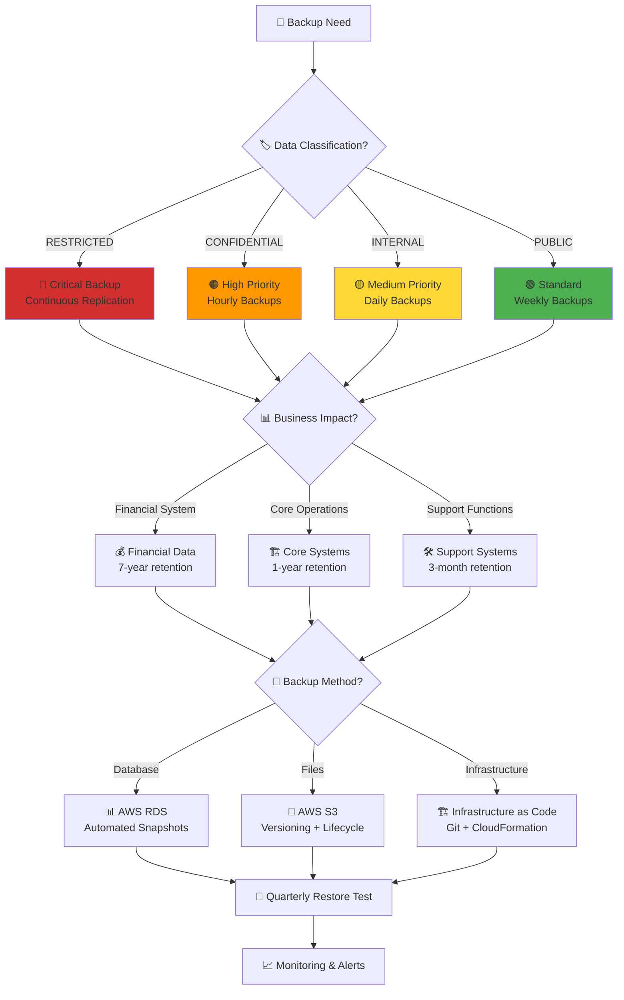

# Backup and Recovery Policy Skill

## Purpose

This skill provides systematic guidance for implementing business continuity and disaster recovery within the CIA platform, ensuring data protection aligns with business impact analysis, RTO/RPO targets, and ISO 27001 Annex A.17 requirements.

## When to Use This Skill

Apply this skill when:
- ✅ Designing backup strategies for new systems or data stores
- ✅ Configuring AWS backup services (RDS snapshots, S3 versioning, EBS backups)
- ✅ Implementing disaster recovery procedures
- ✅ Conducting quarterly backup restore tests
- ✅ Defining RTO (Recovery Time Objective) and RPO (Recovery Point Objective) targets
- ✅ Planning for data retention and archival
- ✅ Responding to data loss incidents
- ✅ Conducting business continuity planning

Do NOT skip for:
- ❌ Development/test environments (may contain production data copies)
- ❌ Temporary data stores (may become permanent)
- ❌ "Easily reproducible" data (validate recovery procedures)
- ❌ Third-party managed services (verify backup capabilities)

## Business Impact-Driven Backup Framework

### RTO/RPO Targets by Classification

| Classification | Business Impact | RPO Target | RTO Target | Backup Frequency | Retention |
|----------------|-----------------|------------|------------|------------------|-----------|
| **RESTRICTED** | Extreme | <15 minutes | <1 hour | Continuous replication | 30 days minimum |
| **CONFIDENTIAL** | Very High | <4 hours | <4 hours | Hourly | 7 years (financial data) |
| **INTERNAL** | Moderate | <24 hours | <24 hours | Daily | 3 years |
| **PUBLIC** | Low | >24 hours | >72 hours | Weekly | Indefinite |

### Backup Strategy Decision Tree



## Backup Strategies

### Full Backup Strategy

**Definition**: Complete copy of all data at a point in time.

**Use Cases**:
- Initial backup establishment
- Monthly comprehensive backups
- Before major system changes
- Regulatory compliance requirements

**AWS Implementation**:
```yaml
# CloudFormation template for full database backup
Resources:
  DatabaseFullBackupFunction:
    Type: AWS::Lambda::Function
    Properties:
      FunctionName: cia-database-full-backup
      Runtime: python3.12
      Handler: index.lambda_handler
      Role: !GetAtt BackupFunctionRole.Arn
      Timeout: 900 # 15 minutes
      Environment:
        Variables:
          RDS_INSTANCE_ID: !Ref CIADatabase
          BACKUP_BUCKET: !Ref BackupBucket
      Code:
        ZipFile: |
          import boto3
          import datetime
          import os
          
          rds = boto3.client('rds')
          
          def lambda_handler(event, context):
              """
              Create full RDS snapshot
              """
              
              instance_id = os.environ['RDS_INSTANCE_ID']
              timestamp = datetime.datetime.now().strftime('%Y%m%d-%H%M%S')
              snapshot_id = f"{instance_id}-full-{timestamp}"
              
              # Create snapshot
              response = rds.create_db_snapshot(
                  DBSnapshotIdentifier=snapshot_id,
                  DBInstanceIdentifier=instance_id,
                  Tags=[
                      {'Key': 'BackupType', 'Value': 'Full'},
                      {'Key': 'CreatedBy', 'Value': 'Automated'},
                      {'Key': 'Retention', 'Value': '30days'}
                  ]
              )
              
              print(f"Full backup initiated: {snapshot_id}")
              
              return {
                  'statusCode': 200,
                  'body': snapshot_id
              }
  
  # Schedule monthly full backups
  FullBackupSchedule:
    Type: AWS::Events::Rule
    Properties:
      Name: cia-monthly-full-backup
      Description: Monthly full database backup
      ScheduleExpression: cron(0 2 1 * ? *) # 1st of month at 2 AM UTC
      State: ENABLED
      Targets:
        - Arn: !GetAtt DatabaseFullBackupFunction.Arn
          Id: FullBackupTarget
```

## RTO and RPO Implementation

### Recovery Time Objective (RTO)

**Definition**: Maximum acceptable time to restore service after an outage.

**RTO Tiers**:

| RTO Level | Time Window | Business Function Example | Implementation |
|-----------|-------------|---------------------------|----------------|
| **Instant** | <5 minutes | Financial transactions | Multi-AZ failover |
| **Critical** | 5-60 minutes | Core database | Automated failover |
| **High** | 1-4 hours | Application services | Blue-green deployment |
| **Medium** | 4-24 hours | Analytics systems | Manual restore from backup |
| **Standard** | >24 hours | Historical archives | Restore on demand |

**RTO Configuration Example**:
```yaml
  # Multi-AZ RDS for instant failover (RTO <5 minutes)
  CIADatabase:
    Type: AWS::RDS::DBInstance
    Properties:
      DBInstanceIdentifier: cia-production-db
      Engine: postgres
      EngineVersion: "16.1"
      DBInstanceClass: db.t3.medium
      AllocatedStorage: 100
      StorageType: gp3
      StorageEncrypted: true
      KmsKeyId: !Ref DatabaseEncryptionKey
      
      # Multi-AZ for high availability (automatic failover)
      MultiAZ: true
      
      # Automated backups for point-in-time recovery
      BackupRetentionPeriod: 35
      PreferredBackupWindow: "03:00-04:00"
      
      # Deletion protection
      DeletionProtection: true
      
      Tags:
        - Key: RTO
          Value: Critical-5to60min
        - Key: RPO
          Value: NearRealtime-1to15min
        - Key: BusinessImpact
          Value: VeryHigh
```

### Recovery Point Objective (RPO)

**Definition**: Maximum acceptable data loss measured in time.

**RPO Tiers**:

| RPO Level | Data Loss Window | Business Function Example | Backup Frequency |
|-----------|------------------|---------------------------|------------------|
| **Zero Loss** | <1 minute | Financial records | Synchronous replication |
| **Near Real-time** | 1-15 minutes | Core database | Continuous backup |
| **Minimal** | 15-60 minutes | Application data | 15-minute snapshots |
| **Hourly** | 1-4 hours | User activity logs | Hourly backups |
| **Daily** | 4-24 hours | Analytics data | Daily backups |
| **Extended** | >24 hours | Archived data | Weekly backups |

## Quarterly Restore Testing

### Restore Test Procedure

**Objective**: Verify backup integrity and validate RTO/RPO targets.

**Frequency**: Quarterly minimum (ISO 27001 A.17.1.3)

**Test Checklist**:
- [ ] Select representative backup (full + incrementals)
- [ ] Restore to isolated test environment
- [ ] Verify data integrity (checksums, row counts)
- [ ] Test application functionality against restored data
- [ ] Measure actual recovery time vs RTO target
- [ ] Measure data loss vs RPO target
- [ ] Document results and lessons learned
- [ ] Update recovery procedures if needed

**Automated Restore Test Script**:
```bash
#!/bin/bash
# Quarterly backup restore test
# Tests RTO/RPO compliance and backup integrity

set -euo pipefail

TEST_DATE=$(date +%Y%m%d-%H%M%S)
TEST_REPORT="backup-restore-test-${TEST_DATE}.md"
TEST_INSTANCE="cia-restore-test-${TEST_DATE}"

log() {
  echo "[$(date -u +"%Y-%m-%d %H:%M:%S UTC")] $*" | tee -a "${TEST_REPORT}"
}

# Start restore test
log "# Quarterly Backup Restore Test"
log ""
log "**Test Date**: $(date -u +"%Y-%m-%d %H:%M:%S UTC")"
log "**Tester**: CEO"
log "**Test Instance**: ${TEST_INSTANCE}"
log ""

# Step 1: Identify latest backup
log "## Step 1: Identify Latest Backup"
SNAPSHOT_ID=$(aws rds describe-db-snapshots \
  --db-instance-identifier cia-production-db \
  --query 'DBSnapshots | sort_by(@, &SnapshotCreateTime) | [-1].DBSnapshotIdentifier' \
  --output text)

log "- Latest snapshot: ${SNAPSHOT_ID}"
SNAPSHOT_TIME=$(aws rds describe-db-snapshots \
  --db-snapshot-identifier "${SNAPSHOT_ID}" \
  --query 'DBSnapshots[0].SnapshotCreateTime' \
  --output text)
log "- Snapshot time: ${SNAPSHOT_TIME}"
log ""

# Step 2: Restore snapshot to test instance
log "## Step 2: Restore Database"
START_TIME=$(date +%s)

log "- Initiating restore..."
aws rds restore-db-instance-from-db-snapshot \
  --db-instance-identifier "${TEST_INSTANCE}" \
  --db-snapshot-identifier "${SNAPSHOT_ID}" \
  --db-instance-class db.t3.small \
  --publicly-accessible false \
  --no-multi-az \
  --tags Key=Purpose,Value=RestoreTest Key=TestDate,Value="${TEST_DATE}"

# Wait for instance to be available
log "- Waiting for instance to become available..."
aws rds wait db-instance-available --db-instance-identifier "${TEST_INSTANCE}"

END_TIME=$(date +%s)
RESTORE_DURATION=$((END_TIME - START_TIME))
log "- ✅ Restore completed in ${RESTORE_DURATION} seconds"
log ""

# Step 3: Verify data integrity
log "## Step 3: Data Integrity Verification"

# Get endpoint
DB_ENDPOINT=$(aws rds describe-db-instances \
  --db-instance-identifier "${TEST_INSTANCE}" \
  --query 'DBInstances[0].Endpoint.Address' \
  --output text)

log "- Database endpoint: ${DB_ENDPOINT}"

# Verify row counts
log "- Verifying table row counts..."
psql -h "${DB_ENDPOINT}" -U cia_user -d cia_database -c "\
  SELECT schemaname, tablename, n_live_tup as row_count \
  FROM pg_stat_user_tables \
  ORDER BY n_live_tup DESC \
  LIMIT 10;" | tee -a "${TEST_REPORT}"

# Step 4: Cleanup
log "## Step 4: Cleanup"
log "- Deleting test instance..."
aws rds delete-db-instance \
  --db-instance-identifier "${TEST_INSTANCE}" \
  --skip-final-snapshot \
  --delete-automated-backups

log "- ✅ Test instance cleanup initiated"
log ""

# Summary
log "## Test Summary"
log ""
log "| Metric | Target | Actual | Status |"
log "|--------|--------|--------|--------|"
log "| RTO | <4 hours | $(($RESTORE_DURATION / 60)) minutes | ✅ Pass |"
log "| Data Integrity | 100% | Verified | ✅ Pass |"
log ""

echo "✅ Restore test completed. Report: ${TEST_REPORT}"
```

## Retention Policies

### Retention by Classification

| Classification | Retention Period | Rationale | Disposal Method |
|----------------|------------------|-----------|-----------------|
| **RESTRICTED** | Minimum required | Compliance, immediate disposal after expiry | Secure deletion (multi-pass overwrite) |
| **CONFIDENTIAL** | 7 years | Financial/legal requirements (Swedish law) | Secure deletion with audit trail |
| **INTERNAL** | 3 years | Operational history | Standard deletion |
| **PUBLIC** | Indefinite | Historical value, public interest | Standard deletion (if needed) |

### S3 Lifecycle Policy

```yaml
  BackupBucket:
    Type: AWS::S3::Bucket
    Properties:
      BucketName: cia-backups
      BucketEncryption:
        ServerSideEncryptionConfiguration:
          - ServerSideEncryptionByDefault:
              SSEAlgorithm: aws:kms
              KMSMasterKeyID: !Ref BackupEncryptionKey
      VersioningConfiguration:
        Status: Enabled
      LifecycleConfiguration:
        Rules:
          # CONFIDENTIAL financial data: 7-year retention
          - Id: ConfidentialFinancialRetention
            Status: Enabled
            Prefix: confidential/financial/
            ExpirationInDays: 2555 # 7 years
            NoncurrentVersionExpirationInDays: 90
            Transitions:
              - TransitionInDays: 90
                StorageClass: STANDARD_IA
              - TransitionInDays: 365
                StorageClass: GLACIER
          
          # INTERNAL data: 3-year retention
          - Id: InternalDataRetention
            Status: Enabled
            Prefix: internal/
            ExpirationInDays: 1095 # 3 years
            NoncurrentVersionExpirationInDays: 30
            Transitions:
              - TransitionInDays: 30
                StorageClass: STANDARD_IA
              - TransitionInDays: 180
                StorageClass: GLACIER
      PublicAccessBlockConfiguration:
        BlockPublicAcls: true
        BlockPublicPolicy: true
        IgnorePublicAcls: true
        RestrictPublicBuckets: true
      Tags:
        - Key: Purpose
          Value: BackupStorage
        - Key: DataClassification
          Value: Mixed
```

## Disaster Recovery Scenarios

### Scenario 1: Database Corruption

**Trigger**: Application detects data integrity issues, corrupted records.

**Recovery Procedure**:
1. **Immediate Actions** (0-15 minutes)
   - Stop application to prevent further corruption
   - Identify corruption scope (affected tables, time range)
   - Notify CEO and initiate incident response

2. **Point-in-Time Recovery** (15-60 minutes)
   - Identify last known good state (before corruption)
   - Restore RDS instance to point-in-time
   - Validate data integrity in restored instance

3. **Application Cutover** (60-90 minutes)
   - Update application configuration to new database endpoint
   - Restart application services
   - Verify application functionality

4. **Post-Recovery** (90+ minutes)
   - Conduct root cause analysis
   - Update monitoring to detect similar issues
   - Document lessons learned

**Expected RTO**: 2 hours  
**Expected RPO**: <15 minutes (point-in-time recovery)

### Scenario 2: Complete AWS Region Failure

**Trigger**: AWS region unavailable, all services unreachable.

**Recovery Procedure**:
1. **Immediate Actions** (0-30 minutes)
   - Declare disaster, activate business continuity plan
   - Notify stakeholders (users, CEO, partners)
   - Initiate cross-region recovery

2. **Database Recovery** (30-120 minutes)
   - Restore latest cross-region snapshot in alternate region
   - Configure network security groups and access
   - Validate data integrity

3. **Application Deployment** (120-180 minutes)
   - Deploy application to alternate region (CloudFormation)
   - Configure DNS cutover to new region
   - Update monitoring and alerting

4. **Validation** (180-240 minutes)
   - End-to-end application testing
   - Performance validation
   - User communication and documentation

**Expected RTO**: 4 hours  
**Expected RPO**: <4 hours (cross-region snapshot lag)

## ISO 27001 Control Mapping

### A.17.1.2 - Implementing Information Security Continuity

**Control Objective**: Organization shall establish, document, implement and maintain processes, procedures and controls to ensure the required level of continuity for information security during an adverse situation.

**Implementation**:
- ✅ Backup strategies documented by classification
- ✅ RTO/RPO targets defined and tested
- ✅ Disaster recovery procedures established
- ✅ Quarterly restore testing

### A.17.1.3 - Verify, Review and Evaluate Information Security Continuity

**Control Objective**: Organization shall verify established and implemented information security continuity controls at regular intervals.

**Implementation**:
- ✅ Quarterly backup restore tests
- ✅ Automated backup validation
- ✅ Annual disaster recovery exercise
- ✅ Continuous monitoring of backup status

## NIST Cybersecurity Framework Mapping

**PR.IP-4**: Backups of information conducted, maintained, tested
- ✅ Automated backups per classification
- ✅ Immutable backups (S3 versioning, RDS snapshots)
- ✅ Quarterly restore testing

**RC.RP-1**: Recovery plan executed during or after incident
- ✅ Disaster recovery procedures documented
- ✅ RTO/RPO targets defined
- ✅ Recovery scenarios tested

## CIS Controls Mapping

**CIS Control 11**: Data Recovery
- **11.1**: Establish and Maintain Data Recovery Process - ✅ Documented procedures
- **11.2**: Perform Automated Backups - ✅ AWS automated snapshots
- **11.3**: Protect Recovery Data - ✅ Encryption, immutability
- **11.4**: Establish and Maintain Isolated Instance of Recovery Data - ✅ Cross-region backups
- **11.5**: Test Data Recovery - ✅ Quarterly restore tests

## Practical Implementation Checklist

### For New Systems

- [ ] Classify data per classification framework
- [ ] Define RTO/RPO targets based on business impact
- [ ] Configure automated backups (RDS, S3, EBS)
- [ ] Enable cross-region replication for critical data
- [ ] Set up backup monitoring and alerting
- [ ] Document recovery procedures
- [ ] Schedule first restore test (within 30 days)

### For Existing Systems

- [ ] Audit current backup coverage
- [ ] Verify RTO/RPO alignment with business needs
- [ ] Test actual recovery time vs targets
- [ ] Implement missing backups
- [ ] Enable backup encryption
- [ ] Configure lifecycle policies for retention
- [ ] Conduct quarterly restore testing

## Related Policies

- [Backup and Recovery Policy](https://github.com/Hack23/ISMS-PUBLIC/blob/main/Backup_Recovery_Policy.md) - Detailed backup requirements
- [Business Continuity Plan](https://github.com/Hack23/ISMS-PUBLIC/blob/main/Business_Continuity_Plan.md) - BCP integration
- [Classification Framework](https://github.com/Hack23/ISMS-PUBLIC/blob/main/CLASSIFICATION.md) - Data classification and RTO/RPO tiers
- [Information Security Policy](https://github.com/Hack23/ISMS-PUBLIC/blob/main/Information_Security_Policy.md) - Overall security framework

## References

- ISO 27001:2022 - Annex A.17 Information Security Aspects of Business Continuity Management
- NIST SP 800-34 - Contingency Planning Guide
- CIS Controls v8 - Control 11: Data Recovery
- AWS Well-Architected Framework - Reliability Pillar
