# Behavioral Analysis Skill

## Purpose

This skill provides comprehensive behavioral analysis methodologies for understanding political decision-making, cognitive patterns, and psychological dynamics within the Swedish Parliament. It combines political psychology research with OSINT intelligence to identify behavioral indicators, predict policy positions, and assess leadership effectiveness through evidence-based analysis of voting patterns, speech behavior, and collaboration networks.

## When to Use This Skill

Apply this skill when:
- ✅ Analyzing voting deviation patterns to understand internal party conflicts
- ✅ Identifying cognitive biases in parliamentary decision-making
- ✅ Assessing leadership styles and personality traits of political figures
- ✅ Detecting group polarization and echo chamber effects in committees
- ✅ Evaluating constituency influence on voting behavior
- ✅ Predicting policy positions based on behavioral indicators
- ✅ Conducting psychological profiling for strategic intelligence
- ✅ Analyzing coalition dynamics and negotiation patterns
- ✅ Identifying behavioral risk indicators (absenteeism, isolation, radicalization)

Do NOT use for:
- ❌ Clinical psychological diagnosis (not qualified medical assessment)
- ❌ Personal mental health speculation without public disclosure
- ❌ Behavioral profiling for harassment or discrimination
- ❌ Non-evidence-based personality claims

## Behavioral Analysis Framework

### Political Psychology Dimensions

The CIA platform analyzes five core behavioral dimensions to create comprehensive political profiles:

```mermaid
graph TB
    subgraph "Behavioral Intelligence Collection"
        A1[🗳️ Voting Behavior<br/>3.5M+ votes analyzed<br/>Deviation tracking]
        A2[👥 Social Networks<br/>Collaboration patterns<br/>Influence metrics]
        A3[📄 Productivity Signals<br/>Document authorship<br/>Committee activity]
        A4[🎤 Communication Style<br/>Speech analysis<br/>Rhetoric patterns]
        A5[⏱️ Temporal Patterns<br/>Attendance trends<br/>Engagement cycles]
    end
    
    subgraph "Psychological Analysis"
        A1 --> B1[Decision-Making Analysis]
        A2 --> B2[Group Dynamics Assessment]
        A3 --> B3[Motivation Evaluation]
        A4 --> B4[Leadership Style Profiling]
        A5 --> B5[Behavioral Consistency Check]
    end
    
    subgraph "Cognitive Bias Detection"
        B1 --> C1{Confirmation Bias}
        B2 --> C2{Groupthink}
        B3 --> C3{Status Quo Bias}
        B4 --> C4{Authority Bias}
        B5 --> C5{Recency Bias}
    end
    
    subgraph "Intelligence Product"
        C1 & C2 & C3 & C4 & C5 --> D[🧠 Behavioral Profile]
        D --> E[Predictive Insights]
        D --> F[Risk Indicators]
        D --> G[Leadership Assessment]
    end
    
    style A1 fill:#e1f5ff
    style A2 fill:#e1f5ff
    style A3 fill:#e1f5ff
    style A4 fill:#e1f5ff
    style A5 fill:#e1f5ff
    style D fill:#ffe6cc
    style E fill:#ccffcc
    style F fill:#ffcccc
    style G fill:#fff9cc
```



## 1. Voting Deviation Analysis

### Cognitive Dissonance Detection

Political psychologists recognize voting deviation as a key indicator of cognitive dissonance - when a politician's personal beliefs conflict with party expectations. The CIA platform tracks this through multi-dimensional analysis.

**Database Views:**
- `view_riksdagen_vote_data_ballot_politician_summary_daily` - Daily voting patterns
- `view_riksdagen_politician_ballot_summary` - Aggregated voting statistics
- `view_politician_behavioral_trends` - Long-term behavioral trends
- `view_riksdagen_politician_decision_pattern` - Decision pattern classification

### Party Line Conformity Analysis

```java
@Component
public class PartyConformityAnalyzer {
    
    /**
     * Analyzes voting deviation patterns to identify cognitive dissonance.
     * 
     * High deviation indicates:
     * - Internal conflict with party platform
     * - Constituency pressure overriding party discipline
     * - Personal ideology asserting independence
     * - Strategic positioning for leadership
     */
    @Transactional(readOnly = true)
    public PartyConformityProfile analyzeConformity(String politicianId, String partyId) {
        String sql = """
            SELECT 
                p.person_id,
                p.first_name || ' ' || p.last_name as name,
                p.party as current_party,
                vbs.total_votes,
                vbs.won_votes,
                vbs.lost_votes,
                vbs.rebel_votes,
                vbs.avg_vote_win_rate,
                vbs.vote_effectiveness_score,
                ROUND(100.0 * vbs.rebel_votes / NULLIF(vbs.total_votes, 0), 2) as deviation_rate,
                
                -- Behavioral indicators
                CASE 
                    WHEN vbs.rebel_votes::float / NULLIF(vbs.total_votes, 0) < 0.02 THEN 'CONFORMIST'
                    WHEN vbs.rebel_votes::float / NULLIF(vbs.total_votes, 0) < 0.05 THEN 'MODERATE'
                    WHEN vbs.rebel_votes::float / NULLIF(vbs.total_votes, 0) < 0.10 THEN 'INDEPENDENT'
                    ELSE 'MAVERICK'
                END as conformity_type,
                
                -- Cognitive dissonance indicators
                CASE 
                    WHEN vbs.rebel_votes > 50 AND vbs.rebel_votes::float / vbs.total_votes > 0.10 
                        THEN 'HIGH_DISSONANCE'
                    WHEN vbs.rebel_votes > 20 AND vbs.rebel_votes::float / vbs.total_votes > 0.05 
                        THEN 'MODERATE_DISSONANCE'
                    ELSE 'LOW_DISSONANCE'
                END as dissonance_level
                
            FROM view_riksdagen_politician p
            JOIN view_riksdagen_politician_ballot_summary vbs ON p.person_id = vbs.person_id
            WHERE p.person_id = :politicianId
                AND p.party = :partyId
            """;
        
        return jdbcTemplate.queryForObject(sql, PartyConformityProfile.class,
            Map.of("politicianId", politicianId, "partyId", partyId));
    }
}
```

### Psychological Profile Types

| Conformity Type | Deviation Rate | Behavioral Indicators | Strategic Implications |
|-----------------|----------------|----------------------|----------------------|
| **CONFORMIST** | < 2% | Strong party loyalty, risk-averse, hierarchical mindset | Safe coalition partner, reliable vote |
| **MODERATE** | 2-5% | Balanced independence, calculated risks | Negotiable on key issues |
| **INDEPENDENT** | 5-10% | Constituency-driven, personal ideology | Swing vote potential |
| **MAVERICK** | > 10% | Highly independent, ideological purity | Unpredictable, high-risk alliance |

## 2. Group Dynamics & Polarization

### Echo Chamber Detection

Political committees can develop echo chambers where dissenting views are suppressed. The CIA platform identifies these through collaboration pattern analysis.

```python
import pandas as pd
import networkx as nx
from typing import Dict, List, Tuple

class EchoChamberDetector:
    """
    Detects echo chambers in parliamentary committees using network analysis.
    
    Indicators of echo chambers:
    - High internal connectivity, low external bridges
    - Ideological homogeneity exceeding party baseline
    - Resistance to cross-party collaboration
    - Information isolation from opposing viewpoints
    """
    
    def analyze_committee_network(self, committee_id: str) -> Dict:
        """
        Analyzes committee collaboration networks for echo chamber indicators.
        
        Returns metrics:
        - Internal density: Collaboration within ideological cluster
        - Bridge centrality: Cross-cluster information flow
        - Homophily index: Ideological similarity preference
        - Polarization score: Cluster separation intensity
        """
        
        query = """
        SELECT 
            c.org_code,
            c.committee_name,
            
            -- Network structure metrics
            COUNT(DISTINCT cm.person_id) as member_count,
            COUNT(DISTINCT cm.party) as party_diversity,
            
            -- Collaboration patterns (co-authorship, co-sponsorship)
            (SELECT COUNT(*) 
             FROM document_person dp1 
             JOIN document_person dp2 ON dp1.document_id = dp2.document_id 
             WHERE dp1.person_id IN (SELECT person_id FROM committee_member WHERE org_code = c.org_code)
               AND dp2.person_id IN (SELECT person_id FROM committee_member WHERE org_code = c.org_code)
               AND dp1.person_id < dp2.person_id
            ) as internal_collaboration,
            
            -- Cross-party bridge activity
            (SELECT COUNT(*) 
             FROM document_person dp1 
             JOIN document_person dp2 ON dp1.document_id = dp2.document_id 
             JOIN person p1 ON dp1.person_id = p1.person_id
             JOIN person p2 ON dp2.person_id = p2.person_id
             WHERE dp1.person_id IN (SELECT person_id FROM committee_member WHERE org_code = c.org_code)
               AND dp2.person_id IN (SELECT person_id FROM committee_member WHERE org_code = c.org_code)
               AND p1.party != p2.party
               AND dp1.person_id < dp2.person_id
            ) as cross_party_bridges,
            
            -- Ideological homogeneity (voting similarity)
            AVG(
                (SELECT AVG(
                    CASE WHEN v1.vote = v2.vote THEN 1.0 ELSE 0.0 END
                ) FROM vote v1, vote v2 
                WHERE v1.person_id IN (SELECT person_id FROM committee_member WHERE org_code = c.org_code)
                  AND v2.person_id IN (SELECT person_id FROM committee_member WHERE org_code = c.org_code)
                  AND v1.ballot_id = v2.ballot_id
                  AND v1.person_id < v2.person_id
                )
            ) as internal_voting_similarity
            
        FROM committee c
        JOIN committee_member cm ON c.org_code = cm.org_code
        WHERE c.org_code = %s
        GROUP BY c.org_code, c.committee_name
        """
        
        df = pd.read_sql(query, self.connection, params=[committee_id])
        
        # Calculate echo chamber indicators
        internal_density = df['internal_collaboration'].iloc[0] / (df['member_count'].iloc[0] ** 2)
        bridge_ratio = df['cross_party_bridges'].iloc[0] / max(df['internal_collaboration'].iloc[0], 1)
        homophily_index = df['internal_voting_similarity'].iloc[0]
        
        # Echo chamber score (0-100, higher = stronger echo chamber)
        echo_chamber_score = (
            (internal_density * 30) +
            ((1 - bridge_ratio) * 30) +
            (homophily_index * 40)
        )
        
        return {
            'committee_id': committee_id,
            'echo_chamber_score': round(echo_chamber_score, 2),
            'internal_density': round(internal_density, 3),
            'bridge_ratio': round(bridge_ratio, 3),
            'homophily_index': round(homophily_index, 3),
            'classification': self._classify_echo_chamber(echo_chamber_score)
        }
    
    def _classify_echo_chamber(self, score: float) -> str:
        """Classify echo chamber severity."""
        if score >= 75:
            return "SEVERE_ECHO_CHAMBER"
        elif score >= 60:
            return "MODERATE_ECHO_CHAMBER"
        elif score >= 40:
            return "MILD_POLARIZATION"
        else:
            return "HEALTHY_DIVERSITY"
```

### Groupthink Detection Criteria

| Indicator | Measurement | Risk Threshold | Intelligence Assessment |
|-----------|-------------|----------------|------------------------|
| **Internal Density** | Collaboration frequency within group | > 0.75 | High cohesion, low external input |
| **Bridge Ratio** | Cross-party collaboration rate | < 0.20 | Limited opposing viewpoints |
| **Homophily Index** | Voting similarity among members | > 0.85 | Ideological homogeneity |
| **Dissent Suppression** | Minority opinion frequency | < 5% | Conformity pressure |
| **Echo Chamber Score** | Composite metric | > 75 | Critical groupthink risk |

## 3. Leadership Style Profiling

### Five Leadership Dimensions

Political leadership styles significantly impact party effectiveness and coalition stability. The CIA platform classifies leaders across five dimensions based on behavioral evidence.

```java
@Service
public class LeadershipStyleAnalyzer {
    
    /**
     * Analyzes leadership effectiveness through behavioral indicators.
     * 
     * Based on transformational leadership theory (Bass & Riggio, 2006)
     * and political leadership research (Burns, 1978).
     */
    public LeadershipProfile analyzeLeadership(String politicianId) {
        String sql = """
            WITH leadership_metrics AS (
                SELECT 
                    p.person_id,
                    p.first_name || ' ' || p.last_name as name,
                    p.party,
                    
                    -- Dimension 1: Collaborative vs. Authoritarian
                    vim.collaboration_score,
                    vim.network_centrality,
                    
                    -- Dimension 2: Ideological vs. Pragmatic
                    vbs.rebel_votes::float / NULLIF(vbs.total_votes, 0) as ideological_purity,
                    vbs.vote_effectiveness_score as pragmatic_success,
                    
                    -- Dimension 3: Proactive vs. Reactive
                    COUNT(DISTINCT d.document_id) as initiated_documents,
                    vbs.total_votes as participation_votes,
                    
                    -- Dimension 4: Consensus-builder vs. Confrontational
                    vim.cross_party_collaboration_score,
                    vbs.rebel_votes as confrontational_votes,
                    
                    -- Dimension 5: Visible vs. Behind-scenes
                    COUNT(DISTINCT CASE WHEN d.document_type = 'motion' THEN d.document_id END) as public_initiatives,
                    COUNT(DISTINCT CASE WHEN d.document_type = 'interpellation' THEN d.document_id END) as oversight_activity
                    
                FROM view_riksdagen_politician p
                LEFT JOIN view_riksdagen_politician_ballot_summary vbs ON p.person_id = vbs.person_id
                LEFT JOIN view_riksdagen_politician_influence_metrics vim ON p.person_id = vim.person_id
                LEFT JOIN view_riksdagen_politician_document d ON p.person_id = d.person_id
                WHERE p.person_id = :politicianId
                GROUP BY p.person_id, p.first_name, p.last_name, p.party,
                         vim.collaboration_score, vim.network_centrality,
                         vbs.rebel_votes, vbs.total_votes, vbs.vote_effectiveness_score
            )
            SELECT 
                *,
                -- Leadership style classification
                CASE 
                    WHEN collaboration_score > 0.7 AND cross_party_collaboration_score > 0.6 
                        THEN 'TRANSFORMATIONAL'
                    WHEN ideological_purity > 0.15 AND confrontational_votes > 100 
                        THEN 'IDEOLOGICAL_PURIST'
                    WHEN pragmatic_success > 0.75 AND cross_party_collaboration_score > 0.5 
                        THEN 'PRAGMATIC_DEALMAKER'
                    WHEN initiated_documents > 50 AND public_initiatives > 30 
                        THEN 'POLICY_ENTREPRENEUR'
                    WHEN network_centrality > 0.8 AND collaboration_score < 0.4 
                        THEN 'AUTHORITARIAN_BROKER'
                    ELSE 'BACKBENCHER'
                END as leadership_style
            FROM leadership_metrics
            """;
        
        return jdbcTemplate.queryForObject(sql, LeadershipProfile.class,
            Map.of("politicianId", politicianId));
    }
}
```

### Leadership Style Taxonomy

| Style | Behavioral Indicators | Strengths | Weaknesses | Strategic Use |
|-------|----------------------|-----------|------------|---------------|
| **TRANSFORMATIONAL** | High collaboration, cross-party bridges, inspires change | Coalition-building, reform leadership | Can compromise core values | Coalition negotiations |
| **IDEOLOGICAL_PURIST** | High deviation, confrontational, principle-driven | Policy consistency, base mobilization | Limited legislative success | Opposition leadership |
| **PRAGMATIC_DEALMAKER** | Low deviation, high effectiveness, flexible | Legislative productivity, majority-building | Perceived as lacking principles | Government formation |
| **POLICY_ENTREPRENEUR** | High document initiation, innovation-focused | Agenda-setting, thought leadership | Implementation challenges | Committee chairmanship |
| **AUTHORITARIAN_BROKER** | High centrality, low collaboration, control-oriented | Discipline enforcement, clarity | Stifles innovation, loyalty issues | Crisis management |
| **BACKBENCHER** | Low activity across all dimensions | Low-risk, loyal follower | Limited influence | Safe majority vote |

## 4. Cognitive Bias Identification

### Decision-Making Bias Framework

Political decisions are influenced by systematic cognitive biases. The CIA platform identifies these patterns through voting behavior analysis.

```python
from dataclasses import dataclass
from typing import List, Optional
from datetime import datetime, timedelta

@dataclass
class CognitiveBiasIndicators:
    """Indicators of cognitive biases in political decision-making."""
    politician_id: str
    confirmation_bias_score: float
    status_quo_bias_score: float
    authority_bias_score: float
    recency_bias_score: float
    availability_bias_score: float
    
class CognitiveBiasDetector:
    """
    Identifies cognitive biases through voting pattern analysis.
    
    Based on Kahneman & Tversky's cognitive bias research
    applied to political decision-making contexts.
    """
    
    def detect_confirmation_bias(self, politician_id: str) -> float:
        """
        Detects confirmation bias: Tendency to vote with pre-existing beliefs.
        
        Measured by:
        - Consistency with historical positions
        - Resistance to policy evolution despite new evidence
        - Selective attention to information supporting prior stance
        """
        
        query = """
        WITH politician_voting AS (
            SELECT 
                v.person_id,
                v.vote,
                b.issue_category,
                b.vote_date,
                LAG(v.vote) OVER (
                    PARTITION BY v.person_id, b.issue_category 
                    ORDER BY b.vote_date
                ) as previous_vote,
                LAG(b.vote_date) OVER (
                    PARTITION BY v.person_id, b.issue_category 
                    ORDER BY b.vote_date
                ) as previous_date
            FROM vote v
            JOIN ballot b ON v.ballot_id = b.ballot_id
            WHERE v.person_id = %s
                AND b.vote_date >= NOW() - INTERVAL '4 years'
        )
        SELECT 
            person_id,
            -- Consistency score: How often votes align with historical position
            AVG(CASE WHEN vote = previous_vote THEN 1.0 ELSE 0.0 END) as consistency_rate,
            
            -- Rigidity score: Resistance to policy evolution over time
            COUNT(CASE WHEN vote != previous_vote 
                       AND previous_date < vote_date - INTERVAL '1 year' 
                       THEN 1 END)::float / COUNT(*) as evolution_resistance,
            
            COUNT(*) as total_comparable_votes
            
        FROM politician_voting
        WHERE previous_vote IS NOT NULL
        GROUP BY person_id
        """
        
        result = pd.read_sql(query, self.connection, params=[politician_id])
        
        if result.empty or result['total_comparable_votes'].iloc[0] < 10:
            return 0.0
        
        # Confirmation bias score: High consistency + high resistance = stronger bias
        consistency_rate = result['consistency_rate'].iloc[0]
        evolution_resistance = result['evolution_resistance'].iloc[0]
        
        bias_score = (consistency_rate * 0.6) + (evolution_resistance * 0.4)
        return round(bias_score * 100, 2)
    
    def detect_status_quo_bias(self, politician_id: str) -> float:
        """
        Detects status quo bias: Preference for maintaining current state.
        
        Measured by:
        - Voting against reform proposals
        - Supporting incumbent policies
        - Resisting change initiatives
        """
        
        query = """
        SELECT 
            v.person_id,
            COUNT(CASE WHEN b.is_reform_proposal = TRUE AND v.vote = 'Nej' THEN 1 END)::float /
            NULLIF(COUNT(CASE WHEN b.is_reform_proposal = TRUE THEN 1 END), 0) as reform_opposition_rate,
            
            COUNT(CASE WHEN b.is_status_quo_motion = TRUE AND v.vote = 'Ja' THEN 1 END)::float /
            NULLIF(COUNT(CASE WHEN b.is_status_quo_motion = TRUE THEN 1 END), 0) as status_quo_support_rate,
            
            COUNT(*) as total_policy_votes
            
        FROM vote v
        JOIN ballot b ON v.ballot_id = b.ballot_id
        WHERE v.person_id = %s
            AND (b.is_reform_proposal = TRUE OR b.is_status_quo_motion = TRUE)
            AND b.vote_date >= NOW() - INTERVAL '2 years'
        GROUP BY v.person_id
        """
        
        result = pd.read_sql(query, self.connection, params=[politician_id])
        
        if result.empty or result['total_policy_votes'].iloc[0] < 5:
            return 0.0
        
        reform_opposition = result['reform_opposition_rate'].iloc[0] or 0.0
        status_quo_support = result['status_quo_support_rate'].iloc[0] or 0.0
        
        bias_score = (reform_opposition * 0.5) + (status_quo_support * 0.5)
        return round(bias_score * 100, 2)
    
    def detect_authority_bias(self, politician_id: str) -> float:
        """
        Detects authority bias: Over-reliance on party leadership guidance.
        
        Measured by:
        - Voting alignment with party leadership
        - Lack of independent positions
        - Deference to authority figures
        """
        
        query = """
        WITH party_leader_votes AS (
            SELECT 
                v.ballot_id,
                v.vote as leader_vote
            FROM vote v
            JOIN person p ON v.person_id = p.person_id
            WHERE p.is_party_leader = TRUE
                AND p.party = (SELECT party FROM person WHERE person_id = %s)
        )
        SELECT 
            v.person_id,
            COUNT(CASE WHEN v.vote = plv.leader_vote THEN 1 END)::float /
            NULLIF(COUNT(*), 0) as leadership_alignment_rate,
            
            COUNT(*) as total_votes_with_leader
            
        FROM vote v
        JOIN party_leader_votes plv ON v.ballot_id = plv.ballot_id
        WHERE v.person_id = %s
        GROUP BY v.person_id
        """
        
        result = pd.read_sql(query, self.connection, params=[politician_id, politician_id])
        
        if result.empty or result['total_votes_with_leader'].iloc[0] < 20:
            return 0.0
        
        alignment_rate = result['leadership_alignment_rate'].iloc[0]
        
        # Authority bias score: Very high alignment suggests deference
        if alignment_rate > 0.95:
            return 100.0
        elif alignment_rate > 0.90:
            return 75.0
        elif alignment_rate > 0.85:
            return 50.0
        else:
            return round((alignment_rate - 0.70) * 200, 2)  # Scale 70-85% to 0-30
    
    def detect_recency_bias(self, politician_id: str) -> float:
        """
        Detects recency bias: Disproportionate weight on recent information.
        
        Measured by:
        - Vote position changes after recent media coverage
        - Inconsistency with long-term stance based on recent events
        - Rapid policy shifts following public attention
        """
        
        query = """
        WITH recent_votes AS (
            SELECT 
                v.person_id,
                v.vote,
                b.issue_category,
                b.vote_date,
                CASE WHEN b.vote_date >= NOW() - INTERVAL '90 days' THEN 'recent'
                     WHEN b.vote_date >= NOW() - INTERVAL '1 year' THEN 'medium_term'
                     ELSE 'historical' END as time_period
            FROM vote v
            JOIN ballot b ON v.ballot_id = b.ballot_id
            WHERE v.person_id = %s
                AND b.vote_date >= NOW() - INTERVAL '3 years'
        ),
        consistency_analysis AS (
            SELECT 
                person_id,
                issue_category,
                AVG(CASE WHEN time_period = 'recent' AND vote = 'Ja' THEN 1.0 ELSE 0.0 END) as recent_support,
                AVG(CASE WHEN time_period = 'historical' AND vote = 'Ja' THEN 1.0 ELSE 0.0 END) as historical_support
            FROM recent_votes
            GROUP BY person_id, issue_category
            HAVING COUNT(CASE WHEN time_period = 'recent' THEN 1 END) >= 3
               AND COUNT(CASE WHEN time_period = 'historical' THEN 1 END) >= 5
        )
        SELECT 
            person_id,
            AVG(ABS(recent_support - historical_support)) as avg_shift_magnitude,
            COUNT(*) as analyzed_categories
        FROM consistency_analysis
        WHERE ABS(recent_support - historical_support) > 0.20  -- Significant shift threshold
        GROUP BY person_id
        """
        
        result = pd.read_sql(query, self.connection, params=[politician_id])
        
        if result.empty or result['analyzed_categories'].iloc[0] < 3:
            return 0.0
        
        shift_magnitude = result['avg_shift_magnitude'].iloc[0]
        
        # Recency bias score: Larger shifts = stronger bias
        bias_score = min(shift_magnitude * 150, 100)  # Cap at 100
        return round(bias_score, 2)
```

### Cognitive Bias Risk Matrix

| Bias Type | Detection Method | Risk Threshold | Behavioral Impact | Intelligence Use |
|-----------|------------------|----------------|-------------------|------------------|
| **Confirmation Bias** | Historical vote consistency | > 85% | Ignores contradictory evidence | Predict resistance to new information |
| **Status Quo Bias** | Reform opposition rate | > 70% | Blocks necessary change | Identify reform obstacles |
| **Authority Bias** | Leadership alignment | > 90% | Lacks independent judgment | Predict via party leadership |
| **Recency Bias** | Vote shift magnitude after events | > 30% shift | Overreacts to recent news | Exploit timing of proposals |
| **Availability Bias** | Media-salient issue focus | > 60% media-driven | Ignores non-salient issues | Assess media manipulation vulnerability |

## 5. Constituency Influence Analysis

### Electoral Pressure Indicators

Politicians balance party loyalty with constituency demands. The CIA platform measures this tension through deviation analysis correlated with electoral data.

```sql
-- Constituency Influence Scoring
WITH constituency_characteristics AS (
    SELECT 
        er.election_region_id,
        er.region_name,
        er.population,
        er.urban_rural_classification,
        er.median_income,
        er.education_level,
        
        -- Electoral competitiveness (closer races = more pressure)
        er.winning_margin_percentage,
        CASE 
            WHEN er.winning_margin_percentage < 5 THEN 'MARGINAL_SEAT'
            WHEN er.winning_margin_percentage < 10 THEN 'COMPETITIVE_SEAT'
            ELSE 'SAFE_SEAT'
        END as seat_classification,
        
        -- Ideological distance from party median
        er.constituency_ideology_score,
        p.party_ideology_score,
        ABS(er.constituency_ideology_score - p.party_ideology_score) as ideological_distance
        
    FROM election_region er
    JOIN party p ON er.winning_party = p.party_id
),
politician_constituency_behavior AS (
    SELECT 
        pol.person_id,
        pol.first_name || ' ' || pol.last_name as name,
        pol.party,
        pol.constituency_id,
        cc.seat_classification,
        cc.ideological_distance,
        
        -- Voting behavior
        vbs.rebel_votes,
        vbs.total_votes,
        vbs.rebel_votes::float / NULLIF(vbs.total_votes, 0) as deviation_rate,
        
        -- Document activity reflecting constituency concerns
        COUNT(DISTINCT pd.document_id) as constituency_documents,
        
        -- Constituency influence score
        CASE 
            WHEN cc.seat_classification = 'MARGINAL_SEAT' 
                AND cc.ideological_distance > 15 
                AND vbs.rebel_votes::float / vbs.total_votes > 0.05 
                THEN 'HIGH_CONSTITUENCY_INFLUENCE'
            WHEN cc.seat_classification = 'COMPETITIVE_SEAT' 
                AND vbs.rebel_votes::float / vbs.total_votes > 0.03 
                THEN 'MODERATE_CONSTITUENCY_INFLUENCE'
            WHEN cc.seat_classification = 'SAFE_SEAT' 
                AND vbs.rebel_votes::float / vbs.total_votes < 0.02 
                THEN 'PARTY_DISCIPLINE_DOMINANT'
            ELSE 'BALANCED_INFLUENCE'
        END as influence_classification
        
    FROM view_riksdagen_politician pol
    JOIN constituency_characteristics cc ON pol.constituency_id = cc.election_region_id
    JOIN view_riksdagen_politician_ballot_summary vbs ON pol.person_id = vbs.person_id
    LEFT JOIN view_riksdagen_politician_document pd ON pol.person_id = pd.person_id
    GROUP BY pol.person_id, pol.first_name, pol.last_name, pol.party, pol.constituency_id,
             cc.seat_classification, cc.ideological_distance, 
             vbs.rebel_votes, vbs.total_votes, pd.document_id
)
SELECT 
    person_id,
    name,
    party,
    seat_classification,
    deviation_rate,
    influence_classification,
    
    -- Strategic intelligence assessment
    CASE 
        WHEN influence_classification = 'HIGH_CONSTITUENCY_INFLUENCE' 
            THEN 'Target for constituency-based persuasion campaigns'
        WHEN influence_classification = 'PARTY_DISCIPLINE_DOMINANT' 
            THEN 'Requires party leadership negotiation'
        ELSE 'Balanced approach needed'
    END as strategic_approach
    
FROM politician_constituency_behavior
ORDER BY deviation_rate DESC, ideological_distance DESC;
```

## 6. Behavioral Risk Indicators

### Comprehensive Risk Profiling

The CIA platform integrates behavioral indicators with Drools risk rules to create comprehensive risk profiles. These profiles predict potential accountability failures.

**Risk Rules Integration:**
- **PoliticianLazy.drl** - Absenteeism indicating disengagement
- **PoliticianIneffectiveVoting.drl** - Chronic minority voting
- **PartyRebelVoting.drl** - Excessive deviation indicating instability
- **CommitteeInactive.drl** - Committee withdrawal patterns

```java
@Component
public class BehavioralRiskAssessment {
    
    /**
     * Comprehensive behavioral risk assessment integrating multiple indicators.
     * 
     * Risk dimensions:
     * 1. Engagement risk (absenteeism, withdrawal)
     * 2. Effectiveness risk (minority voting, low productivity)
     * 3. Stability risk (high deviation, erratic patterns)
     * 4. Collaboration risk (isolation, network periphery)
     * 5. Cognitive risk (bias indicators, decision-making quality)
     */
    public ComprehensiveRiskProfile assessBehavioralRisks(String politicianId) {
        String sql = """
            SELECT 
                p.person_id,
                p.first_name || ' ' || p.last_name as name,
                p.party,
                
                -- Engagement Risk Indicators
                vbs_daily.avg_absent_percentage as daily_absence_rate,
                vbs_monthly.avg_absent_percentage as monthly_absence_rate,
                vbs_annual.avg_absent_percentage as annual_absence_rate,
                
                -- Effectiveness Risk Indicators
                vbs.vote_effectiveness_score,
                vbs.avg_vote_win_rate,
                vbs.lost_votes::float / NULLIF(vbs.total_votes, 0) as loss_rate,
                
                -- Stability Risk Indicators
                vbs.rebel_votes,
                vbs.rebel_votes::float / NULLIF(vbs.total_votes, 0) as deviation_rate,
                STDDEV(CASE WHEN v.vote != p.party_vote THEN 1 ELSE 0 END) as deviation_volatility,
                
                -- Collaboration Risk Indicators
                vim.collaboration_score,
                vim.network_centrality,
                vim.cross_party_collaboration_score,
                
                -- Productivity Indicators
                COUNT(DISTINCT pd.document_id) as total_documents,
                
                -- Overall Risk Score (0-100, higher = higher risk)
                (
                    COALESCE(vbs_annual.avg_absent_percentage, 0) * 0.25 +
                    COALESCE((1 - vbs.vote_effectiveness_score) * 100, 0) * 0.25 +
                    COALESCE(vbs.rebel_votes::float / NULLIF(vbs.total_votes, 0) * 100, 0) * 0.20 +
                    COALESCE((1 - vim.collaboration_score) * 100, 0) * 0.15 +
                    COALESCE((1 - vim.network_centrality) * 100, 0) * 0.15
                ) as composite_risk_score,
                
                -- Risk Classification
                CASE 
                    WHEN (
                        COALESCE(vbs_annual.avg_absent_percentage, 0) * 0.25 +
                        COALESCE((1 - vbs.vote_effectiveness_score) * 100, 0) * 0.25 +
                        COALESCE(vbs.rebel_votes::float / NULLIF(vbs.total_votes, 0) * 100, 0) * 0.20 +
                        COALESCE((1 - vim.collaboration_score) * 100, 0) * 0.15 +
                        COALESCE((1 - vim.network_centrality) * 100, 0) * 0.15
                    ) >= 70 THEN 'CRITICAL_RISK'
                    WHEN (
                        COALESCE(vbs_annual.avg_absent_percentage, 0) * 0.25 +
                        COALESCE((1 - vbs.vote_effectiveness_score) * 100, 0) * 0.25 +
                        COALESCE(vbs.rebel_votes::float / NULLIF(vbs.total_votes, 0) * 100, 0) * 0.20 +
                        COALESCE((1 - vim.collaboration_score) * 100, 0) * 0.15 +
                        COALESCE((1 - vim.network_centrality) * 100, 0) * 0.15
                    ) >= 50 THEN 'HIGH_RISK'
                    WHEN (
                        COALESCE(vbs_annual.avg_absent_percentage, 0) * 0.25 +
                        COALESCE((1 - vbs.vote_effectiveness_score) * 100, 0) * 0.25 +
                        COALESCE(vbs.rebel_votes::float / NULLIF(vbs.total_votes, 0) * 100, 0) * 0.20 +
                        COALESCE((1 - vim.collaboration_score) * 100, 0) * 0.15 +
                        COALESCE((1 - vim.network_centrality) * 100, 0) * 0.15
                    ) >= 30 THEN 'MODERATE_RISK'
                    ELSE 'LOW_RISK'
                END as risk_classification
                
            FROM view_riksdagen_politician p
            LEFT JOIN view_riksdagen_politician_ballot_summary vbs ON p.person_id = vbs.person_id
            LEFT JOIN view_riksdagen_vote_data_ballot_politician_summary_daily vbs_daily ON p.person_id = vbs_daily.person_id
            LEFT JOIN view_riksdagen_vote_data_ballot_politician_summary_monthly vbs_monthly ON p.person_id = vbs_monthly.person_id
            LEFT JOIN view_riksdagen_vote_data_ballot_politician_summary_annual vbs_annual ON p.person_id = vbs_annual.person_id
            LEFT JOIN view_riksdagen_politician_influence_metrics vim ON p.person_id = vim.person_id
            LEFT JOIN view_riksdagen_politician_document pd ON p.person_id = pd.person_id
            LEFT JOIN vote v ON p.person_id = v.person_id
            WHERE p.person_id = :politicianId
            GROUP BY p.person_id, p.first_name, p.last_name, p.party,
                     vbs_daily.avg_absent_percentage, vbs_monthly.avg_absent_percentage, 
                     vbs_annual.avg_absent_percentage, vbs.vote_effectiveness_score,
                     vbs.avg_vote_win_rate, vbs.lost_votes, vbs.total_votes,
                     vbs.rebel_votes, vim.collaboration_score, vim.network_centrality,
                     vim.cross_party_collaboration_score
            """;
        
        return jdbcTemplate.queryForObject(sql, ComprehensiveRiskProfile.class,
            Map.of("politicianId", politicianId));
    }
}
```

## ISMS Compliance Mapping

### ISO 27001:2022 Controls

| Control | Behavioral Analysis Application |
|---------|-------------------------------|
| **A.5.1 - Policies for information security** | Apply behavioral analysis to detect policy violations and non-compliance patterns |
| **A.5.15 - Access control** | Behavioral profiling for insider threat detection and access privilege monitoring |
| **A.8.16 - Monitoring activities** | Continuous behavioral monitoring for anomaly detection |
| **A.8.23 - Web filtering** | Analyze access patterns to identify unauthorized information seeking |

### NIST Cybersecurity Framework 2.0

| Function | Behavioral Analysis Integration |
|----------|-------------------------------|
| **IDENTIFY (ID.AM)** | Behavioral profiling of personnel with access to sensitive political intelligence |
| **DETECT (DE.CM)** | Continuous monitoring for anomalous behavior patterns |
| **RESPOND (RS.AN)** | Behavioral analysis to assess incident response effectiveness |

### CIS Controls v8

| Control | Application |
|---------|-------------|
| **CIS Control 6 - Access Control Management** | Apply behavioral risk assessment to access privilege decisions |
| **CIS Control 8 - Audit Log Management** | Behavioral analysis of audit log patterns |

## Hack23 ISMS Policy References

This skill implements requirements from:

- **[Secure Development Policy](https://github.com/Hack23/ISMS-PUBLIC/blob/main/Secure_Development_Policy.md)** - Intelligence analysis quality standards
- **[Information Security Policy](https://github.com/Hack23/ISMS-PUBLIC/blob/main/Information_Security_Policy.md)** - Data ethics in behavioral analysis
- **[Access Control Policy](https://github.com/Hack23/ISMS-PUBLIC/blob/main/Access_Control_Policy.md)** - Behavioral risk-based access decisions
- **[Privacy Policy](https://github.com/Hack23/ISMS-PUBLIC/blob/main/Privacy_Policy.md)** - GDPR-compliant behavioral profiling
- **[Threat Modeling](https://github.com/Hack23/ISMS-PUBLIC/blob/main/Threat_Modeling.md)** - Insider threat behavioral indicators

## References

### Political Psychology Literature

1. **Kahneman, D., & Tversky, A. (1979)**. "Prospect Theory: An Analysis of Decision under Risk." *Econometrica*, 47(2), 263-291.
2. **Bass, B. M., & Riggio, R. E. (2006)**. *Transformational Leadership* (2nd ed.). Psychology Press.
3. **Burns, J. M. (1978)**. *Leadership*. Harper & Row.
4. **Janis, I. L. (1982)**. *Groupthink: Psychological Studies of Policy Decisions and Fiascoes*. Houghton Mifflin.
5. **Tetlock, P. E. (2005)**. *Expert Political Judgment: How Good Is It? How Can We Know?* Princeton University Press.

### Database Intelligence Sources

- **[DATABASE_VIEW_INTELLIGENCE_CATALOG.md](../../DATABASE_VIEW_INTELLIGENCE_CATALOG.md)** - Complete view documentation
- **[RISK_RULES_INTOP_OSINT.md](../../RISK_RULES_INTOP_OSINT.md)** - Risk rule specifications
- **[DATA_ANALYSIS_INTOP_OSINT.md](../../DATA_ANALYSIS_INTOP_OSINT.md)** - Analysis frameworks
- **[INTELLIGENCE_DATA_FLOW.md](../../INTELLIGENCE_DATA_FLOW.md)** - Data flow mapping

### Swedish Political Context

- **Swedish Parliament (Riksdagen)** - Official documentation of parliamentary procedures
- **V-Dem Institute** - Democracy measurement and behavioral indicators
- **Swedish Election Authority** - Electoral competitiveness data
