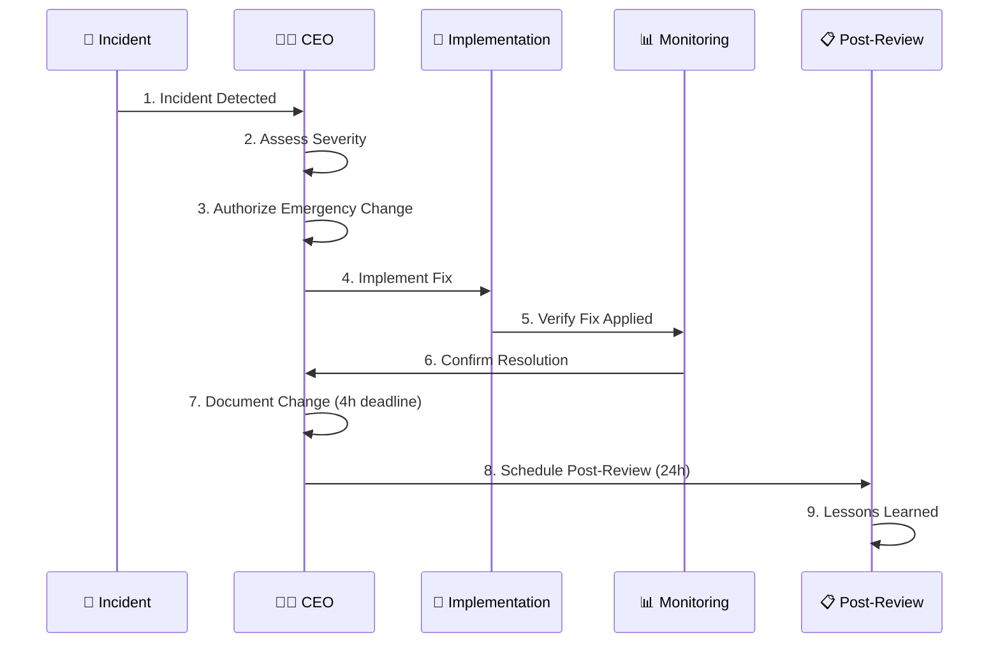
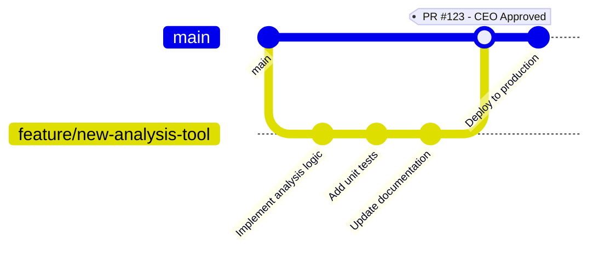

# Change Management Skill

## Purpose

This skill provides systematic guidance for implementing secure change control within the CIA platform, ensuring all changes are documented, tested, approved, and reversible per ISO 27001 A.8.9 (Configuration Management) and A.8.32 (Change Management).

## When to Use This Skill

Apply this skill when:
- ✅ Planning code changes, infrastructure modifications, or system updates
- ✅ Implementing new features or fixing bugs
- ✅ Modifying security controls or access policies
- ✅ Updating dependencies or third-party integrations
- ✅ Deploying to production environments
- ✅ Conducting emergency changes for incidents
- ✅ Reviewing pull requests and change proposals
- ✅ Managing configuration changes (database schema, infrastructure as code)

Do NOT skip for:
- ❌ "Minor" changes (all changes require review)
- ❌ Emergency hotfixes (follow emergency change procedure)
- ❌ Configuration updates (require approval and testing)
- ❌ Documentation changes (still require peer review)

## Change Categories

### 🟢 Standard Changes (Pre-Approved)

**Definition**: Low-risk, routine changes with documented procedures and automated security validation.

**Examples**:
- Documentation updates (README, user guides)
- Test case additions or improvements
- Code refactoring without behavior changes
- Dependency patches for non-critical vulnerabilities
- UI/UX improvements without data handling changes

**Requirements**:
- ✅ All automated security checks pass
- ✅ No critical system components affected
- ✅ Rollback procedures documented
- ✅ Changes logged in version control

**GitHub Actions Workflow**:
```yaml
name: Standard Change Validation
# Pinned: actions/checkout@b4ffde65f46336ab88eb53be808477a3936bae11 # v4.1.1

on:
  pull_request:
    paths:
      - '**.md'
      - 'docs/**'
      - 'test/**'

jobs:
  validate-standard-change:
    runs-on: ubuntu-latest
    steps:
      - name: Checkout code
        uses: actions/checkout@b4ffde65f46336ab88eb53be808477a3936bae11 # v4.1.1
      
      - name: Validate documentation
        run: |
          echo "Validating standard change..."
          # Markdown linting
          npx markdownlint-cli2 "**/*.md"
      
      - name: Check for security issues
        run: |
          # Ensure no secrets in documentation
          if grep -r "password\|secret\|key" --include="*.md" .; then
            echo "ERROR: Potential secrets in documentation"
            exit 1
          fi
      
      - name: Auto-approve standard change
        if: success()
        run: echo "Standard change pre-approved - deploy authorized"
```

### 🟡 Normal Changes (CEO Review & Approval)

**Definition**: Medium-risk changes requiring CEO review and explicit approval before implementation.

**Examples**:
- New application features
- Infrastructure modifications (AWS resources, networking)
- Security control changes
- Third-party integrations
- Database schema modifications
- Agent configuration changes (`.github/agents/*.md`, `.github/copilot-mcp*.json`)

**Requirements**:
- ✅ All Standard Change requirements met
- ✅ Business justification documented
- ✅ Risk assessment completed
- ✅ Implementation plan reviewed
- ✅ Success criteria defined
- ✅ CEO approval obtained

**Request for Change (RFC) Template**:
```markdown
# RFC: [Change Title]

## Change Information
- **RFC ID**: RFC-2025-001
- **Requester**: Developer Name
- **Date**: 2025-02-10
- **Priority**: Normal
- **Category**: Infrastructure

## Business Justification
Why is this change needed? What business problem does it solve?

## Technical Description
Detailed technical description of the change.

## Risk Assessment
| Risk Category | Level | Mitigation |
|---------------|-------|------------|
| Security | Medium | Security review completed |
| Availability | Low | Blue-green deployment |
| Data Integrity | Low | Database backup before migration |

## Testing Plan
- [ ] Unit tests pass (80% coverage minimum)
- [ ] Integration tests pass
- [ ] Security scanning clean (CodeQL, OWASP)
- [ ] Performance testing completed
- [ ] Staging environment validation

## Rollback Procedure
1. Identify rollback trigger conditions
2. Steps to revert change
3. Data recovery procedures (if applicable)
4. Estimated rollback time: 15 minutes

## Implementation Schedule
- **Planned Start**: 2025-02-15 10:00 UTC
- **Estimated Duration**: 2 hours
- **Planned Completion**: 2025-02-15 12:00 UTC

## Approval
- [ ] CEO Review
- [ ] CEO Approval
- [ ] Deployment Authorization

**CEO Signature**: ________________  **Date**: __________
```

### 🔴 Emergency Changes (Immediate Implementation)

**Definition**: Critical changes required to restore service availability or address active security incidents.

**Triggers**:
- Active security incidents (breach, vulnerability exploitation)
- Critical service outages (production down, data unavailable)
- Critical zero-day vulnerabilities

**Authorization**:
- ✅ CEO has sole authority for emergency changes
- ✅ All actions logged with timestamps
- ✅ Complete documentation within 4 hours
- ✅ Post-implementation review within 24 hours
- ✅ Lessons learned integration

**Emergency Change Workflow**:



## Git Workflow Integration

### Feature Branch Workflow



### Branch Protection Rules

```yaml
# .github/branch-protection-config.yml
# Branch protection for main branch

branch-protection:
  main:
    required_status_checks:
      strict: true
      contexts:
        - "build"
        - "test"
        - "security-scan"
        - "codeql-analysis"
    
    required_pull_request_reviews:
      required_approving_review_count: 1
      dismiss_stale_reviews: true
      require_code_owner_reviews: true
      require_last_push_approval: true
    
    restrictions:
      users:
        - "pethers" # CEO - only authorized deployer
      teams: []
    
    enforce_admins: true
    require_linear_history: true
    allow_force_pushes: false
    allow_deletions: false
```

## Rollback Procedures

### Database Schema Rollback

```bash
#!/bin/bash
# Database schema rollback script

set -euo pipefail

BACKUP_DATE=${1:-$(date +%Y%m%d)}
BACKUP_FILE="/backups/database-${BACKUP_DATE}.sql"

rollback_database() {
  echo "🔄 Starting database rollback..."
  
  # 1. Create pre-rollback backup
  echo "📦 Creating pre-rollback backup..."
  pg_dump -h $DB_HOST -U $DB_USER -d cia_database > "/backups/pre-rollback-$(date +%Y%m%d-%H%M%S).sql"
  
  # 2. Stop application services
  echo "🛑 Stopping application services..."
  systemctl stop cia-application
  
  # 3. Restore from backup
  echo "📥 Restoring database from backup..."
  psql -h $DB_HOST -U $DB_USER -d cia_database < "${BACKUP_FILE}"
  
  # 4. Verify restoration
  echo "✅ Verifying database restoration..."
  psql -h $DB_HOST -U $DB_USER -d cia_database -c "\
    SELECT COUNT(*) as table_count FROM information_schema.tables \
    WHERE table_schema = 'public';"
  
  # 5. Restart application
  echo "🚀 Restarting application services..."
  systemctl start cia-application
  
  # 6. Verify application health
  echo "🏥 Checking application health..."
  curl -f http://localhost:8080/actuator/health || {
    echo "❌ Application health check failed"
    exit 1
  }
  
  echo "✅ Database rollback completed successfully"
}

# Execute rollback
rollback_database
```

## Change Performance Metrics

### Key Performance Indicators

| Metric | Target | Measurement | Review Frequency |
|--------|--------|-------------|------------------|
| **Change Success Rate** | >95% | Deployments without rollback | Weekly |
| **Mean Time to Deploy** | <2 hours | From approval to production | Monthly |
| **Rollback Rate** | <5% | Changes requiring rollback | Monthly |
| **Emergency Change Rate** | <2% | Emergency vs total changes | Monthly |
| **Change Lead Time** | <7 days | RFC to deployment | Quarterly |
| **Security Gate Pass Rate** | 100% | First-time security scan pass | Weekly |

## ISO 27001 Control Mapping

### A.8.9 - Configuration Management

**Control Objective**: Configuration of systems and networks documented and controlled.

**Implementation**:
- ✅ Infrastructure as Code (CloudFormation, Terraform)
- ✅ Configuration version control (Git)
- ✅ Automated configuration validation
- ✅ Configuration backup and recovery

### A.8.32 - Change Management

**Control Objective**: Changes to information processing facilities and systems controlled.

**Implementation**:
- ✅ Three-tier change categorization (Standard, Normal, Emergency)
- ✅ RFC process for Normal changes
- ✅ CEO approval for Normal/Emergency changes
- ✅ Automated change classification
- ✅ Rollback procedures documented and tested
- ✅ Post-implementation review within 24 hours

## NIST Cybersecurity Framework Mapping

**PR.IP-3**: Configuration change control processes in place
- ✅ Formal change management process
- ✅ Version control for all changes
- ✅ Automated testing and validation

**PR.IP-4**: Backups of information conducted, maintained, tested
- ✅ Automated backup before changes
- ✅ Rollback procedures tested quarterly
- ✅ Recovery time objectives defined

## CIS Controls Mapping

**CIS Control 3.14**: Log Configuration Changes
- ✅ All changes logged in Git
- ✅ AWS CloudTrail for infrastructure changes
- ✅ Audit trail maintained for minimum 1 year

**CIS Control 4.1**: Establish and Maintain Secure Configuration Process
- ✅ Secure configuration baselines defined
- ✅ Configuration changes reviewed and approved
- ✅ Automated compliance checking

## Practical Implementation Checklist

### For Developers

- [ ] Clone repository and create feature branch
- [ ] Make changes following coding standards
- [ ] Add unit tests (80% coverage minimum)
- [ ] Run security scanning locally
- [ ] Create pull request with RFC (for Normal changes)
- [ ] Address code review feedback
- [ ] Obtain CEO approval (for Normal changes)
- [ ] Monitor deployment and verify success

### For CEO/Reviewer

- [ ] Review RFC documentation
- [ ] Assess business justification and risk
- [ ] Verify testing completeness
- [ ] Check security scanning results
- [ ] Validate rollback procedure
- [ ] Approve or request changes
- [ ] Monitor deployment
- [ ] Conduct post-implementation review

## Related Policies

- [Change Management Policy](https://github.com/Hack23/ISMS-PUBLIC/blob/main/Change_Management.md) - Detailed change control requirements
- [Secure Development Policy](https://github.com/Hack23/ISMS-PUBLIC/blob/main/Secure_Development_Policy.md) - Secure coding practices
- [Configuration Management Policy](https://github.com/Hack23/ISMS-PUBLIC/blob/main/Configuration_Management.md) - Configuration baselines
- [Segregation of Duties Policy](https://github.com/Hack23/ISMS-PUBLIC/blob/main/Segregation_of_Duties_Policy.md) - Change approval separation

## References

- ISO 27001:2022 - A.8.9 Configuration Management
- ISO 27001:2022 - A.8.32 Change Management
- ITIL 4 - Change Control
- NIST SP 800-128 - Guide for Security-Focused Configuration Management
- CIS Controls v8 - Control 3: Data Protection
