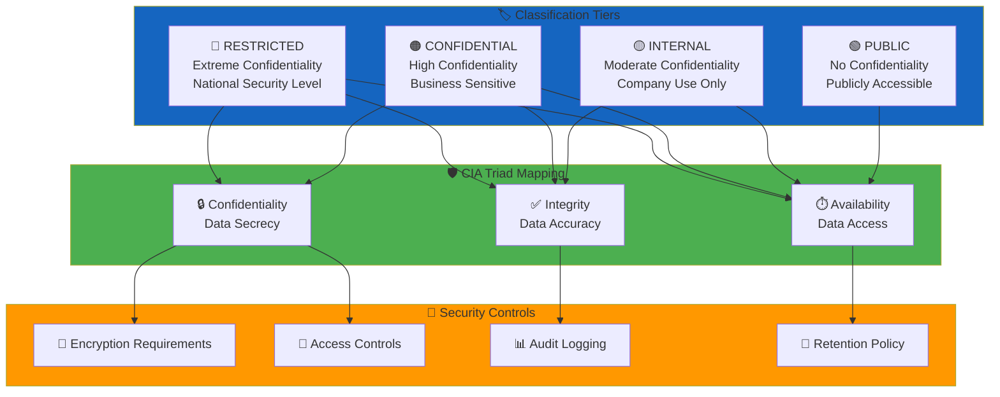
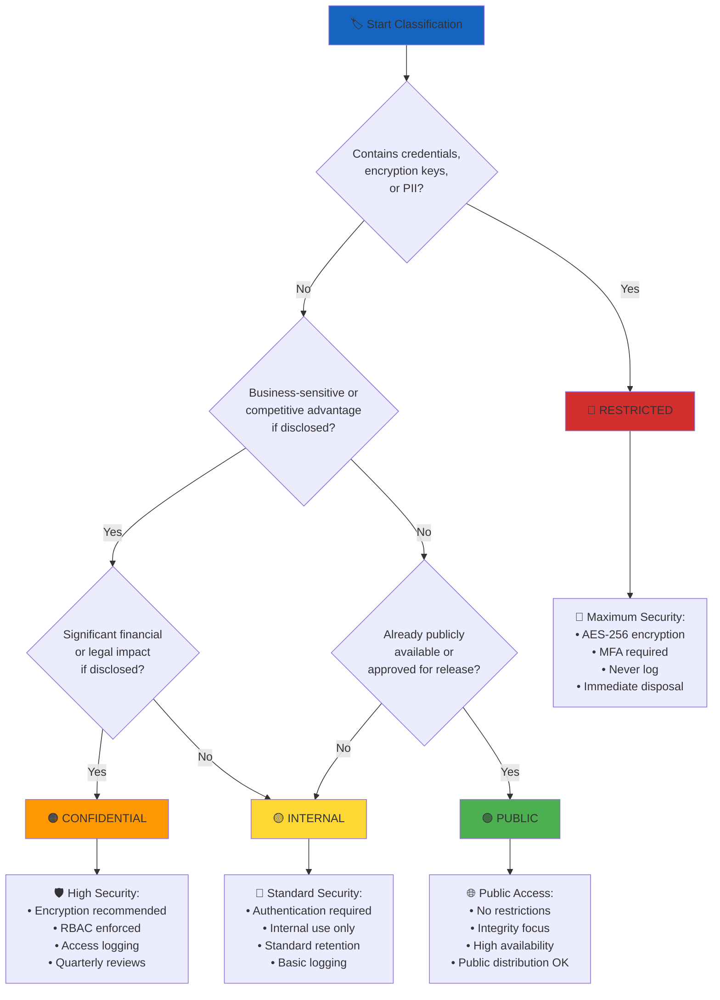

# Data Classification Policy Skill

## Purpose

This skill provides systematic guidance for implementing risk-based data and asset classification within the CIA platform, ensuring proper protection controls align with information sensitivity, business impact, and regulatory requirements per ISO 27001 A.5.12, A.5.13, and A.8.10.

## When to Use This Skill

Apply this skill when:
- ✅ Designing data models with sensitive information (personal data, political records)
- ✅ Implementing access controls for classified information
- ✅ Defining encryption requirements for data at rest and in transit
- ✅ Creating data handling procedures (storage, transmission, disposal)
- ✅ Conducting privacy impact assessments (GDPR compliance)
- ✅ Establishing retention and disposal policies
- ✅ Labeling data assets in documentation or code
- ✅ Configuring security controls for different sensitivity levels

Do NOT skip for:
- ❌ "Internal-only" systems (still require classification)
- ❌ Development/test data (may contain production data copies)
- ❌ Temporary data stores (still subject to classification)
- ❌ Public APIs (may expose classified data)

## 4-Tier Classification Model

### Classification Levels Overview



### 🔴 RESTRICTED - Extreme Confidentiality

**Definition**: Information requiring maximum protection due to severe business, legal, or regulatory consequences if disclosed.

**CIA Triad Mapping**:
- **Confidentiality**: [](https://github.com/Hack23/ISMS-PUBLIC/blob/main/CLASSIFICATION.md) - Unauthorized disclosure causes catastrophic damage
- **Integrity**: [](https://github.com/Hack23/ISMS-PUBLIC/blob/main/CLASSIFICATION.md) - Data tampering creates legal liability
- **Availability**: [](https://github.com/Hack23/ISMS-PUBLIC/blob/main/CLASSIFICATION.md) - Authorized access required for compliance

**Examples in CIA Platform**:
- Encryption keys and cryptographic secrets
- Database credentials and connection strings
- OAuth tokens and API keys
- Personal Identity Numbers (Swedish personnummer)
- Authentication credentials and password hashes

**Mandatory Security Controls**:
| Control Type | Requirement | Implementation |
|--------------|-------------|----------------|
| **Encryption at Rest** | AES-256 or stronger | AWS KMS, encrypted EBS volumes |
| **Encryption in Transit** | TLS 1.3 minimum | HTTPS only, HSTS enabled |
| **Access Control** | Zero-trust, MFA required | RBAC, least privilege principle |
| **Audit Logging** | All access logged with retention | CloudWatch Logs, 1-year retention |
| **Labeling** | Explicit marking required | Code comments, doc headers |
| **Retention** | Minimum required, immediate disposal | Automated purging after expiry |

**Java Implementation Example**:
```java
/**
 * CLASSIFICATION: RESTRICTED
 * Contains database credentials - never log or expose
 * 
 * @see <a href="https://github.com/Hack23/ISMS-PUBLIC/blob/main/CLASSIFICATION.md">Classification Policy</a>
 * @see <a href="https://github.com/Hack23/ISMS-PUBLIC/blob/main/Cryptography_Policy.md">Cryptography Policy</a>
 */
@Configuration
public class DatabaseConfig {
    
    // RESTRICTED: Database password from encrypted secrets manager
    @Value("${spring.datasource.password}")
    private String databasePassword;
    
    @Bean
    public DataSource dataSource() {
        HikariConfig config = new HikariConfig();
        config.setJdbcUrl(System.getenv("DB_URL"));
        config.setUsername(System.getenv("DB_USERNAME"));
        
        // NEVER log or print RESTRICTED data
        config.setPassword(databasePassword);
        
        // Enable connection encryption (TLS 1.3)
        config.addDataSourceProperty("ssl", "true");
        config.addDataSourceProperty("sslmode", "verify-full");
        
        return new HikariDataSource(config);
    }
    
    @Override
    public String toString() {
        return "DatabaseConfig{password=***REDACTED***}";
    }
}
```

**Handling Requirements**:
- ❌ NEVER store in source code or version control
- ❌ NEVER log to application logs or console
- ❌ NEVER transmit over unencrypted channels
- ❌ NEVER store in plaintext configuration files
- ✅ Store in AWS Secrets Manager or Parameter Store
- ✅ Inject via environment variables at runtime
- ✅ Rotate regularly (minimum quarterly)
- ✅ Immediate revocation when compromised

### 🟠 CONFIDENTIAL - High Confidentiality

**Definition**: Business-sensitive information with significant financial, operational, or competitive impact if disclosed.

**CIA Triad Mapping**:
- **Confidentiality**: [](https://github.com/Hack23/ISMS-PUBLIC/blob/main/CLASSIFICATION.md) - Disclosure causes major business harm
- **Integrity**: [](https://github.com/Hack23/ISMS-PUBLIC/blob/main/CLASSIFICATION.md) - Unauthorized modification creates business risk
- **Availability**: [](https://github.com/Hack23/ISMS-PUBLIC/blob/main/CLASSIFICATION.md) - Business continuity depends on access

**Examples in CIA Platform**:
- Political party financial records (detailed budget data)
- Ministerial expense reports (before public release)
- Internal security vulnerability assessments
- Business strategy and competitive analysis
- System architecture diagrams with security details

**Mandatory Security Controls**:
| Control Type | Requirement | Implementation |
|--------------|-------------|----------------|
| **Encryption at Rest** | AES-256 recommended | Database encryption, encrypted backups |
| **Encryption in Transit** | TLS 1.2 minimum | HTTPS, secure API calls |
| **Access Control** | RBAC with quarterly reviews | Spring Security, user roles |
| **Audit Logging** | Access events logged | Application logs, 90-day retention |
| **Labeling** | Classification marking recommended | Document headers, metadata |
| **Retention** | Business-driven retention | 7 years for financial data |

**Java Implementation Example**:
```java
/**
 * CLASSIFICATION: CONFIDENTIAL
 * Contains business-sensitive political party financial data
 * 
 * Access restricted to authenticated users with PARTY_ANALYST role
 * All access logged per ISO 27001 A.8.15
 */
@Entity
@Table(name = "party_financial_record")
public class PartyFinancialRecord {
    
    @Id
    @GeneratedValue(strategy = GenerationType.IDENTITY)
    private Long id;
    
    @Column(name = "party_id", nullable = false)
    private String partyId;
    
    // CONFIDENTIAL: Detailed budget breakdown
    @Column(name = "budget_json", columnDefinition = "jsonb")
    @Convert(converter = JsonConverter.class)
    private Map<String, BigDecimal> detailedBudget;
    
    @Column(name = "fiscal_year")
    private Integer fiscalYear;
    
    @CreatedDate
    @Column(name = "created_at", nullable = false)
    private LocalDateTime createdAt;
    
    @CreatedBy
    @Column(name = "created_by")
    private String createdBy;
}

@Service
public class PartyFinancialService {
    
    private final AuditLogger auditLogger;
    
    @PreAuthorize("hasRole('PARTY_ANALYST') or hasRole('ADMIN')")
    @Audited(message = "Access to CONFIDENTIAL party financial data")
    public PartyFinancialRecord getFinancialRecord(Long recordId, String userId) {
        // Log access to CONFIDENTIAL data
        auditLogger.logDataAccess(
            "CONFIDENTIAL", 
            "party_financial_record", 
            recordId, 
            userId
        );
        
        return financialRepository.findById(recordId)
            .orElseThrow(() -> new ResourceNotFoundException("Record not found"));
    }
}
```

**Handling Requirements**:
- ❌ NEVER share with unauthorized external parties
- ❌ NEVER store on unencrypted removable media
- ❌ NEVER transmit via unencrypted email
- ✅ Encrypt before email transmission (if required)
- ✅ Access requires authentication and authorization
- ✅ Mark documents with "CONFIDENTIAL" header
- ✅ Securely dispose when no longer needed

### 🟡 INTERNAL - Moderate Confidentiality

**Definition**: Information intended for internal use only, with moderate business impact if disclosed externally.

**CIA Triad Mapping**:
- **Confidentiality**: [](https://github.com/Hack23/ISMS-PUBLIC/blob/main/CLASSIFICATION.md) - External disclosure creates moderate risk
- **Integrity**: [](https://github.com/Hack23/ISMS-PUBLIC/blob/main/CLASSIFICATION.md) - Modification affects business operations
- **Availability**: [](https://github.com/Hack23/ISMS-PUBLIC/blob/main/CLASSIFICATION.md) - Business operations continue with delays

**Examples in CIA Platform**:
- Internal project planning documents
- System performance metrics and analytics
- Employee directory and contact information
- Internal training materials
- Aggregated usage statistics (anonymized)

**Security Controls**:
| Control Type | Requirement | Implementation |
|--------------|-------------|----------------|
| **Encryption at Rest** | Recommended for sensitive subsets | Database encryption optional |
| **Encryption in Transit** | TLS 1.2 for external access | HTTPS for web interfaces |
| **Access Control** | Authentication required | Standard user accounts |
| **Audit Logging** | Significant events logged | Basic application logs |
| **Labeling** | Classification marking optional | File metadata preferred |
| **Retention** | Standard business retention | 3 years typical |

**Java Implementation Example**:
```java
/**
 * CLASSIFICATION: INTERNAL
 * System performance metrics for internal monitoring
 * 
 * Access requires authentication
 */
@Entity
@Table(name = "system_metrics")
public class SystemMetrics {
    
    @Id
    @GeneratedValue(strategy = GenerationType.IDENTITY)
    private Long id;
    
    @Column(name = "metric_name")
    private String metricName;
    
    @Column(name = "metric_value")
    private Double metricValue;
    
    @Column(name = "timestamp")
    private LocalDateTime timestamp;
    
    @Column(name = "server_id")
    private String serverId;
}

@RestController
@RequestMapping("/api/internal/metrics")
public class MetricsController {
    
    // INTERNAL: Requires authenticated user
    @GetMapping
    @PreAuthorize("isAuthenticated()")
    public ResponseEntity<List<SystemMetrics>> getMetrics(
            @RequestParam LocalDateTime startTime,
            @RequestParam LocalDateTime endTime) {
        
        List<SystemMetrics> metrics = metricsService.findByTimeRange(startTime, endTime);
        return ResponseEntity.ok(metrics);
    }
}
```

**Handling Requirements**:
- ❌ NEVER publish to public websites or repositories
- ❌ NEVER share with external parties without approval
- ✅ Share with authenticated internal users
- ✅ Use standard email for internal distribution
- ✅ Standard backup and retention procedures
- ✅ Dispose using normal deletion procedures

### 🟢 PUBLIC - No Confidentiality

**Definition**: Information approved for public disclosure with no confidentiality requirements.

**CIA Triad Mapping**:
- **Confidentiality**: [](https://github.com/Hack23/ISMS-PUBLIC/blob/main/CLASSIFICATION.md) - Intended for public consumption
- **Integrity**: [](https://github.com/Hack23/ISMS-PUBLIC/blob/main/CLASSIFICATION.md) - Accuracy important for reputation
- **Availability**: [](https://github.com/Hack23/ISMS-PUBLIC/blob/main/CLASSIFICATION.md) - High availability expected by public

**Examples in CIA Platform**:
- Public API documentation
- Open-source code repositories (GitHub public repos)
- Published voting records (already public from Riksdagen)
- Press releases and marketing materials
- Public data visualizations and dashboards

**Security Controls**:
| Control Type | Requirement | Implementation |
|--------------|-------------|----------------|
| **Encryption at Rest** | Not required | Standard storage |
| **Encryption in Transit** | Recommended for integrity | HTTPS for web content |
| **Access Control** | None required | Public access allowed |
| **Audit Logging** | Optional | Basic web server logs |
| **Labeling** | Classification marking optional | Metadata optional |
| **Retention** | Indefinite or business need | Standard retention |

**Java Implementation Example**:
```java
/**
 * CLASSIFICATION: PUBLIC
 * Published voting records from Swedish Riksdagen
 * 
 * Data already public via Riksdagen API
 * No access restrictions required
 */
@Entity
@Table(name = "voting_record")
public class VotingRecord {
    
    @Id
    private String votingId;
    
    @Column(name = "politician_id")
    private String politicianId;
    
    @Column(name = "vote")
    @Enumerated(EnumType.STRING)
    private VoteType voteType; // YES, NO, ABSTAIN, ABSENT
    
    @Column(name = "voting_date")
    private LocalDate votingDate;
    
    @Column(name = "document_id")
    private String documentId;
}

@RestController
@RequestMapping("/api/public/voting-records")
public class VotingRecordController {
    
    // PUBLIC: No authentication required
    @GetMapping
    public ResponseEntity<List<VotingRecord>> getVotingRecords(
            @RequestParam(required = false) String politicianId,
            @RequestParam(required = false) LocalDate startDate,
            @RequestParam(required = false) LocalDate endDate) {
        
        List<VotingRecord> records = votingService.findPublicRecords(
            politicianId, startDate, endDate
        );
        
        return ResponseEntity.ok(records);
    }
}
```

**Handling Requirements**:
- ✅ Can be published to public websites
- ✅ Can be shared via any medium
- ✅ No special disposal requirements
- ⚠️ Verify data is truly public before classifying
- ⚠️ Ensure no embedded RESTRICTED/CONFIDENTIAL data

## Classification Decision Tree

Use this decision tree to classify information:



## Labeling Requirements

### Code-Level Labeling

**JavaDoc Comments**:
```java
/**
 * CLASSIFICATION: RESTRICTED
 * 
 * Contains authentication tokens and encrypted credentials.
 * 
 * Security Requirements:
 * - Never log token values
 * - Rotate tokens every 90 days
 * - Immediate revocation on compromise
 * 
 * @see <a href="https://github.com/Hack23/ISMS-PUBLIC/blob/main/CLASSIFICATION.md">Classification Policy</a>
 * @see <a href="https://github.com/Hack23/ISMS-PUBLIC/blob/main/Secrets_Management_Policy.md">Secrets Management</a>
 */
public class AuthenticationToken {
    // Implementation
}
```

**SQL Table Comments**:
```sql
-- CLASSIFICATION: CONFIDENTIAL
-- Party financial data with business-sensitive budget details
-- Access requires PARTY_ANALYST role
COMMENT ON TABLE party_financial_record IS 
'CLASSIFICATION: CONFIDENTIAL - Party financial data requiring access control';

COMMENT ON COLUMN party_financial_record.budget_json IS 
'Detailed budget breakdown - business sensitive';
```

### Document-Level Labeling

**Markdown Header**:
```markdown
---
title: Security Vulnerability Assessment
classification: CONFIDENTIAL
date: 2025-02-10
author: Security Team
retention: 7 years
---

# CONFIDENTIAL: Security Vulnerability Assessment

**Classification**: CONFIDENTIAL  
**Audience**: Internal Security Team Only  
**Distribution**: Do not forward externally
```

**Configuration Files**:
```yaml
# CLASSIFICATION: INTERNAL
# Application configuration - internal use only
spring:
  application:
    name: citizen-intelligence-agency
  # ... configuration
```

## GDPR and Privacy Classification

### Special Category Personal Data (Art. 9 GDPR)

**Definition**: Sensitive personal data requiring explicit consent and enhanced protection.

**Examples**:
- Political opinions and party membership (Art. 9.1.a GDPR)
- Trade union membership
- Health data
- Biometric data for identification
- Genetic data

**Classification Mapping**:
| GDPR Category | Classification | Rationale |
|---------------|----------------|-----------|
| Political opinions | CONFIDENTIAL minimum | Business-sensitive + GDPR Art. 9 |
| Health data | RESTRICTED | Special category + high risk |
| Biometric data | RESTRICTED | Unique identifier + irreversible |

**CIA Platform Handling**:
```java
/**
 * CLASSIFICATION: CONFIDENTIAL
 * GDPR: Special Category Personal Data (Art. 9.1.a - Political Opinions)
 * 
 * Political party membership requires:
 * - Explicit consent (GDPR Art. 9.2.a)
 * - Legal basis documentation
 * - Enhanced security controls
 * - Privacy by design
 */
@Entity
@Table(name = "politician_party_membership")
public class PoliticianPartyMembership {
    
    @Id
    private String membershipId;
    
    @Column(name = "politician_id", nullable = false)
    private String politicianId;
    
    // GDPR Art. 9 - Political opinion (special category)
    @Column(name = "party_id", nullable = false)
    private String partyId;
    
    @Column(name = "membership_start")
    private LocalDate membershipStart;
    
    @Column(name = "membership_end")
    private LocalDate membershipEnd;
    
    // GDPR compliance: Track consent basis
    @Column(name = "legal_basis")
    @Enumerated(EnumType.STRING)
    private GdprLegalBasis legalBasis; // PUBLIC_OFFICIAL, LEGITIMATE_INTEREST
    
    @Column(name = "data_source")
    private String dataSource; // "Riksdagen Public API"
}
```

### Personal Data Classification

| Data Type | GDPR Classification | Platform Classification | Security Controls |
|-----------|-------------------|------------------------|-------------------|
| **Direct Identifiers** (name, SSN) | Personal Data | RESTRICTED | Encryption + MFA |
| **Political Opinions** | Special Category | CONFIDENTIAL | Enhanced access controls |
| **Contact Information** (email, phone) | Personal Data | CONFIDENTIAL | Access logging |
| **IP Addresses** | Personal Data | INTERNAL | Standard security |
| **Aggregated Analytics** | Anonymized | PUBLIC | Ensure irreversible anonymization |

## ISO 27001 Control Mapping

### A.5.12 - Classification of Information

**Control Objective**: Ensure appropriate level of protection based on importance to organization.

**Implementation in CIA Platform**:
- ✅ Four-tier classification model defined (RESTRICTED, CONFIDENTIAL, INTERNAL, PUBLIC)
- ✅ Classification criteria documented in this skill
- ✅ Labeling procedures for code, data, and documents
- ✅ CIA triad mapping to security controls
- ✅ GDPR privacy level integration

**Verification**:
```bash
# Search for classification labels in codebase
grep -r "CLASSIFICATION:" --include="*.java" --include="*.sql" citizen-intelligence-agency/

# Verify database column comments include classification
psql -d cia_database -c "\
SELECT table_name, column_name, col_description(attrelid, attnum) \
FROM information_schema.columns \
JOIN pg_class ON relname = table_name \
JOIN pg_attribute ON attrelid = pg_class.oid AND attname = column_name \
WHERE table_schema = 'public' \
AND col_description(attrelid, attnum) LIKE '%CLASSIFICATION%';"
```

### A.5.13 - Labelling of Information

**Control Objective**: Ensure information assets receive appropriate level of protection.

**Implementation**:
- ✅ Labeling standards for code comments, database tables, documents
- ✅ Automated labeling enforcement via code review
- ✅ Metadata tagging in version control systems

### A.8.10 - Information Deletion

**Control Objective**: Information deleted when no longer required.

**Retention by Classification**:
```java
/**
 * Automated data retention enforcement
 */
@Component
@Scheduled(cron = "0 0 2 * * *") // Daily at 2 AM
public class DataRetentionEnforcer {
    
    private final AuditLogger auditLogger;
    
    public void enforceRetention() {
        // RESTRICTED: Immediate disposal after expiry
        deleteExpiredRestrictedData();
        
        // CONFIDENTIAL: 7-year retention (financial data)
        deleteExpiredConfidentialData(Period.ofYears(7));
        
        // INTERNAL: 3-year retention (operational data)
        deleteExpiredInternalData(Period.ofYears(3));
        
        // PUBLIC: Indefinite retention (no automatic deletion)
    }
    
    private void deleteExpiredRestrictedData() {
        List<RestrictedData> expired = restrictedRepo.findExpired(LocalDateTime.now());
        
        for (RestrictedData data : expired) {
            // Secure deletion with audit trail
            auditLogger.logDataDeletion("RESTRICTED", data.getId(), "RETENTION_EXPIRED");
            restrictedRepo.secureDelete(data);
        }
    }
}
```

## NIST Cybersecurity Framework Mapping

**PR.DS-2**: Data-in-transit is protected
- ✅ TLS 1.3 for RESTRICTED data
- ✅ TLS 1.2 minimum for CONFIDENTIAL data
- ✅ HTTPS recommended for INTERNAL/PUBLIC data

**PR.DS-5**: Protections against data leaks are implemented
- ✅ Access controls per classification level
- ✅ Audit logging for RESTRICTED/CONFIDENTIAL access
- ✅ Data loss prevention through classification awareness

## CIS Controls Mapping

**CIS Control 3**: Data Protection
- **3.3**: Configure data access control lists
  - ✅ RBAC implementation per classification
- **3.11**: Encrypt sensitive data at rest
  - ✅ AES-256 for RESTRICTED
  - ✅ Database encryption for CONFIDENTIAL
- **3.12**: Segment data processing and storage
  - ✅ Separate storage for different classification levels

## Practical Implementation Checklist

### For New Data Models

- [ ] Identify sensitivity level using decision tree
- [ ] Assign classification tier (RESTRICTED/CONFIDENTIAL/INTERNAL/PUBLIC)
- [ ] Document CIA triad requirements
- [ ] Add classification labels to code/schema
- [ ] Implement required security controls
- [ ] Define retention and disposal procedures
- [ ] Conduct GDPR privacy assessment if applicable
- [ ] Document legal basis for personal data processing
- [ ] Configure access controls per classification
- [ ] Enable audit logging for RESTRICTED/CONFIDENTIAL data

### For Existing Systems

- [ ] Inventory all data assets
- [ ] Classify each asset using decision tree
- [ ] Add classification labels to existing code
- [ ] Verify current controls match classification requirements
- [ ] Identify and remediate control gaps
- [ ] Update documentation with classification markings
- [ ] Conduct classification review (annual minimum)

## Common Classification Mistakes

### ❌ Mistake 1: Over-Classification
**Problem**: Classifying all data as RESTRICTED/CONFIDENTIAL unnecessarily  
**Impact**: Excessive security overhead, reduced operational efficiency  
**Solution**: Use decision tree, classify based on actual business impact

### ❌ Mistake 2: Under-Classification  
**Problem**: Classifying sensitive data as PUBLIC/INTERNAL  
**Impact**: Inadequate protection, compliance violations, data breaches  
**Solution**: When uncertain, classify higher and review with security team

### ❌ Mistake 3: No Classification
**Problem**: Leaving data unclassified  
**Impact**: No clear security controls, inconsistent protection  
**Solution**: Mandate classification for all new data models via PR reviews

### ❌ Mistake 4: Inconsistent Labeling
**Problem**: Same data classified differently across systems  
**Impact**: Confusion, control gaps, audit findings  
**Solution**: Centralized classification authority, regular reviews

## AWS Implementation Examples

### S3 Bucket Classification

```yaml
# CloudFormation template for classified S3 bucket
Resources:
  ConfidentialDataBucket:
    Type: AWS::S3::Bucket
    Properties:
      BucketName: cia-confidential-party-data
      BucketEncryption:
        ServerSideEncryptionConfiguration:
          - ServerSideEncryptionByDefault:
              SSEAlgorithm: aws:kms
              KMSMasterKeyID: !Ref DataEncryptionKey
      PublicAccessBlockConfiguration:
        BlockPublicAcls: true
        BlockPublicPolicy: true
        IgnorePublicAcls: true
        RestrictPublicBuckets: true
      VersioningConfiguration:
        Status: Enabled
      LifecycleConfiguration:
        Rules:
          - Id: CONFIDENTIAL-7year-retention
            Status: Enabled
            ExpirationInDays: 2555 # 7 years
            NoncurrentVersionExpirationInDays: 30
      Tags:
        - Key: Classification
          Value: CONFIDENTIAL
        - Key: DataOwner
          Value: PartyAnalysisTeam
        - Key: GDPRCategory
          Value: BusinessSensitive
```

### RDS Database Classification

```yaml
  ConfidentialDatabase:
    Type: AWS::RDS::DBInstance
    Properties:
      DBInstanceIdentifier: cia-confidential-db
      Engine: postgres
      EngineVersion: "16.1"
      DBInstanceClass: db.t3.medium
      StorageEncrypted: true
      KmsKeyId: !Ref DataEncryptionKey
      BackupRetentionPeriod: 30
      EnableCloudwatchLogsExports:
        - postgresql
      DeletionProtection: true
      Tags:
        - Key: Classification
          Value: CONFIDENTIAL
        - Key: DataType
          Value: PoliticalFinancialRecords
        - Key: RetentionYears
          Value: "7"
```

## Related Policies

- [Information Security Policy](https://github.com/Hack23/ISMS-PUBLIC/blob/main/Information_Security_Policy.md) - Overall security framework
- [CLASSIFICATION.md](https://github.com/Hack23/ISMS-PUBLIC/blob/main/CLASSIFICATION.md) - Detailed classification framework
- [Cryptography Policy](https://github.com/Hack23/ISMS-PUBLIC/blob/main/Cryptography_Policy.md) - Encryption requirements
- [Secrets Management Policy](https://github.com/Hack23/ISMS-PUBLIC/blob/main/Secrets_Management_Policy.md) - RESTRICTED credential handling
- [Data Protection Policy](https://github.com/Hack23/ISMS-PUBLIC/blob/main/Data_Protection_Policy.md) - GDPR compliance
- [Access Control Policy](https://github.com/Hack23/ISMS-PUBLIC/blob/main/Access_Control_Policy.md) - RBAC implementation

## References

- ISO 27001:2022 - A.5.12 Classification of Information
- ISO 27001:2022 - A.5.13 Labelling of Information  
- ISO 27001:2022 - A.8.10 Information Deletion
- GDPR Article 9 - Processing of Special Categories of Personal Data
- NIST SP 800-60 - Guide for Mapping Types of Information
- CIS Controls v8 - Control 3: Data Protection
