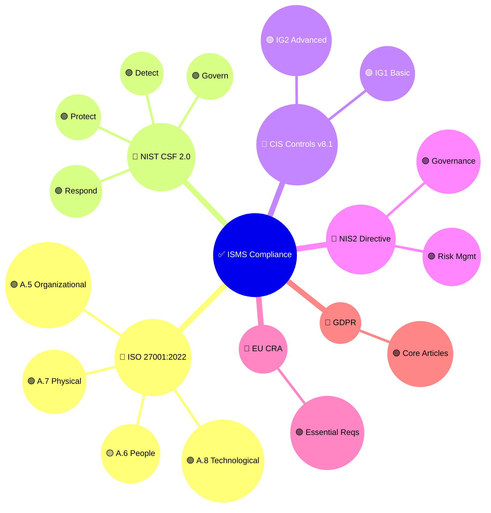

# Compliance Checklist Skill

## Purpose

This skill provides comprehensive multi-framework compliance verification aligned with Hack23 AB's ISMS architecture. It enables systematic assessment of security controls across eight major frameworks simultaneously, demonstrating that robust ISMS design becomes a competitive advantage for cybersecurity consulting services.

## When to Use This Skill

Apply this skill when:
- ✅ Conducting quarterly ISMS compliance reviews
- ✅ Preparing for ISO 27001 certification audits
- ✅ Responding to client due diligence requests
- ✅ Validating control implementation status
- ✅ Creating compliance evidence packages
- ✅ Mapping new controls to multiple frameworks
- ✅ Updating Statement of Applicability (SOA)
- ✅ Assessing regulatory readiness (NIS2, CRA, GDPR)

Do NOT use for:
- ❌ Specific technical vulnerability assessments (use vulnerability-management skill)
- ❌ Code security reviews (use secure-code-review skill)
- ❌ Incident response procedures (use incident-response skill)

## Multi-Framework Alignment Architecture

## ISO 27001:2022 Control Verification

### A.5 Organizational Controls Priority Matrix

| Control | Hack23 Policy/Evidence | Status | NIST CSF | CIS v8.1 |
|---------|------------------------|--------|----------|----------|
| **A.5.1** Policies for information security | [Information Security Policy](https://github.com/Hack23/ISMS-PUBLIC/blob/main/Information_Security_Policy.md) | ✅ Implemented | GV.PO-01 | 14.1 |
| **A.5.2** Roles & responsibilities | [Information Security Policy § Roles](https://github.com/Hack23/ISMS-PUBLIC/blob/main/Information_Security_Policy.md#roles-and-responsibilities) | ✅ Implemented | GV.RR-02 | 14.3 |
| **A.5.3** Segregation of duties | [Segregation of Duties Policy](https://github.com/Hack23/ISMS-PUBLIC/blob/main/Segregation_of_Duties_Policy.md) | ✅ Implemented | PR.AC-03 | 6.1 |
| **A.5.7** Threat intelligence | [Risk Register](https://github.com/Hack23/ISMS-PUBLIC/blob/main/Risk_Register.md) • [Threat Modeling](https://github.com/Hack23/ISMS-PUBLIC/blob/main/Threat_Modeling.md) | ✅ Implemented | ID.RA-04 | 7.1 |
| **A.5.8** Security in project mgmt | [Secure Development Policy](https://github.com/Hack23/ISMS-PUBLIC/blob/main/Secure_Development_Policy.md) • [Change Management](https://github.com/Hack23/ISMS-PUBLIC/blob/main/Change_Management.md) | ✅ Implemented | PR.IP-01 | 16.1 |

## Hack23 ISMS Policy References

**Comprehensive Compliance Documentation:**
- [Compliance Checklist](https://github.com/Hack23/ISMS-PUBLIC/blob/main/Compliance_Checklist.md) - Complete multi-framework mapping
- [Information Security Policy](https://github.com/Hack23/ISMS-PUBLIC/blob/main/Information_Security_Policy.md) - Master governance framework
- [Information Security Strategy](https://github.com/Hack23/ISMS-PUBLIC/blob/main/Information_Security_Strategy.md) - Strategic security planning

**All Hack23 ISMS Policies**: https://github.com/Hack23/ISMS-PUBLIC
