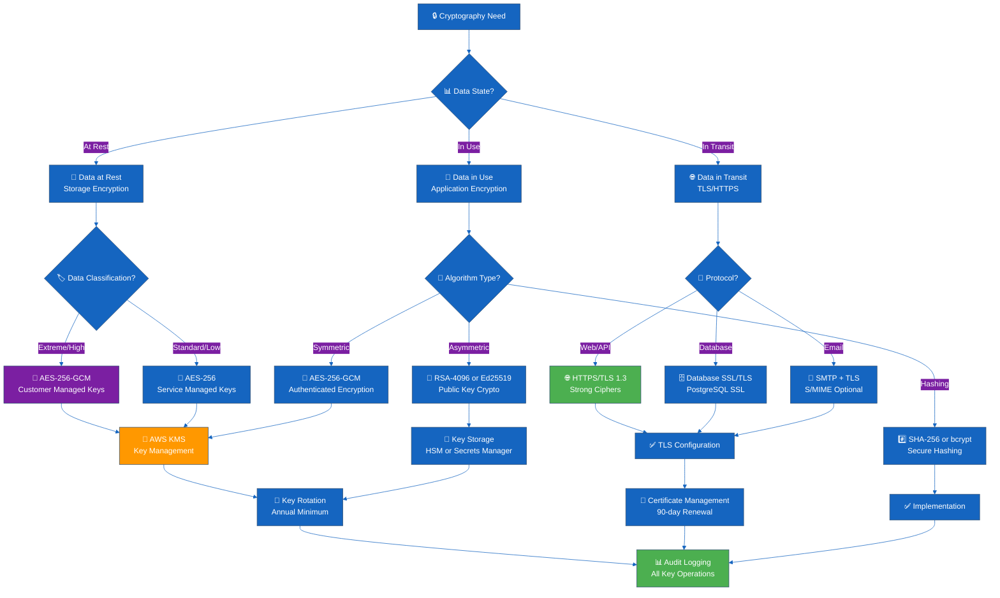

# Cryptography Policy Skill

## Purpose

This skill establishes cryptographic standards and implementation patterns for the CIA platform, ensuring proper encryption of data at rest, in transit, and in processing. It demonstrates professional cryptographic practices aligned with NIST FIPS 140-2, ISO 27001 A.8.24, and Hack23 ISMS Cryptography Policy.

## When to Use This Skill

Apply this skill when:
- ✅ Implementing encryption for sensitive data storage
- ✅ Configuring TLS/SSL for network communication
- ✅ Managing cryptographic keys and certificates
- ✅ Implementing password hashing and authentication
- ✅ Designing secure API authentication mechanisms
- ✅ Configuring AWS encryption services (KMS, S3, RDS)
- ✅ Implementing digital signatures or message authentication
- ✅ Conducting cryptographic compliance audits

Do NOT use for:
- ❌ Encoding/decoding (Base64, URL encoding - not encryption)
- ❌ Compression (gzip, zip - not security)
- ❌ Obfuscation (code minification - not cryptography)

## Decision Tree



## Approved Cryptographic Algorithms

### Symmetric Encryption

**✅ APPROVED: AES (Advanced Encryption Standard)**

```yaml
Algorithm: AES
Key_Sizes:
  - 256-bit (Preferred)
  - 192-bit (Acceptable)
  - 128-bit (Legacy support only)

Modes:
  Recommended:
    - GCM (Galois/Counter Mode): Authenticated encryption
    - CCM (Counter with CBC-MAC): Authenticated encryption
  
  Acceptable_with_Caution:
    - CBC (Cipher Block Chaining): Requires HMAC for authentication
    - CTR (Counter Mode): Requires HMAC for authentication
  
  PROHIBITED:
    - ECB (Electronic Codebook): Insecure, deterministic
    - OFB, CFB: Use GCM or CCM instead

Use_Cases:
  - Database encryption (RDS, PostgreSQL)
  - File encryption (S3, EBS volumes)
  - Application-level encryption
  - Session data encryption
```

**Java Implementation:**

```java
import javax.crypto.Cipher;
import javax.crypto.KeyGenerator;
import javax.crypto.SecretKey;
import javax.crypto.spec.GCMParameterSpec;
import javax.crypto.spec.SecretKeySpec;
import java.security.SecureRandom;

/**
 * AES-256-GCM encryption implementation
 * Compliant with NIST SP 800-38D
 */
public class SecureEncryption {
    private static final String ALGORITHM = "AES";
    private static final String TRANSFORMATION = "AES/GCM/NoPadding";
    private static final int KEY_SIZE = 256;
    private static final int GCM_IV_LENGTH = 12; // 96 bits
    private static final int GCM_TAG_LENGTH = 128; // 128 bits

    /**
     * Generate a new AES-256 encryption key
     */
    public static SecretKey generateKey() throws Exception {
        KeyGenerator keyGenerator = KeyGenerator.getInstance(ALGORITHM);
        keyGenerator.init(KEY_SIZE, new SecureRandom());
        return keyGenerator.generateKey();
    }

    /**
     * Encrypt data using AES-256-GCM
     * 
     * @param plaintext Data to encrypt
     * @param key AES-256 secret key
     * @return Encrypted data (IV + ciphertext + tag)
     */
    public static byte[] encrypt(byte[] plaintext, SecretKey key) throws Exception {
        // Generate random IV
        byte[] iv = new byte[GCM_IV_LENGTH];
        new SecureRandom().nextBytes(iv);
        
        // Initialize cipher
        Cipher cipher = Cipher.getInstance(TRANSFORMATION);
        GCMParameterSpec spec = new GCMParameterSpec(GCM_TAG_LENGTH, iv);
        cipher.init(Cipher.ENCRYPT_MODE, key, spec);
        
        // Encrypt
        byte[] ciphertext = cipher.doFinal(plaintext);
        
        // Combine IV + ciphertext for storage
        byte[] encrypted = new byte[iv.length + ciphertext.length];
        System.arraycopy(iv, 0, encrypted, 0, iv.length);
        System.arraycopy(ciphertext, 0, encrypted, iv.length, ciphertext.length);
        
        return encrypted;
    }

    /**
     * Decrypt data using AES-256-GCM
     * 
     * @param encrypted Encrypted data (IV + ciphertext + tag)
     * @param key AES-256 secret key
     * @return Decrypted plaintext
     */
    public static byte[] decrypt(byte[] encrypted, SecretKey key) throws Exception {
        // Extract IV
        byte[] iv = new byte[GCM_IV_LENGTH];
        System.arraycopy(encrypted, 0, iv, 0, iv.length);
        
        // Extract ciphertext
        byte[] ciphertext = new byte[encrypted.length - GCM_IV_LENGTH];
        System.arraycopy(encrypted, GCM_IV_LENGTH, ciphertext, 0, ciphertext.length);
        
        // Initialize cipher
        Cipher cipher = Cipher.getInstance(TRANSFORMATION);
        GCMParameterSpec spec = new GCMParameterSpec(GCM_TAG_LENGTH, iv);
        cipher.init(Cipher.DECRYPT_MODE, key, spec);
        
        // Decrypt and verify authentication tag
        return cipher.doFinal(ciphertext);
    }
}
```

**❌ PROHIBITED: DES, 3DES, RC4**

```yaml
Deprecated_Algorithms:
  DES:
    Reason: 56-bit key length insufficient
    Replacement: AES-256
    Deadline: Immediate removal required
  
  3DES:
    Reason: Block size vulnerability (Sweet32)
    Replacement: AES-256
    Deadline: Migrate by end of 2025
  
  RC4:
    Reason: Multiple cryptographic weaknesses
    Replacement: AES-GCM or ChaCha20-Poly1305
    Deadline: Immediate removal required
```

### Asymmetric Encryption

**✅ APPROVED: RSA**

```yaml
Algorithm: RSA
Key_Sizes:
  - 4096-bit (Preferred for long-term keys)
  - 3072-bit (Acceptable)
  - 2048-bit (Minimum, legacy support only)

Padding_Schemes:
  Encryption:
    - OAEP (Optimal Asymmetric Encryption Padding) with SHA-256
  Signature:
    - PSS (Probabilistic Signature Scheme) with SHA-256

PROHIBITED_Padding:
  - PKCS#1 v1.5: Vulnerable to padding oracle attacks

Use_Cases:
  - SSH keys (prefer Ed25519)
  - TLS certificates (prefer ECDSA)
  - Data encryption for small payloads
  - Digital signatures
```

**Java Implementation:**

```java
import java.security.*;
import javax.crypto.Cipher;
import java.security.spec.RSAKeyGenParameterSpec;

/**
 * RSA-4096 encryption and signature implementation
 * Compliant with NIST SP 800-56B
 */
public class RSASecureEncryption {
    private static final int KEY_SIZE = 4096;
    private static final String ALGORITHM = "RSA";
    private static final String TRANSFORMATION = "RSA/ECB/OAEPWithSHA-256AndMGF1Padding";
    private static final String SIGNATURE_ALGORITHM = "SHA256withRSA/PSS";

    /**
     * Generate RSA-4096 key pair
     */
    public static KeyPair generateKeyPair() throws Exception {
        KeyPairGenerator keyGen = KeyPairGenerator.getInstance(ALGORITHM);
        keyGen.initialize(KEY_SIZE, new SecureRandom());
        return keyGen.generateKeyPair();
    }

    /**
     * Encrypt data using RSA-OAEP
     * Note: RSA should only encrypt small data (e.g., symmetric keys)
     * For large data, use hybrid encryption (RSA + AES)
     */
    public static byte[] encrypt(byte[] plaintext, PublicKey publicKey) throws Exception {
        Cipher cipher = Cipher.getInstance(TRANSFORMATION);
        cipher.init(Cipher.ENCRYPT_MODE, publicKey);
        return cipher.doFinal(plaintext);
    }

    /**
     * Decrypt data using RSA-OAEP
     */
    public static byte[] decrypt(byte[] ciphertext, PrivateKey privateKey) throws Exception {
        Cipher cipher = Cipher.getInstance(TRANSFORMATION);
        cipher.init(Cipher.DECRYPT_MODE, privateKey);
        return cipher.doFinal(ciphertext);
    }

    /**
     * Sign data using RSA-PSS
     */
    public static byte[] sign(byte[] data, PrivateKey privateKey) throws Exception {
        Signature signature = Signature.getInstance(SIGNATURE_ALGORITHM);
        signature.initSign(privateKey);
        signature.update(data);
        return signature.sign();
    }

    /**
     * Verify signature using RSA-PSS
     */
    public static boolean verify(byte[] data, byte[] signatureBytes, PublicKey publicKey) 
            throws Exception {
        Signature signature = Signature.getInstance(SIGNATURE_ALGORITHM);
        signature.initVerify(publicKey);
        signature.update(data);
        return signature.verify(signatureBytes);
    }
}
```

**✅ APPROVED: Elliptic Curve Cryptography (ECC)**

```yaml
Algorithm: ECDSA / ECDH
Curves:
  Preferred:
    - Ed25519 (EdDSA signatures)
    - X25519 (ECDH key exchange)
    - P-384 (NIST curve for FIPS compliance)
  
  Acceptable:
    - P-256 (secp256r1, prime256v1)
  
  PROHIBITED:
    - P-192: Insufficient security margin
    - Custom curves: Avoid unless peer-reviewed

Use_Cases:
  - SSH keys (Ed25519 preferred)
  - TLS certificates (ECDSA preferred over RSA)
  - JWT signatures
  - Cryptocurrency/blockchain applications
```

**SSH Key Generation Example:**

```bash
# Generate Ed25519 SSH key (RECOMMENDED)
ssh-keygen -t ed25519 -C "user@cia.hack23.com" -f ~/.ssh/id_ed25519

# Generate ECDSA SSH key (alternative)
ssh-keygen -t ecdsa -b 384 -C "user@cia.hack23.com" -f ~/.ssh/id_ecdsa

# Generate RSA SSH key (legacy compatibility)
ssh-keygen -t rsa -b 4096 -C "user@cia.hack23.com" -f ~/.ssh/id_rsa

# Verify SSH key fingerprint
ssh-keygen -lf ~/.ssh/id_ed25519.pub
```

### Cryptographic Hashing

**✅ APPROVED: SHA-2 Family**

```yaml
Algorithms:
  SHA-256:
    Output: 256 bits
    Use: General purpose, integrity verification
    Status: Approved
  
  SHA-384:
    Output: 384 bits
    Use: Higher security margin required
    Status: Approved
  
  SHA-512:
    Output: 512 bits
    Use: Long-term security, high-security applications
    Status: Approved

Use_Cases:
  - File integrity verification
  - Digital signatures
  - Certificate fingerprints
  - HMAC authentication
  - Git commit hashing
```

**Java Implementation:**

```java
import java.security.MessageDigest;
import java.security.NoSuchAlgorithmException;
import javax.xml.bind.DatatypeConverter;

/**
 * Secure hashing implementation
 */
public class SecureHashing {
    
    /**
     * Calculate SHA-256 hash
     */
    public static byte[] sha256(byte[] data) throws NoSuchAlgorithmException {
        MessageDigest digest = MessageDigest.getInstance("SHA-256");
        return digest.digest(data);
    }

    /**
     * Calculate SHA-256 hash as hex string
     */
    public static String sha256Hex(byte[] data) throws NoSuchAlgorithmException {
        byte[] hash = sha256(data);
        return DatatypeConverter.printHexBinary(hash).toLowerCase();
    }

    /**
     * Calculate SHA-512 hash
     */
    public static byte[] sha512(byte[] data) throws NoSuchAlgorithmException {
        MessageDigest digest = MessageDigest.getInstance("SHA-512");
        return digest.digest(data);
    }
}
```

**❌ PROHIBITED: MD5, SHA-1**

```yaml
Deprecated_Algorithms:
  MD5:
    Reason: Collision attacks practical since 2004
    Replacement: SHA-256
    Deadline: Immediate removal required
    Exception: Git commit hashes (backward compatibility)
  
  SHA-1:
    Reason: Collision attacks demonstrated (SHAttered)
    Replacement: SHA-256
    Deadline: Immediate removal required
    Exception: Git commit hashes (Git working on SHA-256 migration)
```

### Password Hashing

**✅ APPROVED: bcrypt, Argon2, PBKDF2**

```yaml
Algorithms:
  bcrypt:
    Cost_Factor: 12-15 (balance security and performance)
    Use: Password storage, user authentication
    Status: Preferred
    
  Argon2id:
    Memory: 64 MB
    Iterations: 3
    Parallelism: 4
    Use: High-security password storage
    Status: Preferred (if available)
  
  PBKDF2-SHA256:
    Iterations: 600,000+ (OWASP 2023 recommendation)
    Salt: 128 bits minimum
    Use: Password storage (fallback if bcrypt unavailable)
    Status: Acceptable

Key_Principles:
  - Always use unique random salt per password
  - Store salt alongside hash
  - Never use fast hashes (MD5, SHA-256) for passwords
  - Cost factor should take ~100ms on production hardware
```

**Java Implementation (bcrypt):**

```java
import org.springframework.security.crypto.bcrypt.BCryptPasswordEncoder;

/**
 * Secure password hashing using bcrypt
 * Spring Security provides robust implementation
 */
public class PasswordSecurity {
    // Cost factor 12 = 2^12 iterations
    private static final int COST_FACTOR = 12;
    private static final BCryptPasswordEncoder encoder = 
        new BCryptPasswordEncoder(COST_FACTOR);

    /**
     * Hash password using bcrypt
     * 
     * @param plainPassword Plain text password
     * @return bcrypt hash (includes salt)
     */
    public static String hashPassword(String plainPassword) {
        return encoder.encode(plainPassword);
    }

    /**
     * Verify password against bcrypt hash
     * 
     * @param plainPassword Plain text password
     * @param hashedPassword bcrypt hash
     * @return true if password matches
     */
    public static boolean verifyPassword(String plainPassword, String hashedPassword) {
        return encoder.matches(plainPassword, hashedPassword);
    }
}
```

**Spring Security Configuration:**

```java
import org.springframework.context.annotation.Bean;
import org.springframework.context.annotation.Configuration;
import org.springframework.security.crypto.bcrypt.BCryptPasswordEncoder;
import org.springframework.security.crypto.password.PasswordEncoder;

@Configuration
public class SecurityConfig {
    
    /**
     * Configure bcrypt password encoder
     * Cost factor 12 provides good balance
     */
    @Bean
    public PasswordEncoder passwordEncoder() {
        return new BCryptPasswordEncoder(12);
    }
}
```

## Encryption at Rest

### Database Encryption (PostgreSQL)

**RDS Encryption Configuration:**

```yaml
# AWS RDS PostgreSQL Encryption
RDS_Encryption:
  Encryption_at_Rest:
    - Enable: AWS KMS encryption for RDS instance
    - Key: Customer Managed Key (CMK) for high-classification data
    - Key: AWS Managed Key for standard data
    - Automated_Backups: Encrypted with same key
    - Read_Replicas: Must use same encryption key

  Connection_Encryption:
    - SSL/TLS: Required for all connections
    - Protocol: TLS 1.2 minimum, TLS 1.3 preferred
    - Certificate_Validation: Verify server certificate

  Column_Level_Encryption:
    - Use: pgcrypto extension for sensitive columns
    - Algorithm: AES-256-GCM
    - Key_Management: Application-managed keys in AWS Secrets Manager
```

**PostgreSQL SSL Configuration:**

```properties
# application.yml - Spring Boot PostgreSQL SSL
spring:
  datasource:
    url: jdbc:postgresql://cia-db.cluster-xxx.eu-north-1.rds.amazonaws.com:5432/cia_db?ssl=true&sslmode=verify-full&sslrootcert=/path/to/rds-ca-cert.pem
    username: ${DB_USERNAME}
    password: ${DB_PASSWORD}
    hikari:
      connection-timeout: 30000
      maximum-pool-size: 10
  jpa:
    properties:
      hibernate:
        dialect: org.hibernate.dialect.PostgreSQL10Dialect
```

**Column-Level Encryption (pgcrypto):**

```sql
-- Enable pgcrypto extension
CREATE EXTENSION IF NOT EXISTS pgcrypto;

-- Create table with encrypted column
CREATE TABLE politician_sensitive (
    id SERIAL PRIMARY KEY,
    politician_id INTEGER NOT NULL,
    ssn_encrypted BYTEA NOT NULL, -- Encrypted Swedish personal number
    created_at TIMESTAMP DEFAULT NOW()
);

-- Insert with encryption (symmetric key stored securely)
INSERT INTO politician_sensitive (politician_id, ssn_encrypted)
VALUES (
    123,
    pgp_sym_encrypt('197001011234', 'encryption-key-from-secrets-manager')
);

-- Query with decryption
SELECT 
    politician_id,
    pgp_sym_decrypt(ssn_encrypted, 'encryption-key-from-secrets-manager') AS ssn
FROM politician_sensitive
WHERE politician_id = 123;
```

### S3 Bucket Encryption

**S3 Encryption Configuration:**

```yaml
# S3 Bucket Encryption Options
S3_Encryption:
  Server_Side_Encryption:
    SSE-S3:
      Description: AWS managed encryption keys
      Use_Case: Standard classification data
      Key_Management: Fully managed by AWS
    
    SSE-KMS:
      Description: AWS KMS managed keys
      Use_Case: High/Extreme classification data
      Key_Management: Customer managed CMK
      Audit: CloudTrail logs all key usage
    
    SSE-C:
      Description: Customer provided keys
      Use_Case: Special compliance requirements
      Key_Management: Customer manages keys entirely
      Caution: Key loss = permanent data loss
  
  Client_Side_Encryption:
    Use: Extra layer for extreme classification
    Implementation: Encrypt before upload to S3
    Key_Storage: AWS KMS or client-side HSM
```

**S3 Bucket Policy (Enforce Encryption):**

```json
{
  "Version": "2012-10-17",
  "Statement": [
    {
      "Sid": "DenyUnencryptedObjectUploads",
      "Effect": "Deny",
      "Principal": "*",
      "Action": "s3:PutObject",
      "Resource": "arn:aws:s3:::cia-data-bucket/*",
      "Condition": {
        "StringNotEquals": {
          "s3:x-amz-server-side-encryption": "aws:kms"
        }
      }
    },
    {
      "Sid": "DenyInsecureTransport",
      "Effect": "Deny",
      "Principal": "*",
      "Action": "s3:*",
      "Resource": [
        "arn:aws:s3:::cia-data-bucket",
        "arn:aws:s3:::cia-data-bucket/*"
      ],
      "Condition": {
        "Bool": {
          "aws:SecureTransport": "false"
        }
      }
    }
  ]
}
```

**Java S3 Client Configuration:**

```java
import software.amazon.awssdk.services.s3.S3Client;
import software.amazon.awssdk.services.s3.model.*;

/**
 * S3 encryption configuration
 */
public class S3EncryptionConfig {
    
    /**
     * Upload object with SSE-KMS encryption
     */
    public static void uploadEncrypted(S3Client s3Client, String bucket, 
                                      String key, byte[] data, String kmsKeyId) {
        PutObjectRequest request = PutObjectRequest.builder()
            .bucket(bucket)
            .key(key)
            .serverSideEncryption(ServerSideEncryption.AWS_KMS)
            .ssekmsKeyId(kmsKeyId) // Customer managed CMK
            .build();
        
        s3Client.putObject(request, RequestBody.fromBytes(data));
    }
}
```

### EBS Volume Encryption

**EBS Encryption Best Practices:**

```yaml
EBS_Encryption:
  Default_Encryption:
    - Enable: Account-level default encryption
    - Key: Customer managed CMK for production
    - Snapshots: Automatically encrypted with same key
  
  Encryption_by_Type:
    Production_Volumes:
      Key: Customer managed CMK
      Rotation: Annual automatic rotation
      Access: Restricted to EC2 instance role
    
    Development_Volumes:
      Key: AWS managed key acceptable
      Rotation: Automatic by AWS
      Access: Developer IAM roles
  
  Migration:
    Unencrypted_to_Encrypted:
      - Create snapshot of unencrypted volume
      - Copy snapshot with encryption enabled
      - Create new encrypted volume from snapshot
      - Attach to instance and update /etc/fstab
```

**Enable Default EBS Encryption:**

```bash
# Enable default EBS encryption for account/region
aws ec2 enable-ebs-encryption-by-default --region eu-north-1

# Verify default encryption enabled
aws ec2 get-ebs-encryption-by-default --region eu-north-1

# Set default KMS key for EBS encryption
aws ec2 modify-ebs-default-kms-key-id \
  --kms-key-id arn:aws:kms:eu-north-1:123456789012:key/abc-123-def \
  --region eu-north-1
```

## Encryption in Transit

### TLS/SSL Configuration

**TLS Version and Cipher Suites:**

```yaml
TLS_Configuration:
  Protocols:
    Enabled:
      - TLS 1.3 (Preferred)
      - TLS 1.2 (Minimum)
    Disabled:
      - TLS 1.1 (Deprecated)
      - TLS 1.0 (Deprecated)
      - SSL 3.0 (Insecure)
      - SSL 2.0 (Insecure)
  
  Cipher_Suites_TLS_1_3:
    - TLS_AES_256_GCM_SHA384
    - TLS_AES_128_GCM_SHA256
    - TLS_CHACHA20_POLY1305_SHA256
  
  Cipher_Suites_TLS_1_2:
    Preferred:
      - ECDHE-RSA-AES256-GCM-SHA384
      - ECDHE-RSA-AES128-GCM-SHA256
      - ECDHE-ECDSA-AES256-GCM-SHA384
      - ECDHE-ECDSA-AES128-GCM-SHA256
    
    Acceptable:
      - AES256-GCM-SHA384
      - AES128-GCM-SHA256
    
    PROHIBITED:
      - RC4 ciphers (all)
      - DES/3DES ciphers
      - Export ciphers
      - NULL ciphers
      - Anonymous ciphers (ADH, AECDH)
  
  Features:
    - Forward_Secrecy: Required (ECDHE/DHE)
    - AEAD_Ciphers: Preferred (GCM, ChaCha20-Poly1305)
    - Certificate_Validation: Required
    - HSTS: Enabled (max-age=31536000)
    - OCSP_Stapling: Enabled
```

**NGINX TLS Configuration:**

```nginx
# /etc/nginx/conf.d/ssl.conf
# Strong TLS configuration for CIA platform

server {
    listen 443 ssl http2;
    server_name www.hack23.com;

    # TLS certificates
    ssl_certificate /etc/letsencrypt/live/hack23.com/fullchain.pem;
    ssl_certificate_key /etc/letsencrypt/live/hack23.com/privkey.pem;

    # TLS protocols
    ssl_protocols TLSv1.3 TLSv1.2;
    ssl_prefer_server_ciphers on;

    # TLS 1.3 cipher suites (automatic, cannot configure)
    # TLS 1.2 cipher suites
    ssl_ciphers 'ECDHE-RSA-AES256-GCM-SHA384:ECDHE-RSA-AES128-GCM-SHA256:ECDHE-ECDSA-AES256-GCM-SHA384:ECDHE-ECDSA-AES128-GCM-SHA256';

    # Diffie-Hellman parameters for forward secrecy
    ssl_dhparam /etc/nginx/dhparam.pem;

    # SSL session cache
    ssl_session_cache shared:SSL:10m;
    ssl_session_timeout 10m;
    ssl_session_tickets off;

    # OCSP stapling
    ssl_stapling on;
    ssl_stapling_verify on;
    ssl_trusted_certificate /etc/letsencrypt/live/hack23.com/chain.pem;
    resolver 8.8.8.8 8.8.4.4 valid=300s;
    resolver_timeout 5s;

    # Security headers
    add_header Strict-Transport-Security "max-age=31536000; includeSubDomains; preload" always;
    add_header X-Content-Type-Options "nosniff" always;
    add_header X-Frame-Options "DENY" always;
    add_header X-XSS-Protection "1; mode=block" always;

    # Application configuration
    location / {
        proxy_pass http://localhost:8080;
        proxy_set_header Host $host;
        proxy_set_header X-Real-IP $remote_addr;
        proxy_set_header X-Forwarded-For $proxy_add_x_forwarded_for;
        proxy_set_header X-Forwarded-Proto $scheme;
    }
}

# Redirect HTTP to HTTPS
server {
    listen 80;
    server_name www.hack23.com;
    return 301 https://$server_name$request_uri;
}
```

**Generate Strong DH Parameters:**

```bash
# Generate 4096-bit Diffie-Hellman parameters (takes several minutes)
openssl dhparam -out /etc/nginx/dhparam.pem 4096
```

### Spring Boot TLS Configuration

**application.yml TLS Settings:**

```yaml
server:
  port: 8443
  ssl:
    enabled: true
    key-store: classpath:keystore.p12
    key-store-password: ${KEYSTORE_PASSWORD}
    key-store-type: PKCS12
    key-alias: cia-app
    
    # TLS protocol versions
    enabled-protocols: TLSv1.3,TLSv1.2
    
    # Cipher suites (TLS 1.2)
    ciphers: >-
      TLS_AES_256_GCM_SHA384,
      TLS_AES_128_GCM_SHA256,
      ECDHE-RSA-AES256-GCM-SHA384,
      ECDHE-RSA-AES128-GCM-SHA256
    
    # Client authentication (optional)
    client-auth: none

# Security headers via Spring Security
spring:
  security:
    headers:
      hsts:
        include-subdomains: true
        max-age: 31536000
      content-type:
        enabled: true
      frame:
        deny: true
```

**Java TLS Configuration:**

```java
import org.springframework.boot.web.embedded.tomcat.TomcatServletWebServerFactory;
import org.springframework.boot.web.server.WebServerFactoryCustomizer;
import org.springframework.context.annotation.Bean;
import org.springframework.context.annotation.Configuration;
import org.apache.catalina.connector.Connector;
import org.apache.coyote.http11.Http11NioProtocol;

@Configuration
public class TLSConfiguration {
    
    @Bean
    public WebServerFactoryCustomizer<TomcatServletWebServerFactory> servletContainer() {
        return factory -> factory.addConnectorCustomizers(connector -> {
            Http11NioProtocol protocol = (Http11NioProtocol) connector.getProtocolHandler();
            
            // TLS protocols
            protocol.setSSLEnabled(true);
            protocol.setScheme("https");
            protocol.setSecure(true);
            
            // TLS 1.3 and 1.2 only
            protocol.setSslEnabledProtocols("TLSv1.3,TLSv1.2");
            
            // Strong cipher suites
            protocol.setCiphers(
                "TLS_AES_256_GCM_SHA384," +
                "TLS_AES_128_GCM_SHA256," +
                "ECDHE-RSA-AES256-GCM-SHA384," +
                "ECDHE-RSA-AES128-GCM-SHA256"
            );
            
            // Prefer server cipher order
            protocol.setUseServerCipherSuitesOrder(true);
        });
    }
}
```

## Key Management

### AWS KMS Best Practices

**KMS Key Architecture:**

```yaml
KMS_Key_Strategy:
  Production_Data:
    Type: Customer Managed CMK
    Rotation: Automatic annual rotation enabled
    Alias: alias/cia-production-data
    Policy: Least privilege (specific IAM roles only)
    Multi_Region: Consider for DR requirements
  
  Development_Data:
    Type: AWS Managed Key
    Rotation: Automatic (managed by AWS)
    Alias: aws/s3 (service default)
    Policy: Broader access for development team
  
  Backup_Encryption:
    Type: Customer Managed CMK
    Rotation: Annual
    Alias: alias/cia-backups
    Policy: Backup service + restore roles only
```

**Create Customer Managed CMK:**

```bash
# Create customer managed KMS key
aws kms create-key \
  --description "CIA Production Data Encryption Key" \
  --key-usage ENCRYPT_DECRYPT \
  --origin AWS_KMS \
  --multi-region false \
  --tags TagKey=Environment,TagValue=Production \
         TagKey=Application,TagValue=CIA

# Create alias for key
aws kms create-alias \
  --alias-name alias/cia-production-data \
  --target-key-id <key-id-from-create>

# Enable automatic key rotation
aws kms enable-key-rotation \
  --key-id <key-id>

# Verify rotation status
aws kms get-key-rotation-status \
  --key-id <key-id>
```

**KMS Key Policy:**

```json
{
  "Version": "2012-10-17",
  "Statement": [
    {
      "Sid": "Enable IAM User Permissions",
      "Effect": "Allow",
      "Principal": {
        "AWS": "arn:aws:iam::123456789012:root"
      },
      "Action": "kms:*",
      "Resource": "*"
    },
    {
      "Sid": "Allow CIA Application to Use Key",
      "Effect": "Allow",
      "Principal": {
        "AWS": "arn:aws:iam::123456789012:role/cia-application-role"
      },
      "Action": [
        "kms:Decrypt",
        "kms:DescribeKey",
        "kms:GenerateDataKey"
      ],
      "Resource": "*"
    },
    {
      "Sid": "Allow CloudWatch Logs to Use Key",
      "Effect": "Allow",
      "Principal": {
        "Service": "logs.eu-north-1.amazonaws.com"
      },
      "Action": [
        "kms:Encrypt",
        "kms:Decrypt",
        "kms:ReEncrypt*",
        "kms:GenerateDataKey*",
        "kms:CreateGrant",
        "kms:DescribeKey"
      ],
      "Resource": "*",
      "Condition": {
        "ArnLike": {
          "kms:EncryptionContext:aws:logs:arn": "arn:aws:logs:eu-north-1:123456789012:log-group:*"
        }
      }
    }
  ]
}
```

### Key Rotation

**Key Rotation Schedule:**

```yaml
Key_Rotation_Policy:
  Symmetric_Keys:
    KMS_CMK:
      Frequency: Annual (automatic)
      Method: AWS KMS automatic rotation
      Backward_Compatibility: Old keys retained for decryption
    
    Application_Keys:
      Frequency: Quarterly
      Method: Manual rotation with version tracking
      Transition: Dual-key period (30 days)
  
  Asymmetric_Keys:
    TLS_Certificates:
      Frequency: 90 days (Let's Encrypt)
      Method: Automated renewal (Certbot)
      Alert: 7 days before expiry
    
    SSH_Keys:
      Frequency: Annual
      Method: Manual rotation per user
      Validation: Remove old keys from authorized_keys
    
    API_Keys:
      Frequency: Quarterly or on compromise
      Method: Generate new, deprecate old
      Transition: 30-day overlap period
```

**Automated KMS Key Rotation Verification:**

```bash
#!/bin/bash
# check-kms-rotation.sh
# Verify KMS key rotation is enabled

REGION="eu-north-1"
KEYS=$(aws kms list-keys --region $REGION --query 'Keys[].KeyId' --output text)

echo "Checking KMS Key Rotation Status..."
echo "======================================"

for KEY_ID in $KEYS; do
    # Get key metadata
    ALIAS=$(aws kms list-aliases --key-id $KEY_ID --region $REGION \
            --query 'Aliases[0].AliasName' --output text 2>/dev/null)
    
    # Check rotation status
    ROTATION=$(aws kms get-key-rotation-status --key-id $KEY_ID \
               --region $REGION --query 'KeyRotationEnabled' \
               --output text 2>/dev/null)
    
    if [ "$ROTATION" = "True" ]; then
        echo "✅ $KEY_ID ($ALIAS): Rotation ENABLED"
    elif [ "$ROTATION" = "False" ]; then
        echo "⚠️  $KEY_ID ($ALIAS): Rotation DISABLED"
    else
        echo "ℹ️  $KEY_ID ($ALIAS): Not eligible for rotation (asymmetric key)"
    fi
done
```

### AWS Secrets Manager

**Store Secrets Securely:**

```bash
# Store database password in Secrets Manager
aws secretsmanager create-secret \
  --name cia/production/db-password \
  --description "PostgreSQL database password for CIA production" \
  --secret-string "$(openssl rand -base64 32)" \
  --kms-key-id alias/cia-production-data \
  --tags Key=Environment,Value=Production \
         Key=Application,Value=CIA

# Retrieve secret value
aws secretsmanager get-secret-value \
  --secret-id cia/production/db-password \
  --query 'SecretString' \
  --output text

# Rotate secret automatically
aws secretsmanager rotate-secret \
  --secret-id cia/production/db-password \
  --rotation-lambda-arn arn:aws:lambda:eu-north-1:123456789012:function:SecretsManagerRDSPostgreSQLRotationSingleUser \
  --rotation-rules AutomaticallyAfterDays=30
```

**Java Secrets Manager Integration:**

```java
import software.amazon.awssdk.services.secretsmanager.SecretsManagerClient;
import software.amazon.awssdk.services.secretsmanager.model.GetSecretValueRequest;
import software.amazon.awssdk.services.secretsmanager.model.GetSecretValueResponse;

/**
 * Retrieve secrets from AWS Secrets Manager
 */
public class SecretsService {
    private final SecretsManagerClient client;

    public SecretsService(SecretsManagerClient client) {
        this.client = client;
    }

    /**
     * Get secret value from Secrets Manager
     */
    public String getSecret(String secretName) {
        GetSecretValueRequest request = GetSecretValueRequest.builder()
            .secretId(secretName)
            .build();
        
        GetSecretValueResponse response = client.getSecretValue(request);
        return response.secretString();
    }
}
```

**Spring Boot Secrets Manager Configuration:**

```yaml
# application.yml - Use Secrets Manager for sensitive config
spring:
  datasource:
    url: jdbc:postgresql://cia-db.cluster-xxx.eu-north-1.rds.amazonaws.com:5432/cia_db
    username: ${sm://cia/production/db-username}
    password: ${sm://cia/production/db-password}
  
  cloud:
    aws:
      secretsmanager:
        enabled: true
        region: eu-north-1
```

## Certificate Management

### Let's Encrypt Automation

**Certbot Installation and Configuration:**

```bash
# Install Certbot with NGINX plugin
sudo apt-get update
sudo apt-get install certbot python3-certbot-nginx

# Obtain certificate for domain
sudo certbot --nginx -d www.hack23.com -d hack23.com \
  --email security@hack23.com \
  --agree-tos \
  --no-eff-email \
  --redirect

# Verify automatic renewal is configured
sudo systemctl status certbot.timer

# Test renewal process
sudo certbot renew --dry-run

# Set up renewal notification
# Add to crontab: 0 12 * * * /usr/bin/certbot renew --quiet --deploy-hook "systemctl reload nginx"
```

**Certificate Renewal Monitoring:**

```bash
#!/bin/bash
# check-cert-expiry.sh
# Monitor TLS certificate expiration

DOMAIN="www.hack23.com"
ALERT_DAYS=7

# Get certificate expiration date
EXPIRY=$(echo | openssl s_client -servername $DOMAIN -connect $DOMAIN:443 2>/dev/null | \
         openssl x509 -noout -enddate | cut -d= -f2)

# Convert to epoch seconds
EXPIRY_EPOCH=$(date -d "$EXPIRY" +%s)
NOW_EPOCH=$(date +%s)
DAYS_LEFT=$(( ($EXPIRY_EPOCH - $NOW_EPOCH) / 86400 ))

echo "Certificate for $DOMAIN expires in $DAYS_LEFT days"

if [ $DAYS_LEFT -lt $ALERT_DAYS ]; then
    echo "⚠️  WARNING: Certificate expires soon!"
    # Send alert (email, Slack, etc.)
    exit 1
else
    echo "✅ Certificate is valid"
    exit 0
fi
```

### AWS Certificate Manager (ACM)

**Request ACM Certificate:**

```bash
# Request public certificate
aws acm request-certificate \
  --domain-name hack23.com \
  --subject-alternative-names www.hack23.com \
  --validation-method DNS \
  --region eu-north-1

# Describe certificate to get validation CNAME records
aws acm describe-certificate \
  --certificate-arn arn:aws:acm:eu-north-1:123456789012:certificate/abc123

# After DNS validation, check status
aws acm list-certificates \
  --certificate-statuses ISSUED \
  --region eu-north-1
```

## Compliance Mapping

### ISO 27001:2022

- **A.8.24** - Use of Cryptography
- **A.5.23** - Information Security for Cloud Services
- **A.8.1** - User Endpoint Devices

### NIST CSF 2.0

- **PR.DS-1** - Data at rest is protected
- **PR.DS-2** - Data in transit is protected
- **PR.DS-6** - Integrity checking mechanisms verify software integrity
- **PR.DS-8** - Integrity checking mechanisms verify hardware integrity

### CIS Controls v8

- **Control 3.11** - Encrypt Sensitive Data at Rest
- **Control 3.10** - Encrypt Sensitive Data in Transit
- **Control 14.4** - Enforce Remote Access Using Multi-Factor Authentication
- **Control 14.8** - Encrypt Sensitive Information at Rest

### NIST SP 800-175B

- **Key Management:** Guideline for Using Cryptographic Standards
- **Algorithm Selection:** Approved algorithms for federal use
- **Key Establishment:** Key agreement and transport

## References

- **Hack23 ISMS:** [Cryptography Policy](https://github.com/Hack23/ISMS-PUBLIC/blob/main/Cryptography_Policy.md)
- **NIST FIPS 140-2:** Security Requirements for Cryptographic Modules
- **NIST SP 800-57:** Recommendation for Key Management
- **NIST SP 800-38D:** GCM Mode for Authenticated Encryption
- **OWASP Cryptographic Storage Cheat Sheet:** https://cheatsheetseries.owasp.org/cheatsheets/Cryptographic_Storage_Cheat_Sheet.html
- **Mozilla SSL Configuration Generator:** https://ssl-config.mozilla.org/

## Examples from CIA Platform

### Successful Implementation: Spring Security + bcrypt

The CIA platform uses Spring Security with bcrypt for password hashing:

```java
// User entity with bcrypt password
@Entity
@Table(name = "application_user")
public class ApplicationUser {
    @Column(name = "password_hash", nullable = false)
    private String passwordHash; // bcrypt hash stored here
    
    // Other fields...
}

// Authentication service
@Service
public class AuthenticationService {
    private final PasswordEncoder passwordEncoder;
    
    public ApplicationUser registerUser(String username, String plainPassword) {
        ApplicationUser user = new ApplicationUser();
        user.setUsername(username);
        user.setPasswordHash(passwordEncoder.encode(plainPassword)); // bcrypt
        return userRepository.save(user);
    }
}
```

### Successful Implementation: PostgreSQL SSL

CIA platform enforces SSL for all database connections:

```properties
# Production database connection with SSL
spring.datasource.url=jdbc:postgresql://cia-db.cluster-xxx.eu-north-1.rds.amazonaws.com:5432/cia_db?ssl=true&sslmode=require
```

---

**Document Maintenance:**
- **Review Frequency:** Annual
- **Last Updated:** 2024-01-15
- **Next Review:** 2025-01-15
- **Owner:** Security Team / CIA Project Maintainers
