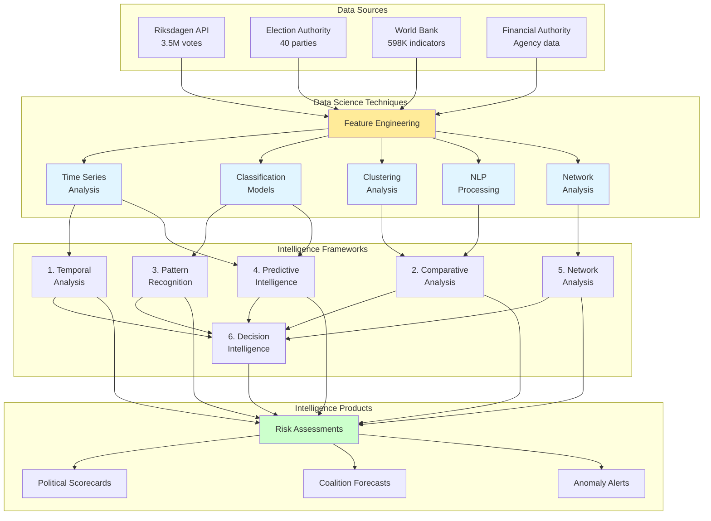

# Data Science for Intelligence Skill

## Purpose

This skill provides comprehensive data science methodologies tailored for political intelligence analysis in the CIA platform. It covers statistical analysis, machine learning, natural language processing, time series forecasting, and network analysis techniques applied to the 6 intelligence frameworks and 82 database views for democratic accountability assessment.

## When to Use This Skill

Apply this skill when:
- ✅ Building predictive models for election outcomes or coalition stability
- ✅ Analyzing temporal patterns in voting behavior or policy positions
- ✅ Detecting anomalies in political behavior (sudden voting shifts, absences)
- ✅ Performing text analysis on parliamentary documents and speeches
- ✅ Constructing influence networks from voting alignment patterns
- ✅ Forecasting trends in party support or politician effectiveness
- ✅ Clustering politicians or parties by voting similarity

Do NOT use for:
- ❌ Simple aggregation queries (use SQL views instead)
- ❌ Real-time operational dashboards (use materialized views)
- ❌ Causal inference without proper experimental design or quasi-experimental methods

## Data Science Framework for CIA Platform

### 6 Intelligence Analysis Frameworks



## 1. Time Series Analysis (Temporal Framework)

**Purpose:** Analyze trends, seasonality, and forecast political metrics over time.

**CIA Platform Applications:**
- Politician voting participation trends
- Party support trajectories
- Government approval ratings
- Legislative productivity patterns

### Decomposition Analysis

**Example: Decompose Party Support into Trend, Seasonal, Residual Components**

```python
import pandas as pd
import numpy as np
from statsmodels.tsa.seasonal import seasonal_decompose
from statsmodels.tsa.stattools import adfuller
import matplotlib.pyplot as plt

class PoliticalTimeSeriesAnalyzer:
    """
    Time series analysis for political intelligence
    Supports: Temporal Analysis Framework
    """
    
    def __init__(self, db_connection):
        self.db = db_connection
    
    def decompose_party_support(self, party_code, election_years):
        """
        Decompose historical party support into trend, seasonal, residual
        
        Data Source: sweden_political_party table
        Intelligence Framework: Temporal Analysis
        """
        
        # Query: Historical election results
        query = """
        SELECT 
            election_year,
            percentage as support_percentage
        FROM sweden_political_party
        WHERE party_name = (SELECT party_name FROM sweden_political_party WHERE party_id = %s LIMIT 1)
            AND election_year >= %s
        ORDER BY election_year
        """
        
        df = pd.read_sql(query, self.db, params=[party_code, min(election_years)])
        df['election_year'] = pd.to_datetime(df['election_year'], format='%Y')
        df.set_index('election_year', inplace=True)
        
        # Perform seasonal decomposition (additive model)
        decomposition = seasonal_decompose(
            df['support_percentage'], 
            model='additive', 
            period=3  # 3 elections = 12 years
        )
        
        return {
            'trend': decomposition.trend,
            'seasonal': decomposition.seasonal,
            'residual': decomposition.resid,
            'original': df['support_percentage']
        }
    
    def forecast_arima(self, party_code, forecast_periods=1):
        """
        ARIMA forecasting for next election support
        
        Intelligence Product: Election outcome prediction
        """
        from statsmodels.tsa.arima.model import ARIMA
        
        # Query: Historical support data
        query = """
        SELECT 
            election_year,
            percentage
        FROM sweden_political_party
        WHERE party_name = (SELECT party_name FROM sweden_political_party WHERE party_id = %s LIMIT 1)
        ORDER BY election_year
        """
        
        df = pd.read_sql(query, self.db, params=[party_code])
        
        # Fit ARIMA model (p=1, d=1, q=1 - tune based on ACF/PACF)
        model = ARIMA(df['percentage'], order=(1, 1, 1))
        fitted_model = model.fit()
        
        # Forecast next election(s)
        forecast = fitted_model.forecast(steps=forecast_periods)
        confidence_interval = fitted_model.get_forecast(steps=forecast_periods).conf_int()
        
        return {
            'forecast': forecast,
            'lower_bound': confidence_interval.iloc[:, 0],
            'upper_bound': confidence_interval.iloc[:, 1],
            'model_summary': fitted_model.summary()
        }
    
    def detect_changepoints(self, person_id):
        """
        Detect significant shifts in politician voting behavior
        
        Data Source: view_riksdagen_politician_document_daily_summary
        Intelligence Application: Behavioral anomaly detection
        """
        from ruptures import Pelt
        
        # Query: Daily voting participation rate
        query = """
        SELECT 
            active_date,
            COALESCE(total_document_activity, 0) as activity_count
        FROM view_riksdagen_politician_document_daily_summary
        WHERE person_id = %s
            AND active_date >= CURRENT_DATE - INTERVAL '2 years'
        ORDER BY active_date
        """
        
        df = pd.read_sql(query, self.db, params=[person_id])
        signal = df['activity_count'].values
        
        # Detect changepoints using PELT algorithm
        algo = Pelt(model="rbf").fit(signal)
        changepoints = algo.predict(pen=10)
        
        # Map changepoints to dates
        changepoint_dates = [df.iloc[cp]['active_date'] for cp in changepoints[:-1]]
        
        return {
            'changepoints': changepoints,
            'dates': changepoint_dates,
            'signal': signal
        }
```

**SQL Time Series Query Example:**

```sql
-- Calculate 12-month rolling average of party voting success rate
WITH monthly_performance AS (
    SELECT 
        party,
        DATE_TRUNC('month', vote_date) as month,
        AVG(CASE WHEN won = TRUE THEN 1.0 ELSE 0.0 END) as win_rate
    FROM view_riksdagen_party_ballot_support_annual_summary
    WHERE vote_date >= CURRENT_DATE - INTERVAL '4 years'
    GROUP BY party, DATE_TRUNC('month', vote_date)
)
SELECT 
    party,
    month,
    win_rate,
    AVG(win_rate) OVER (
        PARTITION BY party 
        ORDER BY month 
        ROWS BETWEEN 11 PRECEDING AND CURRENT ROW
    ) as rolling_12m_avg,
    win_rate - AVG(win_rate) OVER (
        PARTITION BY party 
        ORDER BY month 
        ROWS BETWEEN 11 PRECEDING AND CURRENT ROW
    ) as deviation_from_trend
FROM monthly_performance
ORDER BY party, month DESC;
```

## 2. Classification Models (Pattern Recognition Framework)

**Purpose:** Classify politicians, parties, or votes into predefined categories based on features.

**CIA Platform Applications:**
- Predict MP defection risk (HIGH/MEDIUM/LOW)
- Classify voting behavior as LOYAL/INDEPENDENT/REBELLIOUS
- Identify party switcher candidates
- Detect at-risk coalition members

### Random Forest Classifier

**Example: Predict MP Defection Risk**

```python
from sklearn.ensemble import RandomForestClassifier
from sklearn.model_selection import train_test_split, cross_val_score
from sklearn.metrics import classification_report, confusion_matrix
import pandas as pd

class PoliticianRiskClassifier:
    """
    Machine learning classification for behavioral risk assessment
    Supports: Pattern Recognition Framework
    """
    
    def __init__(self, db_connection):
        self.db = db_connection
        self.model = None
    
    def prepare_defection_features(self):
        """
        Feature engineering for defection risk prediction
        
        Data Sources:
        - view_riksdagen_politician_summary
        - view_riksdagen_party_coalition_agreeableness
        - view_riksdagen_politician_document_daily_summary
        """
        
        query = """
        WITH politician_metrics AS (
            SELECT 
                p.person_id,
                p.first_name || ' ' || p.last_name as name,
                p.party,
                p.total_days_served,
                p.total_assignments,
                p.total_ballots,
                p.total_documents,
                p.percent_absent,
                p.percent_abstain,
                EXTRACT(YEAR FROM AGE(CURRENT_DATE, p.born)) as age
            FROM view_riksdagen_politician_summary p
            WHERE p.status = 'Tjänstgörande riksdagsledamot'
        ),
        party_cohesion AS (
            SELECT 
                party,
                AVG(party_avg_agreement) as cohesion_score
            FROM view_riksdagen_party_coalition_agreeableness
            GROUP BY party
        ),
        recent_activity AS (
            SELECT 
                person_id,
                AVG(total_document_activity) as avg_monthly_activity,
                STDDEV(total_document_activity) as activity_volatility
            FROM view_riksdagen_politician_document_daily_summary
            WHERE active_date >= CURRENT_DATE - INTERVAL '6 months'
            GROUP BY person_id
        )
        SELECT 
            pm.*,
            pc.cohesion_score as party_cohesion,
            ra.avg_monthly_activity,
            ra.activity_volatility,
            CASE 
                -- Label based on historical defections (ground truth)
                WHEN pm.party != LAG(pm.party) OVER (PARTITION BY pm.person_id ORDER BY pm.total_days_served) 
                    THEN 1 
                ELSE 0 
            END as defected_label
        FROM politician_metrics pm
        LEFT JOIN party_cohesion pc ON pm.party = pc.party
        LEFT JOIN recent_activity ra ON pm.person_id = ra.person_id
        """
        
        df = pd.read_sql(query, self.db)
        
        # Feature selection
        features = [
            'total_days_served', 'total_assignments', 'total_ballots', 
            'total_documents', 'percent_absent', 'percent_abstain',
            'age', 'party_cohesion', 'avg_monthly_activity', 'activity_volatility'
        ]
        
        X = df[features].fillna(0)
        y = df['defected_label']
        
        return X, y, df[['person_id', 'name', 'party']]
    
    def train_defection_model(self):
        """
        Train Random Forest classifier for defection risk
        
        Intelligence Product: Risk Assessment - Politician defection probability
        """
        X, y, metadata = self.prepare_defection_features()
        
        # Split data
        X_train, X_test, y_train, y_test = train_test_split(
            X, y, test_size=0.2, random_state=42, stratify=y
        )
        
        # Train model
        self.model = RandomForestClassifier(
            n_estimators=100,
            max_depth=10,
            min_samples_split=5,
            class_weight='balanced',  # Handle imbalanced defection data
            random_state=42
        )
        
        self.model.fit(X_train, y_train)
        
        # Evaluate
        y_pred = self.model.predict(X_test)
        
        # Cross-validation
        cv_scores = cross_val_score(self.model, X, y, cv=5, scoring='f1')
        
        return {
            'accuracy': self.model.score(X_test, y_test),
            'classification_report': classification_report(y_test, y_pred),
            'confusion_matrix': confusion_matrix(y_test, y_pred),
            'cv_f1_mean': cv_scores.mean(),
            'cv_f1_std': cv_scores.std(),
            'feature_importance': dict(zip(X.columns, self.model.feature_importances_))
        }
    
    def predict_defection_risk(self):
        """
        Predict defection risk for all current MPs
        
        Output: Risk scores for each politician
        """
        X, y, metadata = self.prepare_defection_features()
        
        # Predict probabilities
        probabilities = self.model.predict_proba(X)[:, 1]  # Probability of defection
        
        # Create risk report
        risk_report = metadata.copy()
        risk_report['defection_probability'] = probabilities
        risk_report['risk_level'] = pd.cut(
            probabilities,
            bins=[0, 0.3, 0.6, 1.0],
            labels=['LOW', 'MEDIUM', 'HIGH']
        )
        
        return risk_report.sort_values('defection_probability', ascending=False)
```

## 3. Clustering Analysis (Comparative Framework)

**Purpose:** Group similar politicians or parties without predefined labels.

**CIA Platform Applications:**
- Identify ideological clusters beyond formal party affiliations
- Discover voting blocs within parties
- Group politicians by policy focus
- Detect coalition alignment patterns

### K-Means Clustering

**Example: Cluster Politicians by Voting Behavior**

```python
from sklearn.cluster import KMeans
from sklearn.preprocessing import StandardScaler
from sklearn.decomposition import PCA
import pandas as pd
import numpy as np

class PoliticalClusteringAnalyzer:
    """
    Unsupervised clustering for political alignment discovery
    Supports: Comparative Analysis Framework
    """
    
    def __init__(self, db_connection):
        self.db = db_connection
    
    def cluster_politicians_by_voting(self, n_clusters=8):
        """
        K-means clustering of politicians based on voting patterns
        
        Data Source: vote_data table
        Intelligence Application: Identify cross-party voting blocs
        """
        
        # Query: Build voting similarity matrix
        query = """
        WITH politician_vote_vectors AS (
            SELECT 
                person_id,
                ballot_id,
                CASE vote 
                    WHEN 'Ja' THEN 1
                    WHEN 'Nej' THEN -1
                    WHEN 'Avstår' THEN 0
                    ELSE NULL  -- Exclude absences
                END as vote_value
            FROM vote_data
            WHERE vote_date >= CURRENT_DATE - INTERVAL '12 months'
                AND vote IN ('Ja', 'Nej', 'Avstår')
        ),
        pivot_votes AS (
            SELECT 
                person_id,
                ballot_id,
                vote_value
            FROM politician_vote_vectors
        )
        SELECT 
            pv.person_id,
            p.first_name || ' ' || p.last_name as name,
            p.party,
            -- Aggregate vote patterns (one row per person)
            AVG(CASE WHEN pv.vote_value = 1 THEN 1.0 ELSE 0.0 END) as yes_rate,
            AVG(CASE WHEN pv.vote_value = -1 THEN 1.0 ELSE 0.0 END) as no_rate,
            AVG(CASE WHEN pv.vote_value = 0 THEN 1.0 ELSE 0.0 END) as abstain_rate,
            COUNT(DISTINCT pv.ballot_id) as ballots_participated
        FROM pivot_votes pv
        JOIN person_data p ON pv.person_id = p.person_id
        GROUP BY pv.person_id, p.first_name, p.last_name, p.party
        HAVING COUNT(DISTINCT pv.ballot_id) > 100  -- Active MPs only
        """
        
        df = pd.read_sql(query, self.db)
        
        # Feature matrix
        features = ['yes_rate', 'no_rate', 'abstain_rate', 'ballots_participated']
        X = df[features]
        
        # Standardize features
        scaler = StandardScaler()
        X_scaled = scaler.fit_transform(X)
        
        # K-means clustering
        kmeans = KMeans(n_clusters=n_clusters, random_state=42, n_init=10)
        df['cluster'] = kmeans.fit_predict(X_scaled)
        
        # PCA for visualization
        pca = PCA(n_components=2)
        X_pca = pca.fit_transform(X_scaled)
        df['pca1'] = X_pca[:, 0]
        df['pca2'] = X_pca[:, 1]
        
        return {
            'clustered_data': df,
            'cluster_centers': kmeans.cluster_centers_,
            'inertia': kmeans.inertia_,
            'pca_explained_variance': pca.explained_variance_ratio_
        }
    
    def analyze_cluster_characteristics(self, clustered_data):
        """
        Interpret cluster characteristics for intelligence reporting
        """
        cluster_profiles = {}
        
        for cluster_id in clustered_data['cluster'].unique():
            cluster_members = clustered_data[clustered_data['cluster'] == cluster_id]
            
            cluster_profiles[cluster_id] = {
                'size': len(cluster_members),
                'parties': cluster_members['party'].value_counts().to_dict(),
                'avg_yes_rate': cluster_members['yes_rate'].mean(),
                'avg_no_rate': cluster_members['no_rate'].mean(),
                'avg_abstain_rate': cluster_members['abstain_rate'].mean(),
                'top_members': cluster_members.nlargest(5, 'ballots_participated')[['name', 'party']].to_dict('records')
            }
        
        return cluster_profiles
```

## 4. Natural Language Processing (Pattern Recognition Framework)

**Purpose:** Extract insights from parliamentary documents, speeches, and legislative text.

**CIA Platform Applications:**
- Topic modeling of parliamentary motions
- Sentiment analysis of debates
- Entity extraction (policy areas, stakeholders)
- Document similarity for coalition positioning

### Topic Modeling with LDA

**Example: Discover Policy Topics from Parliamentary Motions**

```python
from sklearn.feature_extraction.text import CountVectorizer, TfidfVectorizer
from sklearn.decomposition import LatentDirichletAllocation
import pandas as pd

class ParliamentaryDocumentAnalyzer:
    """
    NLP analysis of parliamentary documents
    Supports: Pattern Recognition Framework
    """
    
    def __init__(self, db_connection):
        self.db = db_connection
    
    def extract_topics_from_motions(self, n_topics=10):
        """
        Latent Dirichlet Allocation (LDA) for topic discovery
        
        Data Source: document_element table (document_type = 'mot')
        Intelligence Application: Identify party policy priorities
        """
        
        # Query: Fetch parliamentary motions
        query = """
        SELECT 
            d.document_id,
            d.title,
            d.sub_title,
            d.label as motion_id,
            d.document_type,
            dpr.party,
            EXTRACT(YEAR FROM d.made_date) as year
        FROM document_element d
        JOIN document_person_reference_data dpr ON d.document_id = dpr.document_id
        WHERE d.document_type = 'mot'  -- Parliamentary motions
            AND d.made_date >= CURRENT_DATE - INTERVAL '4 years'
        """
        
        df = pd.read_sql(query, self.db)
        
        # Combine title and subtitle as document text
        df['text'] = df['title'].fillna('') + ' ' + df['sub_title'].fillna('')
        
        # Vectorize documents (Swedish stopwords)
        swedish_stopwords = ['och', 'att', 'det', 'i', 'för', 'på', 'är', 'av', 'som', 'till', 'en', 'den', 'med']
        
        vectorizer = CountVectorizer(
            max_features=1000,
            stop_words=swedish_stopwords,
            ngram_range=(1, 2),  # Unigrams and bigrams
            min_df=5  # Ignore rare terms
        )
        
        doc_term_matrix = vectorizer.fit_transform(df['text'])
        
        # Train LDA model
        lda_model = LatentDirichletAllocation(
            n_components=n_topics,
            max_iter=20,
            learning_method='online',
            random_state=42
        )
        
        lda_output = lda_model.fit_transform(doc_term_matrix)
        
        # Extract top words per topic
        feature_names = vectorizer.get_feature_names_out()
        topics = {}
        
        for topic_idx, topic in enumerate(lda_model.components_):
            top_words_idx = topic.argsort()[-10:][::-1]
            top_words = [feature_names[i] for i in top_words_idx]
            topics[f'Topic_{topic_idx}'] = top_words
        
        # Assign dominant topic to each document
        df['dominant_topic'] = lda_output.argmax(axis=1)
        df['topic_confidence'] = lda_output.max(axis=1)
        
        return {
            'topics': topics,
            'document_topics': df,
            'lda_model': lda_model,
            'vectorizer': vectorizer
        }
    
    def analyze_party_topic_focus(self, document_topics):
        """
        Identify which parties focus on which policy topics
        
        Intelligence Product: Party policy positioning analysis
        """
        party_topic_matrix = document_topics.groupby(['party', 'dominant_topic']).size().unstack(fill_value=0)
        
        # Normalize to percentages
        party_topic_percentage = party_topic_matrix.div(party_topic_matrix.sum(axis=1), axis=0) * 100
        
        return party_topic_percentage
```

## 5. Network Analysis (Network Framework)

**Purpose:** Model relationships between political actors as graphs to identify influence, coalitions, and power structures.

**CIA Platform Applications:**
- Voting alignment networks (who votes with whom)
- Co-sponsorship networks (legislative collaboration)
- Influence centrality (key power brokers)
- Coalition structure detection

### NetworkX Analysis

**Example: Voting Alignment Network**

```python
import networkx as nx
import pandas as pd
from scipy.stats import pearsonr

class PoliticalNetworkAnalyzer:
    """
    Graph analysis of political relationships
    Supports: Network Analysis Framework
    """
    
    def __init__(self, db_connection):
        self.db = db_connection
    
    def build_voting_alignment_network(self, threshold=0.7):
        """
        Construct weighted graph of politician voting alignment
        
        Data Source: vote_data table
        Edge weight: Pearson correlation of voting patterns
        """
        
        # Query: Pivot vote data into person x ballot matrix
        query = """
        WITH vote_matrix AS (
            SELECT 
                person_id,
                ballot_id,
                CASE vote 
                    WHEN 'Ja' THEN 1
                    WHEN 'Nej' THEN -1
                    ELSE 0
                END as vote_numeric
            FROM vote_data
            WHERE vote_date >= CURRENT_DATE - INTERVAL '12 months'
                AND vote IN ('Ja', 'Nej')
        )
        SELECT 
            vm.person_id,
            vm.ballot_id,
            vm.vote_numeric,
            p.first_name || ' ' || p.last_name as name,
            p.party
        FROM vote_matrix vm
        JOIN person_data p ON vm.person_id = p.person_id
        WHERE p.status = 'Tjänstgörande riksdagsledamot'
        """
        
        df = pd.read_sql(query, self.db)
        
        # Pivot to person x ballot matrix
        vote_pivot = df.pivot_table(
            index='person_id', 
            columns='ballot_id', 
            values='vote_numeric', 
            fill_value=0
        )
        
        # Calculate pairwise voting alignment (Pearson correlation)
        alignment_matrix = vote_pivot.T.corr()
        
        # Build NetworkX graph
        G = nx.Graph()
        
        # Add nodes with attributes
        person_attrs = df[['person_id', 'name', 'party']].drop_duplicates().set_index('person_id')
        for person_id, attrs in person_attrs.iterrows():
            G.add_node(person_id, name=attrs['name'], party=attrs['party'])
        
        # Add edges for high alignment (above threshold)
        for i, person_i in enumerate(alignment_matrix.index):
            for j, person_j in enumerate(alignment_matrix.columns):
                if i < j:  # Avoid duplicates
                    alignment = alignment_matrix.loc[person_i, person_j]
                    if alignment >= threshold:
                        G.add_edge(person_i, person_j, weight=alignment)
        
        return G
    
    def calculate_network_metrics(self, G):
        """
        Compute centrality metrics for influence assessment
        
        Intelligence Application: Identify key power brokers
        """
        
        # Degree centrality (number of connections)
        degree_centrality = nx.degree_centrality(G)
        
        # Betweenness centrality (bridge between groups)
        betweenness_centrality = nx.betweenness_centrality(G, weight='weight')
        
        # Eigenvector centrality (influence of connections)
        eigenvector_centrality = nx.eigenvector_centrality(G, weight='weight', max_iter=1000)
        
        # PageRank (Google's algorithm adapted)
        pagerank = nx.pagerank(G, weight='weight')
        
        # Compile metrics
        metrics_df = pd.DataFrame({
            'person_id': list(G.nodes()),
            'name': [G.nodes[n]['name'] for n in G.nodes()],
            'party': [G.nodes[n]['party'] for n in G.nodes()],
            'degree_centrality': [degree_centrality[n] for n in G.nodes()],
            'betweenness_centrality': [betweenness_centrality[n] for n in G.nodes()],
            'eigenvector_centrality': [eigenvector_centrality[n] for n in G.nodes()],
            'pagerank': [pagerank[n] for n in G.nodes()]
        })
        
        return metrics_df.sort_values('pagerank', ascending=False)
    
    def detect_communities(self, G):
        """
        Detect voting blocs using community detection algorithms
        
        Intelligence Product: Coalition structure analysis
        """
        from networkx.algorithms import community
        
        # Louvain community detection
        communities = community.greedy_modularity_communities(G, weight='weight')
        
        # Assign community labels
        community_map = {}
        for idx, comm in enumerate(communities):
            for node in comm:
                community_map[node] = idx
        
        nx.set_node_attributes(G, community_map, 'community')
        
        return {
            'communities': communities,
            'modularity': community.modularity(G, communities, weight='weight'),
            'num_communities': len(communities)
        }
```

## ISMS Compliance Mapping

### ISO 27001:2022 Controls

**A.8.16 - Monitoring Activities**
- Machine learning models monitored for performance degradation
- Model retraining schedules documented and executed

**A.8.32 - Change Management**
- Model version control and deployment processes
- A/B testing for model updates

### NIST CSF 2.0 Functions

**IDENTIFY (ID)**
- ID.RA-1: Asset vulnerabilities identified using predictive models
- ID.RA-3: Threats identified through anomaly detection

**DETECT (DE)**
- DE.AE-2: Detected events analyzed using ML classification
- DE.CM-4: Malicious code detected (adapted for behavioral anomalies)

### CIS Controls v8.1

**CIS Control 4: Secure Configuration of Enterprise Assets**
- 4.1: Establish secure configuration process for data science pipelines
  - Model hyperparameters documented and version-controlled

**CIS Control 12: Network Infrastructure Management**
- 12.8: Establish and maintain dedicated infrastructure for machine learning workloads

## Hack23 ISMS Policy References

**Data Classification Policy**
- Link: https://github.com/Hack23/ISMS-PUBLIC/blob/main/Data_Classification_Policy.md
- Application: Training data classified, model outputs marked with confidence levels

**AI Policy**
- Link: https://github.com/Hack23/ISMS-PUBLIC/blob/main/AI_Policy.md
- Application: ML models follow AI governance framework, bias mitigation procedures

**Secure Development Policy**
- Link: https://github.com/Hack23/ISMS-PUBLIC/blob/main/Secure_Development_Policy.md
- Application: Model development follows SDLC, security testing integrated

## References

**Official Documentation:**
- Scikit-learn: https://scikit-learn.org/
- Statsmodels: https://www.statsmodels.org/
- NetworkX: https://networkx.org/
- NLTK: https://www.nltk.org/

**CIA Platform Documentation:**
- Data Analysis: [DATA_ANALYSIS_INTOP_OSINT.md](../../DATA_ANALYSIS_INTOP_OSINT.md)
- Database Views: [DATABASE_VIEW_INTELLIGENCE_CATALOG.md](../../DATABASE_VIEW_INTELLIGENCE_CATALOG.md)
- Risk Rules: [RISK_RULES_INTOP_OSINT.md](../../RISK_RULES_INTOP_OSINT.md)

**Academic Sources:**
- "Pattern Recognition and Machine Learning" - Christopher Bishop
- "Introduction to Statistical Learning" - James, Witten, Hastie, Tibshirani
- "Network Science" - Albert-László Barabási
