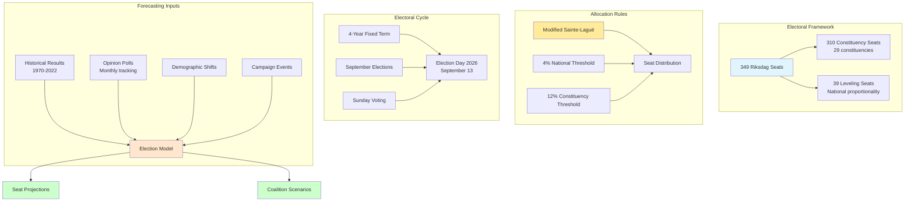

# Electoral Analysis Skill

## Purpose

This skill provides comprehensive methodologies for analyzing Swedish electoral dynamics, forecasting election outcomes, predicting coalition formations, and assessing campaign effectiveness. It integrates statistical modeling, polling analysis, and historical trend analysis to produce high-confidence intelligence products for democratic accountability assessment.

## When to Use This Skill

Apply this skill when:
- ✅ Forecasting election outcomes (seat projections, vote shares)
- ✅ Analyzing polling trends and calculating poll aggregates
- ✅ Predicting coalition formation post-election
- ✅ Assessing swing voter behavior and electoral volatility
- ✅ Evaluating campaign effectiveness and messaging impact
- ✅ Calculating electoral system effects (proportional representation, thresholds)
- ✅ Identifying marginal constituencies and competitive races

Do NOT use for:
- ❌ Individual voter predictions (violates privacy, no granular data)
- ❌ Local/municipal elections (different dynamics, separate models)
- ❌ EU Parliament elections (different party configurations)

## Swedish Electoral System Context

### Key Electoral Characteristics



## 1. Election Forecasting Models

### Polling Aggregation & Trend Estimation

**Purpose:** Combine multiple polls to estimate current vote intention with confidence intervals.

```python
import pandas as pd
import numpy as np
from scipy import stats
from datetime import datetime, timedelta

class SwedishElectionForecaster:
    """
    Electoral forecasting for Swedish Riksdag elections
    Supports: Predictive Intelligence Framework
    """
    
    def __init__(self, db_connection):
        self.db = db_connection
        self.parties = ['S', 'M', 'SD', 'C', 'V', 'KD', 'L', 'MP']
        self.threshold = 4.0  # Electoral threshold
        
    def aggregate_polls_weighted(self, lookback_days=90):
        """
        Weighted poll aggregation using recency and sample size
        
        Data Source: External polling data (Novus, Sifo, YouGov, Demoskop)
        Intelligence Product: Current vote intention estimates
        """
        
        # Query: Fetch recent polls
        query = f"""
        SELECT 
            poll_date,
            polling_company,
            sample_size,
            party,
            percentage
        FROM opinion_polls
        WHERE poll_date >= CURRENT_DATE - INTERVAL '{lookback_days} days'
        ORDER BY poll_date DESC
        """
        
        df = pd.read_sql(query, self.db)
        
        # Calculate weights
        df['days_ago'] = (pd.Timestamp.now() - pd.to_datetime(df['poll_date'])).dt.days
        df['recency_weight'] = np.exp(-df['days_ago'] / 30)  # Exponential decay, half-life 30 days
        df['sample_weight'] = np.sqrt(df['sample_size']) / 1000  # Sample size adjustment
        df['total_weight'] = df['recency_weight'] * df['sample_weight']
        
        # Weighted average by party
        aggregated = df.groupby('party').apply(
            lambda x: np.average(x['percentage'], weights=x['total_weight'])
        ).to_dict()
        
        # Calculate standard errors
        standard_errors = df.groupby('party').apply(
            lambda x: np.sqrt(np.average((x['percentage'] - aggregated[x.name])**2, weights=x['total_weight']))
        ).to_dict()
        
        # 95% confidence intervals
        confidence_intervals = {
            party: {
                'estimate': aggregated[party],
                'lower_95': aggregated[party] - 1.96 * standard_errors[party],
                'upper_95': aggregated[party] + 1.96 * standard_errors[party]
            }
            for party in self.parties
        }
        
        return confidence_intervals
    
    def structural_forecast_model(self, election_date):
        """
        Structural model combining polls, fundamentals, and historical patterns
        
        Model Components:
        1. Current polling average (weighted 50%)
        2. Economic indicators (weighted 25%)
        3. Incumbency advantage/disadvantage (weighted 15%)
        4. Campaign effects (weighted 10%)
        """
        
        # Component 1: Polling average
        polls = self.aggregate_polls_weighted()
        
        # Component 2: Economic fundamentals
        query = """
        SELECT 
            indicator_name,
            value,
            year
        FROM world_bank_data
        WHERE country_code = 'SWE'
            AND indicator_name IN ('GDP growth', 'Unemployment rate', 'Inflation')
            AND year = EXTRACT(YEAR FROM CURRENT_DATE) - 1
        """
        
        economic_df = pd.read_sql(query, self.db)
        economic_score = self.calculate_economic_vote(economic_df)
        
        # Component 3: Incumbency factor
        query_incumbent = """
        SELECT 
            party,
            in_government,
            government_duration_years
        FROM current_government_status
        """
        
        incumbency_df = pd.read_sql(query_incumbent, self.db)
        incumbency_effects = self.calculate_incumbency_penalty(incumbency_df)
        
        # Component 4: Campaign effects (closer to election = more weight on polls)
        days_until_election = (election_date - datetime.now()).days
        campaign_factor = 1.0 if days_until_election < 30 else 0.5  # Polls more reliable near election
        
        # Combine components
        forecasts = {}
        for party in self.parties:
            poll_component = polls[party]['estimate'] * 0.5 * campaign_factor
            economic_component = economic_score.get(party, 0) * 0.25
            incumbency_component = incumbency_effects.get(party, 0) * 0.15
            
            forecast = poll_component + economic_component + incumbency_component
            
            # Ensure non-negative and sums to 100%
            forecasts[party] = max(0, forecast)
        
        # Normalize to 100%
        total = sum(forecasts.values())
        forecasts = {party: (vote / total) * 100 for party, vote in forecasts.items()}
        
        return forecasts
    
    def calculate_economic_vote(self, economic_df):
        """
        Model economic voting: Good economy benefits incumbents
        
        Formula: ΔVote = β₁*GDP_growth + β₂*Unemployment_change + β₃*Inflation
        Coefficients based on Swedish electoral research
        """
        
        gdp_growth = economic_df[economic_df['indicator_name'] == 'GDP growth']['value'].iloc[0]
        unemployment = economic_df[economic_df['indicator_name'] == 'Unemployment rate']['value'].iloc[0]
        inflation = economic_df[economic_df['indicator_name'] == 'Inflation']['value'].iloc[0]
        
        # Economic vote model (simplified coefficients)
        economic_advantage = (0.5 * gdp_growth) - (0.3 * unemployment) - (0.2 * inflation)
        
        # Query: Which parties are in government
        query = "SELECT party FROM current_government_status WHERE in_government = TRUE"
        incumbent_parties = pd.read_sql(query, self.db)['party'].tolist()
        
        # Allocate economic vote to incumbents
        economic_scores = {}
        for party in self.parties:
            if party in incumbent_parties:
                economic_scores[party] = economic_advantage / len(incumbent_parties)
            else:
                economic_scores[party] = 0
        
        return economic_scores
    
    def calculate_incumbency_penalty(self, incumbency_df):
        """
        Model incumbency fatigue: Long-serving governments lose support
        
        Penalty = -0.5% per year in government (capped at -5%)
        """
        
        penalties = {}
        for _, row in incumbency_df.iterrows():
            if row['in_government']:
                penalty = min(-0.5 * row['government_duration_years'], -5.0)
                penalties[row['party']] = penalty
            else:
                penalties[row['party']] = 0
        
        return penalties
```

### Seat Projection Algorithm

**Purpose:** Convert vote share forecasts to seat allocations using Modified Sainte-Laguë method.

```python
def project_riksdag_seats(self, vote_shares):
    """
    Project Riksdag seat distribution from vote share forecasts
    
    Method: Modified Sainte-Laguë with 4% threshold
    Output: 349 seats allocated across parties
    """
    
    # Apply 4% threshold
    qualified_parties = {
        party: vote for party, vote in vote_shares.items()
        if vote >= self.threshold
    }
    
    if len(qualified_parties) == 0:
        raise ValueError("No parties exceed 4% threshold")
    
    # Allocate 349 seats
    seats_allocated = {party: 0 for party in qualified_parties}
    
    for seat_num in range(349):
        # Calculate quotient for each party
        quotients = {}
        for party, vote_pct in qualified_parties.items():
            if seats_allocated[party] == 0:
                divisor = 1.4  # First seat divisor (modified Sainte-Laguë)
            else:
                divisor = 2 * seats_allocated[party] + 1
            
            quotients[party] = vote_pct / divisor
        
        # Award seat to party with highest quotient
        winning_party = max(quotients, key=quotients.get)
        seats_allocated[winning_party] += 1
    
    return seats_allocated

def monte_carlo_seat_simulation(self, vote_forecasts, n_simulations=10000):
    """
    Monte Carlo simulation for seat projection confidence intervals
    
    Method: Sample from vote share distributions, calculate seats
    Output: Probability distribution of seat outcomes
    """
    
    seat_simulations = {party: [] for party in self.parties}
    
    for _ in range(n_simulations):
        # Sample vote shares from normal distributions (using forecast uncertainties)
        sampled_votes = {}
        for party in self.parties:
            mean = vote_forecasts[party]['estimate']
            std = (vote_forecasts[party]['upper_95'] - vote_forecasts[party]['lower_95']) / (2 * 1.96)
            
            # Sample and ensure non-negative
            sampled_votes[party] = max(0, np.random.normal(mean, std))
        
        # Normalize to 100%
        total = sum(sampled_votes.values())
        sampled_votes = {party: (vote / total) * 100 for party, vote in sampled_votes.items()}
        
        # Calculate seats for this sample
        try:
            seats = self.project_riksdag_seats(sampled_votes)
            for party in self.parties:
                seat_simulations[party].append(seats.get(party, 0))
        except ValueError:
            # Skip if no parties exceed threshold (rare edge case)
            continue
    
    # Calculate statistics
    seat_projections = {}
    for party in self.parties:
        sims = seat_simulations[party]
        seat_projections[party] = {
            'median': int(np.median(sims)),
            'mean': np.mean(sims),
            'lower_95': int(np.percentile(sims, 2.5)),
            'upper_95': int(np.percentile(sims, 97.5)),
            'probability_in_riksdag': sum(s > 0 for s in sims) / len(sims)
        }
    
    return seat_projections
```

## 2. Coalition Formation Prediction

**Purpose:** Forecast which coalition is most likely to form government post-election.

```python
class CoalitionPredictor:
    """
    Coalition formation analysis using game theory and historical patterns
    Supports: Decision Intelligence Framework
    """
    
    def __init__(self, db_connection):
        self.db = db_connection
    
    def enumerate_viable_coalitions(self, seat_projections):
        """
        Generate all mathematically viable coalition combinations
        
        Criteria:
        1. Total seats ≥ 175 (majority)
        2. Ideologically compatible parties
        3. No historical vetoes (e.g., no party wants coalition with SD except M/KD)
        """
        
        from itertools import combinations
        
        parties = list(seat_projections.keys())
        viable_coalitions = []
        
        # Define compatibility matrix based on Swedish political reality
        incompatible_pairs = [
            ('S', 'M'),   # Polar opposites
            ('S', 'SD'),  # S refuses SD cooperation
            ('V', 'M'),   # Ideological incompatibility
            ('V', 'KD'),  # Ideological incompatibility
            ('MP', 'SD'), # Ideological incompatibility
            ('L', 'V'),   # Ideological distance
        ]
        
        # Iterate through all possible combinations
        for r in range(1, len(parties) + 1):
            for combo in combinations(parties, r):
                total_seats = sum(seat_projections[p]['median'] for p in combo)
                
                # Check majority threshold
                if total_seats >= 175:
                    # Check compatibility
                    compatible = True
                    for p1, p2 in combinations(combo, 2):
                        if (p1, p2) in incompatible_pairs or (p2, p1) in incompatible_pairs:
                            compatible = False
                            break
                    
                    if compatible:
                        viable_coalitions.append({
                            'parties': combo,
                            'total_seats': total_seats,
                            'size': len(combo)
                        })
        
        return viable_coalitions
    
    def calculate_coalition_stability(self, coalition_parties):
        """
        Assess coalition stability using voting alignment history
        
        Data Source: view_riksdagen_party_coalition_agreeableness
        Output: Stability score 0-100
        """
        
        query = f"""
        SELECT 
            p1.party as party_a,
            p2.party as party_b,
            AVG(CASE WHEN p1.party_position = p2.party_position THEN 1.0 ELSE 0.0 END) as alignment_rate
        FROM view_riksdagen_party_ballot_support_annual_summary p1
        JOIN view_riksdagen_party_ballot_support_annual_summary p2 
            ON p1.ballot_id = p2.ballot_id 
            AND p1.party < p2.party
        WHERE p1.party IN {tuple(coalition_parties)}
            AND p2.party IN {tuple(coalition_parties)}
            AND p1.vote_date >= CURRENT_DATE - INTERVAL '4 years'
        GROUP BY p1.party, p2.party
        """
        
        alignment_df = pd.read_sql(query, self.db)
        
        # Average pairwise alignment
        stability_score = alignment_df['alignment_rate'].mean() * 100
        
        return stability_score
    
    def predict_coalition_probability(self, viable_coalitions):
        """
        Assign formation probability to each viable coalition
        
        Factors:
        1. Seat surplus (more seats = more stable)
        2. Coalition size (fewer parties = easier negotiation)
        3. Historical stability (voting alignment)
        4. Ideological cohesion
        """
        
        coalition_scores = []
        
        for coalition in viable_coalitions:
            parties = coalition['parties']
            seats = coalition['total_seats']
            size = coalition['size']
            
            # Factor 1: Seat surplus (above 175)
            seat_surplus = seats - 175
            seat_score = min(seat_surplus / 50, 1.0) * 30  # Max 30 points
            
            # Factor 2: Coalition size (fewer is better)
            size_score = max(0, 30 - (size - 1) * 10)  # 30 for single party, 20 for 2 parties, etc.
            
            # Factor 3: Historical stability
            stability = self.calculate_coalition_stability(parties)
            stability_score = stability * 0.3  # Max 30 points
            
            # Factor 4: Ideological cohesion (simplified)
            # Center-right bloc: M, KD, L, C = high cohesion
            # Left bloc: S, V, MP = high cohesion
            if set(parties).issubset({'M', 'KD', 'L', 'C'}):
                ideology_score = 10
            elif set(parties).issubset({'S', 'V', 'MP'}):
                ideology_score = 10
            else:
                ideology_score = 5  # Mixed bloc
            
            total_score = seat_score + size_score + stability_score + ideology_score
            
            coalition_scores.append({
                'coalition': ' + '.join(parties),
                'parties': parties,
                'seats': seats,
                'probability_score': total_score,
                'factors': {
                    'seat_surplus': seat_score,
                    'size_penalty': size_score,
                    'stability': stability_score,
                    'ideology': ideology_score
                }
            })
        
        # Normalize scores to probabilities
        total_score = sum(c['probability_score'] for c in coalition_scores)
        for coalition in coalition_scores:
            coalition['formation_probability'] = (coalition['probability_score'] / total_score) * 100
        
        # Sort by probability
        coalition_scores.sort(key=lambda x: x['formation_probability'], reverse=True)
        
        return coalition_scores
```

## 3. Swing Voter Analysis

**Purpose:** Identify and model voters likely to switch parties between elections.

```sql
-- Swing District Analysis: Identify constituencies with high volatility
WITH election_volatility AS (
    SELECT 
        constituency_name,
        election_year,
        party_name,
        percentage,
        ABS(percentage - LAG(percentage) OVER (
            PARTITION BY constituency_name, party_name 
            ORDER BY election_year
        )) as vote_swing
    FROM constituency_election_results
    WHERE election_year >= 2010
),
constituency_volatility_score AS (
    SELECT 
        constituency_name,
        AVG(vote_swing) as avg_swing,
        MAX(vote_swing) as max_swing,
        STDDEV(vote_swing) as swing_volatility
    FROM election_volatility
    WHERE vote_swing IS NOT NULL
    GROUP BY constituency_name
)
SELECT 
    constituency_name,
    ROUND(avg_swing, 2) as avg_swing_pct,
    ROUND(max_swing, 2) as max_swing_pct,
    ROUND(swing_volatility, 2) as volatility,
    CASE 
        WHEN avg_swing > 5.0 THEN 'HIGH VOLATILITY - Swing District'
        WHEN avg_swing > 3.0 THEN 'MODERATE VOLATILITY'
        ELSE 'LOW VOLATILITY - Safe District'
    END as district_classification
FROM constituency_volatility_score
ORDER BY avg_swing DESC
LIMIT 20;
```

## 4. Campaign Effectiveness Analysis

**Purpose:** Measure impact of campaign events on polling and vote intention.

```python
def analyze_campaign_event_impact(self, event_date, event_description):
    """
    Interrupted time series analysis for campaign event impact
    
    Method: Compare polling trend before/after event
    Example Events: Leader debates, scandals, policy announcements
    """
    
    # Query: Polling data 60 days before and after event
    query = f"""
    SELECT 
        poll_date,
        party,
        percentage
    FROM opinion_polls
    WHERE poll_date BETWEEN '{event_date - timedelta(days=60)}' 
                        AND '{event_date + timedelta(days=60)}'
    ORDER BY poll_date
    """
    
    df = pd.read_sql(query, self.db)
    
    # Create intervention variable
    df['post_event'] = (df['poll_date'] > event_date).astype(int)
    df['days_since_start'] = (df['poll_date'] - df['poll_date'].min()).dt.days
    
    impact_results = {}
    
    for party in df['party'].unique():
        party_df = df[df['party'] == party].copy()
        
        # Fit regression: Vote% ~ Time + Post_Event + Time*Post_Event
        from sklearn.linear_model import LinearRegression
        
        X = party_df[['days_since_start', 'post_event']]
        X['interaction'] = X['days_since_start'] * X['post_event']
        y = party_df['percentage']
        
        model = LinearRegression()
        model.fit(X, y)
        
        # Extract coefficients
        time_trend = model.coef_[0]
        event_impact = model.coef_[1]
        trend_change = model.coef_[2]
        
        impact_results[party] = {
            'event': event_description,
            'immediate_impact': event_impact,  # Jump in support at event
            'trend_change': trend_change,      # Change in trend slope
            'statistical_significance': self._calculate_p_value(model, X, y)
        }
    
    return impact_results
```

## 5. Threshold Watch (4% Electoral Threshold)

**Purpose:** Monitor parties at risk of falling below 4% threshold.

```sql
-- Threshold Risk Analysis: Parties near 4% cutoff
WITH recent_polls AS (
    SELECT 
        party,
        poll_date,
        percentage,
        ROW_NUMBER() OVER (PARTITION BY party ORDER BY poll_date DESC) as recency_rank
    FROM opinion_polls
    WHERE poll_date >= CURRENT_DATE - INTERVAL '90 days'
),
threshold_analysis AS (
    SELECT 
        party,
        AVG(percentage) as avg_support,
        STDDEV(percentage) as support_volatility,
        MIN(percentage) as min_support,
        MAX(percentage) as max_support,
        COUNT(*) as poll_count
    FROM recent_polls
    WHERE recency_rank <= 10  -- Last 10 polls per party
    GROUP BY party
)
SELECT 
    party,
    ROUND(avg_support, 2) as current_support,
    ROUND(support_volatility, 2) as volatility,
    ROUND(min_support, 2) as lowest_poll,
    ROUND(max_support, 2) as highest_poll,
    CASE 
        WHEN avg_support < 4.0 THEN '🔴 BELOW THRESHOLD - No seats'
        WHEN avg_support < 4.5 THEN '🟠 CRITICAL RISK - Within margin of error'
        WHEN avg_support < 5.0 THEN '🟡 MODERATE RISK - Close to threshold'
        ELSE '🟢 SAFE - Above threshold'
    END as threshold_risk,
    -- Probability of exceeding threshold (normal distribution assumption)
    ROUND(
        100 * (1 - stats.norm.cdf(4.0, avg_support, support_volatility)), 
        1
    ) as probability_exceeds_threshold
FROM threshold_analysis
WHERE avg_support <= 6.0  -- Focus on at-risk parties
ORDER BY avg_support ASC;
```

## ISMS Compliance Mapping

### ISO 27001:2022 Controls

**A.5.9 - Inventory of Information and Other Associated Assets**
- Electoral data sources cataloged and classified
- Polling methodology documented for transparency

**A.5.33 - Protection of Records**
- Historical election results maintained with integrity
- Version control for forecast models

### NIST CSF 2.0 Functions

**IDENTIFY (ID)**
- ID.RA-1: Electoral volatility risks identified through swing analysis
- ID.RA-2: Threat intelligence on foreign election interference integrated

**DETECT (DE)**
- DE.AE-3: Event data aggregated and correlated (polling anomalies, manipulation)

### CIS Controls v8.1

**CIS Control 3: Data Protection**
- 3.1: Establish data inventory (electoral data, polling sources)
- 3.12: Segment data processing and storage based on classification

**CIS Control 12: Network Infrastructure Management**
- 12.4: Deny unauthorized communication over network (protect polling data feeds)

## Hack23 ISMS Policy References

**Data Classification Policy**
- Link: https://github.com/Hack23/ISMS-PUBLIC/blob/main/Data_Classification_Policy.md
- Application: Election forecasts classified as PUBLIC, polling models as INTERNAL

**Privacy Policy**
- Link: https://github.com/Hack23/ISMS-PUBLIC/blob/main/Privacy_Policy.md
- Application: No individual voter data processed, only aggregate statistics

**AI Policy**
- Link: https://github.com/Hack23/ISMS-PUBLIC/blob/main/AI_Policy.md
- Application: Election models follow AI transparency requirements

**Threat Modeling**
- Link: https://github.com/Hack23/ISMS-PUBLIC/blob/main/Threat_Modeling.md
- Application: Foreign interference scenarios modeled, mitigations documented

## References

**Official Documentation:**
- Valmyndigheten (Swedish Election Authority): https://www.val.se/
- Riksdag Election Statistics: https://www.riksdagen.se/sv/sa-funkar-riksdagen/demokrati/val/

**CIA Platform Documentation:**
- Data Analysis: [DATA_ANALYSIS_INTOP_OSINT.md](../../DATA_ANALYSIS_INTOP_OSINT.md)
- Database Views: [DATABASE_VIEW_INTELLIGENCE_CATALOG.md](../../DATABASE_VIEW_INTELLIGENCE_CATALOG.md)
- Risk Rules: [RISK_RULES_INTOP_OSINT.md](../../RISK_RULES_INTOP_OSINT.md)

**Academic Sources:**
- "Forecasting Elections" - Nate Silver (FiveThirtyEight methodology)
- "The Signal and the Noise" - Nate Silver (Bayesian forecasting)
- "Election Forecasting in Sweden" - Swedish National Election Studies
- "Modified Sainte-Laguë Method" - Electoral Studies Journal

**Polling Organizations:**
- Novus: https://novus.se/
- Sifo: https://www.kantarsifo.se/
- YouGov: https://yougov.se/
- Demoskop: https://www.demoskop.se/
