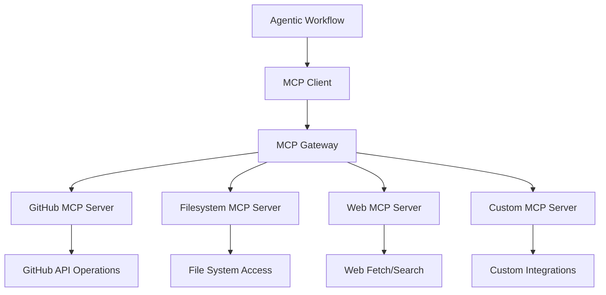
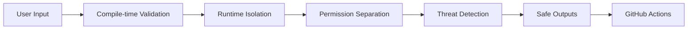
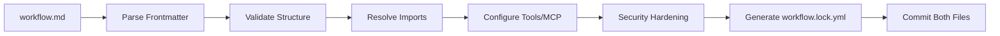

# GitHub Agentic Workflows Skill

## Purpose

This skill provides comprehensive guidance for creating, deploying, and securing **GitHub Agentic Workflows** - AI-powered automations that autonomously reason, make decisions, and take actions using natural language instructions within GitHub Actions infrastructure.

## When to Use This Skill

Apply this skill when:
- ✅ Creating AI-driven automation workflows for CI/CD, issue triage, code review, or repository management
- ✅ Implementing multi-agent orchestration with specialized workers
- ✅ Integrating MCP (Model Context Protocol) tools for GitHub operations, web access, or custom APIs
- ✅ Designing secure agentic systems with safe inputs/outputs and defense-in-depth
- ✅ Building continuous AI patterns for documentation, code quality, or security scanning
- ✅ Migrating from traditional GitHub Actions to agentic workflows
- ✅ Implementing orchestrator/worker patterns for complex multi-step tasks

Do NOT use for:
- ❌ Simple shell script automation (use traditional GitHub Actions)
- ❌ Workflows requiring deterministic, fixed execution paths without AI decision-making
- ❌ High-security operations requiring 100% predictability (agentic workflows adapt based on context)

## Core Concepts

### What Makes Workflows "Agentic"

**Agentic** means having **agency** - the ability to act independently, make context-aware decisions, and adapt behavior based on circumstances.

| **Traditional Workflows** | **Agentic Workflows** |
|--------------------------|----------------------|
| Pre-programmed if/then logic | AI-driven decision-making |
| Fixed execution sequences | Context-aware adaptation |
| Brittle when input varies | Flexible response to situations |
| Requires explicit conditionals | Natural language instructions |
| YAML-heavy configuration | Markdown-based specifications |

**Example:**
- **Traditional**: "If issue has label 'bug', assign to team A, else if label 'feature', assign to team B"
- **Agentic**: "Analyze this issue and provide helpful triage. Assign to the most appropriate team based on content and expertise"

### Workflow Structure

Every agentic workflow consists of two parts:

1. **Frontmatter** (YAML between `---` markers) - Technical configuration
2. **Markdown Instructions** - Natural language task descriptions

```markdown
---
on: issues
permissions: read-all
tools:
  github:
engine: copilot
---

# Issue Triage

Analyze this issue and provide helpful context:
- Identify the component or module affected
- Suggest relevant labels based on content
- Check for similar existing issues
- Recommend assignees based on expertise
```

## Model Context Protocol (MCP)

MCP provides a standardized interface for connecting AI agents to external tools, databases, and services with shared context across multi-step tasks.

### MCP Architecture



### Tool Configuration

```yaml
---
tools:
  github:
    toolsets:
      - repos      # Repository operations
      - issues     # Issue management
      - pull_requests  # PR operations
  
  bash:
    allowed-commands:
      - npm test
      - mvn clean install
  
  web-fetch:
    max-fetches: 5
  
  playwright:
    browser: chromium
---
```

### MCP Toolsets

| Toolset | Purpose | Key Capabilities |
|---------|---------|------------------|
| **context** | Repository metadata | `get_repository`, `get_readme` |
| **repos** | Repository operations | `create_file`, `update_file`, `search_code` |
| **issues** | Issue management | `create_issue`, `update_issue`, `list_issues` |
| **pull_requests** | PR operations | `create_pull_request`, `merge_pull_request` |
| **actions** | GitHub Actions | `list_workflows`, `trigger_workflow` |
| **security** | Security scanning | CodeQL, Dependabot alerts |
| **projects** | GitHub Projects V2 | `projects_list`, `projects_write` |

## Orchestration Patterns

### 1. Single Agent Pattern

**Use Case:** Simple, atomic tasks that one agent can handle independently.

```markdown
---
on: pull_request
permissions: read-all
tools:
  github:
    toolsets: [pull_requests, repos]
---

# PR Code Review

Review this pull request for:
- Code quality and maintainability
- Security vulnerabilities (OWASP Top 10)
- Test coverage completeness
- Documentation updates needed

Provide constructive feedback as PR comments.
```

**Benefits:**
- ✅ Simple, reliable execution
- ✅ Fast response time
- ✅ Easy to debug and test

### 2. Handoff Pattern

**Use Case:** Specialized, phased tasks where agents transfer context between steps.

```markdown
---
on: issues
permissions: read-all
tools:
  github:
    toolsets: [issues, repos]
safe-outputs:
  dispatch-workflow:
    workflows:
      - security-analysis.md
      - code-review.md
---

# Issue Triage Orchestrator

Analyze this issue:
1. Determine issue type (bug, feature, security, documentation)
2. Extract technical requirements
3. Dispatch to specialized worker based on type:
   - Security issues → security-analysis workflow
   - Code changes → code-review workflow
   - Documentation → doc-update workflow
```

**Benefits:**
- ✅ Modular, reusable components
- ✅ Clear separation of concerns
- ✅ Specialized expertise per phase

### 3. Reflection Pattern

**Use Case:** Quality assurance where agents review and critique their own or others' outputs.

```markdown
---
on: workflow_dispatch
permissions: read-all
tools:
  github:
    toolsets: [repos, pull_requests]
---

# Self-Reviewing Documentation Generator

1. Generate documentation for all classes in src/main/java
2. Review generated documentation for:
   - Clarity and completeness
   - Technical accuracy
   - Proper formatting
   - Missing edge cases
3. Iterate and improve based on self-review
4. Create pull request with final documentation
```

**Benefits:**
- ✅ Improved accuracy
- ✅ Reduced hallucination risk
- ✅ Self-correcting behavior

### 4. Magnetic Orchestration Pattern

**Use Case:** Complex, multi-domain tasks requiring parallel collaboration and central coordination.

```markdown
---
on: schedule
permissions: read-all
tools:
  github:
    toolsets: [repos, issues, pull_requests, security]
safe-outputs:
  create-issue:
    max: 10
  dispatch-workflow:
    workflows:
      - code-quality-worker.md
      - security-scan-worker.md
      - dependency-update-worker.md
---

# Weekly Repository Health Check (Orchestrator)

Coordinate health check across multiple domains:

1. Dispatch parallel workers:
   - code-quality-worker: Analyze code smells, complexity, duplication
   - security-scan-worker: Run CodeQL, dependency checks, secret scanning
   - dependency-update-worker: Check for outdated dependencies

2. Collect results from all workers (via tracker-id correlation)

3. Synthesize comprehensive health report:
   - Aggregate findings by severity
   - Identify cross-cutting concerns
   - Prioritize remediation actions

4. Create issues for critical/high findings
5. Post summary comment on previous week's report issue
```

**Benefits:**
- ✅ Scalability for complex tasks
- ✅ Parallel execution efficiency
- ✅ Dynamic composition of specialized agents
- ✅ Robust decision-making from multiple perspectives

## Safe Inputs and Safe Outputs

### Security Architecture

GitHub Agentic Workflows implements defense-in-depth security:



### Safe Inputs (Validated User Input Tools)

Custom MCP tools defined inline to prevent injection attacks:

```yaml
---
safe-inputs:
  analyze_repository:
    description: "Analyze a GitHub repository for security issues"
    parameters:
      owner:
        type: string
        description: "Repository owner (e.g., 'Hack23')"
        required: true
      repo:
        type: string
        description: "Repository name (e.g., 'cia')"
        required: true
      branch:
        type: string
        description: "Branch to analyze"
        default: "main"
    implementation: |
      #!/bin/bash
      OWNER="${owner}"
      REPO="${repo}"
      BRANCH="${branch}"
      
      # Validate inputs
      if [[ ! "$OWNER" =~ ^[a-zA-Z0-9_-]+$ ]]; then
        echo "Invalid owner name"
        exit 1
      fi
      
      # Perform analysis
      gh api "/repos/$OWNER/$REPO/branches/$BRANCH" | jq '.commit.sha'
---
```

**Benefits:**
- ✅ Lightweight tool creation without external dependencies
- ✅ Controlled access to secrets via environment variables
- ✅ Typed input parameters with validation
- ✅ Runtime generation and mounting as MCP server

### Safe Outputs (Pre-approved GitHub Operations)

AI generates structured output describing desired actions; separate permission-controlled jobs execute them.

```yaml
---
safe-outputs:
  create-issue:
    max: 5
    target-repo: "Hack23/cia"
  
  create-comment:
    max: 10
  
  create-pull-request:
    max: 1
    require-approval: true
  
  create-code-scanning-alert:
    max: 10
    severity: [high, critical]
  
  update-project:
    github-token: ${{ secrets.GH_AW_PROJECT_TOKEN }}
  
  upload-asset:
    branch: "assets/workflow-reports"
    max-size: 10240  # 10MB
    allowed-exts: [.png, .jpg, .svg, .pdf]
  
  minimize-comment:
    max: 5
    target-repo: "Hack23/cia"
  
  messages:
    run-started: "🤖 Analysis starting! [{workflow_name}]({run_url})"
    run-success: "✅ Analysis complete!"
    run-failure: "❌ Analysis failed - review logs"
    footer: "> *Generated by [{workflow_name}]({run_url})*"
---
```

**Safe Output Types:**

| Output Type | Purpose | Requires Permission |
|-------------|---------|---------------------|
| `create-issue` | Create GitHub issues | `issues: write` (safe output job) |
| `create-comment` | Comment on issues/PRs | `issues: write` (safe output job) |
| `create-pull-request` | Create PRs | `contents: write` (safe output job) |
| `create-code-scanning-alert` | Upload SARIF security findings | `security-events: write` |
| `update-project` | Manage Projects V2 | `projects: write` |
| `upload-asset` | Store files in orphaned branch | `contents: write` |
| `minimize-comment` | Hide/minimize spam comments | `contents: write` |

**Threat Detection Layer:**

Automated security analysis runs after agent execution but before safe outputs are processed:

```yaml
---
safe-outputs:
  threat-detection:
    enabled: true
    analyze-instructions: true  # Detect prompt injection
    analyze-patches: true       # Scan code changes
    analyze-secrets: true       # Detect leaked credentials
    analyze-code-quality: true  # Check for malicious patterns
    
    actions:
      on-threat-detected: fail  # Options: fail, warn, ignore
      notification: true        # Notify on findings
---
```

## Triggers

### Event-Based Triggers

```yaml
---
# Single event
on: issues

# Multiple events
on:
  issues:
    types: [opened, reopened, labeled]
  pull_request:
    types: [opened, synchronize]

# Path filters
on:
  push:
    paths:
      - 'src/**'
      - 'pom.xml'
    branches:
      - main
      - develop
---
```

### Schedule-Based Triggers

```yaml
---
# Recommended: Human-readable syntax with automatic time scattering
on: daily
on: weekly on monday
on: monthly on 1st

# Alternative: Standard cron (fixed time, Monday 9 AM UTC)
on:
  schedule:
    - cron: "0 9 * * 1"
---
```

### Manual Triggers (workflow_dispatch)

```yaml
---
on:
  workflow_dispatch:
    inputs:
      organization:
        description: "GitHub organization to scan"
        required: true
        type: string
        default: "Hack23"
      
      severity:
        description: "Minimum severity level"
        required: false
        type: choice
        options:
          - low
          - medium
          - high
          - critical
        default: "medium"
---
```

### Slash Command Triggers

```yaml
---
on:
  slash_command:
    command: review
    require_membership: true
---

# Triggered by commenting "/review" on issues or PRs
```

## Permissions

### Principle of Least Privilege

Workflows default to read-only access. Grant only necessary permissions:

```yaml
---
# Read-only (default)
permissions: read-all

# Minimal write permissions
permissions:
  contents: read
  issues: write
  pull-requests: write

# Granular control
permissions:
  contents: read
  issues: write
  pull-requests: write
  security-events: write
  actions: read
  checks: read
---
```

### Permission Separation

The agent runs with **read-only** permissions. Safe output jobs run with **write** permissions to execute approved actions:

```
┌─────────────────────┐
│  Agent Job          │  permissions: read-all
│  (AI Reasoning)     │  tools: github, bash, web-fetch
└──────────┬──────────┘
           │
           │ Outputs structured JSON
           ▼
┌─────────────────────┐
│  Threat Detection   │  Analyzes outputs for security issues
└──────────┬──────────┘
           │
           │ If safe
           ▼
┌─────────────────────┐
│  Safe Output Jobs   │  permissions: issues: write, contents: write
│  (Execution)        │  Applies approved actions
└─────────────────────┘
```

## Network Permissions

Control external domain access:

```yaml
---
network:
  defaults: true  # Allow common infrastructure (npm, maven, docker hub)

# Custom allow-list
network:
  allowed-domains:
    - "api.github.com"
    - "pypi.org"
    - "registry.npmjs.org"
    - "maven.apache.org"

# No network access
network: {}
---
```

## Compilation and Deployment

### Workflow Files

- **`.md` file** - Human-readable source of truth (editable)
- **`.lock.yml` file** - Compiled GitHub Actions YAML (machine-generated, committed)

```bash
# Install gh-aw CLI extension
gh extension install github/gh-aw

# Compile workflow
gh aw compile

# Watch for changes and auto-compile
gh aw compile --watch

# Strict validation mode
gh aw compile --strict

# Run workflow locally for testing
gh aw run <workflow-name>

# Check workflow status
gh aw status

# Download and analyze logs
gh aw logs <run-id>
```

### Compilation Process



### Security Validation

```bash
# Run with strict mode for enhanced validation
gh aw compile --strict

# Enable additional security scanners
gh aw compile --strict \
  --security-scanners actionlint,zizmor,poutine
```

## Security Best Practices (OWASP Agentic Top 10 2026)

### ASI01: Agent Goal Hijack (Prompt Injection)

**Risk:** Attacker manipulates natural language instructions to change agent behavior.

**Mitigation:**
```yaml
---
# Treat all natural language input as untrusted
safe-outputs:
  threat-detection:
    enabled: true
    analyze-instructions: true
  
# Restrict agent scope
permissions: read-all

# Require human approval for critical actions
safe-outputs:
  create-pull-request:
    require-approval: true
---
```

**Code Example:**
```markdown
# SECURE: Scoped instructions
Analyze this issue for security vulnerabilities. 
DO NOT execute any commands or take actions beyond analysis.
Report findings as structured JSON only.

# INSECURE: Broad authority
Do whatever the issue description suggests.
```

### ASI02: Tool Misuse and Exploitation

**Risk:** Agents invoke tools in unintended ways causing damage.

**Mitigation:**
```yaml
---
# Use tool allow-lists
tools:
  github:
    toolsets: [issues]  # Only issue operations, no repos write
  
  bash:
    allowed-commands:
      - npm test
      - mvn verify
      # Disallow: rm, curl with user input, eval

# Log every tool invocation
safe-outputs:
  upload-asset:
    branch: "audit-logs/tool-invocations"
---
```

### ASI03: Sensitive Data Exposure

**Risk:** Agents leak credentials, PII, or proprietary data.

**Mitigation:**
```yaml
---
# Never expose secrets to agent
env:
  # WRONG: ${{ secrets.API_KEY }}
  # RIGHT: Reference in safe-output job only
  
# Scan outputs for secrets
safe-outputs:
  threat-detection:
    analyze-secrets: true
    
# Restrict network egress
network:
  allowed-domains:
    - "api.github.com"
---
```

**Code Example:**
```markdown
# SECURE: No secret in agent instructions
Fetch data from the API. Use the configured credentials.

# INSECURE: Secret in instructions
Fetch data from https://api.example.com with API key: sk-1234567890
```

### ASI04: Memory Poisoning

**Risk:** Malicious data persisted in workflow memory corrupts future runs.

**Mitigation:**
```yaml
---
tools:
  cache-memory:
    namespace: "issue-triage"
    ttl-days: 7  # Limit retention
    
  # OR use repo-memory for permanent storage with access control
  repo-memory:
    id: "workflow-state"
    branch: "memory/issue-triage"
    paths:
      - "state/*.json"
---
```

**Validate all memory reads:**
```markdown
# Workflow instructions
1. Load previous analysis from memory
2. VALIDATE loaded data structure and types
3. Sanitize any user-generated content
4. Proceed with analysis
```

### ASI05: System Prompt Leakage

**Risk:** Attacker extracts workflow instructions or internal logic.

**Mitigation:**
```yaml
---
# Don't include sensitive logic in markdown instructions
# Use safe-inputs to encapsulate proprietary algorithms

safe-inputs:
  proprietary_analysis:
    description: "Run proprietary security analysis"
    implementation: |
      #!/bin/bash
      # Logic hidden from agent, executed in secure context
      source /secure/proprietary-algorithm.sh
      analyze_code "$@"
---
```

### ASI06: Excessive Agency

**Risk:** Agents have too much autonomy and perform destructive actions.

**Mitigation:**
```yaml
---
# Limit blast radius
permissions: read-all

safe-outputs:
  create-issue:
    max: 5  # Prevent runaway issue creation
  
  create-pull-request:
    max: 1
    require-approval: true  # Human-in-the-loop
  
# Timeout to prevent infinite loops
timeout-minutes: 30

# Concurrency control
concurrency:
  group: ${{ github.workflow }}-${{ github.ref }}
  cancel-in-progress: true
---
```

### ASI07-10: Additional Risks

| Risk | Mitigation |
|------|-----------|
| **Vector/Embedding Attacks** | Validate all RAG/embedding inputs, sanitize search queries |
| **Training Data Poisoning** | Use trusted models (GitHub Copilot), don't train on untrusted data |
| **Insecure Tool/Plugin Design** | Audit all MCP servers, use official implementations |
| **Supply Chain Vulnerabilities** | Pin action versions with SHA hashes, use Dependabot |

## Real-World Examples

### Example 1: Issue Triage Workflow

```markdown
---
on:
  issues:
    types: [opened, reopened]

permissions: read-all

tools:
  github:
    toolsets:
      - issues
      - repos

safe-outputs:
  create-comment:
    max: 1
  
  update-issue:
    max: 1
  
  messages:
    run-started: "🔍 Analyzing issue..."
    run-success: "✅ Triage complete"

timeout-minutes: 15
---

# Issue Triage Agent

Analyze this issue and provide helpful context:

1. **Component Identification**
   - Examine issue title and description
   - Search codebase for relevant files/modules
   - Identify affected component (e.g., service.data.impl, model.external.riksdagen)

2. **Label Recommendations**
   - Suggest labels based on content: bug, enhancement, documentation, security
   - Add priority: low, medium, high, critical
   - Tag component: backend, frontend, database, devops

3. **Similar Issues**
   - Search for similar open/closed issues
   - Identify potential duplicates
   - Link related issues for context

4. **Assignee Recommendation**
   - Based on file ownership (CODEOWNERS)
   - Based on expertise from past issue/PR history
   - Consider workload distribution

5. **Post Triage Comment**
   - Summary of findings
   - Recommended labels
   - Suggested assignees
   - Links to related issues/code

DO NOT:
- Close or modify issues without explicit instruction
- Assign people without confirmation
- Make code changes
```

### Example 2: Security Scan Orchestrator

```markdown
---
on:
  schedule: weekly on monday
  workflow_dispatch:

permissions: read-all

tools:
  github:
    toolsets:
      - repos
      - security
      - actions

safe-outputs:
  create-issue:
    max: 20
    labels: [security, automated]
  
  create-code-scanning-alert:
    max: 50
  
  upload-asset:
    branch: "security-reports"
    max-size: 20480
    allowed-exts: [.json, .sarif, .pdf]

timeout-minutes: 120

tracker-id: weekly-security-scan-v1
---

# Weekly Security Scan Orchestrator

Coordinate comprehensive security analysis:

## Phase 1: Discovery

1. List all active branches
2. Identify branches with recent commits (last 30 days)
3. Collect dependency manifests (pom.xml, package.json)

## Phase 2: Parallel Scanning

Dispatch specialized worker workflows:

### Worker 1: SAST Analysis
- Run CodeQL on all active branches
- Collect findings, deduplicate
- Generate SARIF report

### Worker 2: Dependency Scanning  
- Run OWASP Dependency Check
- Check for CVEs in all dependencies
- Prioritize by CVSS score

### Worker 3: Secret Scanning
- Scan git history for leaked secrets
- Check for hardcoded credentials
- Validate .gitignore coverage

### Worker 4: Configuration Review
- Review GitHub Actions workflows for security
- Check branch protection rules
- Validate CODEOWNERS and permissions

## Phase 3: Aggregation

1. Collect results from all workers (via tracker-id)
2. Deduplicate findings across scans
3. Prioritize by severity and exploitability
4. Correlate findings (e.g., vulnerable dependency + code usage)

## Phase 4: Reporting

1. Generate comprehensive security report:
   - Executive summary
   - Findings by severity (critical, high, medium, low)
   - Remediation recommendations with priority
   - Trend analysis vs. previous scans

2. Create GitHub issues for critical/high findings
3. Upload SARIF to Code Scanning
4. Store detailed report as workflow asset
5. Post summary on security tracking issue

## Success Criteria

- All scans complete without errors
- Report generated with findings
- Issues created for actionable items
- No false positive duplicate issues
```

### Example 3: Documentation Generator with Reflection

```markdown
---
on:
  pull_request:
    paths:
      - 'src/main/java/**/*.java'

permissions: read-all

tools:
  github:
    toolsets:
      - repos
      - pull_requests
  
  bash:
    allowed-commands:
      - javadoc
      - tree

safe-outputs:
  create-comment:
    max: 1
  
  create-pull-request:
    max: 1
    base: ${{ github.head_ref }}
    title: "[Auto] JavaDoc improvements"

timeout-minutes: 45
---

# JavaDoc Quality Improvement Agent

Analyze and improve JavaDoc documentation in this PR:

## Phase 1: Analysis

1. List all Java files modified in PR
2. Extract existing JavaDoc comments
3. Analyze code to understand purpose, parameters, return values, exceptions

## Phase 2: Generation

For each class/method missing or incomplete JavaDoc:

1. Generate comprehensive JavaDoc:
   - Class description (purpose, responsibilities, usage)
   - Method description (what it does, why it exists)
   - @param for each parameter (type, purpose, constraints)
   - @return for return value (type, meaning, possible values)
   - @throws for each exception (when thrown, why)
   - @see for related classes/methods
   - @since version
   - @author (if policy requires)

2. Follow Hack23 conventions:
   - Professional, clear language
   - Technical accuracy
   - No implementation details
   - Focus on contract and usage

## Phase 3: Self-Review (Reflection)

Review generated JavaDoc critically:

1. **Accuracy Check**
   - Does description match actual code behavior?
   - Are parameter types and constraints correct?
   - Are exception conditions accurate?

2. **Completeness Check**
   - Is every parameter documented?
   - Are all thrown exceptions documented?
   - Are edge cases mentioned?

3. **Clarity Check**
   - Is language clear and professional?
   - Can a developer understand usage without reading implementation?
   - Are there ambiguities?

4. **Consistency Check**
   - Does style match existing project documentation?
   - Are similar methods documented similarly?
   - Is terminology consistent?

## Phase 4: Iteration

If self-review identifies issues:
- Revise JavaDoc based on findings
- Repeat self-review
- Iterate up to 3 times or until quality threshold met

## Phase 5: Output

1. If improvements made:
   - Create commit with enhanced JavaDoc
   - Push to new branch
   - Create PR targeting current branch
   - Comment on original PR with summary

2. If no improvements needed:
   - Comment on PR: "JavaDoc quality is excellent ✅"

## Quality Standards

- 100% public API documented
- Clear, professional language
- Accurate technical descriptions
- No implementation details in docs
- Consistent with existing style
```

## Workflow Composition and Imports

Reuse common configurations across workflows:

```yaml
---
imports:
  - .github/workflows/common/security-tools.yml
  - .github/workflows/common/isms-compliance.yml

on: pull_request
permissions: read-all
---
```

**File: `.github/workflows/common/security-tools.yml`**
```yaml
tools:
  github:
    toolsets:
      - repos
      - security
  
  bash:
    allowed-commands:
      - mvn org.owasp:dependency-check-maven:check
      - npm audit

safe-outputs:
  create-code-scanning-alert:
    max: 100
```

## Labels and Organization

```yaml
---
labels:
  - security
  - automation
  - compliance
  - daily-ops

on: schedule
---
```

Filter workflows by label:
```bash
gh aw status --label security
gh aw run --label daily-ops
```

## Memory and State Management

### Cache Memory (7-day retention via GitHub Actions cache)

```yaml
---
tools:
  cache-memory:
    namespace: "issue-analysis"
    ttl-days: 7
---

# In workflow
1. Load previous issue analysis from cache-memory
2. Compare current issue with previous patterns
3. Save updated analysis to cache-memory for future runs
```

### Repo Memory (Unlimited retention via Git branches)

```yaml
---
tools:
  repo-memory:
    id: "security-state"
    branch: "memory/security-tracking"
    paths:
      - "scans/*.json"
      - "findings/*.sarif"
---

# In workflow  
1. Clone memory branch
2. Read previous scan results from /tmp/gh-aw/repo-memory-security-state/
3. Perform current scan
4. Save results to memory path
5. Workflow automatically commits and pushes to memory branch
```

## CLI Quick Reference

| Command | Purpose |
|---------|---------|
| `gh aw init` | Initialize repository for agentic workflows |
| `gh aw compile` | Compile .md to .lock.yml |
| `gh aw compile --watch` | Auto-compile on changes |
| `gh aw compile --strict` | Strict validation mode |
| `gh aw run <workflow>` | Trigger workflow manually |
| `gh aw status` | List workflows and recent runs |
| `gh aw status --label <label>` | Filter by label |
| `gh aw logs <run-id>` | Download and analyze logs |
| `gh aw add <url>` | Add workflow from another repo |
| `gh aw add-wizard <url>` | Interactive workflow import |
| `gh aw project create` | Create GitHub Project V2 |

## Testing and Validation

### Local Testing

```bash
# Compile and validate
gh aw compile --strict

# Dry run (preview mode - no actual changes)
gh aw run <workflow-name> --dry-run

# Test with custom inputs
gh aw run <workflow-name> \
  --input organization=Hack23 \
  --input severity=high
```

### Validation Checklist

Before deploying to production:

- [ ] Frontmatter YAML syntax is valid
- [ ] All required fields present (on, permissions, tools)
- [ ] Tool allowlists are minimal and necessary
- [ ] Safe outputs configured with max limits
- [ ] Threat detection enabled for sensitive operations
- [ ] Network permissions restrict unnecessary domains
- [ ] Timeout configured to prevent runaway execution
- [ ] Instructions are clear and scoped
- [ ] No secrets in markdown instructions
- [ ] Compiled .lock.yml matches .md source
- [ ] Test run successful in dry-run mode

### Monitoring and Cost Control

```bash
# Monitor token usage and costs
gh aw logs <run-id> --analyze-costs

# Set spending limits in frontmatter
---
cost-controls:
  max-tokens: 50000
  max-duration-minutes: 30
---
```

## Integration with Hack23 ISMS

### Required Documentation Updates

When implementing agentic workflows:

1. **SECURITY_ARCHITECTURE.md**
   - Document agent permissions and tool access
   - Describe safe input/output mechanisms
   - Map to ISO 27001 A.8.8 (Change Management)

2. **THREAT_MODEL.md**
   - Add agentic workflow threats (ASI01-10)
   - Document mitigations (least privilege, threat detection)
   - Include data flow diagrams

3. **WORKFLOWS.md**
   - Document all agentic workflows
   - Describe orchestration patterns
   - Link to .github/workflows/*.md files

### ISMS Control Mapping

| Control | Implementation |
|---------|---------------|
| **ISO 27001 A.8.8** | Change management via PR review of workflow changes |
| **ISO 27001 A.8.15** | Logging via GitHub Actions audit logs |
| **ISO 27001 A.9.4.1** | Access restriction via permissions and safe outputs |
| **NIST CSF PR.AC-4** | Least privilege via read-only agent permissions |
| **CIS Control 2.7** | Privileged access management via safe output jobs |

## References

### Official Documentation
- GitHub Agentic Workflows: https://github.github.com/gh-aw/
- Setup Guide: https://github.github.com/gh-aw/setup/creating-workflows/
- How They Work: https://github.github.com/gh-aw/introduction/how-they-work/
- Glossary: https://github.github.com/gh-aw/reference/glossary/
- Security Guide: https://githubnext.github.io/gh-aw/guides/security/

### Security Standards
- OWASP Agentic Top 10 2026: https://genai.owasp.org/resource/owasp-top-10-for-agentic-applications-for-2026/
- GitHub Agentic Security Principles: https://github.blog/ai-and-ml/github-copilot/how-githubs-agentic-security-principles-make-our-ai-agents-as-secure-as-possible/
- NIST Agentic AI Guidance: https://csrc.nist.gov/

### Hack23 Resources
- Secure Development Policy: https://github.com/Hack23/ISMS-PUBLIC/blob/main/Secure_Development_Policy.md
- SECURITY_ARCHITECTURE.md: /SECURITY_ARCHITECTURE.md
- THREAT_MODEL.md: /THREAT_MODEL.md
- WORKFLOWS.md: /WORKFLOWS.md

### Related Skills
- [github-actions-workflows](.github/skills/github-actions-workflows/) - Traditional GitHub Actions
- [secure-code-review](.github/skills/secure-code-review/) - Code security review
- [threat-modeling](.github/skills/threat-modeling/) - Security threat analysis
- [product-management-patterns](.github/skills/product-management-patterns/) - Workflow design patterns

## Remember

- 🤖 **Agentic workflows adapt** - They make context-aware decisions, not fixed sequences
- 🔒 **Security by design** - Use defense-in-depth: least privilege, safe outputs, threat detection
- 🧰 **MCP is the backbone** - Standardized tool integration for reliable multi-step tasks
- 🎯 **Orchestration scales** - Use patterns: single agent → handoff → reflection → magnetic orchestration
- 📝 **Natural language** - Write clear, scoped instructions; avoid implementation details
- ✅ **Safe outputs separate concerns** - AI proposes, safe output jobs execute with proper permissions
- 🛡️ **OWASP Agentic Top 10** - Mitigate goal hijack, tool misuse, data exposure, memory poisoning
- 📊 **Compile and test** - Always compile .md to .lock.yml and test before production
- 🔍 **Monitor and iterate** - Review logs, analyze costs, refine instructions based on outcomes
- 📚 **Document everything** - Update SECURITY_ARCHITECTURE.md, THREAT_MODEL.md, WORKFLOWS.md
