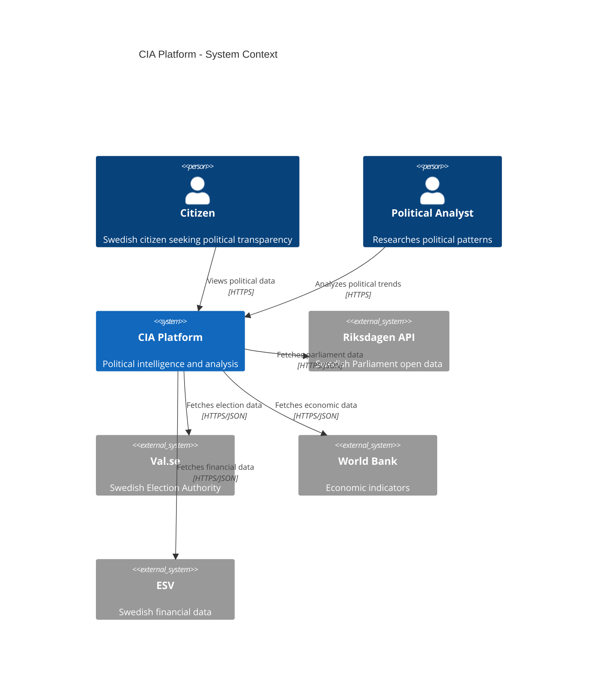
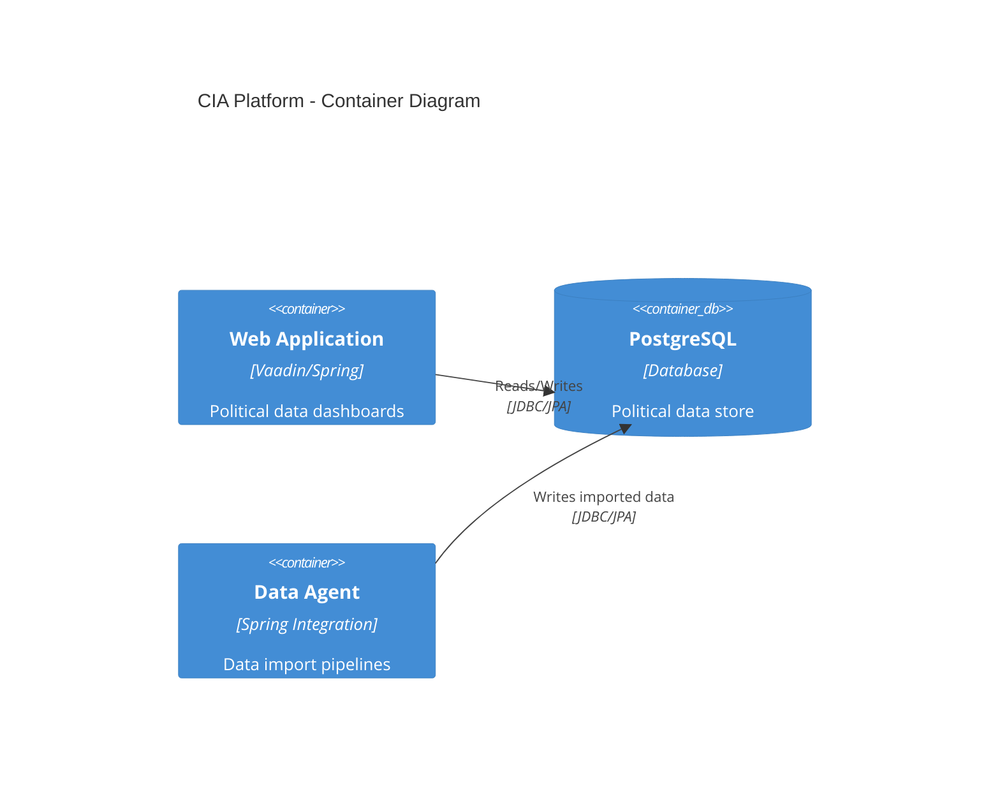

# Hack23 Future Architecture Standards Skill

## Purpose

Define and enforce architecture documentation standards across the Hack23 organization, using the C4 model for system decomposition, future state planning with ADRs (Architecture Decision Records), and consistent documentation patterns across all repositories.

## When to Use

- ✅ Documenting system architecture for new or existing projects
- ✅ Creating Architecture Decision Records (ADRs)
- ✅ Planning future state architecture migrations
- ✅ Reviewing architecture documentation for completeness
- ✅ Generating C4 model diagrams for the CIA platform

Do NOT use for:
- ❌ Code-level documentation (use JavaDoc)
- ❌ Security-specific architecture (use security-documentation skill)
- ❌ Operational runbooks (use aws-cloudwatch-monitoring skill)

## C4 Model Requirements

### Level 1: System Context

Every Hack23 project **must** include a system context diagram showing:
- The system under description
- All external actors (users, systems)
- Data flows with protocols and formats



### Level 2: Container Diagram

Show major deployable units:



### Level 3: Component Diagram

Required for complex modules showing internal components.

### Level 4: Code Diagram

Optional — only for critical/complex algorithms.

## Architecture Decision Records (ADRs)

### ADR Template

```markdown
# ADR-{number}: {Title}

## Status
{Proposed | Accepted | Deprecated | Superseded by ADR-xxx}

## Context
{What is the issue? Why do we need to make a decision?}

## Decision
{What is the change that we're proposing and/or doing?}

## Consequences
### Positive
- {Benefit 1}
- {Benefit 2}

### Negative
- {Trade-off 1}
- {Trade-off 2}

### Risks
- {Risk 1 and mitigation}
```

### ADR Naming Convention

- File: `docs/adr/ADR-NNNN-short-title.md`
- Number: Sequential, zero-padded to 4 digits
- Title: Kebab-case, descriptive

## Future State Planning

### Documentation Requirements

Each Hack23 project must maintain:

| Document | Purpose | Update Frequency |
|----------|---------|------------------|
| `ARCHITECTURE.md` | Current state architecture | Every major change |
| `FUTURE_ARCHITECTURE.md` | Target state architecture | Quarterly review |
| `SECURITY_ARCHITECTURE.md` | Security architecture | Every security change |
| `DATA_MODEL.md` | Entity relationship diagrams | Every schema change |
| `FLOWCHART.md` | Data processing workflows | When workflows change |
| `MINDMAP.md` | Component relationships | Annually |

### Migration Planning Template

```markdown
## Current State → Future State

### Phase 1: Foundation (Q1)
- [ ] Milestone 1: Description
- [ ] Milestone 2: Description

### Phase 2: Migration (Q2)
- [ ] Milestone 3: Description

### Phase 3: Optimization (Q3)
- [ ] Milestone 4: Description

### Rollback Plan
- Step 1: {rollback action}
- Step 2: {verification}
```

## Diagram Standards

### Tool Chain

- **Mermaid** — primary diagramming tool (renders in GitHub Markdown)
- **PlantUML** — alternative for complex UML diagrams
- **C4-PlantUML** — C4 model diagrams with PlantUML

### Diagram Checklist

- [ ] Title present and descriptive
- [ ] All elements labeled
- [ ] Relationships have descriptions and protocols
- [ ] Legend included for non-standard notation
- [ ] Consistent color scheme across diagrams
- [ ] Rendered preview verified in GitHub

## Cross-Repository Consistency

### Hack23 Organization Standards

All repositories under `github.com/Hack23/` must:

1. **Use consistent naming** — `ARCHITECTURE.md`, not `architecture.md`
2. **Include C4 Level 1** at minimum in `ARCHITECTURE.md`
3. **Maintain FUTURE_*.md** documents for forward planning
4. **Link related repos** — cross-reference dependent systems
5. **Version diagrams** — include date or version in diagram titles

## ISMS Alignment

| Control | Requirement |
|---------|-------------|
| ISO 27001 A.5.1 | Policies for information security (documented) |
| ISO 27001 A.8.25 | Secure development lifecycle documentation |
| NIST CSF ID.AM-2 | Software platform inventory |
| CIS Control 2 | Inventory and control of software assets |
