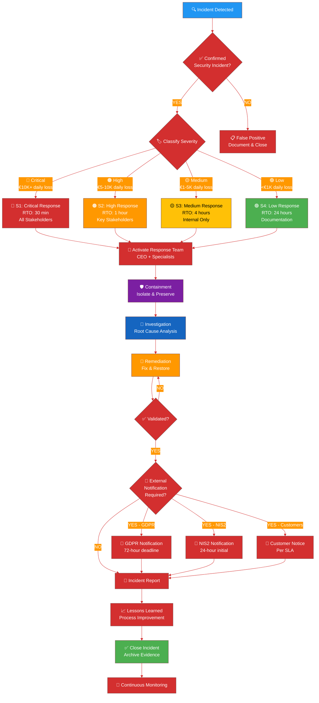
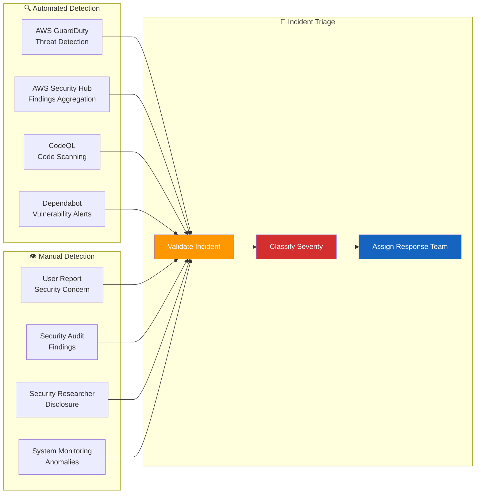

# Incident Response Skill

## Purpose

This skill establishes comprehensive procedures for detecting, analyzing, containing, eradicating, and recovering from security incidents affecting the CIA platform. It implements systematic incident management aligned with NIST SP 800-61r2, ISO 27035, and Hack23 ISMS Incident Response Plan with measurable response times and transparent communication.

## When to Use This Skill

Apply this skill when:
- ✅ Detecting security alerts or suspicious activity
- ✅ Responding to security breaches or data exposure
- ✅ Managing vulnerability exploitation incidents
- ✅ Coordinating response to service disruptions
- ✅ Handling supply chain security incidents
- ✅ Meeting GDPR 72-hour breach notification requirements
- ✅ Conducting post-incident analysis and lessons learned
- ✅ Updating incident response playbooks

Do NOT use for:
- ❌ Routine maintenance or planned downtime
- ❌ Non-security operational issues
- ❌ Performance degradation without security implications

## Decision Tree



## Incident Severity Classification

### Severity Matrix

| **Severity** | **Financial Impact** | **Operational Impact** | **RTO** | **Escalation** |
|--------------|---------------------|------------------------|---------|----------------|
| **🔴 S1: Critical** | €10K+ daily loss | Complete outage | **30 minutes** | CEO + External Consultant |
| **🟠 S2: High** | €5-10K daily loss | Major degradation | **1 hour** | CEO + Insurance Provider |
| **🟡 S3: Medium** | €1-5K daily loss | Partial impact | **4 hours** | CEO Investigation |
| **🟢 S4: Low** | <€1K daily loss | Minor inconvenience | **24 hours** | CEO Scheduled Review |

### Incident Classification Examples

**🔴 S1: Critical Incidents**
- Ransomware infection affecting production systems
- Active data breach with PII exposure
- Complete service outage affecting all users
- Successful credential theft with admin access
- Criminal liability (GDPR Article 83 violations)

**🟠 S2: High Incidents**
- Exploitation of critical vulnerability (CVSS 9.0+)
- Partial data exposure (limited user data)
- Major service degradation (>50% users affected)
- Unauthorized access to sensitive systems
- Regulatory investigation triggered

**🟡 S3: Medium Incidents**
- Attempted exploitation (blocked by controls)
- Security misconfigurations discovered
- Malware detected and quarantined
- Moderate service impact (<50% users)
- Minor compliance violations

**🟢 S4: Low Incidents**
- Failed login attempts (below threshold)
- Security scan false positives
- Minor policy violations
- Suspicious activity with no impact
- Documentation issues

## Incident Response Lifecycle

### Phase 1: Preparation

**Pre-Incident Readiness:**

```yaml
Incident_Response_Team:
  - CEO: James Pether Sörling (Incident Commander)
  - Security Lead: Primary responder
  - Development Lead: Technical remediation
  - External Consultant: On-call security expert
  - Legal Counsel: GDPR/regulatory compliance
  - Insurance Provider: Cyber insurance liaison

Tools_and_Resources:
  - AWS Detective: Log analysis and investigation
  - AWS Security Hub: Centralized security findings
  - AWS GuardDuty: Threat detection
  - GitHub Security: Repository security monitoring
  - CloudWatch Logs Insights: Query and analysis
  - Incident Response Playbooks: Scenario-specific procedures

Communication_Channels:
  - Primary: CEO email (james.sorling@hack23.com)
  - Secondary: GitHub Issues (private security issues)
  - Emergency: AWS Support (Enterprise plan)
  - External: External Stakeholder Registry contacts
  - Documentation: ISMS-PUBLIC repository updates

Evidence_Preservation:
  - AWS CloudTrail: 90-day retention
  - Application Logs: CloudWatch 30-day retention
  - Database Audit Logs: 90-day retention
  - Network Flow Logs: VPC Flow Logs 7-day retention
  - Backup Snapshots: Automated daily backups
```

**Preparation Checklist:**

- [ ] **Incident Response Plan:** Reviewed and updated quarterly
- [ ] **Contact List:** Current and tested (External Stakeholder Registry)
- [ ] **Playbooks:** Scenario-specific procedures documented
- [ ] **Tools:** AWS security services enabled and monitored
- [ ] **Training:** Annual tabletop exercises conducted
- [ ] **Backups:** Verified and tested monthly
- [ ] **Insurance:** Cyber insurance policy active and adequate
- [ ] **Legal:** Retainer with legal counsel for GDPR compliance

### Phase 2: Detection and Analysis

**Detection Sources:**



**Initial Assessment Checklist:**

- [ ] **Incident Confirmed:** Validate security incident vs. false positive
- [ ] **Scope Identified:** Affected systems, data, and users documented
- [ ] **Timeline Established:** Initial detection and estimated start time
- [ ] **Severity Classified:** Using severity matrix (S1-S4)
- [ ] **Evidence Preserved:** Logs, snapshots, and artifacts collected
- [ ] **Team Notified:** Response team activated per severity level
- [ ] **Stakeholders Informed:** CEO notified within RTO
- [ ] **Communication Plan:** Notification requirements assessed

**Analysis Activities:**

```bash
# 1. Collect AWS CloudTrail logs
aws cloudtrail lookup-events \
  --lookup-attributes AttributeKey=EventName,AttributeValue=AssumeRole \
  --start-time 2024-01-15T00:00:00Z \
  --end-time 2024-01-16T00:00:00Z \
  --max-results 100 \
  > incident-cloudtrail-logs.json

# 2. Query CloudWatch Logs
aws logs filter-log-events \
  --log-group-name /aws/lambda/cia-production \
  --start-time $(date -d '24 hours ago' +%s)000 \
  --filter-pattern "ERROR" \
  > incident-application-logs.txt

# 3. Check AWS GuardDuty findings
aws guardduty list-findings \
  --detector-id YOUR_DETECTOR_ID \
  --finding-criteria '{"Criterion":{"severity":{"Gte":7}}}' \
  --sort-criteria '{"AttributeName":"updatedAt","OrderBy":"DESC"}' \
  > incident-guardduty-findings.json

# 4. Review AWS Security Hub findings
aws securityhub get-findings \
  --filters '{"SeverityLabel":[{"Value":"CRITICAL","Comparison":"EQUALS"}]}' \
  --max-results 100 \
  > incident-securityhub-findings.json

# 5. Analyze access patterns
aws cloudtrail lookup-events \
  --lookup-attributes AttributeKey=Username,AttributeValue=SUSPECTED_USER \
  --start-time 2024-01-15T00:00:00Z \
  > incident-user-activity.json

# 6. Create evidence package
tar -czf incident-evidence-$(date +%Y%m%d-%H%M%S).tar.gz \
  incident-*.json incident-*.txt
```

### Phase 3: Containment

**Short-Term Containment:**

```yaml
Immediate_Actions:
  Network_Isolation:
    - Action: Isolate affected systems from network
    - Method: AWS Security Group rule changes
    - Command: |
        aws ec2 revoke-security-group-ingress \
          --group-id sg-AFFECTED \
          --protocol all \
          --cidr 0.0.0.0/0
  
  Access_Revocation:
    - Action: Disable compromised user accounts
    - Method: AWS IAM policy detachment
    - Command: |
        aws iam delete-login-profile \
          --user-name COMPROMISED_USER
        aws iam list-access-keys \
          --user-name COMPROMISED_USER | \
          jq -r '.AccessKeyMetadata[].AccessKeyId' | \
          xargs -I {} aws iam delete-access-key \
            --user-name COMPROMISED_USER \
            --access-key-id {}
  
  Session_Termination:
    - Action: Invalidate active sessions
    - Method: AWS IAM role trust policy update
    - Command: |
        aws iam update-assume-role-policy \
          --role-name AFFECTED_ROLE \
          --policy-document file://deny-all-policy.json
  
  Snapshot_Creation:
    - Action: Preserve current state for forensics
    - Method: EBS snapshot, RDS snapshot, S3 versioning
    - Command: |
        aws ec2 create-snapshot \
          --volume-id vol-AFFECTED \
          --description "Incident forensic snapshot $(date)"
        aws rds create-db-snapshot \
          --db-snapshot-identifier incident-snapshot-$(date +%Y%m%d) \
          --db-instance-identifier cia-production
```

**Long-Term Containment:**

```yaml
Sustained_Protection:
  System_Patching:
    - Action: Apply security patches to affected systems
    - Priority: Critical vulnerabilities first
    - Validation: Test in staging before production
  
  Password_Rotation:
    - Action: Force password reset for all affected users
    - Method: AWS Cognito password reset enforcement
    - Scope: All users if credential exposure suspected
  
  Certificate_Revocation:
    - Action: Revoke and reissue compromised certificates
    - Method: AWS Certificate Manager
    - Timeline: Immediate for compromised, planned for rotation
  
  WAF_Rules:
    - Action: Deploy AWS WAF rules to block attack patterns
    - Patterns: IP blocking, SQL injection, XSS prevention
    - Review: Daily review during incident response
  
  Enhanced_Monitoring:
    - Action: Increase logging verbosity and alerting
    - Tools: CloudWatch alarms, GuardDuty sensitivity
    - Duration: Maintain until incident closed + 30 days
```

### Phase 4: Eradication

**Root Cause Elimination:**

```yaml
Malware_Removal:
  - Identify all infected systems (AWS Systems Manager inventory)
  - Terminate compromised EC2 instances
  - Deploy clean AMI from known-good backup
  - Scan file systems with AWS Inspector
  - Verify integrity with AWS CloudWatch Logs Insights

Vulnerability_Patching:
  - Apply security patches addressing root cause
  - Update dependencies (Dependabot PRs)
  - Fix configuration weaknesses (AWS Config remediation)
  - Implement compensating controls if patch unavailable

Account_Cleanup:
  - Remove unauthorized user accounts (AWS IAM)
  - Delete rogue resources (EC2, Lambda, S3)
  - Audit and correct permission escalations
  - Review and revoke suspicious API keys

Configuration_Hardening:
  - Enable AWS GuardDuty if disabled
  - Enforce MFA for all IAM users
  - Implement least privilege IAM policies
  - Enable encryption at rest (S3, EBS, RDS)
  - Enable VPC Flow Logs for network monitoring
```

**Eradication Checklist:**

- [ ] **Root Cause Identified:** Technical analysis complete
- [ ] **Vulnerability Fixed:** Patch applied or workaround implemented
- [ ] **Malware Removed:** All infected systems cleaned or replaced
- [ ] **Accounts Secured:** Unauthorized access revoked
- [ ] **Configuration Hardened:** Security controls strengthened
- [ ] **Validation Testing:** Security scans confirm clean state
- [ ] **Documentation Updated:** Changes recorded in change log

### Phase 5: Recovery

**System Restoration:**

```yaml
Restore_Services:
  Phase_1_Critical:
    - Restore database from pre-incident backup
    - Deploy application from verified clean build
    - Restore S3 data from backup or versioning
    - Verify data integrity (checksums, record counts)
  
  Phase_2_Validation:
    - Run security scans (CodeQL, OWASP Dependency Check)
    - Execute integration tests (Maven verify)
    - Perform manual security testing
    - Validate monitoring and alerting
  
  Phase_3_Gradual_Rollout:
    - Enable read-only mode initially
    - Monitor for anomalies (30-minute observation)
    - Enable write operations selectively
    - Full restoration with enhanced monitoring

Monitoring_Enhancement:
  - CloudWatch alarm thresholds lowered
  - GuardDuty findings reviewed daily
  - Security Hub compliance checks enabled
  - Anomaly detection baseline recalculated
```

**Recovery Verification:**

```bash
# 1. Verify application functionality
curl -s https://www.hack23.com/cia/ | grep -q "Citizen Intelligence Agency"
echo "Application accessible: $?"

# 2. Check database connectivity
psql -h DATABASE_HOST -U cia_user -d cia_db -c "SELECT COUNT(*) FROM politician;"

# 3. Verify API endpoints
curl -s -o /dev/null -w "%{http_code}" https://api.hack23.com/health
# Expected: 200

# 4. Test authentication
# Perform test login with known credentials
# Verify MFA enforcement

# 5. Scan for vulnerabilities
mvn dependency-check:check
# Expected: No critical vulnerabilities

# 6. Monitor logs for errors
aws logs tail /aws/lambda/cia-production --follow --filter-pattern "ERROR"
```

### Phase 6: Post-Incident Activities

**Lessons Learned Analysis:**

```markdown
# Incident Post-Mortem Template

## Incident Summary
- **Incident ID:** INC-2024-001
- **Date Detected:** 2024-01-15 09:30 UTC
- **Date Resolved:** 2024-01-16 14:00 UTC
- **Severity:** S2 (High)
- **Duration:** 28.5 hours

## Incident Details
- **Type:** Unauthorized access attempt
- **Attack Vector:** Exposed API endpoint with weak authentication
- **Affected Systems:** Production API server (EC2 instance i-0123456789abcdef)
- **Data Impact:** No data exfiltration confirmed
- **Business Impact:** €8K estimated revenue loss (service degradation)

## Timeline
- **2024-01-15 09:30 UTC:** GuardDuty alert - suspicious API calls
- **2024-01-15 09:45 UTC:** Incident validated, CEO notified
- **2024-01-15 10:00 UTC:** Response team activated (S2 severity)
- **2024-01-15 10:30 UTC:** Affected endpoint isolated (security group update)
- **2024-01-15 11:00 UTC:** Root cause identified (missing authentication)
- **2024-01-15 12:00 UTC:** Fix deployed to staging, testing complete
- **2024-01-15 14:00 UTC:** Fix deployed to production
- **2024-01-15 15:00 UTC:** Monitoring confirms normal operation
- **2024-01-16 14:00 UTC:** Incident closed after 24-hour observation

## Root Cause Analysis
**What Happened:**
New API endpoint deployed without authentication middleware. Exposed endpoint allowed unauthenticated access to internal admin functions.

**Why It Happened:**
- Code review process did not catch missing @PreAuthorize annotation
- Integration tests did not include security test cases
- Deployment pipeline lacked security gate (CodeQL did not run)

**Contributing Factors:**
- Tight deadline pressure led to shortened review
- Developer unfamiliar with Spring Security patterns
- Security requirements not explicitly documented in user story

## What Went Well
- ✅ Detection within 15 minutes (GuardDuty alert)
- ✅ Incident validation within 15 minutes
- ✅ Containment within 1 hour (met RTO)
- ✅ Clear communication with CEO throughout
- ✅ No data loss or exfiltration
- ✅ Root cause identified quickly

## What Went Wrong
- ❌ Vulnerability introduced during deployment
- ❌ Code review did not catch security issue
- ❌ Security tests inadequate
- ❌ Deployment pipeline lacked security gate

## Action Items
1. **Immediate (Week 1):**
   - [ ] Add CodeQL to required CI/CD checks (blocker) - Owner: DevOps Lead
   - [ ] Create security test template for API endpoints - Owner: Security Lead
   - [ ] Update code review checklist with security items - Owner: Dev Lead

2. **Short-Term (Month 1):**
   - [ ] Conduct security training for development team - Owner: CEO
   - [ ] Implement Spring Security audit (all @RequestMapping) - Owner: Dev Team
   - [ ] Add AWS WAF rules for API protection - Owner: Security Lead

3. **Long-Term (Quarter 1):**
   - [ ] Establish security champion program - Owner: CEO
   - [ ] Implement automated security testing framework - Owner: QA Lead
   - [ ] Document secure coding standards - Owner: Security Lead

## Metrics
- **MTTD (Mean Time to Detect):** 15 minutes (target: <30 min) ✅
- **MTTR (Mean Time to Respond):** 15 minutes (target: <1 hour) ✅
- **MTTC (Mean Time to Contain):** 1 hour (target: <1 hour) ✅
- **MTTR (Mean Time to Resolve):** 28.5 hours (target: <24 hours) ⚠️
- **Total Downtime:** 2 hours (partial degradation)

## Compliance Notifications
- **GDPR Notification:** Not required (no personal data breach)
- **NIS2 Notification:** Not required (not material incident)
- **Customer Notification:** Sent via email (transparency commitment)
- **Insurance Notification:** Submitted claim for revenue loss

## Approval
- **Incident Commander:** James Pether Sörling, CEO
- **Date:** 2024-01-16
- **Status:** Closed
- **Archive Location:** ISMS-PUBLIC/incidents/INC-2024-001.md
```

## Incident Response Playbooks

### Playbook 1: Ransomware Incident

```yaml
Ransomware_Response:
  Detection:
    - Indicators: Mass file encryption, ransom notes, unusual process activity
    - Sources: AWS GuardDuty, CloudWatch anomaly detection, user reports
  
  Immediate_Actions:
    - Isolate affected systems (network segmentation)
    - Disable user accounts (prevent lateral movement)
    - Preserve evidence (EBS snapshots, memory dumps)
    - Notify CEO and cyber insurance provider
  
  Containment:
    - Terminate infected EC2 instances
    - Disable compromised IAM credentials
    - Block malicious IP addresses (Security Groups, WAF)
    - Scan all systems for indicators of compromise
  
  Eradication:
    - Identify ransomware variant (file extensions, ransom note)
    - Remove malware from all systems
    - Patch exploited vulnerabilities
    - Reset all credentials (passwords, API keys, certificates)
  
  Recovery:
    - Restore from backups (verified clean)
    - Rebuild systems from clean AMIs
    - Validate data integrity
    - Gradual service restoration with monitoring
  
  Notification:
    - GDPR notification if PII accessed (72-hour deadline)
    - Customer notification per SLA
    - Law enforcement (if required by jurisdiction)
    - Cyber insurance claim submission
  
  References:
    - NIST SP 800-61r2 Section 3.4
    - CISA Ransomware Guide
    - AWS Incident Response Whitepaper
```

### Playbook 2: Data Breach Incident

```yaml
Data_Breach_Response:
  Detection:
    - Indicators: Unauthorized data access, data exfiltration, S3 bucket exposure
    - Sources: AWS CloudTrail, GuardDuty, Security Hub, public disclosure
  
  Immediate_Actions:
    - Assess scope of breach (what data, how many records)
    - Classify data per Data Classification Policy
    - Preserve evidence (CloudTrail logs, network logs)
    - Activate legal counsel for GDPR compliance
  
  Containment:
    - Block unauthorized access (S3 bucket policies, IAM)
    - Revoke compromised credentials
    - Enable S3 versioning to prevent further deletion
    - Monitor for continued unauthorized access
  
  Investigation:
    - Identify access method (stolen credentials, misconfiguration)
    - Determine timeline (when breach started, when detected)
    - Assess data sensitivity (PII, financial, health data)
    - Calculate affected individuals (GDPR Article 33)
  
  Notification:
    - GDPR notification to supervisory authority (72 hours)
    - Individual notification if high risk (GDPR Article 34)
    - NIS2 notification if material incident (24 hours)
    - Public disclosure if required by regulations
  
  Remediation:
    - Fix root cause (configuration, vulnerability, process)
    - Implement compensating controls
    - Enhance monitoring and alerting
    - Update incident response procedures
  
  Documentation:
    - Incident report with timeline
    - Evidence preservation for legal proceedings
    - Regulatory notification documentation
    - Lessons learned and action items
```

### Playbook 3: DDoS Attack

```yaml
DDoS_Response:
  Detection:
    - Indicators: Service degradation, high network traffic, AWS Shield alerts
    - Sources: CloudWatch metrics, AWS Shield, user reports
  
  Immediate_Actions:
    - Activate AWS Shield Advanced if not enabled
    - Enable AWS WAF rate limiting
    - Engage AWS DDoS Response Team (DRT)
    - Notify CEO and stakeholders
  
  Mitigation:
    - CloudFront distribution to absorb traffic
    - AWS Shield Advanced DDoS mitigation
    - WAF rules to block malicious patterns
    - Scale resources (Auto Scaling, RDS read replicas)
  
  Analysis:
    - Identify attack type (volumetric, protocol, application)
    - Determine attack source (IP addresses, geographic origin)
    - Assess business impact (users affected, revenue loss)
    - Estimate attack duration and intensity
  
  Communication:
    - Status page updates (transparency)
    - Customer notifications (service status)
    - Media response (if public attention)
    - Post-incident transparency report
  
  Recovery:
    - Gradual traffic restoration as attack subsides
    - Monitor for residual attack activity
    - Validate service functionality
    - Review capacity planning
  
  Post_Incident:
    - Analyze attack patterns for future prevention
    - Update WAF rules based on attack signatures
    - Review architecture for DDoS resilience
    - Consider AWS Shield Advanced if cost-justified
```

## GDPR Breach Notification Requirements

### 72-Hour Notification Rule

```yaml
GDPR_Compliance:
  Article_33_Requirements:
    - Notification to supervisory authority within 72 hours
    - Description of nature of breach
    - Name and contact details of DPO (if applicable)
    - Description of likely consequences
    - Measures taken or proposed to address breach
  
  Article_34_Requirements:
    - Direct notification to individuals if high risk
    - Clear and plain language description
    - Measures to mitigate adverse effects
    - Communication without undue delay
  
  Supervisory_Authority:
    - Sweden: Integritetsskyddsmyndigheten (IMY)
    - Contact: imy@imy.se
    - Phone: +46 (0)8 657 61 00
    - Online: https://www.imy.se/
  
  Breach_Assessment:
    High_Risk_Indicators:
      - Special categories of data (GDPR Article 9)
      - Large number of individuals affected (>1000)
      - Children or vulnerable individuals affected
      - Sensitive personal data (financial, health, criminal)
      - Data exfiltration or ransomware
    
    Low_Risk_Indicators:
      - Data already public or encrypted
      - Small number of individuals affected
      - Immediate containment successful
      - No realistic risk of harm to individuals
```

**GDPR Notification Template:**

```markdown
# Data Breach Notification to Supervisory Authority

**To:** Integritetsskyddsmyndigheten (IMY)
**From:** Hack23 AB (Data Controller)
**Date:** [Within 72 hours of breach awareness]
**Reference:** GDPR Article 33

## 1. Description of the Personal Data Breach

**Nature of Breach:**
[Describe what happened: unauthorized access, data loss, ransomware, etc.]

**Date/Time of Breach:**
- Breach Occurred: [Estimated start time]
- Breach Detected: [Detection timestamp]
- IMY Notified: [Current timestamp]

**Categories of Personal Data:**
- [X] Names and contact details
- [ ] Financial information
- [ ] Health data
- [ ] Special categories (Article 9)
- [X] Login credentials

**Data Subjects Affected:**
- Number: Approximately [X] individuals
- Categories: [Users, customers, employees, etc.]

## 2. Contact Point

**Data Protection Officer (if applicable):**
- Name: [DPO Name] or CEO: James Pether Sörling
- Email: james.sorling@hack23.com
- Phone: [Contact number]

## 3. Likely Consequences

**Assessment of Impact:**
[Describe potential harm to individuals: identity theft, financial loss, discrimination, etc.]

**Risk Level:** [High / Medium / Low]

**Justification:**
[Explain risk assessment considering data sensitivity, number affected, safeguards in place]

## 4. Measures Taken

**Containment:**
- [List immediate actions taken to stop breach]

**Mitigation:**
- [Actions to reduce harm to individuals]

**Prevention:**
- [Measures to prevent recurrence]

## 5. Additional Information

**Evidence Preservation:**
- Logs archived: [Yes/No]
- Forensic investigation: [In progress / Complete]

**Individual Notification:**
- Required: [Yes/No]
- Completed: [Yes/No / In progress]
- Method: [Email / Letter / Website notice]

**Supporting Documentation:**
[Attached incident report, forensic analysis, etc.]

---

**Declaration:**
This notification is made in compliance with GDPR Article 33. Hack23 AB commits to cooperating fully with the supervisory authority and providing updates as investigation progresses.

**Signature:** James Pether Sörling, CEO
**Date:** [Submission date]
```

## External Stakeholder Registry

**Key Contacts for Incident Response:**

```yaml
Regulatory_Authorities:
  Swedish_DPA:
    Name: Integritetsskyddsmyndigheten (IMY)
    Email: imy@imy.se
    Phone: +46 (0)8 657 61 00
    Website: https://www.imy.se/
    Purpose: GDPR breach notification
  
  Swedish_Cert:
    Name: CERT-SE (Swedish Computer Security Incident Response Team)
    Email: cert@cert.se
    Phone: +46 (0)8 632 88 00
    Website: https://www.cert.se/
    Purpose: Critical infrastructure incidents

Legal_and_Insurance:
  Legal_Counsel:
    Contact: [Law firm details]
    Purpose: GDPR compliance, regulatory response
  
  Cyber_Insurance:
    Provider: [Insurance company]
    Policy: [Policy number]
    Emergency: [24/7 hotline]
    Purpose: Incident notification, claim submission

Technical_Support:
  AWS_Support:
    Type: Enterprise Support
    Contact: AWS Console support center
    Purpose: Infrastructure incidents, DDoS mitigation
  
  External_Security_Consultant:
    Contact: [Consultant details]
    Purpose: Forensic analysis, incident response support

Communication:
  Customers:
    Method: Email notification via mailing list
    Timeline: Within 24 hours of confirmed breach
  
  Media:
    Spokesperson: CEO James Pether Sörling
    Policy: Transparency and factual communication
```

## Compliance Mapping

### ISO 27001:2022

- **A.5.24** - Information Security Incident Management Planning and Preparation
- **A.5.25** - Assessment and Decision on Information Security Events
- **A.5.26** - Response to Information Security Incidents
- **A.5.27** - Learning from Information Security Incidents

### NIST CSF 2.0

- **DE.AE** - Anomalies and Events (Detection Process)
- **RS.AN** - Analysis (Response Planning)
- **RS.MI** - Mitigation (Response Activities)
- **RS.IM** - Improvements (Post-Incident Activity)

### CIS Controls v8

- **Control 17** - Incident Response Management
- **Control 17.1** - Designate Personnel to Manage Incident Handling
- **Control 17.2** - Establish and Maintain Contact Information for Reporting Security Incidents
- **Control 17.3** - Establish and Maintain an Enterprise Process for Reporting Incidents
- **Control 17.4** - Establish and Maintain an Incident Response Process
- **Control 17.5** - Assign Key Roles and Responsibilities

### NIST SP 800-61r2

- **Section 2.3** - Incident Response Team Structure
- **Section 3.1** - Preparation
- **Section 3.2** - Detection and Analysis
- **Section 3.3** - Containment, Eradication, and Recovery
- **Section 3.4** - Post-Incident Activity

## References

- **Hack23 ISMS:** [Incident Response Plan](https://github.com/Hack23/ISMS-PUBLIC/blob/main/Incident_Response_Plan.md)
- **NIST SP 800-61r2:** Computer Security Incident Handling Guide
- **ISO 27035:** Information Security Incident Management
- **GDPR Articles 33-34:** Personal Data Breach Notification
- **AWS Incident Response:** https://docs.aws.amazon.com/whitepapers/latest/aws-security-incident-response-guide/
- **CISA Incident Response:** https://www.cisa.gov/incident-response

## Examples from CIA Platform

### Incident Example: API Endpoint Exposure

**Incident Summary:**
- **Type:** Unauthorized access (security misconfiguration)
- **Severity:** S2 (High)
- **Detection:** AWS GuardDuty alert
- **Duration:** 28.5 hours (detection to closure)
- **Impact:** No data breach, service degradation

**Key Learnings:**
- GuardDuty detected within 15 minutes (excellent MTTD)
- Code review process improved (security checklist)
- CodeQL added as required CI/CD gate
- Security training scheduled for development team

---

**Document Maintenance:**
- **Review Frequency:** Quarterly
- **Last Updated:** 2024-01-15
- **Next Review:** 2024-04-15
- **Owner:** Security Team / CIA Project Maintainers
