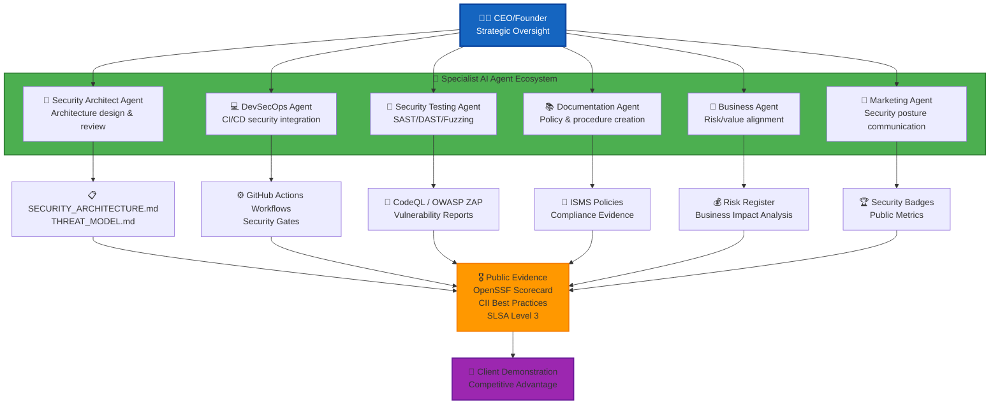
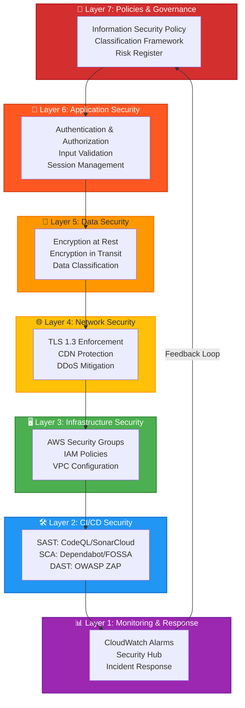

# Information Security Strategy Skill

## Purpose

This skill provides strategic security planning guidance aligned with Hack23 AB's AI-augmented operating model and transparent ISMS implementation. It enables security architects and business leaders to align security controls with business impact classifications, demonstrate security excellence through public transparency, and leverage ISMS as competitive advantage for cybersecurity consulting services.

## When to Use This Skill

Apply this skill when:
- ✅ Developing security strategies for new products or services
- ✅ Aligning security controls with business impact classifications
- ✅ Designing defense-in-depth architectures
- ✅ Evaluating risk-based security control selection
- ✅ Planning AI-augmented security operations
- ✅ Preparing security posture demonstrations for clients
- ✅ Integrating security with Porter's Five Forces strategic analysis
- ✅ Documenting security architecture decisions
- ✅ Balancing transparency with confidentiality requirements

Do NOT use for:
- ❌ Tactical incident response (use incident-response skill)
- ❌ Specific vulnerability remediation (use vulnerability-management skill)
- ❌ Code-level security reviews (use secure-code-review skill)

## AI-First Security Operations Model



**Key Strategic Principles:**
- **<1 FTE Operations:** AI agents handle 80%+ security tasks under CEO oversight
- **Transparent by Default:** 70% of ISMS publicly visible (only credentials/pricing redacted)
- **Evidence-Based:** All security claims backed by public badges and metrics
- **Business Alignment:** ISMS is not separate from business—it IS the business model

## Product Security Architecture Decision Framework

Use this decision tree when designing security controls for new products:

```mermaid
flowchart TD
    START[🎯 New Product/Service] --> CLASS{What is the<br/>Confidentiality<br/>Classification?}
    
    CLASS -->|Low| LOW_CONF[⚪ Low Confidentiality<br/>Public data only]
    CLASS -->|Moderate| MOD_CONF[🟡 Moderate Confidentiality<br/>User accounts/data]
    CLASS -->|High/Very High| HIGH_CONF[🔴 High/Very High<br/>Sensitive operations]
    
    LOW_CONF --> AUTH_LOW{Does app process<br/>user-specific data?}
    AUTH_LOW -->|No| NO_AUTH[❌ No Authentication<br/>✅ TLS 1.3 Required<br/>Example: CIA CM, Black Trigram]
    AUTH_LOW -->|Yes| BASIC_AUTH[🔐 Basic Authentication<br/>Username/Password]
    
    MOD_CONF --> AUTH_MOD[🔐 Full Authentication Stack]
    AUTH_MOD --> MFA[✅ MFA Required<br/>✅ RBAC<br/>✅ Session Management<br/>✅ Audit Logging]
    
    HIGH_CONF --> AUTH_HIGH[🔐 Enhanced Security]
    AUTH_HIGH --> ENHANCED[✅ MFA Mandatory<br/>✅ Fine-grained RBAC<br/>✅ Comprehensive Audit<br/>✅ Encryption at Rest<br/>Example: CIA Platform]
    
    NO_AUTH --> RATIONALE_LOW[📋 Document Risk Acceptance<br/>Update Risk Register<br/>Reference Classification Framework]
    BASIC_AUTH --> RATIONALE_MOD[📋 Document Control Selection<br/>Map to Classification Framework]
    MFA --> RATIONALE_HIGH[📋 Full Security Architecture<br/>SECURITY_ARCHITECTURE.md]
    ENHANCED --> RATIONALE_HIGH
    
    RATIONALE_LOW --> VERIFY[🧪 Verification Required]
    RATIONALE_MOD --> VERIFY
    RATIONALE_HIGH --> VERIFY
    
    VERIFY --> V1[✅ SECURITY_ARCHITECTURE.md created]
    VERIFY --> V2[✅ THREAT_MODEL.md completed]
    VERIFY --> V3[✅ Risk Register updated]
    VERIFY --> V4[✅ Classification badges in README]
    
    style START fill:#1565C0,stroke:#0D47A1,stroke-width:2px,color:#fff
    style LOW_CONF fill:#9E9E9E,stroke:#616161,stroke-width:2px
    style MOD_CONF fill:#FF9800,stroke:#F57C00,stroke-width:2px
    style HIGH_CONF fill:#D32F2F,stroke:#B71C1C,stroke-width:3px,color:#fff
    style NO_AUTH fill:#4CAF50,stroke:#2E7D32,stroke-width:2px,color:#fff
    style ENHANCED fill:#B71C1C,stroke:#880E4F,stroke-width:3px,color:#fff
    style VERIFY fill:#7B1FA2,stroke:#4A148C,stroke-width:2px,color:#fff
```



## Security Control Selection by Business Impact

Map security controls to [Classification Framework](https://github.com/Hack23/ISMS-PUBLIC/blob/main/CLASSIFICATION.md) business impact levels:

### High Business Impact Products
**CIA Platform** - Moderate Confidentiality, High Integrity, Moderate Availability

**Required Controls:**
```yaml
authentication:
  type: "Multi-factor with RBAC"
  implementation: "Spring Security + JWT + MFA"
  session: "Server-side with Redis"
  
audit_logging:
  framework: "Javers + AWS CloudTrail"
  retention: "7 years (regulatory compliance)"
  monitoring: "Real-time with CloudWatch alarms"
  
encryption:
  in_transit: "TLS 1.3 enforced"
  at_rest: "PostgreSQL encryption + AWS KMS"
  
access_control:
  model: "Role-Based Access Control (RBAC)"
  segregation: "Admin/User/Anonymous roles"
```

**Architecture Documentation:**
- [SECURITY_ARCHITECTURE.md](https://github.com/Hack23/cia/blob/master/SECURITY_ARCHITECTURE.md)
- [THREAT_MODEL.md](https://github.com/Hack23/cia/blob/master/THREAT_MODEL.md)

### Low Business Impact Products
**CIA Compliance Manager, Black Trigram** - Low Confidentiality, Moderate Integrity

**Required Controls:**
```yaml
authentication:
  type: "None (intentional risk acceptance)"
  rationale: "Public data only, no user-specific operations"
  risk_documentation: "Risk_Register.md entry with annual review"
  
encryption:
  in_transit: "TLS 1.3 enforced via CDN"
  at_rest: "Not applicable (no backend database)"
  
session_management:
  type: "Browser-only (localStorage/sessionStorage)"
  scope: "UI state persistence only"
  
monitoring:
  application: "None (frontend-only, stateless)"
  infrastructure: "CDN access logs only"
```

**Risk Acceptance Documentation:**
> The absence of authentication is an intentional architectural decision based on Low confidentiality classification. All data processed is public compliance framework information with no sensitive user data. This risk is documented in the Risk Register with periodic review triggers if feature requirements change.

**Architecture Documentation:**
- [CIA CM SECURITY_ARCHITECTURE.md](https://github.com/Hack23/cia-compliance-manager/blob/main/docs/architecture/SECURITY_ARCHITECTURE.md)
- [Black Trigram SECURITY_ARCHITECTURE.md](https://github.com/Hack23/blacktrigram/blob/main/SECURITY_ARCHITECTURE.md)

## Defense-in-Depth Layered Security Model

Implement security controls across multiple layers aligned with product classification:



## Porter's Five Forces Security Integration

Align security strategy with competitive advantage:

| Force | Security Implication | Strategic Response |
|-------|---------------------|-------------------|
| **Buyer Power** | Customers demand security evidence | Public badges: OpenSSF Scorecard ≥7.0, CII Best Practices, SLSA Level 3 |
| **Supplier Power** | Cloud/SaaS vendor dependencies | Multi-vendor flexibility, open source preference, SBOM transparency |
| **Entry Barriers** | Expertise required for ISMS | Transparent ISMS creates moat—competitors lack documentation maturity |
| **Substitute Threat** | In-house security teams | Demonstrate AI-augmented efficiency (<1 FTE overhead vs 3-5 FTE teams) |
| **Rivalry** | Cybersecurity consulting competition | ISMS transparency differentiates—"eat our own dog food" credibility |

**Reference:** [Information Security Strategy § Porter's Five Forces](https://github.com/Hack23/ISMS-PUBLIC/blob/main/Information_Security_Strategy.md)

## Compliance Mapping Quick Reference

Map strategic security decisions to compliance frameworks:

| Security Decision | ISO 27001:2022 | NIST CSF 2.0 | CIS Controls v8 |
|------------------|----------------|--------------|-----------------|
| Authentication model | A.5.15, A.5.16 | PR.AC-01 | 5.2, 6.3 |
| Encryption requirements | A.8.24 | PR.DS-01 | 3.10 |
| Risk acceptance process | A.5.7, A.8.3 | GV.RM-01 | 4.1 |
| Security architecture | A.8.1 | PR.IP-01 | 16.1 |
| Monitoring & logging | A.8.15, A.8.16 | DE.AE-01 | 8.2, 8.5 |

## Strategic Planning Checklist

Use this checklist when developing security strategy for new initiatives:

### Phase 1: Business Context
- [ ] Classify product using [Classification Framework](https://github.com/Hack23/ISMS-PUBLIC/blob/main/CLASSIFICATION.md)
- [ ] Identify CIA triad requirements (Confidentiality/Integrity/Availability)
- [ ] Assess Porter's Five Forces strategic positioning
- [ ] Determine business impact levels (Financial/Operational/Reputational)
- [ ] Document RTO/RPO requirements

### Phase 2: Security Architecture
- [ ] Select authentication model based on confidentiality classification
- [ ] Design authorization model (RBAC/ABAC/None)
- [ ] Plan encryption requirements (TLS/at-rest/key management)
- [ ] Define audit logging scope and retention
- [ ] Document risk acceptance for deviations from standards

### Phase 3: Defense-in-Depth
- [ ] Map controls to all 7 layers (Governance → Monitoring)
- [ ] Implement least privilege access
- [ ] Configure security boundaries (network/application/data)
- [ ] Enable automated security testing (SAST/SCA/DAST)
- [ ] Set up monitoring and alerting

### Phase 4: Evidence & Transparency
- [ ] Create SECURITY_ARCHITECTURE.md with Mermaid diagrams
- [ ] Complete THREAT_MODEL.md with STRIDE analysis
- [ ] Update Risk Register with risk acceptance decisions
- [ ] Configure security badges (OpenSSF/CII/SLSA/SonarCloud)
- [ ] Publish architecture documentation

### Phase 5: AI Operations Integration
- [ ] Configure GitHub Copilot security agents
- [ ] Enable automated security reviews
- [ ] Set up dependency scanning (Dependabot)
- [ ] Configure secret scanning
- [ ] Implement SBOM generation

## Practical Implementation Examples

### Example 1: Frontend-Only Application (Low Confidentiality)

**Scenario:** Educational gaming platform with no user accounts

**Security Architecture:**
```yaml
product_name: "Black Trigram Educational Gaming"
classification:
  confidentiality: "Low"
  integrity: "Moderate"
  availability: "Moderate"

security_controls:
  authentication: "None (risk accepted)"
  authorization: "None (public content)"
  encryption_in_transit: "TLS 1.3 via CDN"
  encryption_at_rest: "N/A (no backend)"
  session_management: "Browser localStorage only"
  audit_logging: "None (frontend-only)"
  
risk_acceptance:
  rationale: "All game content is public educational material"
  risk_register_entry: "RSK-2025-001"
  review_cycle: "Annual"
  trigger_conditions:
    - "Introduction of user accounts"
    - "Addition of user-generated content"
    - "Processing of personal data"
```

**Required Documentation:**
- SECURITY_ARCHITECTURE.md describing intentional architecture
- THREAT_MODEL.md with frontend-specific threats
- Risk Register entry documenting risk acceptance
- README.md with Classification badges

### Example 2: Multi-Tenant SaaS Platform (Moderate Confidentiality)

**Scenario:** Political transparency platform with user accounts

**Security Architecture:**
```yaml
product_name: "Citizen Intelligence Agency"
classification:
  confidentiality: "Moderate"
  integrity: "High"
  availability: "Moderate"

security_controls:
  authentication: "Multi-factor (TOTP/SMS)"
  authorization: "RBAC (Admin/User/Anonymous)"
  encryption_in_transit: "TLS 1.3"
  encryption_at_rest: "PostgreSQL + AWS KMS"
  session_management: "Server-side JWT with Redis"
  audit_logging: "Javers + CloudWatch (7-year retention)"
  
defense_in_depth:
  layer_7_governance: "Information Security Policy"
  layer_6_application: "Spring Security + MFA"
  layer_5_data: "Field-level encryption for PII"
  layer_4_network: "VPC + Security Groups"
  layer_3_infrastructure: "AWS IAM + GuardDuty"
  layer_2_cicd: "CodeQL + SonarCloud + ZAP"
  layer_1_monitoring: "CloudWatch + Security Hub"
```

**Required Documentation:**
- Comprehensive SECURITY_ARCHITECTURE.md
- Detailed THREAT_MODEL.md with attack trees
- Regular risk assessments in Risk Register
- Full compliance mapping in README.md

## Standards & Policy References

**Core Hack23 ISMS Policies:**
- [Information Security Strategy](https://github.com/Hack23/ISMS-PUBLIC/blob/main/Information_Security_Strategy.md) - Strategic planning framework
- [Classification Framework](https://github.com/Hack23/ISMS-PUBLIC/blob/main/CLASSIFICATION.md) - Business impact methodology
- [Secure Development Policy](https://github.com/Hack23/ISMS-PUBLIC/blob/main/Secure_Development_Policy.md) - Architecture documentation standards
- [Risk Register](https://github.com/Hack23/ISMS-PUBLIC/blob/main/Risk_Register.md) - Risk acceptance tracking
- [Access Control Policy](https://github.com/Hack23/ISMS-PUBLIC/blob/main/Access_Control_Policy.md) - Authentication standards

**All Hack23 ISMS Policies:** https://github.com/Hack23/ISMS-PUBLIC
