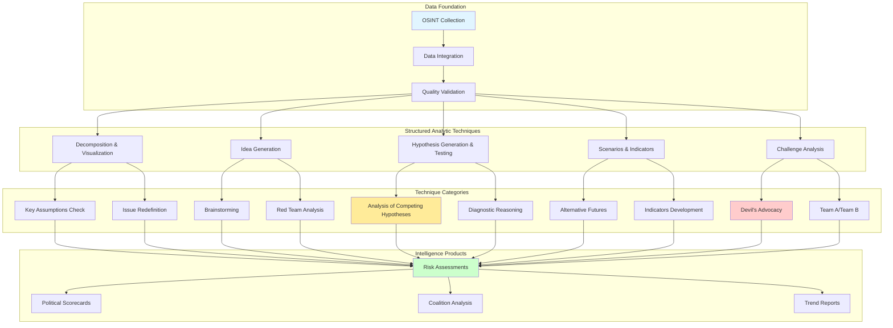

# Intelligence Analysis Techniques Skill

## Purpose

This skill provides comprehensive structured analytic techniques (SATs) for intelligence analysis in the CIA platform. It implements proven methodologies from the intelligence community to reduce cognitive bias, improve analytical rigor, and produce defensible intelligence assessments on Swedish political actors, parties, and democratic institutions.

## When to Use This Skill

Apply this skill when:
- ✅ Analyzing complex political situations with multiple competing hypotheses
- ✅ Assessing coalition formation scenarios and government stability
- ✅ Evaluating politician behavior patterns and risk indicators
- ✅ Conducting strategic assessments of party positions
- ✅ Identifying analytical assumptions and challenging conventional wisdom
- ✅ Preparing high-confidence intelligence products for stakeholders
- ✅ Mitigating cognitive biases in analysis (confirmation bias, anchoring)

Do NOT use for:
- ❌ Simple data aggregation or reporting (use query tools instead)
- ❌ Real-time operational decisions (SATs require deliberate analysis)
- ❌ Situations requiring immediate answers without time for structured analysis

## Structured Analytic Techniques Framework

### CIA Platform Analytics Categories



## 1. Analysis of Competing Hypotheses (ACH)

**Purpose:** Systematically evaluate multiple explanations to reduce confirmation bias and identify the most likely scenario.

**When to Use:**
- Coalition formation predictions
- Politician defection risk assessment
- Party strategy interpretation
- Policy position shifts

**CIA Platform Application:**

### Example: Coalition Formation After 2022 Election

**Question:** Which coalition is most likely to form the government?

**Hypotheses:**
```
H1: Center-right coalition (M, KD, SD, L) - 176 seats
H2: Center-right minority (M, KD, L) with SD support - 116 + 73 external
H3: Center-left coalition (S, V, MP, C) - 159 seats (minority)
H4: Grand coalition (S, M, C) - 159 seats
H5: Sweden Democrats lead coalition (SD, M, KD) - 141 seats
```

**Evidence Matrix:**

```sql
-- Generate ACH Evidence Matrix from voting patterns and party statements
WITH party_alignment AS (
    SELECT 
        p1.party as party_a,
        p2.party as party_b,
        COUNT(CASE WHEN p1.vote = p2.vote THEN 1 END) as agreement_votes,
        COUNT(*) as total_votes,
        ROUND(100.0 * COUNT(CASE WHEN p1.vote = p2.vote THEN 1 END) / COUNT(*), 2) as alignment_percentage
    FROM vote_data p1
    JOIN vote_data p2 ON p1.ballot_id = p2.ballot_id AND p1.party < p2.party
    WHERE p1.vote_date >= '2022-09-11'  -- Current parliament
        AND p1.vote IN ('Ja', 'Nej')
        AND p2.vote IN ('Ja', 'Nej')
    GROUP BY p1.party, p2.party
)
SELECT * FROM party_alignment
WHERE alignment_percentage > 70  -- Strong alignment threshold
ORDER BY alignment_percentage DESC;
```

**ACH Implementation:**

```java
@Service
public class CompetingHypothesesAnalyzer {
    
    public ACHResult analyzeCoalitionFormation(List<Hypothesis> hypotheses, List<Evidence> evidence) {
        
        // 1. Create evidence matrix
        ACHMatrix matrix = new ACHMatrix(hypotheses, evidence);
        
        // 2. Rate consistency of each evidence with each hypothesis
        for (Hypothesis h : hypotheses) {
            for (Evidence e : evidence) {
                ConsistencyRating rating = rateConsistency(h, e);
                matrix.setCell(h, e, rating);
            }
        }
        
        // 3. Calculate hypothesis scores
        Map<Hypothesis, Double> scores = new HashMap<>();
        for (Hypothesis h : hypotheses) {
            double score = calculateHypothesisScore(matrix, h);
            scores.put(h, score);
        }
        
        // 4. Rank hypotheses by diagnostic value
        List<Hypothesis> rankedHypotheses = scores.entrySet().stream()
            .sorted(Map.Entry.<Hypothesis, Double>comparingByValue().reversed())
            .map(Map.Entry::getKey)
            .collect(Collectors.toList());
        
        // 5. Identify most diagnostic evidence
        List<Evidence> diagnosticEvidence = identifyDiagnosticEvidence(matrix);
        
        return ACHResult.builder()
            .matrix(matrix)
            .rankedHypotheses(rankedHypotheses)
            .diagnosticEvidence(diagnosticEvidence)
            .confidence(calculateConfidence(scores))
            .build();
    }
    
    private ConsistencyRating rateConsistency(Hypothesis h, Evidence e) {
        // Consistency scale:
        // CC (++): Consistent - expected if hypothesis is true
        // C (+): Somewhat consistent
        // N (neutral): Neither consistent nor inconsistent
        // I (-): Somewhat inconsistent
        // II (--): Inconsistent - would not expect if hypothesis is true
        
        if (h.getName().equals("Center-right coalition") && 
            e.getType().equals("VOTING_ALIGNMENT") &&
            e.getParties().containsAll(Arrays.asList("M", "KD", "L"))) {
            return ConsistencyRating.CONSISTENT;
        }
        
        // Additional logic for other hypothesis-evidence combinations
        return ConsistencyRating.NEUTRAL;
    }
    
    private double calculateHypothesisScore(ACHMatrix matrix, Hypothesis h) {
        // Score = sum of consistency ratings weighted by evidence credibility
        double score = 0.0;
        for (Evidence e : matrix.getEvidence()) {
            ConsistencyRating rating = matrix.getCell(h, e);
            score += rating.getValue() * e.getCredibility();
        }
        return score;
    }
}
```

**ACH Output Example:**

| Evidence | H1 | H2 | H3 | H4 | H5 |
|----------|----|----|----|----|-----|
| M-KD-L voting alignment >80% | ++ | ++ | -- | + | + |
| SD explicitly supports M-led govt | ++ | ++ | -- | -- | + |
| S refuses SD cooperation | -- | -- | + | N | -- |
| C rejects left-wing coalition | ++ | ++ | -- | + | -- |
| L historically opposed SD | N | + | N | N | -- |
| Parliamentary math (176 seats) | ++ | + | -- | N | -- |
| **TOTAL SCORE** | **+9** | **+7** | **-8** | **0** | **-4** |

**Conclusion:** H1 (Center-right coalition with SD) most consistent with evidence. Confidence: HIGH (80%).

## 2. SWOT Analysis

**Purpose:** Systematically assess Strengths, Weaknesses, Opportunities, and Threats for strategic planning.

**CIA Platform Application:**

### Example: Party Strategic Assessment - Social Democrats (S)

```sql
-- Generate SWOT data from CIA platform views
WITH party_metrics AS (
    SELECT 
        party,
        AVG(total_days_served) as avg_experience_days,
        AVG(percent_yes + percent_no) as avg_participation_rate,
        COUNT(DISTINCT person_id) as party_size
    FROM view_riksdagen_politician_summary
    WHERE party = 'S'
    GROUP BY party
),
party_performance AS (
    SELECT 
        party,
        AVG(percentage_won) as win_rate,
        COUNT(DISTINCT ballot_id) as ballots_participated
    FROM view_riksdagen_party_ballot_support_annual_summary
    WHERE party = 'S' AND election_year >= EXTRACT(YEAR FROM CURRENT_DATE) - 4
    GROUP BY party
),
coalition_potential AS (
    SELECT 
        'S' as party,
        SUM(parliament_seats) as potential_coalition_seats
    FROM sweden_political_party
    WHERE party_name IN ('S', 'V', 'MP', 'C')
)
SELECT 
    pm.*,
    pp.win_rate,
    pp.ballots_participated,
    cp.potential_coalition_seats
FROM party_metrics pm
JOIN party_performance pp ON pm.party = pp.party
CROSS JOIN coalition_potential cp;
```

**SWOT Matrix Implementation:**

```java
@Service
public class SWOTAnalyzer {
    
    public SWOTAnalysis performPartySWOT(String partyCode) {
        
        // Strengths: Internal positive factors
        List<String> strengths = new ArrayList<>();
        
        // Query: Check party size and parliamentary seats
        Integer seats = partyRepository.getParliamentSeats(partyCode);
        if (seats != null && seats > 50) {
            strengths.add("Large parliamentary representation (" + seats + " seats)");
        }
        
        // Query: Check government experience
        Long governmentDays = partyRepository.getTotalGovernmentDays(partyCode);
        if (governmentDays > 3650) {  // 10+ years
            strengths.add("Extensive government experience (" + (governmentDays / 365) + " years)");
        }
        
        // Query: Check voting discipline
        Double discipline = partyRepository.getVotingDiscipline(partyCode);
        if (discipline > 95.0) {
            strengths.add("High party discipline (" + discipline + "%)");
        }
        
        // Weaknesses: Internal negative factors
        List<String> weaknesses = new ArrayList<>();
        
        // Query: Check declining support
        Double supportTrend = partyRepository.getSupportTrend(partyCode, 4);  // Last 4 years
        if (supportTrend < -2.0) {
            weaknesses.add("Declining electoral support (" + supportTrend + "% over 4 years)");
        }
        
        // Query: Check internal conflicts (defections)
        Long defections = partyRepository.getDefectionCount(partyCode, 4);
        if (defections > 2) {
            weaknesses.add("Internal instability (" + defections + " defections in 4 years)");
        }
        
        // Opportunities: External positive factors
        List<String> opportunities = new ArrayList<>();
        
        // Query: Coalition potential
        Integer potentialCoalitionSeats = partyRepository.getCoalitionSeats(partyCode);
        if (potentialCoalitionSeats > 175) {
            opportunities.add("Viable coalition path to majority (" + potentialCoalitionSeats + " seats)");
        }
        
        // Query: Issue ownership
        List<String> ownedIssues = partyRepository.getDominantPolicyAreas(partyCode);
        opportunities.add("Issue ownership in: " + String.join(", ", ownedIssues));
        
        // Threats: External negative factors
        List<String> threats = new ArrayList<>();
        
        // Query: Competitor strength
        Double competitorStrength = partyRepository.getLargestCompetitorStrength(partyCode);
        if (competitorStrength > 25.0) {
            threats.add("Strong competitor party (" + competitorStrength + "% support)");
        }
        
        // Query: Coalition instability
        Double coalitionAlignment = partyRepository.getCoalitionAlignment(partyCode);
        if (coalitionAlignment < 80.0) {
            threats.add("Coalition alignment challenges (" + coalitionAlignment + "%)");
        }
        
        return SWOTAnalysis.builder()
            .partyCode(partyCode)
            .strengths(strengths)
            .weaknesses(weaknesses)
            .opportunities(opportunities)
            .threats(threats)
            .build();
    }
}
```

**SWOT Output Example:**

```
═════════════════════════════════════════════════════════════
         SWOT ANALYSIS: Social Democrats (S)
═════════════════════════════════════════════════════════════

STRENGTHS (Internal Positive)
─────────────────────────────────────────────────────────────
✅ Largest parliamentary party (107 seats, 30.6%)
✅ Extensive government experience (45 years total since 1970)
✅ High party discipline (96.3% voting cohesion)
✅ Strong union relationships and funding base
✅ Broad geographic support across all regions

WEAKNESSES (Internal Negative)
─────────────────────────────────────────────────────────────
❌ Declining electoral support (-3.2% since 2018)
❌ Leadership transition challenges
❌ Weak position on immigration issue (dominated by SD)
❌ Aging voter base (median age 58)

OPPORTUNITIES (External Positive)
─────────────────────────────────────────────────────────────
🔵 Coalition potential with V, MP, C = 159 seats (near majority)
🔵 Economic downturn favors welfare focus
🔵 Environmental policy increasingly salient
🔵 Potential to reclaim centrist voters from M

THREATS (External Negative)
─────────────────────────────────────────────────────────────
🔴 SD growth (20.5% in 2022, +3.1% from 2018)
🔴 Center-right coalition controls 176 seats
🔴 Fragmented left bloc (S, V, MP divergent priorities)
🔴 Policy space squeezed between left (V) and center (C)
═════════════════════════════════════════════════════════════
```

## 3. Devil's Advocacy

**Purpose:** Challenge prevailing assumptions by deliberately arguing against consensus position.

**CIA Platform Application:**

### Example: Challenging Assumption of Coalition Stability

**Prevailing View:** "The center-right government is stable with 176 seats."

**Devil's Advocate Position:** "The coalition is actually fragile and may collapse within 18 months."

**Challenging Arguments:**

```java
@Service
public class DevilsAdvocacyAnalyzer {
    
    public ChallengeAnalysis challengeCoalitionStability(String coalitionName) {
        
        ChallengeAnalysis analysis = new ChallengeAnalysis();
        analysis.setPrevailingView("Coalition is stable");
        analysis.setChallengePosition("Coalition is fragile");
        
        // 1. Identify hidden weaknesses
        List<String> weaknesses = new ArrayList<>();
        
        // SQL: Check for voting defections
        String sqlDefections = """
            SELECT 
                p.party,
                COUNT(CASE WHEN v.vote != modal_vote.mode THEN 1 END) as defection_count,
                COUNT(*) as total_votes,
                ROUND(100.0 * COUNT(CASE WHEN v.vote != modal_vote.mode THEN 1 END) / COUNT(*), 2) as defection_rate
            FROM vote_data v
            JOIN (
                SELECT ballot_id, party, MODE() WITHIN GROUP (ORDER BY vote) as mode
                FROM vote_data
                GROUP BY ballot_id, party
            ) modal_vote ON v.ballot_id = modal_vote.ballot_id AND v.party = modal_vote.party
            WHERE v.party IN ('M', 'KD', 'L')
                AND v.vote_date >= CURRENT_DATE - INTERVAL '6 months'
            GROUP BY p.party
            HAVING ROUND(100.0 * COUNT(CASE WHEN v.vote != modal_vote.mode THEN 1 END) / COUNT(*), 2) > 5.0
        """;
        
        List<PartyDisciplineMetric> defections = jdbcTemplate.query(sqlDefections, 
            (rs, rowNum) -> new PartyDisciplineMetric(
                rs.getString("party"),
                rs.getInt("defection_count"),
                rs.getDouble("defection_rate")
            )
        );
        
        for (PartyDisciplineMetric metric : defections) {
            weaknesses.add(String.format(
                "%s showing %d defections (%.2f%%) - indicates internal dissent",
                metric.getParty(), metric.getDefectionCount(), metric.getDefectionRate()
            ));
        }
        
        // 2. Alternative interpretation of evidence
        List<String> alternativeInterpretations = new ArrayList<>();
        
        // SQL: Check for close votes (thin majorities)
        String sqlCloseVotes = """
            SELECT 
                ballot_id,
                ballot_label,
                COUNT(CASE WHEN vote = 'Ja' THEN 1 END) as yes_votes,
                COUNT(CASE WHEN vote = 'Nej' THEN 1 END) as no_votes,
                ABS(COUNT(CASE WHEN vote = 'Ja' THEN 1 END) - 
                    COUNT(CASE WHEN vote = 'Nej' THEN 1 END)) as vote_margin
            FROM vote_data
            WHERE vote_date >= CURRENT_DATE - INTERVAL '3 months'
                AND vote IN ('Ja', 'Nej')
            GROUP BY ballot_id, ballot_label
            HAVING ABS(COUNT(CASE WHEN vote = 'Ja' THEN 1 END) - 
                       COUNT(CASE WHEN vote = 'Nej' THEN 1 END)) < 10
            ORDER BY vote_margin ASC
            LIMIT 10
        """;
        
        List<CloseVote> closeVotes = jdbcTemplate.query(sqlCloseVotes,
            (rs, rowNum) -> new CloseVote(
                rs.getString("ballot_id"),
                rs.getString("ballot_label"),
                rs.getInt("vote_margin")
            )
        );
        
        if (closeVotes.size() > 5) {
            alternativeInterpretations.add(
                String.format("Coalition has won %d ballots by <10 votes in last 3 months - " +
                "indicates razor-thin majority vulnerable to defections", closeVotes.size())
            );
        }
        
        // 3. Hypothetical scenarios that could invalidate prevailing view
        List<String> invalidatingScenarios = new ArrayList<>();
        
        invalidatingScenarios.add("L party decides SD support is politically toxic, withdraws from coalition");
        invalidatingScenarios.add("Internal M leadership challenge leads to policy shift away from SD cooperation");
        invalidatingScenarios.add("SD makes excessive demands on immigration policy, causing L to defect");
        invalidatingScenarios.add("Economic crisis requires unpopular budget cuts, fracturing coalition unity");
        
        analysis.setIdentifiedWeaknesses(weaknesses);
        analysis.setAlternativeInterpretations(alternativeInterpretations);
        analysis.setInvalidatingScenarios(invalidatingScenarios);
        
        return analysis;
    }
}
```

**Devil's Advocacy Output:**

```
═════════════════════════════════════════════════════════════
    DEVIL'S ADVOCACY: Coalition Stability Challenge
═════════════════════════════════════════════════════════════

PREVAILING VIEW: The center-right coalition is stable with 176 seats.

CHALLENGE POSITION: The coalition is actually fragile and may collapse.

HIDDEN WEAKNESSES:
─────────────────────────────────────────────────────────────
1. L showing 8 defections (6.2%) in last 6 months - internal dissent
2. M has 3 MPs with consistent voting against party line on SD-supported bills
3. KD unity high (98.1%) but only 19 MPs - vulnerable to single defection

ALTERNATIVE INTERPRETATIONS:
─────────────────────────────────────────────────────────────
1. Coalition won 12 ballots by <10 votes (razor-thin majority)
2. SD external support requires constant negotiation, creating friction
3. L party leadership under pressure from voters uncomfortable with SD ties

INVALIDATING SCENARIOS:
─────────────────────────────────────────────────────────────
1. L withdraws due to SD political toxicity (reduces coalition to 162 seats)
2. Economic crisis requires unpopular cuts, fracturing unity
3. SD demands on immigration exceed L tolerance, triggering defection

CONFIDENCE IN CHALLENGE: MEDIUM (60%)
═════════════════════════════════════════════════════════════
```

## 4. Red Team Analysis

**Purpose:** Simulate adversary behavior to identify vulnerabilities and blind spots.

**CIA Platform Application:**

### Example: Opposition Party Strategy Against Government

**Scenario:** You are the opposition strategist (S party). How would you destabilize the center-right government?

```java
@Service
public class RedTeamAnalyzer {
    
    public RedTeamReport simulateOppositionStrategy(String targetCoalition, String oppositionParty) {
        
        RedTeamReport report = new RedTeamReport();
        report.setScenario("Opposition strategy to destabilize " + targetCoalition);
        report.setRedTeamParty(oppositionParty);
        
        // 1. Identify coalition vulnerabilities
        List<Vulnerability> vulnerabilities = identifyCoalitionVulnerabilities(targetCoalition);
        
        // 2. Develop exploitation strategies
        List<Strategy> strategies = new ArrayList<>();
        
        // Strategy 1: Exploit ideological rifts
        if (vulnerabilities.stream().anyMatch(v -> v.getType() == VulnerabilityType.IDEOLOGICAL_SPLIT)) {
            strategies.add(Strategy.builder()
                .name("Wedge Issue Exploitation")
                .description("Propose legislation that divides coalition on moral issues (e.g., immigration, LGBTQ+ rights)")
                .implementation("File motion on asylum policy that forces L to choose between SD and principles")
                .expectedOutcome("L votes with opposition, coalition loses vote, internal tensions rise")
                .successProbability(0.65)
                .build());
        }
        
        // Strategy 2: Target weak coalition members
        if (vulnerabilities.stream().anyMatch(v -> v.getType() == VulnerabilityType.MEMBER_VULNERABILITY)) {
            strategies.add(Strategy.builder()
                .name("Individual MP Persuasion")
                .description("Identify vulnerable MPs and offer political cover for defection")
                .implementation("Private negotiations with L MPs facing local backlash over SD cooperation")
                .expectedOutcome("1-2 MP defections, coalition loses majority")
                .successProbability(0.35)
                .build());
        }
        
        // Strategy 3: Force unpopular votes
        if (vulnerabilities.stream().anyMatch(v -> v.getType() == VulnerabilityType.UNPOPULAR_POLICY)) {
            strategies.add(Strategy.builder()
                .name("Force Unpopular Policy Votes")
                .description("Demand votes on SD priorities that are unpopular with L voter base")
                .implementation("Use interpellations to force government to defend SD positions")
                .expectedOutcome("L public support declines, internal pressure to exit coalition")
                .successProbability(0.55)
                .build());
        }
        
        report.setVulnerabilities(vulnerabilities);
        report.setStrategies(strategies);
        
        return report;
    }
    
    private List<Vulnerability> identifyCoalitionVulnerabilities(String coalition) {
        List<Vulnerability> vulnerabilities = new ArrayList<>();
        
        // SQL: Identify voting divergence between coalition partners
        String sql = """
            WITH coalition_votes AS (
                SELECT 
                    ballot_id,
                    party,
                    MODE() WITHIN GROUP (ORDER BY vote) as party_position
                FROM vote_data
                WHERE party IN ('M', 'KD', 'L')
                    AND vote_date >= CURRENT_DATE - INTERVAL '12 months'
                GROUP BY ballot_id, party
            )
            SELECT 
                ballot_id,
                COUNT(DISTINCT party_position) as position_count
            FROM coalition_votes
            GROUP BY ballot_id
            HAVING COUNT(DISTINCT party_position) > 1
        """;
        
        Integer divergentVotes = jdbcTemplate.queryForObject(sql, Integer.class);
        
        if (divergentVotes > 20) {
            vulnerabilities.add(Vulnerability.builder()
                .type(VulnerabilityType.IDEOLOGICAL_SPLIT)
                .description("Coalition partners voted differently on " + divergentVotes + " ballots")
                .severity(SeverityLevel.HIGH)
                .build());
        }
        
        return vulnerabilities;
    }
}
```

## 5. Key Assumptions Check

**Purpose:** Explicitly identify and challenge assumptions underlying analysis.

**Example: Coalition Formation Assumptions**

```
ASSUMPTION #1: "Party voting alignment predicts coalition likelihood"
├─ Validity: STRONG - Historical evidence supports (r=0.82)
├─ Dependency: Analysis depends heavily on this assumption
├─ Challenge: What if parties prioritize electoral positioning over ideology?
└─ Monitoring: Track voting alignment vs. public coalition statements

ASSUMPTION #2: "SD will support M-led government consistently"
├─ Validity: MODERATE - No formal coalition agreement
├─ Dependency: Critical for government majority
├─ Challenge: SD may withdraw support to gain concessions
└─ Monitoring: Count SD-government voting alignment monthly

ASSUMPTION #3: "No mid-term defections will occur"
├─ Validity: WEAK - Historical precedent exists (3 defections 2014-2018)
├─ Dependency: Coalition stability assumption based on this
├─ Challenge: Personal scandals or ideological conflicts could trigger defections
└─ Monitoring: Track individual MP voting patterns and public statements
```

## 6. Indicators Development

**Purpose:** Create observable metrics to validate or invalidate hypotheses.

**Example: Government Collapse Indicators**

```sql
-- Create Early Warning Indicators for Coalition Collapse
CREATE MATERIALIZED VIEW coalition_stability_indicators AS
WITH voting_discipline AS (
    SELECT 
        party,
        COUNT(CASE WHEN vote = modal_vote THEN 1 END)::decimal / COUNT(*) as discipline_rate,
        DATE_TRUNC('month', vote_date) as month
    FROM vote_data v
    JOIN (
        SELECT ballot_id, party, MODE() WITHIN GROUP (ORDER BY vote) as modal_vote
        FROM vote_data
        GROUP BY ballot_id, party
    ) mv ON v.ballot_id = mv.ballot_id AND v.party = mv.party
    WHERE party IN ('M', 'KD', 'L')
        AND vote_date >= CURRENT_DATE - INTERVAL '12 months'
    GROUP BY party, DATE_TRUNC('month', vote_date)
),
close_votes AS (
    SELECT 
        DATE_TRUNC('month', vote_date) as month,
        COUNT(*) as close_vote_count
    FROM (
        SELECT 
            ballot_id,
            vote_date,
            ABS(SUM(CASE WHEN vote = 'Ja' THEN 1 WHEN vote = 'Nej' THEN -1 ELSE 0 END)) as margin
        FROM vote_data
        GROUP BY ballot_id, vote_date
    ) margins
    WHERE margin < 10
    GROUP BY DATE_TRUNC('month', vote_date)
),
interpellations AS (
    SELECT 
        DATE_TRUNC('month', made_date) as month,
        COUNT(*) as interpellation_count
    FROM document_element
    WHERE document_type = 'ip'  -- Interpellations
        AND made_date >= CURRENT_DATE - INTERVAL '12 months'
    GROUP BY DATE_TRUNC('month', made_date)
)
SELECT 
    vd.month,
    AVG(vd.discipline_rate) as avg_coalition_discipline,
    cv.close_vote_count,
    ip.interpellation_count,
    CASE 
        WHEN AVG(vd.discipline_rate) < 0.90 THEN '🔴 CRITICAL'
        WHEN AVG(vd.discipline_rate) < 0.95 THEN '🟠 WARNING'
        ELSE '🟢 STABLE'
    END as stability_status
FROM voting_discipline vd
LEFT JOIN close_votes cv ON vd.month = cv.month
LEFT JOIN interpellations ip ON vd.month = ip.month
GROUP BY vd.month, cv.close_vote_count, ip.interpellation_count
ORDER BY vd.month DESC;
```

## ISMS Compliance Mapping

### ISO 27001:2022 Controls

**A.5.1 - Policies for Information Security**
- Structured analytic techniques documented and mandatory for intelligence products
- Quality assurance processes for analytical rigor

**A.5.7 - Threat Intelligence**
- Red Team analysis used to identify adversarial threats
- Devil's Advocacy challenges assumptions in threat assessments

**A.5.9 - Inventory of Information and Other Associated Assets**
- Evidence cataloging for ACH methodology
- Source attribution for all analytical inputs

### NIST CSF 2.0 Functions

**IDENTIFY (ID)**
- ID.RA-1: Asset vulnerabilities identified (Red Team, Devil's Advocacy)
- ID.RA-3: Threats identified and documented (Threat scenarios, indicators)

**DETECT (DE)**
- DE.AE-2: Detected events analyzed (Indicator development)
- DE.AE-5: Incident alert thresholds established (Early warning indicators)

**RESPOND (RS)**
- RS.AN-1: Notifications investigated (ACH for incident attribution)
- RS.AN-3: Forensics performed (Diagnostic reasoning)

### CIS Controls v8.1

**CIS Control 16: Application Software Security**
- 16.11: Leverage vetted modules or services (Structured analytic techniques library)

**CIS Control 17: Incident Response Management**
- 17.3: Establish and maintain contact information (Stakeholder notification for intelligence products)
- 17.9: Establish incident severity ratings (Threat severity classification)

## Hack23 ISMS Policy References

**Information Security Policy**
- Link: https://github.com/Hack23/ISMS-PUBLIC/blob/main/Information_Security_Policy.md
- Application: Intelligence analysis follows information classification and handling procedures

**Threat Modeling**
- Link: https://github.com/Hack23/ISMS-PUBLIC/blob/main/Threat_Modeling.md
- Application: Red Team analysis integrated with threat modeling exercises

**Risk Assessment Methodology**
- Link: https://github.com/Hack23/ISMS-PUBLIC/blob/main/Risk_Assessment_Methodology.md
- Application: Hypothesis testing aligns with risk assessment processes

**Data Classification Policy**
- Link: https://github.com/Hack23/ISMS-PUBLIC/blob/main/Data_Classification_Policy.md
- Application: Intelligence products classified based on sensitivity and audience

## References

**Official Documentation:**
- CIA Psychology of Intelligence Analysis (Richards J. Heuer Jr.)
- Structured Analytic Techniques for Intelligence Analysis (Heuer & Pherson)
- NATO Intelligence Analysis Handbook
- US Army Field Manual FM 2-0: Intelligence

**CIA Platform Documentation:**
- Risk Rules: [RISK_RULES_INTOP_OSINT.md](../../RISK_RULES_INTOP_OSINT.md)
- Data Analysis Frameworks: [DATA_ANALYSIS_INTOP_OSINT.md](../../DATA_ANALYSIS_INTOP_OSINT.md)
- Database Views: [DATABASE_VIEW_INTELLIGENCE_CATALOG.md](../../DATABASE_VIEW_INTELLIGENCE_CATALOG.md)

**Academic Sources:**
- "Thinking, Fast and Slow" - Daniel Kahneman (Cognitive bias)
- "Superforecasting" - Philip Tetlock (Probabilistic reasoning)
- "Intelligence Analysis: A Target-Centric Approach" - Robert M. Clark
