# Legislative Monitoring Skill

## Purpose

This skill provides comprehensive legislative monitoring capabilities for the CIA platform, enabling systematic tracking of parliamentary activities, voting patterns, committee effectiveness, bill progression, and oversight mechanisms. It transforms raw parliamentary data into actionable intelligence for understanding legislative dynamics, predicting policy outcomes, and assessing institutional effectiveness within the Swedish Riksdag.

## When to Use This Skill

Apply this skill when:
- ✅ Tracking bill progression through legislative process
- ✅ Analyzing voting deviation patterns within and across parties
- ✅ Assessing committee productivity and effectiveness
- ✅ Monitoring parliamentary oversight activities (questions, interpellations)
- ✅ Predicting legislative outcomes based on historical patterns
- ✅ Identifying cross-party collaboration opportunities
- ✅ Evaluating individual parliamentarian productivity
- ✅ Detecting legislative obstruction or procedural manipulation
- ✅ Measuring government vs. opposition effectiveness
- ✅ Tracking amendment success rates and strategic positioning

Do NOT use for:
- ❌ Manipulating legislative processes through intelligence
- ❌ Interfering with democratic parliamentary procedures
- ❌ Undermining legitimate opposition activities
- ❌ Violating parliamentary privilege or confidentiality

## Legislative Monitoring Framework

### Five Core Analytical Dimensions

The CIA platform monitors Swedish parliamentary activities across five critical dimensions to provide comprehensive legislative intelligence:

```mermaid
graph TB
    subgraph "Legislative Data Collection"
        A1[🗳️ Voting Records<br/>3.5M+ votes<br/>1971-present]
        A2[📄 Bill Tracking<br/>89K+ documents<br/>Full lifecycle]
        A3[👥 Committee Activity<br/>15 committees<br/>Productivity metrics]
        A4[🔍 Oversight Actions<br/>Questions, interpellations<br/>Accountability measures]
        A5[🤝 Cross-Party Collaboration<br/>Co-authorship networks<br/>Coalition patterns]
    end
    
    subgraph "Legislative Intelligence Analysis"
        A1 --> B1[Deviation Pattern Analysis]
        A2 --> B2[Bill Success Prediction]
        A3 --> B3[Committee Effectiveness Assessment]
        A4 --> B4[Oversight Effectiveness Tracking]
        A5 --> B5[Coalition Stability Measurement]
    end
    
    subgraph "Intelligence Products"
        B1 --> C1[Voting Intelligence]
        B2 --> C2[Legislative Forecasts]
        B3 --> C3[Institutional Health Reports]
        B4 --> C4[Accountability Metrics]
        B5 --> C5[Coalition Analysis]
    end
    
    subgraph "Strategic Intelligence"
        C1 & C2 & C3 & C4 & C5 --> D[📊 Legislative Dashboard]
        D --> E[Policy Outcome Predictions]
        D --> F[Institutional Risk Assessment]
        D --> G[Coalition Stability Forecasts]
    end
    
    style A1 fill:#e1f5ff
    style A2 fill:#e1f5ff
    style A3 fill:#e1f5ff
    style A4 fill:#e1f5ff
    style A5 fill:#e1f5ff
    style D fill:#ffe6cc
    style E fill:#ccffcc
    style F fill:#ffcccc
    style G fill:#fff9cc
```



## 1. Voting Deviation Pattern Analysis

### Party Discipline Measurement

Voting deviation from party lines reveals internal party conflicts, ideological tensions, and coalition instability. The CIA platform tracks these patterns with temporal granularity.

**Database Views:**
- `view_riksdagen_vote_data_ballot_politician_summary_daily` - Daily voting patterns
- `view_riksdagen_vote_data_ballot_politician_summary_monthly` - Monthly aggregates
- `view_riksdagen_vote_data_ballot_politician_summary_annual` - Annual trends
- `view_riksdagen_politician_ballot_summary` - Career-wide voting statistics
- `view_riksdagen_politician_decision_pattern` - Decision pattern classification

### Deviation Intelligence Framework

```java
@Service
public class VotingDeviationAnalyzer {
    
    /**
     * Analyzes voting deviation patterns to understand party discipline.
     * 
     * Intelligence applications:
     * - Identify factional splits within parties
     * - Predict coalition stability
     * - Assess leadership control
     * - Detect ideological realignment
     * - Forecast party breakaway risks
     */
    
    public DeviationIntelligence analyzePartyDeviation(
        String partyId, 
        LocalDate startDate, 
        LocalDate endDate
    ) {
        String sql = """
            WITH party_voting AS (
                SELECT 
                    v.ballot_id,
                    b.vote_date,
                    b.issue_category,
                    b.issue_subcategory,
                    b.vote_outcome,
                    
                    -- Party position (mode of party votes)
                    MODE() WITHIN GROUP (ORDER BY v.vote) as party_position,
                    
                    -- Deviation metrics
                    COUNT(*) as party_member_votes,
                    COUNT(DISTINCT v.vote) as vote_diversity,
                    
                    -- Rebel identification
                    COUNT(CASE 
                        WHEN v.vote != (MODE() WITHIN GROUP (ORDER BY v.vote)) 
                        THEN 1 END
                    ) as rebel_count,
                    
                    -- Rebel percentage
                    COUNT(CASE 
                        WHEN v.vote != (MODE() WITHIN GROUP (ORDER BY v.vote)) 
                        THEN 1 END
                    )::float / NULLIF(COUNT(*), 0) * 100 as rebel_percentage,
                    
                    -- Identify specific rebels
                    ARRAY_AGG(
                        CASE 
                            WHEN v.vote != (MODE() WITHIN GROUP (ORDER BY v.vote))
                            THEN p.person_id::text
                        END
                    ) FILTER (WHERE v.vote != (MODE() WITHIN GROUP (ORDER BY v.vote))) as rebel_ids
                    
                FROM vote v
                JOIN ballot b ON v.ballot_id = b.ballot_id
                JOIN person p ON v.person_id = p.person_id
                WHERE p.party = :partyId
                    AND b.vote_date BETWEEN :startDate AND :endDate
                GROUP BY v.ballot_id, b.vote_date, b.issue_category, 
                         b.issue_subcategory, b.vote_outcome
            ),
            deviation_patterns AS (
                SELECT 
                    issue_category,
                    COUNT(*) as total_votes,
                    AVG(rebel_percentage) as avg_deviation_rate,
                    MAX(rebel_percentage) as max_deviation_rate,
                    STDDEV(rebel_percentage) as deviation_volatility,
                    
                    -- High-deviation votes (>15% rebels)
                    COUNT(CASE WHEN rebel_percentage > 15 THEN 1 END) as high_deviation_votes,
                    
                    -- Identify consistent rebels
                    (
                        SELECT person_id, COUNT(*) as rebel_count
                        FROM UNNEST(ARRAY_AGG(rebel_ids)) as person_id
                        GROUP BY person_id
                        ORDER BY COUNT(*) DESC
                        LIMIT 10
                    ) as top_rebels
                    
                FROM party_voting
                GROUP BY issue_category
            )
            SELECT 
                p.party as party_id,
                p.party_name,
                
                -- Overall deviation metrics
                AVG(dp.avg_deviation_rate) as overall_deviation_rate,
                MAX(dp.max_deviation_rate) as peak_deviation,
                AVG(dp.deviation_volatility) as avg_volatility,
                
                -- High-risk categories (high deviation)
                ARRAY_AGG(
                    dp.issue_category 
                    ORDER BY dp.avg_deviation_rate DESC
                ) FILTER (WHERE dp.avg_deviation_rate > 10) as high_risk_categories,
                
                -- Discipline classification
                CASE 
                    WHEN AVG(dp.avg_deviation_rate) < 3 THEN 'HIGHLY_DISCIPLINED'
                    WHEN AVG(dp.avg_deviation_rate) < 7 THEN 'MODERATELY_DISCIPLINED'
                    WHEN AVG(dp.avg_deviation_rate) < 12 THEN 'LOW_DISCIPLINE'
                    ELSE 'FRACTURED'
                END as discipline_classification,
                
                -- Risk assessment
                CASE 
                    WHEN AVG(dp.avg_deviation_rate) > 15 
                        OR MAX(dp.max_deviation_rate) > 30 
                        THEN 'CRITICAL_INSTABILITY'
                    WHEN AVG(dp.avg_deviation_rate) > 10 
                        OR MAX(dp.max_deviation_rate) > 20 
                        THEN 'HIGH_FRACTURE_RISK'
                    WHEN AVG(dp.avg_deviation_rate) > 5 
                        THEN 'MODERATE_TENSION'
                    ELSE 'STABLE'
                END as stability_risk
                
            FROM party p
            JOIN deviation_patterns dp ON 1=1
            WHERE p.party = :partyId
            GROUP BY p.party, p.party_name
            """;
        
        return jdbcTemplate.queryForObject(sql, DeviationIntelligence.class,
            Map.of(
                "partyId", partyId,
                "startDate", startDate,
                "endDate", endDate
            ));
    }
}
```

### Deviation Pattern Taxonomy

| Deviation Rate | Discipline Level | Political Implications | Intelligence Assessment |
|----------------|------------------|----------------------|------------------------|
| **< 3%** | HIGHLY_DISCIPLINED | Strong leadership control, unified ideology | Reliable coalition partner |
| **3-7%** | MODERATELY_DISCIPLINED | Occasional dissent, manageable tensions | Generally stable, monitor key issues |
| **7-12%** | LOW_DISCIPLINE | Frequent internal conflicts, weak leadership | Coalition risks, factional monitoring needed |
| **> 12%** | FRACTURED | Severe internal divisions, leadership crisis | High breakaway risk, unstable partner |

### Strategic Intelligence Applications

```python
from typing import Dict, List
import pandas as pd
import numpy as np

class DeviationIntelligenceAnalyzer:
    """
    Applies deviation pattern intelligence to strategic assessments.
    
    Intelligence products:
    1. Coalition stability forecasts
    2. Leadership vulnerability assessment
    3. Policy area risk mapping
    4. Factional structure identification
    """
    
    def assess_coalition_stability(
        self, 
        coalition_parties: List[str], 
        date_from: str, 
        date_to: str
    ) -> Dict:
        """
        Assesses coalition stability through deviation pattern analysis.
        
        Coalition stability factors:
        - Intra-party discipline (low deviation = stable)
        - Cross-party voting alignment (high alignment = stable)
        - Deviation trend (increasing deviation = instability)
        """
        
        query = """
        WITH coalition_deviation AS (
            SELECT 
                p.party,
                b.vote_date,
                b.issue_category,
                
                -- Party deviation rate
                COUNT(CASE 
                    WHEN v.vote != (
                        SELECT MODE() WITHIN GROUP (ORDER BY v2.vote)
                        FROM vote v2
                        JOIN person p2 ON v2.person_id = p2.person_id
                        WHERE p2.party = p.party
                            AND v2.ballot_id = v.ballot_id
                    ) THEN 1 END
                )::float / NULLIF(COUNT(*), 0) * 100 as deviation_rate
                
            FROM vote v
            JOIN person p ON v.person_id = p.person_id
            JOIN ballot b ON v.ballot_id = b.ballot_id
            WHERE p.party = ANY(%s)
                AND b.vote_date BETWEEN %s AND %s
            GROUP BY p.party, b.vote_date, b.issue_category, v.ballot_id
        ),
        cross_party_alignment AS (
            -- Measure voting alignment between coalition parties
            SELECT 
                p1.party as party_a,
                p2.party as party_b,
                COUNT(CASE WHEN v1.vote = v2.vote THEN 1 END)::float / 
                NULLIF(COUNT(*), 0) * 100 as alignment_rate
            FROM vote v1
            JOIN person p1 ON v1.person_id = p1.person_id
            JOIN vote v2 ON v1.ballot_id = v2.ballot_id
            JOIN person p2 ON v2.person_id = p2.person_id
            WHERE p1.party = ANY(%s)
                AND p2.party = ANY(%s)
                AND p1.party < p2.party  -- Avoid duplicates
            GROUP BY p1.party, p2.party
        )
        SELECT 
            cd.party,
            AVG(cd.deviation_rate) as avg_deviation,
            STDDEV(cd.deviation_rate) as deviation_volatility,
            
            -- Trend analysis (linear regression slope)
            REGR_SLOPE(
                cd.deviation_rate, 
                EXTRACT(EPOCH FROM cd.vote_date)
            ) as deviation_trend,
            
            -- Cross-party alignment (average with coalition partners)
            (SELECT AVG(cpa.alignment_rate) 
             FROM cross_party_alignment cpa 
             WHERE cpa.party_a = cd.party OR cpa.party_b = cd.party
            ) as coalition_alignment
            
        FROM coalition_deviation cd
        GROUP BY cd.party
        """
        
        results = pd.read_sql(
            query, 
            self.connection, 
            params=[coalition_parties, date_from, date_to, 
                   coalition_parties, coalition_parties]
        )
        
        # Calculate coalition stability score (0-100)
        stability_components = []
        
        for _, party in results.iterrows():
            # Component 1: Low deviation (40% weight)
            deviation_stability = max(0, (100 - party['avg_deviation']) / 100) * 40
            
            # Component 2: High cross-party alignment (40% weight)
            alignment_stability = (party['coalition_alignment'] / 100) * 40
            
            # Component 3: Stable trend (20% weight)
            trend_stability = max(0, 20 - abs(party['deviation_trend']) * 10)
            
            party_stability = deviation_stability + alignment_stability + trend_stability
            stability_components.append({
                'party': party['party'],
                'stability_score': round(party_stability, 2),
                'deviation': round(party['avg_deviation'], 2),
                'alignment': round(party['coalition_alignment'], 2),
                'trend': round(party['deviation_trend'], 4)
            })
        
        # Overall coalition stability (average weighted by party size)
        overall_stability = np.mean([p['stability_score'] for p in stability_components])
        
        return {
            'coalition_parties': coalition_parties,
            'analysis_period': f"{date_from} to {date_to}",
            'overall_stability_score': round(overall_stability, 2),
            'party_stability': stability_components,
            'stability_classification': self._classify_stability(overall_stability),
            'risk_assessment': self._assess_stability_risks(stability_components)
        }
    
    def _classify_stability(self, score: float) -> str:
        """Classify coalition stability."""
        if score >= 80:
            return "HIGHLY_STABLE"
        elif score >= 65:
            return "MODERATELY_STABLE"
        elif score >= 50:
            return "UNSTABLE"
        else:
            return "CRITICAL_INSTABILITY"
    
    def _assess_stability_risks(self, components: List[Dict]) -> List[str]:
        """Identify specific stability risks."""
        risks = []
        
        for party in components:
            if party['deviation'] > 12:
                risks.append(f"{party['party']}: High internal deviation ({party['deviation']}%)")
            if party['alignment'] < 70:
                risks.append(f"{party['party']}: Low coalition alignment ({party['alignment']}%)")
            if party['trend'] > 0.01:
                risks.append(f"{party['party']}: Increasing deviation trend")
        
        return risks if risks else ["No significant risks detected"]
```

## 2. Committee Effectiveness Assessment

### Parliamentary Committee Intelligence

Committees are the workhorses of legislative bodies. The CIA platform measures their productivity, influence, and effectiveness.

**Database Views:**
- `view_riksdagen_committee_decisions` - Committee decision tracking
- `view_riksdagen_committee_document` - Committee-produced documents
- `view_riksdagen_committee_member_activity` - Individual member contributions
- `view_committee_effectiveness_metrics` - Composite effectiveness measures

### Committee Productivity Metrics

```sql
-- Comprehensive Committee Effectiveness Assessment
WITH committee_activity AS (
    SELECT 
        c.org_code,
        c.committee_name,
        c.policy_area,
        
        -- Document production
        COUNT(DISTINCT cd.document_id) as total_documents,
        COUNT(DISTINCT CASE WHEN cd.document_type = 'committee_report' 
                           THEN cd.document_id END) as reports_produced,
        COUNT(DISTINCT CASE WHEN cd.document_type = 'committee_proposal' 
                           THEN cd.document_id END) as proposals_made,
        
        -- Legislative impact
        COUNT(DISTINCT CASE WHEN cd.adopted_by_parliament = TRUE 
                           THEN cd.document_id END) as adopted_proposals,
        COUNT(DISTINCT CASE WHEN cd.influenced_final_legislation = TRUE 
                           THEN cd.document_id END) as legislative_influence,
        
        -- Member engagement
        COUNT(DISTINCT cm.person_id) as member_count,
        AVG(cm.attendance_rate) as avg_attendance,
        AVG(cm.contribution_score) as avg_contribution,
        
        -- Oversight activity
        COUNT(DISTINCT CASE WHEN cd.document_type = 'oversight_request' 
                           THEN cd.document_id END) as oversight_actions,
        COUNT(DISTINCT CASE WHEN cd.oversight_response_received = TRUE 
                           THEN cd.document_id END) as oversight_responses,
        
        -- Temporal metrics
        AVG(cd.processing_time_days) as avg_processing_time,
        STDDEV(cd.processing_time_days) as processing_time_variance,
        
        -- Cross-party collaboration
        (
            SELECT COUNT(DISTINCT dp.person_id)::float / 
                   COUNT(DISTINCT p.party)
            FROM document_person dp
            JOIN person p ON dp.person_id = p.person_id
            WHERE dp.document_id IN (
                SELECT document_id 
                FROM committee_document 
                WHERE org_code = c.org_code
            )
        ) as cross_party_engagement
        
    FROM committee c
    LEFT JOIN committee_document cd ON c.org_code = cd.org_code
    LEFT JOIN committee_member cm ON c.org_code = cm.org_code
    WHERE c.active = TRUE
        AND cd.created_date >= NOW() - INTERVAL '2 years'
    GROUP BY c.org_code, c.committee_name, c.policy_area
),
committee_effectiveness AS (
    SELECT 
        ca.*,
        
        -- Productivity score (0-100)
        (
            LEAST(ca.total_documents / 50.0, 1.0) * 25 +  -- Document volume (25%)
            LEAST(ca.reports_produced / 20.0, 1.0) * 20 +  -- Report production (20%)
            (ca.adopted_proposals::float / NULLIF(ca.proposals_made, 0)) * 25 +  -- Adoption rate (25%)
            (ca.oversight_responses::float / NULLIF(ca.oversight_actions, 0)) * 15 +  -- Oversight effectiveness (15%)
            ca.avg_attendance * 15  -- Member engagement (15%)
        ) as productivity_score,
        
        -- Legislative impact score (0-100)
        (
            (ca.adopted_proposals::float / NULLIF(ca.proposals_made, 0)) * 50 +
            (ca.legislative_influence::float / NULLIF(ca.total_documents, 0)) * 30 +
            LEAST(ca.adopted_proposals / 10.0, 1.0) * 20
        ) as impact_score,
        
        -- Efficiency score (0-100)
        (
            CASE 
                WHEN ca.avg_processing_time <= 30 THEN 100
                WHEN ca.avg_processing_time <= 60 THEN 75
                WHEN ca.avg_processing_time <= 90 THEN 50
                WHEN ca.avg_processing_time <= 180 THEN 25
                ELSE 10
            END
        ) as efficiency_score,
        
        -- Collaboration score (0-100)
        (
            ca.cross_party_engagement * 60 +
            ca.avg_contribution * 40
        ) as collaboration_score,
        
        -- Overall effectiveness score (weighted average)
        (
            (
                LEAST(ca.total_documents / 50.0, 1.0) * 25 +
                LEAST(ca.reports_produced / 20.0, 1.0) * 20 +
                (ca.adopted_proposals::float / NULLIF(ca.proposals_made, 0)) * 25 +
                (ca.oversight_responses::float / NULLIF(ca.oversight_actions, 0)) * 15 +
                ca.avg_attendance * 15
            ) * 0.30 +  -- Productivity (30%)
            (
                (ca.adopted_proposals::float / NULLIF(ca.proposals_made, 0)) * 50 +
                (ca.legislative_influence::float / NULLIF(ca.total_documents, 0)) * 30 +
                LEAST(ca.adopted_proposals / 10.0, 1.0) * 20
            ) * 0.35 +  -- Impact (35%)
            (
                CASE 
                    WHEN ca.avg_processing_time <= 30 THEN 100
                    WHEN ca.avg_processing_time <= 60 THEN 75
                    WHEN ca.avg_processing_time <= 90 THEN 50
                    WHEN ca.avg_processing_time <= 180 THEN 25
                    ELSE 10
                END
            ) * 0.20 +  -- Efficiency (20%)
            (
                ca.cross_party_engagement * 60 +
                ca.avg_contribution * 40
            ) * 0.15  -- Collaboration (15%)
        ) as overall_effectiveness_score
        
    FROM committee_activity ca
)
SELECT 
    org_code,
    committee_name,
    policy_area,
    total_documents,
    reports_produced,
    adopted_proposals,
    proposals_made,
    ROUND(productivity_score, 2) as productivity,
    ROUND(impact_score, 2) as impact,
    ROUND(efficiency_score, 2) as efficiency,
    ROUND(collaboration_score, 2) as collaboration,
    ROUND(overall_effectiveness_score, 2) as overall_effectiveness,
    
    -- Effectiveness classification
    CASE 
        WHEN overall_effectiveness_score >= 80 THEN 'HIGHLY_EFFECTIVE'
        WHEN overall_effectiveness_score >= 65 THEN 'MODERATELY_EFFECTIVE'
        WHEN overall_effectiveness_score >= 50 THEN 'LOW_EFFECTIVENESS'
        ELSE 'INEFFECTIVE'
    END as effectiveness_classification,
    
    -- Institutional health indicator
    CASE 
        WHEN overall_effectiveness_score >= 70 
            AND efficiency_score >= 60 
            AND collaboration_score >= 60 
            THEN 'HEALTHY_INSTITUTION'
        WHEN overall_effectiveness_score < 50 
            OR efficiency_score < 40 
            THEN 'INSTITUTIONAL_DYSFUNCTION'
        ELSE 'FUNCTIONAL'
    END as institutional_health
    
FROM committee_effectiveness
ORDER BY overall_effectiveness_score DESC;
```

## 3. Bill Success Prediction

### Legislative Outcome Forecasting

The CIA platform predicts bill success based on historical patterns, sponsor characteristics, coalition dynamics, and timing factors.

```python
from sklearn.ensemble import RandomForestClassifier
from sklearn.preprocessing import StandardScaler
import pandas as pd
import numpy as np

class BillSuccessPredictor:
    """
    Predicts bill passage likelihood using machine learning on historical data.
    
    Features:
    - Sponsor characteristics (party, experience, influence)
    - Coalition structure (government vs. opposition)
    - Bill characteristics (policy area, complexity, novelty)
    - Temporal factors (timing in parliamentary session)
    - Historical patterns (similar bill success rates)
    """
    
    def __init__(self):
        self.model = RandomForestClassifier(n_estimators=100, max_depth=10)
        self.scaler = StandardScaler()
        self.trained = False
    
    def prepare_training_data(self) -> Tuple[pd.DataFrame, pd.Series]:
        """
        Extracts historical bill data for model training.
        
        Returns features and labels (passed/failed).
        """
        
        query = """
        SELECT 
            d.document_id,
            d.document_type,
            d.issue_category,
            d.issue_subcategory,
            d.document_complexity_score,
            d.document_novelty_score,
            
            -- Sponsor characteristics
            p.party,
            p.years_in_parliament,
            vim.influence_score,
            vim.network_centrality,
            vim.collaboration_score,
            
            -- Coalition context
            CASE WHEN p.party IN (SELECT party FROM government_coalition) 
                 THEN TRUE ELSE FALSE END as is_government_sponsor,
            
            -- Bill characteristics
            LENGTH(dc.text_content) as bill_length,
            (SELECT COUNT(*) FROM document_person WHERE document_id = d.document_id) as co_sponsor_count,
            (SELECT COUNT(DISTINCT party) FROM document_person dp 
             JOIN person p2 ON dp.person_id = p2.person_id 
             WHERE dp.document_id = d.document_id) as party_diversity,
            
            -- Temporal factors
            EXTRACT(MONTH FROM d.created_date) as submission_month,
            EXTRACT(DAY FROM (
                SELECT MAX(s.session_end_date) FROM parliamentary_session s
                WHERE d.created_date BETWEEN s.session_start_date AND s.session_end_date
            ) - d.created_date) as days_before_session_end,
            
            -- Historical success rate for similar bills
            (
                SELECT AVG(CASE WHEN adopted = TRUE THEN 1.0 ELSE 0.0 END)
                FROM document d2
                WHERE d2.issue_category = d.issue_category
                    AND d2.created_date < d.created_date
                    AND d2.created_date >= d.created_date - INTERVAL '5 years'
            ) as category_historical_success_rate,
            
            -- Label: Did the bill pass?
            CASE WHEN d.adopted_by_parliament = TRUE THEN 1 ELSE 0 END as passed
            
        FROM document d
        JOIN document_person dp ON d.document_id = dp.document_id
        JOIN person p ON dp.person_id = p.person_id
        JOIN view_riksdagen_politician_influence_metrics vim ON p.person_id = vim.person_id
        JOIN document_content dc ON d.document_id = dc.document_id
        WHERE d.document_type IN ('motion', 'bill', 'proposal')
            AND d.final_status IS NOT NULL  -- Only completed bills
            AND d.created_date >= '2010-01-01'  -- Last 15 years
        """
        
        df = pd.read_sql(query, self.connection)
        
        # Encode categorical variables
        df['party_encoded'] = pd.Categorical(df['party']).codes
        df['issue_category_encoded'] = pd.Categorical(df['issue_category']).codes
        
        # Feature engineering
        df['sponsor_experience_influence'] = df['years_in_parliament'] * df['influence_score']
        df['government_advantage'] = df['is_government_sponsor'].astype(int) * 2
        df['timing_penalty'] = np.where(df['days_before_session_end'] < 30, 0.5, 1.0)
        
        # Select features
        feature_cols = [
            'party_encoded', 'issue_category_encoded', 'document_complexity_score',
            'document_novelty_score', 'years_in_parliament', 'influence_score',
            'network_centrality', 'collaboration_score', 'is_government_sponsor',
            'bill_length', 'co_sponsor_count', 'party_diversity', 'submission_month',
            'days_before_session_end', 'category_historical_success_rate',
            'sponsor_experience_influence', 'government_advantage', 'timing_penalty'
        ]
        
        X = df[feature_cols]
        y = df['passed']
        
        return X, y
    
    def train(self):
        """Train the bill success prediction model."""
        X, y = self.prepare_training_data()
        
        # Scale features
        X_scaled = self.scaler.fit_transform(X)
        
        # Train model
        self.model.fit(X_scaled, y)
        self.trained = True
        
        # Calculate baseline accuracy
        from sklearn.model_selection import cross_val_score
        cv_scores = cross_val_score(self.model, X_scaled, y, cv=5)
        
        return {
            'training_samples': len(X),
            'cross_validation_accuracy': round(np.mean(cv_scores), 3),
            'feature_importance': dict(zip(
                X.columns,
                [round(imp, 3) for imp in self.model.feature_importances_]
            ))
        }
    
    def predict_bill_success(self, bill_id: str) -> Dict:
        """
        Predicts success probability for a specific bill.
        
        Returns:
        - Success probability (0-1)
        - Contributing factors
        - Confidence interval
        - Strategic recommendations
        """
        
        if not self.trained:
            raise ValueError("Model not trained. Call train() first.")
        
        # Extract bill features (similar to training data query)
        # ... [Feature extraction code similar to prepare_training_data]
        
        # Predict
        probability = self.model.predict_proba(bill_features_scaled)[0][1]
        
        return {
            'bill_id': bill_id,
            'success_probability': round(probability, 3),
            'prediction': 'LIKELY_TO_PASS' if probability > 0.6 else 
                         'UNCERTAIN' if probability > 0.4 else 'LIKELY_TO_FAIL',
            'confidence': 'HIGH' if abs(probability - 0.5) > 0.3 else 'MODERATE',
            'key_factors': self._identify_key_factors(bill_features),
            'strategic_recommendations': self._generate_recommendations(
                bill_features, 
                probability
            )
        }
    
    def _identify_key_factors(self, features: pd.DataFrame) -> List[str]:
        """Identify most influential factors for this prediction."""
        feature_importance = self.model.feature_importances_
        top_features = sorted(
            zip(features.columns, feature_importance, features.iloc[0]),
            key=lambda x: x[1],
            reverse=True
        )[:5]
        
        return [f"{feat}: {val:.2f} (importance: {imp:.2f})" 
                for feat, imp, val in top_features]
    
    def _generate_recommendations(
        self, 
        features: pd.DataFrame, 
        probability: float
    ) -> List[str]:
        """Generate strategic recommendations based on prediction."""
        recommendations = []
        
        if features['is_government_sponsor'].iloc[0] == 0 and probability < 0.5:
            recommendations.append(
                "Consider seeking government co-sponsorship to improve chances"
            )
        
        if features['co_sponsor_count'].iloc[0] < 5:
            recommendations.append(
                "Increase co-sponsor count to demonstrate broader support"
            )
        
        if features['party_diversity'].iloc[0] < 2:
            recommendations.append(
                "Seek cross-party co-sponsors to signal compromise potential"
            )
        
        if features['days_before_session_end'].iloc[0] < 30:
            recommendations.append(
                "Timing risk: Too close to session end. Consider early reintroduction next session"
            )
        
        if features['document_complexity_score'].iloc[0] > 0.7:
            recommendations.append(
                "High complexity may hinder passage. Consider simplification or phased approach"
            )
        
        return recommendations if recommendations else [
            "Bill characteristics favorable for passage"
        ]
```

## 4. Parliamentary Oversight Tracking

### Accountability Mechanism Analysis

Parliamentary questions, interpellations, and oversight requests are key accountability tools. The CIA platform tracks their effectiveness.

**Database Views:**
- `view_riksdagen_oversight_activity` - All oversight actions
- `view_riksdagen_question_response_time` - Response timeliness
- `view_riksdagen_oversight_effectiveness` - Impact assessment

```java
@Service
public class OversightEffectivenessAnalyzer {
    
    /**
     * Analyzes parliamentary oversight effectiveness.
     * 
     * Metrics:
     * - Response rate (% answered)
     * - Response quality (substantive vs. evasive)
     * - Response timeliness (days to answer)
     * - Policy impact (changes resulting from oversight)
     * - Media attention (public accountability pressure)
     */
    
    public OversightProfile analyzeOversight(
        String politicianId, 
        LocalDate startDate, 
        LocalDate endDate
    ) {
        String sql = """
            WITH oversight_actions AS (
                SELECT 
                    d.document_id,
                    d.document_type,  -- 'question', 'interpellation', 'oversight_request'
                    d.created_date as submitted_date,
                    d.target_minister_id,
                    d.target_ministry,
                    d.issue_category,
                    
                    -- Response tracking
                    dr.response_document_id,
                    dr.response_date,
                    EXTRACT(DAY FROM dr.response_date - d.created_date) as response_time_days,
                    dr.response_quality_score,  -- 0-1, algorithmic assessment
                    dr.substantive_response,  -- Boolean: Did it address the question?
                    
                    -- Impact tracking
                    di.policy_change_resulted,
                    di.media_coverage_count,
                    di.follow_up_actions_count,
                    di.public_attention_score
                    
                FROM document d
                LEFT JOIN document_response dr ON d.document_id = dr.question_document_id
                LEFT JOIN document_impact di ON d.document_id = di.document_id
                JOIN document_person dp ON d.document_id = dp.document_id
                WHERE dp.person_id = :politicianId
                    AND d.document_type IN ('question', 'interpellation', 'oversight_request')
                    AND d.created_date BETWEEN :startDate AND :endDate
            )
            SELECT 
                p.person_id,
                p.first_name || ' ' || p.last_name as name,
                p.party,
                
                -- Volume metrics
                COUNT(*) as total_oversight_actions,
                COUNT(DISTINCT oa.issue_category) as issue_diversity,
                COUNT(DISTINCT oa.target_minister_id) as ministers_targeted,
                
                -- Response metrics
                COUNT(oa.response_document_id)::float / 
                NULLIF(COUNT(*), 0) * 100 as response_rate,
                AVG(oa.response_time_days) as avg_response_time,
                COUNT(CASE WHEN oa.substantive_response = TRUE THEN 1 END)::float /
                NULLIF(COUNT(oa.response_document_id), 0) * 100 as substantive_response_rate,
                AVG(oa.response_quality_score) * 100 as avg_response_quality,
                
                -- Impact metrics
                COUNT(CASE WHEN oa.policy_change_resulted = TRUE THEN 1 END) as policy_changes_achieved,
                AVG(oa.media_coverage_count) as avg_media_attention,
                SUM(oa.follow_up_actions_count) as total_follow_ups,
                AVG(oa.public_attention_score) * 100 as avg_public_attention,
                
                -- Effectiveness score (0-100)
                (
                    (COUNT(oa.response_document_id)::float / NULLIF(COUNT(*), 0) * 100) * 0.20 +  -- Response rate (20%)
                    (COUNT(CASE WHEN oa.substantive_response = TRUE THEN 1 END)::float /
                     NULLIF(COUNT(oa.response_document_id), 0) * 100) * 0.25 +  -- Substantive rate (25%)
                    (CASE 
                        WHEN AVG(oa.response_time_days) <= 7 THEN 100
                        WHEN AVG(oa.response_time_days) <= 14 THEN 75
                        WHEN AVG(oa.response_time_days) <= 30 THEN 50
                        WHEN AVG(oa.response_time_days) <= 60 THEN 25
                        ELSE 10
                    END) * 0.15 +  -- Timeliness (15%)
                    (COUNT(CASE WHEN oa.policy_change_resulted = TRUE THEN 1 END)::float /
                     NULLIF(COUNT(*), 0) * 100) * 0.25 +  -- Policy impact (25%)
                    (AVG(oa.public_attention_score) * 100) * 0.15  -- Public attention (15%)
                ) as oversight_effectiveness_score,
                
                -- Classification
                CASE 
                    WHEN (
                        (COUNT(oa.response_document_id)::float / NULLIF(COUNT(*), 0) * 100) * 0.20 +
                        (COUNT(CASE WHEN oa.substantive_response = TRUE THEN 1 END)::float /
                         NULLIF(COUNT(oa.response_document_id), 0) * 100) * 0.25 +
                        (CASE 
                            WHEN AVG(oa.response_time_days) <= 7 THEN 100
                            WHEN AVG(oa.response_time_days) <= 14 THEN 75
                            WHEN AVG(oa.response_time_days) <= 30 THEN 50
                            WHEN AVG(oa.response_time_days) <= 60 THEN 25
                            ELSE 10
                        END) * 0.15 +
                        (COUNT(CASE WHEN oa.policy_change_resulted = TRUE THEN 1 END)::float /
                         NULLIF(COUNT(*), 0) * 100) * 0.25 +
                        (AVG(oa.public_attention_score) * 100) * 0.15
                    ) >= 75 THEN 'HIGHLY_EFFECTIVE_OVERSIGHT'
                    WHEN (
                        (COUNT(oa.response_document_id)::float / NULLIF(COUNT(*), 0) * 100) * 0.20 +
                        (COUNT(CASE WHEN oa.substantive_response = TRUE THEN 1 END)::float /
                         NULLIF(COUNT(oa.response_document_id), 0) * 100) * 0.25 +
                        (CASE 
                            WHEN AVG(oa.response_time_days) <= 7 THEN 100
                            WHEN AVG(oa.response_time_days) <= 14 THEN 75
                            WHEN AVG(oa.response_time_days) <= 30 THEN 50
                            WHEN AVG(oa.response_time_days) <= 60 THEN 25
                            ELSE 10
                        END) * 0.15 +
                        (COUNT(CASE WHEN oa.policy_change_resulted = TRUE THEN 1 END)::float /
                         NULLIF(COUNT(*), 0) * 100) * 0.25 +
                        (AVG(oa.public_attention_score) * 100) * 0.15
                    ) >= 60 THEN 'MODERATELY_EFFECTIVE'
                    WHEN (
                        (COUNT(oa.response_document_id)::float / NULLIF(COUNT(*), 0) * 100) * 0.20 +
                        (COUNT(CASE WHEN oa.substantive_response = TRUE THEN 1 END)::float /
                         NULLIF(COUNT(oa.response_document_id), 0) * 100) * 0.25 +
                        (CASE 
                            WHEN AVG(oa.response_time_days) <= 7 THEN 100
                            WHEN AVG(oa.response_time_days) <= 14 THEN 75
                            WHEN AVG(oa.response_time_days) <= 30 THEN 50
                            WHEN AVG(oa.response_time_days) <= 60 THEN 25
                            ELSE 10
                        END) * 0.15 +
                        (COUNT(CASE WHEN oa.policy_change_resulted = TRUE THEN 1 END)::float /
                         NULLIF(COUNT(*), 0) * 100) * 0.25 +
                        (AVG(oa.public_attention_score) * 100) * 0.15
                    ) >= 40 THEN 'LOW_EFFECTIVENESS'
                    ELSE 'INEFFECTIVE_OVERSIGHT'
                END as effectiveness_classification
                
            FROM view_riksdagen_politician p
            JOIN oversight_actions oa ON 1=1
            WHERE p.person_id = :politicianId
            GROUP BY p.person_id, p.first_name, p.last_name, p.party
            """;
        
        return jdbcTemplate.queryForObject(sql, OversightProfile.class,
            Map.of(
                "politicianId", politicianId,
                "startDate", startDate,
                "endDate", endDate
            ));
    }
}
```

## 5. Cross-Party Collaboration Indicators

### Coalition Building Intelligence

Cross-party collaboration signals potential coalition opportunities, ideological flexibility, and legislative compromise capacity.

**Database Views:**
- `view_riksdagen_cross_party_collaboration` - Co-authorship networks
- `view_riksdagen_coalition_patterns` - Historical coalition structures
- `view_riksdagen_bipartisan_initiatives` - Cross-party legislative efforts

```sql
-- Cross-Party Collaboration Network Analysis
WITH collaboration_events AS (
    SELECT 
        dp1.person_id as person_a,
        dp2.person_id as person_b,
        p1.party as party_a,
        p2.party as party_b,
        d.document_id,
        d.document_type,
        d.issue_category,
        d.created_date,
        d.adopted_by_parliament
    FROM document_person dp1
    JOIN document_person dp2 ON dp1.document_id = dp2.document_id
    JOIN person p1 ON dp1.person_id = p1.person_id
    JOIN person p2 ON dp2.person_id = p2.person_id
    JOIN document d ON dp1.document_id = d.document_id
    WHERE dp1.person_id < dp2.person_id  -- Avoid duplicates
        AND p1.party != p2.party  -- Cross-party only
        AND d.created_date >= NOW() - INTERVAL '4 years'
),
party_pair_collaboration AS (
    SELECT 
        ce.party_a,
        ce.party_b,
        COUNT(DISTINCT ce.document_id) as collaboration_count,
        COUNT(DISTINCT ce.person_a) + COUNT(DISTINCT ce.person_b) as unique_collaborators,
        COUNT(DISTINCT ce.issue_category) as issue_diversity,
        
        -- Success rate
        COUNT(CASE WHEN ce.adopted_by_parliament = TRUE THEN 1 END)::float /
        NULLIF(COUNT(*), 0) * 100 as success_rate,
        
        -- Temporal pattern
        COUNT(CASE WHEN ce.created_date >= NOW() - INTERVAL '1 year' 
                   THEN 1 END) as recent_collaborations,
        
        -- Collaboration intensity score
        (
            COUNT(DISTINCT ce.document_id)::float * 
            (COUNT(DISTINCT ce.person_a) + COUNT(DISTINCT ce.person_b)) / 100.0 *
            COUNT(DISTINCT ce.issue_category) / 10.0 *
            (COUNT(CASE WHEN ce.adopted_by_parliament = TRUE THEN 1 END)::float /
             NULLIF(COUNT(*), 0))
        ) as collaboration_intensity
        
    FROM collaboration_events ce
    GROUP BY ce.party_a, ce.party_b
)
SELECT 
    party_a,
    party_b,
    collaboration_count,
    unique_collaborators,
    issue_diversity,
    ROUND(success_rate, 2) as success_rate,
    recent_collaborations,
    ROUND(collaboration_intensity, 3) as intensity_score,
    
    -- Coalition potential assessment
    CASE 
        WHEN collaboration_intensity > 5.0 
            AND success_rate > 60 
            AND recent_collaborations > 10 
            THEN 'HIGH_COALITION_POTENTIAL'
        WHEN collaboration_intensity > 2.0 
            AND recent_collaborations > 5 
            THEN 'MODERATE_COALITION_POTENTIAL'
        WHEN collaboration_intensity > 0.5 
            THEN 'LOW_COALITION_POTENTIAL'
        ELSE 'NO_COALITION_POTENTIAL'
    END as coalition_potential,
    
    -- Strategic assessment
    CASE 
        WHEN issue_diversity >= 5 AND success_rate > 50 
            THEN 'STRONG_WORKING_RELATIONSHIP'
        WHEN collaboration_count >= 10 
            THEN 'ESTABLISHED_COLLABORATION'
        WHEN recent_collaborations > collaboration_count * 0.5 
            THEN 'EMERGING_PARTNERSHIP'
        ELSE 'OCCASIONAL_COOPERATION'
    END as relationship_type
    
FROM party_pair_collaboration
ORDER BY intensity_score DESC, collaboration_count DESC;
```

## ISMS Compliance Mapping

### ISO 27001:2022 Controls

| Control | Legislative Monitoring Application |
|---------|-----------------------------------|
| **A.5.9 - Inventory of information and other associated assets** | Catalog legislative data sources and integrity verification |
| **A.8.16 - Monitoring activities** | Continuous monitoring of parliamentary data feeds |
| **A.8.24 - Use of cryptography** | Secure storage of political intelligence data |

### NIST Cybersecurity Framework 2.0

| Function | Legislative Monitoring Integration |
|----------|-----------------------------------|
| **IDENTIFY (ID.AM)** | Asset inventory of legislative data sources |
| **PROTECT (PR.DS)** | Data integrity protection for parliamentary records |
| **DETECT (DE.DP)** | Detection of data manipulation or tampering |

### CIS Controls v8

| Control | Application |
|---------|-------------|
| **CIS Control 8 - Audit Log Management** | Legislative activity audit logging |
| **CIS Control 11 - Data Recovery** | Parliamentary data backup and recovery |

## Hack23 ISMS Policy References

This skill implements requirements from:

- **[Secure Development Policy](https://github.com/Hack23/ISMS-PUBLIC/blob/main/Secure_Development_Policy.md)** - Legislative data quality standards
- **[Information Security Policy](https://github.com/Hack23/ISMS-PUBLIC/blob/main/Information_Security_Policy.md)** - Data ethics in political monitoring
- **[Data Classification Policy](https://github.com/Hack23/ISMS-PUBLIC/blob/main/Data_Classification_Policy.md)** - Political intelligence classification

## References

### Legislative Studies Literature

1. **Cox, G. W., & McCubbins, M. D. (2005)**. *Setting the Agenda: Responsible Party Government in the U.S. House of Representatives*. Cambridge University Press.
2. **Strøm, K. (1990)**. "A Behavioral Theory of Competitive Political Parties." *American Journal of Political Science*, 34(2), 565-598.
3. **Döring, H. (1995)**. *Parliaments and Majority Rule in Western Europe*. Campus Verlag.

### Database Intelligence Sources

- **[DATABASE_VIEW_INTELLIGENCE_CATALOG.md](../../DATABASE_VIEW_INTELLIGENCE_CATALOG.md)** - Complete view documentation
- **[RISK_RULES_INTOP_OSINT.md](../../RISK_RULES_INTOP_OSINT.md)** - Risk rule specifications
- **[DATA_ANALYSIS_INTOP_OSINT.md](../../DATA_ANALYSIS_INTOP_OSINT.md)** - Analysis frameworks
