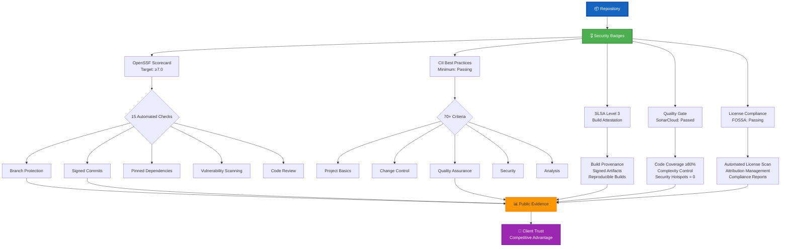

# Open Source Policy Skill

## Purpose

This skill provides comprehensive open source governance aligned with Hack23 AB's transparency principle, demonstrating that radical openness creates competitive advantage through evidence-based security excellence. It enables repository maintainers to implement required security badges, manage license compliance, generate SBOMs, and maintain security documentation that serves as both operational necessity and client demonstration.

## When to Use This Skill

Apply this skill when:
- ✅ Creating new public repositories
- ✅ Preparing for OpenSSF Scorecard assessment (target: ≥7.0)
- ✅ Configuring CII Best Practices badge (minimum: Passing)
- ✅ Setting up SLSA Level 3 build attestations
- ✅ Implementing license compliance scanning (FOSSA)
- ✅ Generating SBOMs (CycloneDX/SPDX)
- ✅ Creating security architecture documentation
- ✅ Planning coordinated vulnerability disclosure
- ✅ Responding to client due diligence requests

Do NOT use for:
- ❌ Private/internal repositories (different policy applies)
- ❌ Security incident response (use incident-response skill)
- ❌ Tactical vulnerability remediation (use vulnerability-management skill)

## Required Security Badge Architecture



## Repository Setup Checklist

### Phase 1: Initial Security Configuration
- [ ] Enable branch protection on `main`/`master`:
  - [ ] Require pull request reviews (1+ approvers)
  - [ ] Require status checks to pass
  - [ ] Require signed commits
  - [ ] Restrict push access
- [ ] Enable Dependabot security updates
- [ ] Enable GitHub secret scanning
- [ ] Configure CodeQL analysis
- [ ] Set up automated security scanning (SonarCloud)

### Phase 2: Documentation Requirements
- [ ] Create `SECURITY_ARCHITECTURE.md` with Mermaid diagrams
- [ ] Create `FUTURE_SECURITY_ARCHITECTURE.md` for roadmap
- [ ] Create `SECURITY.md` with vulnerability disclosure process
- [ ] Create `WORKFLOWS.md` documenting CI/CD security gates
- [ ] Create `LICENSE` (Apache 2.0 or compatible)
- [ ] Create `NOTICE` for third-party attributions
- [ ] Create `CODE_OF_CONDUCT.md`
- [ ] Create `CONTRIBUTING.md`
- [ ] Create `CRA-ASSESSMENT.md` (EU Cyber Resilience Act)

### Phase 3: License Compliance
- [ ] Integrate FOSSA scanning
- [ ] Generate `LICENSES/` directory with all dependency licenses
- [ ] Add `.reuse/dep5` for machine-readable licensing
- [ ] Configure automated NOTICE file generation
- [ ] Review all dependencies for license compatibility

### Phase 4: Security Badges
- [ ] Register with OpenSSF Scorecard: https://scorecard.dev/
- [ ] Apply for CII Best Practices: https://bestpractices.coreinfrastructure.org/
- [ ] Configure SLSA attestations in GitHub Actions
- [ ] Add SonarCloud quality gate badge
- [ ] Add FOSSA license status badge
- [ ] Add custom security badges (Threat Model, STRIDE, etc.)

### Phase 5: Supply Chain Security
- [ ] Implement SBOM generation (CycloneDX or SPDX)
- [ ] Configure artifact signing (Sigstore/cosign)
- [ ] Pin all GitHub Actions dependencies
- [ ] Enable Dependabot version updates
- [ ] Set up automated vulnerability scanning

## OpenSSF Scorecard Optimization Guide

Target score: **≥7.0** across 15 automated checks

### Critical Checks (Must Pass)

**1. Branch-Protection (Weight: High)**
```yaml
# .github/branch-protection.yml
required_status_checks:
  strict: true
  contexts:
    - "CodeQL"
    - "SonarCloud Code Analysis"
    - "Security Scan"
required_pull_request_reviews:
  required_approving_review_count: 1
  dismiss_stale_reviews: true
enforce_admins: true
restrictions: null
```

**2. Signed-Releases (Weight: High)**
```yaml
# .github/workflows/release.yml
- name: Sign artifacts
  uses: sigstore/gh-action-sigstore-python@v2
  with:
    inputs: ./dist/*
- name: Generate SBOM
  uses: anchore/sbom-action@v0
  with:
    format: cyclonedx-json
```

**3. Pinned-Dependencies (Weight: High)**
```yaml
# Pin ALL dependencies to specific SHA
# Bad:
uses: actions/checkout@v4
# Good:
uses: actions/checkout@b4ffde65f46336ab88eb53be808477a3936bae11 # v4.1.1
```

**4. Token-Permissions (Weight: High)**
```yaml
# .github/workflows/*.yml
permissions:
  contents: read  # Least privilege
  security-events: write  # Only if needed
```

**5. Vulnerabilities (Weight: High)**
- Enable Dependabot alerts
- Configure CodeQL scanning
- Integrate SonarCloud security analysis
- Set SLAs for vulnerability remediation (see below)

**6. Code-Review (Weight: High)**
- Require at least 1 approving review
- No commits directly to default branch
- Use CODEOWNERS file

### Important Checks (Should Pass)

**7. Dangerous-Workflow**
- Don't use `pull_request_target` without security review
- Avoid `script` injection from user-controlled data

**8. License**
- Include LICENSE file (Apache 2.0)
- Add SPDX identifier to source files

**9. SAST**
- Enable CodeQL with security queries
- Add SonarCloud with Security Hotspot detection

**10. Dependency-Update-Tool**
- Enable Dependabot for both security and version updates
```yaml
# .github/dependabot.yml
version: 2
updates:
  - package-ecosystem: "npm"
    directory: "/"
    schedule:
      interval: "weekly"
    open-pull-requests-limit: 10
```

### Additional Checks

**11. Fuzzing** (Java/Spring projects)
- Configure JQF for fuzz testing where applicable

**12. Maintained**
- Commit at least every 90 days
- Respond to issues within 14 days

**13. Packaging**
- Publish to npm/Maven Central with provenance

**14. Security-Policy**
- Maintain SECURITY.md with disclosure process

**15. Binary-Artifacts**
- Avoid committing binary files (use package managers)

## CII Best Practices Badge Requirements

Apply for badge at: https://bestpractices.coreinfrastructure.org/

### Passing Level (Minimum Required)

**Basics (13 criteria):**
- [ ] Project website URL
- [ ] Basic project documentation
- [ ] FLOSS license (Apache 2.0)
- [ ] Public version-controlled source repository
- [ ] Public discussion forum (GitHub Issues)
- [ ] English language communication
- [ ] Bug reporting process (SECURITY.md)
- [ ] Security vulnerability disclosure (SECURITY.md)
- [ ] Working build system
- [ ] Automated test suite
- [ ] New functionality testing
- [ ] Warning flags enabled
- [ ] Release notes for each version

**Change Control (6 criteria):**
- [ ] Public version control (GitHub)
- [ ] Unique version numbering (SemVer)
- [ ] Changelog maintained
- [ ] Previous versions available
- [ ] Identification of committers
- [ ] Commit review before integration

**Quality (13 criteria):**
- [ ] Automated test suite runs on CI
- [ ] Build warnings free
- [ ] Static analysis (SonarCloud)
- [ ] Dynamic analysis (OWASP ZAP for web apps)
- [ ] Memory safety (Java/managed languages)
- [ ] Automated test suite covers ≥80% statements
- [ ] Test suite covers ≥70% branches
- [ ] New tests added with new features
- [ ] Continuous integration tests
- [ ] Test policy documented

**Security (11 criteria):**
- [ ] Secure coding standards documented
- [ ] HTTPS for website/downloads
- [ ] TLS 1.2+ for encrypted connections
- [ ] Secure delivery mechanism (signed releases)
- [ ] Automated security vulnerability detection
- [ ] No known unpatched critical vulnerabilities
- [ ] Public vulnerability disclosure process
- [ ] Private vulnerability reporting channel
- [ ] Hardening mechanism documented
- [ ] Crypto published/peer-reviewed
- [ ] Input validation

**Analysis (10 criteria):**
- [ ] Static code analysis
- [ ] Address all medium+ severity issues
- [ ] Memory-safe language or analysis
- [ ] Dynamic analysis on releases
- [ ] Code coverage measurement
- [ ] Continuous automated testing

**Reference Implementation:** 
- [CIA Platform (Passing)](https://bestpractices.coreinfrastructure.org/projects/770)
- [Black Trigram (Passing)](https://bestpractices.coreinfrastructure.org/projects/10777)
- [CIA Compliance Manager (Passing)](https://bestpractices.coreinfrastructure.org/projects/10365)

## SLSA Level 3 Implementation

Achieve Supply Chain Levels for Software Artifacts Level 3:

### Requirements
1. **Source integrity:** GitHub-hosted with signed commits
2. **Build integrity:** Reproducible builds with provenance
3. **Provenance:** Signed attestations for all artifacts
4. **Isolation:** Builds run in ephemeral environments

### Implementation
```yaml
# .github/workflows/release.yml
name: Release with SLSA3
on:
  push:
    tags:
      - 'v*'

permissions:
  contents: read
  id-token: write  # For SLSA attestation

jobs:
  build:
    runs-on: ubuntu-latest
    steps:
      - uses: actions/checkout@b4ffde65f46336ab88eb53be808477a3936bae11
      - name: Build
        run: |
          npm ci
          npm run build
      - name: Generate provenance
        uses: slsa-framework/slsa-github-generator/.github/workflows/generator_generic_slsa3.yml@v1.9.0
        with:
          subjects: "dist/*"
```

**Verification:**
```bash
# Verify SLSA attestation
gh attestation verify artifact.tar.gz --owner Hack23
```

## License Compliance Framework

### Approved Licenses (Pre-approved)

✅ **Permissive:**
- MIT
- Apache 2.0
- BSD (2-clause, 3-clause)
- ISC

✅ **Weak Copyleft:**
- LGPL 2.1/3.0
- MPL 2.0
- EPL 2.0

✅ **Documentation:**
- CC-BY-4.0
- CC-BY-SA-4.0

### Review Required (CEO Approval)

⚠️ **Strong Copyleft:**
- GPL 2.0/3.0
- AGPL 3.0

⚠️ **Non-standard:**
- Custom licenses
- Modified licenses

### Prohibited

❌ **Never Use:**
- Licenses with advertising clauses
- Licenses incompatible with Apache 2.0
- Unclear terms or missing attribution

### FOSSA Integration

**Setup:**
```yaml
# .github/workflows/fossa.yml
name: FOSSA Scan
on: [push, pull_request]

jobs:
  fossa:
    runs-on: ubuntu-latest
    steps:
      - uses: actions/checkout@v4
      - uses: fossas/fossa-action@v1
        with:
          api-key: ${{ secrets.FOSSA_API_KEY }}
```

**Badge:**
```markdown
[](https://app.fossa.com/projects/git%2Bgithub.com%2FHack23%2FREPO?ref=badge_shield)
```

## SBOM Generation Requirements

Per [Secure Development Policy](https://github.com/Hack23/ISMS-PUBLIC/blob/main/Secure_Development_Policy.md), generate SBOMs for all releases:

### CycloneDX Format (Preferred for Java/Maven)
```yaml
# pom.xml
<plugin>
  <groupId>org.cyclonedx</groupId>
  <artifactId>cyclonedx-maven-plugin</artifactId>
  <version>2.7.11</version>
  <executions>
    <execution>
      <goals>
        <goal>makeAggregateBom</goal>
      </goals>
    </execution>
  </executions>
</plugin>
```

### SPDX Format (Preferred for npm/Node.js)
```yaml
# .github/workflows/sbom.yml
- name: Generate SPDX SBOM
  run: |
    npm install -g @cyclonedx/cyclonedx-npm
    cyclonedx-npm --output-format spdx --output-file sbom.spdx.json
```

**Artifact Locations:**
- Maven: `target/bom.json`
- npm: `sbom.spdx.json`
- GitHub Release: Attach SBOM to release assets

## Vulnerability Management SLAs

Aligned with [Vulnerability Management Policy](https://github.com/Hack23/ISMS-PUBLIC/blob/main/Vulnerability_Management.md):

| Severity | Detection | Remediation Deadline | Escalation |
|----------|-----------|---------------------|------------|
| **Critical** | Automated (Dependabot/CodeQL) | 24 hours | Immediate CEO notification |
| **High** | Automated | 7 days | Weekly status update |
| **Medium** | Automated | 30 days | Monthly review |
| **Low** | Automated | 90 days | Quarterly review |

**Remediation Options:**
1. **Update dependency** (preferred)
2. **Apply patch** (if update breaks compatibility)
3. **Mitigate** (compensating controls)
4. **Accept risk** (document in Risk Register, CEO approval required)

## Security Architecture Documentation Matrix

Per [Secure Development Policy](https://github.com/Hack23/ISMS-PUBLIC/blob/main/Secure_Development_Policy.md):

| Document | Purpose | Mermaid Diagrams | Update Frequency |
|----------|---------|------------------|------------------|
| **SECURITY_ARCHITECTURE.md** | Current security implementation | Authentication flow, Data flow, Infrastructure | Every release |
| **FUTURE_SECURITY_ARCHITECTURE.md** | Planned improvements | Target architecture, Migration plan | Quarterly |
| **THREAT_MODEL.md** | STRIDE analysis, Attack trees | Attack trees, Data flow diagrams | Annually or with major changes |
| **WORKFLOWS.md** | CI/CD security gates | Pipeline diagram | When workflows change |
| **SECURITY.md** | Vulnerability disclosure | N/A | Annually |

**Mermaid Diagram Types:**
- `flowchart` - Authentication/authorization flows
- `sequenceDiagram` - Request/response security
- `graph` - Architecture layers
- `erDiagram` - Data model security

## Practical Examples

### Example 1: CIA Platform (High Maturity)

**Security Badge Status:**
- ✅ OpenSSF Scorecard: **8.1/10**
- ✅ CII Best Practices: **Passing (100%)**
- ✅ SLSA Level 3: **Implemented**
- ✅ SonarCloud: **A (0 Security Hotspots)**
- ✅ FOSSA: **Passing (0 Critical Issues)**

**Documentation:**
- [SECURITY_ARCHITECTURE.md](https://github.com/Hack23/cia/blob/master/SECURITY_ARCHITECTURE.md)
- [THREAT_MODEL.md](https://github.com/Hack23/cia/blob/master/THREAT_MODEL.md)
- [WORKFLOWS.md](https://github.com/Hack23/cia/blob/master/WORKFLOWS.md)
- [SECURITY.md](https://github.com/Hack23/cia/blob/master/SECURITY.md)
- [CRA-ASSESSMENT.md](https://github.com/Hack23/cia/blob/master/CRA-ASSESSMENT.md)

### Example 2: Setting Up New Repository

**Step-by-step:**

```bash
# 1. Clone template
gh repo create Hack23/new-project --template Hack23/cia --public

# 2. Enable security features
gh api repos/Hack23/new-project/vulnerability-alerts -X PUT
gh api repos/Hack23/new-project/automated-security-fixes -X PUT

# 3. Configure branch protection
gh api repos/Hack23/new-project/branches/main/protection -X PUT \
  --input branch-protection.json

# 4. Add FOSSA
# Visit https://app.fossa.com/ and add repository

# 5. Register with OpenSSF Scorecard
# Visit https://scorecard.dev/ and add repository

# 6. Apply for CII Best Practices
# Visit https://bestpractices.coreinfrastructure.org/

# 7. Configure SonarCloud
# Visit https://sonarcloud.io/ and import project

# 8. Create required documentation
touch SECURITY_ARCHITECTURE.md
touch FUTURE_SECURITY_ARCHITECTURE.md
touch THREAT_MODEL.md
touch WORKFLOWS.md
touch SECURITY.md
touch CRA-ASSESSMENT.md

# 9. Add badges to README.md
# See badge examples below
```

## Badge Examples for README.md

```markdown
## Security Posture

[](https://scorecard.dev/viewer/?uri=github.com/Hack23/REPO)
[](https://bestpractices.coreinfrastructure.org/projects/XXXX)
[](https://github.com/Hack23/REPO/attestations)
[](https://sonarcloud.io/summary/new_code?id=Hack23_REPO)
[](https://app.fossa.com/projects/git%2Bgithub.com%2FHack23%2FREPO?ref=badge_shield)

## Security Documentation

[](./THREAT_MODEL.md)
[](./THREAT_MODEL.md#stride-threat-analysis)
[](./SECURITY_ARCHITECTURE.md)
```

## Standards & Policy References

**Core Hack23 ISMS Policies:**
- [Open Source Policy](https://github.com/Hack23/ISMS-PUBLIC/blob/main/Open_Source_Policy.md) - Governance framework
- [Secure Development Policy](https://github.com/Hack23/ISMS-PUBLIC/blob/main/Secure_Development_Policy.md) - Documentation standards
- [Vulnerability Management](https://github.com/Hack23/ISMS-PUBLIC/blob/main/Vulnerability_Management.md) - Remediation SLAs
- [Classification Framework](https://github.com/Hack23/ISMS-PUBLIC/blob/main/CLASSIFICATION.md) - Business impact assessment

**All Hack23 ISMS Policies:** https://github.com/Hack23/ISMS-PUBLIC
