# OSINT Methodologies Skill

## Purpose

This skill provides comprehensive Open-Source Intelligence (OSINT) collection methodologies specifically tailored for the CIA (Citizen Intelligence Agency) platform's mission of democratic transparency and political accountability in Sweden. It ensures ethical, legal, and effective intelligence gathering from public sources while maintaining GDPR compliance and respecting privacy principles.

## When to Use This Skill

Apply this skill when:
- ✅ Integrating new public data sources (government APIs, open datasets)
- ✅ Evaluating data source reliability and completeness
- ✅ Implementing data collection pipelines for political intelligence
- ✅ Verifying information from multiple independent sources
- ✅ Conducting source triangulation for accuracy validation
- ✅ Designing OSINT collection strategies for new intelligence requirements
- ✅ Assessing data quality and establishing quality metrics
- ✅ Creating automated data harvesting and validation workflows

Do NOT use for:
- ❌ Collecting non-public or classified information
- ❌ Social media scraping without clear public interest justification
- ❌ Personal data collection beyond public official capacity
- ❌ Intelligence gathering that violates GDPR or Swedish privacy laws

## OSINT Collection Framework

### Four Primary Sources Architecture

The CIA platform integrates four high-integrity OSINT sources to create comprehensive political intelligence:

```mermaid
graph TB
    subgraph "OSINT Sources"
        A1[📡 Riksdagen API<br/>98.5% completeness<br/>3.5M+ votes, 89K documents]
        A2[📊 Election Authority<br/>99.2% completeness<br/>1970-present electoral data]
        A3[💰 World Bank<br/>94.1% completeness<br/>598K indicators, 211 countries]
        A4[🏛️ Financial Authority ESV<br/>97.8% completeness<br/>Monthly updates]
    end
    
    subgraph "Collection Layer"
        A1 --> B[Data Ingestion Pipeline]
        A2 --> B
        A3 --> B
        A4 --> B
    end
    
    subgraph "Quality Assurance"
        B --> C{Source Verification}
        C --> D[Completeness Check]
        C --> E[Consistency Validation]
        C --> F[Temporal Continuity]
        C --> G[Cross-Reference Check]
    end
    
    subgraph "Data Integration"
        D & E & F & G --> H[(Integrated Dataset)]
        H --> I[Entity Resolution]
        I --> J[Data Enrichment]
    end
    
    subgraph "Quality Metrics"
        J --> K[📊 Quality Dashboard]
        K --> L[Completeness: 97.4%]
        K --> M[Accuracy: 99.1%]
        K --> N[Timeliness: 24h lag]
    end
    
    style A1 fill:#e1f5ff
    style A2 fill:#e1f5ff
    style A3 fill:#e1f5ff
    style A4 fill:#e1f5ff
    style C fill:#ffeb99
    style H fill:#ccffcc
    style K fill:#ffe6cc
```



## Source Evaluation Matrix

### 1. Riksdagen API (Swedish Parliament)

**Source Profile:**
- **URL**: https://data.riksdagen.se/
- **Authority**: Swedish Parliament (Legislative Branch)
- **Classification**: Primary Source, Government Official
- **Completeness**: 98.5%
- **Update Frequency**: Daily (real-time for votes)
- **Historical Coverage**: 1971-present (54 years)
- **Data Volume**: 3.5M+ votes, 89K documents, 2.5K politicians

**Quality Metrics:**
```java
@Component
public class RiksdagenSourceQualityMetrics {
    
    public SourceQualityReport evaluateRiksdagenAPI() {
        return SourceQualityReport.builder()
            .sourceName("Riksdagen API")
            .completeness(98.5)  // Measured against expected records
            .accuracy(99.8)       // Verified via manual audit sampling
            .timeliness(1.0)      // Hours lag for new data
            .reliability(5)       // 1-5 scale, 5 = highest
            .trustLevel("PRIMARY_SOURCE")
            .legalBasis("Public Records Act (Offentlighetsprincipen)")
            .gdprCompliance(true)
            .updateFrequency("DAILY")
            .build();
    }
    
    public List<DataGap> identifyDataGaps() {
        // Example: Check for missing voting records
        String sql = """
            SELECT 
                COUNT(*) as expected_votes,
                COUNT(DISTINCT ballot_id) as actual_votes,
                COUNT(*) - COUNT(DISTINCT ballot_id) as missing_votes
            FROM view_riksdagen_vote_daily_summary
            WHERE created_date >= CURRENT_DATE - INTERVAL '30 days'
        """;
        
        // Calculate completeness percentage
        return jdbcTemplate.query(sql, (rs, rowNum) -> 
            DataGap.builder()
                .expectedRecords(rs.getInt("expected_votes"))
                .actualRecords(rs.getInt("actual_votes"))
                .missingRecords(rs.getInt("missing_votes"))
                .completeness((double) rs.getInt("actual_votes") / 
                              rs.getInt("expected_votes") * 100)
                .build()
        );
    }
}
```

**Data Categories:**
1. **Voting Records** (`vote_data` table)
   - Individual votes on ballots
   - Party discipline metrics
   - Coalition voting patterns
   - Temporal voting trends

2. **Documents** (`document_element`, `document_status_container`)
   - Legislative proposals (motioner)
   - Government bills (propositioner)
   - Committee reports (utskottsbetänkanden)
   - Parliamentary questions (interpellationer)

3. **Politicians** (`person_data`, `assignment_data`)
   - Parliamentary roles and assignments
   - Committee memberships
   - Party affiliations
   - Career trajectories

4. **Parliamentary Activities**
   - Debate participation
   - Committee work
   - Government questions
   - Speaker time

**OSINT Techniques:**
```sql
-- Source Triangulation: Verify politician voting record completeness
WITH expected_votes AS (
    SELECT 
        person_id,
        COUNT(DISTINCT ballot_id) as riksdagen_vote_count
    FROM vote_data
    WHERE vote_date >= '2022-09-11'  -- Current parliament
    GROUP BY person_id
),
document_activity AS (
    SELECT 
        person_id,
        COUNT(DISTINCT document_id) as document_count
    FROM document_person_reference_data
    WHERE document_type IN ('mot', 'ip')  -- Motions & Questions
    GROUP BY person_id
)
SELECT 
    p.first_name || ' ' || p.last_name as politician_name,
    p.party as party_affiliation,
    ev.riksdagen_vote_count,
    da.document_count,
    CASE 
        WHEN ev.riksdagen_vote_count > 500 THEN 'ACTIVE'
        WHEN ev.riksdagen_vote_count BETWEEN 100 AND 500 THEN 'MODERATE'
        WHEN ev.riksdagen_vote_count < 100 THEN 'INACTIVE'
    END as engagement_level
FROM person_data p
LEFT JOIN expected_votes ev ON p.person_id = ev.person_id
LEFT JOIN document_activity da ON p.person_id = da.person_id
WHERE p.status = 'Tjänstgörande riksdagsledamot'  -- Active MPs
ORDER BY ev.riksdagen_vote_count DESC;
```

### 2. Election Authority (Valmyndigheten)

**Source Profile:**
- **URL**: https://www.val.se/
- **Authority**: Swedish Election Authority (Independent)
- **Classification**: Primary Source, Government Official
- **Completeness**: 99.2%
- **Update Frequency**: Post-election (every 4 years + special elections)
- **Historical Coverage**: 1970-present (14 elections)
- **Data Volume**: 40 parties, national & regional results

**Quality Metrics:**
```java
@Component
public class ElectionAuthorityQualityMetrics {
    
    public SourceQualityReport evaluateElectionAuthority() {
        return SourceQualityReport.builder()
            .sourceName("Valmyndigheten")
            .completeness(99.2)
            .accuracy(99.9)  // Official certified results
            .timeliness(168.0)  // Hours post-election for final results
            .reliability(5)
            .trustLevel("PRIMARY_SOURCE")
            .legalBasis("Election Act (Vallagen)")
            .gdprCompliance(true)
            .updateFrequency("ELECTION_CYCLE")
            .build();
    }
    
    public List<ElectionDataValidation> validateElectionData() {
        // Cross-reference with Riksdagen seat assignments
        String sql = """
            SELECT 
                e.party_name,
                e.parliament_seats as election_authority_seats,
                COUNT(DISTINCT a.person_id) as riksdagen_active_mps,
                e.parliament_seats - COUNT(DISTINCT a.person_id) as seat_discrepancy
            FROM sweden_political_party e
            LEFT JOIN assignment_data a 
                ON e.party_id = a.party 
                AND a.role_code = 'Riksdagsledamot'
                AND a.from_date <= CURRENT_DATE
                AND (a.to_date IS NULL OR a.to_date >= CURRENT_DATE)
            WHERE e.parliament_seats > 0
            GROUP BY e.party_name, e.parliament_seats
            HAVING e.parliament_seats != COUNT(DISTINCT a.person_id)
        """;
        
        return jdbcTemplate.query(sql, (rs, rowNum) -> 
            ElectionDataValidation.builder()
                .partyName(rs.getString("party_name"))
                .expectedSeats(rs.getInt("election_authority_seats"))
                .actualSeats(rs.getInt("riksdagen_active_mps"))
                .discrepancy(rs.getInt("seat_discrepancy"))
                .build()
        );
    }
}
```

**OSINT Techniques:**
```sql
-- Historical Election Trend Analysis
SELECT 
    party_name,
    election_year,
    percentage,
    parliament_seats,
    LAG(percentage, 1) OVER (PARTITION BY party_name ORDER BY election_year) as previous_percentage,
    percentage - LAG(percentage, 1) OVER (PARTITION BY party_name ORDER BY election_year) as vote_swing,
    LAG(parliament_seats, 1) OVER (PARTITION BY party_name ORDER BY election_year) as previous_seats,
    parliament_seats - LAG(parliament_seats, 1) OVER (PARTITION BY party_name ORDER BY election_year) as seat_change
FROM sweden_political_party
WHERE parliament_seats IS NOT NULL
ORDER BY party_name, election_year DESC;
```

### 3. World Bank Open Data

**Source Profile:**
- **URL**: https://data.worldbank.org/
- **Authority**: World Bank (International Organization)
- **Classification**: Secondary Source, International Authority
- **Completeness**: 94.1%
- **Update Frequency**: Quarterly
- **Historical Coverage**: 1960-present (64 years)
- **Data Volume**: 598K indicators, 211 countries

**Quality Metrics:**
```java
@Component
public class WorldBankQualityMetrics {
    
    public SourceQualityReport evaluateWorldBankAPI() {
        return SourceQualityReport.builder()
            .sourceName("World Bank Open Data")
            .completeness(94.1)
            .accuracy(97.5)
            .timeliness(2160.0)  // 90 days lag (quarterly updates)
            .reliability(4)  // High but not primary source
            .trustLevel("SECONDARY_SOURCE")
            .legalBasis("Open Data License")
            .gdprCompliance(true)  // Aggregate data only
            .updateFrequency("QUARTERLY")
            .build();
    }
}
```

**Use Cases:**
- Economic context for political decisions
- International comparison benchmarks
- Policy effectiveness measurement
- Correlation analysis (GDP vs. government spending)

### 4. Financial Authority (ESV)

**Source Profile:**
- **URL**: https://www.esv.se/
- **Authority**: Swedish Financial Management Authority
- **Classification**: Primary Source, Government Official
- **Completeness**: 97.8%
- **Update Frequency**: Monthly
- **Historical Coverage**: 1990-present
- **Data Volume**: Agency financial data

## OSINT Collection Checklist

### Pre-Collection Assessment

**Legal & Ethical Review:**
```
✅ Data is publicly available under Swedish Public Access Principle (Offentlighetsprincipen)
✅ Collection method complies with GDPR Article 6(1)(e) - public interest
✅ Data processing aligns with purpose limitation (Article 5(1)(b))
✅ Data retention periods defined and documented
✅ Privacy impact assessment completed for personal data
✅ Source attribution and license compliance verified
```

**Source Reliability Assessment:**
```java
public enum SourceReliability {
    A("COMPLETELY_RELIABLE", "Primary government source, official records"),
    B("USUALLY_RELIABLE", "Established media, verified aggregators"),
    C("FAIRLY_RELIABLE", "Secondary sources with known limitations"),
    D("NOT_USUALLY_RELIABLE", "Unverified sources, requires corroboration"),
    E("UNRELIABLE", "Known bias, propaganda, unverified claims"),
    F("RELIABILITY_CANNOT_BE_JUDGED", "New source, insufficient track record");
    
    private final String description;
    private final String criteria;
}

public enum InformationCredibility {
    ONE("CONFIRMED", "Verified by multiple independent sources"),
    TWO("PROBABLY_TRUE", "Corroborated by additional source"),
    THREE("POSSIBLY_TRUE", "Not confirmed but consistent with known facts"),
    FOUR("DOUBTFUL", "Contradicts other information"),
    FIVE("IMPROBABLE", "Contradicts established facts"),
    SIX("TRUTH_CANNOT_BE_JUDGED", "Insufficient information to evaluate");
    
    private final String description;
    private final String criteria;
}
```

### Data Collection Workflow

**1. Source Identification**
```python
class OSINTSource:
    def __init__(self, name, url, api_endpoint=None):
        self.name = name
        self.url = url
        self.api_endpoint = api_endpoint
        self.reliability = None  # A-F rating
        self.credibility = None  # 1-6 rating
        self.completeness = None
        self.last_updated = None
    
    def evaluate_reliability(self):
        """NATO Admiralty Code reliability assessment"""
        if self.is_government_official_source():
            self.reliability = SourceReliability.A
        elif self.is_verified_aggregator():
            self.reliability = SourceReliability.B
        # ... additional logic
        
    def verify_completeness(self, expected_records, actual_records):
        """Calculate data completeness percentage"""
        self.completeness = (actual_records / expected_records) * 100
        return self.completeness
    
    def assess_timeliness(self):
        """Calculate data lag from source update to platform availability"""
        time_lag = datetime.now() - self.last_updated
        return time_lag.total_seconds() / 3600  # Hours
```

**2. Data Harvesting**
```java
@Service
public class OSINTDataCollector {
    
    @Scheduled(cron = "0 0 2 * * *")  // Daily at 02:00
    public void collectRiksdagenData() {
        try {
            // 1. Fetch new data
            List<VoteData> newVotes = riksdagenClient.getVotesSince(lastCollectionTimestamp);
            
            // 2. Validate data quality
            DataQualityReport report = validateDataQuality(newVotes);
            if (report.getQualityScore() < 95.0) {
                alertService.sendAlert("Low quality data detected", report);
            }
            
            // 3. Deduplicate
            List<VoteData> uniqueVotes = deduplicateRecords(newVotes);
            
            // 4. Store with audit trail
            voteRepository.saveAll(uniqueVotes);
            
            // 5. Update collection metadata
            updateCollectionMetrics(uniqueVotes.size(), report);
            
            log.info("Collected {} new votes with {}% quality score", 
                     uniqueVotes.size(), report.getQualityScore());
            
        } catch (Exception e) {
            log.error("Data collection failed", e);
            alertService.sendAlert("OSINT collection failure", e);
        }
    }
    
    private DataQualityReport validateDataQuality(List<VoteData> data) {
        DataQualityReport report = new DataQualityReport();
        
        // Completeness check
        long missingFields = data.stream()
            .filter(v -> v.getPersonId() == null || v.getBallotId() == null)
            .count();
        report.setCompleteness(100.0 - (missingFields * 100.0 / data.size()));
        
        // Consistency check
        long invalidVotes = data.stream()
            .filter(v -> !Arrays.asList("Ja", "Nej", "Frånvarande", "Avstår").contains(v.getVote()))
            .count();
        report.setConsistency(100.0 - (invalidVotes * 100.0 / data.size()));
        
        // Temporal validity
        long futureVotes = data.stream()
            .filter(v -> v.getVoteDate().isAfter(LocalDate.now()))
            .count();
        report.setTemporalValidity(100.0 - (futureVotes * 100.0 / data.size()));
        
        report.calculateOverallScore();
        return report;
    }
}
```

**3. Source Triangulation**
```sql
-- Cross-Reference Verification: Validate politician data across sources
WITH riksdagen_politicians AS (
    SELECT 
        person_id,
        first_name,
        last_name,
        party,
        status
    FROM person_data
    WHERE status = 'Tjänstgörande riksdagsledamot'
),
riksdagen_seats AS (
    SELECT 
        party,
        COUNT(DISTINCT person_id) as active_mps
    FROM riksdagen_politicians
    GROUP BY party
),
election_seats AS (
    SELECT 
        party_name,
        parliament_seats
    FROM sweden_political_party
    WHERE parliament_seats > 0
)
SELECT 
    COALESCE(r.party, e.party_name) as party,
    r.active_mps as riksdagen_count,
    e.parliament_seats as election_authority_count,
    ABS(COALESCE(r.active_mps, 0) - COALESCE(e.parliament_seats, 0)) as discrepancy,
    CASE 
        WHEN ABS(COALESCE(r.active_mps, 0) - COALESCE(e.parliament_seats, 0)) = 0 THEN '✅ VERIFIED'
        WHEN ABS(COALESCE(r.active_mps, 0) - COALESCE(e.parliament_seats, 0)) <= 2 THEN '⚠️ MINOR_DISCREPANCY'
        ELSE '🚨 MAJOR_DISCREPANCY'
    END as verification_status
FROM riksdagen_seats r
FULL OUTER JOIN election_seats e ON r.party = e.party_name
ORDER BY discrepancy DESC;
```

## Data Quality Metrics

### Quality Dimensions

**1. Completeness**
```sql
-- Calculate field completeness across all tables
SELECT 
    'person_data' as table_name,
    COUNT(*) as total_records,
    SUM(CASE WHEN first_name IS NULL THEN 1 ELSE 0 END) as missing_first_name,
    SUM(CASE WHEN last_name IS NULL THEN 1 ELSE 0 END) as missing_last_name,
    SUM(CASE WHEN party IS NULL THEN 1 ELSE 0 END) as missing_party,
    ROUND(100.0 * (1.0 - (
        SUM(CASE WHEN first_name IS NULL THEN 1 ELSE 0 END)::decimal + 
        SUM(CASE WHEN last_name IS NULL THEN 1 ELSE 0 END) + 
        SUM(CASE WHEN party IS NULL THEN 1 ELSE 0 END)
    ) / (COUNT(*) * 3)), 2) as completeness_percentage
FROM person_data;
```

**2. Accuracy**
```java
@Component
public class DataAccuracyVerifier {
    
    public AccuracyReport verifyPoliticianData() {
        // Manual audit sampling: Verify 100 random politicians against Riksdagen website
        List<PersonData> sample = personRepository.findRandomSample(100);
        
        int accurate = 0;
        int inaccurate = 0;
        
        for (PersonData person : sample) {
            // Fetch from official Riksdagen website for comparison
            OfficialPersonData official = riksdagenWebScraper.fetchPersonData(person.getPersonId());
            
            if (verifyMatch(person, official)) {
                accurate++;
            } else {
                inaccurate++;
                log.warn("Data mismatch for person_id: {}", person.getPersonId());
            }
        }
        
        return AccuracyReport.builder()
            .sampleSize(sample.size())
            .accurateRecords(accurate)
            .inaccurateRecords(inaccurate)
            .accuracyPercentage((double) accurate / sample.size() * 100)
            .build();
    }
}
```

**3. Timeliness**
```sql
-- Calculate data freshness lag
SELECT 
    'vote_data' as data_type,
    MAX(created_date) as latest_record,
    CURRENT_TIMESTAMP as current_time,
    EXTRACT(EPOCH FROM (CURRENT_TIMESTAMP - MAX(created_date))) / 3600 as hours_lag,
    CASE 
        WHEN EXTRACT(EPOCH FROM (CURRENT_TIMESTAMP - MAX(created_date))) / 3600 < 24 THEN '✅ CURRENT'
        WHEN EXTRACT(EPOCH FROM (CURRENT_TIMESTAMP - MAX(created_date))) / 3600 < 168 THEN '⚠️ RECENT'
        ELSE '🚨 STALE'
    END as freshness_status
FROM vote_data;
```

**4. Consistency**
```sql
-- Detect referential integrity violations
SELECT 
    'Vote Data Integrity' as check_name,
    COUNT(DISTINCT v.ballot_id) as total_votes,
    COUNT(DISTINCT CASE WHEN p.person_id IS NULL THEN v.person_id END) as orphaned_person_refs,
    COUNT(DISTINCT CASE WHEN b.ballot_id IS NULL THEN v.ballot_id END) as orphaned_ballot_refs,
    ROUND(100.0 * (1.0 - (
        COUNT(DISTINCT CASE WHEN p.person_id IS NULL THEN v.person_id END)::decimal +
        COUNT(DISTINCT CASE WHEN b.ballot_id IS NULL THEN v.ballot_id END)
    ) / (COUNT(DISTINCT v.ballot_id) * 2)), 2) as consistency_percentage
FROM vote_data v
LEFT JOIN person_data p ON v.person_id = p.person_id
LEFT JOIN ballot_data b ON v.ballot_id = b.ballot_id;
```

## ISMS Compliance Mapping

### ISO 27001:2022 Controls

**A.5.10 - Acceptable Use of Information**
- OSINT collection limited to public interest purposes
- Data usage aligned with Swedish Public Access Principle
- Personal data processing restricted to official capacity

**A.5.33 - Protection of Records**
- Source attribution maintained for all collected data
- Audit trails for data collection activities
- Retention periods aligned with legal requirements

**A.8.8 - Management of Technical Vulnerabilities**
- API endpoints monitored for availability and security
- Rate limiting to prevent service disruption
- Secure credential management for API access

### NIST CSF 2.0 Functions

**IDENTIFY (ID)**
- ID.AM-5: Resources prioritized based on classification and business value
  - Four OSINT sources classified by reliability and completeness
  - Data quality metrics tracked continuously

**PROTECT (PR)**
- PR.DS-5: Protections against data leaks implemented
  - API keys stored in secure vaults (AWS Secrets Manager)
  - No sensitive credentials in code repositories

**DETECT (DE)**
- DE.CM-1: Network monitored to detect potential cybersecurity events
  - API health checks every 5 minutes
  - Anomaly detection for unusual data patterns

### CIS Controls v8.1

**CIS Control 3: Data Protection**
- 3.3: Configure data access control lists
  - OSINT data classified by sensitivity
  - Access controls based on role-based permissions

**CIS Control 12: Network Infrastructure Management**
- 12.4: Deny communication over unauthorized network protocols
  - HTTPS-only for all API communications
  - Certificate pinning for Riksdagen API

## Hack23 ISMS Policy References

**Data Classification Policy**
- Link: https://github.com/Hack23/ISMS-PUBLIC/blob/main/Data_Classification_Policy.md
- Application: OSINT data classified as PUBLIC (aggregated) or INTERNAL (detailed analytics)

**Privacy Policy**
- Link: https://github.com/Hack23/ISMS-PUBLIC/blob/main/Privacy_Policy.md
- Application: Personal data processing under GDPR Article 6(1)(e) - public interest

**Secure Development Policy**
- Link: https://github.com/Hack23/ISMS-PUBLIC/blob/main/Secure_Development_Policy.md
- Application: Secure API integration patterns, credential management

**Third Party Management**
- Link: https://github.com/Hack23/ISMS-PUBLIC/blob/main/Third_Party_Management.md
- Application: Vendor assessment for API dependencies (Riksdagen, Election Authority)

## References

**Official Documentation:**
- Riksdagen API Documentation: https://data.riksdagen.se/dokumentation/
- Valmyndigheten Open Data: https://www.val.se/serviceapi/
- World Bank API: https://datahelpdesk.worldbank.org/knowledgebase/topics/125589
- Swedish Public Access Principle: https://www.government.se/how-sweden-is-governed/public-access-to-information-and-secrecy/

**CIA Platform Documentation:**
- Intelligence Data Flow: [INTELLIGENCE_DATA_FLOW.md](../../INTELLIGENCE_DATA_FLOW.md)
- Data Analysis Frameworks: [DATA_ANALYSIS_INTOP_OSINT.md](../../DATA_ANALYSIS_INTOP_OSINT.md)
- Database View Catalog: [DATABASE_VIEW_INTELLIGENCE_CATALOG.md](../../DATABASE_VIEW_INTELLIGENCE_CATALOG.md)
- Risk Rules: [RISK_RULES_INTOP_OSINT.md](../../RISK_RULES_INTOP_OSINT.md)

**Academic Sources:**
- NATO OSINT Reader: Intelligence Collection Taxonomy
- Admiralty Code for Source Reliability Assessment
- GDPR Article 6(1)(e): Processing necessary for public interest tasks

**Standards:**
- ISO 27001:2022: Information Security Management
- NIST Special Publication 800-53: Security and Privacy Controls
- CIS Controls v8.1: Critical Security Controls
