# Risk Assessment Frameworks Skill

## Purpose

This skill provides comprehensive risk assessment methodologies for evaluating political, institutional, and democratic risks within the Swedish political system. It integrates international frameworks (V-Dem, Transparency International, Freedom House) with CIA platform's proprietary 50+ Drools risk rules to create systematic early warning capabilities for democratic backsliding, corruption, institutional erosion, political violence, and coalition instability.

## When to Use This Skill

Apply this skill when:
- ✅ Conducting democratic health assessments of Swedish institutions
- ✅ Identifying early warning signs of institutional erosion
- ✅ Assessing corruption risk at politician or party level
- ✅ Evaluating coalition stability and government sustainability
- ✅ Detecting democratic backsliding indicators
- ✅ Measuring institutional accountability effectiveness
- ✅ Analyzing political violence risk factors
- ✅ Creating risk-based intelligence priorities
- ✅ Benchmarking Sweden against international democracy standards
- ✅ Generating risk reports for stakeholders and media

Do NOT use for:
- ❌ Political persecution or targeting of legitimate opposition
- ❌ Fabricating risks to manipulate public opinion
- ❌ Undermining democratic institutions through false alarms
- ❌ Violating privacy or conducting surveillance without legal basis

## Risk Assessment Framework Architecture

### Integrated Risk Intelligence System

The CIA platform integrates four layers of risk intelligence to create comprehensive political risk profiles:

```mermaid
graph TB
    subgraph "Layer 1: Data Collection"
        A1[🗳️ Behavioral Data<br/>3.5M+ votes, attendance<br/>Productivity metrics]
        A2[💰 Financial Data<br/>World Bank, ESV<br/>Economic indicators]
        A3[📊 Democracy Indices<br/>V-Dem, Freedom House<br/>International benchmarks]
        A4[📰 Media Coverage<br/>Sentiment analysis<br/>Scandal tracking]
    end
    
    subgraph "Layer 2: Risk Rules Engine (Drools)"
        A1 --> B1[Behavioral Risk Rules<br/>24 politician rules<br/>12 party rules]
        A2 --> B2[Financial Risk Rules<br/>8 corruption indicators]
        A3 --> B3[Democratic Health Rules<br/>6 institutional rules]
        A4 --> B4[Reputational Risk Rules<br/>4 scandal detection rules]
    end
    
    subgraph "Layer 3: Risk Aggregation"
        B1 --> C1[Individual Risk Profiles]
        B2 --> C2[Institutional Risk Profiles]
        B3 --> C3[Systemic Risk Profiles]
        B4 --> C4[Reputational Risk Profiles]
    end
    
    subgraph "Layer 4: Risk Intelligence"
        C1 & C2 & C3 & C4 --> D[🎯 Composite Risk Score]
        D --> E[Early Warning Alerts]
        D --> F[Risk Mitigation Strategies]
        D --> G[Intelligence Priorities]
    end
    
    style A1 fill:#e1f5ff
    style A2 fill:#e1f5ff
    style A3 fill:#e1f5ff
    style A4 fill:#e1f5ff
    style B1 fill:#fff9cc
    style B2 fill:#fff9cc
    style B3 fill:#fff9cc
    style B4 fill:#fff9cc
    style D fill:#ffe6cc
    style E fill:#ffcccc
    style F fill:#ccffcc
    style G fill:#e6ccff
```



## 1. Democratic Backsliding Detection

### V-Dem Integration Framework

The Varieties of Democracy (V-Dem) project provides the world's most comprehensive democracy measurement. The CIA platform integrates V-Dem indicators with behavioral data.

**V-Dem Core Indicators Tracked:**
- **Liberal Democracy Index** - Rule of law, checks on government
- **Electoral Democracy Index** - Free and fair elections
- **Participatory Democracy Index** - Citizen participation
- **Deliberative Democracy Index** - Quality of public discourse
- **Egalitarian Democracy Index** - Equal access to power

```python
from typing import Dict, List, Tuple
import pandas as pd
import numpy as np
from datetime import datetime, timedelta

class DemocraticBackslidingDetector:
    """
    Detects democratic backsliding through trend analysis and threshold monitoring.
    
    Based on V-Dem Early Warning of Democratic Decline (Edda) methodology
    and combines international indices with CIA platform behavioral data.
    """
    
    # V-Dem backsliding thresholds (0-1 scale)
    CRITICAL_THRESHOLDS = {
        'liberal_democracy_index': 0.50,  # Below = autocratization
        'electoral_democracy_index': 0.60,  # Below = electoral manipulation
        'participatory_democracy_index': 0.45,  # Below = citizen disengagement
        'deliberative_democracy_index': 0.50,  # Below = discourse degradation
        'egalitarian_democracy_index': 0.55   # Below = inequality deepening
    }
    
    def assess_democratic_health(self, country_code: str = 'SWE') -> Dict:
        """
        Comprehensive democratic health assessment for Sweden.
        
        Combines:
        1. V-Dem historical trends (5-year analysis)
        2. CIA behavioral indicators (parliamentary effectiveness)
        3. International comparison (Nordic benchmarking)
        4. Early warning signals (acceleration detection)
        """
        
        # Fetch V-Dem data
        vdem_query = """
        SELECT 
            year,
            v2x_libdem as liberal_democracy_index,
            v2x_polyarchy as electoral_democracy_index,
            v2x_partipdem as participatory_democracy_index,
            v2x_delibdem as deliberative_democracy_index,
            v2x_egaldem as egalitarian_democracy_index,
            
            -- Component indicators
            v2x_judicind as judicial_independence,
            v2x_frassoc_thick as freedom_association,
            v2x_freexp_altinf as freedom_expression,
            v2x_elecoff as elected_officials_index,
            v2xlg_legcon as legislative_constraints,
            v2x_corr as political_corruption_index,
            
            -- Backsliding indicators
            v2x_regime as regime_type
            
        FROM vdem_data
        WHERE country_code = %s
            AND year >= EXTRACT(YEAR FROM NOW()) - 10
        ORDER BY year DESC
        """
        
        vdem_df = pd.read_sql(vdem_query, self.connection, params=[country_code])
        
        # Calculate trends (5-year linear regression slopes)
        trends = {}
        for column in vdem_df.columns:
            if column not in ['year', 'country_code', 'regime_type']:
                X = vdem_df['year'].values.reshape(-1, 1)
                y = vdem_df[column].values
                
                # Simple linear regression
                slope = np.polyfit(X.flatten(), y, 1)[0]
                trends[column] = round(slope, 4)
        
        # Fetch CIA behavioral indicators
        behavioral_query = """
        SELECT 
            -- Parliamentary effectiveness
            AVG(ce.overall_effectiveness_score) as avg_committee_effectiveness,
            
            -- Party discipline (inverse of deviation)
            AVG(100 - pd.avg_deviation_rate) as avg_party_discipline,
            
            -- Oversight activity
            COUNT(DISTINCT oa.document_id) as oversight_action_count,
            AVG(oa.oversight_effectiveness_score) as avg_oversight_effectiveness,
            
            -- Cross-party collaboration
            AVG(cpc.collaboration_intensity) as avg_cross_party_collaboration,
            
            -- Voting participation
            AVG(100 - vbs.avg_absent_percentage) as avg_participation_rate
            
        FROM committee_effectiveness ce,
             party_deviation pd,
             oversight_activity oa,
             cross_party_collaboration cpc,
             vote_ballot_summary vbs
        WHERE pd.analysis_date >= NOW() - INTERVAL '2 years'
            AND oa.created_date >= NOW() - INTERVAL '2 years'
        """
        
        behavioral_data = pd.read_sql(behavioral_query, self.connection).iloc[0]
        
        # Current V-Dem scores
        current_vdem = vdem_df.iloc[0]
        
        # Identify risks
        risks = self._identify_risks(current_vdem, trends, behavioral_data)
        
        # Calculate composite democratic health score (0-100)
        health_score = self._calculate_health_score(current_vdem, behavioral_data)
        
        # Early warning assessment
        early_warnings = self._detect_early_warnings(trends, current_vdem)
        
        return {
            'country': country_code,
            'assessment_date': datetime.now().isoformat(),
            'current_scores': {
                'liberal_democracy': round(current_vdem['liberal_democracy_index'], 3),
                'electoral_democracy': round(current_vdem['electoral_democracy_index'], 3),
                'participatory_democracy': round(current_vdem['participatory_democracy_index'], 3),
                'deliberative_democracy': round(current_vdem['deliberative_democracy_index'], 3),
                'egalitarian_democracy': round(current_vdem['egalitarian_democracy_index'], 3)
            },
            '5_year_trends': trends,
            'behavioral_indicators': {
                'committee_effectiveness': round(behavioral_data['avg_committee_effectiveness'], 2),
                'party_discipline': round(behavioral_data['avg_party_discipline'], 2),
                'oversight_effectiveness': round(behavioral_data['avg_oversight_effectiveness'], 2),
                'cross_party_collaboration': round(behavioral_data['avg_cross_party_collaboration'], 3),
                'participation_rate': round(behavioral_data['avg_participation_rate'], 2)
            },
            'composite_health_score': round(health_score, 2),
            'health_classification': self._classify_health(health_score),
            'identified_risks': risks,
            'early_warnings': early_warnings,
            'international_ranking': self._get_nordic_comparison(current_vdem)
        }
    
    def _identify_risks(
        self, 
        current: pd.Series, 
        trends: Dict, 
        behavioral: pd.Series
    ) -> List[str]:
        """Identify specific democratic risks."""
        risks = []
        
        # Check V-Dem thresholds
        for indicator, threshold in self.CRITICAL_THRESHOLDS.items():
            if current.get(indicator, 1.0) < threshold:
                risks.append(
                    f"CRITICAL: {indicator} below threshold "
                    f"({current[indicator]:.3f} < {threshold})"
                )
        
        # Check negative trends
        for indicator, slope in trends.items():
            if slope < -0.01:  # Declining more than 0.01/year
                risks.append(
                    f"WARNING: Declining {indicator} (trend: {slope:.4f}/year)"
                )
        
        # Check behavioral indicators
        if behavioral['avg_committee_effectiveness'] < 50:
            risks.append("Institutional dysfunction: Low committee effectiveness")
        
        if behavioral['avg_oversight_effectiveness'] < 60:
            risks.append("Accountability deficit: Weak oversight mechanisms")
        
        if behavioral['avg_participation_rate'] < 85:
            risks.append("Disengagement: Low parliamentary participation")
        
        return risks if risks else ["No critical risks detected"]
    
    def _calculate_health_score(
        self, 
        vdem: pd.Series, 
        behavioral: pd.Series
    ) -> float:
        """Calculate composite democratic health score (0-100)."""
        
        # V-Dem component (70% weight)
        vdem_score = (
            vdem['liberal_democracy_index'] * 20 +
            vdem['electoral_democracy_index'] * 20 +
            vdem['participatory_democracy_index'] * 10 +
            vdem['deliberative_democracy_index'] * 10 +
            vdem['egalitarian_democracy_index'] * 10
        )
        
        # Behavioral component (30% weight)
        behavioral_score = (
            (behavioral['avg_committee_effectiveness'] / 100) * 10 +
            (behavioral['avg_oversight_effectiveness'] / 100) * 10 +
            (behavioral['avg_participation_rate'] / 100) * 10
        )
        
        return vdem_score * 100 + behavioral_score
    
    def _classify_health(self, score: float) -> str:
        """Classify democratic health."""
        if score >= 85:
            return "ROBUST_DEMOCRACY"
        elif score >= 70:
            return "HEALTHY_DEMOCRACY"
        elif score >= 55:
            return "FLAWED_DEMOCRACY"
        elif score >= 40:
            return "HYBRID_REGIME"
        else:
            return "AUTOCRATIC_REGIME"
    
    def _detect_early_warnings(
        self, 
        trends: Dict, 
        current: pd.Series
    ) -> List[str]:
        """Detect early warning signals of democratic decline."""
        warnings = []
        
        # Accelerating decline (second derivative)
        declining_indicators = [k for k, v in trends.items() if v < -0.005]
        
        if len(declining_indicators) >= 3:
            warnings.append(
                "EARLY WARNING: Multiple indicators declining simultaneously"
            )
        
        # Judicial independence warning
        if (current.get('judicial_independence', 1.0) < 0.70 or 
            trends.get('judicial_independence', 0) < -0.01):
            warnings.append(
                "CRITICAL: Judicial independence erosion detected"
            )
        
        # Freedom of expression warning
        if (current.get('freedom_expression', 1.0) < 0.75 or 
            trends.get('freedom_expression', 0) < -0.01):
            warnings.append(
                "WARNING: Press freedom and expression declining"
            )
        
        # Legislative constraints weakening
        if (current.get('legislative_constraints', 1.0) < 0.70 or 
            trends.get('legislative_constraints', 0) < -0.01):
            warnings.append(
                "WARNING: Legislative oversight weakening"
            )
        
        # Corruption increasing
        if trends.get('political_corruption_index', 0) > 0.01:
            warnings.append(
                "WARNING: Political corruption index increasing"
            )
        
        return warnings if warnings else ["No early warnings detected"]
    
    def _get_nordic_comparison(self, current: pd.Series) -> Dict:
        """Compare Sweden to other Nordic countries."""
        
        query = """
        SELECT 
            country_name,
            v2x_libdem as liberal_democracy_index
        FROM vdem_data
        WHERE country_code IN ('SWE', 'NOR', 'DNK', 'FIN', 'ISL')
            AND year = (SELECT MAX(year) FROM vdem_data)
        ORDER BY v2x_libdem DESC
        """
        
        nordic_df = pd.read_sql(query, self.connection)
        
        sweden_rank = nordic_df[
            nordic_df['country_name'] == 'Sweden'
        ].index[0] + 1 if 'Sweden' in nordic_df['country_name'].values else None
        
        return {
            'nordic_ranking': f"{sweden_rank}/5" if sweden_rank else "N/A",
            'regional_comparison': nordic_df.to_dict('records')
        }
```

## 2. Corruption Risk Assessment

### Transparency International Integration

The CIA platform integrates Transparency International's Corruption Perceptions Index (CPI) methodology with behavioral indicators to assess corruption risk.

```java
@Service
public class CorruptionRiskAnalyzer {
    
    /**
     * Multi-dimensional corruption risk assessment.
     * 
     * Risk dimensions:
     * 1. Financial irregularities (unexplained wealth, conflict of interest)
     * 2. Behavioral anomalies (voting patterns inconsistent with stated positions)
     * 3. Network corruption (connections to sanctioned entities)
     * 4. Transparency violations (disclosure failures, opacity)
     * 5. Accountability evasion (oversight avoidance, question dodging)
     */
    
    public CorruptionRiskProfile assessCorruptionRisk(String politicianId) {
        String sql = """
            WITH financial_risk AS (
                SELECT 
                    p.person_id,
                    
                    -- Financial disclosure completeness
                    fd.disclosure_completeness_score,
                    fd.wealth_change_unexplained_ratio,
                    fd.conflict_of_interest_declarations,
                    
                    -- Red flags
                    CASE WHEN fd.wealth_change_unexplained_ratio > 0.30 THEN 1 ELSE 0 END as wealth_anomaly_flag,
                    CASE WHEN fd.disclosure_completeness_score < 0.70 THEN 1 ELSE 0 END as disclosure_failure_flag,
                    CASE WHEN fd.conflict_of_interest_declarations = 0 AND fd.business_holdings > 0 
                         THEN 1 ELSE 0 END as coi_omission_flag
                    
                FROM person p
                LEFT JOIN financial_disclosure fd ON p.person_id = fd.person_id
                WHERE p.person_id = :politicianId
            ),
            behavioral_risk AS (
                SELECT 
                    p.person_id,
                    
                    -- Rhetoric-action gaps (potential deception)
                    raa.credibility_score,
                    raa.contradiction_count,
                    
                    -- Voting patterns (influence indicators)
                    vbs.rebel_votes,
                    vbs.total_votes,
                    
                    -- Policy area concentration (capture risk)
                    (SELECT COUNT(DISTINCT issue_category) 
                     FROM document WHERE person_id = p.person_id) as policy_focus_diversity,
                    
                    -- Red flags
                    CASE WHEN raa.credibility_score < 50 THEN 1 ELSE 0 END as credibility_flag,
                    CASE WHEN raa.contradiction_count > 20 THEN 1 ELSE 0 END as contradiction_flag
                    
                FROM person p
                LEFT JOIN rhetoric_action_alignment raa ON p.person_id = raa.person_id
                LEFT JOIN vote_ballot_summary vbs ON p.person_id = vbs.person_id
                WHERE p.person_id = :politicianId
            ),
            network_risk AS (
                SELECT 
                    p.person_id,
                    
                    -- Network connections to high-risk entities
                    COUNT(DISTINCT CASE WHEN ne.entity_risk_level = 'HIGH' 
                                       THEN ne.entity_id END) as high_risk_connections,
                    COUNT(DISTINCT CASE WHEN ne.entity_type = 'SANCTIONED_ENTITY' 
                                       THEN ne.entity_id END) as sanctioned_connections,
                    COUNT(DISTINCT CASE WHEN ne.entity_type = 'CONVICTED_CRIMINAL' 
                                       THEN ne.entity_id END) as criminal_connections,
                    
                    -- Red flags
                    CASE WHEN COUNT(DISTINCT CASE WHEN ne.entity_risk_level = 'HIGH' 
                                                  THEN ne.entity_id END) > 0 
                         THEN 1 ELSE 0 END as network_risk_flag
                    
                FROM person p
                LEFT JOIN network_entity ne ON p.person_id = ne.person_id
                WHERE p.person_id = :politicianId
                GROUP BY p.person_id
            ),
            transparency_risk AS (
                SELECT 
                    p.person_id,
                    
                    -- Response to oversight
                    oa.response_rate,
                    oa.substantive_response_rate,
                    oa.avg_response_time,
                    
                    -- Media transparency
                    COUNT(DISTINCT mi.interview_id) as media_engagement_count,
                    
                    -- Red flags
                    CASE WHEN oa.response_rate < 70 THEN 1 ELSE 0 END as evasion_flag,
                    CASE WHEN oa.substantive_response_rate < 50 THEN 1 ELSE 0 END as opacity_flag
                    
                FROM person p
                LEFT JOIN oversight_activity oa ON p.person_id = oa.person_id
                LEFT JOIN media_interview mi ON p.person_id = mi.person_id
                WHERE p.person_id = :politicianId
                GROUP BY p.person_id, oa.response_rate, oa.substantive_response_rate, 
                         oa.avg_response_time
            )
            SELECT 
                p.person_id,
                p.first_name || ' ' || p.last_name as name,
                p.party,
                
                -- Financial risk indicators
                fr.wealth_anomaly_flag,
                fr.disclosure_failure_flag,
                fr.coi_omission_flag,
                fr.wealth_change_unexplained_ratio,
                
                -- Behavioral risk indicators
                br.credibility_flag,
                br.contradiction_flag,
                br.credibility_score,
                
                -- Network risk indicators
                nr.network_risk_flag,
                nr.high_risk_connections,
                nr.sanctioned_connections,
                
                -- Transparency risk indicators
                tr.evasion_flag,
                tr.opacity_flag,
                tr.response_rate,
                
                -- Total red flags
                (fr.wealth_anomaly_flag + fr.disclosure_failure_flag + fr.coi_omission_flag +
                 br.credibility_flag + br.contradiction_flag +
                 nr.network_risk_flag +
                 tr.evasion_flag + tr.opacity_flag) as total_red_flags,
                
                -- Corruption risk score (0-100, higher = higher risk)
                (
                    (fr.wealth_anomaly_flag + fr.disclosure_failure_flag + fr.coi_omission_flag) * 8 +
                    (br.credibility_flag + br.contradiction_flag) * 6 +
                    nr.network_risk_flag * 10 +
                    (tr.evasion_flag + tr.opacity_flag) * 6 +
                    (fr.wealth_change_unexplained_ratio * 20) +
                    ((100 - br.credibility_score) / 100 * 15) +
                    (nr.high_risk_connections * 3) +
                    ((100 - tr.response_rate) / 100 * 10)
                ) as corruption_risk_score,
                
                -- Risk classification
                CASE 
                    WHEN (
                        (fr.wealth_anomaly_flag + fr.disclosure_failure_flag + fr.coi_omission_flag) * 8 +
                        (br.credibility_flag + br.contradiction_flag) * 6 +
                        nr.network_risk_flag * 10 +
                        (tr.evasion_flag + tr.opacity_flag) * 6 +
                        (fr.wealth_change_unexplained_ratio * 20) +
                        ((100 - br.credibility_score) / 100 * 15) +
                        (nr.high_risk_connections * 3) +
                        ((100 - tr.response_rate) / 100 * 10)
                    ) >= 70 THEN 'CRITICAL_CORRUPTION_RISK'
                    WHEN (
                        (fr.wealth_anomaly_flag + fr.disclosure_failure_flag + fr.coi_omission_flag) * 8 +
                        (br.credibility_flag + br.contradiction_flag) * 6 +
                        nr.network_risk_flag * 10 +
                        (tr.evasion_flag + tr.opacity_flag) * 6 +
                        (fr.wealth_change_unexplained_ratio * 20) +
                        ((100 - br.credibility_score) / 100 * 15) +
                        (nr.high_risk_connections * 3) +
                        ((100 - tr.response_rate) / 100 * 10)
                    ) >= 50 THEN 'HIGH_CORRUPTION_RISK'
                    WHEN (
                        (fr.wealth_anomaly_flag + fr.disclosure_failure_flag + fr.coi_omission_flag) * 8 +
                        (br.credibility_flag + br.contradiction_flag) * 6 +
                        nr.network_risk_flag * 10 +
                        (tr.evasion_flag + tr.opacity_flag) * 6 +
                        (fr.wealth_change_unexplained_ratio * 20) +
                        ((100 - br.credibility_score) / 100 * 15) +
                        (nr.high_risk_connections * 3) +
                        ((100 - tr.response_rate) / 100 * 10)
                    ) >= 30 THEN 'MODERATE_CORRUPTION_RISK'
                    ELSE 'LOW_CORRUPTION_RISK'
                END as risk_classification
                
            FROM person p
            LEFT JOIN financial_risk fr ON p.person_id = fr.person_id
            LEFT JOIN behavioral_risk br ON p.person_id = br.person_id
            LEFT JOIN network_risk nr ON p.person_id = nr.person_id
            LEFT JOIN transparency_risk tr ON p.person_id = tr.person_id
            WHERE p.person_id = :politicianId
            """;
        
        return jdbcTemplate.queryForObject(sql, CorruptionRiskProfile.class,
            Map.of("politicianId", politicianId));
    }
}
```

## 3. Institutional Erosion Metrics

### Measuring Parliamentary Effectiveness Decline

Institutional health requires effective parliamentary procedures, accountability mechanisms, and checks on executive power.

```sql
-- Institutional Erosion Index
WITH institutional_metrics AS (
    SELECT 
        -- Executive-Legislative Balance
        (SELECT AVG(oversight_effectiveness_score) 
         FROM oversight_activity 
         WHERE created_date >= NOW() - INTERVAL '2 years'
        ) as oversight_effectiveness,
        
        -- Legislative Productivity
        (SELECT COUNT(*) 
         FROM document 
         WHERE document_type = 'adopted_law' 
           AND created_date >= NOW() - INTERVAL '2 years'
        )::float / 
        (SELECT COUNT(*) 
         FROM document 
         WHERE document_type = 'adopted_law' 
           AND created_date >= NOW() - INTERVAL '4 years' 
           AND created_date < NOW() - INTERVAL '2 years'
        ) as legislative_productivity_trend,
        
        -- Committee Functionality
        (SELECT AVG(overall_effectiveness_score) 
         FROM committee_effectiveness 
         WHERE analysis_date >= NOW() - INTERVAL '2 years'
        ) as avg_committee_effectiveness,
        
        -- Parliamentary Participation
        (SELECT AVG(100 - avg_absent_percentage) 
         FROM vote_ballot_summary 
         WHERE analysis_date >= NOW() - INTERVAL '2 years'
        ) as avg_participation_rate,
        
        -- Opposition Effectiveness
        (SELECT AVG(oversight_effectiveness_score) 
         FROM oversight_activity oa
         JOIN person p ON oa.person_id = p.person_id
         WHERE p.party NOT IN (SELECT party FROM government_coalition)
           AND oa.created_date >= NOW() - INTERVAL '2 years'
        ) as opposition_effectiveness,
        
        -- Procedural Fairness
        (SELECT AVG(debate_time_allocated::float / debate_time_requested) 
         FROM parliamentary_debate 
         WHERE debate_date >= NOW() - INTERVAL '2 years'
        ) as debate_time_fairness,
        
        -- Cross-Party Collaboration
        (SELECT AVG(collaboration_intensity) 
         FROM cross_party_collaboration 
         WHERE analysis_date >= NOW() - INTERVAL '2 years'
        ) as cross_party_collaboration
),
historical_comparison AS (
    -- Compare current metrics to 5-year historical baseline
    SELECT 
        'oversight_effectiveness' as metric,
        im.oversight_effectiveness as current_value,
        (SELECT AVG(oversight_effectiveness_score) 
         FROM oversight_activity 
         WHERE created_date >= NOW() - INTERVAL '7 years'
           AND created_date < NOW() - INTERVAL '2 years'
        ) as historical_baseline,
        im.oversight_effectiveness - 
        (SELECT AVG(oversight_effectiveness_score) 
         FROM oversight_activity 
         WHERE created_date >= NOW() - INTERVAL '7 years'
           AND created_date < NOW() - INTERVAL '2 years'
        ) as change_from_baseline
    FROM institutional_metrics im
    
    UNION ALL
    
    SELECT 
        'committee_effectiveness' as metric,
        im.avg_committee_effectiveness as current_value,
        (SELECT AVG(overall_effectiveness_score) 
         FROM committee_effectiveness 
         WHERE analysis_date >= NOW() - INTERVAL '7 years'
           AND analysis_date < NOW() - INTERVAL '2 years'
        ) as historical_baseline,
        im.avg_committee_effectiveness - 
        (SELECT AVG(overall_effectiveness_score) 
         FROM committee_effectiveness 
         WHERE analysis_date >= NOW() - INTERVAL '7 years'
           AND analysis_date < NOW() - INTERVAL '2 years'
        ) as change_from_baseline
    FROM institutional_metrics im
    
    UNION ALL
    
    SELECT 
        'participation_rate' as metric,
        im.avg_participation_rate as current_value,
        (SELECT AVG(100 - avg_absent_percentage) 
         FROM vote_ballot_summary 
         WHERE analysis_date >= NOW() - INTERVAL '7 years'
           AND analysis_date < NOW() - INTERVAL '2 years'
        ) as historical_baseline,
        im.avg_participation_rate - 
        (SELECT AVG(100 - avg_absent_percentage) 
         FROM vote_ballot_summary 
         WHERE analysis_date >= NOW() - INTERVAL '7 years'
           AND analysis_date < NOW() - INTERVAL '2 years'
        ) as change_from_baseline
    FROM institutional_metrics im
)
SELECT 
    im.*,
    
    -- Institutional Erosion Index (0-100, higher = more erosion)
    (
        CASE WHEN im.oversight_effectiveness < 60 THEN (60 - im.oversight_effectiveness) / 60 * 20 ELSE 0 END +
        CASE WHEN im.legislative_productivity_trend < 0.9 THEN (0.9 - im.legislative_productivity_trend) * 15 ELSE 0 END +
        CASE WHEN im.avg_committee_effectiveness < 65 THEN (65 - im.avg_committee_effectiveness) / 65 * 20 ELSE 0 END +
        CASE WHEN im.avg_participation_rate < 85 THEN (85 - im.avg_participation_rate) / 85 * 15 ELSE 0 END +
        CASE WHEN im.opposition_effectiveness < 55 THEN (55 - im.opposition_effectiveness) / 55 * 15 ELSE 0 END +
        CASE WHEN im.debate_time_fairness < 0.70 THEN (0.70 - im.debate_time_fairness) / 0.70 * 10 ELSE 0 END +
        CASE WHEN im.cross_party_collaboration < 2.0 THEN (2.0 - im.cross_party_collaboration) / 2.0 * 5 ELSE 0 END
    ) as institutional_erosion_index,
    
    -- Erosion classification
    CASE 
        WHEN (
            CASE WHEN im.oversight_effectiveness < 60 THEN (60 - im.oversight_effectiveness) / 60 * 20 ELSE 0 END +
            CASE WHEN im.legislative_productivity_trend < 0.9 THEN (0.9 - im.legislative_productivity_trend) * 15 ELSE 0 END +
            CASE WHEN im.avg_committee_effectiveness < 65 THEN (65 - im.avg_committee_effectiveness) / 65 * 20 ELSE 0 END +
            CASE WHEN im.avg_participation_rate < 85 THEN (85 - im.avg_participation_rate) / 85 * 15 ELSE 0 END +
            CASE WHEN im.opposition_effectiveness < 55 THEN (55 - im.opposition_effectiveness) / 55 * 15 ELSE 0 END +
            CASE WHEN im.debate_time_fairness < 0.70 THEN (0.70 - im.debate_time_fairness) / 0.70 * 10 ELSE 0 END +
            CASE WHEN im.cross_party_collaboration < 2.0 THEN (2.0 - im.cross_party_collaboration) / 2.0 * 5 ELSE 0 END
        ) >= 50 THEN 'CRITICAL_EROSION'
        WHEN (
            CASE WHEN im.oversight_effectiveness < 60 THEN (60 - im.oversight_effectiveness) / 60 * 20 ELSE 0 END +
            CASE WHEN im.legislative_productivity_trend < 0.9 THEN (0.9 - im.legislative_productivity_trend) * 15 ELSE 0 END +
            CASE WHEN im.avg_committee_effectiveness < 65 THEN (65 - im.avg_committee_effectiveness) / 65 * 20 ELSE 0 END +
            CASE WHEN im.avg_participation_rate < 85 THEN (85 - im.avg_participation_rate) / 85 * 15 ELSE 0 END +
            CASE WHEN im.opposition_effectiveness < 55 THEN (55 - im.opposition_effectiveness) / 55 * 15 ELSE 0 END +
            CASE WHEN im.debate_time_fairness < 0.70 THEN (0.70 - im.debate_time_fairness) / 0.70 * 10 ELSE 0 END +
            CASE WHEN im.cross_party_collaboration < 2.0 THEN (2.0 - im.cross_party_collaboration) / 2.0 * 5 ELSE 0 END
        ) >= 30 THEN 'MODERATE_EROSION'
        WHEN (
            CASE WHEN im.oversight_effectiveness < 60 THEN (60 - im.oversight_effectiveness) / 60 * 20 ELSE 0 END +
            CASE WHEN im.legislative_productivity_trend < 0.9 THEN (0.9 - im.legislative_productivity_trend) * 15 ELSE 0 END +
            CASE WHEN im.avg_committee_effectiveness < 65 THEN (65 - im.avg_committee_effectiveness) / 65 * 20 ELSE 0 END +
            CASE WHEN im.avg_participation_rate < 85 THEN (85 - im.avg_participation_rate) / 85 * 15 ELSE 0 END +
            CASE WHEN im.opposition_effectiveness < 55 THEN (55 - im.opposition_effectiveness) / 55 * 15 ELSE 0 END +
            CASE WHEN im.debate_time_fairness < 0.70 THEN (0.70 - im.debate_time_fairness) / 0.70 * 10 ELSE 0 END +
            CASE WHEN im.cross_party_collaboration < 2.0 THEN (2.0 - im.cross_party_collaboration) / 2.0 * 5 ELSE 0 END
        ) >= 15 THEN 'MINOR_EROSION'
        ELSE 'HEALTHY_INSTITUTION'
    END as erosion_classification,
    
    -- Historical trend assessment
    (SELECT 
        CASE 
            WHEN COUNT(CASE WHEN change_from_baseline < -5 THEN 1 END) >= 2 
                THEN 'ACCELERATING_DECLINE'
            WHEN COUNT(CASE WHEN change_from_baseline < 0 THEN 1 END) >= 2 
                THEN 'GRADUAL_DECLINE'
            WHEN COUNT(CASE WHEN change_from_baseline > 5 THEN 1 END) >= 2 
                THEN 'IMPROVEMENT_TREND'
            ELSE 'STABLE'
        END
     FROM historical_comparison
    ) as historical_trend
    
FROM institutional_metrics im;
```

## 4. Coalition Instability Prediction

### Government Sustainability Forecasting

Coalition governments in parliamentary systems are vulnerable to collapse. The CIA platform predicts coalition stability.

```python
from sklearn.ensemble import GradientBoostingClassifier
from typing import Dict, List
import pandas as pd

class CoalitionStabilityPredictor:
    """
    Predicts coalition stability and government sustainability.
    
    Features:
    - Intra-party discipline (deviation rates)
    - Inter-party alignment (voting agreement)
    - Policy conflict indicators (deviation on key issues)
    - Leadership approval ratings
    - Economic conditions
    - Scandal/crisis events
    - Time in office (fatigue factor)
    """
    
    def __init__(self):
        self.model = GradientBoostingClassifier(n_estimators=200, max_depth=5)
        self.trained = False
    
    def predict_stability(
        self, 
        coalition_parties: List[str],
        prediction_horizon_months: int = 12
    ) -> Dict:
        """
        Predicts coalition stability over specified time horizon.
        
        Returns:
        - Survival probability (0-1)
        - Key risk factors
        - Collapse scenarios
        - Recommended monitoring priorities
        """
        
        # Extract coalition features
        query = """
        WITH coalition_features AS (
            SELECT 
                -- Party discipline
                AVG(pd.avg_deviation_rate) as avg_intra_party_deviation,
                MAX(pd.max_deviation_rate) as max_intra_party_deviation,
                STDDEV(pd.avg_deviation_rate) as deviation_heterogeneity,
                
                -- Cross-party alignment
                AVG(cpa.alignment_rate) as avg_cross_party_alignment,
                MIN(cpa.alignment_rate) as min_cross_party_alignment,
                
                -- Policy conflict indicators
                COUNT(DISTINCT CASE 
                    WHEN pd.issue_category IN ('economic_policy', 'foreign_policy', 'justice')
                        AND pd.avg_deviation_rate > 15 
                    THEN pd.issue_category 
                END) as critical_policy_conflicts,
                
                -- Leadership factors
                AVG(lp.approval_rating) as avg_leadership_approval,
                MIN(lp.approval_rating) as min_leadership_approval,
                
                -- Time factors
                EXTRACT(MONTH FROM NOW() - MIN(gc.formation_date)) as months_in_office,
                
                -- Crisis events
                COUNT(DISTINCT ce.crisis_id) as recent_crises,
                
                -- Scandal exposure
                COUNT(DISTINCT se.scandal_id) as recent_scandals
                
            FROM party_deviation pd
            JOIN cross_party_alignment cpa ON pd.party IN (cpa.party_a, cpa.party_b)
            JOIN leadership_profile lp ON pd.party = lp.party
            JOIN government_coalition gc ON pd.party = gc.party
            LEFT JOIN crisis_event ce ON ce.event_date >= NOW() - INTERVAL '6 months'
            LEFT JOIN scandal_event se ON se.event_date >= NOW() - INTERVAL '6 months'
                                        AND se.party IN (SELECT unnest(%s))
            WHERE pd.party = ANY(%s)
                AND pd.analysis_date >= NOW() - INTERVAL '6 months'
            GROUP BY 1, 2, 3, 4, 5, 6, 7, 8, 9, 10, 11
        )
        SELECT * FROM coalition_features
        """
        
        features = pd.read_sql(
            query, 
            self.connection, 
            params=[coalition_parties, coalition_parties]
        ).iloc[0]
        
        if not self.trained:
            self.train()  # Train model if not already trained
        
        # Prepare feature vector
        X = self._prepare_features(features)
        
        # Predict survival probability
        survival_probability = self.model.predict_proba(X)[0][1]
        
        # Identify risk factors
        risk_factors = self._identify_risk_factors(features)
        
        # Generate collapse scenarios
        scenarios = self._generate_scenarios(features, survival_probability)
        
        return {
            'coalition_parties': coalition_parties,
            'prediction_horizon_months': prediction_horizon_months,
            'survival_probability': round(survival_probability, 3),
            'stability_classification': self._classify_stability(survival_probability),
            'confidence': 'HIGH' if abs(survival_probability - 0.5) > 0.3 else 'MODERATE',
            'key_risk_factors': risk_factors,
            'collapse_scenarios': scenarios,
            'monitoring_priorities': self._recommend_monitoring(features)
        }
    
    def _identify_risk_factors(self, features: pd.Series) -> List[Dict]:
        """Identify and rank risk factors threatening coalition stability."""
        risks = []
        
        if features['avg_intra_party_deviation'] > 10:
            risks.append({
                'factor': 'High Intra-Party Deviation',
                'severity': 'HIGH',
                'value': round(features['avg_intra_party_deviation'], 2),
                'impact': 'Party discipline breakdown threatens coalition cohesion'
            })
        
        if features['min_cross_party_alignment'] < 70:
            risks.append({
                'factor': 'Low Cross-Party Alignment',
                'severity': 'CRITICAL',
                'value': round(features['min_cross_party_alignment'], 2),
                'impact': 'Coalition partners voting against each other'
            })
        
        if features['critical_policy_conflicts'] > 2:
            risks.append({
                'factor': 'Critical Policy Conflicts',
                'severity': 'HIGH',
                'value': int(features['critical_policy_conflicts']),
                'impact': 'Fundamental disagreements on core policy areas'
            })
        
        if features['min_leadership_approval'] < 30:
            risks.append({
                'factor': 'Leadership Crisis',
                'severity': 'CRITICAL',
                'value': round(features['min_leadership_approval'], 2),
                'impact': 'Public disapproval undermining government legitimacy'
            })
        
        if features['months_in_office'] > 36:
            risks.append({
                'factor': 'Coalition Fatigue',
                'severity': 'MODERATE',
                'value': int(features['months_in_office']),
                'impact': 'Long tenure increases internal tensions and public fatigue'
            })
        
        if features['recent_scandals'] > 2:
            risks.append({
                'factor': 'Scandal Exposure',
                'severity': 'HIGH',
                'value': int(features['recent_scandals']),
                'impact': 'Multiple scandals eroding public trust and coalition unity'
            })
        
        return sorted(risks, key=lambda x: 
                     {'CRITICAL': 3, 'HIGH': 2, 'MODERATE': 1}.get(x['severity'], 0),
                     reverse=True)
    
    def _generate_scenarios(
        self, 
        features: pd.Series, 
        base_probability: float
    ) -> List[Dict]:
        """Generate potential collapse scenarios with probabilities."""
        scenarios = []
        
        # Scenario 1: Policy Conflict Rupture
        if features['critical_policy_conflicts'] > 1:
            scenarios.append({
                'scenario': 'Policy Conflict Rupture',
                'trigger': 'Irreconcilable disagreement on major legislation',
                'probability': round(
                    base_probability * (1 + features['critical_policy_conflicts'] * 0.1),
                    3
                ),
                'timeline': '3-6 months',
                'warning_signs': [
                    'Increased voting deviations on key issues',
                    'Public disagreements between coalition leaders',
                    'Failure to pass priority legislation'
                ]
            })
        
        # Scenario 2: Leadership Crisis
        if features['min_leadership_approval'] < 35:
            scenarios.append({
                'scenario': 'Leadership Crisis',
                'trigger': 'Prime Minister or key party leader resignation',
                'probability': round(
                    base_probability * (1 + (35 - features['min_leadership_approval']) / 100),
                    3
                ),
                'timeline': '1-3 months',
                'warning_signs': [
                    'Plummeting approval ratings',
                    'Calls for leadership change within party',
                    'Loss of confidence votes discussed'
                ]
            })
        
        # Scenario 3: Electoral Pressure
        if features['months_in_office'] > 30:
            scenarios.append({
                'scenario': 'Pre-Election Defection',
                'trigger': 'Party leaves coalition to improve electoral positioning',
                'probability': round(
                    base_probability * (1 + features['months_in_office'] / 100),
                    3
                ),
                'timeline': '6-12 months',
                'warning_signs': [
                    'Party distancing from coalition decisions',
                    'Increased rebel voting to differentiate',
                    'Campaign-style criticism of coalition partners'
                ]
            })
        
        # Scenario 4: Scandal Cascade
        if features['recent_scandals'] > 1:
            scenarios.append({
                'scenario': 'Scandal Cascade Collapse',
                'trigger': 'Multiple scandals forcing coalition crisis',
                'probability': round(
                    base_probability * (1 + features['recent_scandals'] * 0.15),
                    3
                ),
                'timeline': '1-2 months',
                'warning_signs': [
                    'Media feeding frenzy',
                    'Opposition calls for no-confidence vote',
                    'Coalition partners demanding action/resignations'
                ]
            })
        
        return sorted(scenarios, key=lambda x: x['probability'], reverse=True)
    
    def _classify_stability(self, probability: float) -> str:
        """Classify coalition stability."""
        if probability >= 0.80:
            return "HIGHLY_STABLE"
        elif probability >= 0.65:
            return "MODERATELY_STABLE"
        elif probability >= 0.45:
            return "UNSTABLE"
        else:
            return "CRITICAL_INSTABILITY"
    
    def _recommend_monitoring(self, features: pd.Series) -> List[str]:
        """Recommend monitoring priorities."""
        priorities = []
        
        if features['min_cross_party_alignment'] < 75:
            priorities.append("PRIORITY 1: Daily monitoring of cross-party voting alignment")
        
        if features['min_leadership_approval'] < 40:
            priorities.append("PRIORITY 1: Weekly leadership approval tracking")
        
        if features['critical_policy_conflicts'] > 0:
            priorities.append("PRIORITY 2: Monitor voting on critical policy areas")
        
        if features['recent_scandals'] > 0:
            priorities.append("PRIORITY 2: Media sentiment analysis for scandal escalation")
        
        if features['months_in_office'] > 30:
            priorities.append("PRIORITY 3: Electoral positioning indicators")
        
        return priorities if priorities else [
            "STANDARD: Routine coalition monitoring (monthly deviation analysis)"
        ]
```

## 5. Political Violence Risk Indicators

### Early Warning System for Political Violence

Political violence threatens democratic stability. The CIA platform monitors behavioral and contextual indicators.

```sql
-- Political Violence Risk Assessment
WITH violence_risk_indicators AS (
    SELECT 
        -- Rhetorical escalation
        COUNT(CASE WHEN dc.contains_violent_rhetoric = TRUE THEN 1 END) as violent_rhetoric_count,
        COUNT(CASE WHEN dc.contains_dehumanizing_language = TRUE THEN 1 END) as dehumanization_count,
        COUNT(CASE WHEN dc.contains_threat = TRUE THEN 1 END) as threat_count,
        
        -- Polarization indicators
        AVG(pp.polarization_index) as avg_polarization,
        MAX(pp.polarization_index) as max_polarization,
        
        -- Protest activity
        COUNT(DISTINCT pe.protest_event_id) as protest_count,
        AVG(pe.violence_level) as avg_protest_violence,
        COUNT(CASE WHEN pe.violence_level >= 3 THEN 1 END) as violent_protests,
        
        -- Hate crime correlation
        (SELECT COUNT(*) FROM hate_crime_incident 
         WHERE incident_date >= NOW() - INTERVAL '6 months'
           AND political_motivation = TRUE
        ) as political_hate_crimes,
        
        -- Online extremism
        COUNT(DISTINCT oec.extremist_content_id) as extremist_content_items,
        
        -- Media incitement
        COUNT(CASE WHEN ma.incitement_score > 0.7 THEN 1 END) as high_incitement_articles
        
    FROM document_content dc
    JOIN party_polarization pp ON 1=1
    LEFT JOIN protest_event pe ON pe.event_date >= NOW() - INTERVAL '6 months'
    LEFT JOIN online_extremist_content oec ON oec.detected_date >= NOW() - INTERVAL '6 months'
    LEFT JOIN media_article ma ON ma.published_date >= NOW() - INTERVAL '6 months'
    WHERE dc.created_date >= NOW() - INTERVAL '6 months'
)
SELECT 
    vri.*,
    
    -- Violence Risk Score (0-100, higher = higher risk)
    (
        LEAST(vri.violent_rhetoric_count / 10.0, 1.0) * 15 +
        LEAST(vri.dehumanization_count / 15.0, 1.0) * 15 +
        LEAST(vri.threat_count / 5.0, 1.0) * 20 +
        vri.avg_polarization * 15 +
        LEAST(vri.violent_protests / 5.0, 1.0) * 15 +
        LEAST(vri.political_hate_crimes / 20.0, 1.0) * 10 +
        LEAST(vri.extremist_content_items / 100.0, 1.0) * 10
    ) * 100 as violence_risk_score,
    
    -- Risk Classification
    CASE 
        WHEN (
            LEAST(vri.violent_rhetoric_count / 10.0, 1.0) * 15 +
            LEAST(vri.dehumanization_count / 15.0, 1.0) * 15 +
            LEAST(vri.threat_count / 5.0, 1.0) * 20 +
            vri.avg_polarization * 15 +
            LEAST(vri.violent_protests / 5.0, 1.0) * 15 +
            LEAST(vri.political_hate_crimes / 20.0, 1.0) * 10 +
            LEAST(vri.extremist_content_items / 100.0, 1.0) * 10
        ) * 100 >= 70 THEN 'CRITICAL_VIOLENCE_RISK'
        WHEN (
            LEAST(vri.violent_rhetoric_count / 10.0, 1.0) * 15 +
            LEAST(vri.dehumanization_count / 15.0, 1.0) * 15 +
            LEAST(vri.threat_count / 5.0, 1.0) * 20 +
            vri.avg_polarization * 15 +
            LEAST(vri.violent_protests / 5.0, 1.0) * 15 +
            LEAST(vri.political_hate_crimes / 20.0, 1.0) * 10 +
            LEAST(vri.extremist_content_items / 100.0, 1.0) * 10
        ) * 100 >= 50 THEN 'ELEVATED_VIOLENCE_RISK'
        WHEN (
            LEAST(vri.violent_rhetoric_count / 10.0, 1.0) * 15 +
            LEAST(vri.dehumanization_count / 15.0, 1.0) * 15 +
            LEAST(vri.threat_count / 5.0, 1.0) * 20 +
            vri.avg_polarization * 15 +
            LEAST(vri.violent_protests / 5.0, 1.0) * 15 +
            LEAST(vri.political_hate_crimes / 20.0, 1.0) * 10 +
            LEAST(vri.extremist_content_items / 100.0, 1.0) * 10
        ) * 100 >= 30 THEN 'MODERATE_VIOLENCE_RISK'
        ELSE 'LOW_VIOLENCE_RISK'
    END as risk_classification,
    
    -- Immediate action required?
    CASE 
        WHEN vri.threat_count > 0 OR vri.violent_protests > 2 
            THEN TRUE
        ELSE FALSE
    END as immediate_action_required
    
FROM violence_risk_indicators vri;
```

## ISMS Compliance Mapping

### ISO 27001:2022 Controls

| Control | Risk Assessment Application |
|---------|---------------------------|
| **A.5.7 - Threat intelligence** | Systematic threat intelligence from risk frameworks |
| **A.5.10 - Acceptable use of information and other associated assets** | Ethical use of political risk intelligence |
| **A.8.16 - Monitoring activities** | Continuous risk monitoring and early warning |

### NIST Cybersecurity Framework 2.0

| Function | Risk Assessment Integration |
|----------|---------------------------|
| **IDENTIFY (ID.RA)** | Comprehensive political risk identification |
| **DETECT (DE.CM)** | Early warning detection systems |
| **RESPOND (RS.AN)** | Risk-based response prioritization |

### CIS Controls v8

| Control | Application |
|---------|-------------|
| **CIS Control 4 - Secure Configuration** | Secure risk assessment system configuration |
| **CIS Control 8 - Audit Log Management** | Risk assessment audit trail |

## Hack23 ISMS Policy References

This skill implements requirements from:

- **[Secure Development Policy](https://github.com/Hack23/ISMS-PUBLIC/blob/main/Secure_Development_Policy.md)** - Risk assessment methodology standards
- **[Information Security Policy](https://github.com/Hack23/ISMS-PUBLIC/blob/main/Information_Security_Policy.md)** - Ethical risk assessment practices
- **[Risk Assessment Methodology](https://github.com/Hack23/ISMS-PUBLIC/blob/main/Risk_Assessment_Methodology.md)** - Risk calculation methods
- **[Threat Modeling](https://github.com/Hack23/ISMS-PUBLIC/blob/main/Threat_Modeling.md)** - Threat-based risk assessment

## References

### Risk Assessment Literature

1. **Coppedge, M., et al. (2021)**. *V-Dem Codebook v11*. Varieties of Democracy (V-Dem) Project.
2. **Transparency International (2023)**. *Corruption Perceptions Index: Methodology*. 
3. **Lührmann, A., & Lindberg, S. I. (2019)**. "A Third Wave of Autocratization is Here: What is New About It?" *Democratization*, 26(7), 1095-1113.
4. **Schedler, A. (2013)**. *The Politics of Uncertainty: Sustaining and Subverting Electoral Authoritarianism*. Oxford University Press.

### Database Intelligence Sources

- **[DATABASE_VIEW_INTELLIGENCE_CATALOG.md](../../DATABASE_VIEW_INTELLIGENCE_CATALOG.md)** - Complete view documentation
- **[RISK_RULES_INTOP_OSINT.md](../../RISK_RULES_INTOP_OSINT.md)** - 50+ risk rule specifications
- **[DATA_ANALYSIS_INTOP_OSINT.md](../../DATA_ANALYSIS_INTOP_OSINT.md)** - Analysis frameworks
- **[INTELLIGENCE_DATA_FLOW.md](../../INTELLIGENCE_DATA_FLOW.md)** - Risk data flow mapping
