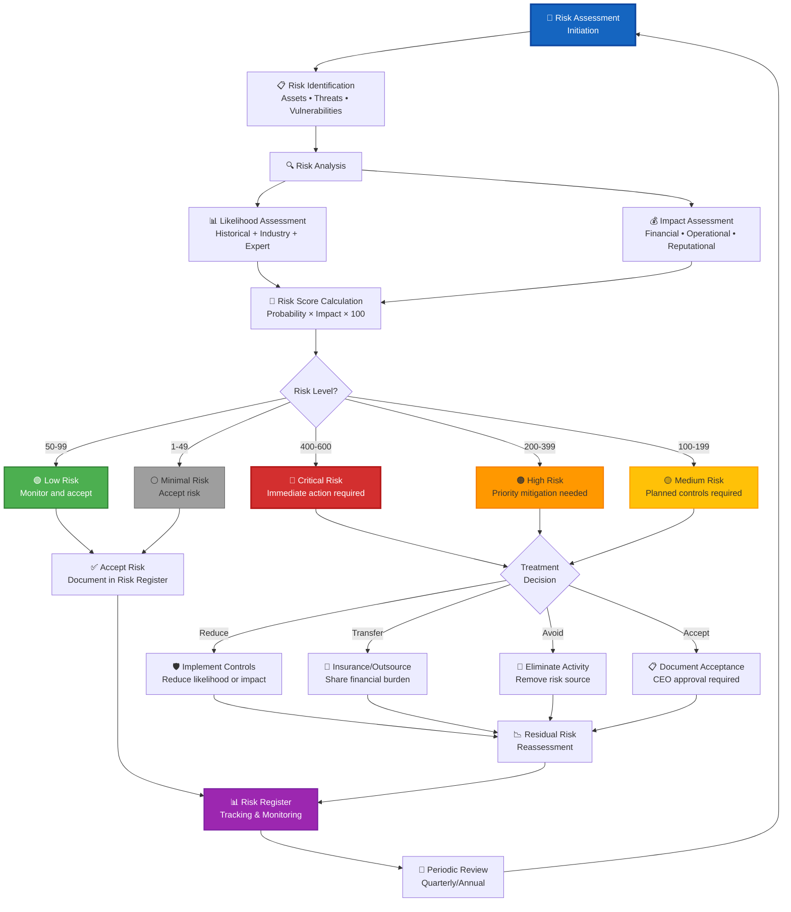
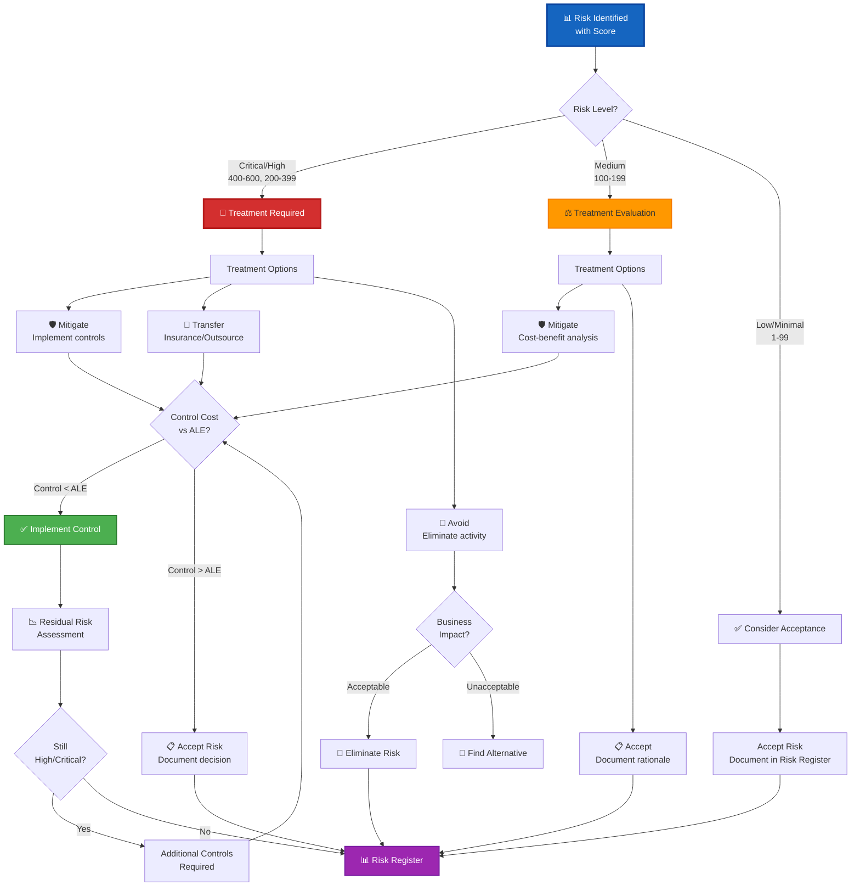

# Risk Assessment Methodology Skill

## Purpose

This skill provides quantitative risk assessment methodology aligned with Hack23 AB's enterprise risk management framework. It enables security professionals and business leaders to systematically identify, analyze, evaluate, and treat risks using defensible statistical methods that demonstrate cybersecurity consulting expertise through measurable, data-driven risk quantification.

## When to Use This Skill

Apply this skill when:
- ✅ Conducting quarterly risk assessments
- ✅ Evaluating risks for new products or services
- ✅ Calculating Annual Loss Expectancy (ALE) for control investments
- ✅ Prioritizing risk treatment based on quantitative impact
- ✅ Documenting risk acceptance decisions
- ✅ Creating risk registers for compliance frameworks
- ✅ Performing threat modeling with financial impact
- ✅ Supporting business case for security controls
- ✅ Responding to client risk assessment inquiries

Do NOT use for:
- ❌ Real-time incident response (use incident-response skill)
- ❌ Vulnerability scoring (use vulnerability-management skill)
- ❌ Code security reviews (use secure-code-review skill)

## Risk Assessment Process Flow



## Likelihood Assessment Framework

Evaluate probability using descriptive categories with quantitative ranges:

| Likelihood | Badge | Probability | Annual Frequency | ARO | Definition | Examples |
|------------|-------|-------------|------------------|-----|------------|----------|
| **Almost Certain** |  | 80-99% | 292-361 events/year | 0.8-0.99 | Expected to occur in most circumstances | Daily operational issues, routine maintenance |
| **Likely** |  | 60-79% | 219-291 events/year | 0.6-0.79 | Will probably occur | Weekly service disruptions, staff availability issues |
| **Possible** |  | 40-59% | 146-218 events/year | 0.4-0.59 | Might occur at some time | Monthly supplier issues, seasonal variations |
| **Unlikely** |  | 20-39% | 73-145 events/year | 0.2-0.39 | Could occur but not expected | Quarterly security incidents, annual contract changes |
| **Rare** |  | 5-19% | 18-72 events/year | 0.05-0.19 | May occur only in exceptional circumstances | Multi-year events, rare external factors |
| **Exceptional** |  | <5% | <18 events/year | <0.05 | Rare, once-in-decade event | Black swan events, extreme scenarios |

### Likelihood Assessment Methods

**Quantitative Data (Preferred):**
```python
# Historical frequency analysis
def calculate_aro(events_last_3_years, trend_factor=1.0):
    """Calculate Annual Rate of Occurrence from historical data"""
    base_aro = sum(events_last_3_years) / 3
    adjusted_aro = base_aro * trend_factor
    return min(adjusted_aro, 0.99)  # Cap at 99%

# Example: 8 incidents in 3 years, increasing trend
aro = calculate_aro([2, 3, 3], trend_factor=1.2)  # = 0.32 (Unlikely)
```

**Qualitative Assessment (When Data Limited):**
- Industry benchmarks (DBIR, ENISA Threat Landscape)
- Expert judgment from security team
- Peer comparison with similar organizations
- Threat intelligence feeds

## Impact Assessment Framework

Evaluate business impact across multiple dimensions:

| Impact | Badge | Financial | Operational | Reputational | Regulatory |
|--------|-------|-----------|-------------|--------------|------------|
| **Catastrophic** |  | >€50K | Complete shutdown | International media | Criminal charges |
| **Critical** |  | €10K-50K | Major disruption | National media | Significant fines |
| **High** |  | €1K-10K | Significant degradation | Industry attention | Moderate penalties |
| **Moderate** |  | €500-1K | Partial service impact | Regional visibility | Minor warnings |
| **Low** |  | €100-500 | Minor inconvenience | Limited local impact | Verbal guidance |
| **Minimal** |  | <€100 | No significant impact | No external visibility | No implications |

### Impact Score Mapping
- Catastrophic = 6
- Critical = 5
- High = 4
- Moderate = 3
- Low = 2
- Minimal = 1

## Risk Score Calculation

**Formula:** `Risk Score = Likelihood (midpoint %) × Impact Score (1-6) × 100`

### Calculation Examples

**Example 1: Data Breach Risk**
- Likelihood: **Unlikely** (30% midpoint)
- Impact: **Critical** (5)
- Risk Score: 0.30 × 5 × 100 = **150** → 🟡 Medium Risk

**Example 2: DDoS Attack Risk**
- Likelihood: **Possible** (50% midpoint)
- Impact: **High** (4)
- Risk Score: 0.50 × 4 × 100 = **200** → 🟠 High Risk

**Example 3: Ransomware Risk**
- Likelihood: **Likely** (70% midpoint)
- Impact: **Catastrophic** (6)
- Risk Score: 0.70 × 6 × 100 = **420** → 🔴 Critical Risk

## Risk Level Categories

| Risk Level | Score Range | Badge | Management Response | Review Frequency |
|------------|-------------|-------|---------------------|------------------|
| **Critical** | 400-600 |  | CEO immediate action, daily monitoring | Daily |
| **High** | 200-399 |  | Weekly executive review | Weekly |
| **Medium** | 100-199 |  | Monthly assessment | Monthly |
| **Low** | 50-99 |  | Quarterly monitoring | Quarterly |
| **Minimal** | 1-49 |  | Acceptance, periodic review | Annual |

## Financial Risk Analysis

### Single Loss Expectancy (SLE)

**Formula:** `SLE = Asset Value × Exposure Factor`

**Asset Value Categories:**
| Category | Value Range | Examples |
|----------|-------------|----------|
| Mission Critical | €100K-500K | Core infrastructure, customer data |
| High Value | €50K-100K | Business applications, intellectual property |
| Standard | €10K-50K | Supporting systems, processes |
| Low Value | €1K-10K | Documentation, utilities |

**Exposure Factor Guidelines:**
| Exposure | Factor | Description |
|----------|--------|-------------|
| Complete Loss | 0.8-1.0 | Total destruction (ransomware, theft) |
| Major Loss | 0.5-0.8 | Significant damage (data corruption) |
| Moderate Loss | 0.2-0.5 | Partial damage (service disruption) |
| Minor Loss | 0.1-0.2 | Limited impact (performance degradation) |

### Annual Loss Expectancy (ALE)

**Formula:** `ALE = SLE × ARO`

**Example Calculation:**
```python
# Ransomware attack on CIA Platform
asset_value = 200000  # €200K (Mission Critical)
exposure_factor = 0.9  # 90% loss (Complete Loss)
aro = 0.7  # 70% (Likely based on industry data)

sle = asset_value * exposure_factor  # €180K
ale = sle * aro  # €126K annually
```

### Value at Risk (VaR) Framework

**Formula:** `VaR = Impact (€) × Probability × Confidence Factor × Time Horizon`

**VaR Risk Categories:**
| Category | VaR Range (€) | Management Action |
|----------|---------------|-------------------|
| Critical | >€200K | Board escalation, immediate mitigation |
| High | €50K-200K | Executive committee, quarterly review |
| Medium | €10K-50K | Risk committee, semi-annual review |
| Low | €1K-10K | Management monitoring, annual review |
| Minimal | <€1K | Acceptance, periodic review |

## Risk Treatment Decision Matrix



### Cost-Benefit Analysis Formula

**Control Value = ALE (Before) - ALE (After) - Control Cost**

```python
def control_roi(ale_before, ale_after, control_cost_annual):
    """Calculate return on investment for security control"""
    annual_benefit = ale_before - ale_after
    net_benefit = annual_benefit - control_cost_annual
    roi_percentage = (net_benefit / control_cost_annual) * 100
    return {
        'annual_benefit': annual_benefit,
        'net_benefit': net_benefit,
        'roi_percentage': roi_percentage,
        'recommendation': 'Implement' if net_benefit > 0 else 'Reject'
    }

# Example: MFA implementation
result = control_roi(
    ale_before=126000,  # €126K ransomware risk
    ale_after=12600,    # 90% reduction
    control_cost_annual=5000  # €5K/year for MFA
)
# Result: €108.4K net benefit, 2068% ROI → Implement
```

## Risk Assessment Templates

### Template 1: Comprehensive Risk Assessment

```markdown
# Risk Assessment: [Risk Name]

**Risk ID:** RSK-2025-XXX
**Assessment Date:** 2025-01-XX
**Assessor:** [Name/Role]
**Status:** Open/Mitigated/Accepted/Closed

## Risk Description
Brief description of the risk scenario.

## Asset Information
- **Primary Asset:** [Asset name]
- **Asset Value:** €X
- **Classification:** [Confidentiality/Integrity/Availability levels]

## Threat & Vulnerability
- **Threat Actor:** [Who/what causes the risk]
- **Threat Motivation:** [Why would they exploit this]
- **Vulnerability:** [What weakness enables exploitation]
- **Attack Vector:** [How the attack occurs]

## Likelihood Assessment
- **Category:** [Exceptional/Rare/Unlikely/Possible/Likely/Almost Certain]
- **Probability:** X%
- **ARO:** X.XX
- **Evidence:** [Historical data, industry benchmarks, expert judgment]

## Impact Assessment
- **Financial:** €X (Category: [Minimal/Low/Moderate/High/Critical/Catastrophic])
- **Operational:** [Description]
- **Reputational:** [Description]
- **Regulatory:** [Description]
- **Impact Score:** X (1-6)

## Risk Calculation
- **Risk Score:** [Probability × Impact × 100] = XXX
- **Risk Level:** 🔴/🟠/🟡/🟢/⚪ [Critical/High/Medium/Low/Minimal]

## Financial Analysis
- **Asset Value:** €X
- **Exposure Factor:** X.X
- **SLE:** €X
- **ALE:** €X

## Current Controls
- [Existing control 1]
- [Existing control 2]

## Recommended Treatment
- **Strategy:** Mitigate/Transfer/Avoid/Accept
- **Proposed Controls:** [List controls]
- **Control Cost:** €X annually
- **Residual Risk Score:** XXX → [Risk Level]
- **Cost-Benefit:** Net benefit €X, ROI X%
- **Recommendation:** Implement/Reject

## Approval
- **Risk Owner:** [Name/Role]
- **Approval Date:** 2025-XX-XX
- **Review Date:** 2025-XX-XX
```

### Template 2: Quick Risk Matrix

| Risk ID | Description | Likelihood | Impact | Score | Level | Treatment | Owner |
|---------|-------------|------------|--------|-------|-------|-----------|-------|
| RSK-001 | Data breach | Unlikely (30%) | Critical (5) | 150 | 🟡 Medium | MFA implementation | CTO |
| RSK-002 | DDoS attack | Possible (50%) | High (4) | 200 | 🟠 High | CDN + WAF | CTO |
| RSK-003 | Ransomware | Likely (70%) | Catastrophic (6) | 420 | 🔴 Critical | Backup + EDR | CEO |

## Integration with Classification Framework

Align risk assessments with [Classification Framework](https://github.com/Hack23/ISMS-PUBLIC/blob/main/CLASSIFICATION.md):

### CIA Triad Mapping

**Confidentiality Impact:**
- Very High (C5) → Catastrophic financial impact
- High (C4) → Critical financial impact
- Moderate (C3) → High financial impact
- Low (C2) → Moderate financial impact
- Minimal (C1) → Low financial impact

**Integrity Impact:**
- Critical (I5) → Catastrophic operational impact
- High (I4) → Critical operational impact
- Moderate (I3) → High operational impact
- Low (I2) → Moderate operational impact
- Minimal (I1) → Low operational impact

**Availability Impact:**
- Mission Critical (A5) → Catastrophic business impact
- High (A4) → Critical business impact
- Moderate (A3) → High business impact
- Low (A2) → Moderate business impact
- Minimal (A1) → Low business impact

## Practical Examples

### Example 1: CIA Platform Ransomware Risk

**Risk Assessment:**
```yaml
risk_id: "RSK-2025-001"
risk_name: "Ransomware attack on CIA Platform"
asset: "CIA Platform (Production)"
asset_value: 200000  # €200K

likelihood:
  category: "Likely"
  probability: 0.70
  aro: 0.70
  evidence: "Industry data (DBIR 2024), phishing susceptibility"

impact:
  financial: 180000  # €180K recovery costs
  operational: "72-hour downtime"
  reputational: "National media coverage"
  regulatory: "GDPR breach notification required"
  category: "Catastrophic"
  score: 6

risk_score: 420  # 0.70 × 6 × 100
risk_level: "Critical"

financial_analysis:
  sle: 180000  # €200K × 0.9
  ale: 126000  # €180K × 0.70

current_controls:
  - "Firewall"
  - "Antivirus"
  - "User awareness training"

proposed_treatment:
  strategy: "Mitigate"
  controls:
    - "Multi-factor authentication (MFA)"
    - "Endpoint detection and response (EDR)"
    - "Immutable backups (3-2-1 rule)"
    - "Email security gateway"
  control_cost_annual: 15000  # €15K
  residual_likelihood: 0.07  # 90% reduction
  residual_risk_score: 42  # 0.07 × 6 × 100
  residual_risk_level: "Minimal"
  
cost_benefit:
  ale_reduction: 113400  # €126K - €12.6K
  net_benefit: 98400  # €113.4K - €15K
  roi: 656  # 656% ROI
  recommendation: "IMPLEMENT IMMEDIATELY"

approval:
  risk_owner: "CEO"
  approval_date: "2025-01-25"
  next_review: "2025-04-25"
```

### Example 2: Black Trigram No Authentication Risk

**Risk Assessment:**
```yaml
risk_id: "RSK-2025-015"
risk_name: "No authentication system risk"
asset: "Black Trigram Gaming Platform"
asset_value: 10000  # €10K

likelihood:
  category: "Rare"
  probability: 0.12
  aro: 0.12
  evidence: "No user accounts, public content only"

impact:
  financial: 500  # €500 reputation recovery
  operational: "Minimal—frontend only"
  reputational: "Limited local impact"
  regulatory: "None—no personal data"
  category: "Low"
  score: 2

risk_score: 24  # 0.12 × 2 × 100
risk_level: "Minimal"

financial_analysis:
  sle: 5000  # €10K × 0.5 (moderate exposure)
  ale: 600  # €5K × 0.12

treatment:
  strategy: "Accept"
  rationale: "Low confidentiality classification. All content is public educational material. No user-specific operations."
  controls_considered:
    - "Authentication system: €8K/year"
    - "Cost-benefit: Negative ROI (€7.4K loss)"
  residual_risk: "Same as inherent risk"
  
risk_acceptance:
  documented_in: "Risk_Register.md"
  approved_by: "CEO"
  review_frequency: "Annual"
  trigger_conditions:
    - "Introduction of user accounts"
    - "Processing of personal data"
    - "User-generated content features"
```

## Compliance Mapping

| Risk Assessment Component | ISO 27005 | NIST RMF | CIS Controls v8 |
|---------------------------|-----------|----------|-----------------|
| Risk identification | Clause 8.2 | Categorize | 4.1 Asset Management |
| Likelihood assessment | Annex C | Assess | 4.1 Risk Assessment |
| Impact assessment | Annex C | Assess | 4.2 Risk Analysis |
| Risk calculation | Clause 8.3 | Assess | 4.2 Risk Analysis |
| Risk treatment | Clause 8.4 | Select + Implement | 4.3 Risk Response |
| Risk acceptance | Clause 8.4.4 | Authorize | 4.4 Risk Approval |
| Monitoring & review | Clause 9 | Monitor | 4.5 Risk Monitoring |

## Standards & Policy References

**Core Hack23 ISMS Policies:**
- [Risk Assessment Methodology](https://github.com/Hack23/ISMS-PUBLIC/blob/main/Risk_Assessment_Methodology.md) - Quantitative framework
- [Risk Register](https://github.com/Hack23/ISMS-PUBLIC/blob/main/Risk_Register.md) - Live risk tracking
- [Classification Framework](https://github.com/Hack23/ISMS-PUBLIC/blob/main/CLASSIFICATION.md) - Impact assessment
- [Asset Register](https://github.com/Hack23/ISMS-PUBLIC/blob/main/Asset_Register.md) - Asset valuation
- [Threat Modeling](https://github.com/Hack23/ISMS-PUBLIC/blob/main/Threat_Modeling.md) - Threat identification

**All Hack23 ISMS Policies:** https://github.com/Hack23/ISMS-PUBLIC
