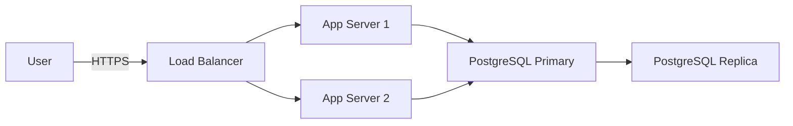

# Security Documentation Skill

## Purpose

Ensure comprehensive, up-to-date security documentation exists for the CIA platform, enabling security reviews, compliance audits, and knowledge transfer.

## When to Use

- ✅ After security architecture changes
- ✅ When new threats identified
- ✅ During compliance audits
- ✅ For security onboarding
- ✅ Before major releases

## Required Security Documents

### 1. SECURITY.md (Required)

```markdown
# Security Policy

## Supported Versions

| Version | Supported          |
| ------- | ------------------ |
| 2.x.x   | :white_check_mark: |
| 1.x.x   | :x:                |

## Reporting a Vulnerability

**DO NOT** create public GitHub issues for security vulnerabilities.

Email: security@hack23.com
PGP Key: [Link to public key]

Expected response time: 48 hours
```

### 2. SECURITY_ARCHITECTURE.md (Required)

```markdown
# Security Architecture

## Authentication & Authorization

### Authentication Flow
\`\`\`
User → Login Form → Spring Security → BCrypt Verification → JWT Token → Access Granted
\`\`\`

### Authorization Model
- Role-Based Access Control (RBAC)
- Roles: GUEST, USER, ADMIN
- Method-level security with @PreAuthorize

## Data Protection

### Encryption
- At Rest: AES-256-GCM for sensitive fields
- In Transit: TLS 1.3 with strong cipher suites

### Data Classification
| Level | Examples | Protection |
|-------|----------|------------|
| Public | Politician names, party | No encryption |
| Internal | Analysis reports | Access control |
| Confidential | Personal IDs | Encrypted, audit logged |
| Restricted | API keys, passwords | Secrets manager |

## Network Security

### Architecture Diagram
\`\`\`
Internet → CloudFlare WAF → Load Balancer → App Servers (Private Subnet) → Database (Private Subnet)
\`\`\`

### Security Controls
- WAF: OWASP ModSecurity rules
- Rate Limiting: 100 req/minute per IP
- DDoS Protection: CloudFlare
- Network Segmentation: VPC with private subnets
```

### 3. THREAT_MODEL.md (Required)

```markdown
# Threat Model

## Assets
1. User credentials
2. Politician personal data
3. Voting records
4. API keys for external services

## Threat Actors
- **External Attackers**: Unauthorized access, data theft
- **Malicious Insiders**: Privilege abuse
- **Nation States**: APT, espionage

## STRIDE Analysis

### Spoofing
- **Threat**: Attacker impersonates legitimate user
- **Mitigation**: MFA, strong password policy, rate limiting

### Tampering
- **Threat**: Modification of voting records
- **Mitigation**: Data integrity checks, audit logging, database triggers

[... Continue for all STRIDE categories]

## Attack Trees

\`\`\`
Goal: Compromise Politician Data
├─ Exploit Authentication
│  ├─ Brute Force [Mitigated: Rate limiting]
│  └─ Session Hijacking [Mitigated: Secure cookies]
└─ Exploit Authorization
   └─ Privilege Escalation [Mitigated: RBAC]
\`\`\`
```

### 4. DATA_MODEL.md (Existing, ensure security section)

```markdown
# Data Model

## Security Considerations

### Encrypted Fields
- `politician.personal_id_encrypted` - AES-256-GCM
- `user.password_hash` - bcrypt (cost factor 12)

### Audit Logging
All changes to these tables are audited:
- `politician`
- `voting_record`
- `user`
- `system_configuration`
```

### 5. INCIDENT_RESPONSE.md (Required)

```markdown
# Incident Response Plan

## Severity Classification

| Severity | Criteria | Response Time |
|----------|----------|---------------|
| Critical | Data breach, system compromise | 1 hour |
| High | Authentication bypass | 4 hours |
| Medium | DoS attack | 24 hours |
| Low | Minor configuration issue | 1 week |

## Response Phases

1. **Detection & Analysis**
   - Monitor alerts
   - Classify severity
   - Assemble response team

2. **Containment**
   - Isolate affected systems
   - Revoke compromised credentials
   - Enable additional logging

3. **Eradication**
   - Remove malware/backdoors
   - Patch vulnerabilities
   - Reset credentials

4. **Recovery**
   - Restore from backups
   - Verify system integrity
   - Gradual service restoration

5. **Post-Incident**
   - Root cause analysis
   - Update controls
   - Document lessons learned
```

### 6. VULNERABILITY_MANAGEMENT.md (Required)

```markdown
# Vulnerability Management

## Vulnerability Classification

| CVSS Score | Severity | SLA |
|------------|----------|-----|
| 9.0-10.0 | Critical | 7 days |
| 7.0-8.9 | High | 30 days |
| 4.0-6.9 | Medium | 90 days |
| 0.1-3.9 | Low | 180 days |

## Scanning Schedule

- **Daily**: Automated dependency scans (OWASP Dependency Check)
- **Weekly**: CodeQL SAST scans
- **Monthly**: Full penetration testing
- **Quarterly**: External security assessment

## Remediation Process

1. Vulnerability identified
2. Risk assessment
3. Prioritization
4. Patch/fix development
5. Testing
6. Deployment
7. Verification
8. Documentation
```

### 7. ACCESS_CONTROL_MATRIX.md (Required)

```markdown
# Access Control Matrix

| Resource | Guest | User | Admin |
|----------|-------|------|-------|
| View public politician data | ✅ | ✅ | ✅ |
| View confidential data | ❌ | ❌ | ✅ |
| Create user account | ✅ | ❌ | ✅ |
| Modify user account | ❌ | Own | All |
| Delete user account | ❌ | Own | All |
| System configuration | ❌ | ❌ | ✅ |
| View audit logs | ❌ | ❌ | ✅ |
```

## Documentation Standards

### Markdown Format
- Use GitHub-Flavored Markdown
- Include table of contents for long documents
- Use code fences with language identifiers
- Add diagrams using Mermaid or ASCII art

### Diagrams



### Update Frequency

| Document | Update Trigger | Review Frequency |
|----------|---------------|------------------|
| SECURITY.md | CVE published | Quarterly |
| SECURITY_ARCHITECTURE.md | Architecture change | Per release |
| THREAT_MODEL.md | New threat identified | Annually |
| INCIDENT_RESPONSE.md | Post-incident | After incidents |

## Documentation Checklist

Before marking security documentation complete:

- ✅ All required documents exist
- ✅ Documents are up-to-date (< 90 days old)
- ✅ Diagrams reflect current architecture
- ✅ Contact information is current
- ✅ Links work (no 404s)
- ✅ Code examples compile/run
- ✅ Reviewed by security team
- ✅ Approved by CISO/security officer

## ISMS Compliance

- **ISO 27001:2022 A.5.10**: Information security policies documented
- **ISO 27001:2022 A.16.1**: Incident management procedures documented
- **NIST CSF ID.GV-1**: Cybersecurity policy established

## References

- Hack23 Documentation Standards: https://github.com/Hack23/ISMS-PUBLIC/blob/main/standards/documentation-standard.md
- DOCUMENTATION_NAMING_CONVENTION.md
