# Strategic Communication Analysis Skill

## Purpose

This skill provides comprehensive methodologies for analyzing strategic political communication in Swedish parliament and media. It enables intelligence operatives to identify narrative framing techniques, detect coordinated messaging campaigns, assess media bias, analyze parliamentary discourse patterns, and identify information warfare tactics through evidence-based analysis of speeches, documents, and media coverage.

## When to Use This Skill

Apply this skill when:
- ✅ Analyzing parliamentary debate rhetoric and framing strategies
- ✅ Detecting coordinated messaging campaigns across party members
- ✅ Identifying media bias in political coverage
- ✅ Assessing influence operations and disinformation patterns
- ✅ Analyzing discourse shifts over time (framing evolution)
- ✅ Evaluating communication effectiveness of political figures
- ✅ Detecting astroturfing and inauthentic amplification
- ✅ Mapping information ecosystems and echo chambers
- ✅ Identifying counter-narrative opportunities

Do NOT use for:
- ❌ Content censorship or suppression of legitimate political speech
- ❌ Manipulating public discourse through disinformation
- ❌ Violating freedom of expression protections
- ❌ Personal attacks on communication style without policy substance

## Strategic Communication Framework

### Five Analytical Dimensions

The CIA platform analyzes political communication across five critical dimensions to understand messaging strategies and influence dynamics:

```mermaid
graph TB
    subgraph "Communication Intelligence Collection"
        A1[📝 Parliamentary Documents<br/>89K+ documents<br/>Motions, interpellations, bills]
        A2[🎤 Debate Transcripts<br/>Parliamentary speeches<br/>Committee testimony]
        A3[📰 Media Coverage<br/>News articles, press releases<br/>Social media posts]
        A4[🗳️ Voting Records<br/>Action-rhetoric alignment<br/>Behavior vs. statements]
        A5[🤝 Coalition Messaging<br/>Party coordination<br/>Message discipline]
    end
    
    subgraph "Communication Analysis"
        A1 --> B1[Narrative Framing Analysis]
        A2 --> B2[Discourse Pattern Recognition]
        A3 --> B3[Media Bias Detection]
        A4 --> B4[Rhetoric-Action Gap Analysis]
        A5 --> B5[Coordination Assessment]
    end
    
    subgraph "Intelligence Products"
        B1 --> C1[Frame Identification]
        B2 --> C2[Discourse Networks]
        B3 --> C3[Bias Profiles]
        B4 --> C4[Credibility Assessment]
        B5 --> C5[Campaign Detection]
    end
    
    subgraph "Strategic Intelligence"
        C1 & C2 & C3 & C4 & C5 --> D[📊 Communication Profile]
        D --> E[Influence Assessment]
        D --> F[Disinformation Detection]
        D --> G[Counter-Narrative Strategy]
    end
    
    style A1 fill:#e1f5ff
    style A2 fill:#e1f5ff
    style A3 fill:#e1f5ff
    style A4 fill:#e1f5ff
    style A5 fill:#e1f5ff
    style D fill:#ffe6cc
    style E fill:#ccffcc
    style F fill:#ffcccc
    style G fill:#fff9cc
```



## 1. Narrative Framing Analysis

### Framing Theory Application

Political actors use framing to define issues in ways that advantage their positions. The CIA platform identifies dominant frames through document and speech analysis.

**Database Views:**
- `view_riksdagen_politician_document` - All politician-authored documents
- `view_riksdagen_document_content` - Full document text for NLP analysis
- `view_riksdagen_document_element` - Document structure and metadata

### Frame Identification System

```python
from typing import Dict, List, Tuple
import re
from collections import Counter
from dataclasses import dataclass

@dataclass
class Frame:
    """Political framing structure."""
    frame_type: str
    keywords: List[str]
    metaphors: List[str]
    values: List[str]
    emotional_tone: str

class NarrativeFramingAnalyzer:
    """
    Identifies narrative frames in political communication.
    
    Based on Entman (1993) framing theory:
    1. Problem definition
    2. Causal interpretation
    3. Moral evaluation
    4. Treatment recommendation
    """
    
    # Swedish political frame templates
    FRAME_TEMPLATES = {
        'ECONOMIC_COMPETITIVENESS': Frame(
            frame_type='ECONOMIC_COMPETITIVENESS',
            keywords=['konkurrenskraft', 'tillväxt', 'företagande', 'innovation', 'export'],
            metaphors=['motor', 'drivkraft', 'framtid'],
            values=['prosperity', 'efficiency', 'growth'],
            emotional_tone='aspirational'
        ),
        'SOCIAL_JUSTICE': Frame(
            frame_type='SOCIAL_JUSTICE',
            keywords=['rättvisa', 'jämlikhet', 'solidaritet', 'välfärd', 'trygghet'],
            metaphors=['broar', 'skyddsnät', 'gemenskap'],
            values=['equality', 'fairness', 'solidarity'],
            emotional_tone='empathetic'
        ),
        'NATIONAL_SECURITY': Frame(
            frame_type='NATIONAL_SECURITY',
            keywords=['säkerhet', 'försvar', 'gränser', 'suveränitet', 'beredskap'],
            metaphors=['skydd', 'fort', 'försvar'],
            values=['safety', 'sovereignty', 'protection'],
            emotional_tone='protective'
        ),
        'ENVIRONMENTAL_CRISIS': Frame(
            frame_type='ENVIRONMENTAL_CRISIS',
            keywords=['klimat', 'miljö', 'hållbarhet', 'förnybart', 'utsläpp'],
            metaphors=['kris', 'hotet', 'framtiden'],
            values=['sustainability', 'responsibility', 'legacy'],
            emotional_tone='urgent'
        ),
        'PERSONAL_FREEDOM': Frame(
            frame_type='PERSONAL_FREEDOM',
            keywords=['frihet', 'valfrihet', 'självständighet', 'ansvar', 'rättigheter'],
            metaphors=['kedjor', 'byråkrati', 'frihet'],
            values=['liberty', 'autonomy', 'choice'],
            emotional_tone='libertarian'
        ),
        'IMMIGRATION_CONTROL': Frame(
            frame_type='IMMIGRATION_CONTROL',
            keywords=['integration', 'migration', 'ordning', 'kontroll', 'ansvar'],
            metaphors=['ordning', 'gränser', 'system'],
            values=['order', 'fairness', 'sustainability'],
            emotional_tone='controlled'
        )
    }
    
    def analyze_document_framing(self, document_id: str) -> Dict:
        """
        Analyzes narrative framing in a parliamentary document.
        
        Returns:
        - Dominant frame(s)
        - Frame intensity score
        - Supporting evidence (keywords, metaphors)
        - Frame consistency over time
        """
        
        query = """
        SELECT 
            d.document_id,
            d.document_type,
            d.title,
            d.subtitle,
            dc.text_content,
            p.person_id,
            p.first_name || ' ' || p.last_name as author,
            p.party,
            d.created_date,
            d.issue_category,
            d.issue_subcategory
        FROM document d
        JOIN document_content dc ON d.document_id = dc.document_id
        JOIN document_person dp ON d.document_id = dp.document_id
        JOIN person p ON dp.person_id = p.person_id
        WHERE d.document_id = %s
        """
        
        doc = pd.read_sql(query, self.connection, params=[document_id]).iloc[0]
        
        # Analyze text for frame indicators
        text_content = doc['text_content'].lower()
        title_content = f"{doc['title']} {doc['subtitle']}".lower()
        
        frame_scores = {}
        frame_evidence = {}
        
        for frame_name, frame in self.FRAME_TEMPLATES.items():
            # Score based on keyword presence
            keyword_score = sum(
                text_content.count(keyword) for keyword in frame.keywords
            ) / len(frame.keywords)
            
            # Score based on metaphor usage
            metaphor_score = sum(
                text_content.count(metaphor) * 2 for metaphor in frame.metaphors
            ) / len(frame.metaphors)
            
            # Bonus for title/subtitle framing (higher salience)
            title_score = sum(
                title_content.count(keyword) * 3 for keyword in frame.keywords
            ) / len(frame.keywords)
            
            total_score = keyword_score + metaphor_score + title_score
            
            frame_scores[frame_name] = round(total_score, 2)
            frame_evidence[frame_name] = {
                'keywords_found': [kw for kw in frame.keywords if kw in text_content],
                'metaphors_found': [m for m in frame.metaphors if m in text_content],
                'title_framing': any(kw in title_content for kw in frame.keywords)
            }
        
        # Identify dominant frame(s)
        sorted_frames = sorted(frame_scores.items(), key=lambda x: x[1], reverse=True)
        dominant_frame = sorted_frames[0][0] if sorted_frames[0][1] > 3 else 'MIXED_FRAMING'
        
        return {
            'document_id': document_id,
            'author': doc['author'],
            'party': doc['party'],
            'document_type': doc['document_type'],
            'dominant_frame': dominant_frame,
            'frame_scores': frame_scores,
            'frame_evidence': frame_evidence[dominant_frame],
            'frame_intensity': sorted_frames[0][1],
            'mixed_framing': len([s for s in sorted_frames if s[1] > 2]) > 1,
            'created_date': doc['created_date']
        }
    
    def analyze_party_framing_strategy(self, party_id: str, date_from: str, date_to: str) -> Dict:
        """
        Analyzes a party's framing strategy over time.
        
        Identifies:
        - Consistent frames vs. tactical frame shifts
        - Frame coordination across party members
        - Frame evolution in response to events
        """
        
        query = """
        SELECT 
            d.document_id,
            d.created_date,
            d.issue_category,
            p.person_id,
            p.first_name || ' ' || p.last_name as author
        FROM document d
        JOIN document_person dp ON d.document_id = dp.document_id
        JOIN person p ON dp.person_id = p.person_id
        WHERE p.party = %s
            AND d.created_date BETWEEN %s AND %s
            AND d.document_type IN ('motion', 'interpellation', 'bill')
        ORDER BY d.created_date
        """
        
        documents = pd.read_sql(query, self.connection, 
                               params=[party_id, date_from, date_to])
        
        # Analyze each document
        party_frames = []
        for _, doc in documents.iterrows():
            frame_analysis = self.analyze_document_framing(doc['document_id'])
            frame_analysis['author'] = doc['author']
            frame_analysis['created_date'] = doc['created_date']
            party_frames.append(frame_analysis)
        
        # Calculate frame consistency
        frame_distribution = Counter([f['dominant_frame'] for f in party_frames])
        total_docs = len(party_frames)
        
        # Calculate coordination score
        authors = list(set([f['author'] for f in party_frames]))
        author_frames = {author: Counter() for author in authors}
        
        for frame_analysis in party_frames:
            author_frames[frame_analysis['author']][frame_analysis['dominant_frame']] += 1
        
        # Coordination: Do different authors use similar frames?
        coordination_score = 0
        if len(authors) > 1:
            top_frame = frame_distribution.most_common(1)[0][0]
            authors_using_top_frame = sum(
                1 for author, frames in author_frames.items() 
                if frames[top_frame] > 0
            )
            coordination_score = authors_using_top_frame / len(authors)
        
        return {
            'party': party_id,
            'analysis_period': f"{date_from} to {date_to}",
            'total_documents': total_docs,
            'frame_distribution': dict(frame_distribution),
            'dominant_party_frame': frame_distribution.most_common(1)[0][0],
            'frame_consistency': frame_distribution.most_common(1)[0][1] / total_docs,
            'coordination_score': round(coordination_score, 3),
            'frame_diversity': len(frame_distribution),
            'classification': self._classify_framing_strategy(
                frame_distribution.most_common(1)[0][1] / total_docs,
                coordination_score
            )
        }
    
    def _classify_framing_strategy(self, consistency: float, coordination: float) -> str:
        """Classify party framing strategy."""
        if consistency > 0.7 and coordination > 0.7:
            return "DISCIPLINED_MESSAGING"
        elif consistency > 0.5 and coordination > 0.5:
            return "COORDINATED_STRATEGY"
        elif consistency < 0.3 or coordination < 0.3:
            return "FRAGMENTED_MESSAGING"
        else:
            return "ADAPTIVE_POSITIONING"
```

## 2. Media Bias Detection

### Systematic Bias Analysis

Media bias affects public perception of political actors. The CIA platform systematically measures bias through coverage patterns and linguistic analysis.

```java
@Service
public class MediaBiasDetector {
    
    /**
     * Detects systematic media bias in political coverage.
     * 
     * Bias indicators:
     * 1. Coverage frequency disparities
     * 2. Sentiment bias (positive vs. negative framing)
     * 3. Source selection bias (which politicians quoted)
     * 4. Issue framing bias (which frames amplified)
     * 5. Omission bias (what's not covered)
     */
    
    public MediaBiasProfile analyzeBias(
        String mediaOutletId, 
        String politicalEntity, 
        LocalDate startDate, 
        LocalDate endDate
    ) {
        String sql = """
            WITH coverage_baseline AS (
                -- Calculate expected coverage based on political relevance
                SELECT 
                    political_entity_id,
                    entity_type,
                    political_relevance_score,
                    CASE entity_type
                        WHEN 'PARTY_LEADER' THEN political_relevance_score * 3
                        WHEN 'MINISTER' THEN political_relevance_score * 2.5
                        WHEN 'COMMITTEE_CHAIR' THEN political_relevance_score * 1.5
                        ELSE political_relevance_score
                    END as expected_coverage_weight
                FROM political_entity_relevance
            ),
            actual_coverage AS (
                -- Measure actual coverage from media outlet
                SELECT 
                    mc.political_entity_id,
                    COUNT(DISTINCT mc.article_id) as article_count,
                    AVG(mc.sentiment_score) as avg_sentiment,
                    SUM(mc.prominence_score) as total_prominence,
                    
                    -- Linguistic indicators
                    AVG(LENGTH(mc.quote_text)) as avg_quote_length,
                    COUNT(CASE WHEN mc.is_primary_source THEN 1 END) as primary_source_count,
                    
                    -- Framing indicators
                    mc.dominant_frame,
                    mc.frame_valence
                    
                FROM media_coverage mc
                WHERE mc.media_outlet_id = :mediaOutletId
                    AND mc.coverage_date BETWEEN :startDate AND :endDate
                GROUP BY mc.political_entity_id, mc.dominant_frame, mc.frame_valence
            ),
            bias_analysis AS (
                SELECT 
                    cb.political_entity_id,
                    cb.entity_type,
                    cb.expected_coverage_weight,
                    COALESCE(ac.article_count, 0) as actual_articles,
                    COALESCE(ac.total_prominence, 0) as actual_prominence,
                    COALESCE(ac.avg_sentiment, 0) as sentiment_score,
                    
                    -- Coverage bias: Actual vs. Expected
                    CASE 
                        WHEN cb.expected_coverage_weight = 0 THEN 0
                        ELSE (COALESCE(ac.article_count, 0)::float / 
                              NULLIF(cb.expected_coverage_weight, 0)) - 1
                    END as coverage_bias_ratio,
                    
                    -- Sentiment bias: Deviation from neutral (0.5)
                    ABS(COALESCE(ac.avg_sentiment, 0.5) - 0.5) * 2 as sentiment_bias_magnitude,
                    CASE 
                        WHEN COALESCE(ac.avg_sentiment, 0.5) > 0.5 THEN 'POSITIVE_BIAS'
                        WHEN COALESCE(ac.avg_sentiment, 0.5) < 0.5 THEN 'NEGATIVE_BIAS'
                        ELSE 'NEUTRAL'
                    END as sentiment_bias_direction
                    
                FROM coverage_baseline cb
                LEFT JOIN actual_coverage ac ON cb.political_entity_id = ac.political_entity_id
                WHERE cb.political_entity_id = :politicalEntity
            )
            SELECT 
                *,
                -- Overall bias score (0-100, higher = more biased)
                (
                    ABS(coverage_bias_ratio) * 40 +
                    sentiment_bias_magnitude * 60
                ) as overall_bias_score,
                
                -- Bias classification
                CASE 
                    WHEN ABS(coverage_bias_ratio) > 0.5 AND sentiment_bias_magnitude > 0.3 
                        THEN 'HIGH_BIAS'
                    WHEN ABS(coverage_bias_ratio) > 0.3 OR sentiment_bias_magnitude > 0.2 
                        THEN 'MODERATE_BIAS'
                    ELSE 'LOW_BIAS'
                END as bias_classification
                
            FROM bias_analysis
            """;
        
        return jdbcTemplate.queryForObject(sql, MediaBiasProfile.class,
            Map.of(
                "mediaOutletId", mediaOutletId,
                "politicalEntity", politicalEntity,
                "startDate", startDate,
                "endDate", endDate
            ));
    }
}
```

### Media Bias Taxonomy

| Bias Type | Detection Method | Risk Level | Strategic Implications |
|-----------|------------------|------------|------------------------|
| **Coverage Bias** | Frequency disparity > 50% | HIGH | Systematic visibility manipulation |
| **Sentiment Bias** | Sentiment deviation > 0.30 | HIGH | Reputation attack or promotion |
| **Source Selection Bias** | Quote frequency imbalance | MODERATE | Platform control |
| **Framing Bias** | Consistent negative/positive frames | HIGH | Narrative control |
| **Omission Bias** | Missing coverage of significant events | CRITICAL | Information suppression |
| **Contextualization Bias** | Selective context inclusion | MODERATE | Meaning manipulation |

## 3. Discourse Network Analysis

### Parliamentary Discourse Patterns

Political discourse reveals coalition structures, ideological alignment, and influence networks through linguistic similarity and interaction patterns.

```sql
-- Discourse Network Construction
WITH politician_linguistic_profile AS (
    SELECT 
        p.person_id,
        p.first_name || ' ' || p.last_name as name,
        p.party,
        
        -- Aggregate linguistic features from documents
        STRING_AGG(DISTINCT dc.keyword, ', ') as frequent_keywords,
        STRING_AGG(DISTINCT dc.topic, ', ') as discussed_topics,
        AVG(dc.complexity_score) as avg_linguistic_complexity,
        AVG(dc.emotional_intensity) as avg_emotional_intensity,
        
        -- Document types as communication preferences
        COUNT(DISTINCT CASE WHEN d.document_type = 'motion' THEN d.document_id END) as motion_count,
        COUNT(DISTINCT CASE WHEN d.document_type = 'interpellation' THEN d.document_id END) as question_count,
        COUNT(DISTINCT CASE WHEN d.document_type = 'debate_speech' THEN d.document_id END) as speech_count
        
    FROM person p
    JOIN document_person dp ON p.person_id = dp.person_id
    JOIN document d ON dp.document_id = d.document_id
    JOIN document_content dc ON d.document_id = dc.document_id
    WHERE d.created_date >= NOW() - INTERVAL '2 years'
    GROUP BY p.person_id, p.first_name, p.last_name, p.party
),
discourse_similarity AS (
    -- Calculate linguistic similarity between politicians
    SELECT 
        p1.person_id as person_a,
        p2.person_id as person_b,
        p1.name as name_a,
        p2.name as name_b,
        p1.party as party_a,
        p2.party as party_b,
        
        -- Keyword overlap (Jaccard similarity)
        (
            SELECT COUNT(DISTINCT k.keyword)::float / 
            NULLIF(
                COUNT(DISTINCT k1.keyword) + COUNT(DISTINCT k2.keyword) - COUNT(DISTINCT k.keyword),
                0
            )
            FROM (
                SELECT unnest(string_to_array(p1.frequent_keywords, ', ')) as keyword
                INTERSECT
                SELECT unnest(string_to_array(p2.frequent_keywords, ', ')) as keyword
            ) k,
            (SELECT unnest(string_to_array(p1.frequent_keywords, ', ')) as keyword) k1,
            (SELECT unnest(string_to_array(p2.frequent_keywords, ', ')) as keyword) k2
        ) as keyword_similarity,
        
        -- Topic overlap
        (
            SELECT COUNT(DISTINCT t.topic)::float / 
            NULLIF(
                COUNT(DISTINCT t1.topic) + COUNT(DISTINCT t2.topic) - COUNT(DISTINCT t.topic),
                0
            )
            FROM (
                SELECT unnest(string_to_array(p1.discussed_topics, ', ')) as topic
                INTERSECT
                SELECT unnest(string_to_array(p2.discussed_topics, ', ')) as topic
            ) t,
            (SELECT unnest(string_to_array(p1.discussed_topics, ', ')) as topic) t1,
            (SELECT unnest(string_to_array(p2.discussed_topics, ', ')) as topic) t2
        ) as topic_similarity,
        
        -- Stylistic similarity
        1 - ABS(p1.avg_linguistic_complexity - p2.avg_linguistic_complexity) as style_similarity,
        1 - ABS(p1.avg_emotional_intensity - p2.avg_emotional_intensity) as tone_similarity,
        
        -- Overall discourse similarity
        (
            COALESCE((
                SELECT COUNT(DISTINCT k.keyword)::float / 
                NULLIF(
                    COUNT(DISTINCT k1.keyword) + COUNT(DISTINCT k2.keyword) - COUNT(DISTINCT k.keyword),
                    0
                )
                FROM (
                    SELECT unnest(string_to_array(p1.frequent_keywords, ', ')) as keyword
                    INTERSECT
                    SELECT unnest(string_to_array(p2.frequent_keywords, ', ')) as keyword
                ) k,
                (SELECT unnest(string_to_array(p1.frequent_keywords, ', ')) as keyword) k1,
                (SELECT unnest(string_to_array(p2.frequent_keywords, ', ')) as keyword) k2
            ), 0) * 0.4 +
            COALESCE((
                SELECT COUNT(DISTINCT t.topic)::float / 
                NULLIF(
                    COUNT(DISTINCT t1.topic) + COUNT(DISTINCT t2.topic) - COUNT(DISTINCT t.topic),
                    0
                )
                FROM (
                    SELECT unnest(string_to_array(p1.discussed_topics, ', ')) as topic
                    INTERSECT
                    SELECT unnest(string_to_array(p2.discussed_topics, ', ')) as topic
                ) t,
                (SELECT unnest(string_to_array(p1.discussed_topics, ', ')) as topic) t1,
                (SELECT unnest(string_to_array(p2.discussed_topics, ', ')) as topic) t2
            ), 0) * 0.3 +
            (1 - ABS(p1.avg_linguistic_complexity - p2.avg_linguistic_complexity)) * 0.15 +
            (1 - ABS(p1.avg_emotional_intensity - p2.avg_emotional_intensity)) * 0.15
        ) as discourse_similarity_score
        
    FROM politician_linguistic_profile p1
    CROSS JOIN politician_linguistic_profile p2
    WHERE p1.person_id < p2.person_id  -- Avoid duplicates
)
SELECT 
    person_a,
    person_b,
    name_a,
    name_b,
    party_a,
    party_b,
    discourse_similarity_score,
    
    -- Network interpretation
    CASE 
        WHEN discourse_similarity_score > 0.7 THEN 'STRONG_DISCOURSE_ALIGNMENT'
        WHEN discourse_similarity_score > 0.5 THEN 'MODERATE_ALIGNMENT'
        WHEN discourse_similarity_score > 0.3 THEN 'WEAK_ALIGNMENT'
        ELSE 'DISCOURSE_DIVERGENCE'
    END as relationship_type,
    
    -- Cross-party discourse bridges (important for coalition intelligence)
    CASE 
        WHEN party_a != party_b AND discourse_similarity_score > 0.5 
            THEN 'CROSS_PARTY_BRIDGE'
        ELSE NULL
    END as bridge_indicator
    
FROM discourse_similarity
WHERE discourse_similarity_score > 0.3  -- Filter weak connections
ORDER BY discourse_similarity_score DESC;
```

## 4. Coordinated Campaign Detection

### Messaging Synchronization Analysis

Detecting coordinated messaging campaigns reveals strategic communication planning and potential influence operations.

```python
from datetime import timedelta
import numpy as np
from scipy import stats

class CoordinatedCampaignDetector:
    """
    Detects coordinated messaging campaigns through temporal and content analysis.
    
    Indicators of coordination:
    1. Temporal clustering (simultaneous messaging)
    2. Message consistency (identical or near-identical content)
    3. Hashtag/keyword coordination
    4. Amplification patterns (coordinated sharing)
    5. Strategic timing (event-based synchronization)
    """
    
    def detect_campaign(
        self, 
        party_id: str, 
        date_from: str, 
        date_to: str,
        time_window_hours: int = 24
    ) -> Dict:
        """
        Detects coordinated messaging campaigns within a party.
        
        Returns campaign indicators and coordination metrics.
        """
        
        query = """
        SELECT 
            d.document_id,
            d.created_date,
            d.title,
            d.subtitle,
            dc.text_content,
            dc.keywords,
            p.person_id,
            p.first_name || ' ' || p.last_name as author,
            p.party
        FROM document d
        JOIN document_content dc ON d.document_id = dc.document_id
        JOIN document_person dp ON d.document_id = dp.document_id
        JOIN person p ON dp.person_id = p.person_id
        WHERE p.party = %s
            AND d.created_date BETWEEN %s AND %s
            AND d.document_type IN ('motion', 'interpellation', 'press_release')
        ORDER BY d.created_date
        """
        
        documents = pd.read_sql(query, self.connection, 
                               params=[party_id, date_from, date_to])
        
        if len(documents) < 5:
            return {'campaign_detected': False, 'reason': 'Insufficient data'}
        
        # 1. Temporal Clustering Analysis
        documents['created_date'] = pd.to_datetime(documents['created_date'])
        time_window = timedelta(hours=time_window_hours)
        
        temporal_clusters = []
        for i, doc in documents.iterrows():
            cluster_docs = documents[
                (documents['created_date'] >= doc['created_date']) &
                (documents['created_date'] <= doc['created_date'] + time_window)
            ]
            if len(cluster_docs) >= 3:  # At least 3 documents in time window
                temporal_clusters.append({
                    'start_time': doc['created_date'],
                    'document_count': len(cluster_docs),
                    'authors': cluster_docs['author'].tolist(),
                    'document_ids': cluster_docs['document_id'].tolist()
                })
        
        # 2. Content Similarity Analysis
        # Calculate keyword overlap for temporal clusters
        coordinated_clusters = []
        for cluster in temporal_clusters:
            cluster_docs = documents[documents['document_id'].isin(cluster['document_ids'])]
            
            # Extract keywords from all documents in cluster
            all_keywords = []
            for _, doc in cluster_docs.iterrows():
                if doc['keywords']:
                    all_keywords.extend([k.strip() for k in doc['keywords'].split(',')])
            
            # Calculate keyword coordination
            keyword_freq = Counter(all_keywords)
            repeated_keywords = [k for k, count in keyword_freq.items() if count >= 2]
            
            coordination_score = len(repeated_keywords) / max(len(set(all_keywords)), 1)
            
            if coordination_score > 0.4:  # 40% keyword overlap threshold
                coordinated_clusters.append({
                    **cluster,
                    'coordination_score': coordination_score,
                    'shared_keywords': repeated_keywords[:10]  # Top 10
                })
        
        # 3. Statistical Significance Test
        # Test if temporal clustering is statistically significant
        expected_cluster_rate = len(documents) / ((date_to - date_from).days * 24 / time_window_hours)
        observed_clusters = len(temporal_clusters)
        
        # Poisson test for clustering significance
        p_value = stats.poisson.sf(observed_clusters - 1, expected_cluster_rate)
        
        campaign_detected = (
            len(coordinated_clusters) >= 2 and
            p_value < 0.05 and
            any(c['coordination_score'] > 0.5 for c in coordinated_clusters)
        )
        
        return {
            'campaign_detected': campaign_detected,
            'party': party_id,
            'analysis_period': f"{date_from} to {date_to}",
            'total_documents': len(documents),
            'temporal_clusters': len(temporal_clusters),
            'coordinated_clusters': len(coordinated_clusters),
            'statistical_significance': p_value < 0.05,
            'p_value': round(p_value, 4),
            'coordination_details': coordinated_clusters[:5],  # Top 5 campaigns
            'assessment': self._assess_campaign_sophistication(
                len(coordinated_clusters),
                max([c['coordination_score'] for c in coordinated_clusters], default=0)
            )
        }
    
    def _assess_campaign_sophistication(self, cluster_count: int, max_coordination: float) -> str:
        """Assess campaign coordination sophistication."""
        if cluster_count >= 5 and max_coordination > 0.7:
            return "HIGHLY_COORDINATED_CAMPAIGN"
        elif cluster_count >= 3 and max_coordination > 0.5:
            return "MODERATELY_COORDINATED_CAMPAIGN"
        elif cluster_count >= 2:
            return "EMERGING_COORDINATION"
        else:
            return "ORGANIC_MESSAGING"
```

## 5. Rhetoric-Action Gap Analysis

### Credibility Assessment Through Alignment Analysis

Politicians often promise one thing and vote another. The CIA platform quantifies this gap to assess credibility.

```java
@Component
public class RhetoricActionGapAnalyzer {
    
    /**
     * Measures the gap between stated positions and voting behavior.
     * 
     * High gap indicates:
     * - Strategic positioning without commitment
     * - Public deception
     * - Coalition pressure overriding stated principles
     * - Populist rhetoric vs. elite voting
     */
    
    public RhetoricActionProfile analyzeGap(String politicianId) {
        String sql = """
            WITH politician_rhetoric AS (
                -- Extract policy positions from documents
                SELECT 
                    dp.person_id,
                    d.issue_category,
                    d.issue_subcategory,
                    dc.stance,  -- Extracted stance: 'support', 'oppose', 'neutral'
                    dc.stance_confidence_score,
                    d.created_date as rhetoric_date
                FROM document d
                JOIN document_content dc ON d.document_id = dc.document_id
                JOIN document_person dp ON d.document_id = dp.document_id
                WHERE dp.person_id = :politicianId
                    AND d.document_type IN ('motion', 'interpellation', 'debate_speech')
                    AND dc.stance IS NOT NULL
                    AND d.created_date >= NOW() - INTERVAL '4 years'
            ),
            politician_actions AS (
                -- Extract voting behavior on same issues
                SELECT 
                    v.person_id,
                    b.issue_category,
                    b.issue_subcategory,
                    v.vote,  -- 'Ja' (yes), 'Nej' (no), 'Avstår' (abstain), 'Frånvarande' (absent)
                    b.vote_date as action_date,
                    b.vote_outcome
                FROM vote v
                JOIN ballot b ON v.ballot_id = b.ballot_id
                WHERE v.person_id = :politicianId
                    AND b.vote_date >= NOW() - INTERVAL '4 years'
            ),
            rhetoric_action_alignment AS (
                SELECT 
                    pr.person_id,
                    pr.issue_category,
                    pr.issue_subcategory,
                    pr.stance as stated_position,
                    pa.vote as actual_vote,
                    pr.rhetoric_date,
                    pa.action_date,
                    pa.vote_outcome,
                    
                    -- Calculate alignment
                    CASE 
                        WHEN pr.stance = 'support' AND pa.vote = 'Ja' THEN TRUE
                        WHEN pr.stance = 'oppose' AND pa.vote = 'Nej' THEN TRUE
                        WHEN pr.stance = 'neutral' AND pa.vote = 'Avstår' THEN TRUE
                        ELSE FALSE
                    END as is_aligned,
                    
                    -- Gap severity
                    CASE 
                        WHEN pr.stance = 'support' AND pa.vote = 'Nej' THEN 'DIRECT_CONTRADICTION'
                        WHEN pr.stance = 'oppose' AND pa.vote = 'Ja' THEN 'DIRECT_CONTRADICTION'
                        WHEN pr.stance IN ('support', 'oppose') AND pa.vote = 'Frånvarande' THEN 'STRATEGIC_ABSENCE'
                        WHEN pr.stance IN ('support', 'oppose') AND pa.vote = 'Avstår' THEN 'STRATEGIC_ABSTENTION'
                        ELSE 'ALIGNED'
                    END as gap_type
                    
                FROM politician_rhetoric pr
                JOIN politician_actions pa 
                    ON pr.person_id = pa.person_id
                    AND pr.issue_category = pa.issue_category
                    AND pr.issue_subcategory = pa.issue_subcategory
                    AND pa.action_date >= pr.rhetoric_date  -- Vote after stated position
                    AND pa.action_date <= pr.rhetoric_date + INTERVAL '1 year'  -- Within 1 year
            )
            SELECT 
                p.person_id,
                p.first_name || ' ' || p.last_name as name,
                p.party,
                
                COUNT(*) as comparable_positions,
                COUNT(CASE WHEN is_aligned THEN 1 END) as aligned_count,
                COUNT(CASE WHEN NOT is_aligned THEN 1 END) as misaligned_count,
                
                -- Alignment rate
                COUNT(CASE WHEN is_aligned THEN 1 END)::float / 
                NULLIF(COUNT(*), 0) as alignment_rate,
                
                -- Gap breakdown
                COUNT(CASE WHEN gap_type = 'DIRECT_CONTRADICTION' THEN 1 END) as contradiction_count,
                COUNT(CASE WHEN gap_type = 'STRATEGIC_ABSENCE' THEN 1 END) as strategic_absence_count,
                COUNT(CASE WHEN gap_type = 'STRATEGIC_ABSTENTION' THEN 1 END) as strategic_abstention_count,
                
                -- Credibility score (0-100, higher = more credible)
                ROUND(
                    (COUNT(CASE WHEN is_aligned THEN 1 END)::float / NULLIF(COUNT(*), 0)) * 100,
                    2
                ) as credibility_score,
                
                -- Classification
                CASE 
                    WHEN COUNT(CASE WHEN is_aligned THEN 1 END)::float / NULLIF(COUNT(*), 0) >= 0.85 
                        THEN 'HIGHLY_CREDIBLE'
                    WHEN COUNT(CASE WHEN is_aligned THEN 1 END)::float / NULLIF(COUNT(*), 0) >= 0.70 
                        THEN 'MODERATELY_CREDIBLE'
                    WHEN COUNT(CASE WHEN is_aligned THEN 1 END)::float / NULLIF(COUNT(*), 0) >= 0.50 
                        THEN 'LOW_CREDIBILITY'
                    ELSE 'UNRELIABLE'
                END as credibility_classification
                
            FROM view_riksdagen_politician p
            JOIN rhetoric_action_alignment raa ON p.person_id = raa.person_id
            WHERE p.person_id = :politicianId
            GROUP BY p.person_id, p.first_name, p.last_name, p.party
            """;
        
        return jdbcTemplate.queryForObject(sql, RhetoricActionProfile.class,
            Map.of("politicianId", politicianId));
    }
}
```

### Credibility Assessment Matrix

| Alignment Rate | Contradiction Count | Credibility Level | Strategic Assessment |
|----------------|---------------------|-------------------|---------------------|
| **≥ 85%** | < 5 | HIGHLY_CREDIBLE | Reliable commitments, low strategic ambiguity |
| **70-84%** | 5-10 | MODERATELY_CREDIBLE | Generally trustworthy, occasional flexibility |
| **50-69%** | 11-20 | LOW_CREDIBILITY | Significant rhetoric-action gaps, strategic positioning |
| **< 50%** | > 20 | UNRELIABLE | Systematic contradictions, populist rhetoric |

## ISMS Compliance Mapping

### ISO 27001:2022 Controls

| Control | Communication Analysis Application |
|---------|-----------------------------------|
| **A.5.7 - Threat intelligence** | Monitor information warfare campaigns and disinformation patterns |
| **A.5.9 - Inventory of information and other associated assets** | Catalog media sources and communication channels |
| **A.8.16 - Monitoring activities** | Continuous monitoring of narrative framing and messaging campaigns |

### NIST Cybersecurity Framework 2.0

| Function | Strategic Communication Integration |
|----------|-----------------------------------|
| **IDENTIFY (ID.AM)** | Identify communication assets and influence networks |
| **PROTECT (PR.AT)** | Awareness training for disinformation detection |
| **DETECT (DE.CM)** | Detect coordinated campaigns and influence operations |
| **RESPOND (RS.CO)** | Counter-narrative response strategies |

### CIS Controls v8

| Control | Application |
|---------|-------------|
| **CIS Control 6 - Access Control Management** | Restrict access to communication intelligence data |
| **CIS Control 13 - Network Monitoring and Defense** | Monitor information ecosystem for threats |

## Hack23 ISMS Policy References

This skill implements requirements from:

- **[Secure Development Policy](https://github.com/Hack23/ISMS-PUBLIC/blob/main/Secure_Development_Policy.md)** - Communication intelligence quality standards
- **[Information Security Policy](https://github.com/Hack23/ISMS-PUBLIC/blob/main/Information_Security_Policy.md)** - Ethical communication analysis practices
- **[Privacy Policy](https://github.com/Hack23/ISMS-PUBLIC/blob/main/Privacy_Policy.md)** - GDPR-compliant communication monitoring
- **[Threat Modeling](https://github.com/Hack23/ISMS-PUBLIC/blob/main/Threat_Modeling.md)** - Information warfare threat assessment

## References

### Communication Theory Literature

1. **Entman, R. M. (1993)**. "Framing: Toward Clarification of a Fractured Paradigm." *Journal of Communication*, 43(4), 51-58.
2. **Scheufele, D. A., & Tewksbury, D. (2007)**. "Framing, Agenda Setting, and Priming: The Evolution of Three Media Effects Models." *Journal of Communication*, 57(1), 9-20.
3. **Bennett, W. L., & Livingston, S. (2018)**. "The Disinformation Order: Disruptive Communication and the Decline of Democratic Institutions." *European Journal of Communication*, 33(2), 122-139.
4. **Lakoff, G. (2004)**. *Don't Think of an Elephant!: Know Your Values and Frame the Debate*. Chelsea Green Publishing.

### Database Intelligence Sources

- **[DATABASE_VIEW_INTELLIGENCE_CATALOG.md](../../DATABASE_VIEW_INTELLIGENCE_CATALOG.md)** - Complete view documentation
- **[RISK_RULES_INTOP_OSINT.md](../../RISK_RULES_INTOP_OSINT.md)** - Risk rule specifications
- **[DATA_ANALYSIS_INTOP_OSINT.md](../../DATA_ANALYSIS_INTOP_OSINT.md)** - Analysis frameworks
- **[INTELLIGENCE_DATA_FLOW.md](../../INTELLIGENCE_DATA_FLOW.md)** - Data flow mapping
