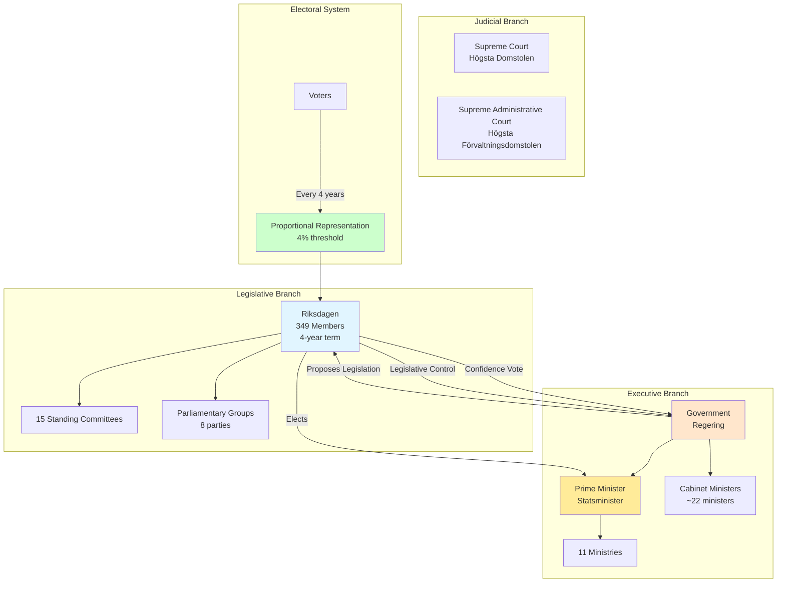
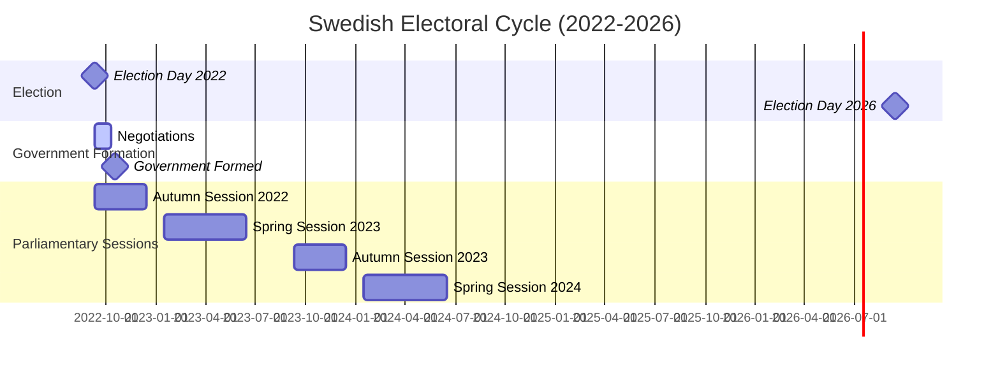
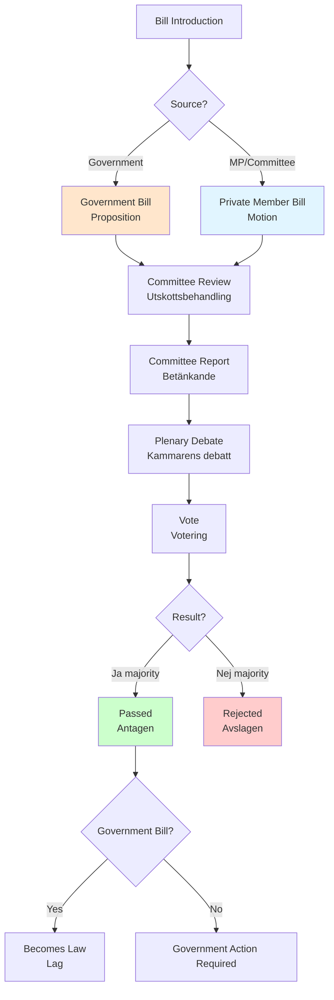
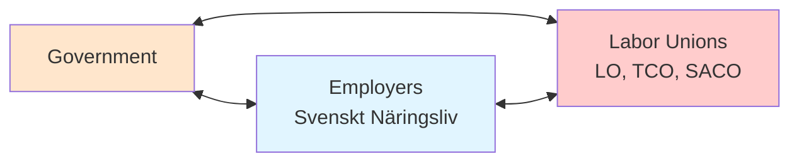

# Swedish Political System Skill

## Purpose

This skill provides comprehensive knowledge of the Swedish political system, parliamentary procedures, party dynamics, electoral mechanisms, and coalition formation patterns essential for intelligence analysis in the CIA platform. It enables accurate interpretation of political data, proper contextualization of voting patterns, and informed assessment of democratic accountability.

## When to Use This Skill

Apply this skill when:
- ✅ Analyzing voting patterns and parliamentary procedures
- ✅ Interpreting coalition dynamics and government formation
- ✅ Assessing party positions on the political spectrum
- ✅ Understanding committee structures and legislative processes
- ✅ Evaluating electoral system impacts on representation
- ✅ Contextualizing political events within Swedish democratic traditions
- ✅ Forecasting election outcomes and coalition scenarios

Do NOT use for:
- ❌ Other Nordic countries' political systems (Norway, Denmark, Finland differ significantly)
- ❌ EU-level politics (different institutional structures)
- ❌ Local/municipal politics (different rules and procedures)

## Swedish Political System Overview

### Constitutional Framework



**Key Constitutional Principles:**
1. **Popular Sovereignty** - All public power derives from the people
2. **Parliamentary System** - Government must have Riksdag confidence
3. **Public Access Principle** (*Offentlighetsprincipen*) - Transparency of government documents
4. **Proportional Representation** - Electoral system ensures party representation

## The Riksdag (Swedish Parliament)

### Structure and Composition

**Key Facts:**
- **Members:** 349 MPs (*riksdagsledamöter*)
- **Electoral Cycle:** Every 4 years (September, Sunday closest to 2nd week)
- **Last Election:** September 11, 2022
- **Next Election:** September 2026
- **Seat Allocation:** 310 constituency seats + 39 leveling seats
- **Electoral Threshold:** 4% nationally OR 12% in one constituency

**Current Parliamentary Composition (2022-2026):**

```sql
-- Query current Riksdag composition from CIA platform
SELECT 
    party,
    COUNT(DISTINCT person_id) as seat_count,
    ROUND(100.0 * COUNT(DISTINCT person_id) / 349, 2) as percentage,
    CASE 
        WHEN party IN ('M', 'KD', 'L') THEN 'Center-Right Coalition'
        WHEN party = 'SD' THEN 'External Support'
        WHEN party IN ('S', 'V', 'MP') THEN 'Left Opposition'
        WHEN party = 'C' THEN 'Unaligned'
    END as bloc
FROM assignment_data
WHERE role_code = 'Riksdagsledamot'
    AND from_date <= CURRENT_DATE
    AND (to_date IS NULL OR to_date >= CURRENT_DATE)
GROUP BY party
ORDER BY COUNT(DISTINCT person_id) DESC;
```

**Expected Output:**

| Party | Seats | % | Bloc | Full Name | Ideology |
|-------|-------|---|------|-----------|----------|
| S | 107 | 30.7% | Left Opposition | Socialdemokraterna<br/>(Social Democrats) | Social democracy, welfare state |
| M | 68 | 19.5% | Center-Right | Moderaterna<br/>(Moderates) | Liberal conservatism, free market |
| SD | 73 | 20.9% | External Support | Sverigedemokraterna<br/>(Sweden Democrats) | National conservatism, immigration restrictive |
| C | 24 | 6.9% | Unaligned | Centerpartiet<br/>(Center Party) | Agrarian liberalism, decentralization |
| V | 24 | 6.9% | Left Opposition | Vänsterpartiet<br/>(Left Party) | Democratic socialism, feminism |
| KD | 19 | 5.4% | Center-Right | Kristdemokraterna<br/>(Christian Democrats) | Christian democracy, social conservatism |
| L | 16 | 4.6% | Center-Right | Liberalerna<br/>(Liberals) | Social liberalism, individualism |
| MP | 18 | 5.2% | Left Opposition | Miljöpartiet<br/>(Green Party) | Green politics, environmentalism |

### The 8 Parliamentary Parties

#### 1. Socialdemokraterna (S) - Social Democrats

**Founded:** 1889  
**Ideology:** Social democracy, democratic socialism  
**Historical Role:** Dominant party 1932-2006 (except 1976-1982, 1991-1994)  
**Core Policies:**
- Strong welfare state and universal benefits
- Labor rights and union cooperation (*Swedish model*)
- Public sector investment in healthcare, education
- Progressive taxation

**Electoral Performance (Recent):**
```sql
SELECT 
    election_year,
    percentage,
    parliament_seats,
    percentage - LAG(percentage) OVER (ORDER BY election_year) as vote_change
FROM sweden_political_party
WHERE party_name = 'Socialdemokraterna'
    AND election_year >= 2006
ORDER BY election_year;
```

| Year | Vote % | Seats | Change |
|------|--------|-------|--------|
| 2006 | 35.0% | 130 | -4.6% |
| 2010 | 30.7% | 112 | -4.3% |
| 2014 | 31.0% | 113 | +0.3% |
| 2018 | 28.3% | 100 | -2.7% |
| 2022 | 30.3% | 107 | +2.0% |

**Coalition Patterns:**
- Historically governed alone or with V, MP
- 2014-2022: Minority government with MP (backed by V, C, L)
- Challenges: Declining support, fragmented left bloc

#### 2. Moderaterna (M) - Moderates

**Founded:** 1904 (as Allmänna valmansförbundet)  
**Ideology:** Liberal conservatism, fiscal conservatism  
**Historical Role:** Main opposition party, led center-right governments 2006-2014  
**Core Policies:**
- Tax cuts and reduced public spending
- School choice and private sector healthcare
- Law and order, tough on crime
- Pro-business, labor market flexibility

**Electoral Trend:**
```sql
SELECT 
    election_year,
    percentage,
    parliament_seats
FROM sweden_political_party
WHERE party_name = 'Moderaterna'
    AND election_year >= 2006
ORDER BY election_year;
```

**Coalition Patterns:**
- 2006-2014: Led Alliance (*Allians för Sverige*) with KD, C, L (majority 2006-2010, minority 2010-2014)
- 2022-: Prime Minister from M, coalition with KD, L, external SD support

#### 3. Sverigedemokraterna (SD) - Sweden Democrats

**Founded:** 1988 (roots in nationalist movements)  
**Ideology:** National conservatism, right-wing populism  
**Historical Role:** Parliamentary breakthrough 2010, kingmaker 2018-  
**Core Policies:**
- Strict immigration controls and deportation
- Cultural assimilation requirements
- Law and order, increased police funding
- EU-skepticism, Swedish sovereignty

**Electoral Growth:**
```sql
SELECT 
    election_year,
    percentage,
    parliament_seats,
    percentage - LAG(percentage) OVER (ORDER BY election_year) as vote_growth
FROM sweden_political_party
WHERE party_name = 'Sverigedemokraterna'
    AND election_year >= 2010
ORDER BY election_year;
```

| Year | Vote % | Seats | Growth |
|------|--------|-------|--------|
| 2010 | 5.7% | 20 | NEW |
| 2014 | 12.9% | 49 | +7.2% |
| 2018 | 17.5% | 62 | +4.6% |
| 2022 | 20.5% | 73 | +3.0% |

**Strategic Position:**
- No party willing to form coalition with SD (2010-2018)
- 2022: M accepts SD external support, makes SD kingmaker
- Influence without cabinet positions

#### 4. Centerpartiet (C) - Center Party

**Founded:** 1913 (as Bondeförbundet - Farmers' League)  
**Ideology:** Agrarian liberalism, rural interests  
**Core Policies:**
- Rural development and decentralization
- Environmental protection with economic growth
- Small business support
- EU-membership support

**Coalition Patterns:**
- Part of Alliance 2006-2019
- 2019: Left Alliance, refused to cooperate with SD
- 2022: No bloc alignment, swing party position

#### 5. Vänsterpartiet (V) - Left Party

**Founded:** 1917 (as Sveriges Kommunistiska Parti)  
**Ideology:** Democratic socialism, feminism  
**Core Policies:**
- Wealth redistribution, higher taxes on rich
- Public ownership of key sectors
- Generous welfare expansion
- Pro-labor union, workers' rights

**Coalition Patterns:**
- Never in government (only support agreements)
- 2014-2021: Supported S-MP government
- 2021: Withdrew support over rent deregulation

#### 6. Kristdemokraterna (KD) - Christian Democrats

**Founded:** 1964  
**Ideology:** Christian democracy, social conservatism  
**Core Policies:**
- Traditional family values
- Religious freedom
- Law and order
- Tax benefits for families

**Coalition Patterns:**
- Part of Alliance 2006-2019
- 2022: Coalition government with M, L

#### 7. Liberalerna (L) - Liberals

**Founded:** 1934 (as Folkpartiet)  
**Ideology:** Social liberalism, secularism  
**Core Policies:**
- Education quality and teacher authority
- Integration with Swedish language requirements
- Gender equality and LGBTQ+ rights
- Pro-EU, internationalism

**Electoral Challenges:**
- Declined from 7.1% (2010) to 4.6% (2022)
- Barely above 4% threshold (existential risk)

**Coalition Patterns:**
- Part of Alliance 2006-2019
- 2022: Coalition government with M, KD
- Tension: Social liberal values vs. SD cooperation

#### 8. Miljöpartiet (MP) - Green Party

**Founded:** 1981  
**Ideology:** Green politics, environmentalism  
**Core Policies:**
- Climate action and renewable energy
- Nuclear phase-out
- Sustainable transport
- Animal rights and organic farming

**Coalition Patterns:**
- 2014-2021: Junior partner in government with S
- 2021-2022: Continued cooperation but not in government
- Electoral volatility: 7.3% (2014) to 5.1% (2022)

## Electoral System

### Proportional Representation with Modified Sainte-Laguë

**Allocation Formula:**
```python
def allocate_seats(votes_per_party, total_seats=349):
    """
    Modified Sainte-Laguë method used in Swedish elections
    """
    seats_allocated = {party: 0 for party in votes_per_party}
    
    # Apply 4% threshold
    total_votes = sum(votes_per_party.values())
    qualified_parties = {
        party: votes for party, votes in votes_per_party.items()
        if votes / total_votes >= 0.04
    }
    
    for seat in range(total_seats):
        # Calculate quotient for each party
        quotients = {}
        for party, votes in qualified_parties.items():
            divisor = 1.4 if seats_allocated[party] == 0 else (2 * seats_allocated[party] + 1)
            quotients[party] = votes / divisor
        
        # Award seat to party with highest quotient
        winning_party = max(quotients, key=quotients.get)
        seats_allocated[winning_party] += 1
    
    return seats_allocated
```

**Seat Allocation:**
- **310 Constituency Seats:** Divided among 29 electoral constituencies
- **39 Leveling Seats:** Ensure overall proportionality at national level

**4% Threshold Rule:**
- Party must receive 4% nationally OR 12% in at least one constituency
- Prevents extreme fragmentation
- Currently: L (4.6%) and KD (5.4%) are vulnerable

### Electoral Calendar



## Government Formation Process

### Negative Parliamentarism

**Key Principle:** Prime Minister does not need majority support, only must NOT have majority AGAINST.

**Process:**
1. **Speaker Consultation** (*Talmannen*): Consults all party leaders
2. **Speaker Nomination**: Proposes PM candidate
3. **Riksdag Vote**: Simple vote (not debate)
4. **Result:**
   - If <175 MPs vote NO → PM approved
   - If ≥175 MPs vote NO → Nomination rejected, repeat process

**Example: 2022 Government Formation**

```sql
-- Simulate 2022 PM vote scenarios
WITH party_seats AS (
    SELECT 
        'M' as party, 68 as seats, 'Coalition' as position
    UNION ALL SELECT 'KD', 19, 'Coalition'
    UNION ALL SELECT 'L', 16, 'Coalition'
    UNION ALL SELECT 'SD', 73, 'External Support'
    UNION ALL SELECT 'S', 107, 'Opposition'
    UNION ALL SELECT 'V', 24, 'Opposition'
    UNION ALL SELECT 'MP', 18, 'Opposition'
    UNION ALL SELECT 'C', 24, 'Abstain'
),
vote_scenarios AS (
    SELECT 
        'Ulf Kristersson (M)' as candidate,
        SUM(CASE WHEN position = 'Opposition' THEN seats ELSE 0 END) as votes_against,
        SUM(CASE WHEN position IN ('Coalition', 'External Support') THEN seats ELSE 0 END) as votes_for,
        SUM(CASE WHEN position = 'Abstain' THEN seats ELSE 0 END) as abstentions
    FROM party_seats
)
SELECT 
    candidate,
    votes_against,
    votes_for,
    abstentions,
    CASE 
        WHEN votes_against >= 175 THEN '❌ REJECTED'
        ELSE '✅ APPROVED'
    END as result
FROM vote_scenarios;
```

**Result:**
- Votes AGAINST: 149 (S, V, MP)
- Votes FOR: 176 (M, KD, L, SD)
- Abstentions: 24 (C)
- **Outcome:** ✅ APPROVED (Only 149 against, needs 175 to block)

### Coalition Formation Patterns

**Historical Coalitions (1970-present):**

```sql
-- Map historical government coalitions
SELECT 
    government_period,
    prime_minister,
    coalition_parties,
    total_seats,
    type
FROM (
    VALUES 
        ('2022-', 'Ulf Kristersson', 'M-KD-L', 103, 'Minority (SD support)'),
        ('2021-2022', 'Magdalena Andersson', 'S', 100, 'Minority'),
        ('2014-2021', 'Stefan Löfven', 'S-MP', 116, 'Minority'),
        ('2014', 'Stefan Löfven', 'S-MP', 138, 'Minority'),
        ('2010-2014', 'Fredrik Reinfeldt', 'M-C-L-KD', 173, 'Minority'),
        ('2006-2010', 'Fredrik Reinfeldt', 'M-C-L-KD', 178, 'Majority'),
        ('1994-2006', 'Göran Persson', 'S', 131-161, 'Minority'),
        ('1991-1994', 'Carl Bildt', 'M-C-L-KD', 170, 'Minority')
) AS coalitions(government_period, prime_minister, coalition_parties, total_seats, type);
```

**Coalition Viability Matrix (2022):**

| Coalition | Parties | Seats | Viable? | Obstacle |
|-----------|---------|-------|---------|----------|
| Center-Right + SD | M-KD-L-SD | 176 | ✅ YES | L uncomfortable with SD |
| Center-Right Minority | M-KD-L | 103 | ✅ YES | Requires SD external support |
| Left Bloc | S-V-MP | 149 | ❌ NO | Only 149 seats, needs 175 to block PM |
| Grand Coalition | S-M | 175 | ❌ NO | Politically impossible (polar opposites) |
| Sweden Democrat-led | SD-M-KD | 160 | ❌ NO | M refuses SD PM |

## Parliamentary Procedures

### Legislative Process



### 15 Standing Committees (*Utskott*)

**Committee Structure:**

| Committee | Swedish Name | Members | Policy Area |
|-----------|--------------|---------|-------------|
| 1. Constitutional | Konstitutionsutskottet (KU) | 17 | Constitutional law, media |
| 2. Finance | Finansutskottet (FiU) | 17 | Budget, taxation |
| 3. Taxation | Skatteutskottet (SkU) | 17 | Tax policy |
| 4. Justice | Justitieutskottet (JuU) | 17 | Criminal law, courts |
| 5. Foreign Affairs | Utrikesutskottet (UU) | 17 | Foreign policy, EU |
| 6. Defense | Försvarsutskottet (FöU) | 17 | Military, national security |
| 7. Social Insurance | Socialförsäkringsutskottet (SfU) | 17 | Social security, pensions |
| 8. Health & Welfare | Socialutskottet (SoU) | 17 | Healthcare, social services |
| 9. Cultural Affairs | Kulturutskottet (KrU) | 17 | Culture, media, sports |
| 10. Education | Utbildningsutskottet (UbU) | 17 | Schools, universities |
| 11. Traffic | Trafikutskottet (TU) | 17 | Transport, infrastructure |
| 12. Environment & Agriculture | Miljö- och jordbruksutskottet (MJU) | 17 | Environment, farming |
| 13. Civil Affairs | Civilutskottet (CU) | 17 | Housing, consumer affairs |
| 14. Labor Market | Arbetsmarknadsutskottet (AU) | 17 | Employment, labor law |
| 15. EU Affairs | EU-nämnden (EU) | 17 | EU legislation coordination |

**Committee Assignment Analysis:**

```sql
-- Analyze committee membership distribution
SELECT 
    c.committee_name,
    COUNT(DISTINCT ca.person_id) as total_members,
    STRING_AGG(DISTINCT ca.party, ', ' ORDER BY ca.party) as party_distribution
FROM committee_assignment ca
JOIN committee c ON ca.committee_id = c.committee_id
WHERE ca.from_date <= CURRENT_DATE
    AND (ca.to_date IS NULL OR ca.to_date >= CURRENT_DATE)
GROUP BY c.committee_name
ORDER BY c.committee_name;
```

### Voting Procedures

**Vote Types:**
1. **Voice Vote** (*Acklamation*): Uncontroversial, no recording
2. **Standing Vote** (*Uppresning*): MPs stand for YES/NO, recorded
3. **Roll Call Vote** (*Votering*): Individual votes recorded electronically

**Vote Recording in CIA Platform:**

```sql
-- Analyze voting patterns by type
SELECT 
    vote,
    COUNT(*) as vote_count,
    ROUND(100.0 * COUNT(*) / SUM(COUNT(*)) OVER (), 2) as percentage
FROM vote_data
WHERE vote_date >= CURRENT_DATE - INTERVAL '12 months'
GROUP BY vote
ORDER BY vote_count DESC;
```

**Expected Distribution:**
- **Ja** (Yes): ~35-40%
- **Nej** (No): ~25-30%
- **Frånvarande** (Absent): ~30-35%
- **Avstår** (Abstain): ~3-5%

## Political Culture & Norms

### Consensus-Seeking (*Konsensussökande*)

**Characteristics:**
- Preference for broad agreements over narrow victories
- Committee work emphasizes consensus reports
- Government often consults opposition before major decisions

**Remiss System** (*Remissförfarande*):
- Government proposals sent to stakeholders for comment
- Labor unions, employer organizations, NGOs provide input
- Builds broad support before legislation

### Corporatism & Social Partners

**The Swedish Model** (*Den svenska modellen*):


**Key Organizations:**
- **LO** (Landsorganisationen): Blue-collar unions, 1.3M members, close to S
- **TCO** (Tjänstemännens Centralorganisation): White-collar unions, 1.1M members
- **SACO** (Sveriges Akademikers Centralorganisation): Professional unions, 700K members
- **Svenskt Näringsliv**: Employers' confederation

### Parliamentary Decorum

**Formal Address:**
- MPs address "Mr./Madam Speaker" (*Herr/Fru Talman*)
- Never address each other directly in debate
- Third-person references ("The representative from Stockholm...")

**Question Time:**
- Weekly interpellations (*Interpellationsdebatt*)
- Ministers must respond to parliamentary questions
- Recorded and published in CIA platform `document_element` table

## ISMS Compliance Mapping

### ISO 27001:2022 Controls

**A.5.10 - Acceptable Use of Information**
- Parliamentary data used for democratic accountability purposes
- Proper attribution of political statements and voting records

**A.5.33 - Protection of Records**
- Historical parliamentary records maintained with integrity
- Electoral data preserved for long-term analysis

### NIST CSF 2.0 Functions

**IDENTIFY (ID)**
- ID.AM-2: Software platforms and applications inventoried
  - Riksdagen API as critical data source for political intelligence

**GOVERN (GV)**
- GV.PO-1: Policy and procedures address all stakeholders
  - Parliamentary transparency principles guide data collection

### CIS Controls v8.1

**CIS Control 1: Inventory and Control of Enterprise Assets**
- 1.1: Establish and maintain detailed enterprise asset inventory
  - 349 MPs, 8 parties, 15 committees tracked in CIA platform

**CIS Control 3: Data Protection**
- 3.2: Establish and maintain data inventory
  - Electoral data, voting records, parliamentary documents cataloged

## Hack23 ISMS Policy References

**Information Security Policy**
- Link: https://github.com/Hack23/ISMS-PUBLIC/blob/main/Information_Security_Policy.md
- Application: Parliamentary data classified as PUBLIC per Swedish law

**Data Classification Policy**
- Link: https://github.com/Hack23/ISMS-PUBLIC/blob/main/Data_Classification_Policy.md
- Application: All Riksdagen data is PUBLIC under Offentlighetsprincipen

**Privacy Policy**
- Link: https://github.com/Hack23/ISMS-PUBLIC/blob/main/Privacy_Policy.md
- Application: MP data limited to official capacity, not personal life

## References

**Official Documentation:**
- Riksdagen: https://www.riksdagen.se/
- Constitution: https://www.riksdagen.se/en/how-the-riksdag-works/democracy/the-constitution/
- Electoral System: https://www.val.se/
- Parliamentary Procedures: https://www.riksdagen.se/en/how-the-riksdag-works/

**CIA Platform Documentation:**
- Data Analysis: [DATA_ANALYSIS_INTOP_OSINT.md](../../DATA_ANALYSIS_INTOP_OSINT.md)
- Database Views: [DATABASE_VIEW_INTELLIGENCE_CATALOG.md](../../DATABASE_VIEW_INTELLIGENCE_CATALOG.md)
- Risk Rules: [RISK_RULES_INTOP_OSINT.md](../../RISK_RULES_INTOP_OSINT.md)

**Academic Sources:**
- "The Swedish Parliamentary System" - Sveriges Riksdag
- "Government and Politics in the Nordic Countries" - Nordic Council of Ministers
- "Parties and Party Systems in Sweden" - Göran Bergström
