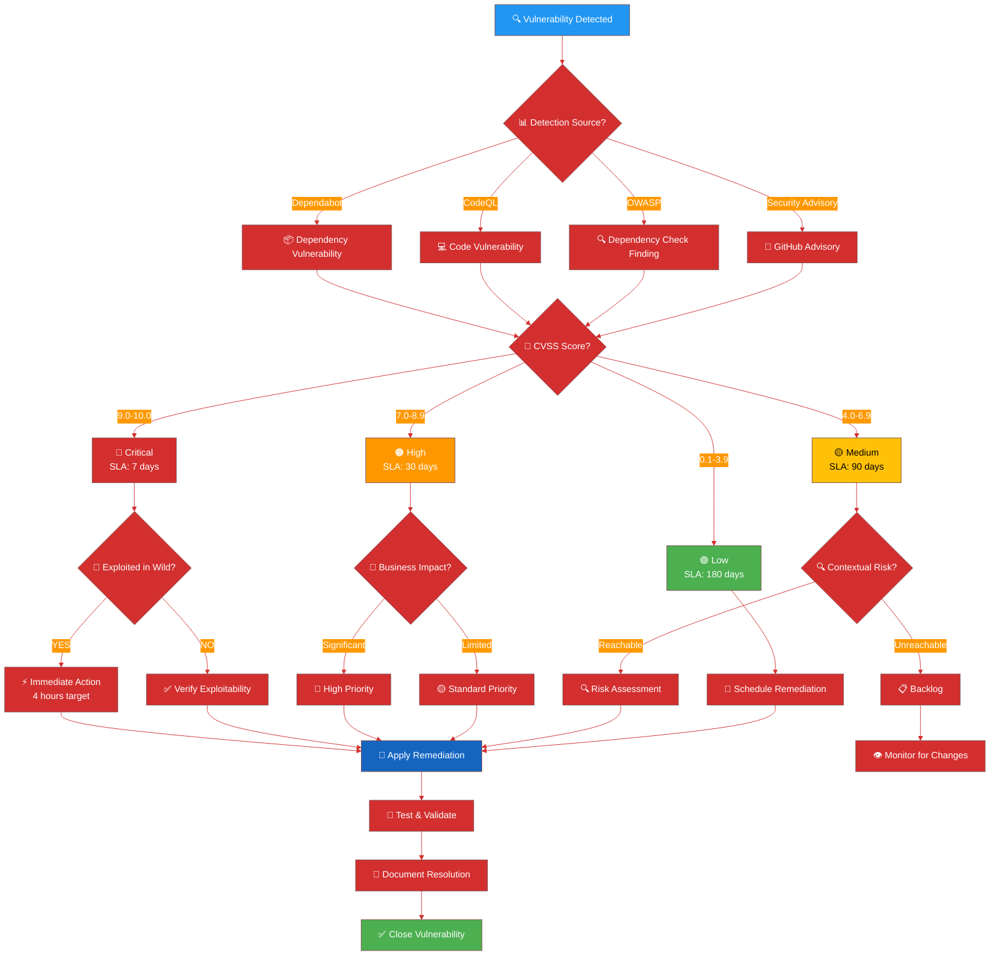
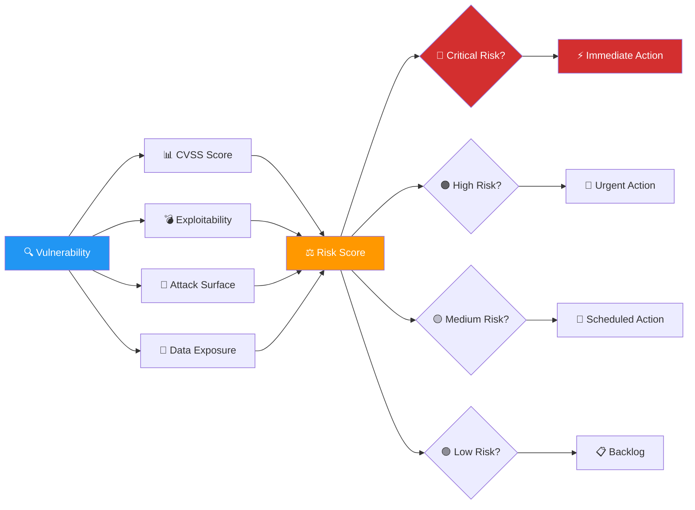

# Vulnerability Management Skill

## Purpose

This skill provides systematic procedures for proactive vulnerability discovery, intelligent remediation, and transparent security communication across the CIA platform. It implements Hack23's bleeding-edge dependency management strategy with automated testing, security validation, and measurable outcomes aligned with business impact.

## When to Use This Skill

Apply this skill when:
- ✅ Analyzing Dependabot pull requests for dependency updates
- ✅ Responding to GitHub Security Advisories or CodeQL alerts
- ✅ Triaging OWASP Dependency Check findings
- ✅ Prioritizing vulnerability remediation across repositories
- ✅ Managing SLA compliance for vulnerability fixes
- ✅ Conducting security audits or compliance assessments
- ✅ Implementing security patches for critical vulnerabilities
- ✅ Tracking end-of-life (EOL) dependencies and runtimes

Do NOT use for:
- ❌ General code quality issues (use code-quality-checks skill)
- ❌ Feature development (different concern)
- ❌ Performance optimization (use performance-engineer agent)

## Decision Tree



## CVSS v3.1 Severity Classification

### Severity Scoring Matrix

**CVSS v3.1 Base Score Calculation:**

| **Severity** | **CVSS Score** | **Business Impact** | **SLA** | **Escalation** |
|--------------|----------------|---------------------|---------|----------------|
| **🔴 Critical** | 9.0 - 10.0 | €10K+ daily loss | **7 days** | CEO immediate |
| **🟠 High** | 7.0 - 8.9 | €5-10K daily loss | **30 days** | CEO within 1 day |
| **🟡 Medium** | 4.0 - 6.9 | €1-5K daily loss | **90 days** | Weekly review |
| **🟢 Low** | 0.1 - 3.9 | <€1K daily loss | **180 days** | Monthly review |

### CVSS Vector Analysis

**Key CVSS Metrics to Evaluate:**

```yaml
Attack_Vector (AV):
  - Network (N): Remotely exploitable = Higher severity
  - Adjacent (A): Local network required = Medium severity
  - Local (L): Local access required = Lower severity
  - Physical (P): Physical access required = Lowest severity

Attack_Complexity (AC):
  - Low (L): Easy to exploit = Higher severity
  - High (H): Difficult to exploit = Lower severity

Privileges_Required (PR):
  - None (N): No authentication = Highest severity
  - Low (L): Basic user privileges = Medium severity
  - High (H): Admin privileges = Lower severity

User_Interaction (UI):
  - None (N): No user action required = Higher severity
  - Required (R): User must take action = Lower severity

Scope (S):
  - Changed (C): Impacts beyond vulnerable component = Higher severity
  - Unchanged (U): Impact limited to component = Lower severity

Confidentiality_Impact (C):
  - High (H): Total information disclosure = Highest severity
  - Low (L): Limited disclosure = Medium severity
  - None (N): No confidentiality impact = Lowest severity

Integrity_Impact (I):
  - High (H): Complete data modification = Highest severity
  - Low (L): Limited modification = Medium severity
  - None (N): No integrity impact = Lowest severity

Availability_Impact (A):
  - High (H): Complete system unavailability = Highest severity
  - Low (L): Reduced performance = Medium severity
  - None (N): No availability impact = Lowest severity
```

**Example CVSS Vector:**
```
CVSS:3.1/AV:N/AC:L/PR:N/UI:N/S:C/C:H/I:H/A:H
Base Score: 10.0 (Critical)
Interpretation: Remotely exploitable, easy to exploit, no authentication,
               scope change, high impact to confidentiality/integrity/availability
```

## Vulnerability Lifecycle Management

### Phase 1: Discovery

**Automated Detection Sources:**

```yaml
GitHub_Dependabot:
  - Frequency: Real-time alerts
  - Coverage: npm, Maven, pip, Docker, GitHub Actions
  - Action: Auto-creates PR with fix
  - Integration: .github/dependabot.yml

GitHub_CodeQL:
  - Frequency: On push, PR, scheduled scan
  - Coverage: Java, JavaScript, Python code vulnerabilities
  - Action: Creates security alert
  - Integration: .github/workflows/codeql.yml

OWASP_Dependency_Check:
  - Frequency: Daily via CI/CD
  - Coverage: All Maven dependencies
  - Action: Fails build if critical found
  - Integration: pom.xml plugin configuration

GitHub_Security_Advisories:
  - Frequency: Real-time notifications
  - Coverage: All dependencies and platforms
  - Action: Email + dashboard alert
  - Integration: Repository settings

SonarCloud:
  - Frequency: On push, PR
  - Coverage: Code quality + security hotspots
  - Action: Quality gate failure
  - Integration: .github/workflows/verify-release.yml
```

**Manual Discovery Methods:**

- Security researcher disclosure (SECURITY.md)
- Penetration testing findings
- Third-party security audit
- Customer vulnerability report

### Phase 2: Assessment

**Contextual Risk Evaluation:**



**Assessment Checklist:**

- [ ] **CVSS Score:** Base score from NVD or GitHub Advisory
- [ ] **Exploitability:** POC available? Exploited in wild?
- [ ] **Attack Surface:** Is vulnerable component reachable?
- [ ] **Data Classification:** What data class does component handle?
- [ ] **Business Impact:** Revenue/operations/reputation impact?
- [ ] **Fix Availability:** Patch available? Workaround possible?
- [ ] **Blast Radius:** How many systems affected?
- [ ] **Regulatory Impact:** GDPR/NIS2/SOC2 implications?

### Phase 3: Remediation

**Remediation Strategies:**

```yaml
Patch_Update:
  - Action: Apply vendor security patch
  - Priority: Preferred solution
  - Risk: Low (tested by vendor)
  - Example: "Update Spring Boot 2.7.5 → 2.7.18"

Version_Upgrade:
  - Action: Upgrade to non-vulnerable version
  - Priority: Standard approach
  - Risk: Medium (breaking changes possible)
  - Example: "Upgrade Vaadin 14.x → 23.x"

Configuration_Change:
  - Action: Disable vulnerable feature
  - Priority: Quick mitigation
  - Risk: Low (functionality may be reduced)
  - Example: "Disable XML external entity processing"

Virtual_Patch:
  - Action: WAF rule or network control
  - Priority: Temporary mitigation
  - Risk: Medium (bypass possible)
  - Example: "Block exploit pattern in AWS WAF"

Replace_Component:
  - Action: Switch to alternative library
  - Priority: Last resort
  - Risk: High (significant refactoring)
  - Example: "Replace Log4j with Logback"

Accept_Risk:
  - Action: Document risk acceptance
  - Priority: Only with CEO approval
  - Risk: Varies (requires monitoring)
  - Example: "Low CVSS + unreachable code + no fix available"
```

**Remediation Workflow:**

```bash
# 1. Create remediation branch
git checkout -b security/CVE-2024-XXXXX-remediation
git pull origin main

# 2. Apply fix (example: dependency update)
# Edit pom.xml or use Maven versions plugin
mvn versions:use-latest-versions -Dincludes=org.springframework:spring-core

# 3. Build and test
mvn clean install
mvn test
mvn verify

# 4. Security validation
mvn dependency-check:check
# Review report: target/dependency-check-report.html

# 5. Commit with security context
git add pom.xml
git commit -m "security: fix CVE-2024-XXXXX in Spring Core

- Update Spring Core 5.3.20 → 5.3.30
- CVSS Score: 9.8 (Critical)
- Vulnerability: Remote Code Execution
- Fixes: https://github.com/advisories/GHSA-xxxx-xxxx-xxxx
- Tested: All unit tests pass, security scan clean

Refs: #1234"

# 6. Push and create PR
git push origin security/CVE-2024-XXXXX-remediation
gh pr create --title "Security: Fix CVE-2024-XXXXX" \
  --body "Fixes critical vulnerability in Spring Core" \
  --label "security,priority:critical"
```

### Phase 4: Verification

**Verification Checklist:**

```markdown
## Security Fix Verification

- [ ] **Vulnerability Resolved:** Confirmed by security scanner
- [ ] **No New Vulnerabilities:** Dependency check clean
- [ ] **Unit Tests Pass:** `mvn test` successful
- [ ] **Integration Tests Pass:** `mvn verify` successful
- [ ] **Security Tests Pass:** CodeQL analysis clean
- [ ] **Performance Impact:** No degradation observed
- [ ] **Compatibility Check:** No breaking changes introduced
- [ ] **Documentation Updated:** CHANGELOG.md updated
- [ ] **Security Advisory Reviewed:** GitHub advisory closed

**Evidence:**
- Dependency Check Report: target/dependency-check-report.html
- CodeQL Scan: Clean (0 alerts)
- Test Coverage: 82% (maintained)
- Build Status: ✅ Success
```

**Automated Verification:**

```yaml
# .github/workflows/security-verification.yml
name: Security Verification

on:
  pull_request:
    branches: [ main ]
    labels: [ security ]

jobs:
  verify-security-fix:
    runs-on: ubuntu-latest
    steps:
      - uses: actions/checkout@11bd71901bbe5b1630ceea73d27597364c9af683 # v4.2.2
      
      - name: Set up JDK 21
        uses: actions/setup-java@8df1039502a15bceb9433410b1a100fbe190c53b # v4.5.0
        with:
          java-version: '21'
          distribution: 'temurin'
      
      - name: Run OWASP Dependency Check
        run: mvn dependency-check:check -P dependency-check
      
      - name: Check for vulnerabilities
        run: |
          if grep -q "Critical" target/dependency-check-report.html; then
            echo "❌ Critical vulnerabilities still present"
            exit 1
          fi
          echo "✅ No critical vulnerabilities detected"
      
      - name: Run security tests
        run: mvn test -Dsecurity.test=true
      
      - name: Upload verification report
        uses: actions/upload-artifact@ea165860e890e4c0d99e2a7e241d52ce9fdf0b90 # v4.5.0
        with:
          name: security-verification-report
          path: target/dependency-check-report.html
```

### Phase 5: Closure

**Closure Criteria:**

1. ✅ Fix deployed to production
2. ✅ Vulnerability scanner confirms resolution
3. ✅ GitHub Security Advisory dismissed or closed
4. ✅ Documentation updated (CHANGELOG.md)
5. ✅ Stakeholders notified
6. ✅ Lessons learned documented

**Closure Documentation:**

```markdown
# Vulnerability CVE-2024-XXXXX - Closure Report

## Summary
- **Vulnerability ID:** CVE-2024-XXXXX
- **Severity:** Critical (CVSS 9.8)
- **Component:** Spring Core 5.3.20
- **Detected:** 2024-01-15
- **Resolved:** 2024-01-16
- **SLA:** 7 days (Met: 1 day)

## Resolution
- **Action:** Version upgrade
- **Fix:** Spring Core 5.3.20 → 5.3.30
- **PR:** #1234
- **Deployment:** 2024-01-16 14:30 UTC

## Verification
- ✅ OWASP Dependency Check: Clean
- ✅ CodeQL Scan: No alerts
- ✅ Unit Tests: 100% pass
- ✅ Integration Tests: 100% pass
- ✅ Security Regression Tests: Pass

## Lessons Learned
- **Detection:** Dependabot alert received within 2 hours
- **Triage:** Severity confirmed in 30 minutes
- **Fix:** Patch applied in 4 hours
- **Deployment:** Production rollout in 24 hours
- **Improvement:** Consider auto-merge for patch-level security updates

## References
- GitHub Advisory: https://github.com/advisories/GHSA-xxxx-xxxx-xxxx
- NVD Entry: https://nvd.nist.gov/vuln/detail/CVE-2024-XXXXX
- Spring Security Advisory: https://spring.io/security/cve-2024-xxxxx
```

## SLA Tracking and Escalation

### SLA Monitoring

**Automated SLA Tracking:**

```yaml
# .github/workflows/vulnerability-sla-monitoring.yml
name: Vulnerability SLA Monitoring

on:
  schedule:
    - cron: '0 9 * * *' # Daily at 9 AM UTC
  workflow_dispatch:

jobs:
  check-sla:
    runs-on: ubuntu-latest
    steps:
      - name: Check Dependabot Alerts
        uses: actions/github-script@60a0d83039c74a4aee543508d2ffcb1c3799cdea # v7.0.1
        with:
          script: |
            const { data: alerts } = await github.rest.dependabot.listAlertsForRepo({
              owner: context.repo.owner,
              repo: context.repo.repo,
              state: 'open'
            });
            
            const now = new Date();
            const criticalSLA = 7 * 24 * 60 * 60 * 1000; // 7 days
            const highSLA = 30 * 24 * 60 * 60 * 1000; // 30 days
            
            let breaches = [];
            
            for (const alert of alerts) {
              const createdAt = new Date(alert.created_at);
              const age = now - createdAt;
              const severity = alert.security_advisory.severity;
              
              if (severity === 'critical' && age > criticalSLA) {
                breaches.push(`CRITICAL SLA BREACH: ${alert.security_advisory.cve_id}`);
              } else if (severity === 'high' && age > highSLA) {
                breaches.push(`HIGH SLA BREACH: ${alert.security_advisory.cve_id}`);
              }
            }
            
            if (breaches.length > 0) {
              core.setFailed(`SLA Breaches Detected:\n${breaches.join('\n')}`);
              // Trigger notification (Slack, email, etc.)
            }
```

### Escalation Procedures

**Escalation Matrix:**

| **Severity** | **Age Threshold** | **Escalation Level** | **Action** |
|--------------|-------------------|----------------------|------------|
| Critical | 3 days (42% of SLA) | Level 1: Development Team | Daily standup review |
| Critical | 5 days (71% of SLA) | Level 2: Team Lead | Risk assessment required |
| Critical | 7 days (100% of SLA) | Level 3: CEO | Exception approval needed |
| High | 15 days (50% of SLA) | Level 1: Development Team | Weekly review |
| High | 25 days (83% of SLA) | Level 2: Team Lead | Remediation plan required |
| High | 30 days (100% of SLA) | Level 3: CEO | Exception approval needed |

**Escalation Template:**

```markdown
# SLA Escalation Notice

**To:** CEO / Security Team Lead
**From:** Automated SLA Monitor
**Date:** 2024-01-15
**Priority:** 🔴 URGENT

## SLA Breach Alert

**Vulnerability:** CVE-2024-XXXXX
**Severity:** Critical (CVSS 9.8)
**Component:** Spring Core 5.3.20
**Age:** 6 days (86% of 7-day SLA)
**Status:** In Progress

## Current Status
- PR #1234 created for remediation
- Blocked on: Integration test failures
- Estimated Resolution: 2024-01-16

## Required Action
- [ ] CEO acknowledgment
- [ ] Risk acceptance or remediation prioritization
- [ ] Resource allocation if needed

## Impact Assessment
- **Exploitability:** High (POC available)
- **Attack Surface:** Internet-facing API
- **Data at Risk:** Customer PII
- **Business Impact:** €15K/day potential loss

## Escalation History
- Day 3: Development team notified
- Day 5: Team lead engaged
- Day 6: CEO escalation (this notice)
```

## Exception Handling

### Risk Acceptance Process

**When to Accept Risk:**

- Fix not available from vendor
- Fix introduces breaking changes requiring major refactoring
- Vulnerable code path is unreachable
- Compensating controls adequately mitigate risk
- Business justification outweighs risk

**Risk Acceptance Template:**

```markdown
# Vulnerability Risk Acceptance

**Date:** 2024-01-15
**Valid Until:** 2024-04-15 (90 days max)
**Approved By:** CEO

## Vulnerability Details
- **CVE ID:** CVE-2024-XXXXX
- **Severity:** Medium (CVSS 5.5)
- **Component:** Apache Commons Text 1.9
- **Description:** Regular expression denial of service

## Risk Assessment
- **Exploitability:** Low (requires specific input pattern)
- **Attack Surface:** Internal admin API only (not public)
- **Data Impact:** None (no data exposure)
- **Business Impact:** Minimal (temporary performance degradation)

## Justification
- Vendor fix not yet available
- Component used only in internal admin tools
- Compensating controls: Input validation + rate limiting
- Monitoring: CloudWatch alarms on API latency

## Compensating Controls
1. ✅ Input validation regex pattern: `^[a-zA-Z0-9_-]{1,50}$`
2. ✅ API rate limiting: 10 requests/minute
3. ✅ Monitoring: CloudWatch alarm on p99 latency >500ms
4. ✅ WAF rule: Block suspicious patterns

## Review Schedule
- **Next Review:** 2024-02-15 (30 days)
- **Re-evaluation Trigger:** Vendor patch release
- **Maximum Duration:** 90 days from approval

## Approval
- **Approver:** James Pether Sörling, CEO
- **Date:** 2024-01-15
- **Signature:** [Digital signature or commit SHA]

**Tracking:** Documented in Risk Register, monitored monthly
```

## Integration with CIA Platform

### Dependabot Configuration

```yaml
# .github/dependabot.yml
version: 2
updates:
  - package-ecosystem: "maven"
    directory: "/"
    schedule:
      interval: "daily"
    open-pull-requests-limit: 10
    labels:
      - "dependencies"
      - "security"
    reviewers:
      - "hack23"
    commit-message:
      prefix: "security"
      include: "scope"
    
  - package-ecosystem: "github-actions"
    directory: "/"
    schedule:
      interval: "weekly"
    labels:
      - "github-actions"
      - "security"
    commit-message:
      prefix: "ci"
```

### OWASP Dependency Check Configuration

```xml
<!-- pom.xml -->
<plugin>
  <groupId>org.owasp</groupId>
  <artifactId>dependency-check-maven</artifactId>
  <version>10.0.4</version>
  <configuration>
    <failBuildOnCVSS>7</failBuildOnCVSS>
    <suppressionFiles>
      <suppressionFile>owasp-suppressions.xml</suppressionFile>
    </suppressionFiles>
    <nvdApiKey>${env.NVD_API_KEY}</nvdApiKey>
  </configuration>
  <executions>
    <execution>
      <goals>
        <goal>check</goal>
      </goals>
    </execution>
  </executions>
</plugin>
```

### CodeQL Configuration

```yaml
# .github/workflows/codeql.yml
name: "CodeQL"

on:
  push:
    branches: [ main ]
  pull_request:
    branches: [ main ]
  schedule:
    - cron: '0 6 * * 1' # Weekly Monday 6 AM

jobs:
  analyze:
    name: Analyze
    runs-on: ubuntu-latest
    permissions:
      security-events: write
      actions: read
      contents: read

    steps:
      - name: Checkout repository
        uses: actions/checkout@11bd71901bbe5b1630ceea73d27597364c9af683 # v4.2.2

      - name: Initialize CodeQL
        uses: github/codeql-action/init@48ab28a6f5dbc2a99bf1e0131198dd8f1df78169 # v3.28.0
        with:
          languages: java
          queries: security-extended

      - name: Build
        run: mvn clean compile -DskipTests

      - name: Perform CodeQL Analysis
        uses: github/codeql-action/analyze@48ab28a6f5dbc2a99bf1e0131198dd8f1df78169 # v3.28.0
```

## Compliance Mapping

### ISO 27001:2022

- **A.8.8** - Management of Technical Vulnerabilities
- **A.5.7** - Threat Intelligence
- **A.8.16** - Monitoring Activities

### NIST CSF 2.0

- **DE.CM-8** - Vulnerability scans are performed
- **RS.MA-1** - Incidents are contained
- **PR.DS-6** - Integrity checking mechanisms verify software integrity

### CIS Controls v8

- **Control 7** - Continuous Vulnerability Management
- **Control 7.1** - Establish and Maintain Vulnerability Management Process
- **Control 7.2** - Establish and Maintain Remediation Process
- **Control 7.3** - Perform Automated Operating System Patch Management
- **Control 7.4** - Perform Automated Application Patch Management
- **Control 7.5** - Perform Automated Vulnerability Scans

### OWASP Top 10 2021

- **A06:2021** - Vulnerable and Outdated Components
- **A08:2021** - Software and Data Integrity Failures

## References

- **Hack23 ISMS:** [Vulnerability Management Policy](https://github.com/Hack23/ISMS-PUBLIC/blob/main/Vulnerability_Management.md)
- **NIST SP 800-40r4:** Guide to Enterprise Patch Management Planning
- **OWASP Dependency Check:** https://owasp.org/www-project-dependency-check/
- **GitHub Security Advisories:** https://docs.github.com/en/code-security/security-advisories
- **NVD CVSS Calculator:** https://nvd.nist.gov/vuln-metrics/cvss/v3-calculator
- **CWE Top 25:** https://cwe.mitre.org/top25/

## Examples from CIA Platform

### Successful Vulnerability Remediation

**CVE-2023-20863 - Spring Expression DoS (CVSS 7.5)**

```bash
# 1. Detected by Dependabot
# Alert: https://github.com/Hack23/cia/security/dependabot/123

# 2. Assessment (30 minutes)
# Severity: High
# Component: spring-expression 5.3.25
# Impact: DoS possible via crafted SpEL expression
# Exploitability: Low (requires admin privileges)
# SLA: 30 days

# 3. Remediation (4 hours)
git checkout -b security/spring-expression-dos
mvn versions:set-property -Dproperty=spring.version -DnewVersion=5.3.27
mvn clean install
git commit -m "security: fix CVE-2023-20863 Spring Expression DoS"
git push origin security/spring-expression-dos

# 4. Verification
# - OWASP Dependency Check: Clean
# - All tests pass: 2,847 tests
# - CodeQL: No new alerts

# 5. Deployment
# Merged to main, deployed to production
# Total time: 1 day (well within 30-day SLA)
```

## Appendix: Tools and Resources

### Security Scanning Tools

```yaml
Tools_Used:
  Dependabot:
    Purpose: Automated dependency updates
    Coverage: Maven, npm, GitHub Actions
    Integration: GitHub native
    Cost: Free for public repos

  OWASP_Dependency_Check:
    Purpose: Known vulnerability detection
    Coverage: Maven dependencies
    Integration: Maven plugin
    Cost: Free

  CodeQL:
    Purpose: Code vulnerability scanning
    Coverage: Java, JavaScript, Python
    Integration: GitHub Actions
    Cost: Free for public repos

  SonarCloud:
    Purpose: Code quality + security hotspots
    Coverage: All source code
    Integration: GitHub Actions
    Cost: Free for public repos

  GitHub_Security_Advisories:
    Purpose: Vulnerability notifications
    Coverage: All dependencies
    Integration: GitHub native
    Cost: Free
```

### Useful Commands

```bash
# Check for vulnerabilities in Maven project
mvn dependency-check:check

# Update all dependencies to latest versions
mvn versions:use-latest-versions

# List outdated dependencies
mvn versions:display-dependency-updates

# Generate dependency tree
mvn dependency:tree

# Check for dependency conflicts
mvn dependency:analyze

# Run security-focused tests
mvn test -Dsecurity.test=true

# Generate SBOM (Software Bill of Materials)
mvn cyclonedx:makeAggregateBom
```

---

**Document Maintenance:**
- **Review Frequency:** Quarterly
- **Last Updated:** 2024-01-15
- **Next Review:** 2024-04-15
- **Owner:** Security Team / CIA Project Maintainers
