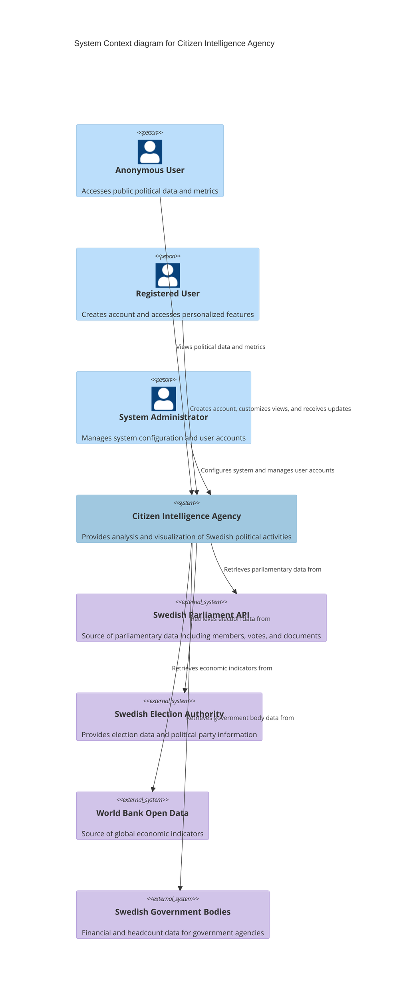
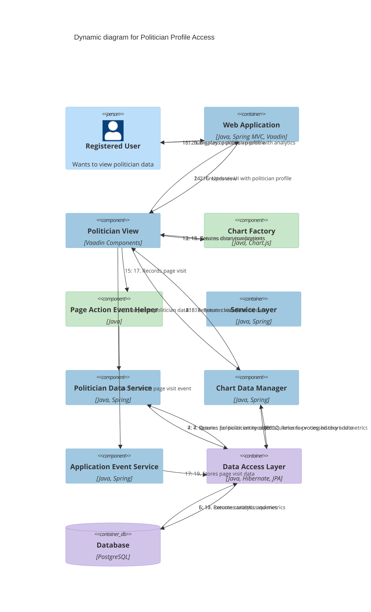

# 🏛️ Citizen Intelligence Agency Architecture

This document serves as the primary entry point for the Citizen Intelligence Agency's architectural documentation. It provides a comprehensive view of the system's design using the C4 model approach, starting from a high-level system context and drilling down to component interactions.

## 📚 Architecture Documentation Map

| Document                                            | Focus           | Description                               | Documentation Link                                                              |
| --------------------------------------------------- | --------------- | ----------------------------------------- | ------------------------------------------------------------------------------- |
| **[Architecture](ARCHITECTURE.md)**                 | 🏛️ Architecture | C4 model showing current system structure | [View Source](https://github.com/Hack23/cia/blob/master/ARCHITECTURE.md)         |
| **[Future Architecture](FUTURE_ARCHITECTURE.md)**   | 🏛️ Architecture | C4 model showing future system structure | [View Source](https://github.com/Hack23/cia/blob/master/FUTURE_ARCHITECTURE.md)         |
| **[Mindmaps](MINDMAP.md)**                          | 🧠 Concept      | Current system component relationships    | [View Source](https://github.com/Hack23/cia/blob/master/MINDMAP.md)             |
| **[Future Mindmaps](FUTURE_MINDMAP.md)**            | 🧠 Concept      | Future capability evolution               | [View Source](https://github.com/Hack23/cia/blob/master/FUTURE_MINDMAP.md)      |
| **[SWOT Analysis](SWOT.md)**                        | 💼 Business     | Current strategic assessment              | [View Source](https://github.com/Hack23/cia/blob/master/SWOT.md)                |
| **[Future SWOT Analysis](FUTURE_SWOT.md)**          | 💼 Business     | Future strategic opportunities            | [View Source](https://github.com/Hack23/cia/blob/master/FUTURE_SWOT.md)         |
| **[Data Model](DATA_MODEL.md)**                     | 📊 Data         | Current data structures and relationships | [View Source](https://github.com/Hack23/cia/blob/master/DATA_MODEL.md)          |
| **[Future Data Model](FUTURE_DATA_MODEL.md)**       | 📊 Data         | Enhanced political data architecture      | [View Source](https://github.com/Hack23/cia/blob/master/FUTURE_DATA_MODEL.md)   |
| **[Flowcharts](FLOWCHART.md)**                      | 🔄 Process      | Current data processing workflows         | [View Source](https://github.com/Hack23/cia/blob/master/FLOWCHART.md)           |
| **[Future Flowcharts](FUTURE_FLOWCHART.md)**        | 🔄 Process      | Enhanced AI-driven workflows              | [View Source](https://github.com/Hack23/cia/blob/master/FUTURE_FLOWCHART.md)    |
| **[State Diagrams](STATEDIAGRAM.md)**               | 🔄 Behavior     | Current system state transitions          | [View Source](https://github.com/Hack23/cia/blob/master/STATEDIAGRAM.md)        |
| **[Future State Diagrams](FUTURE_STATEDIAGRAM.md)** | 🔄 Behavior     | Enhanced adaptive state transitions       | [View Source](https://github.com/Hack23/cia/blob/master/FUTURE_STATEDIAGRAM.md) |
| **[CI/CD Workflows](WORKFLOWS.md)**                 | 🔧 DevOps       | Current automation processes              | [View Source](https://github.com/Hack23/cia/blob/master/WORKFLOWS.md)           |
| **[Future Workflows](FUTURE_WORKFLOWS.md)**         | 🔧 DevOps       | Enhanced CI/CD with ML                    | [View Source](https://github.com/Hack23/cia/blob/master/FUTURE_WORKFLOWS.md)    |
| **[End-of-Life Strategy](End-of-Life-Strategy.md)** | 📅 Lifecycle    | Maintenance and EOL planning              | [View Source](https://github.com/Hack23/cia/blob/master/End-of-Life-Strategy.md) |
| **[Financial Security Plan](FinancialSecurityPlan.md)** | 💰 Security | Cost and security implementation          | [View Source](https://github.com/Hack23/cia/blob/master/FinancialSecurityPlan.md) |
| **[ISMS Compliance Mapping](ISMS_COMPLIANCE_MAPPING.md)** | 🔐 ISMS | Comprehensive ISMS-PUBLIC policy mapping | [View Source](https://github.com/Hack23/cia/blob/master/ISMS_COMPLIANCE_MAPPING.md) |
| **[Security Architecture](SECURITY_ARCHITECTURE.md)** | 🛡️ Security | Complete security overview | [View Source](https://github.com/Hack23/cia/blob/master/SECURITY_ARCHITECTURE.md) |
| **[CIA Features](https://hack23.com/cia-features.html)** | 🚀 Features | Platform features overview                | [View on hack23.com](https://hack23.com/cia-features.html)                     |
| **[Threat Model](THREAT_MODEL.md)**                 | 🛡️ Security     | Platform threat analysis (STRIDE/MITRE)   | [View Source](https://github.com/Hack23/cia/blob/master/THREAT_MODEL.md)        |

## 🌐 C4 System Context Diagram

This diagram illustrates how different stakeholders interact with the Citizen Intelligence Agency system and the external data sources required for political intelligence analysis. For a conceptual overview of these relationships, see the [Mindmap](MINDMAP.md).

## 🏛️ C4 Container Diagram

This diagram reveals the modular construction of the application with distinct containers for the web application, service layer, data access, and external data integration. See [README.md - AWS Services Stack](README.md#-aws-services-stack) for cloud deployment details and [Financial Security Plan](FinancialSecurityPlan.md) for security implementation.

```mermaid
C4Container
  title Container diagram for Citizen Intelligence Agency

  Person(anonymousUser, "Anonymous User", "Accesses public political data and metrics")
  Person(registeredUser, "Registered User", "Creates account and accesses personalized features")
  Person(adminUser, "System Administrator", "Manages system configuration and user accounts")
  
  System_Boundary(cia, "Citizen Intelligence Agency") {
    Container(webApplication, "Web Application", "Java, Spring MVC, Vaadin", "Provides interactive UI for political data visualization and analysis")
    
    Container(serviceLayer, "Service Layer", "Java, Spring", "Implements business logic and manages application services")
    
    Container(dataAccess, "Data Access Layer", "Java, Hibernate, JPA", "Handles database interactions and entity management")
    
    Container(dataIntegration, "Data Integration Services", "Java, Spring Integration", "Fetches and processes data from external sources")
    
    ContainerDb(database, "Database", "PostgreSQL", "Stores political data, user information, and system configuration")
    
    Container(securityModule, "Security Module", "Spring Security", "Manages authentication, authorization, and security controls")
    
    Container(monitoringModule, "Monitoring Module", "JavaMelody", "Monitors application performance and generates alerts")
  }
  
  System_Ext(riksdagenAPI, "Swedish Parliament API", "Source of parliamentary data")
  System_Ext(electionAuthority, "Swedish Election Authority", "Source of election data")
  
  Rel(anonymousUser, webApplication, "Uses", "HTTPS")
  Rel(registeredUser, webApplication, "Uses", "HTTPS")
  Rel(adminUser, webApplication, "Manages", "HTTPS")
  
  Rel(webApplication, serviceLayer, "Uses")
  Rel(webApplication, securityModule, "Uses for authentication/authorization")
  
  Rel(serviceLayer, dataAccess, "Uses")
  Rel(serviceLayer, dataIntegration, "Uses")
  
  Rel(dataAccess, database, "Reads from and writes to")
  Rel(dataIntegration, riksdagenAPI, "Fetches data from", "HTTPS")
  Rel(dataIntegration, electionAuthority, "Fetches data from", "HTTPS")
  
  Rel(monitoringModule, webApplication, "Monitors")
  Rel(monitoringModule, serviceLayer, "Monitors")
  Rel(monitoringModule, dataAccess, "Monitors")
  Rel(monitoringModule, dataIntegration, "Monitors")
  
  UpdateLayoutConfig($c4ShapeInRow="3", $c4BoundaryInRow="1")
  
  UpdateElementStyle(anonymousUser, $fontColor="#333333", $bgColor="#bbdefb", $borderColor="#86b5d9")
  UpdateElementStyle(registeredUser, $fontColor="#333333", $bgColor="#bbdefb", $borderColor="#86b5d9")
  UpdateElementStyle(adminUser, $fontColor="#333333", $bgColor="#bbdefb", $borderColor="#86b5d9")
  
  UpdateElementStyle(webApplication, $fontColor="#333333", $bgColor="#a0c8e0", $borderColor="#86b5d9")
  UpdateElementStyle(serviceLayer, $fontColor="#333333", $bgColor="#a0c8e0", $borderColor="#86b5d9")
  UpdateElementStyle(dataAccess, $fontColor="#333333", $bgColor="#a0c8e0", $borderColor="#86b5d9")
  UpdateElementStyle(dataIntegration, $fontColor="#333333", $bgColor="#a0c8e0", $borderColor="#86b5d9")
  UpdateElementStyle(database, $fontColor="#333333", $bgColor="#d1c4e9", $borderColor="#9575cd")
  UpdateElementStyle(securityModule, $fontColor="#333333", $bgColor="#ffecb3", $borderColor="#ffd54f")
  UpdateElementStyle(monitoringModule, $fontColor="#333333", $bgColor="#ffecb3", $borderColor="#ffd54f")
```

## 🧩 C4 Component Diagram for Web Application

This diagram demonstrates the internal structure of the Web Application container, showing how Vaadin UI components interact with service components and the view factory. See the [CIA Features](https://hack23.com/cia-features.html) for screenshots of the actual interface.

```mermaid
C4Component
  title Component diagram for CIA Web Application

  Container_Boundary(webApplication, "Web Application") {
    Component(uiApplication, "UI Application", "Java, Vaadin", "Main application entry point and UI configuration")
    
    Component(viewFactory, "View Factory", "Java, Spring", "Creates and manages view instances based on user navigation")
    
    Component(dashboardView, "Dashboard View", "Vaadin Components", "Displays overview of political activity metrics")
    Component(parliamentView, "Parliament View", "Vaadin Components", "Shows parliament composition and activity")
    Component(politicianView, "Politician View", "Vaadin Components", "Displays politician profiles and performance metrics")
    Component(partyView, "Political Party View", "Vaadin Components", "Shows party information and voting patterns")
    Component(ballotView, "Ballot View", "Vaadin Components", "Displays voting records and results")
    Component(committeeView, "Committee View", "Vaadin Components", "Shows parliamentary committees and their activities")
    Component(governmentBodyView, "Government Body View", "Vaadin Components", "Displays government agency data")
    
    Component(chartFactory, "Chart Factory", "Java, Chart.js", "Creates data visualizations and charts")
    Component(menuFactory, "Menu Factory", "Java, Vaadin", "Creates navigation menus based on user role")
    
    Component(userHomeView, "User Home View", "Vaadin Components", "User profile and personalized dashboard")
    Component(adminView, "Admin View", "Vaadin Components", "System administration interface")
    
    Component(pageEventHelper, "Page Action Event Helper", "Java", "Tracks user page visits and interactions")
  }
  
  Container(serviceLayer, "Service Layer", "Java, Spring")
  Container(securityModule, "Security Module", "Spring Security")
  
  Rel(uiApplication, viewFactory, "Uses")
  Rel(uiApplication, securityModule, "Authenticates users via")
  
  Rel(viewFactory, dashboardView, "Creates")
  Rel(viewFactory, parliamentView, "Creates")
  Rel(viewFactory, politicianView, "Creates")
  Rel(viewFactory, partyView, "Creates")
  Rel(viewFactory, ballotView, "Creates")
  Rel(viewFactory, committeeView, "Creates")
  Rel(viewFactory, governmentBodyView, "Creates")
  Rel(viewFactory, userHomeView, "Creates")
  Rel(viewFactory, adminView, "Creates")
  
  Rel(dashboardView, chartFactory, "Uses")
  Rel(parliamentView, chartFactory, "Uses")
  Rel(politicianView, chartFactory, "Uses")
  Rel(partyView, chartFactory, "Uses")
  
  Rel(dashboardView, serviceLayer, "Retrieves data from")
  Rel(parliamentView, serviceLayer, "Retrieves data from")
  Rel(politicianView, serviceLayer, "Retrieves data from")
  Rel(partyView, serviceLayer, "Retrieves data from")
  Rel(ballotView, serviceLayer, "Retrieves data from")
  Rel(committeeView, serviceLayer, "Retrieves data from")
  Rel(governmentBodyView, serviceLayer, "Retrieves data from")
  
  Rel(dashboardView, pageEventHelper, "Records page visits via")
  Rel(parliamentView, pageEventHelper, "Records page visits via")
  Rel(politicianView, pageEventHelper, "Records page visits via")
  Rel(partyView, pageEventHelper, "Records page visits via")
  
  Rel(pageEventHelper, serviceLayer, "Sends events to")
  
  Rel(uiApplication, menuFactory, "Uses")
  Rel(menuFactory, securityModule, "Checks permissions via")
  
  UpdateLayoutConfig($c4ShapeInRow="3", $c4BoundaryInRow="1")
  
  UpdateElementStyle(uiApplication, $fontColor="#333333", $bgColor="#a0c8e0", $borderColor="#86b5d9")
  UpdateElementStyle(viewFactory, $fontColor="#333333", $bgColor="#a0c8e0", $borderColor="#86b5d9")
  UpdateElementStyle(dashboardView, $fontColor="#333333", $bgColor="#a0c8e0", $borderColor="#86b5d9")
  UpdateElementStyle(parliamentView, $fontColor="#333333", $bgColor="#a0c8e0", $borderColor="#86b5d9")
  UpdateElementStyle(politicianView, $fontColor="#333333", $bgColor="#a0c8e0", $borderColor="#86b5d9")
  UpdateElementStyle(partyView, $fontColor="#333333", $bgColor="#a0c8e0", $borderColor="#86b5d9")
  UpdateElementStyle(ballotView, $fontColor="#333333", $bgColor="#a0c8e0", $borderColor="#86b5d9")
  UpdateElementStyle(committeeView, $fontColor="#333333", $bgColor="#a0c8e0", $borderColor="#86b5d9")
  UpdateElementStyle(governmentBodyView, $fontColor="#333333", $bgColor="#a0c8e0", $borderColor="#86b5d9")
  UpdateElementStyle(chartFactory, $fontColor="#333333", $bgColor="#c8e6c9", $borderColor="#66bb6a")
  UpdateElementStyle(menuFactory, $fontColor="#333333", $bgColor="#c8e6c9", $borderColor="#66bb6a")
  UpdateElementStyle(userHomeView, $fontColor="#333333", $bgColor="#a0c8e0", $borderColor="#86b5d9")
  UpdateElementStyle(adminView, $fontColor="#333333", $bgColor="#a0c8e0", $borderColor="#86b5d9")
  UpdateElementStyle(pageEventHelper, $fontColor="#333333", $bgColor="#c8e6c9", $borderColor="#66bb6a")
```

## 🧠 C4 Component Diagram for Service Layer

This diagram reveals the internal structure of the Service Layer, showing the various services that manage different aspects of the application's business logic. For implementation details, see the [API Documentation](https://hack23.github.io/cia/apidocs/index.html).

```mermaid
C4Component
  title Component diagram for CIA Service Layer

  Container_Boundary(serviceLayer, "Service Layer") {
    Component(applicationManager, "Application Manager", "Java, Spring", "Coordinates service operations and maintains application state")
    
    Component(userService, "User Service", "Java, Spring", "Manages user accounts and profiles")
    Component(securityService, "Security Service", "Java, Spring", "Handles security-related operations")
    
    Component(parliamentDataService, "Parliament Data Service", "Java, Spring", "Manages parliament-related data")
    Component(politicianDataService, "Politician Data Service", "Java, Spring", "Manages politician-related data")
    Component(partyDataService, "Party Data Service", "Java, Spring", "Manages political party data")
    Component(ballotDataService, "Ballot Data Service", "Java, Spring", "Manages voting record data")
    Component(committeeDataService, "Committee Data Service", "Java, Spring", "Manages committee data")
    Component(governmentBodyDataService, "Government Body Service", "Java, Spring", "Manages government agency data")
    
    Component(dataImportService, "Data Import Service", "Java, Spring", "Coordinates data import from external sources")
    Component(chartDataManager, "Chart Data Manager", "Java, Spring", "Prepares data for visualization")
    
    Component(applicationEventService, "Application Event Service", "Java, Spring", "Handles application events and page visits")
  }
  
  Container(dataAccess, "Data Access Layer", "Java, Hibernate, JPA")
  Container(dataIntegration, "Data Integration Services", "Java, Spring Integration")
  
  Rel(applicationManager, userService, "Coordinates")
  Rel(applicationManager, securityService, "Coordinates")
  Rel(applicationManager, parliamentDataService, "Coordinates")
  Rel(applicationManager, politicianDataService, "Coordinates")
  Rel(applicationManager, partyDataService, "Coordinates")
  Rel(applicationManager, ballotDataService, "Coordinates")
  Rel(applicationManager, committeeDataService, "Coordinates")
  Rel(applicationManager, governmentBodyDataService, "Coordinates")
  Rel(applicationManager, dataImportService, "Coordinates")
  Rel(applicationManager, chartDataManager, "Coordinates")
  Rel(applicationManager, applicationEventService, "Coordinates")
  
  Rel(userService, dataAccess, "Uses")
  Rel(parliamentDataService, dataAccess, "Uses")
  Rel(politicianDataService, dataAccess, "Uses")
  Rel(partyDataService, dataAccess, "Uses")
  Rel(ballotDataService, dataAccess, "Uses")
  Rel(committeeDataService, dataAccess, "Uses")
  Rel(governmentBodyDataService, dataAccess, "Uses")
  
  Rel(dataImportService, dataIntegration, "Uses")
  Rel(chartDataManager, dataAccess, "Uses")
  Rel(applicationEventService, dataAccess, "Uses")
  
  UpdateLayoutConfig($c4ShapeInRow="3", $c4BoundaryInRow="1")
  
  UpdateElementStyle(applicationManager, $fontColor="#333333", $bgColor="#a0c8e0", $borderColor="#86b5d9")
  UpdateElementStyle(userService, $fontColor="#333333", $bgColor="#a0c8e0", $borderColor="#86b5d9")
  UpdateElementStyle(securityService, $fontColor="#333333", $bgColor="#a0c8e0", $borderColor="#86b5d9")
  UpdateElementStyle(parliamentDataService, $fontColor="#333333", $bgColor="#a0c8e0", $borderColor="#86b5d9")
  UpdateElementStyle(politicianDataService, $fontColor="#333333", $bgColor="#a0c8e0", $borderColor="#86b5d9")
  UpdateElementStyle(partyDataService, $fontColor="#333333", $bgColor="#a0c8e0", $borderColor="#86b5d9")
  UpdateElementStyle(ballotDataService, $fontColor="#333333", $bgColor="#a0c8e0", $borderColor="#86b5d9")
  UpdateElementStyle(committeeDataService, $fontColor="#333333", $bgColor="#a0c8e0", $borderColor="#86b5d9")
  UpdateElementStyle(governmentBodyDataService, $fontColor="#333333", $bgColor="#a0c8e0", $borderColor="#86b5d9")
  UpdateElementStyle(dataImportService, $fontColor="#333333", $bgColor="#a0c8e0", $borderColor="#86b5d9")
  UpdateElementStyle(chartDataManager, $fontColor="#333333", $bgColor="#a0c8e0", $borderColor="#86b5d9")
  UpdateElementStyle(applicationEventService, $fontColor="#333333", $bgColor="#a0c8e0", $borderColor="#86b5d9")
  
  UpdateElementStyle(dataAccess, $fontColor="#333333", $bgColor="#d1c4e9", $borderColor="#9575cd")
  UpdateElementStyle(dataIntegration, $fontColor="#333333", $bgColor="#d1c4e9", $borderColor="#9575cd")
```

## 🔄 C4 Dynamic Diagram

This diagram maps the sequence of interactions when a user accesses a politician's profile, showing how the request flows through the system components to retrieve, process, and present political data. For the entity model details, see the [Entity Documentation](https://hack23.github.io/cia/service.data.impl/hbm2doc/entities/index.html).

## 📚 Architecture Layers

### 1. Presentation Layer

- **Vaadin Framework**: Server-side UI components with client-side rendering
- **View Components**: Modular views for different political entities and data (politicians, parties, committees, etc.)
- **Page Mode Content Factories**: Component factories for creating different page views and modes
- **Menu Factories**: Navigation components customized by user role
- **Chart Components**: Data visualization components
- **Card Information Components**: Reusable information display modules

### 2. Business Logic Layer

- **Service Layer**: Core business logic implementation
- **Application Manager**: Central coordination of application services
- **Entity-specific Services**: Specialized services for different political entities
- **Chart Data Managers**: Services that prepare data for visualization
- **Page Action Event Helper**: Tracks user interactions with the system

### 3. Data Access Layer

- **JPA/Hibernate**: Object-relational mapping
- **Data Containers**: Entity-specific data access objects
- **Entity Models**: Java domain model classes
- **View Entities**: Read-optimized entity views

### 4. Integration Layer

- **Data Import Services**: Services for importing data from external sources
- **API Clients**: Client implementations for external data APIs

### 5. Security Layer

- **Spring Security**: Framework for authentication and authorization
- **Role-based Access Control**: User-based access restrictions (ANONYMOUS, USER, ADMIN)
- **@Secured Annotations**: Method-level security controls
- **Session Management**: Secure session handling

### 6. Monitoring Layer

- **Monitoring Module**: Application monitoring and statistics
- **Logging Framework**: Structured logging

## 🔒 Security Architecture

For detailed information on AWS security implementations and costs, see the [Financial Security Plan](FinancialSecurityPlan.md).

### 1. Authentication and Authorization

- **Spring Security**: Provides comprehensive security framework
- **Role-based Access Control**: Three main roles (ANONYMOUS, USER, ADMIN)
- **@Secured Annotations**: Method-level security constraints
- **User Session Management**: Secure session handling with CreateApplicationSessionRequest
- **Password Security**: Secure credential storage

### 2. Data Security

- **Input Validation**: Prevents SQL injection and XSS
- **HTTPS Enforcement**: Secure HTTP headers including Strict-Transport-Security
- **Session Protection**: Session validation and tracking

### 3. Application Security

- **Error Handling**: Centralized exception handling
- **Secure Logging**: No sensitive data in logs
- **Content Security**: Prevents cross-site scripting (XSS)

## 💾 Data Model Overview

The CIA data model is comprehensive, capturing various aspects of the Swedish political system. For detailed entity documentation, see the [Entity Model](https://hack23.github.io/cia/service.data.impl/hbm2doc/entities/index.html).

### Core Entities:

1. **Politicians**: Swedish parliamentary members
2. **Political Parties**: Political organizations
3. **Committees**: Parliamentary committees
4. **Ballots**: Voting records and decisions
5. **Documents**: Legislative documents and proposals
6. **Ministries**: Government ministries
7. **Government Bodies**: Government agencies with financial data
8. **Users**: System users and their profiles
9. **Application Events**: User interactions and page visits
10. **Application Configuration**: System configuration

### Key Relationships:

1. Politicians belong to Political Parties
2. Politicians serve on Committees
3. Politicians participate in Votes on Ballots
4. Documents are processed by Committees
5. Ballots are associated with Documents
6. Ministries oversee Government Bodies
7. Users have Security Roles

## 🚀 Technology Stack

For details on the technology lifecycle and maintenance strategy, see the [End-of-Life Strategy](End-of-Life-Strategy.md).

### Core Framework:
- Spring Framework (MVC, Security, etc.)
- Vaadin (UI Framework)
- Hibernate/JPA (Data Access)
- PostgreSQL (Database)

### UI Components:
- Vaadin UI Components
- Custom Card-based Components
- Chart Visualization Libraries

### Security:
- Spring Security
- Role-based Access Control
- Secure HTTP Headers

### Monitoring:
- JavaMelody
- SLF4J/Logback

## 🎨 Architecture Color Legend

The color schemes used throughout the C4 diagrams follow these conventions:

| Element Type        | Color                  | Description                                         |
| ------------------- | ---------------------- | --------------------------------------------------- |
| Person              | #bbdefb (Light Blue)   | External users or roles interacting with the system |
| System              | #a0c8e0 (Medium Blue)  | The main system being described                     |
| Container           | #a0c8e0 (Medium Blue)  | Main application containers within the system       |
| Component           | #a0c8e0 (Medium Blue)  | Individual components within containers             |
| Database            | #d1c4e9 (Light Purple) | Data storage components                             |
| External System     | #d1c4e9 (Light Purple) | External systems or services                        |
| Process Component   | #c8e6c9 (Light Green)  | Processing and calculation components               |
| Security Component  | #ffecb3 (Light Yellow) | Security-related components                         |

## 🏭 Key Design Patterns

1. **MVC Pattern**: Model-View-Controller pattern for web UI
2. **Factory Pattern**: For creating views, menu items, and UI components
3. **Page Mode Pattern**: For managing different view modes within the same base view
4. **Command Pattern**: For menu navigation actions
5. **Repository Pattern**: For data access abstraction
6. **Service Pattern**: For business logic encapsulation
7. **Dependency Injection**: Spring-based inversion of control

## 📈 Future Architecture Improvements

For a detailed vision of the future architecture, see the [Future Mindmaps](FUTURE_MINDMAP.md) document which outlines AI-enhanced analytics capabilities and expanded political data coverage.

1. **Microservices Migration**: Potential refactoring into domain-specific microservices
2. **Real-time Updates**: Adding WebSocket support for live data updates
3. **Enhanced Analytics**: Machine learning for political trend analysis
4. **Mobile-optimized Views**: Improved responsive design for mobile access
5. **API Gateway**: Enhanced API management and documentation
6. **Containerization**: Docker-based deployment model

The CIA architecture demonstrates a well-structured, modular design that effectively separates concerns while providing a comprehensive platform for political data analysis and visualization. The system leverages modern Java/Spring technologies, secure design principles, and established UI frameworks to deliver a robust application for transparency in political processes.

## Related Documentation

- [Mindmaps](MINDMAP.md) - Conceptual overview of system components and relationships
- [Future Vision](FUTURE_MINDMAP.md) - Roadmap for AI-enhanced capabilities
- [End-of-Life Strategy](End-of-Life-Strategy.md) - Technology maintenance plans
- [Financial Security Plan](FinancialSecurityPlan.md) - AWS security implementations
- [README](README.md) - Project overview and quick links
- [CIA Features](https://hack23.com/cia-features.html) - Detailed features with screenshots
- [Project Documentation](https://hack23.github.io/cia/) - Comprehensive developer resources
