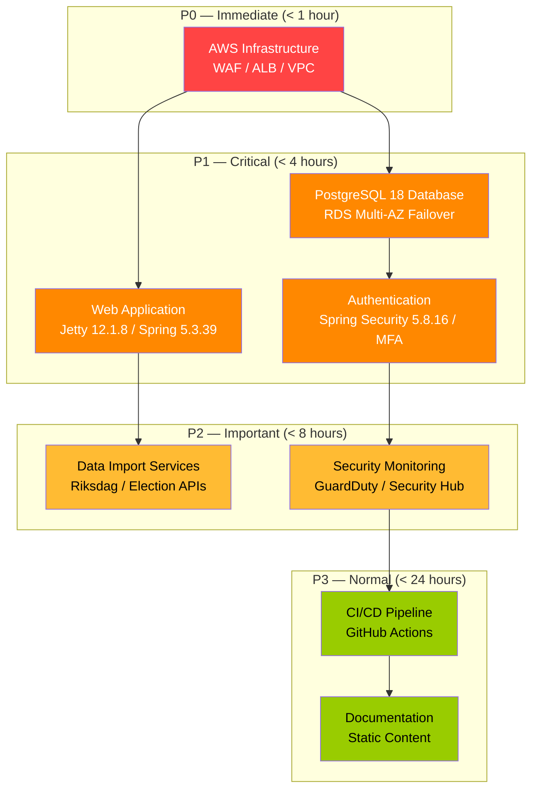
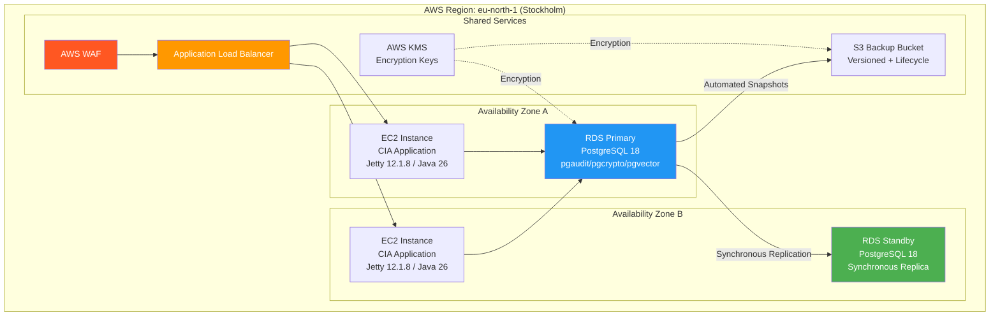

  

<h1 align="center">📋 Citizen Intelligence Agency — Business Continuity Plan</h1>

  <strong>🛡️ Resilience Through Structured Recovery Planning</strong> 
  <em>🎯 RTO/RPO Targets • Failover Procedures • Disaster Recovery • Communication Plans</em>

  
  
  
  

**📋 Document Owner:** CEO | **📄 Version:** 1.1 | **📅 Last Updated:** 2026-04-20 (UTC)  
**🔄 Review Cycle:** Annual | **⏰ Next Review:** 2027-04-20  
**🏷️ Classification:** Public (Open Civic Transparency Platform)

---

## 🎯 Purpose & Scope

This Business Continuity Plan (BCP) establishes the framework for maintaining critical operations of the Citizen Intelligence Agency (CIA) democratic transparency platform during disruptive events. It defines recovery objectives, failover procedures, and communication protocols to ensure platform resilience aligned with the [Hack23 ISMS Backup & Recovery Policy](https://github.com/Hack23/ISMS-PUBLIC/blob/main/Backup_Recovery_Policy.md) and [Classification Framework](https://github.com/Hack23/ISMS-PUBLIC/blob/main/CLASSIFICATION.md).

### **📚 Architecture Documentation Map**

| Document | Focus | Description | Documentation Link |
|----------|-------|-------------|-------------------|
| **[Architecture](ARCHITECTURE.md)** | 🏛️ Architecture | C4 model showing current system structure | [View Source](https://github.com/Hack23/cia/blob/master/ARCHITECTURE.md) |
| **[Security Architecture](SECURITY_ARCHITECTURE.md)** | 🛡️ Security | Complete security implementation overview | [View Source](https://github.com/Hack23/cia/blob/master/SECURITY_ARCHITECTURE.md) |
| **[Threat Model](THREAT_MODEL.md)** | 🛡️ Security | STRIDE/MITRE ATT&CK threat analysis | [View Source](https://github.com/Hack23/cia/blob/master/THREAT_MODEL.md) |
| **[Financial Security Plan](FinancialSecurityPlan.md)** | 💰 Security | AWS security implementation costs and ROI | [View Source](https://github.com/Hack23/cia/blob/master/FinancialSecurityPlan.md) |
| **[End-of-Life Strategy](End-of-Life-Strategy.md)** | 📅 Lifecycle | Technology maintenance and patching strategy | [View Source](https://github.com/Hack23/cia/blob/master/End-of-Life-Strategy.md) |
| **[ISMS Compliance Mapping](ISMS_COMPLIANCE_MAPPING.md)** | 🔐 ISMS | Comprehensive ISMS-PUBLIC policy mapping | [View Source](https://github.com/Hack23/cia/blob/master/ISMS_COMPLIANCE_MAPPING.md) |
| **[CRA Assessment](CRA-ASSESSMENT.md)** | 🛡️ Compliance | EU Cyber Resilience Act conformity | [View Source](https://github.com/Hack23/cia/blob/master/CRA-ASSESSMENT.md) |

### **🔗 ISMS Policy Alignment**

| ISMS Policy | Relevance | Link |
|------------|-----------|------|
| Backup & Recovery Policy | Primary recovery framework | [View](https://github.com/Hack23/ISMS-PUBLIC/blob/main/Backup_Recovery_Policy.md) |
| Incident Response Plan | Incident escalation procedures | [View](https://github.com/Hack23/ISMS-PUBLIC/blob/main/Incident_Response_Plan.md) |
| Classification Framework | RTO/RPO classification targets | [View](https://github.com/Hack23/ISMS-PUBLIC/blob/main/CLASSIFICATION.md) |
| Network Security Policy | Network resilience requirements | [View](https://github.com/Hack23/ISMS-PUBLIC/blob/main/Network_Security_Policy.md) |

---

## 📊 System Classification & Recovery Objectives

### **🏷️ Platform Classification**

| Dimension | Level | Rationale |
|----------|-------|-----------|
| **🔐 Confidentiality** | Public | Parliamentary, governmental, and open economic data sources |
| **🔒 Integrity** | High | Analytical credibility and ranking accuracy are critical |
| **⚡ Availability** | Moderate | Public civic transparency; tolerates brief maintenance windows |

### **🎯 Recovery Time Objectives (RTO)**

| Component | RTO | RPO | Priority | Justification |
|-----------|-----|-----|----------|---------------|
| **Web Application (Vaadin 8.14.4/Spring 5.3.39/Jetty 12.1.8)** | 4 hours | 1 hour | P1 | Primary public-facing interface for civic transparency |
| **PostgreSQL 18 Database** | 2 hours | 15 minutes | P1 | Core data store with analytical views; point-in-time recovery |
| **Data Import Services** | 8 hours | 24 hours | P2 | Batch processing; data is re-importable from external APIs |
| **Authentication & Session (Spring Security 5.8.16 + MFA)** | 4 hours | 1 hour | P1 | Required for registered user and admin access; includes optional MFA enrollment |
| **AWS Infrastructure (WAF/ALB)** | 1 hour | N/A | P0 | CloudFormation automated re-provisioning |
| **Monitoring (GuardDuty/Security Hub)** | 4 hours | N/A | P2 | Security monitoring can tolerate brief gaps |
| **CI/CD Pipeline (GitHub Actions)** | 24 hours | N/A | P3 | Development workflow; not user-facing |

### **📈 Recovery Priority Matrix**

---

## 🏗️ Infrastructure Architecture & Resilience

### **☁️ AWS Multi-AZ Deployment Architecture**

### **🔄 Automated Failover Mechanisms**

| Component | Failover Type | Mechanism | Expected Recovery |
|-----------|--------------|-----------|-------------------|
| **RDS PostgreSQL 18** | Automatic | Multi-AZ with synchronous standby | 60–120 seconds |
| **EC2 Instances** | Automatic | Auto Scaling Group health checks | 2–5 minutes |
| **Load Balancer** | Automatic | ALB health check routing | Immediate (unhealthy target removal) |
| **WAF** | Automatic | AWS-managed, regional service | N/A (always available) |
| **S3 Storage** | Built-in | 99.999999999% durability | N/A |
| **KMS Keys** | Built-in | AWS-managed multi-AZ replication | N/A |

---

## 🚨 Disruption Scenarios & Response Procedures

### **Scenario 1: Single Availability Zone Failure**

| Phase | Action | Owner | Duration |
|-------|--------|-------|----------|
| **Detection** | CloudWatch alarms trigger on EC2/RDS health | Automated | < 1 minute |
| **Failover** | RDS promotes standby; ALB routes to healthy AZ | Automated | 1–2 minutes |
| **Validation** | Health check endpoints confirm service recovery | Automated | 2–3 minutes |
| **Notification** | SNS alert to operations team | Automated | < 5 minutes |
| **Post-Incident** | Review CloudTrail logs; document in incident log | Operations | < 24 hours |

### **Scenario 2: Database Corruption or Data Loss**

| Phase | Action | Owner | Duration |
|-------|--------|-------|----------|
| **Detection** | Application errors; data integrity check failures | Monitoring / Users | < 15 minutes |
| **Assessment** | Determine corruption scope via audit logs (Javers) | DBA / Operations | < 30 minutes |
| **Recovery** | Point-in-time recovery from automated RDS snapshots | DBA | 1–2 hours |
| **Validation** | Run data integrity checks against source APIs | Operations | 1–2 hours |
| **Re-import** | Re-run affected data imports from Parliament/Election APIs | Automated | 2–8 hours |

### **Scenario 3: Full Region Outage**

| Phase | Action | Owner | Duration |
|-------|--------|-------|----------|
| **Detection** | AWS Health Dashboard notification; external monitoring | Automated | < 5 minutes |
| **Assessment** | Evaluate AWS estimated recovery vs manual failover | CEO / Operations | < 30 minutes |
| **Decision** | If AWS ETA > 4 hours, initiate cross-region recovery | CEO | 30 minutes |
| **Recovery** | Restore from S3 cross-region backup to secondary region | Operations | 2–4 hours |
| **Validation** | Verify data integrity and service functionality | Operations | 1–2 hours |
| **Communication** | Status page update; stakeholder notification | CEO | Ongoing |

### **Scenario 4: Security Incident (Compromise)**

| Phase | Action | Owner | Duration |
|-------|--------|-------|----------|
| **Detection** | GuardDuty alert; Security Hub finding; Drools BruteForceAttack rules | Automated | < 5 minutes |
| **Containment** | Isolate affected resources; revoke compromised credentials; MFA enforcement | Security / Operations | < 1 hour |
| **Assessment** | Forensic analysis via CloudTrail, VPC Flow Logs | Security | 2–4 hours |
| **Recovery** | Re-provision from CloudFormation; restore clean data | Operations | 2–4 hours |
| **Communication** | Follow [Incident Response Plan](https://github.com/Hack23/ISMS-PUBLIC/blob/main/Incident_Response_Plan.md) | CEO | Per IRP |

---

## 💾 Backup Strategy

### **📦 Backup Architecture**

| Data Type | Backup Method | Frequency | Retention | Storage |
|-----------|--------------|-----------|-----------|---------|
| **PostgreSQL 18 Database** | RDS Automated Snapshots | Daily + continuous WAL | 35 days | Same-region S3 |
| **Database (Point-in-Time)** | RDS PITR | Continuous (5-min granularity) | 35 days | Same-region |
| **Application Configuration** | CloudFormation templates | On every change (Git) | Indefinite | GitHub + S3 |
| **Encryption Keys** | AWS KMS automatic rotation | Annual rotation | Indefinite | AWS KMS (multi-AZ) |
| **Audit Logs (CloudTrail)** | S3 with lifecycle policy | Continuous | 1 year active + Glacier | S3 + Glacier |
| **Application Logs** | CloudWatch Logs | Continuous | 90 days | CloudWatch |
| **Source Code** | Git (GitHub) | On every commit | Indefinite | GitHub + local clones |

### **🌍 Cross-Region Backup**

| Asset | Primary Region | Backup Region | Replication | Encryption |
|-------|---------------|---------------|-------------|------------|
| RDS Snapshots | eu-north-1 | eu-west-1 | Daily cross-region copy | KMS CMK |
| S3 Audit Logs | eu-north-1 | eu-west-1 | S3 Cross-Region Replication | SSE-KMS |
| CloudFormation | GitHub | GitHub | Git distributed | N/A |

### **🧪 Backup Validation Schedule**

| Test Type | Frequency | Last Tested | Next Scheduled | Success Criteria |
|-----------|-----------|-------------|----------------|-----------------|
| RDS Snapshot Restore | Quarterly | Per deployment | Next quarter | Full data recovery within RTO |
| Point-in-Time Recovery | Semi-annually | Per deployment | Next cycle | Recovery to specific timestamp |
| CloudFormation Stack Deploy | Monthly (CI/CD) | Every release | Next release | Complete infrastructure provisioning |
| Cross-Region Restore | Annually | Initial setup | Next annual review | Full service in secondary region |

---

## 📢 Communication & Escalation

### **🔔 Escalation Matrix**

| Severity | Description | Initial Response | Escalation Path | Communication |
|----------|-------------|-----------------|-----------------|---------------|
| **P0 — Critical** | Complete platform unavailability | < 15 minutes | Operations → CEO | Status page + stakeholder email |
| **P1 — High** | Major feature degradation | < 30 minutes | Operations → CEO | Status page update |
| **P2 — Medium** | Minor feature impact | < 2 hours | Operations | Internal notification |
| **P3 — Low** | Non-user-facing issue | < 8 hours | Operations | Internal ticket |

### **📞 Contact Information**

| Role | Responsibility | Contact Method |
|------|---------------|----------------|
| **CEO / Platform Owner** | Final decision authority; external communication | GitHub Issues / Email |
| **Operations** | Technical response; infrastructure management | GitHub Issues / Monitoring alerts |
| **Security** | Incident investigation; forensic analysis | Security advisory process |

### **📝 Communication Templates**

**Initial Incident Notification:**
> Subject: [CIA Platform] Service Disruption - [Severity]  
> Status: Investigating  
> Impact: [Description of user impact]  
> ETA: [Estimated recovery time]  
> Updates: [Frequency of updates]

**Resolution Notification:**
> Subject: [CIA Platform] Service Restored - [Severity]  
> Status: Resolved  
> Duration: [Total outage duration]  
> Root Cause: [Brief description]  
> Follow-up: [Post-incident review date]

---

## 🔄 BCP Maintenance & Testing

### **📅 Review Schedule**

| Activity | Frequency | Owner | Deliverable |
|----------|-----------|-------|-------------|
| BCP Document Review | Annual | CEO | Updated BCPPlan.md |
| Tabletop Exercise | Annual | Operations + CEO | Exercise report |
| Failover Testing (RDS) | Quarterly | Operations | Test results documentation |
| Backup Restoration Test | Quarterly | Operations | Recovery validation report |
| Contact Information Update | Semi-annually | CEO | Updated contact matrix |
| Compliance Alignment Check | Annual | CEO | ISMS compliance evidence |

### **📊 BCP Effectiveness Metrics**

| Metric | Target | Measurement | Frequency |
|--------|--------|-------------|-----------|
| **Actual RTO vs Target** | Within defined RTO | Recovery time during incidents/tests | Per incident/test |
| **Backup Success Rate** | > 99.9% | Successful backups / total scheduled | Monthly |
| **Failover Success Rate** | 100% | Successful failovers / total attempts | Per test |
| **Data Loss (RPO adherence)** | Zero data loss beyond RPO | Data gap during recovery | Per incident |
| **Communication Timeliness** | Within severity SLA | Time to first notification | Per incident |

---

## 📜 Compliance Framework Alignment

### **🏛️ Standards Mapping**

| Framework | Control | BCP Requirement | Implementation |
|-----------|---------|----------------|----------------|
| **ISO 27001:2022** | A.5.29, A.5.30 | Business continuity planning | This document + tested procedures |
| **ISO 27001:2022** | A.8.13, A.8.14 | Information backup and redundancy | RDS Multi-AZ + S3 cross-region |
| **NIST CSF 2.0** | RC.RP | Recovery planning | Documented procedures per scenario |
| **NIST CSF 2.0** | RC.CO | Recovery communications | Escalation matrix + templates |
| **CIS Controls v8.1** | 11 | Data recovery | Automated backups + tested restoration |
| **AWS Well-Architected** | REL-9 | Backup strategy | Multi-AZ + cross-region replication |
| **AWS Well-Architected** | REL-13 | Disaster recovery plan | Documented failover procedures |

---

## 📝 Appendix: Recovery Runbooks

### **Runbook A: RDS Point-in-Time Recovery**

1. Identify target recovery timestamp from CloudTrail/application logs
2. Initiate RDS point-in-time recovery via AWS Console or CLI
3. Verify recovered instance data integrity
4. Update application configuration to point to recovered instance
5. Validate application functionality via health check endpoints
6. Update DNS/ALB target group if necessary
7. Document recovery in incident log

### **Runbook B: CloudFormation Stack Re-Provisioning**

1. Verify CloudFormation template is current in repository
2. Deploy stack to target region/AZ
3. Restore database from latest snapshot or cross-region copy
4. Configure application environment variables (Secrets Manager)
5. Validate security group rules and WAF configuration
6. Run smoke tests against deployed environment
7. Switch traffic via ALB/Route 53

### **Runbook C: Data Re-Import from External Sources**

1. Verify external API availability (Riksdag, Election Authority, World Bank)
2. Initiate full data import sequence via admin interface
3. Monitor import progress via application logs
4. Validate imported data against known checksums/counts
5. Rebuild analytical views and materialized data
6. Verify dashboard accuracy against source data

---

**📋 Document Control:**  
**✅ Approved by:** James Pether Sörling, CEO - Hack23 AB  
**📤 Distribution:** Public  
**🏷️ Classification:**     
**📅 Effective Date:** 2026-04-20  
**⏰ Next Review:** 2027-04-20  
**🎯 Framework Compliance:**    
