# 🏢 Citizen Intelligence Agency — Business Product Document
## Data Analytics & Risk Intelligence Products

**Version:** 1.0  
**Date:** 2025-11-15  
**Document Owner:** Business Development  
**Classification:** Internal Strategic Planning

---

## 📋 Executive Summary

The Citizen Intelligence Agency (CIA) platform has developed comprehensive intelligence analysis capabilities and risk assessment frameworks that represent significant commercial value. This document defines how to package these capabilities as data products for diverse consumer segments, establishing sustainable revenue streams while maintaining the platform's democratic transparency mission.

### Key Value Propositions

- **🎯 45 Behavioral Risk Rules**: Systematic monitoring across politicians, parties, committees, and ministries
- **📊 5 Analytical Frameworks**: Temporal, comparative, pattern recognition, predictive, and network analysis
- **🔒 Enterprise-Grade Security**: STRIDE threat modeling, MITRE ATT&CK framework integration
- **🌐 Open Data Foundation**: Built on authoritative Swedish government sources
- **⚖️ Non-Partisan Approach**: Objective, unbiased political intelligence

### Market Opportunity

| Market Segment | Annual Market Size | CIA Addressable | Growth Rate |
|----------------|-------------------|-----------------|-------------|
| **Political Consulting** | €450M (Nordic) | €15M | 12% CAGR |
| **Media & Journalism** | €2.8B (Nordic) | €8M | 8% CAGR |
| **Academic Research** | €180M (Nordic Political Science) | €5M | 10% CAGR |
| **Corporate Affairs** | €620M (Nordic) | €12M | 15% CAGR |
| **Government Transparency** | €90M (Nordic) | €6M | 18% CAGR |
| **Total Addressable Market** | **€4.14B** | **€46M** | **12.6% CAGR** |

---

## 🎯 Product Portfolio Strategy

### Product Architecture

```mermaid
%%{
  init: {
    'theme': 'base',
    'themeVariables': {
      'primaryColor': '#e8f5e9',
      'primaryTextColor': '#2e7d32',
      'lineColor': '#4caf50',
      'secondaryColor': '#e3f2fd',
      'tertiaryColor': '#fff3e0'
    }
  }
}%%
flowchart TB
    subgraph FOUNDATION["🆓 Free Tier Foundation"]
        FREE[Public Platform<br/>Basic Dashboards<br/>Historical Data]
    end
    
    subgraph PROFESSIONAL["💼 Professional Products"]
        API[📡 Political Intelligence API]
        ANALYTICS[📊 Advanced Analytics Suite]
        REPORTS[📋 Custom Report Generator]
    end
    
    subgraph ENTERPRISE["🏢 Enterprise Solutions"]
        PLATFORM[🎯 White-Label Platform]
        INTEGRATION[🔗 System Integration Services]
        CONSULTING[🤝 Intelligence Consulting]
    end
    
    subgraph SPECIALIZED["🔬 Specialized Products"]
        RISK[⚠️ Risk Intelligence Feed]
        PREDICTIVE[🔮 Predictive Analytics]
        COMPLIANCE[✅ Compliance Monitoring]
    end
    
    FREE --> PROFESSIONAL
    PROFESSIONAL --> ENTERPRISE
    PROFESSIONAL --> SPECIALIZED
    ENTERPRISE --> SPECIALIZED
    
    style FREE fill:#ccffcc,stroke:#4caf50,stroke-width:3px
    style PROFESSIONAL fill:#cce5ff,stroke:#2196f3,stroke-width:3px
    style ENTERPRISE fill:#fff4cc,stroke:#ffa000,stroke-width:3px
    style SPECIALIZED fill:#ffcccc,stroke:#f44336,stroke-width:3px
```



---

## 📦 Product Definitions

### 🎯 Product Line 1: Political Intelligence API

**Product Name:** CIA Political Intelligence API  
**Core Value:** Programmatic access to comprehensive Swedish political data and analytics

#### Features & Capabilities

| Feature Category | Included Components | Data Granularity |
|-----------------|-------------------|------------------|
| **Parliamentary Data** | Politician profiles, voting records, attendance, documents | Real-time + historical |
| **Risk Assessment** | All 45 risk rules, severity classification, trend analysis | Daily updates |
| **Analytical Insights** | Scorecards, coalition analysis, effectiveness metrics | Monthly aggregations |
| **Predictive Intelligence** | Trend forecasting, risk escalation probability | Quarterly models |
| **Network Analysis** | Collaboration patterns, influence mapping | Annual baseline |

#### Target Consumer Segments

**Primary: Political Consulting Firms**
- **Use Case:** Client campaign strategy, opposition research, coalition analysis
- **Value Delivered:** Real-time political intelligence, automated reporting, predictive forecasting
- **Willingness to Pay:** High (€5,000-15,000/month)
- **Decision Makers:** Managing Partners, Research Directors
- **Sales Cycle:** 3-6 months

**Secondary: Media Organizations**
- **Use Case:** Data journalism, fact-checking, investigative reporting, real-time monitoring
- **Value Delivered:** Authoritative data source, API integration for newsrooms, automated alerts
- **Willingness to Pay:** Medium (€2,000-8,000/month)
- **Decision Makers:** Editors-in-Chief, Data Journalism Directors
- **Sales Cycle:** 2-4 months

**Tertiary: Academic Institutions**
- **Use Case:** Political science research, electoral studies, democratic process analysis
- **Value Delivered:** Comprehensive datasets, methodological transparency, bulk data access
- **Willingness to Pay:** Medium-Low (€1,000-3,000/month or annual subscriptions)
- **Decision Makers:** Department Heads, Research Grant Administrators
- **Sales Cycle:** 6-12 months (budget cycles)

#### API Tier Structure

| Tier | Price Point | Rate Limits | Features | Target Segment |
|------|------------|-------------|----------|----------------|
| **Developer** | €0/month | 100 req/day | Basic endpoints, historical data | Individual researchers, students |
| **Professional** | €2,500/month | 10,000 req/day | Full API access, real-time updates | Journalists, consultants |
| **Enterprise** | €10,000/month | Unlimited | Custom endpoints, dedicated support, SLA | Consulting firms, media organizations |
| **Academic** | €1,500/month | 5,000 req/day | Research access, bulk downloads | Universities, research institutions |

#### Technical Specifications

```yaml
API Architecture:
  Protocol: REST API (JSON), GraphQL optional
  Authentication: OAuth 2.0, API keys
  Rate Limiting: Token bucket algorithm
  SLA: 99.5% uptime (Professional), 99.9% (Enterprise)
  Response Time: <200ms (P95), <500ms (P99)
  Data Freshness: Real-time (votes), Daily (risk assessments)
  
Endpoints:
  Core:
    - GET /politicians/{id}
    - GET /parties/{id}
    - GET /votes/{ballot_id}
    - GET /risk-assessments
  Analytics:
    - POST /analytics/scorecards
    - GET /analytics/trends
    - GET /analytics/predictions
  Bulk:
    - GET /bulk/export/{dataset}
    - POST /bulk/custom-query
```

#### Revenue Model

| Component | Revenue Type | Annual Potential |
|-----------|-------------|------------------|
| **Subscription Fees** | Recurring (MRR) | €450,000 (50 Pro + 10 Enterprise clients) |
| **Overage Charges** | Usage-based | €60,000 (API calls beyond limits) |
| **Custom Development** | Project-based | €120,000 (custom endpoints, integrations) |
| **Total Product Revenue** | **Combined** | **€630,000** |

---

### 📊 Product Line 2: Advanced Analytics Suite

**Product Name:** CIA Political Analytics Platform  
**Core Value:** Interactive analytics and visualization tools for non-technical users

#### Features & Capabilities

**Interactive Dashboards**
- Real-time political scorecards
- Coalition stability monitoring
- Parliamentary effectiveness metrics
- Customizable visualization widgets
- Drill-down analysis capabilities

**Report Generation**
- Automated weekly/monthly reports
- Custom report templates
- Export to PDF, Excel, PowerPoint
- Scheduled delivery
- White-label branding options

**Alerting & Notifications**
- Risk threshold alerts
- Political event notifications
- Custom alert rules
- Multi-channel delivery (email, SMS, Slack)

**Comparative Analysis**
- Politician benchmarking
- Party performance comparison
- Historical trend analysis
- International comparisons (future)

#### Target Consumer Segments

**Primary: Corporate Government Affairs Teams**
- **Use Case:** Monitoring politicians affecting corporate interests, lobby tracking, regulatory risk
- **Value Delivered:** Proactive stakeholder intelligence, relationship mapping, automated monitoring
- **Willingness to Pay:** High (€8,000-20,000/month)
- **Decision Makers:** Government Affairs Directors, Corporate Strategy Officers
- **Sales Cycle:** 4-8 months

**Secondary: NGOs & Advocacy Organizations**
- **Use Case:** Accountability tracking, transparency monitoring, campaign targeting
- **Value Delivered:** Issue-specific monitoring, voting record analysis, public reporting tools
- **Willingness to Pay:** Medium (€3,000-8,000/month)
- **Decision Makers:** Executive Directors, Campaign Managers
- **Sales Cycle:** 3-6 months

**Tertiary: Political Parties (Opposition)**
- **Use Case:** Coalition performance monitoring, opposition research, parliamentary strategy
- **Value Delivered:** Competitive intelligence, coalition weakness detection, strategic insights
- **Willingness to Pay:** High (€10,000-25,000/month, seasonal spikes)
- **Decision Makers:** Party Secretaries, Parliamentary Group Leaders
- **Sales Cycle:** 2-4 months (political urgency)

#### Pricing Tiers

| Tier | Monthly Price | Users | Custom Dashboards | Reports/Month | Alert Rules |
|------|--------------|-------|-------------------|---------------|-------------|
| **Starter** | €2,000 | 3 | 5 | 10 | 20 |
| **Professional** | €6,000 | 10 | Unlimited | Unlimited | 100 |
| **Enterprise** | €15,000+ | Unlimited | Unlimited | Unlimited | Unlimited |
| **NGO/Academic** | €2,500 | 5 | 10 | 50 | 50 |

#### Revenue Model

| Component | Revenue Type | Annual Potential |
|-----------|-------------|------------------|
| **Subscription Fees** | Recurring (MRR) | €720,000 (40 Pro + 15 Enterprise clients) |
| **Custom Dashboard Development** | Project-based | €90,000 |
| **Training & Onboarding** | Service-based | €45,000 |
| **Total Product Revenue** | **Combined** | **€855,000** |

---

### ⚠️ Product Line 3: Risk Intelligence Feed

**Product Name:** CIA Political Risk Intelligence Service  
**Core Value:** Real-time political risk detection and early warning system

#### Features & Capabilities

**Real-Time Risk Monitoring**
- Continuous evaluation of 45 risk rules
- Severity-based classification (MINOR/MAJOR/CRITICAL)
- Multi-dimensional risk profiling
- Pattern recognition algorithms
- Anomaly detection

**Early Warning System**
- Predictive risk escalation modeling
- Coalition stability forecasting
- Pre-resignation pattern detection
- Electoral vulnerability assessment
- Crisis probability scoring

**Threat Intelligence Integration**
- Political threat landscape monitoring
- Election period threat escalation
- Democratic process security assessment
- Correlation with external events
- OSINT threat integration

**Compliance & Governance**
- Political risk reporting for boards
- Regulatory stakeholder monitoring
- ESG political risk component
- Due diligence intelligence
- Reputation risk assessment

#### Target Consumer Segments

**Primary: Financial Services & Investment Firms**
- **Use Case:** Political risk assessment for investments, sovereign risk evaluation, regulatory forecasting
- **Value Delivered:** Real-time risk scoring, predictive modeling, portfolio risk aggregation
- **Willingness to Pay:** Very High (€20,000-50,000/month)
- **Decision Makers:** Chief Risk Officers, Investment Committee Members
- **Sales Cycle:** 6-12 months (extensive validation)

**Secondary: Corporate Risk Management**
- **Use Case:** Political risk for business operations, regulatory change forecasting, stakeholder risk
- **Value Delivered:** Early warning of political instability, regulatory risk alerts, crisis prediction
- **Willingness to Pay:** High (€12,000-30,000/month)
- **Decision Makers:** Chief Risk Officers, Corporate Strategy Teams
- **Sales Cycle:** 4-8 months

**Tertiary: Management Consulting Firms**
- **Use Case:** Political risk component for client advisory, due diligence, market entry analysis
- **Value Delivered:** White-label risk intelligence, custom risk models, API integration
- **Willingness to Pay:** High (€15,000-35,000/month)
- **Decision Makers:** Practice Leaders, Client Engagement Partners
- **Sales Cycle:** 3-6 months

#### Risk Intelligence Tiers

| Tier | Monthly Price | Risk Rules | Forecasting | Custom Models | SLA |
|------|--------------|------------|-------------|---------------|-----|
| **Standard** | €12,000 | All 45 rules | 3-month | No | 99.5% |
| **Advanced** | €25,000 | All + Custom | 6-month | Yes | 99.9% |
| **Enterprise** | €45,000+ | Unlimited | 12-month | Unlimited | 99.95% |

#### Data Products

**Risk Report Packages**
- **Daily Risk Brief** — €500/month (email summary of critical risks)
- **Weekly Risk Analysis** — €2,000/month (detailed risk assessment report)
- **Monthly Risk Forecast** — €5,000/month (predictive risk modeling report)
- **Quarterly Political Intelligence Briefing** — €15,000 (strategic intelligence analysis)

#### Revenue Model

| Component | Revenue Type | Annual Potential |
|-----------|-------------|------------------|
| **Subscription Fees** | Recurring (MRR) | €1,200,000 (30 Standard + 15 Advanced + 5 Enterprise) |
| **Custom Risk Models** | Project-based | €180,000 |
| **Risk Report Packages** | Recurring | €240,000 |
| **Consulting Services** | Time-based | €150,000 |
| **Total Product Revenue** | **Combined** | **€1,770,000** |

---

### 🔮 Product Line 4: Predictive Analytics Service

**Product Name:** CIA Political Forecasting & Scenario Planning  
**Core Value:** Advanced predictive modeling for political outcomes and scenarios

#### Features & Capabilities

**Electoral Forecasting**
- Seat projection models
- Coalition formation probability
- Government stability duration
- Election outcome scenarios
- Voter behavior prediction

**Parliamentary Trend Analysis**
- Legislative activity forecasting
- Policy adoption probability
- Coalition voting patterns
- Committee productivity trends
- Minister performance trajectory

**Scenario Planning Tools**
- "What-if" political scenarios
- Coalition alternative analysis
- Policy impact simulation
- Crisis scenario modeling
- Strategic option evaluation

**Machine Learning Models**
- Time series forecasting (ARIMA, Prophet)
- Logistic regression for events
- Survival analysis for coalitions
- Ensemble models for elections
- Neural networks for patterns

#### Target Consumer Segments

**Primary: Strategic Consulting Firms**
- **Use Case:** Political scenario planning for clients, market entry risk assessment, stakeholder strategy
- **Value Delivered:** Quantitative political forecasts, scenario probability analysis, strategic recommendations
- **Willingness to Pay:** Very High (€30,000-75,000/month)
- **Decision Makers:** Senior Partners, Strategy Practice Leaders
- **Sales Cycle:** 6-12 months (high-value deals)

**Secondary: Corporate Strategy Teams**
- **Use Case:** Long-term political risk planning, regulatory forecasting, market scenario analysis
- **Value Delivered:** Multi-year forecasts, scenario probability trees, strategic option analysis
- **Willingness to Pay:** High (€20,000-45,000/month)
- **Decision Makers:** Chief Strategy Officers, Corporate Development VPs
- **Sales Cycle:** 6-9 months

**Tertiary: Political Parties & Campaigns**
- **Use Case:** Election strategy, coalition negotiation planning, campaign resource allocation
- **Value Delivered:** Electoral projections, voter targeting, coalition scenario optimization
- **Willingness to Pay:** Very High (€50,000-150,000 per election cycle)
- **Decision Makers:** Campaign Managers, Party Leadership
- **Sales Cycle:** 1-3 months (urgent, election-driven)

#### Pricing Model

| Service Type | Pricing | Delivery | Target Segment |
|-------------|---------|----------|----------------|
| **Forecast Subscription** | €25,000/month | Monthly updates | Strategy teams, consultants |
| **Custom Scenario Analysis** | €50,000-150,000 | Project-based | Corporate strategy, consultants |
| **Election Campaign Package** | €100,000-300,000 | Election cycle | Political parties, campaigns |
| **Academic Research License** | €10,000/year | Annual access | Universities, research institutions |

#### Revenue Model

| Component | Revenue Type | Annual Potential |
|-----------|-------------|------------------|
| **Subscription Fees** | Recurring (MRR) | €900,000 (30 clients × €30K avg) |
| **Custom Scenario Projects** | Project-based | €600,000 (6-10 projects/year) |
| **Election Campaign Packages** | Seasonal | €500,000 (election year spike) |
| **Academic Licenses** | Annual | €50,000 |
| **Total Product Revenue** | **Combined** | **€2,050,000** |

---

### 🏢 Product Line 5: White-Label Platform & Integration Services

**Product Name:** CIA Political Intelligence Platform (White-Label)  
**Core Value:** Turnkey political transparency platform for organizations and governments

#### Features & Capabilities

**White-Label Platform**
- Fully branded user interface
- Custom domain and SSL
- Configurable modules
- Multi-language support
- Mobile-responsive design

**System Integration**
- API integration with client systems
- Single Sign-On (SSO) integration
- Data warehouse connectors
- BI tool integration (Tableau, Power BI)
- CRM integration (Salesforce, HubSpot)

**Managed Services**
- Platform hosting (AWS infrastructure)
- Data pipeline management
- System monitoring & support
- Security management
- Compliance reporting

**Custom Development**
- Bespoke analytical modules
- Custom data source integration
- Specialized risk rules
- Industry-specific adaptations
- Regional/national adaptations

#### Target Consumer Segments

**Primary: Government Transparency Agencies**
- **Use Case:** National parliamentary monitoring, transparency portal, public accountability platform
- **Value Delivered:** Turnkey transparency infrastructure, compliance with transparency laws, public engagement
- **Willingness to Pay:** Very High (€500,000-2,000,000 initial + €100,000-300,000/year)
- **Decision Makers:** Ministry CIOs, Transparency Authority Directors
- **Sales Cycle:** 12-24 months (government procurement)

**Secondary: International Organizations (EU, UN, OECD)**
- **Use Case:** Multi-country political monitoring, democratic health assessment, anti-corruption monitoring
- **Value Delivered:** Standardized transparency framework, cross-country comparisons, best practice platform
- **Willingness to Pay:** Very High (€1,000,000-5,000,000 initial + €200,000-500,000/year)
- **Decision Makers:** Program Directors, Regional Representatives
- **Sales Cycle:** 18-36 months (complex procurement)

**Tertiary: Large Consulting Firms & Think Tanks**
- **Use Case:** Political intelligence platform for client services, research infrastructure, thought leadership
- **Value Delivered:** Branded intelligence platform, proprietary analytical capabilities, competitive differentiation
- **Willingness to Pay:** High (€300,000-1,000,000 initial + €75,000-200,000/year)
- **Decision Makers:** Managing Partners, Research Directors
- **Sales Cycle:** 9-18 months

#### Pricing Model

| Component | Initial Setup | Annual Maintenance | Scope |
|-----------|--------------|-------------------|-------|
| **Platform License** | €250,000-500,000 | €75,000-150,000 | Core platform + modules |
| **Custom Development** | €200,000-1,500,000 | — | Bespoke features, integrations |
| **Managed Services** | — | €100,000-300,000 | Hosting, support, monitoring |
| **Data Pipeline Setup** | €100,000-300,000 | €50,000-100,000 | Custom data sources |
| **Training & Onboarding** | €50,000-150,000 | — | Staff training, documentation |

#### Revenue Model

| Year | New Contracts | Recurring Revenue | Total Revenue |
|------|--------------|-------------------|---------------|
| **Year 1** | 2 contracts (€1.5M total) | €200,000 | €1,700,000 |
| **Year 2** | 3 contracts (€2.5M total) | €600,000 | €3,100,000 |
| **Year 3** | 4 contracts (€3.5M total) | €1,200,000 | €4,700,000 |

---

### 📊 Product Line 6: Decision Intelligence Suite

**Product Name:** CIA Decision Intelligence & Legislative Analytics  
**Core Value:** Real-time legislative decision tracking, approval rate forecasting, and policy effectiveness analysis

#### Features & Capabilities

**Decision Flow Analytics**
- Party decision effectiveness tracking
- Politician proposal success rates
- Ministry legislative performance
- Committee decision patterns
- Temporal trend analysis with forecasting

**Decision KPIs & Metrics**
- **Approval Rate KPIs**: Party/politician/ministry success rates
- **Decision Velocity**: Average processing time by committee/type
- **Decision Volume**: Proposals by source and outcome
- **Effectiveness Trends**: Month-over-month approval rate changes
- **Coalition Alignment**: Decision agreement scores between parties

**Predictive Decision Analytics**
- Proposal success probability modeling
- Decision timeline forecasting
- Bottleneck early warning system
- Coalition voting pattern prediction
- Ministry-committee relationship strength

**Dashboard & Visualizations**
- Real-time decision flow dashboards
- Interactive approval rate heatmaps
- Temporal trend charts (7-day, 30-day, 90-day moving averages)
- Party comparison widgets
- Ministry performance scorecards

#### Target Consumer Segments

**Primary: Political Consulting Firms & Lobbyists**
- **Use Case:** Track proposal success rates to advise clients on legislative strategy
- **Value Delivered:** Real-time decision intelligence, proposal outcome prediction, strategic timing insights
- **Willingness to Pay:** Very High (€15,000-30,000/month)
- **Decision Makers:** Managing Partners, Strategic Advisors
- **Sales Cycle:** 3-6 months

**Secondary: Corporate Government Affairs Teams**
- **Use Case:** Monitor ministry proposal success rates affecting industry regulations
- **Value Delivered:** Ministry effectiveness tracking, regulatory decision forecasting, stakeholder mapping
- **Willingness to Pay:** High (€10,000-20,000/month)
- **Decision Makers:** Government Affairs Directors, VP Regulatory Strategy
- **Sales Cycle:** 4-8 months

**Tertiary: Media Organizations (Investigative Journalism)**
- **Use Case:** Investigate legislative decision patterns, approval rate anomalies, party alignment shifts
- **Value Delivered:** Exclusive decision data for investigative stories, approval rate analysis, accountability reporting
- **Willingness to Pay:** Medium (€5,000-12,000/month)
- **Decision Makers:** Investigative Editors, Data Journalism Directors
- **Sales Cycle:** 2-4 months

#### Pricing Model

| Tier | Monthly Price | Features | Target Segment |
|------|--------------|----------|----------------|
| **Professional** | €8,000 | Decision flow views, KPI dashboard, 12-month historical data | Small consulting firms, media |
| **Enterprise** | €18,000 | Full suite, predictive analytics, API access, custom dashboards | Large consulting, corporate affairs |
| **Strategic** | €35,000+ | White-label, dedicated support, custom models, real-time alerts | Strategic consulting, government affairs agencies |

**Add-On Services:**
- Custom decision model development: €25,000-50,000 (project-based)
- Decision forecasting reports (quarterly): €15,000/quarter
- Training & workshops: €5,000/day

#### Revenue Model

| Component | Revenue Type | Annual Potential |
|-----------|-------------|------------------|
| **Subscription Fees** | Recurring (MRR) | €11,220,000 (50 Professional + 20 Enterprise + 5 Strategic) |
| **Custom Models** | Project-based | €300,000 (10-15 projects/year) |
| **Quarterly Reports** | Recurring | €240,000 (16 clients × €15K/quarter) |
| **Training & Consulting** | Service-based | €150,000 (30 days/year) |
| **Total Product Revenue** | **Combined** | **€2,090,000** |

#### Key Performance Indicators

**Product KPIs:**
- Decision data coverage: 100% of Swedish parliamentary proposals
- Approval rate accuracy: ±2% prediction error
- Data freshness: <24 hour latency from decision to availability
- Dashboard uptime: 99.9% SLA
- Forecast accuracy (3-month): MAPE <15%

**Business KPIs:**
- Customer Acquisition Cost: €30,000
- Customer Lifetime Value: €450,000 (25 months average)
- LTV:CAC ratio: 15x (exceptional)
- Churn rate: <8% annually
- Net Revenue Retention: 125% (expansion revenue from upgrades)

#### Competitive Advantages

1. **Unique Decision Flow Data**: Only platform with party/politician/ministry decision approval rates
2. **Temporal Trend Analysis**: Moving averages, seasonal decomposition, anomaly detection
3. **Predictive Capabilities**: ML-based proposal success forecasting
4. **API-First Architecture**: Programmatic access for automation and integration
5. **Nordic Specialization**: Deep Swedish parliamentary expertise

#### Go-to-Market Strategy

**Phase 1 (Months 1-6): Beta Launch**
- 3 pilot customers (1 consulting, 1 corporate, 1 media)
- Product validation and iteration
- Case study development
- Target: €50,000 MRR

**Phase 2 (Months 7-12): Market Entry**
- Sales team expansion (2 AEs)
- Marketing campaign launch
- Industry conference presence
- Target: €200,000 MRR

**Phase 3 (Year 2): Scale**
- Enterprise sales motion
- Nordic expansion (Norway, Denmark)
- Strategic partnership development
- Target: €1,400,000 ARR

#### Intelligence Integration

**Connects to Existing Intelligence Framework:**
- Risk Intelligence Feed: Decision pattern anomalies as risk signals
- Predictive Analytics: Proposal outcome forecasting models
- Advanced Analytics Suite: Decision KPI widgets and dashboards
- Political Intelligence API: Decision endpoints added to API

**Data Sources:**
- view_riksdagen_party_decision_flow
- view_riksdagen_politician_decision_pattern
- view_ministry_decision_impact
- view_decision_temporal_trends (if exists)
- view_decision_outcome_kpi_dashboard (if exists)

---

## 🎯 Target Market Segmentation

### Market Segmentation Matrix

| Segment | Size | CIA Fit | Priority | Revenue Potential |
|---------|------|---------|----------|-------------------|
| **Political Consulting** | High | Excellent | 1 | €800K/year |
| **Media & Journalism** | High | Excellent | 1 | €600K/year |
| **Corporate Government Affairs** | Medium | Excellent | 2 | €1.2M/year |
| **Financial Services Risk** | Large | Very Good | 2 | €1.5M/year |
| **Management Consulting** | Large | Very Good | 2 | €900K/year |
| **NGOs & Advocacy** | Medium | Good | 3 | €400K/year |
| **Academic Research** | Medium | Good | 3 | €250K/year |
| **Government Agencies** | Small | Excellent | 1 | €2M+/year (large deals) |
| **Political Parties** | Small | Good | 3 | €300K/year (seasonal) |

### Buyer Persona Profiles

#### Persona 1: "Strategic Sarah" — Government Affairs Director

**Profile**
- **Role:** Director of Government Affairs, Fortune 500 Corporation
- **Experience:** 15+ years in public policy and stakeholder management
- **Age:** 42
- **Education:** Master's in Public Policy
- **Location:** Stockholm, Sweden

**Goals**
- Monitor politicians affecting corporate interests
- Early warning of regulatory changes
- Build relationships with key decision-makers
- Manage political risk for business operations

**Pain Points**
- Manual monitoring is time-consuming
- Difficult to track voting patterns across issues
- No early warning system for political risks
- Inconsistent data sources

**Buying Behavior**
- Budget authority: €50,000-200,000/year
- Decision cycle: 6-9 months
- Requires ROI justification to CFO
- Needs executive dashboard for reporting

**CIA Solution Fit**
- **Primary Product:** Advanced Analytics Suite (€15,000/month)
- **Secondary Product:** Risk Intelligence Feed (€12,000/month)
- **Total ACV:** €324,000

#### Persona 2: "Research Robert" — Chief Risk Officer, Investment Firm

**Profile**
- **Role:** Chief Risk Officer, Nordic Asset Management Firm
- **Experience:** 20+ years in financial risk management
- **Age:** 48
- **Education:** PhD in Finance
- **Location:** Copenhagen, Denmark

**Goals**
- Assess political risk for sovereign investments
- Quantify regulatory risk exposure
- Integrate political risk into portfolio models
- Comply with risk disclosure requirements

**Pain Points**
- Lack of quantitative political risk metrics
- Subjective political risk assessments
- No real-time political risk monitoring
- Difficult to integrate into risk models

**Buying Behavior**
- Budget authority: €200,000-500,000/year
- Decision cycle: 9-15 months (extensive validation)
- Requires statistical validation of models
- Needs API integration with risk systems

**CIA Solution Fit**
- **Primary Product:** Risk Intelligence Feed (€45,000/month Enterprise)
- **Secondary Product:** Political Intelligence API (€10,000/month)
- **Total ACV:** €660,000

#### Persona 3: "Data-Driven Dana" — Data Journalism Editor

**Profile**
- **Role:** Data Journalism Editor, Major Nordic Newspaper
- **Experience:** 10 years in investigative journalism
- **Age:** 36
- **Education:** Master's in Journalism
- **Location:** Oslo, Norway

**Goals**
- Produce data-driven political stories
- Fact-check political claims in real-time
- Investigate parliamentary voting patterns
- Create interactive political visualizations

**Pain Points**
- Time-consuming data collection
- Difficulty accessing parliamentary APIs
- Manual data cleaning and processing
- Limited analytical capabilities

**Buying Behavior**
- Budget authority: €20,000-80,000/year
- Decision cycle: 2-4 months
- Needs newsroom API integration
- Requires training for journalists

**CIA Solution Fit**
- **Primary Product:** Political Intelligence API (€2,500/month Professional)
- **Secondary Product:** Advanced Analytics Suite (€2,000/month Starter)
- **Total ACV:** €54,000

---

## 💰 Pricing Strategy & Revenue Model

### Pricing Philosophy

**Value-Based Pricing:** Price based on value delivered to customer segment, not cost-plus
**Tiered Structure:** Multiple tiers to capture different customer segments and budgets
**Usage-Based Components:** Hybrid model with base subscription + usage-based charges
**Annual Discounts:** 15-20% discount for annual prepayment to improve cash flow

### Consolidated Pricing Overview

| Product Line | Entry Price | Mid Tier | Enterprise | Annual Potential |
|-------------|------------|----------|------------|------------------|
| **Political Intelligence API** | €2,500/mo | €10,000/mo | Custom | €630,000 |
| **Advanced Analytics Suite** | €2,000/mo | €6,000/mo | €15,000/mo | €855,000 |
| **Risk Intelligence Feed** | €12,000/mo | €25,000/mo | €45,000/mo | €1,770,000 |
| **Predictive Analytics** | €25,000/mo | €50K/project | €100-300K/cycle | €2,050,000 |
| **White-Label Platform** | €500K setup | — | Custom | €1,700,000+ |
| **Decision Intelligence Suite** | €8,000/mo | €18,000/mo | €35,000/mo | €2,090,000 |
| **Total Product Revenue** | — | — | — | **€9,095,000** |

### Revenue Ramp Projection

| Year | Product Revenue | Services Revenue | Total Revenue | Growth Rate |
|------|----------------|------------------|---------------|-------------|
| **Year 1** | €1,500,000 | €400,000 | **€1,900,000** | — |
| **Year 2** | €4,500,000 | €1,000,000 | **€5,500,000** | 189% |
| **Year 3** | €9,100,000 | €1,900,000 | **€11,000,000** | 100% |
| **Year 4** | €15,000,000 | €2,800,000 | **€17,800,000** | 62% |
| **Year 5** | €20,500,000 | €4,000,000 | **€24,500,000** | 38% |

### Customer Acquisition Targets

| Customer Segment | Year 1 | Year 2 | Year 3 | CLTV | CAC | LTV:CAC |
|-----------------|--------|--------|--------|------|-----|---------|
| **Political Consulting** | 5 | 15 | 30 | €180K | €25K | 7.2x |
| **Media Organizations** | 8 | 20 | 40 | €120K | €15K | 8.0x |
| **Corporate Affairs** | 3 | 10 | 25 | €300K | €45K | 6.7x |
| **Financial Services** | 2 | 6 | 15 | €600K | €80K | 7.5x |
| **Government Agencies** | 0 | 1 | 2 | €2M+ | €250K | 8.0x |
| **Total Customers** | **18** | **52** | **112** | — | — | **7.4x avg** |

---

## 🚀 Go-to-Market Strategy

### Phase 1: Foundation (Months 1-6)

**Objective:** Establish product-market fit with early adopter customers

**Activities:**
- ✅ Product packaging and positioning
- ✅ Pricing model finalization
- ✅ API documentation and developer portal
- ✅ Sales collateral and demo environment
- ✅ Initial customer pilots (3-5 customers)
- ✅ Case study development
- ✅ Website product pages and lead generation

**Target Customers:**
- 2 Political Consulting Firms (pilots)
- 2 Media Organizations (pilots)
- 1 Academic Institution (pilot)

**Key Metrics:**
- 5 pilot customers signed
- €50,000 MRR achieved
- 3 case studies published
- Product-market fit validated

### Phase 2: Scale (Months 7-18)

**Objective:** Scale sales and marketing to achieve €1.5M ARR

**Sales Strategy:**
- Hire 2 B2B sales representatives (SaaS experience)
- Implement CRM (HubSpot or Salesforce)
- Develop sales playbook and training
- Create pricing calculator and ROI models
- Establish partner channel (consulting firms)

**Marketing Strategy:**
- Content marketing (blog, whitepapers, webinars)
- SEO optimization for "political intelligence" keywords
- LinkedIn advertising and thought leadership
- Industry conference presence (Nordic political events)
- PR campaign for case studies

**Product Development:**
- API enhancements based on pilot feedback
- Advanced Analytics Suite MVP launch
- Risk Intelligence Feed beta release
- Integration partnerships (Salesforce, Tableau)

**Target Customers:**
- 10 Political Consulting Firms
- 8 Media Organizations
- 5 Corporate Government Affairs teams
- 2 NGOs/Advocacy Organizations

**Key Metrics:**
- €1,500,000 ARR achieved
- 30 paying customers
- €50,000 MRR from new sales
- 25% month-over-month growth

### Phase 3: Expansion (Months 19-36)

**Objective:** Expand into enterprise and government segments, achieve €8.5M ARR

**Sales Strategy:**
- Hire enterprise sales team (4 AEs, 2 SEs)
- Establish government sales practice
- Create partner ecosystem (SI partners)
- International expansion (Norway, Denmark)
- White-label platform sales motion

**Marketing Strategy:**
- Account-based marketing (ABM) for enterprise
- Government procurement marketing
- International localization
- Analyst relations (Gartner, Forrester)
- User conference and community building

**Product Development:**
- Predictive Analytics Service launch
- White-Label Platform GA
- Mobile application launch
- International data sources (Norway, Denmark)
- Advanced ML models deployment

**Target Customers:**
- 15 Corporate Affairs teams
- 10 Financial Services risk departments
- 5 Management Consulting firms
- 2 Government transparency agencies
- 30 additional consulting/media clients

**Key Metrics:**
- €8,500,000 ARR achieved
- 100+ paying customers
- €150,000+ MRR from new sales
- 15% month-over-month growth

---

## 🏆 Competitive Analysis

### Competitive Landscape

| Competitor | Geography | Strengths | Weaknesses | CIA Differentiation |
|-----------|-----------|-----------|------------|---------------------|
| **VoteWatch Europe** | EU Parliament | Strong EU focus, voting analysis | Limited national parliaments, no risk intelligence | National focus, risk rules, predictive analytics |
| **LobbyFacts** | EU lobbying | Lobbying transparency | No parliamentary analysis | Full political intelligence, risk assessment |
| **TheyWorkForYou** | UK Parliament | Good UX, active community | UK-only, no analytics | Nordic focus, advanced analytics, API-first |
| **OpenStates** | US state legislatures | Open source, comprehensive | US-only, basic features | Enterprise features, risk intelligence |
| **Political Intelligence Firms** | Various | Human analysis, networks | Expensive, manual, slow | Automated, real-time, scalable, data-driven |
| **Bloomberg Government** | US Federal | Comprehensive, integrated | US-only, expensive (€50K+) | Nordic focus, specialized analytics, better pricing |

### Competitive Advantages

**1. Comprehensive Risk Intelligence**
- 45 behavioral risk rules (unique to CIA)
- Multi-dimensional risk assessment
- Predictive risk modeling
- No competitor offers systematic risk framework

**2. Advanced Analytical Frameworks**
- 5 complementary analytical approaches
- Temporal, comparative, pattern, predictive, network
- Academic-grade methodology with transparency
- Competitors offer basic reporting only

**3. API-First Architecture**
- Programmatic access for automation
- Integration-friendly design
- Developer-focused documentation
- Most competitors are UI-only platforms

**4. Open Source Foundation**
- Transparency in methodology
- Community contributions
- Academic credibility
- Trust through openness

**5. Nordic Specialization**
- Deep Swedish parliamentary knowledge
- Local data sources expertise
- Cultural and political context understanding
- Nordic expansion roadmap (Norway, Denmark, Finland)

### Barriers to Entry for Competitors

**High Barriers:**
- ✅ 10+ years of historical data accumulated
- ✅ Complex data pipeline infrastructure
- ✅ Sophisticated analytical framework development
- ✅ Political science expertise embedded in product
- ✅ Government data source relationships

**Sustainable Moats:**
- **Data Network Effects:** More data → Better models → More customers → More data
- **Switching Costs:** Integration and workflow dependencies create lock-in
- **Brand Reputation:** Non-partisan credibility takes years to establish
- **Technical Complexity:** Risk rules and predictive models are not easily replicated

---

## 📊 Financial Projections

### Revenue Breakdown by Product Line (Year 3)

```mermaid
%%{
  init: {
    'theme': 'base',
    'themeVariables': {
      'primaryColor': '#e3f2fd',
      'primaryTextColor': '#01579b'
    }
  }
}%%
pie title Year 3 Revenue by Product Line (€11.0M Total)
    "Political Intelligence API" : 900000
    "Advanced Analytics Suite" : 1200000
    "Risk Intelligence Feed" : 2500000
    "Predictive Analytics" : 2050000
    "White-Label Platform" : 1300000
    "Decision Intelligence Suite" : 2100000
    "Professional Services" : 950000
```



### Operating Expenses (Year 3)

| Expense Category | Annual Cost | % of Revenue |
|-----------------|-------------|--------------|
| **Engineering & Product** | €2,750,000 | 25% |
| **Sales & Marketing** | €3,300,000 | 30% |
| **Customer Success & Support** | €1,100,000 | 10% |
| **Infrastructure (AWS)** | €550,000 | 5% |
| **General & Administrative** | €1,100,000 | 10% |
| **Total Operating Expenses** | **€8,800,000** | **80%** |
| **Operating Income (EBITDA)** | **€2,200,000** | **20%** |

### Unit Economics

| Metric | Value | Benchmark | Assessment |
|--------|-------|-----------|------------|
| **Customer Acquisition Cost (CAC)** | €35,000 | €20K-50K (B2B SaaS) | ✅ Within range |
| **Customer Lifetime Value (CLTV)** | €260,000 | 3x-5x CAC | ✅ 7.4x CAC (Excellent) |
| **CAC Payback Period** | 14 months | 12-18 months | ✅ Within range |
| **Gross Margin** | 75% | 70-85% (SaaS) | ✅ Healthy |
| **Net Revenue Retention** | 115% | 100-120% (Best-in-class) | ✅ Strong expansion |
| **Annual Churn Rate** | 12% | 10-20% (B2B) | ✅ Acceptable |

### Funding Requirements

| Stage | Amount | Use of Funds | Valuation | Dilution |
|-------|--------|--------------|-----------|----------|
| **Seed Round** | €500,000 | Product development, pilot customers | €3M pre-money | 14% |
| **Series A** | €2,500,000 | Sales scale-up, team expansion | €12M pre-money | 17% |
| **Series B** | €8,000,000 | International expansion, enterprise | €40M pre-money | 17% |
| **Total Raised** | **€11,000,000** | — | — | **40% total** |

### Path to Profitability

| Year | Revenue | Operating Expenses | EBITDA | EBITDA Margin |
|------|---------|-------------------|---------|---------------|
| **Year 1** | €1,900,000 | €2,100,000 | (€200,000) | -11% |
| **Year 2** | €5,500,000 | €4,950,000 | €550,000 | 10% |
| **Year 3** | €11,000,000 | €8,800,000 | €2,200,000 | 20% |
| **Year 4** | €17,800,000 | €12,460,000 | €5,340,000 | 30% |
| **Year 5** | €24,500,000 | €14,700,000 | €9,800,000 | 40% |

---

## 🎯 Success Metrics & KPIs

### Product-Level KPIs

| Product | North Star Metric | Supporting Metrics |
|---------|------------------|-------------------|
| **Political Intelligence API** | Active API keys | Requests/day, data endpoints used, error rate |
| **Advanced Analytics Suite** | Dashboard views/user | Active users, custom dashboards created, report exports |
| **Risk Intelligence Feed** | Critical alerts delivered | Risk rules triggered, alert accuracy, customer action rate |
| **Predictive Analytics** | Forecast accuracy (MAPE) | Model training time, scenario requests, prediction confidence |
| **Decision Intelligence Suite** | Decision KPIs tracked | Approval rate accuracy, decision velocity, forecast MAPE |
| **White-Label Platform** | Platform uptime | Data pipeline success rate, customer satisfaction (NPS) |

### Business-Level KPIs

| Category | Metric | Target (Year 3) | Measurement Frequency |
|----------|--------|-----------------|----------------------|
| **Revenue** | Annual Recurring Revenue (ARR) | €11.0M | Monthly |
| **Growth** | ARR Growth Rate | 100% YoY | Quarterly |
| **Efficiency** | CAC Payback Period | 14 months | Quarterly |
| **Retention** | Net Revenue Retention | 115% | Quarterly |
| **Profitability** | EBITDA Margin | 20% | Quarterly |
| **Customer** | Net Promoter Score (NPS) | 50+ | Quarterly |
| **Sales** | Average Contract Value (ACV) | €85,000 | Monthly |
| **Product** | API Uptime | 99.9% | Real-time |

---

## 🛡️ Risk Mitigation

### Key Risks & Mitigation Strategies

| Risk | Probability | Impact | Mitigation Strategy |
|------|------------|--------|-------------------|
| **Data Source Changes** | Medium | High | Multi-source validation, contractual data agreements, backup sources |
| **Regulatory Restrictions** | Low | High | Legal review of data usage, GDPR compliance, transparency advocacy |
| **Competition from Tech Giants** | Medium | High | Nordic specialization, risk intelligence differentiation, speed to market |
| **Customer Concentration** | Medium | Medium | Diversification across segments, contractual minimums, churn management |
| **Technology Obsolescence** | Low | Medium | Continuous innovation, AI/ML investment, architecture modernization |
| **Political Backlash** | Low | High | Non-partisan positioning, transparency, academic partnerships |

### Business Continuity

**Data Backup & Recovery**
- Real-time database replication
- Daily snapshots with 30-day retention
- Quarterly disaster recovery testing
- RPO: 1 hour, RTO: 4 hours

**Operational Resilience**
- Multi-AZ AWS deployment
- Automated failover procedures
- 24/7 monitoring and alerting
- Incident response playbooks

**Financial Resilience**
- 12-month cash runway maintained
- Diversified revenue streams
- Flexible cost structure (cloud-based)
- Credit facility for bridge financing

---

## 🗺️ Implementation Roadmap

### Year 1: Foundation (Q1 2026 - Q4 2026)

**Q1 2026: Product Packaging**
- [ ] Finalize API tier structure and pricing
- [ ] Create sales collateral and demo environment
- [ ] Develop pilot customer agreement templates
- [ ] Launch developer portal and API documentation
- [ ] **Milestone:** 2 pilot customers signed

**Q2 2026: Pilot Program**
- [ ] Onboard 5 pilot customers across segments
- [ ] Gather product feedback and iterate
- [ ] Develop case studies and testimonials
- [ ] Build sales pipeline (50+ qualified leads)
- [ ] **Milestone:** €50K MRR achieved

**Q3 2026: Market Validation**
- [ ] Publish 3 customer case studies
- [ ] Launch Advanced Analytics Suite MVP
- [ ] Hire first sales representative
- [ ] Implement CRM and sales processes
- [ ] **Milestone:** Product-market fit validated

**Q4 2026: Initial Scale**
- [ ] Close 10 new customers (€100K MRR)
- [ ] Launch Risk Intelligence Feed beta
- [ ] Expand marketing activities
- [ ] Raise Seed funding (€500K)
- [ ] **Milestone:** €1.5M ARR run rate

### Year 2: Scale (Q1 2027 - Q4 2027)

**Q1 2027: Sales Team Build**
- [ ] Hire 2 additional sales representatives
- [ ] Develop sales playbook and training
- [ ] Launch partner program (consulting firms)
- [ ] Implement marketing automation
- [ ] **Milestone:** €2M ARR

**Q2 2027: Product Expansion**
- [ ] Launch Advanced Analytics Suite GA
- [ ] Release Risk Intelligence Feed GA
- [ ] Integrate with Salesforce and Tableau
- [ ] Launch mobile app beta
- [ ] **Milestone:** 40 paying customers

**Q3 2027: Market Expansion**
- [ ] Enter Norwegian market (data pipeline)
- [ ] Launch content marketing program
- [ ] Attend 3 industry conferences
- [ ] Raise Series A funding (€2.5M)
- [ ] **Milestone:** €3M ARR

**Q4 2027: Enterprise Push**
- [ ] Launch enterprise sales motion
- [ ] First government customer pilot
- [ ] Hire customer success team (3 CSMs)
- [ ] Achieve 100% Net Revenue Retention
- [ ] **Milestone:** €4.3M ARR (profitable)

### Year 3: Expansion (Q1 2028 - Q4 2028)

**Q1 2028: Enterprise Acceleration**
- [ ] Close first government white-label deal
- [ ] Launch Predictive Analytics Service
- [ ] Hire enterprise sales team (4 AEs)
- [ ] Enter Danish market
- [ ] **Milestone:** €5.5M ARR

**Q2 2028: Product Innovation**
- [ ] Launch White-Label Platform GA
- [ ] Implement advanced ML models
- [ ] Release API v2.0 with GraphQL
- [ ] Launch user community and conference
- [ ] **Milestone:** 70 paying customers

**Q3 2028: International Growth**
- [ ] Full Nordic coverage (Sweden, Norway, Denmark)
- [ ] Partner ecosystem established (10+ partners)
- [ ] Analyst relations program launched
- [ ] Marketing localization complete
- [ ] **Milestone:** €7M ARR

**Q4 2028: Market Leadership**
- [ ] Raise Series B funding (€8M)
- [ ] Close 2-3 government contracts
- [ ] Achieve 115% Net Revenue Retention
- [ ] Launch Finnish market expansion
- [ ] **Milestone:** €8.5M ARR, 100+ customers

---

## 📚 Appendices

### Appendix A: Product Comparison Matrix

| Feature | Free Tier | API Pro | Analytics Suite | Risk Intelligence | Predictive | Decision Intelligence | White-Label |
|---------|-----------|---------|----------------|-------------------|------------|-----------------------|-------------|
| **Historical Data** | ✅ | ✅ | ✅ | ✅ | ✅ | ✅ | ✅ |
| **Real-Time Updates** | ❌ | ✅ | ✅ | ✅ | ✅ | ✅ | ✅ |
| **API Access** | Limited | ✅ | Basic | ✅ | ✅ | ✅ | ✅ |
| **Interactive Dashboards** | ❌ | ❌ | ✅ | ✅ | ✅ | ✅ | ✅ |
| **Custom Reports** | ❌ | ❌ | ✅ | ✅ | ✅ | ✅ | ✅ |
| **Risk Rules (45)** | ❌ | ❌ | ❌ | ✅ | ✅ | ❌ | ✅ |
| **Predictive Models** | ❌ | ❌ | ❌ | ❌ | ✅ | ✅ | Optional |
| **Decision Flow Analytics** | ❌ | ❌ | ❌ | ❌ | ❌ | ✅ | Optional |
| **Approval Rate KPIs** | ❌ | ❌ | ❌ | ❌ | ❌ | ✅ | Optional |
| **White-Label UI** | ❌ | ❌ | ❌ | ❌ | ❌ | ❌ | ✅ |
| **Custom Development** | ❌ | ❌ | ❌ | ❌ | ❌ | ❌ | ✅ |
| **SLA** | No SLA | 99.5% | 99.5% | 99.9% | 99.9% | 99.9% | 99.95% |
| **Support** | Community | Email | Email + Chat | Phone + Email | Dedicated CSM | Dedicated CSM | Dedicated Team |

### Appendix B: Data Sources & Coverage

| Data Source | Coverage | Update Frequency | API Access | Cost to CIA |
|------------|----------|-----------------|------------|-------------|
| **Riksdagen API** | Swedish Parliament | Real-time | Free (public) | €0 |
| **Valmyndigheten** | Swedish Elections | Post-election | Free (public) | €0 |
| **World Bank Open Data** | Economic indicators | Quarterly | Free (public) | €0 |
| **ESV (Financial Authority)** | Government finances | Annual | Free (public) | €0 |
| **Media Monitoring** | Political news | Real-time | Licensed | €2,000/month |
| **Norwegian Parliament** | Stortinget | Real-time | Free (public) | €0 |
| **Danish Parliament** | Folketinget | Real-time | Free (public) | €0 |

### Appendix C: Technology Stack

| Layer | Technology | Purpose | License |
|-------|-----------|---------|---------|
| **Frontend** | Vaadin | Web UI framework | Apache 2.0 |
| **Backend** | Spring Framework | Application framework | Apache 2.0 |
| **Database** | PostgreSQL | Data storage | PostgreSQL License |
| **Analytics** | Drools | Rules engine | Apache 2.0 |
| **Infrastructure** | AWS (EC2, RDS, ALB) | Cloud hosting | Pay-as-you-go |
| **Security** | AWS WAF, GuardDuty | Security services | Pay-as-you-go |
| **Monitoring** | CloudWatch, Security Hub | Observability | Pay-as-you-go |
| **CI/CD** | GitHub Actions | Automation | Free (public repo) |

### Appendix D: Team Requirements

| Role | Year 1 | Year 2 | Year 3 | Fully Loaded Cost |
|------|--------|--------|--------|-------------------|
| **Engineering** | 4 | 8 | 15 | €100K/person |
| **Product Management** | 1 | 2 | 4 | €120K/person |
| **Sales** | 1 | 3 | 7 | €150K/person (incl. commission) |
| **Marketing** | 1 | 2 | 4 | €90K/person |
| **Customer Success** | 1 | 3 | 6 | €80K/person |
| **Operations** | 1 | 2 | 3 | €85K/person |
| **Total Headcount** | **9** | **20** | **39** | **€3.9M (Year 3)** |

---

## ✅ Approval & Sign-Off

**Document Version:** 1.0  
**Date:** 2025-11-15  
**Prepared By:** Business Development Team  
**Reviewed By:** [To be completed]  
**Approved By:** [To be completed]

**Next Review Date:** 2026-02-15 (Quarterly review cycle)

---

**Related Documentation:**
- [DATA_ANALYSIS_INTOP_OSINT.md](DATA_ANALYSIS_INTOP_OSINT.md) — Analytical frameworks and methodologies
- [RISK_RULES_INTOP_OSINT.md](RISK_RULES_INTOP_OSINT.md) — Risk detection rules and intelligence operations
- [THREAT_MODEL.md](THREAT_MODEL.md) — Security threat assessment and STRIDE analysis
- [SWOT.md](SWOT.md) — Strategic strengths, weaknesses, opportunities, and threats
- [FinancialSecurityPlan.md](FinancialSecurityPlan.md) — Infrastructure costs and security investments
- [ARCHITECTURE.md](ARCHITECTURE.md) — System architecture and technical foundation

---

**Document Classification:** Internal Strategic Planning  
**Distribution:** Executive Team, Board of Directors, Key Stakeholders  
**Confidentiality:** Proprietary and Confidential
