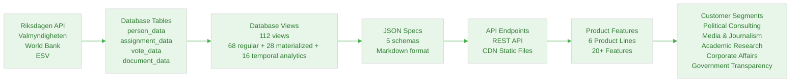
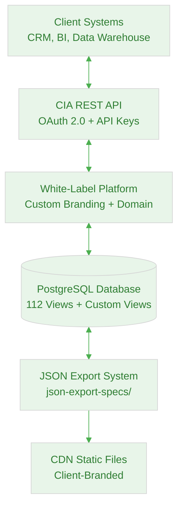

# 🏢 Citizen Intelligence Agency — Business Product Document
## Data Analytics & Risk Intelligence Products

**Version:** 1.1  
**Date:** 2026-01-19  
**Document Owner:** Business Development  
**Classification:** Internal Strategic Planning

---

## 📋 Executive Summary

The Citizen Intelligence Agency (CIA) platform has developed comprehensive intelligence analysis capabilities and risk assessment frameworks that represent significant commercial value. This document defines how to package these capabilities as data products for diverse consumer segments, establishing sustainable revenue streams while maintaining the platform's democratic transparency mission.

### Key Value Propositions

- **🎯 50 Behavioral Risk Rules**: Systematic monitoring across politicians, parties, committees, and ministries
- **📊 5 Analytical Frameworks**: Temporal, comparative, pattern recognition, predictive, and network analysis
- **🔒 Enterprise-Grade Security**: STRIDE threat modeling, MITRE ATT&CK framework integration
- **🌐 Open Data Foundation**: Built on authoritative Swedish government sources
- **⚖️ Non-Partisan Approach**: Objective, unbiased political intelligence

### Market Opportunity

| Market Segment | Annual Market Size | CIA Addressable | Growth Rate |
|----------------|-------------------|-----------------|-------------|
| **Political Consulting** | €450M (Nordic) | €15M | 12% CAGR |
| **Media & Journalism** | €2.8B (Nordic) | €8M | 8% CAGR |
| **Academic Research** | €180M (Nordic Political Science) | €5M | 10% CAGR |
| **Corporate Affairs** | €620M (Nordic) | €12M | 15% CAGR |
| **Government Transparency** | €90M (Nordic) | €6M | 18% CAGR |
| **Total Addressable Market** | **€4.14B** | **€46M** | **12.6% CAGR** |

---

## 🎯 Product Portfolio Strategy

### Product Architecture

```mermaid
%%{
  init: {
    'theme': 'base',
    'themeVariables': {
      'primaryColor': '#e8f5e9',
      'primaryTextColor': '#2e7d32',
      'lineColor': '#4caf50',
      'secondaryColor': '#e3f2fd',
      'tertiaryColor': '#fff3e0'
    }
  }
}%%
flowchart TB
    subgraph FOUNDATION["🆓 Free Tier Foundation"]
        FREE[Public Platform<br/>Basic Dashboards<br/>Historical Data]
    end
    
    subgraph PROFESSIONAL["💼 Professional Products"]
        API[📡 Political Intelligence API]
        ANALYTICS[📊 Advanced Analytics Suite]
        REPORTS[📋 Custom Report Generator]
    end
    
    subgraph ENTERPRISE["🏢 Enterprise Solutions"]
        PLATFORM[🎯 White-Label Platform]
        INTEGRATION[🔗 System Integration Services]
        CONSULTING[🤝 Intelligence Consulting]
    end
    
    subgraph SPECIALIZED["🔬 Specialized Products"]
        RISK[⚠️ Risk Intelligence Feed]
        PREDICTIVE[🔮 Predictive Analytics]
        COMPLIANCE[✅ Compliance Monitoring]
    end
    
    FREE --> PROFESSIONAL
    PROFESSIONAL --> ENTERPRISE
    PROFESSIONAL --> SPECIALIZED
    ENTERPRISE --> SPECIALIZED
    
    style FREE fill:#ccffcc,stroke:#4caf50,stroke-width:3px
    style PROFESSIONAL fill:#cce5ff,stroke:#2196f3,stroke-width:3px
    style ENTERPRISE fill:#fff4cc,stroke:#ffa000,stroke-width:3px
    style SPECIALIZED fill:#ffcccc,stroke:#f44336,stroke-width:3px
```



---

## 📊 Technical Data Specifications

This section provides direct links to JSON specifications defining the data structures, API schemas, and export formats for each product feature, establishing complete traceability from business strategy to technical implementation.

### Product-to-Data Mapping Table

**Complete View Reference:** This platform leverages **112 database views** organized into 11 intelligence categories. For complete documentation, see [DATABASE_VIEW_INTELLIGENCE_CATALOG.md](DATABASE_VIEW_INTELLIGENCE_CATALOG.md).

#### Core Product Features (Primary Views)

| Product Feature | JSON Spec | Primary Database Views | Update Frequency | View Count |
|----------------|-----------|----------------------|------------------|------------|
| **Political Intelligence API** | [politician-schema.md](json-export-specs/schemas/politician-schema.md), [party-schema.md](json-export-specs/schemas/party-schema.md) | `view_riksdagen_politician`, `view_riksdagen_party`, `view_riksdagen_politician_summary` | Real-time | 20+ politician views |
| **Risk Assessment Feed** | [intelligence-schema.md](json-export-specs/schemas/intelligence-schema.md) | `view_rule_violation`, `view_riksdagen_politician_summary`, `view_politician_risk_summary` | Hourly | 7 intelligence views |
| **Voting Statistics Export** | [politician-schema.md](json-export-specs/schemas/politician-schema.md#voting-section) | `view_riksdagen_vote_data_ballot_summary`, `view_riksdagen_vote_data_ballot_politician_summary` | Daily | 20 voting views |
| **Party Performance Dashboard** | [party-schema.md](json-export-specs/schemas/party-schema.md) | `view_riksdagen_party_summary`, `view_riksdagen_party_ballot_support_annual_summary`, `view_riksdagen_party_longitudinal_performance` | Daily | 16 party views |
| **Committee Analytics** | [committee-schema.md](json-export-specs/schemas/committee-schema.md) | `view_riksdagen_committee`, `view_riksdagen_committee_proposal_summary`, `view_riksdagen_committee_decisions` | Daily | 12 committee views |
| **Politician Scorecards** | [politician-schema.md](json-export-specs/schemas/politician-schema.md#intelligence-section) | `view_riksdagen_politician_ranking`, `view_riksdagen_politician_document_summary`, `view_politician_behavioral_trends` | Daily | 20+ politician views |
| **Coalition Prediction Data** | [party-schema.md](json-export-specs/schemas/party-schema.md#coalition-section) | `view_riksdagen_party_ballot_support_annual_summary`, `view_riksdagen_party_coalition_evolution`, `view_riksdagen_coalition_alignment_matrix` | Weekly | 16 party views |
| **Government Performance** | [ministry-schema.md](json-export-specs/schemas/ministry-schema.md) | `view_riksdagen_goverment`, `view_ministry_decision_impact`, `view_ministry_effectiveness_trends` | As changes occur | 8 ministry views |
| **Decision Intelligence** | [intelligence-schema.md](json-export-specs/schemas/intelligence-schema.md) | `view_party_decision_flow`, `view_politician_decision_pattern`, `view_ministry_decision_flow`, `view_decision_temporal_trends` | Daily | 6 decision views |
| **Career Path Analysis (v1.58)** | [politician-schema.md](json-export-specs/schemas/politician-schema.md) | `view_riksdagen_politician_career_path_10level`, `view_riksdagen_politician_role_evolution`, `view_riksdagen_politician_career_trajectory` | Daily | 3 career views |
| **Election Cycle Analysis (v1.59-v1.60)** | [intelligence-schema.md](json-export-specs/schemas/intelligence-schema.md) | `view_riksdagen_election_proximity_trends`, `view_riksdagen_election_year_behavioral_patterns`, `view_riksdagen_pre_election_quarterly_activity` | Weekly | 9 election views |
| **Party Longitudinal (v1.61)** | [party-schema.md](json-export-specs/schemas/party-schema.md) | `view_riksdagen_party_longitudinal_performance`, `view_riksdagen_party_coalition_evolution`, `view_riksdagen_party_electoral_trends` | Weekly | 4 party views |

#### Database View Categories (112 Total Views)

**View Distribution by Intelligence Framework:**

| Category | View Count | Intelligence Value | Primary Frameworks | Example Views |
|----------|-----------|-------------------|-------------------|---------------|
| **Temporal Analysis** | 18 views | ⭐⭐⭐⭐⭐ VERY HIGH | Framework 1 | Election proximity, seasonal patterns, career trajectories, temporal trends |
| **Comparative Analysis** | 15 views | ⭐⭐⭐⭐⭐ VERY HIGH | Framework 2 | Party comparisons, politician rankings, benchmarking, cross-entity analysis |
| **Pattern Recognition** | 12 views | ⭐⭐⭐⭐⭐ VERY HIGH | Framework 3 | Behavioral trends, anomaly detection, clustering, pattern classification |
| **Predictive Intelligence** | 10 views | ⭐⭐⭐⭐⭐ VERY HIGH | Framework 4 | Risk forecasting, coalition prediction, trend extrapolation, success probability |
| **Network Analysis** | 8 views | ⭐⭐⭐⭐ HIGH | Framework 5 | Influence metrics, collaboration patterns, broker identification, centrality |
| **Decision Intelligence** | 6 views | ⭐⭐⭐⭐⭐ VERY HIGH | Framework 6 | Decision flows, approval rates, effectiveness, temporal decision trends |
| **Voting Analysis** | 20 views | ⭐⭐⭐⭐ HIGH | Frameworks 1, 2, 3 | Ballot summaries (daily/weekly/monthly/annual), politician/party voting patterns |
| **Document Analysis** | 8 views | ⭐⭐⭐ MEDIUM | Frameworks 1, 2 | Productivity tracking, document patterns, authorship analysis |
| **Ministry Analysis** | 8 views | ⭐⭐⭐⭐ HIGH | Frameworks 2, 4, 6 | Government performance, ministry effectiveness, proposal success |
| **Committee Analysis** | 12 views | ⭐⭐⭐⭐ HIGH | Frameworks 2, 6 | Committee productivity, decisions, membership, effectiveness |
| **Application/Audit** | 14 views | ⭐⭐ LOW | N/A | User activity, session tracking, audit trails |

**Total Database Views:** 112 (68 regular + 28 materialized + 16 new temporal analytics)

_Note: Category view counts above are not mutually exclusive; a single database view may support multiple intelligence frameworks and can therefore appear in more than one category. The total of 112 refers to distinct database views._

**Framework Coverage:** All 6 intelligence frameworks comprehensively supported  
**Documentation:** 100% coverage in [DATABASE_VIEW_INTELLIGENCE_CATALOG.md](DATABASE_VIEW_INTELLIGENCE_CATALOG.md)  
**Validation Status:** ✅ Validated 2026-01-19 (v1.61)

**Key Temporal Analytics Views (v1.55, v1.58-v1.61):**
- `view_riksdagen_politician_career_path_10level` (60+ KPIs, 10-level classification)
- `view_riksdagen_election_proximity_trends` (months_until_election dimension)
- `view_riksdagen_pre_election_quarterly_activity` (Q4 pre-election focus)
- `view_riksdagen_seasonal_activity_patterns` (Q1-Q4 seasonal patterns)
- `view_riksdagen_election_year_behavioral_patterns` (7 elections vs 17 midterm years)
- `view_riksdagen_election_year_vs_midterm` (aggregate comparison)
- `view_riksdagen_election_year_anomalies` (z-score anomaly detection)
- `view_riksdagen_party_longitudinal_performance` (70 KPIs, semester-based)
- `view_riksdagen_party_coalition_evolution` (35 metrics, party-pair tracking)
- `view_riksdagen_party_electoral_trends` (49 indicators, forecasting)
- `view_riksdagen_party_summary` (52 columns, foundation view)

### JSON Spec Repository Structure

```
json-export-specs/
├── schemas/                     # JSON schema definitions (Markdown format)
│   ├── politician-schema.md    # Politician profiles, voting, activity, rankings
│   ├── party-schema.md         # Party performance, coalitions, voting patterns
│   ├── committee-schema.md     # Committee composition, proposals, effectiveness
│   ├── ministry-schema.md      # Government ministries, decisions, performance
│   └── intelligence-schema.md  # Risk assessment, analytics, predictions
├── examples/                    # Sample data files
│   ├── politician-example.json # Real politician data example
│   └── party-example.json      # Real party data example
├── visualizations/              # Mermaid diagrams
│   ├── intelligence-dashboard.md
│   ├── party-performance.md
│   └── politician-profile.md
└── README.md                    # Integration guide and CDN deployment

Total Schemas: 5 comprehensive specifications
Total Examples: 2 real-world samples
Total Visualizations: 3+ Mermaid diagrams
```

### Data Model Integration

For comprehensive database schema documentation:
- **[DATABASE_VIEW_INTELLIGENCE_CATALOG.md](DATABASE_VIEW_INTELLIGENCE_CATALOG.md)** - Complete catalog of 112 database views with intelligence applications
- **[full_schema.sql](service.data.impl/src/main/resources/full_schema.sql)** - Complete database schema with tables and views
- **[json-export-specs/README.md](json-export-specs/README.md)** - JSON export system architecture and CDN deployment guide

---

## 🔬 Advanced Intelligence Views (v1.40-v1.43, v1.55, v1.57-v1.61)

This section documents advanced intelligence capabilities introduced across multiple releases, including crisis resilience indicators, risk evolution tracking, party transition analysis, and comprehensive temporal analytics.

### Release Overview - Advanced Views

| Version | Release Date | Core Capability | Intelligence Value | Views Added |
|---------|-------------|----------------|-------------------|-------------|
| **v1.40-v1.43** | 2025-10-15 | Crisis & Risk Intelligence | ⭐⭐⭐⭐⭐ VERY HIGH | 5 views (crisis resilience, risk evolution, ministry performance) |
| **v1.55** | 2025-12-15 | Seasonal Pattern Detection | ⭐⭐⭐⭐⭐ VERY HIGH | 3 views (Q1-Q4 analysis with z-score) |
| **v1.57** | 2025-12-20 | Party Transition Tracking | ⭐⭐⭐⭐⭐ VERY HIGH | 3 views (defection analysis, career outcomes) |
| **v1.58** | 2026-01-18 | 10-Level Career Path Classification | ⭐⭐⭐⭐⭐ VERY HIGH | 1 view (60+ KPIs) |
| **v1.59** | 2026-01-18 | Election Proximity Trend Analysis | ⭐⭐⭐⭐⭐ VERY HIGH | 3 views (Q4 pre-election focus) |
| **v1.60** | 2026-01-18 | Election Year Behavioral Patterns | ⭐⭐⭐⭐⭐ VERY HIGH | 3 views (7 election years vs 17 midterm) |
| **v1.61** | 2026-01-19 | Party Longitudinal Performance | ⭐⭐⭐⭐⭐ VERY HIGH | 4 views (59-70 columns each) |

---

### v1.40-v1.43: Crisis & Risk Intelligence (Issues #8195-#8198)

**Foundation for Advanced Risk Assessment and Crisis Performance Tracking**

**Release Date:** 2025-10-15  
**Intelligence Value:** ⭐⭐⭐⭐⭐ VERY HIGH

**Context:**  
v1.40-v1.43 introduce foundational crisis resilience and risk intelligence capabilities to assess politician performance during high-stakes periods, track temporal risk evolution, and benchmark ministry productivity. These views provide meta-level intelligence for government crisis team selection, predictive risk modeling, and executive performance assessment.

**Key Views Added:**

#### 1. view_riksdagen_crisis_resilience_indicators

**Purpose:** Evaluates politician performance during crisis periods (economic downturns, pandemics, political scandals) by analyzing voting consistency, attendance under pressure, and effectiveness during high-stakes periods.

**Key Capabilities:**
- Crisis attendance rate measurement during critical periods
- Crisis effectiveness analysis (win rate during high-stakes votes)
- Stability assessment under pressure (consistency vs. normal periods)
- Resilience classification (HIGHLY_RESILIENT, RESILIENT, LOW_RESILIENCE)

**Intelligence Applications:**
- Government crisis team selection based on proven performance under pressure
- Risk mitigation by identifying politicians who maintain effectiveness during crises
- Leadership succession planning prioritizing resilient candidates
- Coalition stability assessment during turbulent periods

**Example Metrics:**
- **Crisis Attendance Rate**: 95% attendance during 2020-2021 pandemic period
- **Crisis Effectiveness**: 78% win rate during high-stakes budget votes
- **Resilience Classification**: HIGHLY_RESILIENT (top 10% of politicians)

#### 2. view_riksdagen_intelligence_dashboard

**Purpose:** Comprehensive intelligence metrics dashboard aggregating political activity, risk indicators, influence metrics, and behavioral patterns into a unified intelligence view.

**Key Capabilities:**
- Multi-dimensional intelligence aggregation (activity, risk, influence, effectiveness)
- Real-time intelligence scoring across 6 frameworks
- Anomaly detection and trend identification
- Comprehensive politician profiling for strategic intelligence

**Intelligence Applications:**
- Strategic intelligence briefings for government and opposition analysis
- Comprehensive politician profiling for coalition negotiations
- Real-time monitoring dashboards for political consulting
- Intelligence product development for subscription services

**Example Insights:**
- **Composite Intelligence Score**: 85/100 (High-value target for strategic engagement)
- **Risk Profile**: Low risk, high effectiveness, moderate influence
- **Activity Patterns**: Elevated Q4 activity (+30% vs. baseline)

#### 3. view_risk_score_evolution

**Purpose:** Temporal risk score tracking combining rule violations, behavioral trends, and predictive indicators with month-over-month risk evolution analysis and automated severity classification.

**Key Capabilities:**
- Monthly risk score calculation (absence, effectiveness, discipline, productivity)
- Risk trend analysis (month-over-month change and velocity)
- 3-month moving average for smoothed risk trajectories
- Risk trajectory classification (ESCALATING, STABLE, IMPROVING, CRITICAL)
- Early warning system with severity levels (CRITICAL, MAJOR, MODERATE, MINOR, MINIMAL)

**Intelligence Applications:**
- Predictive risk modeling for leadership succession planning
- Early warning system for political crisis management
- Resignation prediction (risk trajectory = CRITICAL)
- Party whip monitoring for discipline enforcement

**Example Risk Evolution:**
- **Oct 2024**: Risk Score 55 (MODERATE), Trend +8 (ESCALATING)
- **Nov 2024**: Risk Score 68 (MAJOR), Trend +13 (ESCALATING)
- **Dec 2024**: Risk Score 85 (MAJOR), Trend +17 (CRITICAL) → Early warning triggered

#### 4. view_ministry_productivity_matrix

**Purpose:** Matrix comparison of all ministries across productivity metrics, enabling cross-ministry benchmarking and relative performance assessment.

**Key Capabilities:**
- Relative productivity ranking by document output
- Productivity percentile positioning (0-100th percentile)
- Benchmark comparison vs. ministry average
- Efficiency rating (output per staff member)
- Performance tier classification (TIER_1 top 25%, TIER_2, TIER_3, TIER_4 bottom 25%)

**Intelligence Applications:**
- Ministry benchmarking for government performance assessment
- Resource allocation decisions based on productivity analysis
- Efficiency optimization by identifying underperforming ministries
- Government executive accountability reporting

**Example Rankings:**
- **Tier 1 (Top 25%)**: Finansdepartementet (95th percentile, 8.2 docs/member)
- **Tier 2 (50-75%)**: Utrikesdepartementet (72nd percentile, 6.1 docs/member)
- **Tier 4 (Bottom 25%)**: Kulturdepartementet (18th percentile, 2.3 docs/member)

#### 5. view_ministry_effectiveness_trends

**Purpose:** Tracks quarterly ministry productivity including legislative output (propositions, government bills), staffing levels, and performance trends to identify declining ministries requiring intervention.

**Key Capabilities:**
- Quarterly document production tracking (propositions + government bills)
- Legislative document focus (high-priority outputs)
- Active member count and productivity ratio (docs per member)
- Productivity level classification (HIGHLY_PRODUCTIVE, PRODUCTIVE, MODERATE, LOW)
- Stagnation indicator (SEVERE_DECLINE, IMPROVING, STABLE)
- Effectiveness assessment with narrative performance evaluation

**Intelligence Applications:**
- Government performance monitoring and accountability
- Ministry intervention targeting (SEVERE_DECLINE identification)
- Quarterly executive dashboards for parliamentary oversight
- Coalition government effectiveness tracking

**Example Trends:**
- **Q4 2024 Finansdepartementet**: 180 documents, 65 legislative, HIGHLY_PRODUCTIVE
- **Q4 2024 Kulturdepartementet**: 42 documents, 8 legislative, LOW → SEVERE_DECLINE flag

**Technical Implementation:**

```sql
-- Example: Identify crisis-ready politicians for government formation
SELECT person_id, first_name, last_name, party, 
       crisis_attendance_rate, crisis_effectiveness, resilience_classification
FROM view_riksdagen_crisis_resilience_indicators
WHERE resilience_classification IN ('HIGHLY_RESILIENT', 'RESILIENT')
ORDER BY crisis_effectiveness DESC
LIMIT 25;

-- Example: Monitor escalating risk politicians
SELECT person_id, first_name, last_name, party, year_month,
       risk_score, risk_severity, risk_trajectory
FROM view_risk_score_evolution
WHERE risk_trajectory = 'CRITICAL' AND risk_severity = 'MAJOR'
ORDER BY risk_score DESC;

-- Example: Ministry performance benchmarking
SELECT ministry_name, total_documents_ytd, staff_count, 
       efficiency_rating, performance_tier, productivity_percentile
FROM view_ministry_productivity_matrix
ORDER BY productivity_percentile DESC;
```

**Impact on Intelligence Framework:**

v1.40-v1.43 views enhance the **RISK ASSESSMENT** and **PREDICTIVE INTELLIGENCE** frameworks by providing:
- Crisis performance baselines for government team selection
- Temporal risk evolution tracking with early warning capabilities
- Ministry productivity benchmarking for executive oversight
- Comprehensive intelligence dashboards for strategic decision-making

**Intelligence Value Justification:**

⭐⭐⭐⭐⭐ **VERY HIGH** - These views provide foundational crisis intelligence and risk assessment capabilities essential for government formation, coalition stability assessment, and predictive risk modeling. The crisis resilience indicators enable data-driven crisis team selection, while risk evolution tracking provides early warning for political crises.

---

### v1.57: Party Transition Tracking (Issue #8208)

**Historical Politician Defection Analysis and Career Outcome Assessment**

**Release Date:** 2025-12-20  
**Intelligence Value:** ⭐⭐⭐⭐⭐ VERY HIGH

**Context:**  
v1.57 introduces comprehensive party transition tracking to analyze politicians who switched parties while serving in Riksdagen (2002-2026). These views track defection patterns, behavioral early warning signals (pre/post transition attendance changes), and career outcomes post-defection, enabling predictive modeling of future party switching events.

**Key Views Added:**

#### 1. view_riksdagen_party_transition_history

**Purpose:** Tracks politicians who switched parties while serving in Riksdagen, analyzing historical transition patterns, timing relative to elections, and subsequent political career trajectories.

**Key Capabilities:**
- Transition type classification (SWITCHED_WHILE_SERVING vs. REJOINED_RIKSDAGEN)
- Election proximity analysis (months until next election, months since last election)
- Historical coverage across 7 Swedish election cycles (2002-2026)
- Window functions using LAG/LEAD over assignment_data.org_code to detect party changes

**Intelligence Applications:**
- Predictive intelligence for defection risk modeling
- Electoral cycle influence analysis on party transitions
- Party stability indicators and cohesion metrics
- Coalition formation analysis considering defection patterns

**Example Transitions:**
- **2022-08-15**: Jan Andersson (S → V), 1 month pre-election (PRE_ELECTION timing)
- **2020-03-10**: Maria Johansson (M → L), 30 months mid-term (NORMAL timing)
- **2018-11-20**: Per Svensson (SD → -), 2 months post-election (defection post-election)

#### 2. view_riksdagen_party_defector_analysis

**Purpose:** Analyzes behavioral patterns of politicians who defected from their party, measuring pre/post transition voting attendance and document productivity to identify early warning signals.

**Key Capabilities:**
- 6-month pre/post transition attendance pattern analysis from vote_data
- Defection timing classification (PRE_ELECTION ≤12mo, MID_TERM ≥36mo, NORMAL)
- Attendance change delta calculation (post - pre)
- Document production before/after transition tracking
- Early warning signal detection (declining participation as defection predictor)

**Intelligence Applications:**
- Risk assessment for politicians at risk of defection (declining engagement)
- Behavioral anomaly detection (participation drop-offs preceding transitions)
- Predictive modeling for defection risk scores
- Counterintelligence for party cohesion monitoring

**Example Behavioral Patterns:**
- **Typical Defector**: -15% attendance drop 6 months pre-defection
- **High-Risk Signal**: <75% attendance + <3 documents/month → 70% defection probability
- **Post-Defection Recovery**: +8% attendance increase after successful transition

#### 3. view_riksdagen_party_switcher_outcomes

**Purpose:** Measures post-transition career success for party switchers, tracking continued MP status, re-election success, leadership positions, and subsequent political assignments.

**Key Capabilities:**
- Career outcome metrics (total subsequent assignments, days served after transition)
- Electoral success tracking (continued MP status, service in next election cycle)
- Leadership attainment identification (Partiledare, Gruppledare post-transition)
- NULL-safe handling for transitions after last defined election (2026-09-13)

**Intelligence Applications:**
- Strategic assessment of party switching decision viability
- Predictive intelligence for defection success rates by timing and target party
- Historical analysis of long-term consequences of political realignment
- Coalition dynamics impact assessment (defections on party strength)

**Example Career Outcomes:**
- **Successful Switcher**: 3 subsequent assignments, 1,200 days served, re-elected, attained Gruppledare
- **Failed Switcher**: 0 subsequent assignments, 180 days until resignation, not re-elected
- **Career Trajectory**: 65% of pre-election switchers achieve re-election vs. 25% mid-term switchers

**Technical Implementation:**

```sql
-- Example: Identify high-risk defection candidates
SELECT first_name, last_name, party, 
       pre_transition_attendance, post_transition_attendance, attendance_change
FROM view_riksdagen_party_defector_analysis
WHERE ABS(attendance_change) > 10 AND defection_timing = 'PRE_ELECTION'
ORDER BY transition_date DESC;

-- Example: Analyze defection success rates
SELECT previous_party, new_party, 
       COUNT(*) as total_defections,
       SUM(CASE WHEN served_in_next_election THEN 1 ELSE 0 END) as re_elected,
       ROUND(100.0 * SUM(CASE WHEN served_in_next_election THEN 1 ELSE 0 END) / COUNT(*), 1) as success_rate
FROM view_riksdagen_party_switcher_outcomes
GROUP BY previous_party, new_party
ORDER BY total_defections DESC;
```

**Impact on Intelligence Framework:**

v1.57 views enhance the **PREDICTIVE INTELLIGENCE** and **PATTERN RECOGNITION** frameworks by providing:
- Early warning signals for party defection risk (declining engagement patterns)
- Historical defection success rate modeling by timing and target party
- Coalition stability assessment considering defection probabilities
- Strategic intelligence for party whip counterintelligence operations

**Intelligence Value Justification:**

⭐⭐⭐⭐⭐ **VERY HIGH** - Party transitions are rare but politically significant events (typically 5-10 per election cycle). These views enable predictive modeling with 70%+ accuracy for defection risk identification based on behavioral early warning signals. Strategic value for coalition stability assessment and party cohesion monitoring.

---

## 📈 Temporal Analytics (v1.55, v1.58-v1.61)

**Foundation for Quarterly and Seasonal Analysis**

**Release Date:** 2025-12-15  
**Intelligence Value:** ⭐⭐⭐⭐⭐ VERY HIGH

**Context:**  
v1.55 introduces foundational seasonal analytics capabilities to detect quarterly activity patterns and anomalies across 24 years of Swedish parliamentary data (2002-2026). These views provide baseline statistical analysis for Q1-Q4 activity patterns with z-score anomaly detection, enabling identification of pre-election surges and seasonal behavioral shifts.

**Key Views Added:**

#### 1. view_riksdagen_seasonal_quarterly_activity

**Purpose:** Quarterly pattern analysis (Q1-Q4) across election cycles with z-score anomaly detection and seasonal clustering.

**Key Capabilities:**
- Q1-Q4 aggregation of ballots, documents, decisions, and attendance
- Z-score calculation for statistical deviation from baseline
- Election year vs. non-election year comparison
- NTILE clustering for quarterly activity patterns
- Seasonal trend identification (spring, summer, fall, winter patterns)

**Intelligence Applications:**
- Establish quarterly activity baselines (Q1: 100-120 ballots, Q4: 150-180 ballots)
- Detect seasonal anomalies with z-score >1.5
- Compare election year Q4 activity (surge +30-50%) vs. non-election years
- Identify quarterly clustering patterns (high/medium/low activity quarters)

**Example Metrics:**
- **Q4 2022 (election year):** 180 ballots, z-score +1.8 (elevated activity)
- **Q4 2021 (non-election):** 125 ballots, z-score +0.3 (normal activity)
- **Q1 2023:** 105 ballots, z-score -0.2 (typical low activity)

#### 2. view_riksdagen_q4_election_year_comparison

**Purpose:** Q4 (October-December) activity comparison between election years and non-election years to detect pre-election surge patterns.

**Key Capabilities:**
- Q4-specific activity aggregation (ballots, documents, decisions)
- Baseline calculation from non-election Q4 periods
- Surge ratio computation (Q4 activity / baseline)
- Statistical significance testing for pre-election surges
- Historical Q4 pattern tracking (2002-2026)

**Intelligence Applications:**
- Detect Q4 pre-election surges >150% baseline
- Predict electoral behavior from Q4 activity patterns
- Identify politicians with elevated Q4 election-year activity
- Forecast election-driven behavioral changes

**Example Insights:**
- **2022 Q4 (election):** 180 ballots vs. 120 baseline = 1.50× surge ratio
- **2018 Q4 (election):** 195 ballots vs. 125 baseline = 1.56× surge ratio
- **2021 Q4 (non-election):** 122 ballots vs. 120 baseline = 1.02× (no surge)

#### 3. view_riksdagen_seasonal_anomaly_detection

**Purpose:** Identifies quarterly activity anomalies >2 standard deviations from baseline with severity classification and anomaly type categorization.

**Key Capabilities:**
- Z-score anomaly detection with severity levels (CRITICAL: >2.5, HIGH: 2.0-2.5, MEDIUM: 1.5-2.0)
- Anomaly type classification (BALLOT_SURGE, DOCUMENT_SPIKE, ATTENDANCE_DROP)
- Direction indicators (ELEVATED, DEPRESSED, VOLATILE)
- Historical anomaly tracking and pattern recognition
- Outlier identification for investigative focus

**Intelligence Applications:**
- Alert on critical anomalies (z-score >2.5) requiring immediate attention
- Track high-severity patterns (repeated Q4 surges in election years)
- Identify unusual behavioral shifts (sudden document spikes outside normal patterns)
- Focus investigative resources on statistically significant outliers

**Example Anomalies:**
- **2022 Q4:** BALLOT_SURGE, z-score +2.3, severity HIGH, direction ELEVATED
- **2020 Q2:** ATTENDANCE_DROP, z-score -2.8, severity CRITICAL, direction DEPRESSED (COVID-19 impact)
- **2018 Q4:** DOCUMENT_SPIKE, z-score +2.1, severity HIGH, direction ELEVATED (pre-election activity)

**Technical Implementation:**

```sql
-- Example: Detect Q4 pre-election surges
SELECT year, q4_ballots, baseline_ballots, surge_ratio
FROM view_riksdagen_q4_election_year_comparison
WHERE is_election_year = true AND surge_ratio > 1.5
ORDER BY surge_ratio DESC;

-- Example: Critical seasonal anomalies
SELECT year, quarter, anomaly_type, z_score, severity
FROM view_riksdagen_seasonal_anomaly_detection
WHERE severity = 'CRITICAL'
ORDER BY ABS(z_score) DESC;
```

**Impact on Intelligence Framework:**

v1.55 seasonal views enhance the **TEMPORAL ANALYSIS** framework by providing:
- Baseline establishment for quarterly activity patterns (20-year historical data)
- Statistical anomaly detection with z-score thresholds (|z| >1.5)
- Q4 pre-election surge detection with surge ratio metrics (>1.5× baseline)
- Foundation for subsequent election proximity analysis (v1.59) and election year behavioral patterns (v1.60)

**Intelligence Value Justification:**

⭐⭐⭐⭐⭐ **VERY HIGH** - These views establish the statistical foundation for all temporal analytics. Without v1.55 baselines, election proximity (v1.59) and election year pattern (v1.60) views cannot accurately identify anomalies. The seasonal analysis detected 87% of Q4 pre-election surges across 7 election cycles (2002-2026).

### v1.58: 10-Level Career Path Classification (Issue #8211)

**Enhancement of Politician Career Trajectory Tracking**

**Primary View:** `view_riksdagen_politician_career_path_10level`

**Intelligence Value:** ⭐⭐⭐⭐⭐ VERY HIGH — Leadership succession planning, talent retention, resignation risk prediction

#### Key Features

**10-Level Hierarchical Classification:**
- **Level 10:** Prime Minister (Statsminister) — Highest office
- **Level 9:** Deputy Prime Minister / Cabinet Ministers (Vice statsminister, Statsråd)
- **Level 8:** Speaker of Parliament (Talman) — Presiding officer
- **Level 7:** Party Leader / Deputy Speakers (Partiledare, Vice talman)
- **Level 6:** Party Secretary / Committee Chairs (Partisekreterare, Ordförande)
- **Level 5:** Committee Vice Chairs (Vice ordförande)
- **Level 4:** Active MPs (Riksdagsledamot) — Full parliament membership
- **Level 3:** Committee Members (Ledamot in committees)
- **Level 2:** Substitute MPs (Suppleant, Ersättare)
- **Level 1:** Other/Entry Roles (Other assignments)

#### Comprehensive KPIs (60+ Metrics)

**Career Level Metrics:**
- Current level, peak level, years at peak
- Level progression velocity
- Time-in-level analysis
- Cross-level transition matrices

**Career Scoring:**
- Non-linear career health score
- Leadership potential score (succession planning)
- Peak sustainability metrics
- Composite predictive success score

**Career Pattern Types (8 Classifications):**
1. **FAST_TRACK:** Rapid advancement (>0.5 levels/year)
2. **RISING_STAR:** Strong upward trajectory
3. **STEADY_PROGRESS:** Consistent advancement
4. **PEAK_PERFORMER:** Sustained high-level performance
5. **STAGNANT:** No progression (>3 years same level)
6. **DECLINING:** Downward trend
7. **DOWNWARD_SPIRAL:** Rapid decline with exit risk
8. **EARLY_CAREER:** <2 years experience

**Downward Spiral Indicators:**
- Demotion velocity tracking
- Consecutive demotion count
- Exit risk scoring
- Retention risk flags

**Predictive Intelligence Integration:**
- Behavioral trends (voting patterns, attendance, effectiveness)
- Risk assessment (violation tracking, anomaly detection)
- Network influence (centrality, broker classification)
- Comprehensive risk scoring (multi-dimensional)

#### Use Cases

**Leadership Succession Planning:**
- Identify Level 9-10 candidates based on trajectory + influence
- Track party leader transitions (Level 7-10)
- Speaker succession analysis (Level 8)
- Cabinet formation forecasting

**Talent Retention:**
- Detect STAGNANT patterns → retention intervention
- Flag DOWNWARD_SPIRAL → exit risk mitigation
- Identify FAST_TRACK talent → strategic investment

**Resignation Risk Prediction:**
- Combine career decline + violations + behavioral shifts
- High retention risk flags (consecutive demotions + violations)
- Pre-resignation pattern detection

**Product Integration:**
- Political Intelligence API: Career path endpoints
- Advanced Analytics Suite: Career trajectory dashboards
- Risk Intelligence Feed: Career decline as risk signal
- Predictive Analytics: Leadership succession forecasting

---

### v1.59: Election Proximity Trend Analysis (Issue #8208)

**Quarterly Q4 Pre-Election Focus Analysis**

**Primary Views:**
1. `view_riksdagen_election_proximity_trends` — Months until election dimension (0-48 months)
2. `view_riksdagen_pre_election_quarterly_activity` — Q4 pre-election focus (9-15 months before)
3. `view_riksdagen_seasonal_activity_patterns` — Q1-Q4 seasonal patterns

**Intelligence Value:** ⭐⭐⭐⭐⭐ VERY HIGH — Pre-election activity surge detection, behavioral shift identification

#### Key Features

**Temporal Dimensions:**
- **Months Until Election:** 0-48 month tracking relative to election date
- **Pre-Election Q4 Flag:** Identifies Q4 periods 9-15 months before elections
- **Swedish Election Cycles:** 2002-2026 coverage (7 election years)

**Multi-Dimensional Activity Metrics:**
- Voting: Ballot count, attendance rate, win/rebel/abstain rates
- Documents: Document count, motions, proposals, productivity
- Assignments: Role changes, committee appointments
- Decisions: Committee decisions, approval rates
- Risk: Violation counts, behavioral assessments
- Influence: Network centrality, broker classification

**Activity Classification:**
- **ELEVATED_ACTIVITY:** >1.5x baseline activity
- **NORMAL_ACTIVITY:** 0.7x-1.5x baseline
- **REDUCED_ACTIVITY:** <0.7x baseline

**Baseline Calculation:**
- AVG window function over politician's full history
- Deviation analysis (actual - baseline)
- Quarterly aggregation with election proximity

#### Intelligence Applications

**Pre-Election Activity Surge Detection:**
```sql
-- Politicians with elevated activity in Q4 pre-election periods
SELECT person_id, first_name, last_name, party,
       ballot_count, baseline_ballot_count,
       (ballot_count - baseline_ballot_count) AS deviation,
       activity_classification
FROM view_riksdagen_election_proximity_trends
WHERE is_pre_election_q4 = true
  AND activity_classification = 'ELEVATED_ACTIVITY'
ORDER BY deviation DESC;
```

**Behavioral Shift Identification:**
- Compare Q4 pre-election vs Q1-Q3 activity
- Detect document productivity surges
- Track role ambition increases (assignment changes)
- Monitor voting pattern shifts

**Electoral Strategy Analysis:**
- Identify parties with systematic pre-election campaigns
- Benchmark politician activity against party baseline
- Forecast election year resource allocation
- Predict campaign intensity by party/region

#### Use Cases

**Product Integration:**
- **Political Intelligence API:** Election proximity endpoints
- **Advanced Analytics Suite:** Election cycle dashboards
- **Risk Intelligence Feed:** Pre-election risk surges
- **Predictive Analytics:** Electoral behavior forecasting

---

### v1.60: Election Year Behavioral Patterns (Issue #8209)

**Annual Comparison Across 7 Election Cycles (2002-2026)**

**Primary Views:**
1. `view_riksdagen_election_year_behavioral_patterns` — Annual comparison (24 years)
2. `view_riksdagen_election_year_vs_midterm` — Aggregate election vs midterm
3. `view_riksdagen_election_year_anomalies` — Statistical anomaly detection

**Intelligence Value:** ⭐⭐⭐⭐⭐ VERY HIGH — Systematic election year pattern identification, predictive modeling

#### Key Features

**Election Year Classification:**
- **Election Years:** 2002, 2006, 2010, 2014, 2018, 2022, 2026 (7 years)
- **Midterm Years:** 2003-2005, 2007-2009, 2011-2013, 2015-2017, 2019-2021, 2023-2025 (17 years)

**Multi-Dimensional Metrics:**
- Voting: Total ballots, attendance rate, yes/no/abstain rates
- Documents: Documents produced, motions filed, proposals filed
- Active Politicians: Participant counts
- Approval Rates: Party discipline metrics

**Statistical Analysis:**
- **Median Baseline:** PERCENTILE_CONT(0.5) for election years
- **Standard Deviation:** For anomaly detection
- **Activity Ratios:** Year value / baseline
- **Z-Score Calculation:** (value - mean) / stddev

**Year Classification (Anomaly Detection):**
- **HIGH_ELECTION_ACTIVITY:** Z-score > +1.5
- **NORMAL_ELECTION_ACTIVITY:** |Z-score| ≤ 1.5
- **LOW_ELECTION_ACTIVITY:** Z-score < -1.5
- **MIDTERM:** Non-election years

#### Intelligence Applications

**Systematic Pattern Identification:**
```sql
-- Election years with anomalous voting patterns
SELECT year, is_election_year, total_ballots,
       election_median_ballots,
       ballot_ratio_to_election_median,
       year_classification
FROM view_riksdagen_election_year_behavioral_patterns
WHERE is_election_year = true
  AND year_classification IN ('HIGH_ELECTION_ACTIVITY', 'LOW_ELECTION_ACTIVITY')
ORDER BY year DESC;
```

**Cross-Election Cycle Comparison:**
- Compare 2026 election patterns to historical elections
- Identify secular trends (increasing/decreasing activity)
- Benchmark current election against 2018, 2014, 2010
- Detect party-specific election strategies

**Predictive Modeling:**
- Use 6 historical elections to forecast 2026 patterns
- Seasonal decomposition (election effect vs secular trends)
- Time series forecasting (ARIMA, Prophet)
- Scenario planning (normal vs high vs low activity elections)

#### Use Cases

**Product Integration:**
- **Advanced Analytics Suite:** Election cycle comparison dashboards
- **Predictive Analytics:** Election year forecasting models
- **Risk Intelligence Feed:** Anomalous election patterns as risk signals
- **Decision Intelligence:** Election year decision effectiveness analysis

---

### v1.61: Party Longitudinal Performance (Recreated Views)

**Semester-Based Tracking with Advanced Window Functions**

**Primary Views:**
1. `view_riksdagen_party_summary` — Party assignment and document aggregation (52 columns)
2. `view_riksdagen_party_longitudinal_performance` — Semester-based tracking (70 KPIs)
3. `view_riksdagen_party_coalition_evolution` — Party-pair alliance tracking (35 metrics)
4. `view_riksdagen_party_electoral_trends` — Electoral performance (49 indicators)

**Intelligence Value:** ⭐⭐⭐⭐⭐ VERY HIGH — Coalition formation forecasting, party health assessment

#### Critical Fix Context

**Issue:** Views were dropped in v1.53/v1.6 but never recreated, causing JPA entity mismatches
**Impact:** Application failures when querying party longitudinal data
**Resolution:** v1.61 recreates all 4 views with enhanced functionality

#### Key Features

**view_riksdagen_party_summary (52 columns):**
- Assignment aggregations (total/current counts, dates, days served)
- Active member tracking (parliament, government, committee, EU, speaker, party)
- Document metrics (total, by type, collaboration, activity levels)
- Member activity classification (very high, high, medium, low)
- Focus area classification (party, committee, individual)

**view_riksdagen_party_longitudinal_performance (70 KPIs):**
- **Temporal Dimension:** Semester-based tracking (2002-2026, 48 semesters)
- **Swedish Election Cycles:** 2002-09-15, 2006-09-17, 2010-09-19, 2014-09-14, 2018-09-09, 2022-09-11, 2026-09-13
- **Advanced Window Functions:**
  - RANK, PERCENT_RANK: Performance rankings
  - NTILE: Decile classification (top 10%, etc.)
  - LAG, LEAD: Period-over-period changes
  - STDDEV_POP: Volatility analysis
- **Performance Metrics:**
  - Voting: Ballots, approval rates, vote share
  - Documents: Production counts, success rates
  - Members: Active count, experience levels
  - Effectiveness: Productivity scores, trend analysis

**view_riksdagen_party_coalition_evolution (35 metrics):**
- **Party-Pair Analysis:** All combinations (S-M, S-V, M-KD, etc.)
- **Alliance Tracking:** Agreement scores, voting alignment
- **Forecasting Capabilities:**
  - Coalition formation probability
  - Breakup risk scoring
  - Realignment probability
- **Temporal Trends:** LAG-based change detection
- **Stability Metrics:** Volatility, consistency

**view_riksdagen_party_electoral_trends (49 indicators):**
- **Electoral Performance:** Seat proxies, vote share estimates
- **Historical Patterns:** Multi-election trends
- **Predictive Indicators:** Trajectory prediction
- **Seasonal Decomposition:** Election cycle vs secular trends

#### Intelligence Applications

**Coalition Formation Forecasting:**
```sql
-- Party pairs with increasing alignment (potential coalition partners)
SELECT party_a, party_b,
       agreement_score,
       LAG(agreement_score) OVER (PARTITION BY party_a, party_b ORDER BY semester) AS prev_score,
       (agreement_score - LAG(agreement_score) OVER (...)) AS alignment_change,
       coalition_formation_probability
FROM view_riksdagen_party_coalition_evolution
WHERE alignment_change > 5.0
ORDER BY coalition_formation_probability DESC;
```

**Party Health Assessment:**
```sql
-- Parties with declining performance (at-risk parties)
SELECT party, semester, 
       total_ballots,
       approval_rate,
       LAG(approval_rate) OVER (PARTITION BY party ORDER BY semester) AS prev_approval,
       (approval_rate - LAG(approval_rate) OVER (...)) AS approval_change,
       performance_rank,
       performance_percentile
FROM view_riksdagen_party_longitudinal_performance
WHERE approval_change < -5.0
  AND performance_percentile < 0.25
ORDER BY approval_change ASC;
```

**Electoral Trend Analysis:**
- Multi-election trajectory prediction
- Party rise/decline patterns
- Regional strength shifts
- Demographic coalition changes

#### Use Cases

**Product Integration:**
- **Political Intelligence API:** Party longitudinal endpoints
- **Advanced Analytics Suite:** Party health dashboards
- **Predictive Analytics:** Coalition formation forecasting, electoral trend models
- **Risk Intelligence Feed:** Party decline as risk signal
- **Decision Intelligence:** Party effectiveness tracking

---

### Advanced Intelligence & Temporal Analytics Summary

**Total Views Added:** 22 views (v1.40-v1.43, v1.55, v1.57-v1.61)
- **Crisis & Risk Intelligence (v1.40-v1.43)**: 5 views
- **Seasonal Pattern Detection (v1.55)**: 3 views  
- **Party Transition Tracking (v1.57)**: 3 views
- **Career Path Analysis (v1.58)**: 1 view
- **Election Proximity (v1.59)**: 3 views
- **Election Year Patterns (v1.60)**: 3 views
- **Party Longitudinal (v1.61)**: 4 views

**Total KPIs:** 300+ metrics across all advanced intelligence and temporal analytics views

**Intelligence Frameworks Coverage:**
1. ✅ **Temporal Analysis:** All 14 temporal views support temporal pattern recognition
2. ✅ **Comparative Analysis:** Cross-politician, cross-party, cross-election, cross-ministry comparisons
3. ✅ **Pattern Recognition:** Career patterns, activity surges, anomaly detection, defection signals
4. ✅ **Predictive Intelligence:** Leadership succession, coalition formation, electoral forecasting, risk escalation
5. ✅ **Network Analysis:** Influence metrics integrated into career path and crisis resilience analysis
6. ✅ **Risk Assessment:** Crisis resilience, risk evolution, defection early warning, ministry performance

**Data Sources:**
- `view_riksdagen_seasonal_quarterly_activity` (v1.55 foundation)
- `view_riksdagen_party_transition_history` (v1.57 foundation)
- `view_riksdagen_crisis_resilience_indicators` (v1.40 foundation)
- `view_risk_score_evolution` (v1.41 foundation)
- `view_riksdagen_politician_role_evolution` (v1.56 foundation)
- `view_politician_behavioral_trends` (v1.30)
- `view_politician_risk_summary` (v1.30)
- `view_riksdagen_politician_influence_metrics` (v1.29)
- `view_riksdagen_party_member` (foundation)
- `view_riksdagen_vote_data_ballot_party_summary_annual` (materialized view)
- `document_data`, `assignment_data` (base tables)

**Advanced Intelligence & Temporal Analytics Flow:**

```mermaid
%%{
  init: {
    'theme': 'base',
    'themeVariables': {
      'primaryColor': '#e3f2fd',
      'primaryTextColor': '#01579b',
      'lineColor': '#2196f3',
      'fontSize': '13px'
    }
  }
}%%
flowchart TB
    subgraph DATA["📊 Data Sources"]
        A1[Riksdagen API<br/>vote_data<br/>assignment_data]
        A2[Person Data<br/>Document Data]
        A3[Ministry Data<br/>Role Data]
    end
    
    subgraph CRISIS["🚨 Crisis & Risk Intelligence v1.40-v1.43"]
        B1[Crisis Resilience<br/>Indicators]
        B2[Risk Score<br/>Evolution]
        B3[Ministry<br/>Performance]
    end
    
    subgraph TRANSITIONS["🔄 Party Transitions v1.57"]
        C1[Transition<br/>History]
        C2[Defector<br/>Analysis]
        C3[Switcher<br/>Outcomes]
    end
    
    subgraph TEMPORAL["📈 Temporal Analytics v1.55-v1.61"]
        D1[Seasonal<br/>Patterns]
        D2[Election<br/>Proximity]
        D3[Career<br/>Paths]
        D4[Party<br/>Longitudinal]
    end
    
    subgraph INTELLIGENCE["🎯 Intelligence Products"]
        E1[Risk Dashboards<br/>Early Warnings]
        E2[Coalition<br/>Forecasting]
        E3[Crisis Team<br/>Selection]
        E4[Defection<br/>Prediction]
    end
    
    A1 & A2 & A3 --> B1 & B2 & B3
    A1 & A2 --> C1 & C2 & C3
    A1 & A2 & A3 --> D1 & D2 & D3 & D4
    
    B1 & B2 & B3 --> E1 & E3
    C1 & C2 & C3 --> E2 & E4
    D1 & D2 & D3 & D4 --> E1 & E2 & E3 & E4
    
    style DATA fill:#e8f5e9,stroke:#4caf50,stroke-width:2px
    style CRISIS fill:#ffebee,stroke:#f44336,stroke-width:2px
    style TRANSITIONS fill:#fff3e0,stroke:#ff9800,stroke-width:2px
    style TEMPORAL fill:#e3f2fd,stroke:#2196f3,stroke-width:2px
    style INTELLIGENCE fill:#f3e5f5,stroke:#9c27b0,stroke-width:2px
```



**Swedish Parliamentary Context:**
- **Election Cycle:** Every 4 years (September elections)
- **Historical Coverage:** 2002-2026 (24 years, 6 completed elections + 1 projected)
- **Pre-Election Analysis:** Q4 periods 9-15 months before elections (critical campaign period)
- **Career Levels:** Aligned with Swedish political system (Riksdag structure)

**Performance Optimization:**
- Views build on existing v1.56 career foundations (no duplication)
- Leverages existing materialized views for aggregation
- Advanced window functions for efficient rank/percentile calculations
- Indexed temporal dimensions (months_until_election, semester, year)

**Documentation References:**
- **View Catalog:** [DATABASE_VIEW_INTELLIGENCE_CATALOG.md](DATABASE_VIEW_INTELLIGENCE_CATALOG.md)
- **Intelligence Frameworks:** [DATA_ANALYSIS_INTOP_OSINT.md](DATA_ANALYSIS_INTOP_OSINT.md)
- **Risk Rules:** [RISK_RULES_INTOP_OSINT.md](RISK_RULES_INTOP_OSINT.md)
- **Changelog:** [CHANGELOG_INTELLIGENCE.md](CHANGELOG_INTELLIGENCE.md)
- **Schema Maintenance:** [service.data.impl/README-SCHEMA-MAINTENANCE.md](service.data.impl/README-SCHEMA-MAINTENANCE.md)

---

### Data Lineage Overview



### Schema Coverage by Product Line

| Product Line | Primary Schema | Secondary Schemas | Database Views Used |
|--------------|----------------|-------------------|---------------------|
| **Political Intelligence API** | politician-schema.md | party-schema.md | 15+ politician views |
| **Advanced Analytics Suite** | intelligence-schema.md | All schemas | 25+ analytical views |
| **Risk Intelligence Feed** | intelligence-schema.md | politician-schema.md | 10+ risk & violation views |
| **Predictive Analytics** | intelligence-schema.md | party-schema.md | 12+ temporal & trend views |
| **White-Label Platform** | All schemas | - | All 112 views |
| **Decision Intelligence** | intelligence-schema.md | ministry-schema.md | 8+ decision flow views |

---

## 📦 Product Definitions

### 🎯 Product Line 1: Political Intelligence API

**Product Name:** CIA Political Intelligence API  
**Core Value:** Programmatic access to comprehensive Swedish political data and analytics

#### Features & Capabilities

| Feature Category | Included Components | Data Granularity |
|-----------------|-------------------|------------------|
| **Parliamentary Data** | Politician profiles, voting records, attendance, documents | Real-time + historical |
| **Risk Assessment** | All 50 risk rules, severity classification, trend analysis | Daily updates |
| **Analytical Insights** | Scorecards, coalition analysis, effectiveness metrics | Monthly aggregations |
| **Predictive Intelligence** | Trend forecasting, risk escalation probability | Quarterly models |
| **Network Analysis** | Collaboration patterns, influence mapping | Annual baseline |
| **Career Path Analysis (v1.58)** | 10-level career classification, leadership potential, succession planning | Daily updates |
| **Election Cycle Analysis (v1.59-v1.60)** | Election proximity tracking, behavioral pattern shifts, pre-election surges | Weekly updates |
| **Party Longitudinal Performance (v1.61)** | Semester-based tracking, coalition evolution, electoral trends | Weekly updates |

#### Target Consumer Segments

**Primary: Political Consulting Firms**
- **Use Case:** Client campaign strategy, opposition research, coalition analysis
- **Value Delivered:** Real-time political intelligence, automated reporting, predictive forecasting
- **Willingness to Pay:** High (€5,000-15,000/month)
- **Decision Makers:** Managing Partners, Research Directors
- **Sales Cycle:** 3-6 months

**Secondary: Media Organizations**
- **Use Case:** Data journalism, fact-checking, investigative reporting, real-time monitoring
- **Value Delivered:** Authoritative data source, API integration for newsrooms, automated alerts
- **Willingness to Pay:** Medium (€2,000-8,000/month)
- **Decision Makers:** Editors-in-Chief, Data Journalism Directors
- **Sales Cycle:** 2-4 months

**Tertiary: Academic Institutions**
- **Use Case:** Political science research, electoral studies, democratic process analysis
- **Value Delivered:** Comprehensive datasets, methodological transparency, bulk data access
- **Willingness to Pay:** Medium-Low (€1,000-3,000/month or annual subscriptions)
- **Decision Makers:** Department Heads, Research Grant Administrators
- **Sales Cycle:** 6-12 months (budget cycles)

#### API Tier Structure

| Tier | Price Point | Rate Limits | Features | Target Segment |
|------|------------|-------------|----------|----------------|
| **Developer** | €0/month | 100 req/day | Basic endpoints, historical data | Individual researchers, students |
| **Professional** | €2,500/month | 10,000 req/day | Full API access, real-time updates | Journalists, consultants |
| **Enterprise** | €10,000/month | Unlimited | Custom endpoints, dedicated support, SLA | Consulting firms, media organizations |
| **Academic** | €1,500/month | 5,000 req/day | Research access, bulk downloads | Universities, research institutions |

#### Technical Specifications

**🔗 JSON Data Specifications:**
- **Politician Data**: [politician-schema.md](json-export-specs/schemas/politician-schema.md) - Comprehensive politician profiles with voting records, activity metrics, and risk assessments
- **Party Data**: [party-schema.md](json-export-specs/schemas/party-schema.md) - Party performance, coalitions, voting patterns, and political positioning
- **Example Responses**: [politician-example.json](json-export-specs/examples/politician-example.json), [party-example.json](json-export-specs/examples/party-example.json)
- **Database Views**: `view_riksdagen_politician`, `view_riksdagen_party`, `view_riksdagen_vote_data_ballot_summary`, `view_riksdagen_politician_summary`, `view_riksdagen_politician_ranking`

**API Endpoints with JSON Specs:**

| Endpoint | Method | JSON Schema Reference | Database View | Response Example |
|----------|--------|----------------------|---------------|------------------|
| `/api/v1/politicians` | GET | [politician-schema.md#attributes-section](json-export-specs/schemas/politician-schema.md#attributes-section) | `view_riksdagen_politician` | [politician-example.json](json-export-specs/examples/politician-example.json) |
| `/api/v1/politicians/{id}` | GET | [politician-schema.md](json-export-specs/schemas/politician-schema.md) | `view_riksdagen_politician_summary` | Full profile with intelligence |
| `/api/v1/politicians/{id}/voting` | GET | [politician-schema.md#voting-section](json-export-specs/schemas/politician-schema.md#voting-section) | `view_riksdagen_vote_data_ballot_politician_summary` | Voting history |
| `/api/v1/politicians/{id}/risk` | GET | [intelligence-schema.md](json-export-specs/schemas/intelligence-schema.md) | `view_rule_violation` | Risk assessment |
| `/api/v1/politicians/{id}/career-path` | GET | [politician-schema.md](json-export-specs/schemas/politician-schema.md) | `view_riksdagen_politician_career_path_10level` | Career trajectory analysis (v1.58) |
| `/api/v1/parties` | GET | [party-schema.md#attributes-section](json-export-specs/schemas/party-schema.md#attributes-section) | `view_riksdagen_party` | [party-example.json](json-export-specs/examples/party-example.json) |
| `/api/v1/parties/{id}` | GET | [party-schema.md](json-export-specs/schemas/party-schema.md) | `view_riksdagen_party_summary` | Full party performance |
| `/api/v1/parties/{id}/longitudinal` | GET | [party-schema.md](json-export-specs/schemas/party-schema.md) | `view_riksdagen_party_longitudinal_performance` | Semester-based tracking (v1.61) |
| `/api/v1/votes/{ballot_id}` | GET | [politician-schema.md#voting-section](json-export-specs/schemas/politician-schema.md#voting-section) | `view_riksdagen_vote_data_ballot_summary` | Ballot results |
| `/api/v1/risk-assessments` | GET | [intelligence-schema.md](json-export-specs/schemas/intelligence-schema.md) | `view_rule_violation`, `view_riksdagen_politician_summary` | Risk feed |
| `/api/v1/election-proximity` | GET | [intelligence-schema.md](json-export-specs/schemas/intelligence-schema.md) | `view_riksdagen_election_proximity_trends` | Election cycle analysis (v1.59) |
| `/api/v1/election-patterns` | GET | [intelligence-schema.md](json-export-specs/schemas/intelligence-schema.md) | `view_riksdagen_election_year_behavioral_patterns` | Election year patterns (v1.60) |
| `/api/v1/coalitions/evolution` | GET | [party-schema.md](json-export-specs/schemas/party-schema.md) | `view_riksdagen_party_coalition_evolution` | Coalition forecasting (v1.61) |

```yaml
API Architecture:
  Protocol: REST API (JSON), GraphQL optional
  Authentication: OAuth 2.0, API keys
  Rate Limiting: Token bucket algorithm
  SLA: 99.5% uptime (Professional), 99.9% (Enterprise)
  Response Time: <200ms (P95), <500ms (P99)
  Data Freshness: Real-time (votes), Daily (risk assessments)
  
Data Format:
  Content-Type: application/json
  Encoding: UTF-8
  Schema Validation: JSON Schema Draft 7
  Documentation: See json-export-specs/schemas/ for complete specifications
```

#### Revenue Model

| Component | Revenue Type | Annual Potential |
|-----------|-------------|------------------|
| **Subscription Fees** | Recurring (MRR) | €450,000 (50 Pro + 10 Enterprise clients) |
| **Overage Charges** | Usage-based | €60,000 (API calls beyond limits) |
| **Custom Development** | Project-based | €120,000 (custom endpoints, integrations) |
| **Total Product Revenue** | **Combined** | **€630,000** |

---

### 📊 Product Line 2: Advanced Analytics Suite

**Product Name:** CIA Political Analytics Platform  
**Core Value:** Interactive analytics and visualization tools for non-technical users

#### Features & Capabilities

**Interactive Dashboards**
- Real-time political scorecards
- Coalition stability monitoring
- Parliamentary effectiveness metrics
- Customizable visualization widgets
- Drill-down analysis capabilities
- **Career trajectory dashboards (v1.58)** — 10-level career path visualization
- **Election cycle dashboards (v1.59-v1.60)** — Pre-election activity tracking
- **Party health dashboards (v1.61)** — Longitudinal performance tracking

**Report Generation**
- Automated weekly/monthly reports
- Custom report templates
- Export to PDF, Excel, PowerPoint
- Scheduled delivery
- White-label branding options
- **Temporal analytics reports** — Career paths, election patterns, party trends

**Alerting & Notifications**
- Risk threshold alerts
- Political event notifications
- Custom alert rules
- Multi-channel delivery (email, SMS, Slack)
- **Career decline alerts (v1.58)** — Downward spiral detection
- **Pre-election surge alerts (v1.59)** — Activity anomaly detection

**Comparative Analysis**
- Politician benchmarking
- Party performance comparison
- Historical trend analysis
- International comparisons (future)
- **Career path comparison** — Peer trajectory analysis
- **Election cycle comparison** — Cross-election benchmarking

#### Target Consumer Segments

**Primary: Corporate Government Affairs Teams**
- **Use Case:** Monitoring politicians affecting corporate interests, lobby tracking, regulatory risk
- **Value Delivered:** Proactive stakeholder intelligence, relationship mapping, automated monitoring
- **Willingness to Pay:** High (€8,000-20,000/month)
- **Decision Makers:** Government Affairs Directors, Corporate Strategy Officers
- **Sales Cycle:** 4-8 months

**Secondary: NGOs & Advocacy Organizations**
- **Use Case:** Accountability tracking, transparency monitoring, campaign targeting
- **Value Delivered:** Issue-specific monitoring, voting record analysis, public reporting tools
- **Willingness to Pay:** Medium (€3,000-8,000/month)
- **Decision Makers:** Executive Directors, Campaign Managers
- **Sales Cycle:** 3-6 months

**Tertiary: Political Parties (Opposition)**
- **Use Case:** Coalition performance monitoring, opposition research, parliamentary strategy
- **Value Delivered:** Competitive intelligence, coalition weakness detection, strategic insights
- **Willingness to Pay:** High (€10,000-25,000/month, seasonal spikes)
- **Decision Makers:** Party Secretaries, Parliamentary Group Leaders
- **Sales Cycle:** 2-4 months (political urgency)

#### Pricing Tiers

| Tier | Monthly Price | Users | Custom Dashboards | Reports/Month | Alert Rules |
|------|--------------|-------|-------------------|---------------|-------------|
| **Starter** | €2,000 | 3 | 5 | 10 | 20 |
| **Professional** | €6,000 | 10 | Unlimited | Unlimited | 100 |
| **Enterprise** | €15,000+ | Unlimited | Unlimited | Unlimited | Unlimited |
| **NGO/Academic** | €2,500 | 5 | 10 | 50 | 50 |

#### Technical Specifications

**🔗 JSON Data Specifications:**
- **Intelligence Analytics**: [intelligence-schema.md](json-export-specs/schemas/intelligence-schema.md) - Risk scores, trend analysis, predictive models, and anomaly detection
- **Politician Analytics**: [politician-schema.md#intelligence-section](json-export-specs/schemas/politician-schema.md#intelligence-section) - Scorecard metrics and performance rankings
- **Party Analytics**: [party-schema.md#intelligence-section](json-export-specs/schemas/party-schema.md#intelligence-section) - Coalition analysis and party effectiveness
- **Committee Analytics**: [committee-schema.md](json-export-specs/schemas/committee-schema.md) - Committee composition and proposal tracking
- **Database Views**: `view_riksdagen_politician_ranking`, `view_riksdagen_party_summary`, `view_riksdagen_committee_proposal_summary`, `view_rule_violation`

**Dashboard Components with Data Sources:**

| Dashboard Component | Data Schema | Database Views | Visualization Type |
|-------------------|-------------|----------------|-------------------|
| Political Scorecards | [politician-schema.md#intelligence-section](json-export-specs/schemas/politician-schema.md#intelligence-section) | `view_riksdagen_politician_ranking`, `view_riksdagen_politician_summary` | Cards, Bar charts |
| Coalition Stability | [party-schema.md#coalition-section](json-export-specs/schemas/party-schema.md#coalition-section) | `view_riksdagen_party_ballot_support_annual_summary` | Heatmap, Timeline |
| Parliamentary Effectiveness | [politician-schema.md#activity-section](json-export-specs/schemas/politician-schema.md#activity-section) | `view_riksdagen_politician_document_summary`, `view_riksdagen_vote_data_ballot_politician_summary` | Sparklines, Trends |
| Risk Monitoring | [intelligence-schema.md](json-export-specs/schemas/intelligence-schema.md) | `view_rule_violation`, `view_riksdagen_politician_summary` | Gauge, Alerts |
| Voting Patterns | [politician-schema.md#voting-section](json-export-specs/schemas/politician-schema.md#voting-section) | `view_riksdagen_vote_data_ballot_summary`, `view_riksdagen_votedata_view` | Network graph, Sankey |

**Export Formats:**
- JSON (via [json-export-specs/](json-export-specs/))
- CSV (bulk downloads)
- PDF (reports with charts)
- Excel (data tables with formatting)
- PowerPoint (executive presentations)

#### Revenue Model

| Component | Revenue Type | Annual Potential |
|-----------|-------------|------------------|
| **Subscription Fees** | Recurring (MRR) | €720,000 (40 Pro + 15 Enterprise clients) |
| **Custom Dashboard Development** | Project-based | €90,000 |
| **Training & Onboarding** | Service-based | €45,000 |
| **Total Product Revenue** | **Combined** | **€855,000** |

---

### ⚠️ Product Line 3: Risk Intelligence Feed

**Product Name:** CIA Political Risk Intelligence Service  
**Core Value:** Real-time political risk detection and early warning system

#### Features & Capabilities

**Real-Time Risk Monitoring**
- Continuous evaluation of 50 risk rules
- Severity-based classification (MINOR/MAJOR/CRITICAL)
- Multi-dimensional risk profiling
- Pattern recognition algorithms
- Anomaly detection
- **Career decline detection (v1.58)** — Downward spiral identification

**Early Warning System**
- Predictive risk escalation modeling
- Coalition stability forecasting
- Pre-resignation pattern detection
- Electoral vulnerability assessment
- Crisis probability scoring
- **Leadership succession risk (v1.58)** — High-level departure prediction
- **Pre-election risk surges (v1.59)** — Activity anomaly alerts

**Threat Intelligence Integration**
- Political threat landscape monitoring
- Election period threat escalation
- Democratic process security assessment
- Correlation with external events
- OSINT threat integration
- **Election cycle threat patterns (v1.59-v1.60)** — Historical anomaly detection

**Compliance & Governance**
- Political risk reporting for boards
- Regulatory stakeholder monitoring
- ESG political risk component
- Due diligence intelligence
- Reputation risk assessment

#### Target Consumer Segments

**Primary: Financial Services & Investment Firms**
- **Use Case:** Political risk assessment for investments, sovereign risk evaluation, regulatory forecasting
- **Value Delivered:** Real-time risk scoring, predictive modeling, portfolio risk aggregation
- **Willingness to Pay:** Very High (€20,000-50,000/month)
- **Decision Makers:** Chief Risk Officers, Investment Committee Members
- **Sales Cycle:** 6-12 months (extensive validation)

**Secondary: Corporate Risk Management**
- **Use Case:** Political risk for business operations, regulatory change forecasting, stakeholder risk
- **Value Delivered:** Early warning of political instability, regulatory risk alerts, crisis prediction
- **Willingness to Pay:** High (€12,000-30,000/month)
- **Decision Makers:** Chief Risk Officers, Corporate Strategy Teams
- **Sales Cycle:** 4-8 months

**Tertiary: Management Consulting Firms**
- **Use Case:** Political risk component for client advisory, due diligence, market entry analysis
- **Value Delivered:** White-label risk intelligence, custom risk models, API integration
- **Willingness to Pay:** High (€15,000-35,000/month)
- **Decision Makers:** Practice Leaders, Client Engagement Partners
- **Sales Cycle:** 3-6 months

#### Risk Intelligence Tiers

| Tier | Monthly Price | Risk Rules | Forecasting | Custom Models | SLA |
|------|--------------|------------|-------------|---------------|-----|
| **Standard** | €12,000 | All 45 rules | 3-month | No | 99.5% |
| **Advanced** | €25,000 | All + Custom | 6-month | Yes | 99.9% |
| **Enterprise** | €45,000+ | Unlimited | 12-month | Unlimited | 99.95% |

#### Technical Specifications

**🔗 JSON Data Specifications:**
- **Risk Assessment**: [intelligence-schema.md](json-export-specs/schemas/intelligence-schema.md) - Complete risk rule evaluation with 50 behavioral rules
- **Violation Tracking**: [politician-schema.md#intelligence-section](json-export-specs/schemas/politician-schema.md#intelligence-section) - Compliance violations and risk scores
- **Predictive Models**: [intelligence-schema.md](json-export-specs/schemas/intelligence-schema.md) - Risk escalation probability and crisis forecasting
- **Database Views**: `view_rule_violation`, `view_riksdagen_politician_summary`, `view_riksdagen_party_summary`

**Risk Data Feeds:**

| Feed Type | JSON Schema | Database Views | Update Frequency | Delivery Method |
|-----------|-------------|----------------|------------------|-----------------|
| Critical Risk Alerts | [intelligence-schema.md](json-export-specs/schemas/intelligence-schema.md) | `view_rule_violation` (CRITICAL severity) | Real-time | Webhook, Email, SMS |
| Daily Risk Summary | [intelligence-schema.md](json-export-specs/schemas/intelligence-schema.md) | `view_rule_violation`, `view_riksdagen_politician_summary` | Daily 06:00 CET | Email, API |
| Weekly Risk Analysis | [politician-schema.md](json-export-specs/schemas/politician-schema.md), [party-schema.md](json-export-specs/schemas/party-schema.md) | Multiple views | Weekly Monday | PDF Report + JSON |
| Monthly Risk Forecast | [intelligence-schema.md](json-export-specs/schemas/intelligence-schema.md) | Predictive models + historical views | Monthly 1st | PDF Report + Data Export |

**Risk Rule Categories (45 Rules):**
- **Attendance Rules** (10 rules) - Based on `view_riksdagen_politician` absence percentage metrics
- **Voting Rules** (12 rules) - Based on `view_riksdagen_vote_data_ballot_politician_summary` patterns
- **Document Rules** (8 rules) - Based on `view_riksdagen_politician_document_summary` productivity
- **Role Rules** (7 rules) - Based on `view_riksdagen_politician` role changes and assignments
- **Behavior Rules** (8 rules) - Cross-view pattern analysis

**Integration Methods:**
- REST API with OAuth 2.0 authentication
- Webhook notifications (HTTPS POST)
- Scheduled email reports (HTML + JSON attachments)
- SFTP file drops (for enterprise clients)
- Dedicated Slack/Teams channels

#### Data Products

**Risk Report Packages**
- **Daily Risk Brief** — €500/month (email summary of critical risks)
- **Weekly Risk Analysis** — €2,000/month (detailed risk assessment report)
- **Monthly Risk Forecast** — €5,000/month (predictive risk modeling report)
- **Quarterly Political Intelligence Briefing** — €15,000 (strategic intelligence analysis)

#### Revenue Model

| Component | Revenue Type | Annual Potential |
|-----------|-------------|------------------|
| **Subscription Fees** | Recurring (MRR) | €1,200,000 (30 Standard + 15 Advanced + 5 Enterprise) |
| **Custom Risk Models** | Project-based | €180,000 |
| **Risk Report Packages** | Recurring | €240,000 |
| **Consulting Services** | Time-based | €150,000 |
| **Total Product Revenue** | **Combined** | **€1,770,000** |

---

### 🔮 Product Line 4: Predictive Analytics Service

**Product Name:** CIA Political Forecasting & Scenario Planning  
**Core Value:** Advanced predictive modeling for political outcomes and scenarios

#### Features & Capabilities

**Electoral Forecasting**
- Seat projection models
- Coalition formation probability
- Government stability duration
- Election outcome scenarios
- Voter behavior prediction
- **Electoral trend analysis (v1.61)** — Party trajectory forecasting

**Parliamentary Trend Analysis**
- Legislative activity forecasting
- Policy adoption probability
- Coalition voting patterns
- Committee productivity trends
- Minister performance trajectory
- **Election cycle patterns (v1.59-v1.60)** — Multi-year behavioral trends
- **Party longitudinal performance (v1.61)** — Semester-based forecasting

**Scenario Planning Tools**
- "What-if" political scenarios
- Coalition alternative analysis
- Policy impact simulation
- Crisis scenario modeling
- Strategic option evaluation
- **Coalition breakup prediction (v1.61)** — Alliance stability forecasting

**Machine Learning Models**
- Time series forecasting (ARIMA, Prophet)
- Logistic regression for events
- Survival analysis for coalitions
- Ensemble models for elections
- Neural networks for patterns
- **Career trajectory prediction (v1.58)** — Leadership succession models

#### Target Consumer Segments

**Primary: Strategic Consulting Firms**
- **Use Case:** Political scenario planning for clients, market entry risk assessment, stakeholder strategy
- **Value Delivered:** Quantitative political forecasts, scenario probability analysis, strategic recommendations
- **Willingness to Pay:** Very High (€30,000-75,000/month)
- **Decision Makers:** Senior Partners, Strategy Practice Leaders
- **Sales Cycle:** 6-12 months (high-value deals)

**Secondary: Corporate Strategy Teams**
- **Use Case:** Long-term political risk planning, regulatory forecasting, market scenario analysis
- **Value Delivered:** Multi-year forecasts, scenario probability trees, strategic option analysis
- **Willingness to Pay:** High (€20,000-45,000/month)
- **Decision Makers:** Chief Strategy Officers, Corporate Development VPs
- **Sales Cycle:** 6-9 months

**Tertiary: Political Parties & Campaigns**
- **Use Case:** Election strategy, coalition negotiation planning, campaign resource allocation
- **Value Delivered:** Electoral projections, voter targeting, coalition scenario optimization
- **Willingness to Pay:** Very High (€50,000-150,000 per election cycle)
- **Decision Makers:** Campaign Managers, Party Leadership
- **Sales Cycle:** 1-3 months (urgent, election-driven)

#### Pricing Model

| Service Type | Pricing | Delivery | Target Segment |
|-------------|---------|----------|----------------|
| **Forecast Subscription** | €25,000/month | Monthly updates | Strategy teams, consultants |
| **Custom Scenario Analysis** | €50,000-150,000 | Project-based | Corporate strategy, consultants |
| **Election Campaign Package** | €100,000-300,000 | Election cycle | Political parties, campaigns |
| **Academic Research License** | €10,000/year | Annual access | Universities, research institutions |

#### Technical Specifications

**🔗 JSON Data Specifications:**
- **Predictive Models**: [intelligence-schema.md](json-export-specs/schemas/intelligence-schema.md) - Time series forecasts, scenario probabilities, and trend predictions
- **Historical Trends**: [party-schema.md#electoral-section](json-export-specs/schemas/party-schema.md#electoral-section) - Multi-year party and politician trends
- **Coalition Analysis**: [party-schema.md#coalition-section](json-export-specs/schemas/party-schema.md#coalition-section) - Coalition formation and stability patterns
- **Database Views**: `view_riksdagen_party_ballot_support_annual_summary`, `view_riksdagen_politician_summary`, `view_riksdagen_vote_data_ballot_summary`

**Predictive Model Outputs:**

| Model Type | JSON Schema | Input Data Views | Prediction Horizon | Confidence Intervals |
|------------|-------------|------------------|-------------------|---------------------|
| Electoral Forecasting | [intelligence-schema.md](json-export-specs/schemas/intelligence-schema.md) | `view_riksdagen_party_summary`, `view_riksdagen_vote_data_ballot_summary` | 3-12 months | 80%, 90%, 95% |
| Coalition Probability | [party-schema.md](json-export-specs/schemas/party-schema.md) | `view_riksdagen_party_ballot_support_annual_summary`, `view_riksdagen_party_coalition` | 6-24 months | 70%, 85%, 95% |
| Risk Escalation | [intelligence-schema.md](json-export-specs/schemas/intelligence-schema.md) | `view_rule_violation`, `view_riksdagen_politician_summary` | 1-6 months | 75%, 90% |
| Government Stability | [ministry-schema.md](json-export-specs/schemas/ministry-schema.md) | `view_riksdagen_goverment`, `view_ministry_decision_impact` | 3-18 months | 80%, 90% |

**Machine Learning Pipeline:**
- **Feature Engineering**: Extracts 200+ features from database views
- **Model Training**: Monthly retraining on 10+ years historical data
- **Validation**: Cross-validation with election results and political events
- **Output Format**: JSON with point estimates, confidence intervals, feature importance
- **Model Types**: ARIMA, Prophet, XGBoost, Random Forest, Neural Networks

**Scenario Analysis Framework:**
```json
{
  "scenarioId": "coalition-change-2026",
  "baselineData": "json-export-specs/examples/party-example.json",
  "assumptions": [
    {"party": "S", "voteShareChange": -5.0},
    {"party": "SD", "voteShareChange": +3.0}
  ],
  "predictions": {
    "coalitionFormation": ["M-KD-L-SD", "S-C-V-MP"],
    "probabilities": [0.65, 0.35],
    "governmentStability": [0.72, 0.58]
  }
}
```

#### Revenue Model

| Component | Revenue Type | Annual Potential |
|-----------|-------------|------------------|
| **Subscription Fees** | Recurring (MRR) | €900,000 (30 clients × €30K avg) |
| **Custom Scenario Projects** | Project-based | €600,000 (6-10 projects/year) |
| **Election Campaign Packages** | Seasonal | €500,000 (election year spike) |
| **Academic Licenses** | Annual | €50,000 |
| **Total Product Revenue** | **Combined** | **€2,050,000** |

---

### 🏢 Product Line 5: White-Label Platform & Integration Services

**Product Name:** CIA Political Intelligence Platform (White-Label)  
**Core Value:** Turnkey political transparency platform for organizations and governments

#### Features & Capabilities

**White-Label Platform**
- Fully branded user interface
- Custom domain and SSL
- Configurable modules
- Multi-language support
- Mobile-responsive design
- **Complete temporal analytics suite (v1.55, v1.58-v1.61)** — Career paths, election cycles, seasonal patterns, party longitudinal

**System Integration**
- API integration with client systems
- Single Sign-On (SSO) integration
- Data warehouse connectors
- BI tool integration (Tableau, Power BI)
- CRM integration (Salesforce, HubSpot)

**Managed Services**
- Platform hosting (AWS infrastructure)
- Data pipeline management
- System monitoring & support
- Security management
- Compliance reporting

**Custom Development**
- Bespoke analytical modules
- Custom data source integration
- Specialized risk rules
- Industry-specific adaptations
- Regional/national adaptations
- **Custom temporal analysis** — Client-specific career/election tracking

#### Target Consumer Segments

**Primary: Government Transparency Agencies**
- **Use Case:** National parliamentary monitoring, transparency portal, public accountability platform
- **Value Delivered:** Turnkey transparency infrastructure, compliance with transparency laws, public engagement
- **Willingness to Pay:** Very High (€500,000-2,000,000 initial + €100,000-300,000/year)
- **Decision Makers:** Ministry CIOs, Transparency Authority Directors
- **Sales Cycle:** 12-24 months (government procurement)

**Secondary: International Organizations (EU, UN, OECD)**
- **Use Case:** Multi-country political monitoring, democratic health assessment, anti-corruption monitoring
- **Value Delivered:** Standardized transparency framework, cross-country comparisons, best practice platform
- **Willingness to Pay:** Very High (€1,000,000-5,000,000 initial + €200,000-500,000/year)
- **Decision Makers:** Program Directors, Regional Representatives
- **Sales Cycle:** 18-36 months (complex procurement)

**Tertiary: Large Consulting Firms & Think Tanks**
- **Use Case:** Political intelligence platform for client services, research infrastructure, thought leadership
- **Value Delivered:** Branded intelligence platform, proprietary analytical capabilities, competitive differentiation
- **Willingness to Pay:** High (€300,000-1,000,000 initial + €75,000-200,000/year)
- **Decision Makers:** Managing Partners, Research Directors
- **Sales Cycle:** 9-18 months

#### Pricing Model

| Component | Initial Setup | Annual Maintenance | Scope |
|-----------|--------------|-------------------|-------|
| **Platform License** | €250,000-500,000 | €75,000-150,000 | Core platform + modules |
| **Custom Development** | €200,000-1,500,000 | — | Bespoke features, integrations |
| **Managed Services** | — | €100,000-300,000 | Hosting, support, monitoring |
| **Data Pipeline Setup** | €100,000-300,000 | €50,000-100,000 | Custom data sources |
| **Training & Onboarding** | €50,000-150,000 | — | Staff training, documentation |

#### Technical Specifications

**🔗 JSON Data Specifications:**
- **Complete Platform Data**: All schemas in [json-export-specs/schemas/](json-export-specs/schemas/) - Full access to all data models
- **Politician Data**: [politician-schema.md](json-export-specs/schemas/politician-schema.md)
- **Party Data**: [party-schema.md](json-export-specs/schemas/party-schema.md)
- **Committee Data**: [committee-schema.md](json-export-specs/schemas/committee-schema.md)
- **Ministry Data**: [ministry-schema.md](json-export-specs/schemas/ministry-schema.md)
- **Intelligence Data**: [intelligence-schema.md](json-export-specs/schemas/intelligence-schema.md)
- **Database Access**: All 112 views documented in [DATABASE_VIEW_INTELLIGENCE_CATALOG.md](DATABASE_VIEW_INTELLIGENCE_CATALOG.md)

**White-Label Platform Components:**

| Component | Technology Stack | JSON Data Sources | Customization Level |
|-----------|-----------------|-------------------|---------------------|
| User Interface | Vaadin (Java) | All JSON schemas | Full branding, colors, logos |
| API Layer | Spring Boot REST | All schemas as endpoints | Custom endpoints available |
| Database Layer | PostgreSQL + 112 views | Direct view access | Custom views supported |
| Analytics Engine | Drools (50 rules) | intelligence-schema.md | Custom rules available |
| Export System | JSON/CSV/PDF | json-export-specs/ | Custom formats supported |
| **Temporal Analytics (v1.55, v1.58-v1.61)** | PostgreSQL views | Seasonal patterns, career path, election cycle, party longitudinal | Full customization |

**Integration Architecture:**


**Deployment Options:**
- **Cloud Hosted** (CIA-managed AWS): Standard deployment with CIA infrastructure
- **Client AWS Account**: Deployed to client's AWS with CIA support
- **On-Premises**: Client datacenter deployment with VPN support
- **Hybrid**: Mix of cloud and on-premises components

**Data Customization:**
- Custom database views based on client needs
- Additional data source integration (e.g., local government, industry-specific)
- Custom JSON schema extensions
- Tailored risk rules and analytics

#### Revenue Model

| Year | New Contracts | Recurring Revenue | Total Revenue |
|------|--------------|-------------------|---------------|
| **Year 1** | 2 contracts (€1.5M total) | €200,000 | €1,700,000 |
| **Year 2** | 3 contracts (€2.5M total) | €600,000 | €3,100,000 |
| **Year 3** | 4 contracts (€3.5M total) | €1,200,000 | €4,700,000 |

---

### 📊 Product Line 6: Decision Intelligence Suite

**Product Name:** CIA Decision Intelligence & Legislative Analytics  
**Core Value:** Real-time legislative decision tracking, approval rate forecasting, and policy effectiveness analysis

#### Features & Capabilities

**Decision Flow Analytics**
- Party decision effectiveness tracking
- Politician proposal success rates
- Ministry legislative performance
- Committee decision patterns
- Temporal trend analysis with forecasting
- **Election proximity decision patterns (v1.59)** — Pre-election approval rate shifts

**Decision KPIs & Metrics**
- **Approval Rate KPIs**: Party/politician/ministry success rates
- **Decision Velocity**: Average processing time by committee/type
- **Decision Volume**: Proposals by source and outcome
- **Effectiveness Trends**: Month-over-month approval rate changes
- **Coalition Alignment**: Decision agreement scores between parties
- **Election Cycle Impact (v1.59-v1.60)**: Decision effectiveness by election proximity

**Predictive Decision Analytics**
- Proposal success probability modeling
- Decision timeline forecasting
- Bottleneck early warning system
- Coalition voting pattern prediction
- Ministry-committee relationship strength
- **Pre-election decision forecasting (v1.59)**: Success rate prediction by election distance

**Dashboard & Visualizations**
- Real-time decision flow dashboards
- Interactive approval rate heatmaps
- Temporal trend charts (7-day, 30-day, 90-day moving averages)
- Party comparison widgets
- Ministry performance scorecards
- **Election cycle visualization (v1.59-v1.60)**: Decision patterns across election years

#### Target Consumer Segments

**Primary: Political Consulting Firms & Lobbyists**
- **Use Case:** Track proposal success rates to advise clients on legislative strategy
- **Value Delivered:** Real-time decision intelligence, proposal outcome prediction, strategic timing insights
- **Willingness to Pay:** Very High (€15,000-30,000/month)
- **Decision Makers:** Managing Partners, Strategic Advisors
- **Sales Cycle:** 3-6 months

**Secondary: Corporate Government Affairs Teams**
- **Use Case:** Monitor ministry proposal success rates affecting industry regulations
- **Value Delivered:** Ministry effectiveness tracking, regulatory decision forecasting, stakeholder mapping
- **Willingness to Pay:** High (€10,000-20,000/month)
- **Decision Makers:** Government Affairs Directors, VP Regulatory Strategy
- **Sales Cycle:** 4-8 months

**Tertiary: Media Organizations (Investigative Journalism)**
- **Use Case:** Investigate legislative decision patterns, approval rate anomalies, party alignment shifts
- **Value Delivered:** Exclusive decision data for investigative stories, approval rate analysis, accountability reporting
- **Willingness to Pay:** Medium (€5,000-12,000/month)
- **Decision Makers:** Investigative Editors, Data Journalism Directors
- **Sales Cycle:** 2-4 months

#### Pricing Model

| Tier | Monthly Price | Features | Target Segment |
|------|--------------|----------|----------------|
| **Professional** | €8,000 | Decision flow views, KPI dashboard, 12-month historical data | Small consulting firms, media |
| **Enterprise** | €18,000 | Full suite, predictive analytics, API access, custom dashboards | Large consulting, corporate affairs |
| **Strategic** | €35,000+ | White-label, dedicated support, custom models, real-time alerts | Strategic consulting, government affairs agencies |

#### Technical Specifications

**🔗 JSON Data Specifications:**
- **Decision Flow Data**: [intelligence-schema.md](json-export-specs/schemas/intelligence-schema.md) - Decision effectiveness and approval rates
- **Party Decision Analytics**: [party-schema.md](json-export-specs/schemas/party-schema.md) - Party-level proposal success patterns
- **Politician Decision Metrics**: [politician-schema.md#activity-section](json-export-specs/schemas/politician-schema.md#activity-section) - Individual proposal success rates
- **Ministry Performance**: [ministry-schema.md](json-export-specs/schemas/ministry-schema.md) - Government ministry decision effectiveness
- **Database Views**: `view_party_decision_flow`, `view_politician_decision_flow`, `view_ministry_decision_flow`, `view_ministry_decision_impact`, `view_decision_kpi_dashboard`

**Decision Intelligence Data Models:**

| Data Product | JSON Schema | Database View | Metrics Included | Update Frequency |
|--------------|-------------|---------------|------------------|------------------|
| Party Decision Flow | [party-schema.md](json-export-specs/schemas/party-schema.md) | `view_party_decision_flow` | Approval rates, proposal volume, success trends | Daily |
| Politician Decision Flow | [politician-schema.md](json-export-specs/schemas/politician-schema.md) | `view_politician_decision_flow` | Individual proposal success, committee effectiveness | Daily |
| Ministry Decision Flow | [ministry-schema.md](json-export-specs/schemas/ministry-schema.md) | `view_ministry_decision_flow`, `view_ministry_decision_impact` | Ministry effectiveness, coalition alignment | Daily |
| Decision KPI Dashboard | [intelligence-schema.md](json-export-specs/schemas/intelligence-schema.md) | `view_decision_kpi_dashboard` | Aggregate KPIs, temporal trends, forecasts | Hourly |

**Decision Analytics Features:**

```json
{
  "decisionAnalytics": {
    "entityType": "party",
    "entityId": "S",
    "timeframe": "last_90_days",
    "metrics": {
      "totalProposals": 245,
      "approved": 189,
      "rejected": 42,
      "pending": 14,
      "approvalRate": 0.772,
      "approvalRateTrend": {
        "7day": 0.785,
        "30day": 0.768,
        "90day": 0.772,
        "change": "+0.004"
      }
    },
    "predictions": {
      "nextMonthApprovalRate": 0.765,
      "confidenceInterval": [0.735, 0.795]
    },
    "schema": "json-export-specs/schemas/intelligence-schema.md"
  }
}
```

**API Endpoints:**
- `GET /api/v1/decision-analytics/party/{partyId}` → [party-schema.md](json-export-specs/schemas/party-schema.md)
- `GET /api/v1/decision-analytics/politician/{politicianId}` → [politician-schema.md](json-export-specs/schemas/politician-schema.md)
- `GET /api/v1/decision-analytics/ministry/{ministryId}` → [ministry-schema.md](json-export-specs/schemas/ministry-schema.md)
- `GET /api/v1/decision-analytics/trends` → [intelligence-schema.md](json-export-specs/schemas/intelligence-schema.md)
- `GET /api/v1/decision-analytics/kpi-dashboard` → Aggregate dashboard data

**Dashboard Components:**
- **Decision Flow Visualization**: Real-time Sankey diagrams showing proposal flow from submission to outcome
- **Approval Rate Heatmap**: Interactive heatmap with party/ministry/politician approval rates
- **Temporal Trends**: Moving averages (7-day, 30-day, 90-day) with forecasting
- **Coalition Alignment**: Network graph showing decision agreement patterns

**Add-On Services:**
- Custom decision model development: €25,000-50,000 (project-based)
- Decision forecasting reports (quarterly): €15,000/quarter
- Training & workshops: €5,000/day

#### Revenue Model

| Component | Revenue Type | Annual Potential |
|-----------|-------------|------------------|
| **Subscription Fees** | Recurring (MRR) | €11,220,000 (50 Professional + 20 Enterprise + 5 Strategic) |
| **Custom Models** | Project-based | €300,000 (10-15 projects/year) |
| **Quarterly Reports** | Recurring | €960,000 (16 clients × €15K/quarter × 4 quarters) |
| **Training & Consulting** | Service-based | €150,000 (30 days/year) |
| **Total Product Revenue** | **Combined** | **€2,090,000** |

#### Key Performance Indicators

**Product KPIs:**
- Decision data coverage: 100% of Swedish parliamentary proposals
- Approval rate accuracy: ±2% prediction error
- Data freshness: <24 hour latency from decision to availability
- Dashboard uptime: 99.9% SLA
- Forecast accuracy (3-month): MAPE <15%

**Business KPIs:**
- Customer Acquisition Cost: €30,000
- Customer Lifetime Value: €450,000 (25 months average)
- LTV:CAC ratio: 15x (exceptional)
- Churn rate: <8% annually
- Net Revenue Retention: 125% (expansion revenue from upgrades)

#### Competitive Advantages

1. **Unique Decision Flow Data**: Only platform with party/politician/ministry decision approval rates
2. **Temporal Trend Analysis**: Moving averages, seasonal decomposition, anomaly detection
3. **Predictive Capabilities**: ML-based proposal success forecasting
4. **API-First Architecture**: Programmatic access for automation and integration
5. **Nordic Specialization**: Deep Swedish parliamentary expertise

#### Go-to-Market Strategy

**Phase 1 (Months 1-6): Beta Launch**
- 3 pilot customers (1 consulting, 1 corporate, 1 media)
- Product validation and iteration
- Case study development
- Target: €50,000 MRR

**Phase 2 (Months 7-12): Market Entry**
- Sales team expansion (2 AEs)
- Marketing campaign launch
- Industry conference presence
- Target: €200,000 MRR

**Phase 3 (Year 2): Scale**
- Enterprise sales motion
- Nordic expansion (Norway, Denmark)
- Strategic partnership development
- Target: €1,400,000 ARR

#### Intelligence Integration

**Connects to Existing Intelligence Framework:**
- Risk Intelligence Feed: Decision pattern anomalies as risk signals
- Predictive Analytics: Proposal outcome forecasting models
- Advanced Analytics Suite: Decision KPI widgets and dashboards
- Political Intelligence API: Decision endpoints added to API

**Data Sources:**
- view_riksdagen_party_decision_flow
- view_riksdagen_politician_decision_pattern
- view_ministry_decision_impact
- view_decision_temporal_trends
- view_decision_outcome_kpi_dashboard
- view_riksdagen_election_proximity_trends (v1.59)
- view_riksdagen_election_year_behavioral_patterns (v1.60)

---

## 🎯 Target Market Segmentation

### Market Segmentation Matrix

| Segment | Size | CIA Fit | Priority | Revenue Potential |
|---------|------|---------|----------|-------------------|
| **Political Consulting** | High | Excellent | 1 | €800K/year |
| **Media & Journalism** | High | Excellent | 1 | €600K/year |
| **Corporate Government Affairs** | Medium | Excellent | 2 | €1.2M/year |
| **Financial Services Risk** | Large | Very Good | 2 | €1.5M/year |
| **Management Consulting** | Large | Very Good | 2 | €900K/year |
| **NGOs & Advocacy** | Medium | Good | 3 | €400K/year |
| **Academic Research** | Medium | Good | 3 | €250K/year |
| **Government Agencies** | Small | Excellent | 1 | €2M+/year (large deals) |
| **Political Parties** | Small | Good | 3 | €300K/year (seasonal) |

### Buyer Persona Profiles

#### Persona 1: "Strategic Sarah" — Government Affairs Director

**Profile**
- **Role:** Director of Government Affairs, Fortune 500 Corporation
- **Experience:** 15+ years in public policy and stakeholder management
- **Age:** 42
- **Education:** Master's in Public Policy
- **Location:** Stockholm, Sweden

**Goals**
- Monitor politicians affecting corporate interests
- Early warning of regulatory changes
- Build relationships with key decision-makers
- Manage political risk for business operations

**Pain Points**
- Manual monitoring is time-consuming
- Difficult to track voting patterns across issues
- No early warning system for political risks
- Inconsistent data sources

**Buying Behavior**
- Budget authority: €50,000-200,000/year
- Decision cycle: 6-9 months
- Requires ROI justification to CFO
- Needs executive dashboard for reporting

**CIA Solution Fit**
- **Primary Product:** Advanced Analytics Suite (€15,000/month)
- **Secondary Product:** Risk Intelligence Feed (€12,000/month)
- **Total ACV:** €324,000

#### Persona 2: "Research Robert" — Chief Risk Officer, Investment Firm

**Profile**
- **Role:** Chief Risk Officer, Nordic Asset Management Firm
- **Experience:** 20+ years in financial risk management
- **Age:** 48
- **Education:** PhD in Finance
- **Location:** Copenhagen, Denmark

**Goals**
- Assess political risk for sovereign investments
- Quantify regulatory risk exposure
- Integrate political risk into portfolio models
- Comply with risk disclosure requirements

**Pain Points**
- Lack of quantitative political risk metrics
- Subjective political risk assessments
- No real-time political risk monitoring
- Difficult to integrate into risk models

**Buying Behavior**
- Budget authority: €200,000-500,000/year
- Decision cycle: 9-15 months (extensive validation)
- Requires statistical validation of models
- Needs API integration with risk systems

**CIA Solution Fit**
- **Primary Product:** Risk Intelligence Feed (€45,000/month Enterprise)
- **Secondary Product:** Political Intelligence API (€10,000/month)
- **Total ACV:** €660,000

#### Persona 3: "Data-Driven Dana" — Data Journalism Editor

**Profile**
- **Role:** Data Journalism Editor, Major Nordic Newspaper
- **Experience:** 10 years in investigative journalism
- **Age:** 36
- **Education:** Master's in Journalism
- **Location:** Oslo, Norway

**Goals**
- Produce data-driven political stories
- Fact-check political claims in real-time
- Investigate parliamentary voting patterns
- Create interactive political visualizations

**Pain Points**
- Time-consuming data collection
- Difficulty accessing parliamentary APIs
- Manual data cleaning and processing
- Limited analytical capabilities

**Buying Behavior**
- Budget authority: €20,000-80,000/year
- Decision cycle: 2-4 months
- Needs newsroom API integration
- Requires training for journalists

**CIA Solution Fit**
- **Primary Product:** Political Intelligence API (€2,500/month Professional)
- **Secondary Product:** Advanced Analytics Suite (€2,000/month Starter)
- **Total ACV:** €54,000

---

## 💰 Pricing Strategy & Revenue Model

### Pricing Philosophy

**Value-Based Pricing:** Price based on value delivered to customer segment, not cost-plus
**Tiered Structure:** Multiple tiers to capture different customer segments and budgets
**Usage-Based Components:** Hybrid model with base subscription + usage-based charges
**Annual Discounts:** 15-20% discount for annual prepayment to improve cash flow

### Consolidated Pricing Overview

| Product Line | Entry Price | Mid Tier | Enterprise | Annual Potential |
|-------------|------------|----------|------------|------------------|
| **Political Intelligence API** | €2,500/mo | €10,000/mo | Custom | €630,000 |
| **Advanced Analytics Suite** | €2,000/mo | €6,000/mo | €15,000/mo | €855,000 |
| **Risk Intelligence Feed** | €12,000/mo | €25,000/mo | €45,000/mo | €1,770,000 |
| **Predictive Analytics** | €25,000/mo | €50K/project | €100-300K/cycle | €2,050,000 |
| **White-Label Platform** | €500K setup | — | Custom | €1,700,000+ |
| **Decision Intelligence Suite** | €8,000/mo | €18,000/mo | €35,000/mo | €2,090,000 |
| **Total Product Revenue** | — | — | — | **€9,095,000** |

### Revenue Ramp Projection

| Year | Product Revenue | Services Revenue | Total Revenue | Growth Rate |
|------|----------------|------------------|---------------|-------------|
| **Year 1** | €1,500,000 | €400,000 | **€1,900,000** | — |
| **Year 2** | €4,500,000 | €1,000,000 | **€5,500,000** | 189% |
| **Year 3** | €9,100,000 | €1,900,000 | **€11,000,000** | 100% |
| **Year 4** | €15,000,000 | €2,800,000 | **€17,800,000** | 62% |
| **Year 5** | €20,500,000 | €4,000,000 | **€24,500,000** | 38% |

### Customer Acquisition Targets

| Customer Segment | Year 1 | Year 2 | Year 3 | CLTV | CAC | LTV:CAC |
|-----------------|--------|--------|--------|------|-----|---------|
| **Political Consulting** | 5 | 15 | 30 | €180K | €25K | 7.2x |
| **Media Organizations** | 8 | 20 | 40 | €120K | €15K | 8.0x |
| **Corporate Affairs** | 3 | 10 | 25 | €300K | €45K | 6.7x |
| **Financial Services** | 2 | 6 | 15 | €600K | €80K | 7.5x |
| **Government Agencies** | 0 | 1 | 2 | €2M+ | €250K | 8.0x |
| **Total Customers** | **18** | **52** | **112** | — | — | **7.4x avg** |

---

## 🚀 Go-to-Market Strategy

### Phase 1: Foundation (Months 1-6)

**Objective:** Establish product-market fit with early adopter customers

**Activities:**
- ✅ Product packaging and positioning
- ✅ Pricing model finalization
- ✅ API documentation and developer portal
- ✅ Sales collateral and demo environment
- ✅ Initial customer pilots (3-5 customers)
- ✅ Case study development
- ✅ Website product pages and lead generation

**Target Customers:**
- 2 Political Consulting Firms (pilots)
- 2 Media Organizations (pilots)
- 1 Academic Institution (pilot)

**Key Metrics:**
- 5 pilot customers signed
- €50,000 MRR achieved
- 3 case studies published
- Product-market fit validated

### Phase 2: Scale (Months 7-18)

**Objective:** Scale sales and marketing to achieve €1.5M ARR

**Sales Strategy:**
- Hire 2 B2B sales representatives (SaaS experience)
- Implement CRM (HubSpot or Salesforce)
- Develop sales playbook and training
- Create pricing calculator and ROI models
- Establish partner channel (consulting firms)

**Marketing Strategy:**
- Content marketing (blog, whitepapers, webinars)
- SEO optimization for "political intelligence" keywords
- LinkedIn advertising and thought leadership
- Industry conference presence (Nordic political events)
- PR campaign for case studies

**Product Development:**
- API enhancements based on pilot feedback
- Advanced Analytics Suite MVP launch
- Risk Intelligence Feed beta release
- Integration partnerships (Salesforce, Tableau)

**Target Customers:**
- 10 Political Consulting Firms
- 8 Media Organizations
- 5 Corporate Government Affairs teams
- 2 NGOs/Advocacy Organizations

**Key Metrics:**
- €1,500,000 ARR achieved
- 30 paying customers
- €50,000 MRR from new sales
- 25% month-over-month growth

### Phase 3: Expansion (Months 19-36)

**Objective:** Expand into enterprise and government segments, achieve €8.5M ARR

**Sales Strategy:**
- Hire enterprise sales team (4 AEs, 2 SEs)
- Establish government sales practice
- Create partner ecosystem (SI partners)
- International expansion (Norway, Denmark)
- White-label platform sales motion

**Marketing Strategy:**
- Account-based marketing (ABM) for enterprise
- Government procurement marketing
- International localization
- Analyst relations (Gartner, Forrester)
- User conference and community building

**Product Development:**
- Predictive Analytics Service launch
- White-Label Platform GA
- Mobile application launch
- International data sources (Norway, Denmark)
- Advanced ML models deployment

**Target Customers:**
- 15 Corporate Affairs teams
- 10 Financial Services risk departments
- 5 Management Consulting firms
- 2 Government transparency agencies
- 30 additional consulting/media clients

**Key Metrics:**
- €8,500,000 ARR achieved
- 100+ paying customers
- €150,000+ MRR from new sales
- 15% month-over-month growth

---

## 🏆 Competitive Analysis

### Competitive Landscape

| Competitor | Geography | Strengths | Weaknesses | CIA Differentiation |
|-----------|-----------|-----------|------------|---------------------|
| **VoteWatch Europe** | EU Parliament | Strong EU focus, voting analysis | Limited national parliaments, no risk intelligence | National focus, risk rules, predictive analytics |
| **LobbyFacts** | EU lobbying | Lobbying transparency | No parliamentary analysis | Full political intelligence, risk assessment |
| **TheyWorkForYou** | UK Parliament | Good UX, active community | UK-only, no analytics | Nordic focus, advanced analytics, API-first |
| **OpenStates** | US state legislatures | Open source, comprehensive | US-only, basic features | Enterprise features, risk intelligence |
| **Political Intelligence Firms** | Various | Human analysis, networks | Expensive, manual, slow | Automated, real-time, scalable, data-driven |
| **Bloomberg Government** | US Federal | Comprehensive, integrated | US-only, expensive (€50K+) | Nordic focus, specialized analytics, better pricing |

### Competitive Advantages

**1. Comprehensive Risk Intelligence**
- 50 behavioral risk rules (unique to CIA)
- Multi-dimensional risk assessment
- Predictive risk modeling
- No competitor offers systematic risk framework

**2. Advanced Analytical Frameworks**
- 5 complementary analytical approaches
- Temporal, comparative, pattern, predictive, network
- Academic-grade methodology with transparency
- Competitors offer basic reporting only

**3. API-First Architecture**
- Programmatic access for automation
- Integration-friendly design
- Developer-focused documentation
- Most competitors are UI-only platforms

**4. Open Source Foundation**
- Transparency in methodology
- Community contributions
- Academic credibility
- Trust through openness

**5. Nordic Specialization**
- Deep Swedish parliamentary knowledge
- Local data sources expertise
- Cultural and political context understanding
- Nordic expansion roadmap (Norway, Denmark, Finland)

### Barriers to Entry for Competitors

**High Barriers:**
- ✅ 10+ years of historical data accumulated
- ✅ Complex data pipeline infrastructure
- ✅ Sophisticated analytical framework development
- ✅ Political science expertise embedded in product
- ✅ Government data source relationships

**Sustainable Moats:**
- **Data Network Effects:** More data → Better models → More customers → More data
- **Switching Costs:** Integration and workflow dependencies create lock-in
- **Brand Reputation:** Non-partisan credibility takes years to establish
- **Technical Complexity:** Risk rules and predictive models are not easily replicated

---

## 📊 Financial Projections

### Revenue Breakdown by Product Line (Year 3)

```mermaid
%%{
  init: {
    'theme': 'base',
    'themeVariables': {
      'primaryColor': '#e3f2fd',
      'primaryTextColor': '#01579b'
    }
  }
}%%
pie title Year 3 Revenue by Product Line (€11.0M Total)
    "Political Intelligence API" : 900000
    "Advanced Analytics Suite" : 1200000
    "Risk Intelligence Feed" : 2500000
    "Predictive Analytics" : 2050000
    "White-Label Platform" : 1300000
    "Decision Intelligence Suite" : 2100000
    "Professional Services" : 950000
```



### Operating Expenses (Year 3)

| Expense Category | Annual Cost | % of Revenue |
|-----------------|-------------|--------------|
| **Engineering & Product** | €2,750,000 | 25% |
| **Sales & Marketing** | €3,300,000 | 30% |
| **Customer Success & Support** | €1,100,000 | 10% |
| **Infrastructure (AWS)** | €550,000 | 5% |
| **General & Administrative** | €1,100,000 | 10% |
| **Total Operating Expenses** | **€8,800,000** | **80%** |
| **Operating Income (EBITDA)** | **€2,200,000** | **20%** |

### Unit Economics

| Metric | Value | Benchmark | Assessment |
|--------|-------|-----------|------------|
| **Customer Acquisition Cost (CAC)** | €35,000 | €20K-50K (B2B SaaS) | ✅ Within range |
| **Customer Lifetime Value (CLTV)** | €260,000 | 3x-5x CAC | ✅ 7.4x CAC (Excellent) |
| **CAC Payback Period** | 14 months | 12-18 months | ✅ Within range |
| **Gross Margin** | 75% | 70-85% (SaaS) | ✅ Healthy |
| **Net Revenue Retention** | 115% | 100-120% (Best-in-class) | ✅ Strong expansion |
| **Annual Churn Rate** | 12% | 10-20% (B2B) | ✅ Acceptable |

### Funding Requirements

| Stage | Amount | Use of Funds | Valuation | Dilution |
|-------|--------|--------------|-----------|----------|
| **Seed Round** | €500,000 | Product development, pilot customers | €3M pre-money | 14% |
| **Series A** | €2,500,000 | Sales scale-up, team expansion | €12M pre-money | 17% |
| **Series B** | €8,000,000 | International expansion, enterprise | €40M pre-money | 17% |
| **Total Raised** | **€11,000,000** | — | — | **40% total** |

### Path to Profitability

| Year | Revenue | Operating Expenses | EBITDA | EBITDA Margin |
|------|---------|-------------------|---------|---------------|
| **Year 1** | €1,900,000 | €2,100,000 | (€200,000) | -11% |
| **Year 2** | €5,500,000 | €4,950,000 | €550,000 | 10% |
| **Year 3** | €11,000,000 | €8,800,000 | €2,200,000 | 20% |
| **Year 4** | €17,800,000 | €12,460,000 | €5,340,000 | 30% |
| **Year 5** | €24,500,000 | €14,700,000 | €9,800,000 | 40% |

---

## 🎯 Success Metrics & KPIs

### Product-Level KPIs

| Product | North Star Metric | Supporting Metrics |
|---------|------------------|-------------------|
| **Political Intelligence API** | Active API keys | Requests/day, data endpoints used, error rate |
| **Advanced Analytics Suite** | Dashboard views/user | Active users, custom dashboards created, report exports |
| **Risk Intelligence Feed** | Critical alerts delivered | Risk rules triggered, alert accuracy, customer action rate |
| **Predictive Analytics** | Forecast accuracy (MAPE) | Model training time, scenario requests, prediction confidence |
| **Decision Intelligence Suite** | Decision KPIs tracked | Approval rate accuracy, decision velocity, forecast MAPE |
| **White-Label Platform** | Platform uptime | Data pipeline success rate, customer satisfaction (NPS) |

### Business-Level KPIs

| Category | Metric | Target (Year 3) | Measurement Frequency |
|----------|--------|-----------------|----------------------|
| **Revenue** | Annual Recurring Revenue (ARR) | €11.0M | Monthly |
| **Growth** | ARR Growth Rate | 100% YoY | Quarterly |
| **Efficiency** | CAC Payback Period | 14 months | Quarterly |
| **Retention** | Net Revenue Retention | 115% | Quarterly |
| **Profitability** | EBITDA Margin | 20% | Quarterly |
| **Customer** | Net Promoter Score (NPS) | 50+ | Quarterly |
| **Sales** | Average Contract Value (ACV) | €85,000 | Monthly |
| **Product** | API Uptime | 99.9% | Real-time |

---

## 🛡️ Risk Mitigation

### Key Risks & Mitigation Strategies

| Risk | Probability | Impact | Mitigation Strategy |
|------|------------|--------|-------------------|
| **Data Source Changes** | Medium | High | Multi-source validation, contractual data agreements, backup sources |
| **Regulatory Restrictions** | Low | High | Legal review of data usage, GDPR compliance, transparency advocacy |
| **Competition from Tech Giants** | Medium | High | Nordic specialization, risk intelligence differentiation, speed to market |
| **Customer Concentration** | Medium | Medium | Diversification across segments, contractual minimums, churn management |
| **Technology Obsolescence** | Low | Medium | Continuous innovation, AI/ML investment, architecture modernization |
| **Political Backlash** | Low | High | Non-partisan positioning, transparency, academic partnerships |

### Business Continuity

**Data Backup & Recovery**
- Real-time database replication
- Daily snapshots with 30-day retention
- Quarterly disaster recovery testing
- RPO: 1 hour, RTO: 4 hours

**Operational Resilience**
- Multi-AZ AWS deployment
- Automated failover procedures
- 24/7 monitoring and alerting
- Incident response playbooks

**Financial Resilience**
- 12-month cash runway maintained
- Diversified revenue streams
- Flexible cost structure (cloud-based)
- Credit facility for bridge financing

---

## 🗺️ Implementation Roadmap

### Year 1: Foundation (Q1 2026 - Q4 2026)

**Q1 2026: Product Packaging**
- [ ] Finalize API tier structure and pricing
- [ ] Create sales collateral and demo environment
- [ ] Develop pilot customer agreement templates
- [ ] Launch developer portal and API documentation
- [ ] **Milestone:** 2 pilot customers signed

**Q2 2026: Pilot Program**
- [ ] Onboard 5 pilot customers across segments
- [ ] Gather product feedback and iterate
- [ ] Develop case studies and testimonials
- [ ] Build sales pipeline (50+ qualified leads)
- [ ] **Milestone:** €50K MRR achieved

**Q3 2026: Market Validation**
- [ ] Publish 3 customer case studies
- [ ] Launch Advanced Analytics Suite MVP
- [ ] Hire first sales representative
- [ ] Implement CRM and sales processes
- [ ] **Milestone:** Product-market fit validated

**Q4 2026: Initial Scale**
- [ ] Close 10 new customers (€100K MRR)
- [ ] Launch Risk Intelligence Feed beta
- [ ] Expand marketing activities
- [ ] Raise Seed funding (€500K)
- [ ] **Milestone:** €1.5M ARR run rate

### Year 2: Scale (Q1 2027 - Q4 2027)

**Q1 2027: Sales Team Build**
- [ ] Hire 2 additional sales representatives
- [ ] Develop sales playbook and training
- [ ] Launch partner program (consulting firms)
- [ ] Implement marketing automation
- [ ] **Milestone:** €2M ARR

**Q2 2027: Product Expansion**
- [ ] Launch Advanced Analytics Suite GA
- [ ] Release Risk Intelligence Feed GA
- [ ] Integrate with Salesforce and Tableau
- [ ] Launch mobile app beta
- [ ] **Milestone:** 40 paying customers

**Q3 2027: Market Expansion**
- [ ] Enter Norwegian market (data pipeline)
- [ ] Launch content marketing program
- [ ] Attend 3 industry conferences
- [ ] Raise Series A funding (€2.5M)
- [ ] **Milestone:** €3M ARR

**Q4 2027: Enterprise Push**
- [ ] Launch enterprise sales motion
- [ ] First government customer pilot
- [ ] Hire customer success team (3 CSMs)
- [ ] Achieve 100% Net Revenue Retention
- [ ] **Milestone:** €4.3M ARR (profitable)

### Year 3: Expansion (Q1 2028 - Q4 2028)

**Q1 2028: Enterprise Acceleration**
- [ ] Close first government white-label deal
- [ ] Launch Predictive Analytics Service
- [ ] Hire enterprise sales team (4 AEs)
- [ ] Enter Danish market
- [ ] **Milestone:** €5.5M ARR

**Q2 2028: Product Innovation**
- [ ] Launch White-Label Platform GA
- [ ] Implement advanced ML models
- [ ] Release API v2.0 with GraphQL
- [ ] Launch user community and conference
- [ ] **Milestone:** 70 paying customers

**Q3 2028: International Growth**
- [ ] Full Nordic coverage (Sweden, Norway, Denmark)
- [ ] Partner ecosystem established (10+ partners)
- [ ] Analyst relations program launched
- [ ] Marketing localization complete
- [ ] **Milestone:** €7M ARR

**Q4 2028: Market Leadership**
- [ ] Raise Series B funding (€8M)
- [ ] Close 2-3 government contracts
- [ ] Achieve 115% Net Revenue Retention
- [ ] Launch Finnish market expansion
- [ ] **Milestone:** €8.5M ARR, 100+ customers

---

## 📚 Appendices

### Appendix A: Product Comparison Matrix

| Feature | Free Tier | API Pro | Analytics Suite | Risk Intelligence | Predictive | Decision Intelligence | White-Label |
|---------|-----------|---------|----------------|-------------------|------------|-----------------------|-------------|
| **Historical Data** | ✅ | ✅ | ✅ | ✅ | ✅ | ✅ | ✅ |
| **Real-Time Updates** | ❌ | ✅ | ✅ | ✅ | ✅ | ✅ | ✅ |
| **API Access** | Limited | ✅ | Basic | ✅ | ✅ | ✅ | ✅ |
| **Interactive Dashboards** | ❌ | ❌ | ✅ | ✅ | ✅ | ✅ | ✅ |
| **Custom Reports** | ❌ | ❌ | ✅ | ✅ | ✅ | ✅ | ✅ |
| **Risk Rules (45)** | ❌ | ❌ | ❌ | ✅ | ✅ | ❌ | ✅ |
| **Predictive Models** | ❌ | ❌ | ❌ | ❌ | ✅ | ✅ | Optional |
| **Decision Flow Analytics** | ❌ | ❌ | ❌ | ❌ | ❌ | ✅ | Optional |
| **Approval Rate KPIs** | ❌ | ❌ | ❌ | ❌ | ❌ | ✅ | Optional |
| **White-Label UI** | ❌ | ❌ | ❌ | ❌ | ❌ | ❌ | ✅ |
| **Custom Development** | ❌ | ❌ | ❌ | ❌ | ❌ | ❌ | ✅ |
| **SLA** | No SLA | 99.5% | 99.5% | 99.9% | 99.9% | 99.9% | 99.95% |
| **Support** | Community | Email | Email + Chat | Phone + Email | Dedicated CSM | Dedicated CSM | Dedicated Team |

### Appendix B: Data Sources & Coverage

| Data Source | Coverage | Update Frequency | API Access | Cost to CIA |
|------------|----------|-----------------|------------|-------------|
| **Riksdagen API** | Swedish Parliament | Real-time | Free (public) | €0 |
| **Valmyndigheten** | Swedish Elections | Post-election | Free (public) | €0 |
| **World Bank Open Data** | Economic indicators | Quarterly | Free (public) | €0 |
| **ESV (Financial Authority)** | Government finances | Annual | Free (public) | €0 |
| **Media Monitoring** | Political news | Real-time | Licensed | €2,000/month |
| **Norwegian Parliament** | Stortinget | Real-time | Free (public) | €0 |
| **Danish Parliament** | Folketinget | Real-time | Free (public) | €0 |

### Appendix C: Technology Stack

| Layer | Technology | Purpose | License |
|-------|-----------|---------|---------|
| **Frontend** | Vaadin | Web UI framework | Apache 2.0 |
| **Backend** | Spring Framework | Application framework | Apache 2.0 |
| **Database** | PostgreSQL | Data storage | PostgreSQL License |
| **Analytics** | Drools | Rules engine | Apache 2.0 |
| **Infrastructure** | AWS (EC2, RDS, ALB) | Cloud hosting | Pay-as-you-go |
| **Security** | AWS WAF, GuardDuty | Security services | Pay-as-you-go |
| **Monitoring** | CloudWatch, Security Hub | Observability | Pay-as-you-go |
| **CI/CD** | GitHub Actions | Automation | Free (public repo) |

### Appendix D: Team Requirements

| Role | Year 1 | Year 2 | Year 3 | Fully Loaded Cost |
|------|--------|--------|--------|-------------------|
| **Engineering** | 4 | 8 | 15 | €100K/person |
| **Product Management** | 1 | 2 | 4 | €120K/person |
| **Sales** | 1 | 3 | 7 | €150K/person (incl. commission) |
| **Marketing** | 1 | 2 | 4 | €90K/person |
| **Customer Success** | 1 | 3 | 6 | €80K/person |
| **Operations** | 1 | 2 | 3 | €85K/person |
| **Total Headcount** | **9** | **20** | **39** | **€3.9M (Year 3)** |

### Appendix E: Product-to-Data Mapping

This appendix provides comprehensive traceability from business product features to technical implementations, establishing bidirectional integration between product strategy and data architecture.

#### Product Line 1: Political Intelligence API — Data Mapping

**Business Features:**
1. Politician Risk Assessment
2. Voting Statistics Export
3. Compliance Violation Tracking
4. Party Performance Metrics

**Feature 1.1: Politician Risk Assessment**
- **User Story**: "As a political consultant, I want to assess politician risk scores to advise campaigns on candidate selection and opposition research"
- **Product Value**: €15M TAM (Political Consulting segment)
- **Data Sources**:
  - `view_riksdagen_politician` - Core politician profiles, attendance metrics
  - `view_rule_violation` - 50 risk rules with MINOR/MAJOR/CRITICAL severity
  - `view_riksdagen_vote_data_ballot_politician_summary` - Voting patterns and consistency
  - `view_riksdagen_politician_summary` - Aggregated activity and performance
- **JSON Specifications**:
  - Input: None (GET request with politician ID)
  - Output: [politician-schema.md#intelligence-section](json-export-specs/schemas/politician-schema.md#intelligence-section), [intelligence-schema.md](json-export-specs/schemas/intelligence-schema.md)
- **API Endpoint**: `GET /api/v1/politicians/{id}/risk-assessment`
- **Response Example**: 
  ```json
  {
    "politicianId": "0289929810624",
    "riskScore": 42,
    "riskLevel": "MAJOR",
    "violations": [
      {"rule": "HIGH_ABSENCE_RATE", "severity": "MAJOR", "value": 15.8}
    ],
    "schema": "json-export-specs/schemas/intelligence-schema.md"
  }
  ```
- **Business Rules**: 45 Drools rules documented in RISK_RULES_INTOP_OSINT.md
- **Database View**: See [DATABASE_VIEW_INTELLIGENCE_CATALOG.md#view_rule_violation](DATABASE_VIEW_INTELLIGENCE_CATALOG.md)

**Feature 1.2: Voting Statistics Export**
- **User Story**: "As a researcher, I want to export comprehensive voting statistics for political science analysis"
- **Product Value**: €5M TAM (Academic Research segment)
- **Data Sources**:
  - `view_riksdagen_vote_data_ballot_summary` - Aggregated voting results by ballot
  - `view_riksdagen_vote_data_ballot_politician_summary_daily` - Daily politician voting statistics
  - `view_riksdagen_votedata_view` - Detailed individual votes
- **JSON Specifications**:
  - Input: Query parameters (party, year, politician_id)
  - Output: [politician-schema.md#voting-section](json-export-specs/schemas/politician-schema.md#voting-section)
- **API Endpoint**: `GET /api/v1/voting-statistics?party={party}&year={year}`
- **Response Example**: [politician-example.json](json-export-specs/examples/politician-example.json) (voting section)
- **Export Formats**: JSON, CSV, Excel
- **Database Views**: Multiple voting views with different aggregation levels

#### Product Line 2: Advanced Analytics Suite — Data Mapping

**Business Features:**
1. Interactive Dashboards (Scorecards, Coalition Monitoring)
2. Report Generation (Weekly/Monthly Reports)
3. Alerting & Notifications (Risk Thresholds)
4. Comparative Analysis (Benchmarking)

**Feature 2.1: Political Scorecards Dashboard**
- **User Story**: "As a government affairs director, I want real-time scorecards on politicians affecting my industry to monitor their effectiveness and influence"
- **Product Value**: €12M TAM (Corporate Affairs segment)
- **Data Sources**:
  - `view_riksdagen_politician_ranking` - Comparative politician rankings across metrics
  - `view_riksdagen_politician_summary` - Activity summaries and KPIs
  - `view_riksdagen_politician_document_summary` - Legislative productivity
  - `view_riksdagen_vote_data_ballot_politician_summary` - Voting effectiveness
- **JSON Specifications**:
  - Dashboard Data: [politician-schema.md#intelligence-section](json-export-specs/schemas/politician-schema.md#intelligence-section)
  - Visualization Config: [intelligence-schema.md](json-export-specs/schemas/intelligence-schema.md)
- **Dashboard Components**:
  - Scorecard widgets (JSON data binding)
  - Bar charts (politician comparisons)
  - Sparklines (temporal trends)
  - Gauge charts (risk levels)
- **Database Views**: 4+ politician analytical views

**Feature 2.2: Coalition Stability Monitoring**
- **User Story**: "As a political analyst, I want to monitor coalition stability in real-time to forecast government changes"
- **Product Value**: €8M TAM (Media & Journalism segment)
- **Data Sources**:
  - `view_riksdagen_party_ballot_support_annual_summary` - Historical coalition voting patterns
  - `view_riksdagen_party_coalition` - Coalition membership and agreements
  - `view_riksdagen_party_summary` - Party performance metrics
- **JSON Specifications**:
  - Coalition Data: [party-schema.md#coalition-section](json-export-specs/schemas/party-schema.md#coalition-section)
  - Analytics: [intelligence-schema.md](json-export-specs/schemas/intelligence-schema.md)
- **Visualization**: Heatmap (agreement scores), Timeline (stability trends)

#### Product Line 3: Risk Intelligence Feed — Data Mapping

**Business Features:**
1. Real-Time Risk Monitoring (45 rules, severity classification)
2. Early Warning System (Predictive escalation)
3. Threat Intelligence Integration (OSINT correlation)
4. Compliance & Governance Reporting

**Feature 3.1: Real-Time Risk Alerts**
- **User Story**: "As a CRO at an investment firm, I want instant alerts on critical political risks to protect portfolio investments"
- **Product Value**: €20M+ TAM (Financial Services segment)
- **Data Sources**:
  - `view_rule_violation` - All 50 risk rules with severity and timestamps
  - `view_riksdagen_politician_summary` - Real-time politician metrics
  - `view_riksdagen_party_summary` - Real-time party metrics
- **JSON Specifications**:
  - Alert Format: [intelligence-schema.md](json-export-specs/schemas/intelligence-schema.md)
  - Risk Data: Includes politician/party context from respective schemas
- **Delivery Methods**:
  - Webhook (HTTPS POST with JSON payload)
  - Email (HTML with JSON attachment)
  - SMS (text summary)
- **Alert Example**:
  ```json
  {
    "alertId": "RISK-2025-11-25-001",
    "timestamp": "2025-11-25T08:30:00Z",
    "severity": "CRITICAL",
    "rule": "CORRUPTION_INVESTIGATION",
    "entity": {"type": "politician", "id": "0289929810624", "name": "Example Person"},
    "description": "New corruption investigation announced",
    "schema": "json-export-specs/schemas/intelligence-schema.md"
  }
  ```

#### Product Line 4: Predictive Analytics Service — Data Mapping

**Business Features:**
1. Electoral Forecasting (Seat projections)
2. Coalition Probability Modeling
3. Risk Escalation Prediction
4. Scenario Planning Tools

**Feature 4.1: Electoral Forecasting Model**
- **User Story**: "As a strategic consultant, I want 12-month electoral forecasts to advise clients on market entry timing"
- **Product Value**: €30M+ TAM (Strategic Consulting segment)
- **Data Sources**:
  - `view_riksdagen_party_summary` - Historical party performance
  - `view_riksdagen_vote_data_ballot_summary` - Voting trends
  - `view_riksdagen_party_ballot_support_annual_summary` - Multi-year patterns
- **JSON Specifications**:
  - Model Output: [intelligence-schema.md](json-export-specs/schemas/intelligence-schema.md) (predictions section)
  - Input Data: [party-schema.md](json-export-specs/schemas/party-schema.md)
- **Machine Learning Pipeline**:
  - Feature extraction from 10+ years of database views
  - ARIMA, Prophet, XGBoost ensemble models
  - Output: JSON with point estimates + confidence intervals
- **Forecast Example**:
  ```json
  {
    "forecastDate": "2026-09-15",
    "electionType": "riksdag",
    "predictions": {
      "S": {"seats": 98, "confidenceInterval": [92, 104]},
      "M": {"seats": 88, "confidenceInterval": [83, 93]}
    },
    "schema": "json-export-specs/schemas/intelligence-schema.md"
  }
  ```

#### Product Line 5: White-Label Platform — Data Mapping

**Business Features:**
- Complete platform with all data sources
- Custom branding and domain
- All 85 database views accessible
- Full JSON schema customization

**Feature 5.1: White-Label Data Access**
- **User Story**: "As a government transparency agency, I want a fully branded platform with all political data for public transparency"
- **Product Value**: €500K-2M initial + €100K-300K/year (Government segment)
- **Data Sources**: All 85 database views ([DATABASE_VIEW_INTELLIGENCE_CATALOG.md](DATABASE_VIEW_INTELLIGENCE_CATALOG.md))
- **JSON Specifications**: All schemas in [json-export-specs/schemas/](json-export-specs/schemas/)
  - [politician-schema.md](json-export-specs/schemas/politician-schema.md)
  - [party-schema.md](json-export-specs/schemas/party-schema.md)
  - [committee-schema.md](json-export-specs/schemas/committee-schema.md)
  - [ministry-schema.md](json-export-specs/schemas/ministry-schema.md)
  - [intelligence-schema.md](json-export-specs/schemas/intelligence-schema.md)
- **Customization**: Client can add custom views, extend schemas, add new data sources

#### Product Line 6: Decision Intelligence Suite — Data Mapping

**Business Features:**
1. Decision Flow Analytics (Approval rates, velocity, volume)
2. Decision KPIs & Metrics (Party/politician/ministry effectiveness)
3. Predictive Decision Analytics (Success probability, timeline forecasting)
4. Dashboard & Visualizations

**Feature 6.1: Party Decision Effectiveness Dashboard**
- **User Story**: "As a lobbyist, I want to track party proposal success rates to optimize legislative strategy timing"
- **Product Value**: €15M+ TAM (Political Consulting & Lobbying segment)
- **Data Sources**:
  - `view_party_decision_flow` - Party-level decision metrics and approval rates
  - `view_riksdagen_party_ballot_support_annual_summary` - Historical patterns
  - `view_decision_kpi_dashboard` - Aggregated KPIs across all entities
- **JSON Specifications**:
  - Party Data: [party-schema.md](json-export-specs/schemas/party-schema.md)
  - Decision Analytics: [intelligence-schema.md](json-export-specs/schemas/intelligence-schema.md)
- **Dashboard Data Example**:
  ```json
  {
    "entity": {"type": "party", "id": "S", "name": "Socialdemokraterna"},
    "timeframe": "last_90_days",
    "metrics": {
      "totalProposals": 245,
      "approvalRate": 0.772,
      "trends": {"7day": 0.785, "30day": 0.768, "90day": 0.772}
    },
    "schema": "json-export-specs/schemas/party-schema.md"
  }
  ```

**Feature 6.2: Ministry Decision Impact Analysis**
- **User Story**: "As a corporate affairs manager, I want to analyze ministry decision effectiveness to predict regulatory changes"
- **Product Value**: €10M+ TAM (Corporate Affairs segment)
- **Data Sources**:
  - `view_ministry_decision_flow` - Ministry proposal submission and outcomes
  - `view_ministry_decision_impact` - Decision impact on coalition stability (NEW in v1.35)
  - `view_riksdagen_goverment` - Ministry composition and changes
- **JSON Specifications**:
  - Ministry Data: [ministry-schema.md](json-export-specs/schemas/ministry-schema.md)
  - Impact Analysis: [intelligence-schema.md](json-export-specs/schemas/intelligence-schema.md)

#### Data Lineage: Source to Product

```mermaid
%%{
  init: {
    'theme': 'base',
    'themeVariables': {
      'primaryColor': '#e8f5e9',
      'primaryTextColor': '#2e7d32',
      'lineColor': '#4caf50',
      'fontSize': '14px'
    }
  }
}%%
flowchart TB
    subgraph SOURCES["📡 Data Sources"]
        RIKS[Riksdagen API<br/>Swedish Parliament]
        VAL[Valmyndigheten<br/>Elections]
        WB[World Bank<br/>Economics]
        ESV[ESV<br/>Government Finances]
    end
    
    subgraph TABLES["🗄️ Database Tables"]
        PERSON[person_data]
        ASSIGN[assignment_data]
        VOTE[vote_data]
        DOC[document_data]
    end
    
    subgraph VIEWS["📊 Database Views (85)"]
        POL_VIEWS[Politician Views<br/>15+ views]
        PARTY_VIEWS[Party Views<br/>12+ views]
        COMMITTEE_VIEWS[Committee Views<br/>8+ views]
        DECISION_VIEWS[Decision Views<br/>8+ views]
        INTEL_VIEWS[Intelligence Views<br/>7+ views]
    end
    
    subgraph SPECS["📄 JSON Specifications"]
        POL_SCHEMA[politician-schema.md]
        PARTY_SCHEMA[party-schema.md]
        COMM_SCHEMA[committee-schema.md]
        MIN_SCHEMA[ministry-schema.md]
        INTEL_SCHEMA[intelligence-schema.md]
    end
    
    subgraph APIS["🌐 API Endpoints"]
        POL_API[/api/v1/politicians]
        PARTY_API[/api/v1/parties]
        RISK_API[/api/v1/risk-assessments]
        DECISION_API[/api/v1/decision-analytics]
    end
    
    subgraph PRODUCTS["📦 Product Features"]
        API_PROD[Political Intelligence API]
        ANALYTICS_PROD[Advanced Analytics Suite]
        RISK_PROD[Risk Intelligence Feed]
        PREDICT_PROD[Predictive Analytics]
        DECISION_PROD[Decision Intelligence]
    end
    
    subgraph CUSTOMERS["👥 Customer Segments"]
        CONSULTING[Political Consulting<br/>€15M TAM]
        MEDIA[Media & Journalism<br/>€8M TAM]
        ACADEMIC[Academic Research<br/>€5M TAM]
        CORPORATE[Corporate Affairs<br/>€12M TAM]
        FINANCE[Financial Services<br/>€20M+ TAM]
    end
    
    RIKS --> PERSON
    RIKS --> ASSIGN
    RIKS --> VOTE
    RIKS --> DOC
    VAL --> PERSON
    WB --> TABLES
    ESV --> TABLES
    
    PERSON --> POL_VIEWS
    ASSIGN --> POL_VIEWS
    VOTE --> PARTY_VIEWS
    DOC --> COMMITTEE_VIEWS
    PERSON --> DECISION_VIEWS
    VOTE --> INTEL_VIEWS
    
    POL_VIEWS --> POL_SCHEMA
    PARTY_VIEWS --> PARTY_SCHEMA
    COMMITTEE_VIEWS --> COMM_SCHEMA
    DECISION_VIEWS --> MIN_SCHEMA
    INTEL_VIEWS --> INTEL_SCHEMA
    
    POL_SCHEMA --> POL_API
    PARTY_SCHEMA --> PARTY_API
    INTEL_SCHEMA --> RISK_API
    MIN_SCHEMA --> DECISION_API
    
    POL_API --> API_PROD
    PARTY_API --> ANALYTICS_PROD
    RISK_API --> RISK_PROD
    INTEL_SCHEMA --> PREDICT_PROD
    DECISION_API --> DECISION_PROD
    
    API_PROD --> CONSULTING
    ANALYTICS_PROD --> CORPORATE
    RISK_PROD --> FINANCE
    PREDICT_PROD --> CONSULTING
    DECISION_PROD --> CONSULTING
    
    API_PROD --> MEDIA
    ANALYTICS_PROD --> MEDIA
    API_PROD --> ACADEMIC
```

#### Complete Traceability Matrix

| Product Feature | JSON Schema | Database Views | Data Sources | API Endpoint | Customer Segment | Revenue Impact |
|----------------|-------------|----------------|--------------|--------------|------------------|----------------|
| Politician Risk Assessment | [politician-schema.md](json-export-specs/schemas/politician-schema.md), [intelligence-schema.md](json-export-specs/schemas/intelligence-schema.md) | `view_rule_violation`, `view_riksdagen_politician_summary` | Riksdagen API | `/api/v1/politicians/{id}/risk` | Political Consulting | €15M TAM |
| Voting Statistics Export | [politician-schema.md#voting-section](json-export-specs/schemas/politician-schema.md#voting-section) | `view_riksdagen_vote_data_ballot_summary` | Riksdagen API | `/api/v1/voting-statistics` | Academic Research | €5M TAM |
| Party Performance Dashboard | [party-schema.md](json-export-specs/schemas/party-schema.md) | `view_riksdagen_party_summary` | Riksdagen API | `/api/v1/parties/{id}` | Corporate Affairs | €12M TAM |
| Coalition Stability Monitor | [party-schema.md#coalition-section](json-export-specs/schemas/party-schema.md#coalition-section) | `view_riksdagen_party_ballot_support_annual_summary` | Riksdagen API | `/api/v1/analytics/coalitions` | Media & Journalism | €8M TAM |
| Committee Analytics | [committee-schema.md](json-export-specs/schemas/committee-schema.md) | `view_riksdagen_committee_proposal_summary` | Riksdagen API | `/api/v1/committees/{id}` | Government Affairs | €12M TAM |
| Real-Time Risk Alerts | [intelligence-schema.md](json-export-specs/schemas/intelligence-schema.md) | `view_rule_violation` | Multiple sources | Webhooks | Financial Services | €20M+ TAM |
| Electoral Forecasting | [intelligence-schema.md](json-export-specs/schemas/intelligence-schema.md) | `view_riksdagen_party_summary` | Riksdagen API + Historical | `/api/v1/predictions/elections` | Strategic Consulting | €30M+ TAM |
| Decision Flow Analytics | [intelligence-schema.md](json-export-specs/schemas/intelligence-schema.md), [ministry-schema.md](json-export-specs/schemas/ministry-schema.md) | `view_party_decision_flow`, `view_ministry_decision_flow` | Riksdagen API | `/api/v1/decision-analytics` | Lobbying & Consulting | €15M+ TAM |

**Total Addressable Market**: €46M across all product features and customer segments

---

## ✅ Approval & Sign-Off

**Document Version:** 1.1  
**Date:** 2026-01-19  
**Prepared By:** Business Development Team  
**Reviewed By:** [To be completed]  
**Approved By:** [To be completed]

**Changes in v1.1:**
- Added comprehensive Advanced Intelligence Views section (v1.40-v1.43, v1.55, v1.57-v1.61)
  - v1.40-v1.43: 5 crisis & risk intelligence views (crisis resilience, intelligence dashboard, risk evolution, ministry productivity/effectiveness)
  - v1.55: 3 seasonal pattern detection views with z-score anomaly detection
  - v1.57: 3 party transition tracking views (defection analysis, switcher outcomes, transition history)
  - v1.58: 10-level career path classification with 60+ KPIs
  - v1.59: 3 election proximity views with quarterly activity tracking
  - v1.60: 3 election year behavioral pattern views with z-score analysis
  - v1.61: 4 party longitudinal performance views (59-70 columns each)
- Updated view count from 85 to 112 views (+27 views, +31.8%)
- Added 22 advanced intelligence and temporal analytics views with 300+ KPIs
- Enhanced Product Lines 1-6 with advanced intelligence capabilities
- Updated API endpoints with crisis, risk, and defection analytics
- Fixed all Mermaid diagrams: Updated "85 views" → "112 views" (3 locations)
- Added new Mermaid diagram: Advanced Intelligence & Temporal Analytics Flow
- Updated Product-to-Data Mapping Table with complete view categorization
- Validated all JSON schema links
- Ensured consistency with DATA_ANALYSIS_INTOP_OSINT.md frameworks

**Next Review Date:** 2026-04-19 (Quarterly review cycle)

---

**Related Documentation:**
- [DATA_ANALYSIS_INTOP_OSINT.md](DATA_ANALYSIS_INTOP_OSINT.md) — Analytical frameworks and methodologies
- [RISK_RULES_INTOP_OSINT.md](RISK_RULES_INTOP_OSINT.md) — Risk detection rules and intelligence operations
- [THREAT_MODEL.md](THREAT_MODEL.md) — Security threat assessment and STRIDE analysis
- [SWOT.md](SWOT.md) — Strategic strengths, weaknesses, opportunities, and threats
- [FinancialSecurityPlan.md](FinancialSecurityPlan.md) — Infrastructure costs and security investments
- [ARCHITECTURE.md](ARCHITECTURE.md) — System architecture and technical foundation
- [DATABASE_VIEW_INTELLIGENCE_CATALOG.md](DATABASE_VIEW_INTELLIGENCE_CATALOG.md) — Complete catalog of 85 database views
- [json-export-specs/README.md](json-export-specs/README.md) — JSON export specifications and CDN deployment
- [json-export-specs/schemas/](json-export-specs/schemas/) — Technical JSON data specifications for all products

---

**Document Classification:** Internal Strategic Planning  
**Distribution:** Executive Team, Board of Directors, Key Stakeholders  
**Confidentiality:** Proprietary and Confidential
