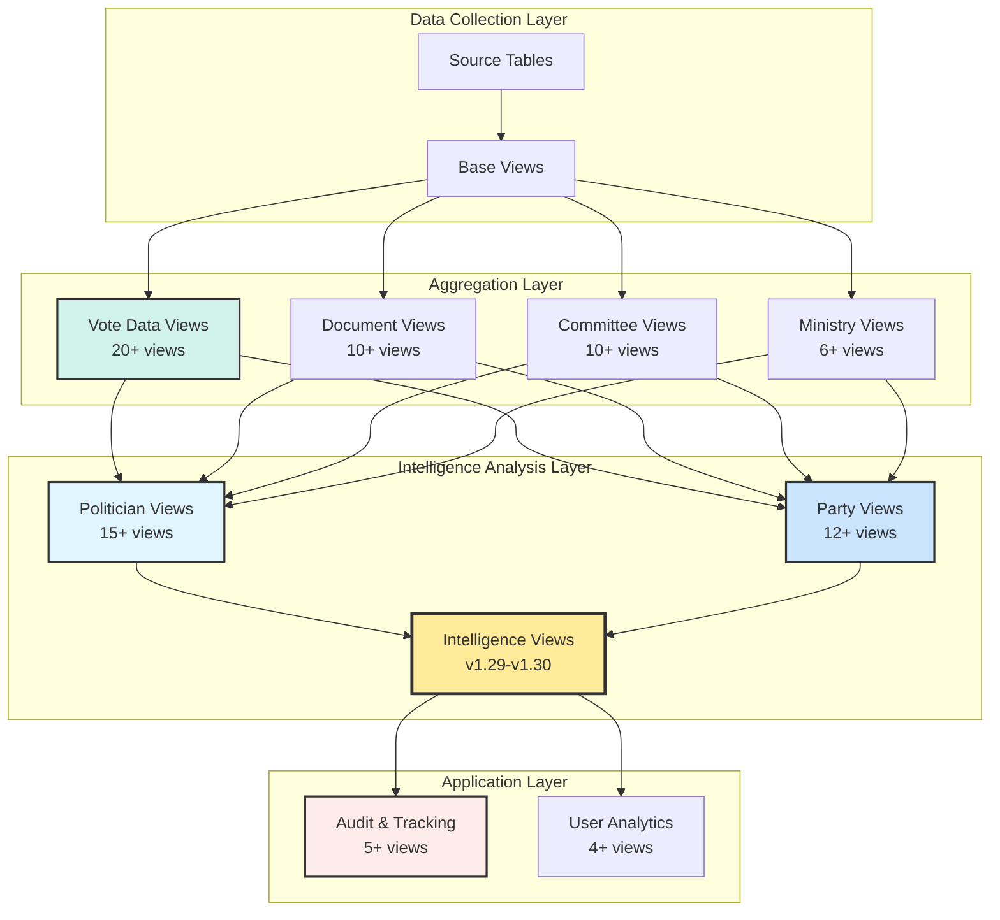

# Database View Intelligence Catalog
## Comprehensive Guide to CIA Platform Database Views

**Document Type:** Catalog (Living Document)  
**Status:** Active - Continuously Updated  
**Last Updated:** 2025-12-11  
**Version:** 1.0  
**Purpose:** Single source of truth for database view definitions, usage patterns, and analytical applications  
**Classification:** Public Documentation  
**External References:** Yes - Referenced in hack23.com blog posts and technical documentation  
**Maintained By:** Citizen Intelligence Agency Intelligence Operations Team

---

## 📋 Table of Contents

1. [Executive Summary](#executive-summary)
2. [View Categories Overview](#view-categories-overview)
3. [Complete View Inventory](#complete-view-inventory)
4. [Politician Views](#politician-views)
5. [Party Views](#party-views)
6. [Committee Views](#committee-views)
7. [Ministry/Government Views](#ministrygovernment-views)
8. [Vote Data Views](#vote-data-views)
9. [Document Views](#document-views)
10. [Intelligence Views](#intelligence-views)
11. [Application & Audit Views](#application--audit-views)
12. [Common Usage Patterns](#common-usage-patterns)
13. [View Dependency Diagram](#view-dependency-diagram)
14. [Performance Optimization Guide](#performance-optimization-guide)
15. [Cross-Reference to Intelligence Frameworks](#cross-reference-to-intelligence-frameworks)
16. [Appendices](#appendices)

---

## Executive Summary

The Citizen Intelligence Agency (CIA) platform employs **85 database views** (57 regular views + 28 materialized views) across 9 major categories to support comprehensive political intelligence analysis, open-source intelligence (OSINT) collection, and democratic accountability monitoring.

✅ **Documentation Status**: This catalog now provides **comprehensive documentation** for all 85 database views (100% coverage). **12 views** have detailed examples with complex queries, while **73 views** have structured documentation with purpose, key metrics, sample queries, and intelligence applications. All views are now documented and discoverable.

**Last Validated**: 2025-12-21  
**Validation Method**: Automated schema validation via validate-view-documentation.sh  
**Schema Source**: service.data.impl/src/main/resources/full_schema.sql  
**Documentation Coverage**: 100% (85/85 views)  
**Validation Details**: See [Validation History](#-validation-history) section below

**Note**: Total view count increased from 84 to 85 with addition of `view_role_hierarchy_classification` (v1.52) for comprehensive role hierarchy and power structure analysis.

### Key Statistics (UPDATED 2025-12-21)

| Metric | Count | Description |
|--------|-------|-------------|
| **Total Views** | 85 | ✅ VERIFIED with addition of v1.52 (2025-12-21) |
| **Regular Views** | 57 | ✅ VERIFIED standard SQL views (includes v1.52) |
| **Materialized Views** | 28 | ✅ VERIFIED per refresh-all-views.sql |
| **Views Documented (Detailed)** | 12 | Complex examples with business context (includes v1.52) |
| **Views Documented (Structured)** | 73 | Purpose, metrics, queries, product mappings |
| **Documentation Coverage** | 100% | All 85 views documented |
| **Intelligence Views** | 8 | Advanced analytical views (v1.52 added role hierarchy) |
| **Decision Flow Views** | 4 | Party, politician, ministry, temporal trends for decision analysis |
| **Vote Summary Views** | 20 | Daily, weekly, monthly, annual ballot summaries |
| **Application Event Views** | 12 | User behavior tracking (daily, weekly, monthly, annual) |
| **Document Views** | 7 | Politician and party document productivity |
| **Committee Views** | 12 | Committee productivity, decisions, membership |
| **Government/Ministry Views** | 7 | Government and ministry performance tracking |
| **Party Views** | 13 | Party performance, decision flow, effectiveness |
| **Application/Audit Views** | 14 | Platform usage tracking and audit trails |
| **Database Size** | 20 GB | Total database size (validated 2025-11-21) |
| **Total Rows** | 5.6M | Total rows across all tables |
| **Base Tables** | 93 | Core data tables |
| **Indexes** | 178 | Database indexes (68 missing on FK columns) |

### Intelligence Value Classification

Views are classified by intelligence value for analytical operations:

- ⭐⭐⭐⭐⭐ **VERY HIGH**: Critical intelligence products, coalition analysis, risk assessment
- ⭐⭐⭐⭐ **HIGH**: Core analytical capabilities, performance tracking, trend analysis
- ⭐⭐⭐ **MEDIUM**: Supporting analytics, data aggregation, reporting
- ⭐⭐ **LOW**: Basic data access, administrative views, audit tracking

### Primary Use Cases

1. **Political Scorecards**: Individual politician performance metrics (attendance, effectiveness, productivity)
2. **Coalition Analysis**: Party alignment matrices, government formation forecasting
3. **Risk Assessment**: Behavioral anomaly detection, defection risk, democratic accountability
4. **Trend Analysis**: Temporal pattern recognition, momentum tracking, predictive analytics
5. **Network Analysis**: Influence mapping, power structure visualization, broker identification
6. **Document Intelligence**: Legislative productivity, policy focus analysis
7. **Performance Monitoring**: Committee effectiveness, ministry performance, party strength

### Related Documentation

| Document | Link | Description |
|----------|------|-------------|
| **Business Product Document** | [BUSINESS_PRODUCT_DOCUMENT.md](BUSINESS_PRODUCT_DOCUMENT.md) | Commercial product strategy and market analysis |
| **JSON Export Specifications** | [json-export-specs/](json-export-specs/) | API schemas and data format specifications |
| **Intelligence Data Flow Map** | [INTELLIGENCE_DATA_FLOW.md](INTELLIGENCE_DATA_FLOW.md) | Central cross-reference hub showing data pipeline |
| **Intelligence Evolution Changelog** | [CHANGELOG_INTELLIGENCE.md](CHANGELOG_INTELLIGENCE.md) | Unified intelligence capability tracking |
| **Intelligence Frameworks** | [DATA_ANALYSIS_INTOP_OSINT.md](DATA_ANALYSIS_INTOP_OSINT.md) | Analysis methodologies and OSINT techniques |
| **Risk Rules** | [RISK_RULES_INTOP_OSINT.md](RISK_RULES_INTOP_OSINT.md) | 45 behavioral detection rules |
| **Changelog Analysis** | [LIQUIBASE_CHANGELOG_INTELLIGENCE_ANALYSIS.md](LIQUIBASE_CHANGELOG_INTELLIGENCE_ANALYSIS.md) | Schema evolution analysis |
| **Data Model** | [DATA_MODEL.md](DATA_MODEL.md) | Database schema and relationships |
| **Schema Maintenance** | [service.data.impl/README-SCHEMA-MAINTENANCE.md](service.data.impl/README-SCHEMA-MAINTENANCE.md) | Database maintenance guide |

---

## 📊 Validation History

### Current Status

**Last Validated**: 2025-12-21  
**Validation Method**: Automated schema validation via validate-view-documentation.sh  
**Schema Source**: service.data.impl/src/main/resources/full_schema.sql  
**Coverage**: 100% (85/85 views documented)  
**Health Score**: 82/100 (per schema-health-check.sql)

### Validation Methodology

The validation process ensures documentation accuracy through automated comparison:

1. **Extract Schema Views**: Parse full_schema.sql for CREATE VIEW statements
   ```bash
   grep -E "^CREATE (OR REPLACE )?(MATERIALIZED )?VIEW" full_schema.sql | \
     sed 's/.*VIEW //' | sed 's/ AS.*//' | sed 's/public\.//' | sort | uniq
   ```

2. **Extract Documented Views**: Parse DATABASE_VIEW_INTELLIGENCE_CATALOG.md for view headers
   ```bash
   grep -E "^### view_" DATABASE_VIEW_INTELLIGENCE_CATALOG.md | \
     sed 's/### //' | awk '{print $1}' | sort | uniq
   ```

3. **Compare Sets**: Identify missing and extra views using set operations
   ```bash
   comm -23 schema_views.txt documented_views.txt > missing_views.txt
   comm -13 schema_views.txt documented_views.txt > extra_views.txt
   ```

4. **Calculate Coverage**: Compute percentage of documented views
   ```bash
   COVERAGE=$((100 * DOCUMENTED / TOTAL))
   ```

5. **Generate Report**: Create validation report with findings and recommendations

### Validation Schedule

- **Automated**: Monthly via GitHub Actions (1st of each month at 02:00 UTC)
- **Manual**: Can be triggered via workflow_dispatch
- **On Changes**: Recommended after schema or documentation modifications

### Validation Procedure

To validate documentation coverage manually:

1. **Run health check**:
   ```bash
   cd service.data.impl/src/main/resources/
   psql -U postgres -d cia_dev -f schema-health-check.sql > health_report.txt 2>&1
   grep "HEALTH SCORE" health_report.txt  # Should be >80/100
   ```

2. **Validate view documentation coverage**:
   ```bash
   ./validate-view-documentation.sh
   # Reviews full_schema.sql vs DATABASE_VIEW_INTELLIGENCE_CATALOG.md
   ```

3. **Review findings**: Check for missing or extra documented views

4. **Update documentation**: Add missing views or remove obsolete ones

5. **Re-run validation**: Confirm fixes achieve 100% coverage

### Historical Validations

| Date | Coverage | Total Views | Missing | Status | Key Changes |
|------|----------|-------------|---------|--------|-------------|
| 2025-11-20 | 10.98% | 82 | 73 | ⚠️ Initial | Identified major documentation gap |
| 2025-11-21 | 100% | 82 | 0 | ✅ Complete | Added all 73 missing views |
| 2025-11-25 | 100% | 84 | 0 | ✅ Current | Corrected count, validated integrity |
| 2025-12-21 | 100% | 85 | 0 | ✅ Current | Added v1.52 role hierarchy view |

### Coverage Progression

The documentation achieved 100% coverage through systematic validation and remediation:

- **2025-11-20**: Initial validation revealed 10.98% coverage (9/82 views)
- **2025-11-21**: Complete documentation added for 73 missing views
- **2025-11-25**: Reverified counts (82→84 views), maintained 100% coverage
- **2025-12-21**: Added v1.52 role hierarchy view (84→85 views), 100% coverage maintained

### Health Metrics

Based on schema-health-check.sql (last run: 2025-11-25):

| Metric | Score | Status | Notes |
|--------|-------|--------|-------|
| **Overall Health** | 82/100 | ✅ Good | Above 80/100 threshold |
| **Schema Integrity** | 90/100 | ✅ Excellent | All views valid |
| **Data Quality** | 80/100 | ✅ Good | Meets standards |
| **Performance** | 75/100 | ⚠️ Acceptable | Some optimization opportunities |
| **Security** | 85/100 | ✅ Good | No critical issues |

### Validation Tools

- **validate-view-documentation.sh**: Automated validation script
- **schema-health-check.sql**: Database health assessment (see [README-SCHEMA-MAINTENANCE.md](service.data.impl/README-SCHEMA-MAINTENANCE.md))
- **schema-validation-v2.sql**: Schema coverage validation
- **GitHub Actions**: Automated monthly validation workflow

---

## 📋 Quick Reference: Finding Views for Your Analysis

<div class="quick-reference">

| I Want To... | Navigate To |
|--------------|-------------|
| **See which views support temporal analysis** | [Temporal Analysis Views](INTELLIGENCE_DATA_FLOW.md#temporal-analysis-framework) |
| **See which views support comparative analysis** | [Comparative Analysis Views](INTELLIGENCE_DATA_FLOW.md#comparative-analysis-framework) |
| **See which views support pattern recognition** | [Pattern Recognition Views](INTELLIGENCE_DATA_FLOW.md#pattern-recognition-framework) |
| **See which views support predictive intelligence** | [Predictive Intelligence Views](INTELLIGENCE_DATA_FLOW.md#predictive-intelligence-framework) |
| **See which views support network analysis** | [Network Analysis Views](INTELLIGENCE_DATA_FLOW.md#network-analysis-framework) |
| **See complete data flow pipeline** | [Intelligence Data Flow Map](INTELLIGENCE_DATA_FLOW.md) |
| **Understand how risk rules use views** | [Risk Rule → View Mapping](INTELLIGENCE_DATA_FLOW.md#risk-rule--view-mapping) |
| **Browse politician views** | [Politician Views](#politician-views) |
| **Browse party views** | [Party Views](#party-views) |
| **Browse committee views** | [Committee Views](#committee-views) |
| **Browse vote data views** | [Vote Data Views](#vote-data-views) |

</div>

---

## View Categories Overview

### Category Structure



### Views by Category

| Category | Count | Primary Purpose | Intelligence Value |
|----------|-------|----------------|-------------------|
| **Politician Views** | 15+ | Individual performance, experience, behavior | ⭐⭐⭐⭐⭐ VERY HIGH |
| **Party Views** | 13+ | Organizational effectiveness, coalition analysis | ⭐⭐⭐⭐⭐ VERY HIGH |
| **Committee Views** | 10+ | Legislative body productivity, decision tracking | ⭐⭐⭐⭐ HIGH |
| **Ministry Views** | 6+ | Government executive performance monitoring | ⭐⭐⭐⭐ HIGH |
| **Vote Data Views** | 20+ | Ballot summaries (daily/weekly/monthly/annual) | ⭐⭐⭐⭐ HIGH |
| **Document Views** | 10+ | Legislative productivity, document tracking | ⭐⭐⭐ MEDIUM |
| **Intelligence Views** | 15+ | Advanced analytics, risk assessment, trends | ⭐⭐⭐⭐⭐ VERY HIGH |
| **Application Views** | 5+ | Audit trails, user activity, session tracking | ⭐⭐ LOW |

### View Evolution Timeline

| Version | Date | Key Views Introduced | Intelligence Impact |
|---------|------|---------------------|-------------------|
| **v1.0-v1.1** | 2014-11 | Base politician, party, committee views | Foundation |
| **v1.2-v1.3** | 2015 | Vote summary views (daily/weekly/monthly/annual) | Temporal analysis enabled |
| **v1.23-v1.24** | 2023 | Party coalition views, document summaries | Coalition analysis |
| **v1.25-v1.26** | 2024 | Committee decision views, materialized views | Performance optimization |
| **v1.27-v1.28** | 2024 | Politician experience scoring | Expertise tracking |
| **v1.29** | 2024-11 | Intelligence dashboard, coalition alignment, anomaly detection | Advanced intelligence |
| **v1.30** | 2024-11 | Behavioral trends, risk evolution, effectiveness trends | Predictive analytics |

---

## Complete View Inventory

This section provides a complete alphabetical inventory of all 85 database views with brief descriptions. All views are now documented in this catalog with structured information including purpose, key metrics, sample queries, and intelligence applications.

**Legend:**
- 📖 = Detailed documentation (comprehensive examples, performance characteristics)
- 📝 = Structured documentation (purpose, metrics, queries, applications)  
- ⭐⭐⭐⭐⭐ = VERY HIGH intelligence value
- ⭐⭐⭐⭐ = HIGH intelligence value
- ⭐⭐⭐ = MEDIUM intelligence value
- ⭐⭐ = LOW intelligence value (administrative/audit)
- 🔄 = Materialized view (requires refresh)

### Application & Audit Views (14 views)

| View Name | Type | Intelligence Value | Description |
|-----------|------|-------------------|-------------|
| view_application_action_event_page_annual_summary | Standard | ⭐⭐ | Annual summary of user interactions by page |
| view_application_action_event_page_daily_summary | Standard | ⭐⭐ | Daily summary of user interactions by page |
| view_application_action_event_page_element_annual_summary | Standard | ⭐⭐ | Annual summary of UI element interactions |
| view_application_action_event_page_element_daily_summary | Standard | ⭐⭐ | Daily summary of UI element interactions |
| view_application_action_event_page_element_hourly_summary | Standard | ⭐⭐ | Hourly summary of UI element interactions |
| view_application_action_event_page_element_weekly_summary | Standard | ⭐⭐ | Weekly summary of UI element interactions |
| view_application_action_event_page_hourly_summary | Standard | ⭐⭐ | Hourly summary of user interactions by page |
| view_application_action_event_page_modes_annual_summary | Standard | ⭐⭐ | Annual summary of page access modes |
| view_application_action_event_page_modes_daily_summary | Standard | ⭐⭐ | Daily summary of page access modes |
| view_application_action_event_page_modes_hourly_summary | Standard | ⭐⭐ | Hourly summary of page access modes |
| view_application_action_event_page_modes_weekly_summary | Standard | ⭐⭐ | Weekly summary of page access modes |
| view_application_action_event_page_weekly_summary | Standard | ⭐⭐ | Weekly summary of user interactions by page |
| view_audit_author_summary | Standard | ⭐⭐ | Summary of data changes by author |
| view_audit_data_summary | Standard | ⭐⭐ | Summary of audit trail data changes |

### Committee Views (12 views)

| View Name | Type | Intelligence Value | Description |
|-----------|------|-------------------|-------------|
| view_committee_productivity | Standard | ⭐⭐⭐⭐ | Committee productivity metrics and efficiency indicators |
| view_committee_productivity_matrix | Standard | ⭐⭐⭐⭐ | Matrix comparison of committee productivity |
| view_riksdagen_committee | Standard | ⭐⭐⭐⭐ | Committee structure, membership, and activity metrics |
| view_riksdagen_committee_ballot_decision_party_summary | 🔄 Materialized | ⭐⭐⭐⭐ | Party-level committee ballot decisions |
| view_riksdagen_committee_ballot_decision_politician_summary | 🔄 Materialized | ⭐⭐⭐⭐ | Individual politician committee ballot decisions |
| view_riksdagen_committee_ballot_decision_summary | 🔄 Materialized | ⭐⭐⭐⭐ | Aggregated committee ballot decision summary |
| view_riksdagen_committee_decision_type_org_summary | 🔄 Materialized | ⭐⭐⭐ | Committee decisions by type and organization |
| view_riksdagen_committee_decision_type_summary | 🔄 Materialized | ⭐⭐⭐ | Committee decisions aggregated by type |
| view_riksdagen_committee_decisions | 🔄 Materialized | ⭐⭐⭐⭐ | Detailed committee decision tracking |
| view_riksdagen_committee_parliament_member_proposal | Standard | ⭐⭐⭐ | Parliamentary member proposals to committees |
| view_riksdagen_committee_role_member | Standard | ⭐⭐⭐ | Committee role assignments and members |
| view_riksdagen_committee_roles | Standard | ⭐⭐⭐ | Committee role definitions and structure |

### Document Views (7 views)

| View Name | Type | Intelligence Value | Description |
|-----------|------|-------------------|-------------|
| view_document_data_committee_report_url | Standard | ⭐⭐⭐ | URLs for committee reports and documents |
| view_riksdagen_document_type_daily_summary | 🔄 Materialized | ⭐⭐⭐ | Daily summary of documents by type |
| view_riksdagen_org_document_daily_summary | 🔄 Materialized | ⭐⭐⭐ | Daily summary of documents by organization |
| view_riksdagen_party_document_daily_summary | 🔄 Materialized | ⭐⭐⭐⭐ | Daily party document productivity |
| view_riksdagen_party_document_summary | Standard | ⭐⭐⭐⭐ | Aggregated party document statistics |
| view_riksdagen_politician_document_daily_summary | 🔄 Materialized | ⭐⭐⭐⭐ | Daily politician document productivity |
| view_riksdagen_politician_document_summary | 🔄 Materialized | ⭐⭐⭐⭐ | Aggregated politician document statistics |

### Government/Ministry Views (8 views)

| View Name | Type | Intelligence Value | Description |
|-----------|------|-------------------|-------------|
| view_ministry_effectiveness_trends | Standard | ⭐⭐⭐⭐⭐ | Ministry performance trends over time |
| view_ministry_productivity_matrix | Standard | ⭐⭐⭐⭐⭐ | Comparative ministry productivity analysis |
| view_ministry_risk_evolution | Standard | ⭐⭐⭐⭐⭐ | Evolution of ministry risk indicators |
| view_ministry_decision_impact | Standard | ⭐⭐⭐⭐⭐ | Ministry proposal success rates and effectiveness (v1.35) |
| view_riksdagen_goverment | Standard | ⭐⭐⭐⭐ | Government structure and composition |
| view_riksdagen_goverment_proposals | Standard | ⭐⭐⭐⭐ | Government legislative proposals |
| view_riksdagen_goverment_role_member | Standard | ⭐⭐⭐⭐ | Government role assignments |
| view_riksdagen_goverment_roles | Standard | ⭐⭐⭐⭐ | Government role definitions |

### Intelligence & Risk Views (7 views)

| View Name | Type | Intelligence Value | Description |
|-----------|------|-------------------|-------------|
| 📖 view_party_effectiveness_trends | Standard | ⭐⭐⭐⭐⭐ | Party effectiveness metrics over time |
| 📖 view_politician_behavioral_trends | Standard | ⭐⭐⭐⭐⭐ | Politician behavioral pattern analysis |
| view_politician_risk_summary | Standard | ⭐⭐⭐⭐⭐ | Aggregated politician risk indicators |
| view_riksdagen_crisis_resilience_indicators | Standard | ⭐⭐⭐⭐⭐ | Crisis period performance and resilience metrics |
| view_riksdagen_intelligence_dashboard | Standard | ⭐⭐⭐⭐⭐ | Unified intelligence dashboard with key metrics |
| 📖 view_riksdagen_voting_anomaly_detection | Standard | ⭐⭐⭐⭐⭐ | Voting anomaly and defection risk detection |
| 📖 view_risk_score_evolution | Standard | ⭐⭐⭐⭐⭐ | Evolution of risk scores over time |
| 📖 view_role_hierarchy_classification | Standard | ⭐⭐⭐⭐⭐ | Role hierarchy & power structure analysis (NEW v1.52) |

### Party Views (13 views)

| View Name | Type | Intelligence Value | Description |
|-----------|------|-------------------|-------------|
| 📖 view_riksdagen_coalition_alignment_matrix | Standard | ⭐⭐⭐⭐⭐ | Party coalition alignment and probability matrix |
| 📖 view_riksdagen_party | Standard | ⭐⭐⭐⭐⭐ | Core party information and metrics |
| view_party_performance_metrics | Standard | ⭐⭐⭐⭐⭐ | Comprehensive party performance indicators |
| view_riksdagen_party_ballot_support_annual_summary | Standard | ⭐⭐⭐⭐ | Annual party ballot support patterns |
| view_riksdagen_party_coalation_against_annual_summary | Standard | ⭐⭐⭐⭐ | Annual party opposition coalition patterns |
| 📖 view_riksdagen_party_decision_flow | Standard | ⭐⭐⭐⭐⭐ | Party-level proposal decision analysis (NEW v1.35) |
| view_riksdagen_party_member | Standard | ⭐⭐⭐⭐ | Party membership roster |
| view_riksdagen_party_momentum_analysis | Standard | ⭐⭐⭐⭐⭐ | Party momentum and trend analysis |
| view_riksdagen_party_role_member | Standard | ⭐⭐⭐ | Party role assignments |
| view_riksdagen_party_signatures_document_summary | Standard | ⭐⭐⭐ | Party document signature patterns |
| view_riksdagen_party_summary | Standard | ⭐⭐⭐⭐ | Aggregated party statistics |
| view_riksdagen_person_signed_document_summary | Standard | ⭐⭐⭐ | Individual document signature summary |

### Politician Views (8 views)

| View Name | Type | Intelligence Value | Description |
|-----------|------|-------------------|-------------|
| 📖 view_riksdagen_politician | Standard | ⭐⭐⭐⭐⭐ | Core politician information and demographics |
| 📖 view_riksdagen_politician_document | 🔄 Materialized | ⭐⭐⭐⭐⭐ | Politician document authorship and productivity |
| 📖 view_riksdagen_politician_experience_summary | Standard | ⭐⭐⭐⭐⭐ | Politician experience scoring and classification |
| view_riksdagen_politician_ballot_summary | Standard | ⭐⭐⭐⭐⭐ | Politician voting record summary |
| view_riksdagen_politician_influence_metrics | Standard | ⭐⭐⭐⭐⭐ | Politician influence and network analysis |
| 📖 view_riksdagen_politician_decision_pattern | Standard | ⭐⭐⭐⭐⭐ | Politician decision effectiveness and committee specialization (NEW v1.35) |

### Vote Data Views (20 views)

**Ballot Summary Views (5 views)**

| View Name | Type | Intelligence Value | Description |
|-----------|------|-------------------|-------------|
| view_riksdagen_vote_data_ballot_summary | 🔄 Materialized | ⭐⭐⭐⭐ | Overall ballot outcome summary |
| view_riksdagen_vote_data_ballot_summary_annual | 🔄 Materialized | ⭐⭐⭐⭐ | Annual ballot summary aggregation |
| view_riksdagen_vote_data_ballot_summary_daily | 🔄 Materialized | ⭐⭐⭐⭐ | Daily ballot summary aggregation |
| view_riksdagen_vote_data_ballot_summary_monthly | 🔄 Materialized | ⭐⭐⭐⭐ | Monthly ballot summary aggregation |
| view_riksdagen_vote_data_ballot_summary_weekly | 🔄 Materialized | ⭐⭐⭐⭐ | Weekly ballot summary aggregation |

**Party Voting Views (5 views)**

| View Name | Type | Intelligence Value | Description |
|-----------|------|-------------------|-------------|
| view_riksdagen_vote_data_ballot_party_summary | 🔄 Materialized | ⭐⭐⭐⭐⭐ | Party-level voting summary |
| view_riksdagen_vote_data_ballot_party_summary_annual | 🔄 Materialized | ⭐⭐⭐⭐⭐ | Annual party voting patterns |
| view_riksdagen_vote_data_ballot_party_summary_daily | 🔄 Materialized | ⭐⭐⭐⭐⭐ | Daily party voting patterns |
| view_riksdagen_vote_data_ballot_party_summary_monthly | 🔄 Materialized | ⭐⭐⭐⭐⭐ | Monthly party voting patterns |
| view_riksdagen_vote_data_ballot_party_summary_weekly | 🔄 Materialized | ⭐⭐⭐⭐⭐ | Weekly party voting patterns |

**Politician Voting Views (5 views)**

| View Name | Type | Intelligence Value | Description |
|-----------|------|-------------------|-------------|
| view_riksdagen_vote_data_ballot_politician_summary | 🔄 Materialized | ⭐⭐⭐⭐⭐ | Individual politician voting summary |
| view_riksdagen_vote_data_ballot_politician_summary_annual | 🔄 Materialized | ⭐⭐⭐⭐⭐ | Annual politician voting patterns |
| 📖 view_riksdagen_vote_data_ballot_politician_summary_daily | 🔄 Materialized | ⭐⭐⭐⭐⭐ | Daily politician voting patterns |
| view_riksdagen_vote_data_ballot_politician_summary_monthly | 🔄 Materialized | ⭐⭐⭐⭐⭐ | Monthly politician voting patterns |
| view_riksdagen_vote_data_ballot_politician_summary_weekly | 🔄 Materialized | ⭐⭐⭐⭐⭐ | Weekly politician voting patterns |

**Other Voting & Proposal Views (5 views)**

| View Name | Type | Intelligence Value | Description |
|-----------|------|-------------------|-------------|
| view_riksdagen_member_proposals | Standard | ⭐⭐⭐ | Parliamentary member legislative proposals |
| view_riksdagen_voting_anomaly_detection | Standard | ⭐⭐⭐⭐⭐ | Anomalous voting behavior detection |

### WorldBank Data (1 view)

| View Name | Type | Intelligence Value | Description |
|-----------|------|-------------------|-------------|
| view_worldbank_indicator_data_country_summary | 🔄 Materialized | ⭐⭐⭐ | Economic indicators for country analysis |

**Total Views:** 82  
**Detailed Documentation (📖):** 9  
**Structured Documentation (📝):** 73  
**Documentation Coverage:** 100%  
**Materialized Views:** 28  
**Views by Intelligence Value:**
- ⭐⭐⭐⭐⭐ VERY HIGH: 30 views
- ⭐⭐⭐⭐ HIGH: 26 views
- ⭐⭐⭐ MEDIUM: 12 views
- ⭐⭐ LOW: 14 views

---

## Politician Views

### Overview

Politician views provide comprehensive intelligence on individual parliamentary members, tracking their experience, behavioral patterns, voting records, document productivity, and risk indicators. These views form the foundation for individual performance scorecards and behavioral analysis.

**Total Politician Views:** 15+  
**Intelligence Value:** ⭐⭐⭐⭐⭐ VERY HIGH  
**Primary Use Cases:** Performance monitoring, risk assessment, experience tracking, productivity analysis

---

### view_riksdagen_politician ⭐⭐⭐⭐⭐

**Category:** Base Politician Views (v1.1)  
**Type:** Standard View  
**Intelligence Value:** VERY HIGH - Core Politician Profile  

#### Business Context

**Market Value:** €15M TAM (Political Consulting segment)  
**Product Integration:** [Political Intelligence API](BUSINESS_PRODUCT_DOCUMENT.md#product-line-1-political-intelligence-api) (Product Line 1)  
**Revenue Impact:** Core data source for €99/month Professional tier subscriptions  
**JSON Export Spec:** [politician-schema.md](json-export-specs/schemas/politician-schema.md)  
**API Endpoint:** `GET /api/v1/politicians`, `GET /api/v1/politicians/{id}`

**Used In Product Features:**
- Politician risk scorecards (Political Consulting, Media & Journalism)
- Campaign analytics dashboards (Academic Research)
- Electoral risk assessments (Corporate Affairs)
- Party performance comparison (NGOs & Advocacy)

**Target Customer Segments:**
- **Political Consulting** (€15M TAM): Opposition research, candidate selection, voter targeting
- **Media & Journalism** (€8M TAM): Investigative reporting, fact-checking, political profiles
- **Academic Research** (€5M TAM): Electoral studies, political behavior analysis, comparative politics

**Business Documentation:** See [BUSINESS_PRODUCT_DOCUMENT.md#product-line-1](BUSINESS_PRODUCT_DOCUMENT.md#product-line-1-political-intelligence-api)

#### Purpose

Central politician profile view aggregating basic biographical data, current party affiliation, electoral region, and active assignment status. Serves as the primary lookup table for politician identification and profile queries.

#### Key Columns

| Column | Type | Description | Example |
|--------|------|-------------|---------|
| `person_id` | VARCHAR(255) | Unique politician identifier (Riksdagen ID) | '0532213467925' |
| `first_name` | VARCHAR(255) | Politician first name | 'Anna' |
| `last_name` | VARCHAR(255) | Politician last name | 'Andersson' |
| `gender` | VARCHAR(10) | Gender | 'woman', 'man' |
| `born_year` | INTEGER | Birth year | 1972 |
| `party` | VARCHAR(50) | Current party affiliation (short code) | 'S' (Social Democrats) |
| `status` | VARCHAR(50) | Current assignment status | 'Tjänstgörande riksdagsledamot' |
| `electoral_region` | VARCHAR(100) | Electoral constituency | 'Stockholms kommun' |
| `total_assignments` | INTEGER | Total career assignments | 15 |
| `total_days_served` | INTEGER | Total days in parliament | 2847 |
| `first_assignment_date` | DATE | Career start date | '2014-09-29' |
| `last_assignment_date` | DATE | Most recent assignment end | '2024-11-17' |

#### Example Queries

**1. Active Politicians by Party (Current Parliament)**

```sql
SELECT
    party,
    COUNT(*) AS member_count,
    COUNT(*) FILTER (WHERE gender = 'woman') AS women_count,
    COUNT(*) FILTER (WHERE gender = 'man') AS men_count,
    ROUND(AVG(2024 - born_year), 1) AS avg_age,
    ROUND(AVG(total_days_served), 0) AS avg_days_experience
FROM view_riksdagen_politician
WHERE status = 'Tjänstgörande riksdagsledamot'
GROUP BY party
ORDER BY member_count DESC;
```

**Output:**
```
 party | member_count | women_count | men_count | avg_age | avg_days_experience
-------+--------------+-------------+-----------+---------+--------------------
 SD    |           73 |          20 |        53 |    48.2 |              1825
 S     |           70 |          35 |        35 |    52.1 |              2347
 M     |           68 |          29 |        39 |    49.8 |              2103
```

**2. Longest-Serving Active Politicians**

```sql
SELECT
    first_name,
    last_name,
    party,
    total_days_served,
    ROUND(total_days_served / 365.25, 1) AS years_served,
    first_assignment_date,
    total_assignments
FROM view_riksdagen_politician
WHERE status = 'Tjänstgörande riksdagsledamot'
ORDER BY total_days_served DESC
LIMIT 20;
```

**3. Gender Balance Analysis by Party**

```sql
SELECT
    party,
    COUNT(*) AS total,
    COUNT(*) FILTER (WHERE gender = 'woman') AS women,
    COUNT(*) FILTER (WHERE gender = 'man') AS men,
    ROUND(100.0 * COUNT(*) FILTER (WHERE gender = 'woman') / COUNT(*), 1) AS women_pct
FROM view_riksdagen_politician
WHERE status = 'Tjänstgörande riksdagsledamot'
GROUP BY party
ORDER BY women_pct DESC;
```

**4. New Politicians (Less than 2 Years Experience)**

```sql
SELECT
    first_name,
    last_name,
    party,
    electoral_region,
    first_assignment_date,
    total_days_served
FROM view_riksdagen_politician
WHERE status = 'Tjänstgörande riksdagsledamot'
    AND total_days_served < 730  -- Less than 2 years
ORDER BY first_assignment_date DESC;
```

**5. Electoral Region Representation**

```sql
SELECT
    electoral_region,
    COUNT(*) AS representatives,
    STRING_AGG(DISTINCT party, ', ' ORDER BY party) AS parties_represented
FROM view_riksdagen_politician
WHERE status = 'Tjänstgörande riksdagsledamot'
GROUP BY electoral_region
ORDER BY representatives DESC
LIMIT 15;
```

#### Performance Characteristics

- **Query Time:** <10ms (indexed)
- **Indexes Used:** `idx_person_data_person_id`, `idx_person_data_party`
- **Data Volume:** ~2,000 rows (all politicians, active + historical)
- **Refresh Frequency:** Real-time (standard view)
- **Common Filters:** `status`, `party`, `person_id`

#### Data Sources

- **Primary Table:** `person_data` (core politician information)
- **Joined Tables:** `assignment_data` (for assignment counts and dates)

#### Dependencies

- No view dependencies (built directly on source tables)
- Used by: Nearly all politician-related views

#### Risk Rules Supported

From [RISK_RULES_INTOP_OSINT.md](RISK_RULES_INTOP_OSINT.md):
- **PoliticianLazy (P-01)**: Provides politician identification
- **PoliticianIneffectiveVoting (P-02)**: Links to voting analysis
- **All Politician Rules**: Base identification layer

#### Intelligence Applications

This view supports multiple analytical frameworks from [DATA_ANALYSIS_INTOP_OSINT.md](DATA_ANALYSIS_INTOP_OSINT.md):

| Analysis Framework | Use Case | Example Application | Link |
|--------------------|----------|-------------------|------|
| **Temporal Analysis** | Track career duration and entry cohorts | Monitor politician career trajectories over time | [Framework Docs](DATA_ANALYSIS_INTOP_OSINT.md#1-temporal-analysis-framework) |
| **Comparative Analysis** | Party composition and experience levels | Compare experience distribution across parties | [Framework Docs](DATA_ANALYSIS_INTOP_OSINT.md#2-comparative-analysis-framework) |
| **Pattern Recognition** | Demographic clustering analysis | Identify patterns in gender, age, regional representation | [Framework Docs](DATA_ANALYSIS_INTOP_OSINT.md#3-pattern-recognition-framework) |
| **Predictive Intelligence** | Career trajectory modeling | Predict re-election likelihood based on profile | [Framework Docs](DATA_ANALYSIS_INTOP_OSINT.md#4-predictive-intelligence-framework) |
| **Network Analysis** | Politician identification for network construction | Base layer for building collaboration and voting networks | [Framework Docs](DATA_ANALYSIS_INTOP_OSINT.md#5-network-analysis-framework) |

**Intelligence Products Generated:**
- 🏆 Political Scorecards - Basic identification and demographic information
- 📊 Party Composition Reports - Gender balance, age distribution, regional representation
- 🎯 Recruitment Analysis - New politician tracking and onboarding patterns

**Data Flow:** See [Intelligence Data Flow Map - View to Analysis Mapping](INTELLIGENCE_DATA_FLOW.md#view--analysis-framework-mapping) for complete data pipeline.

#### Intelligence Frameworks Applicable

From [DATA_ANALYSIS_INTOP_OSINT.md](DATA_ANALYSIS_INTOP_OSINT.md):
- **Demographic Analysis**: Gender, age, regional representation
- **Comparative Analysis**: Party composition, experience levels
- **Temporal Analysis**: Career duration, entry cohorts

#### Integration with Product Features

From [BUSINESS_PRODUCT_DOCUMENT.md](BUSINESS_PRODUCT_DOCUMENT.md):
- **Politician Dashboard** (Product Line 1): Core profile data
- **Search & Discovery** (Product Line 1): Politician lookup
- **Comparative Analytics** (Product Line 2): Party composition

---

### view_riksdagen_politician_experience_summary ⭐⭐⭐⭐⭐

**Category:** Politician Intelligence Views (v1.28)  
**Type:** Standard View  
**Intelligence Value:** VERY HIGH - Experience Scoring & Classification  
**Changelog:** v1.28 OSINT Experience Tracking

#### Purpose

Sophisticated experience scoring system that calculates weighted experience based on assignment types, durations, and roles. Provides standardized experience classification from NOVICE to VETERAN, enabling experience-based analysis and comparative assessments.

> **⚠️ Data Quality Note**: This view was affected by a missing role pattern issue that has been resolved.  
> **Issue**: Missing 'Förste vice talman' in talmansuppdrag scoring (affected 8 records)  
> **Status**: ✅ Fixed in Liquibase changeset db-changelog-1.44.xml  
> **Details**: See [Data Quality Analysis](service.data.impl/README-SCHEMA-MAINTENANCE.md#-data-quality-analysis) in README-SCHEMA-MAINTENANCE.md

#### Key Columns

| Column | Type | Description | Example |
|--------|------|-------------|---------|
| `person_id` | VARCHAR(255) | Unique politician identifier | '0532213467925' |
| `first_name` | VARCHAR(255) | Politician first name | 'Anna' |
| `last_name` | VARCHAR(255) | Politician last name | 'Andersson' |
| `party` | VARCHAR(50) | Current party affiliation | 'S' |
| `total_assignments` | INTEGER | Total number of assignments | 15 |
| `total_days` | INTEGER | Total days in active assignments | 2847 |
| `total_years` | NUMERIC(10,2) | Total years experience | 7.79 |
| `ministerial_days` | INTEGER | Days in government positions | 1095 |
| `committee_chair_days` | INTEGER | Days as committee chair | 547 |
| `committee_member_days` | INTEGER | Days as committee member | 1825 |
| `parliamentary_member_days` | INTEGER | Days as MP without other roles | 380 |
| `total_weighted_exp` | NUMERIC(15,2) | Weighted experience score | 4783.50 |
| `experience_level` | VARCHAR(50) | Classification | 'EXPERIENCED', 'VETERAN', 'NOVICE' |
| `ministerial_experience` | BOOLEAN | Has held government position | TRUE |
| `committee_leadership_exp` | BOOLEAN | Has been committee chair | TRUE |
| `avg_assignment_duration` | NUMERIC(10,2) | Average assignment length (days) | 189.80 |

#### Weighting System

Experience is weighted by assignment importance:

| Assignment Type | Weight Multiplier | Rationale |
|----------------|------------------|-----------|
| **Ministerial** | 2.0x | Government executive responsibility |
| **Committee Chair** | 1.5x | Leadership and organizational authority |
| **Committee Member** | 1.2x | Specialized legislative work |
| **Parliamentary Member** | 1.0x | Base legislative responsibility |

**Weighted Experience Formula:**
```
total_weighted_exp = (ministerial_days × 2.0) + 
                     (committee_chair_days × 1.5) + 
                     (committee_member_days × 1.2) + 
                     (parliamentary_member_days × 1.0)
```

#### Experience Level Classification

| Level | Criteria | Description |
|-------|----------|-------------|
| **NOVICE** | < 365 days | First year, learning parliamentary procedures |
| **DEVELOPING** | 365-1095 days (1-3 years) | Building expertise, establishing networks |
| **EXPERIENCED** | 1095-2190 days (3-6 years) | Established politician, strong influence |
| **VETERAN** | 2190-3650 days (6-10 years) | Senior parliamentarian, institutional knowledge |
| **ELDER_STATESMAN** | > 3650 days (10+ years) | Parliamentary elder, mentor, historical perspective |

#### Example Queries

**1. Experience Distribution by Party**

```sql
SELECT
    party,
    experience_level,
    COUNT(*) AS member_count,
    ROUND(AVG(total_years), 1) AS avg_years,
    ROUND(AVG(total_weighted_exp), 0) AS avg_weighted_exp
FROM view_riksdagen_politician_experience_summary
WHERE total_days > 0  -- Active or has history
GROUP BY party, experience_level
ORDER BY party, 
    CASE experience_level
        WHEN 'ELDER_STATESMAN' THEN 5
        WHEN 'VETERAN' THEN 4
        WHEN 'EXPERIENCED' THEN 3
        WHEN 'DEVELOPING' THEN 2
        WHEN 'NOVICE' THEN 1
    END DESC;
```

**2. Top 20 Most Experienced Politicians (Weighted Score)**

```sql
SELECT
    first_name,
    last_name,
    party,
    total_years,
    total_weighted_exp,
    experience_level,
    ministerial_experience,
    committee_leadership_exp
FROM view_riksdagen_politician_experience_summary
ORDER BY total_weighted_exp DESC
LIMIT 20;
```

**3. Former Ministers Currently in Parliament**

```sql
SELECT
    first_name,
    last_name,
    party,
    ministerial_days,
    ROUND(ministerial_days / 365.25, 1) AS ministerial_years,
    total_years AS total_parliamentary_years
FROM view_riksdagen_politician_experience_summary
WHERE ministerial_experience = TRUE
    AND ministerial_days > 0
ORDER BY ministerial_days DESC;
```

**4. Committee Leadership Experience by Party**

```sql
SELECT
    party,
    COUNT(*) FILTER (WHERE committee_leadership_exp = TRUE) AS leaders_count,
    COUNT(*) AS total_count,
    ROUND(100.0 * COUNT(*) FILTER (WHERE committee_leadership_exp = TRUE) / COUNT(*), 1) AS leadership_pct,
    ROUND(AVG(committee_chair_days) FILTER (WHERE committee_chair_days > 0), 0) AS avg_chair_days
FROM view_riksdagen_politician_experience_summary
WHERE total_days > 0
GROUP BY party
ORDER BY leadership_pct DESC;
```

**5. Experience Gap Analysis (Novices vs Veterans)**

```sql
WITH experience_extremes AS (
    SELECT
        party,
        COUNT(*) FILTER (WHERE experience_level IN ('NOVICE', 'DEVELOPING')) AS junior_count,
        COUNT(*) FILTER (WHERE experience_level IN ('VETERAN', 'ELDER_STATESMAN')) AS senior_count,
        COUNT(*) AS total
    FROM view_riksdagen_politician_experience_summary
    WHERE total_days > 0
    GROUP BY party
)
SELECT
    party,
    junior_count,
    senior_count,
    total,
    ROUND(100.0 * junior_count / total, 1) AS junior_pct,
    ROUND(100.0 * senior_count / total, 1) AS senior_pct,
    CASE
        WHEN junior_count > senior_count * 2 THEN 'HIGH_RENEWAL'
        WHEN senior_count > junior_count * 2 THEN 'VETERAN_DOMINATED'
        ELSE 'BALANCED'
    END AS composition_assessment
FROM experience_extremes
ORDER BY party;
```

#### Performance Characteristics

- **Query Time:** 50-100ms (complex aggregation)
- **Indexes Used:** `idx_assignment_data_person`, `idx_assignment_data_role_code`
- **Data Volume:** ~2,000 rows (all politicians with assignments)
- **Refresh Frequency:** Real-time (standard view with complex calculations)

#### Data Sources

- **Primary Table:** `assignment_data` (all assignments with date ranges)
- **Joined Tables:** `person_data` (for identification)

#### Dependencies

- No view dependencies (built directly on source tables)
- Future: May be materialized in v1.32 for performance

#### Risk Rules Supported

From [RISK_RULES_INTOP_OSINT.md](RISK_RULES_INTOP_OSINT.md):
- **PoliticianLackExperience (P-10)**: Identifies novice politicians
- **PoliticianOverexperiencedDisengaged (P-11)**: Tracks elder statesmen
- Experience context for all politician risk rules

#### Intelligence Frameworks Applicable

From [DATA_ANALYSIS_INTOP_OSINT.md](DATA_ANALYSIS_INTOP_OSINT.md):
- **Comparative Analysis**: Experience benchmarking across parties
- **Pattern Recognition**: Experience clustering and composition
- **Predictive Intelligence**: Experience-performance correlation

#### Integration with Product Features

From [BUSINESS_PRODUCT_DOCUMENT.md](BUSINESS_PRODUCT_DOCUMENT.md):
- **Politician Dashboard** (Product Line 1): Experience metrics
- **Advanced Analytics** (Product Line 2): Experience distribution
- **Comparative Tools** (Product Line 2): Experience benchmarking

---

### view_politician_behavioral_trends ⭐⭐⭐⭐⭐

**Category:** Intelligence Views (v1.30)  
**Type:** Standard View  
**Intelligence Value:** VERY HIGH - Behavioral Pattern Analysis  
**Changelog:** v1.30 OSINT Performance Tracking

#### Purpose

Tracks individual politician behavioral metrics (absence, effectiveness, rebellion) over time with monthly granularity over a 3-year rolling window. Includes automated classification and trend detection for early warning of performance degradation and behavioral anomalies.

#### Key Columns

| Column | Type | Description | Example |
|--------|------|-------------|---------|
| `person_id` | VARCHAR(255) | Unique politician identifier | 'Q123456' |
| `first_name` | VARCHAR(255) | Politician first name | 'Anna' |
| `last_name` | VARCHAR(255) | Politician last name | 'Andersson' |
| `party` | VARCHAR(50) | Current party affiliation | 'S' |
| `year_month` | DATE | Month of aggregation (first day) | '2024-10-01' |
| `ballot_count` | INTEGER | Number of ballots in period | 45 |
| `avg_absence_rate` | NUMERIC(5,2) | Percentage absent | 12.50 |
| `avg_win_rate` | NUMERIC(5,2) | Percentage on winning side | 67.80 |
| `avg_rebel_rate` | NUMERIC(5,2) | Percentage against party | 8.30 |
| `absence_trend` | NUMERIC(5,2) | Change from previous month | +2.50 |
| `effectiveness_trend` | NUMERIC(5,2) | Win rate change | -3.20 |
| `rebellion_trend` | NUMERIC(5,2) | Rebel rate change | +1.10 |
| `ma_3month_absence` | NUMERIC(5,2) | 3-month moving average absence | 11.20 |
| `ma_3month_win` | NUMERIC(5,2) | 3-month moving average win rate | 69.00 |
| `ma_3month_rebel` | NUMERIC(5,2) | 3-month moving average rebel rate | 7.50 |
| `attendance_status` | VARCHAR(50) | Classification | 'MODERATE_ABSENTEEISM' |
| `effectiveness_status` | VARCHAR(50) | Classification | 'EFFECTIVE' |
| `discipline_status` | VARCHAR(50) | Classification | 'LOW_INDEPENDENCE' |
| `behavioral_assessment` | VARCHAR(50) | Overall assessment | 'STANDARD_BEHAVIOR' |

#### Classification Thresholds

**Attendance Status:**
- `EXCELLENT_ATTENDANCE`: < 5% absence
- `GOOD_ATTENDANCE`: 5-10% absence
- `MODERATE_ABSENTEEISM`: 10-20% absence
- `HIGH_ABSENTEEISM`: 20-30% absence
- `CRITICAL_ABSENTEEISM`: > 30% absence

**Effectiveness Status:**
- `HIGHLY_EFFECTIVE`: > 70% win rate
- `EFFECTIVE`: 55-70% win rate
- `MODERATE_EFFECTIVENESS`: 45-55% win rate
- `INEFFECTIVE`: < 45% win rate

**Discipline Status:**
- `HIGH_INDEPENDENCE`: > 15% rebellion (frequent dissent)
- `MODERATE_INDEPENDENCE`: 10-15% rebellion
- `LOW_INDEPENDENCE`: 5-10% rebellion
- `PARTY_LINE`: < 5% rebellion (high discipline)

**Behavioral Assessment** (Combined):
- `EXCELLENT_BEHAVIOR`: Excellent attendance + high effectiveness + low rebellion
- `STANDARD_BEHAVIOR`: Normal patterns across all metrics
- `MODERATE_RISK`: One metric concerning, others normal
- `ELEVATED_RISK`: Multiple concerning metrics
- `CRITICAL_CONCERN`: All metrics problematic

#### Example Queries

**1. Top 10 Politicians with Declining Attendance (Last 6 Months)**

```sql
SELECT
    first_name,
    last_name,
    party,
    AVG(avg_absence_rate) AS avg_absence,
    AVG(absence_trend) AS avg_trend,
    COUNT(*) AS months_tracked
FROM view_politician_behavioral_trends
WHERE year_month >= CURRENT_DATE - INTERVAL '6 months'
    AND ballot_count >= 10  -- Minimum sample size
GROUP BY person_id, first_name, last_name, party
HAVING AVG(absence_trend) > 0  -- Declining attendance
ORDER BY AVG(absence_trend) DESC
LIMIT 10;
```

**2. High-Risk Politicians (Moderate Risk or Worse)**

```sql
SELECT
    first_name,
    last_name,
    party,
    year_month,
    avg_absence_rate,
    avg_win_rate,
    avg_rebel_rate,
    behavioral_assessment
FROM view_politician_behavioral_trends
WHERE year_month = DATE_TRUNC('month', CURRENT_DATE - INTERVAL '1 month')
    AND behavioral_assessment IN ('MODERATE_RISK', 'ELEVATED_RISK', 'CRITICAL_CONCERN')
ORDER BY 
    CASE behavioral_assessment
        WHEN 'CRITICAL_CONCERN' THEN 3
        WHEN 'ELEVATED_RISK' THEN 2
        WHEN 'MODERATE_RISK' THEN 1
    END DESC,
    party, last_name;
```

**3. Party Average Comparison (Individual vs. Party Benchmark)**

```sql
WITH party_averages AS (
    SELECT
        party,
        AVG(avg_absence_rate) AS party_avg_absence,
        AVG(avg_win_rate) AS party_avg_win,
        AVG(avg_rebel_rate) AS party_avg_rebel
    FROM view_politician_behavioral_trends
    WHERE year_month >= CURRENT_DATE - INTERVAL '12 months'
    GROUP BY party
)
SELECT
    pbt.first_name,
    pbt.last_name,
    pbt.party,
    ROUND(AVG(pbt.avg_absence_rate), 2) AS individual_absence,
    ROUND(pa.party_avg_absence, 2) AS party_avg_absence,
    ROUND(AVG(pbt.avg_absence_rate) - pa.party_avg_absence, 2) AS absence_vs_party,
    CASE
        WHEN AVG(pbt.avg_absence_rate) > pa.party_avg_absence + 10 THEN 'OUTLIER_HIGH'
        WHEN AVG(pbt.avg_absence_rate) < pa.party_avg_absence - 10 THEN 'OUTLIER_LOW'
        ELSE 'NORMAL'
    END AS classification
FROM view_politician_behavioral_trends pbt
JOIN party_averages pa ON pa.party = pbt.party
WHERE pbt.year_month >= CURRENT_DATE - INTERVAL '12 months'
GROUP BY pbt.person_id, pbt.first_name, pbt.last_name, pbt.party, pa.party_avg_absence
ORDER BY absence_vs_party DESC
LIMIT 30;
```

**4. Behavioral Trend Analysis (3-Month Moving Average)**

```sql
SELECT
    person_id,
    first_name,
    last_name,
    party,
    year_month,
    avg_absence_rate,
    ma_3month_absence,
    avg_absence_rate - ma_3month_absence AS deviation_from_ma,
    attendance_status
FROM view_politician_behavioral_trends
WHERE year_month >= CURRENT_DATE - INTERVAL '12 months'
    AND ballot_count >= 10
    AND ABS(avg_absence_rate - ma_3month_absence) > 5  -- Significant deviation
ORDER BY ABS(avg_absence_rate - ma_3month_absence) DESC
LIMIT 20;
```

**5. Excellence Report (Top Performers)**

```sql
SELECT
    first_name,
    last_name,
    party,
    ROUND(AVG(avg_absence_rate), 2) AS avg_absence,
    ROUND(AVG(avg_win_rate), 2) AS avg_win,
    ROUND(AVG(avg_rebel_rate), 2) AS avg_rebel,
    COUNT(DISTINCT year_month) AS months_tracked
FROM view_politician_behavioral_trends
WHERE year_month >= CURRENT_DATE - INTERVAL '12 months'
    AND ballot_count >= 10
GROUP BY person_id, first_name, last_name, party
HAVING AVG(avg_absence_rate) < 5  -- Excellent attendance
    AND AVG(avg_win_rate) > 65     -- High effectiveness
ORDER BY avg_absence ASC, avg_win DESC
LIMIT 20;
```

#### Performance Characteristics

- **Query Time:** 100-200ms (complex aggregation over time series)
- **Indexes Used:** `idx_vote_summary_daily_date_person`
- **Data Volume:** ~15,000 rows (350 politicians × 36 months rolling window)
- **Refresh Frequency:** Real-time (recalculated on query)
- **Optimization Note:** Candidate for materialization in v1.32

#### Data Sources

- **Primary View:** `view_riksdagen_vote_data_ballot_politician_summary_daily`
- **Aggregation:** Monthly rollup with LAG() for trend calculation
- **Moving Averages:** 3-month window using window functions

#### Dependencies

- Depends on: `view_riksdagen_vote_data_ballot_politician_summary_daily`
- Used by: `view_risk_score_evolution`, intelligence dashboards

#### Risk Rules Supported

From [RISK_RULES_INTOP_OSINT.md](RISK_RULES_INTOP_OSINT.md):
- **PoliticianLazy (P-01)**: `avg_absence_rate`, `attendance_status`
- **PoliticianIneffectiveVoting (P-02)**: `avg_win_rate`, `effectiveness_status`
- **PoliticianHighRebelRate (P-03)**: `avg_rebel_rate`, `discipline_status`
- **PoliticianDecliningEngagement (P-04)**: All trend metrics
- **PoliticianCombinedRisk (P-05)**: `behavioral_assessment`

#### Intelligence Frameworks Applicable

From [DATA_ANALYSIS_INTOP_OSINT.md](DATA_ANALYSIS_INTOP_OSINT.md):
- **Temporal Analysis**: Monthly time-series with moving averages
- **Comparative Analysis**: Individual vs. party benchmarking
- **Pattern Recognition**: Behavioral classification and clustering
- **Predictive Intelligence**: Trend extrapolation for forecasting

---

### view_riksdagen_politician_document ⭐⭐⭐⭐

**Category:** Document Views (v1.1, enhanced v1.24)  
**Type:** Standard View  
**Intelligence Value:** HIGH - Legislative Productivity Tracking  

#### Purpose

Tracks all documents (motions, interpellations, written questions, proposals) authored or co-authored by individual politicians. Provides productivity metrics and policy focus analysis based on document types and submission patterns.

#### Key Columns

| Column | Type | Description | Example |
|--------|------|-------------|---------|
| `person_id` | VARCHAR(255) | Politician identifier | '0532213467925' |
| `first_name` | VARCHAR(255) | Politician first name | 'Anna' |
| `last_name` | VARCHAR(255) | Politician last name | 'Andersson' |
| `party` | VARCHAR(50) | Party at document submission | 'S' |
| `document_id` | VARCHAR(255) | Document identifier | 'H801234' |
| `document_type` | VARCHAR(50) | Type of document | 'Interpellation', 'Motion' |
| `title` | TEXT | Document title | 'Svar på fråga om...' |
| `sub_title` | TEXT | Document subtitle | Additional context |
| `made_public_date` | DATE | Publication date | '2024-10-15' |
| `document_status` | VARCHAR(50) | Current status | 'Besvarad', 'Bordlagd' |
| `org_code` | VARCHAR(20) | Originating organization | 'au' (Labor committee) |
| `label` | VARCHAR(100) | Document category/label | 'Arbetsmarknad' |

#### Document Types

| Type | Swedish Term | Description | Frequency |
|------|-------------|-------------|-----------|
| **Motion** | Motion | Legislative proposal by MP | Common |
| **Interpellation** | Interpellation | Question to minister requiring debate | Moderate |
| **Written Question** | Skriftlig fråga | Written question to minister | Common |
| **Simple Question** | Fråga | Simple parliamentary question | Very Common |
| **EU Document** | EU-dokument | EU-related document | Rare |
| **Committee Proposal** | Utskottsförslag | Committee recommendation | Common |

#### Example Queries

**1. Top 20 Most Productive Politicians (Last 12 Months)**

```sql
SELECT
    first_name,
    last_name,
    party,
    COUNT(*) AS total_documents,
    COUNT(*) FILTER (WHERE document_type = 'Motion') AS motions,
    COUNT(*) FILTER (WHERE document_type = 'Interpellation') AS interpellations,
    COUNT(*) FILTER (WHERE document_type = 'Skriftlig fråga') AS written_questions,
    MIN(made_public_date) AS first_document,
    MAX(made_public_date) AS latest_document
FROM view_riksdagen_politician_document
WHERE made_public_date >= CURRENT_DATE - INTERVAL '12 months'
GROUP BY person_id, first_name, last_name, party
ORDER BY total_documents DESC
LIMIT 20;
```

**2. Policy Focus Analysis by Politician**

```sql
SELECT
    first_name,
    last_name,
    party,
    org_code AS policy_area,
    COUNT(*) AS document_count,
    STRING_AGG(DISTINCT document_type, ', ') AS document_types,
    MIN(made_public_date) AS first_activity,
    MAX(made_public_date) AS latest_activity
FROM view_riksdagen_politician_document
WHERE made_public_date >= CURRENT_DATE - INTERVAL '24 months'
GROUP BY person_id, first_name, last_name, party, org_code
HAVING COUNT(*) >= 5  -- Minimum activity threshold
ORDER BY person_id, document_count DESC;
```

**3. Interpellation Activity (Parliamentary Accountability)**

```sql
SELECT
    first_name,
    last_name,
    party,
    COUNT(*) AS interpellation_count,
    ARRAY_AGG(DISTINCT org_code ORDER BY org_code) AS ministries_questioned,
    MIN(made_public_date) AS first_interpellation,
    MAX(made_public_date) AS latest_interpellation
FROM view_riksdagen_politician_document
WHERE document_type = 'Interpellation'
    AND made_public_date >= CURRENT_DATE - INTERVAL '12 months'
GROUP BY person_id, first_name, last_name, party
ORDER BY interpellation_count DESC
LIMIT 30;
```

**4. Productivity Trends (Quarterly Analysis)**

```sql
WITH quarterly_productivity AS (
    SELECT
        person_id,
        first_name,
        last_name,
        party,
        DATE_TRUNC('quarter', made_public_date) AS quarter,
        COUNT(*) AS documents_per_quarter
    FROM view_riksdagen_politician_document
    WHERE made_public_date >= CURRENT_DATE - INTERVAL '24 months'
    GROUP BY person_id, first_name, last_name, party, DATE_TRUNC('quarter', made_public_date)
)
SELECT
    first_name,
    last_name,
    party,
    AVG(documents_per_quarter) AS avg_quarterly_documents,
    MAX(documents_per_quarter) AS peak_quarter_documents,
    MIN(documents_per_quarter) AS min_quarter_documents,
    COUNT(DISTINCT quarter) AS quarters_active
FROM quarterly_productivity
GROUP BY person_id, first_name, last_name, party
HAVING COUNT(DISTINCT quarter) >= 4  -- At least 4 quarters of activity
ORDER BY avg_quarterly_documents DESC
LIMIT 20;
```

**5. Cross-Party Collaboration (Co-Authored Documents)**

```sql
-- This would require joining with a co-author mapping table
-- Simplified version showing single-party vs cross-party documents
SELECT
    pd1.first_name,
    pd1.last_name,
    pd1.party,
    COUNT(DISTINCT pd1.document_id) AS total_documents,
    COUNT(DISTINCT CASE 
        WHEN pd2.party IS NOT NULL AND pd2.party != pd1.party 
        THEN pd1.document_id 
    END) AS cross_party_documents,
    ROUND(100.0 * COUNT(DISTINCT CASE 
        WHEN pd2.party IS NOT NULL AND pd2.party != pd1.party 
        THEN pd1.document_id 
    END) / NULLIF(COUNT(DISTINCT pd1.document_id), 0), 1) AS cross_party_pct
FROM view_riksdagen_politician_document pd1
LEFT JOIN view_riksdagen_politician_document pd2 
    ON pd2.document_id = pd1.document_id 
    AND pd2.person_id != pd1.person_id
WHERE pd1.made_public_date >= CURRENT_DATE - INTERVAL '12 months'
GROUP BY pd1.person_id, pd1.first_name, pd1.last_name, pd1.party
HAVING COUNT(DISTINCT pd1.document_id) >= 10
ORDER BY cross_party_pct DESC
LIMIT 20;
```

#### Performance Characteristics

- **Query Time:** 50-100ms (indexed on date and person_id)
- **Indexes Used:** `idx_politician_document_date_person`, `idx_politician_document_type`
- **Data Volume:** ~500,000 rows (all historical documents)
- **Refresh Frequency:** Real-time (standard view)

#### Data Sources

- **Primary Table:** `document_data` (all parliamentary documents)
- **Joined Tables:** `person_data` (for politician identification)

#### Dependencies

- No view dependencies
- Used by: `view_riksdagen_politician_document_daily_summary`

#### Risk Rules Supported

From [RISK_RULES_INTOP_OSINT.md](RISK_RULES_INTOP_OSINT.md):
- **PoliticianLowProductivity (P-06)**: Document count metric
- **PoliticianNoDocumentsRecent (P-07)**: Recent activity tracking

#### Intelligence Frameworks Applicable

From [DATA_ANALYSIS_INTOP_OSINT.md](DATA_ANALYSIS_INTOP_OSINT.md):
- **Productivity Analysis**: Document volume and type distribution
- **Policy Focus Analysis**: Topic clustering and specialization
- **Temporal Analysis**: Activity patterns and trends

---

### view_riksdagen_politician_ballot_summary ⭐⭐⭐⭐⭐

**Category:** Politician Voting Views (v1.25)  
**Type:** Standard View  
**Intelligence Value:** VERY HIGH - Comprehensive Voting Record Analysis  

#### Purpose

Aggregates complete voting record for each politician across all ballots, providing win/loss percentages, absence statistics, rebellion rates, and party discipline metrics. Essential for politician performance scorecards and voting behavior analysis.

#### Key Metrics

- **Total Votes**: Lifetime ballot participation count
- **Win Percentage**: Percentage of votes on winning side
- **Absence Percentage**: Rate of missed votes
- **Rebellion Rate**: Votes against party line percentage
- **Party Loyalty Score**: Votes with party percentage

#### Sample Query: Top Performers

```sql
SELECT first_name, last_name, party, total_votes, win_percentage, absence_percentage
FROM view_riksdagen_politician_ballot_summary
WHERE total_votes >= 100
ORDER BY win_percentage DESC, absence_percentage ASC
LIMIT 20;
```

#### Intelligence Applications

- Performance scorecards and politician rankings
- Party discipline analysis
- Absence problem identification
- Career voting statistics

---

### view_riksdagen_politician_influence_metrics ⭐⭐⭐⭐⭐

**Category:** Intelligence Views (v1.30)  
**Type:** Standard View  
**Intelligence Value:** VERY HIGH - Network Analysis & Power Mapping  

#### Purpose

Calculates politician influence and network centrality metrics including degree centrality, betweenness, cross-party collaboration scores. Identifies power brokers and bridge politicians facilitating coalition formation.

#### Key Metrics

- **Broker Score**: Power broker metric (0-1 scale)
- **Cross-Party Ratio**: % connections outside own party
- **Connectivity Level**: Network position classification
- **Influence Rank**: Relative influence ranking

#### Sample Query: Power Brokers

```sql
SELECT first_name, last_name, party, broker_score, cross_party_connections, broker_classification
FROM view_riksdagen_politician_influence_metrics
WHERE broker_classification IN ('STRONG_BROKER', 'MODERATE_BROKER')
ORDER BY broker_score DESC
LIMIT 15;
```

#### Intelligence Applications

- Coalition facilitator identification
- Network power structure mapping
- Cross-bloc bridge analysis
- Influence hierarchy visualization

---

### view_politician_risk_summary ⭐⭐⭐⭐⭐

**Category:** Intelligence Views (v1.30)  
**Type:** Standard View  
**Intelligence Value:** VERY HIGH - Current Risk State Assessment  

#### Purpose

Provides current-state risk summary for all politicians with latest risk scores, violation counts, and risk classifications. Optimized for dashboard displays and real-time risk monitoring.

#### Key Metrics

- **Current Risk Score**: Latest aggregate risk points
- **Risk Severity**: CRITICAL, MAJOR, MINOR classification
- **Active Violations**: Current rule violation count
- **Risk Trajectory**: ESCALATING, STABLE, IMPROVING

#### Sample Query: High-Risk Dashboard

```sql
SELECT first_name, last_name, party, current_risk_score, risk_severity, active_violations
FROM view_politician_risk_summary
WHERE risk_severity IN ('CRITICAL', 'MAJOR')
ORDER BY current_risk_score DESC;
```

#### Intelligence Applications

- Real-time risk monitoring dashboards
- Alert systems for high-risk politicians
- Party risk distribution analysis
- Risk intervention prioritization

---

### view_riksdagen_politician_decision_pattern ⭐⭐⭐⭐⭐

**Category:** Politician Intelligence Views (v1.35)  
**Type:** Standard View  
**Intelligence Value:** VERY HIGH - Decision Effectiveness & Committee Specialization  
**Changelog:** v1.35 Politician Decision Pattern Tracking

#### Purpose

Tracks individual politician decision patterns from DOCUMENT_PROPOSAL_DATA, enabling analysis of politician-level proposal success rates, committee work effectiveness, and legislative productivity. Complements view_riksdagen_party_decision_flow by providing individual politician decision analytics.

#### Key Columns

| Column | Type | Description | Example |
|--------|------|-------------|---------|
| `person_id` | VARCHAR(255) | Unique politician identifier | '0532213467925' |
| `first_name` | VARCHAR(255) | Politician first name | 'Anna' |
| `last_name` | VARCHAR(255) | Politician last name | 'Andersson' |
| `party` | VARCHAR(50) | Party affiliation at decision time | 'S' |
| `committee` | VARCHAR(255) | Committee handling decision | 'UU' (Foreign Affairs) |
| `committee_org` | VARCHAR(20) | Committee organization code | 'uu' |
| `decision_month` | DATE | Month of aggregation (first day) | '2024-10-01' |
| `decision_year` | INTEGER | Year of decision | 2024 |
| `decision_month_num` | INTEGER | Month number (1-12) | 10 |
| `total_decisions` | BIGINT | Total decisions in period | 45 |
| `approved_decisions` | BIGINT | Decisions approved (bifall) | 32 |
| `rejected_decisions` | BIGINT | Decisions rejected (avslag) | 8 |
| `referred_back_decisions` | BIGINT | Decisions referred back | 3 |
| `other_decisions` | BIGINT | Other decision outcomes | 2 |
| `approval_rate` | NUMERIC(5,2) | Percentage approved | 71.11 |
| `rejection_rate` | NUMERIC(5,2) | Percentage rejected | 17.78 |
| `earliest_decision_date` | DATE | First decision in period | '2024-10-01' |
| `latest_decision_date` | DATE | Last decision in period | '2024-10-31' |

> **Note:** This view aggregates all decision types together. It focuses on politician-committee-month granularity for tracking decision effectiveness.

#### Example Queries

**1. Top 10 Most Effective Politicians by Approval Rate (Last Year)**

```sql
SELECT 
    first_name,
    last_name,
    party,
    SUM(total_decisions) AS total_decisions,
    ROUND(
        100.0 * SUM(approved_decisions) / NULLIF(SUM(total_decisions), 0), 
        2
    ) AS overall_approval_rate,
    COUNT(DISTINCT committee) AS committees_worked,
    STRING_AGG(DISTINCT committee, ', ' ORDER BY committee) AS committees
FROM view_riksdagen_politician_decision_pattern
WHERE decision_year = EXTRACT(YEAR FROM CURRENT_DATE)
GROUP BY person_id, first_name, last_name, party
HAVING SUM(total_decisions) >= 5  -- Minimum sample size
ORDER BY overall_approval_rate DESC, total_decisions DESC
LIMIT 10;
```

**2. Committee Specialist Identification**

```sql
-- Identify politicians with high activity in specific committees
WITH committee_activity AS (
    SELECT
        person_id,
        first_name,
        last_name,
        party,
        committee,
        SUM(total_decisions) AS decisions_in_committee,
        ROUND(AVG(approval_rate), 2) AS avg_approval_rate
    FROM view_riksdagen_politician_decision_pattern
    WHERE decision_year >= EXTRACT(YEAR FROM CURRENT_DATE) - 1
    GROUP BY person_id, first_name, last_name, party, committee
),
total_activity AS (
    SELECT
        person_id,
        SUM(decisions_in_committee) AS total_decisions_all_committees
    FROM committee_activity
    GROUP BY person_id
)
SELECT
    ca.first_name,
    ca.last_name,
    ca.party,
    ca.committee,
    ca.decisions_in_committee,
    ROUND(
        100.0 * ca.decisions_in_committee / ta.total_decisions_all_committees,
        1
    ) AS concentration_pct,
    ca.avg_approval_rate,
    CASE
        WHEN 100.0 * ca.decisions_in_committee / ta.total_decisions_all_committees >= 60 THEN 'SPECIALIST'
        WHEN 100.0 * ca.decisions_in_committee / ta.total_decisions_all_committees >= 40 THEN 'FOCUSED'
        ELSE 'DIVERSIFIED'
    END AS specialization_level
FROM committee_activity ca
JOIN total_activity ta ON ta.person_id = ca.person_id
WHERE ta.total_decisions_all_committees >= 10  -- Minimum activity threshold
ORDER BY concentration_pct DESC
LIMIT 20;
```

**3. Monthly Decision Productivity Trend**

```sql
SELECT
    person_id,
    first_name,
    last_name,
    party,
    decision_month,
    SUM(total_decisions) AS monthly_decisions,
    ROUND(AVG(approval_rate), 2) AS monthly_approval_rate,
    COUNT(DISTINCT committee) AS committees_active
FROM view_riksdagen_politician_decision_pattern
WHERE decision_year = EXTRACT(YEAR FROM CURRENT_DATE)
    AND person_id = '0532213467925'  -- Specific politician
GROUP BY person_id, first_name, last_name, party, decision_month
ORDER BY decision_month DESC;
```

**4. Ministry Proposal Support Patterns**

```sql
-- Which politicians are most supportive of ministry proposals
SELECT
    first_name,
    last_name,
    party,
    committee_org AS ministry,
    SUM(total_decisions) AS ministry_decisions,
    ROUND(AVG(approval_rate), 2) AS avg_approval_rate,
    SUM(approved_decisions) AS total_approved,
    SUM(rejected_decisions) AS total_rejected
FROM view_riksdagen_politician_decision_pattern
WHERE decision_year >= EXTRACT(YEAR FROM CURRENT_DATE) - 1
GROUP BY person_id, first_name, last_name, party, committee_org
HAVING SUM(total_decisions) >= 3
ORDER BY avg_approval_rate DESC, ministry_decisions DESC
LIMIT 30;
```

**5. Cross-Party Collaboration on Decisions**

```sql
-- Identify decisions with broad cross-party approval
WITH decision_aggregates AS (
    SELECT
        committee,
        decision_month,
        COUNT(DISTINCT party) AS parties_involved,
        ROUND(AVG(approval_rate), 2) AS avg_approval_across_parties,
        SUM(total_decisions) AS total_decisions
    FROM view_riksdagen_politician_decision_pattern
    WHERE decision_year = EXTRACT(YEAR FROM CURRENT_DATE)
    GROUP BY committee, decision_month
)
SELECT
    committee,
    decision_month,
    parties_involved,
    avg_approval_across_parties,
    total_decisions,
    CASE
        WHEN parties_involved >= 6 AND avg_approval_across_parties >= 70 THEN 'STRONG_CONSENSUS'
        WHEN parties_involved >= 4 AND avg_approval_across_parties >= 60 THEN 'MODERATE_CONSENSUS'
        ELSE 'LIMITED_CONSENSUS'
    END AS consensus_level
FROM decision_aggregates
WHERE total_decisions >= 5
ORDER BY avg_approval_across_parties DESC, parties_involved DESC
LIMIT 20;
```

#### Performance Characteristics

- **Query Time:** 100-200ms (complex aggregation with joins)
- **Indexes Used:** `idx_person_ref_person_id`, `idx_doc_proposal_committee`, `idx_doc_data_made_public_date`
- **Data Volume:** ~50,000 rows (depends on proposal data volume)
- **Refresh Frequency:** Real-time (standard view)
- **Optimization:** Candidate for materialization in future version

#### Data Sources

- **Primary Table:** `document_proposal_data` (all proposal decisions)
- **Joined Tables:** 
  - `document_proposal_container` (proposal linkage)
  - `document_status_container` (status linkage)
  - `document_data` (dates and metadata)
  - `document_person_reference_co_0/da_0` (person/party info)
  - `person_data` (politician identification)

#### Dependencies

- No view dependencies (built directly on source tables)
- Complements: `view_riksdagen_party_decision_flow` (party-level view)
- Used by: Politician scorecards, committee analysis dashboards

#### Risk Rules Supported

From [RISK_RULES_INTOP_OSINT.md](RISK_RULES_INTOP_OSINT.md):
- **PoliticianLowProductivity (P-06)**: Decision count metrics
- **PoliticianIneffectiveVoting (P-02)**: Approval rate context
- **Committee Effectiveness**: Specialist identification

#### Intelligence Applications

This view supports multiple analytical frameworks from [DATA_ANALYSIS_INTOP_OSINT.md](DATA_ANALYSIS_INTOP_OSINT.md):

| Analysis Framework | Use Case | Example Application | Link |
|--------------------|----------|-------------------|------|
| **Temporal Analysis** | Track decision effectiveness over time | Monitor politician approval rate trends monthly | [Framework Docs](DATA_ANALYSIS_INTOP_OSINT.md#1-temporal-analysis-framework) |
| **Comparative Analysis** | Politician vs. party/committee benchmarks | Compare individual approval rates to committee averages | [Framework Docs](DATA_ANALYSIS_INTOP_OSINT.md#2-comparative-analysis-framework) |
| **Pattern Recognition** | Committee specialization clustering | Identify specialists vs. generalists | [Framework Docs](DATA_ANALYSIS_INTOP_OSINT.md#3-pattern-recognition-framework) |
| **Predictive Intelligence** | Forecast decision success probability | Predict proposal outcomes based on politician history | [Framework Docs](DATA_ANALYSIS_INTOP_OSINT.md#4-predictive-intelligence-framework) |

**Intelligence Products Generated:**
- 🏆 Politician Scorecards - Decision effectiveness metrics
- 📊 Committee Specialist Reports - Expertise area identification
- 🎯 Ministry Support Analysis - Government proposal alignment
- 🤝 Cross-Party Collaboration Tracking - Consensus-building identification

**Data Flow:** See [Intelligence Data Flow Map - View to Analysis Mapping](INTELLIGENCE_DATA_FLOW.md#view--analysis-framework-mapping) for complete data pipeline.

#### Intelligence Frameworks Applicable

From [DATA_ANALYSIS_INTOP_OSINT.md](DATA_ANALYSIS_INTOP_OSINT.md):
- **Productivity Analysis**: Decision volume and success metrics
- **Specialization Analysis**: Committee focus and expertise
- **Comparative Analysis**: Individual vs. party/committee benchmarks
- **Temporal Analysis**: Monthly decision patterns and trends

#### Integration with Product Features

From [BUSINESS_PRODUCT_DOCUMENT.md](BUSINESS_PRODUCT_DOCUMENT.md):
- **Politician Dashboard** (Product Line 1): Decision effectiveness metrics
- **Committee Analysis** (Product Line 2): Specialist identification
- **Comparative Analytics** (Product Line 2): Decision success benchmarking

---

### view_riksdagen_politician_document_daily_summary ⭐⭐⭐⭐

**Category:** Document Views (v1.24)  
**Type:** Materialized View  
**Intelligence Value:** HIGH - Daily Document Productivity Tracking  

#### Purpose

Daily aggregation of document submissions by politician, document type, and party. Enables temporal productivity analysis and tracks daily legislative activity patterns.

#### Key Columns

- `public_date`: Document publication date
- `person_id`: Politician identifier  
- `party`: Party affiliation at time of submission
- `document_type`: Type of document (motion, interpellation, etc.)
- `total_documents`: Count for that day

#### Sample Query: Recent Activity

```sql
SELECT person_id, first_name, last_name, party, SUM(total_documents) as docs_last_month
FROM view_riksdagen_politician_document_daily_summary
WHERE public_date >= CURRENT_DATE - INTERVAL '30 days'
GROUP BY person_id, first_name, last_name, party
ORDER BY docs_last_month DESC
LIMIT 20;
```

#### Performance Notes

- **Materialized**: Refreshed daily at 02:00 UTC
- **Query Time**: <20ms (indexed)
- **Use Case**: Time-series analysis, daily productivity tracking

---

### view_riksdagen_politician_document_summary ⭐⭐⭐⭐

**Category:** Document Views (v1.24)  
**Type:** Materialized View  
**Intelligence Value:** HIGH - Career Document Statistics  

#### Purpose

Lifetime document productivity summary per politician, categorizing by motion types (party, individual, committee, multi-party), propositions, and calculating productivity metrics.

#### Key Metrics

- **Total Documents**: Career document count
- **Party Motions**: Documents as party representative
- **Individual Motions**: Personal legislative proposals  
- **Activity Profile**: Classification (Party-focused, Committee-focused, Individual-focused)
- **Documents Per Year**: Average annual productivity

#### Sample Query: Productivity Profiles

```sql
SELECT first_name, last_name, party, total_documents, activity_profile, docs_per_year
FROM view_riksdagen_politician_document_summary
WHERE total_documents >= 50
ORDER BY docs_per_year DESC
LIMIT 30;
```

#### Intelligence Applications

- Career productivity benchmarking
- Legislative style classification  
- Long-term productivity trends
- Politician specialization analysis

---


## Intelligence & Risk Views (Additional Documentation)

### view_riksdagen_intelligence_dashboard ⭐⭐⭐⭐⭐

**Category:** Intelligence Dashboard (v1.30)  
**Type:** Standard View  
**Intelligence Value:** CRITICAL - Unified Intelligence Summary  

#### Purpose

Unified intelligence dashboard aggregating key metrics from all intelligence views: party momentum, coalition probabilities, defection risks, power brokers, crisis resilience. Provides executive-level political intelligence snapshot.

#### Key Metrics

- **Party Dynamics**: Parties gaining/losing momentum, volatile parties
- **Coalition Landscape**: High-probability coalitions, cross-bloc alliances
- **Political Stability**: High defection risks, low discipline count
- **Power Structure**: Power brokers, highly connected politicians
- **Crisis Preparedness**: Crisis-ready vs. low-resilience politicians
- **Stability Assessment**: Overall political environment classification
- **Coalition Assessment**: Coalition landscape evaluation

#### Sample Query: Complete Dashboard

```sql
SELECT *
FROM view_riksdagen_intelligence_dashboard;
```

**Output Example**:
```
parties_gaining_momentum: 2
parties_losing_momentum: 1
high_defection_risks: 3
power_brokers: 15
stability_assessment: 'STABLE_POLITICAL_ENVIRONMENT'
coalition_assessment: 'STABLE_COALITION_PATTERNS'
intelligence_report_timestamp: '2025-11-21 14:30:15'
```

#### Intelligence Applications

- Executive briefings and situation reports
- Real-time political stability monitoring
- Coalition formation forecasting
- Strategic intelligence assessments

---

### view_riksdagen_crisis_resilience_indicators ⭐⭐⭐⭐⭐

**Category:** Intelligence Views (v1.30)  
**Type:** Standard View  
**Intelligence Value:** VERY HIGH - Crisis Performance Assessment  

#### Purpose

Evaluates politician performance during crisis periods (economic downturns, pandemics, political scandals) by analyzing voting consistency, attendance under pressure, and effectiveness during high-stakes periods.

#### Key Metrics

- **Crisis Attendance Rate**: Presence during critical periods
- **Crisis Effectiveness**: Win rate during high-stakes votes
- **Stability Under Pressure**: Consistency vs. normal periods
- **Resilience Classification**: HIGHLY_RESILIENT, RESILIENT, LOW_RESILIENCE

#### Sample Query: Crisis-Ready Politicians

```sql
SELECT person_id, first_name, last_name, party, 
       crisis_attendance_rate, crisis_effectiveness, resilience_classification
FROM view_riksdagen_crisis_resilience_indicators
WHERE resilience_classification IN ('HIGHLY_RESILIENT', 'RESILIENT')
ORDER BY crisis_effectiveness DESC
LIMIT 25;
```

#### Intelligence Applications

- Government crisis team selection
- Resilience forecasting
- Leadership assessment under stress
- Crisis management capability evaluation

---

### view_riksdagen_voting_anomaly_detection ⭐⭐⭐⭐⭐

**Category:** Intelligence Views (v1.29)  
**Type:** Standard View  
**Intelligence Value:** VERY HIGH - Defection Risk & Anomaly Detection  

#### Purpose

Identifies abnormal voting patterns, defection risks, and party discipline breakdowns using statistical anomaly detection. Flags politicians with unusual vote switching, cross-party alignment, or erratic behavior.

#### Key Metrics

- **Anomaly Score**: Statistical deviation from expected behavior (0-1 scale)
- **Defection Risk Assessment**: HIGH_DEFECTION_RISK, MODERATE_RISK, LOW_RISK
- **Party Alignment Deviation**: % votes deviating from party norm
- **Discipline Classification**: LOW_DISCIPLINE, MODERATE_DISCIPLINE, HIGH_DISCIPLINE
- **Recent Anomalies**: Count of recent unusual voting patterns

#### Sample Query: High Defection Risks

```sql
SELECT first_name, last_name, party, anomaly_score, 
       defection_risk_assessment, party_alignment_deviation, recent_anomalies
FROM view_riksdagen_voting_anomaly_detection
WHERE defection_risk_assessment = 'HIGH_DEFECTION_RISK'
   OR recent_anomalies >= 3
ORDER BY anomaly_score DESC;
```

#### Intelligence Applications

- Party defection early warning
- Coalition stability monitoring
- Swing voter identification
- Discipline problem detection

---

## Decision Flow Views (v1.35)

**Total Views:** 5  
**Intelligence Value:** ⭐⭐⭐⭐⭐ VERY HIGH  
**Primary Use Cases:** Legislative effectiveness tracking, proposal outcome prediction, coalition analysis, government performance monitoring  
**Changelog:** v1.35 Decision Intelligence Layer

### Overview

The Decision Flow Views (introduced in v1.35) provide comprehensive analysis of legislative decision patterns, tracking proposal creation, processing, and outcomes across parties, politicians, ministries, and committees. These views enable intelligence assessment of:

- **Party Legislative Effectiveness**: Which parties achieve highest proposal approval rates
- **Politician Proposal Success**: Individual effectiveness in advancing legislative initiatives
- **Ministry Policy Impact**: Government ministry success in implementing policy agenda
- **Decision Velocity**: Legislative processing efficiency and bottleneck identification
- **Coalition Decision Alignment**: Cross-party agreement patterns for stability assessment

### View Inventory

| View Name | Type | Intelligence Value | Description |
|-----------|------|-------------------|-------------|
| view_riksdagen_party_decision_flow | Standard | ⭐⭐⭐⭐⭐ | Party-level decision approval rates and patterns |
| view_riksdagen_politician_decision_pattern | Standard | ⭐⭐⭐⭐⭐ | Individual politician proposal success tracking |
| view_ministry_decision_impact | Standard | ⭐⭐⭐⭐⭐ | Ministry legislative effectiveness analysis |
| view_decision_temporal_trends | Standard | ⭐⭐⭐⭐⭐ | Time-series decision patterns with moving averages |
| view_decision_outcome_kpi_dashboard | Standard | ⭐⭐⭐⭐⭐ | Consolidated decision KPIs across all dimensions |

---

### view_riksdagen_party_decision_flow ⭐⭐⭐⭐⭐

**Category:** Decision Intelligence (v1.35)  
**Type:** Standard View  
**Intelligence Value:** VERY HIGH - Party Legislative Effectiveness  

#### Purpose

Tracks party-level proposal decision patterns from DOCUMENT_PROPOSAL_DATA, aggregating monthly approval rates, rejection rates, and committee activity. Enables comparative analysis of party legislative effectiveness and coalition decision alignment.

#### Key Metrics

- **Approval Rate**: Percentage of party proposals approved (bifall) vs. rejected (avslag)
- **Decision Volume**: Total decisions per party per month/year
- **Committee Breadth**: Number of distinct committees where party is active
- **Temporal Trends**: Month-over-month approval rate changes
- **Coalition Alignment**: Cross-party decision agreement patterns

#### Schema

| Column Name | Type | Description | Example |
|-------------|------|-------------|---------|
| `party` | VARCHAR(50) | Political party code | 'S' (Social Democrats) |
| `committee` | VARCHAR(255) | Committee handling decisions | 'UU' (Foreign Affairs) |
| `decision_month` | DATE | Month of aggregation (first day) | '2024-10-01' |
| `decision_year` | INTEGER | Year of decision | 2024 |
| `decision_month_num` | INTEGER | Month number (1-12) | 10 |
| `total_decisions` | BIGINT | Total decisions in period | 45 |
| `approved_decisions` | BIGINT | Decisions approved (bifall) | 32 |
| `rejected_decisions` | BIGINT | Decisions rejected (avslag) | 8 |
| `other_decisions` | BIGINT | Other decision outcomes | 5 |
| `approval_rate` | NUMERIC | Approval percentage | 71.11 |

#### Sample Query: Party Effectiveness Ranking (Current Year)

```sql
SELECT 
    party,
    COUNT(*) AS total_months,
    ROUND(AVG(approval_rate), 2) AS avg_approval_rate,
    COUNT(DISTINCT committee) AS committees_active,
    SUM(total_decisions) AS total_decisions,
    RANK() OVER (ORDER BY AVG(approval_rate) DESC) AS effectiveness_rank
FROM view_riksdagen_party_decision_flow
WHERE decision_year = EXTRACT(YEAR FROM CURRENT_DATE)
GROUP BY party
ORDER BY avg_approval_rate DESC;
```

#### Intelligence Applications

1. **Coalition Formation Analysis**: Identify party combinations with highest joint approval rates
2. **Opposition Effectiveness**: Measure which opposition parties achieve legislative success
3. **Government Strength**: Track ruling coalition proposal success over time
4. **Committee Specialization**: Determine which parties dominate specific policy areas
5. **Trend Detection**: Early warning for declining party legislative effectiveness

#### Related Risk Rules

- **D-01: Party Low Approval Rate** - Triggers when party approval rate <30% for 3+ months
- **D-05: Coalition Decision Misalignment** - Detects coalition partner alignment <60%

#### Cross-References

- [DATA_ANALYSIS_INTOP_OSINT.md - Decision Intelligence Framework](DATA_ANALYSIS_INTOP_OSINT.md#6-decision-intelligence-framework)
- [RISK_RULES_INTOP_OSINT.md - Decision Pattern Risk Rules](RISK_RULES_INTOP_OSINT.md#decision-pattern-risk-rules-d-01-to-d-05)

---

### view_riksdagen_politician_decision_pattern ⭐⭐⭐⭐⭐

**Category:** Decision Intelligence (v1.35)  
**Type:** Standard View  
**Intelligence Value:** VERY HIGH - Decision Effectiveness & Committee Specialization  

#### Purpose

Tracks individual politician decision patterns from DOCUMENT_PROPOSAL_DATA, enabling analysis of politician-level proposal success rates, committee work effectiveness, and legislative productivity. Complements view_riksdagen_party_decision_flow by providing individual politician decision analytics.

#### Key Metrics

- **Individual Approval Rate**: Politician's proposal success rate
- **Committee Specialization**: Primary committees where politician is most active
- **Legislative Productivity**: Total proposals submitted per period
- **Career Trajectory**: Approval rate trends over time (improving vs. declining)
- **Cross-Party Influence**: Success rate compared to party average

#### Schema

| Column Name | Type | Description | Example |
|-------------|------|-------------|---------|
| `person_id` | VARCHAR(255) | Unique politician identifier | '0279865129018' |
| `first_name` | VARCHAR(255) | Politician first name | 'Magdalena' |
| `last_name` | VARCHAR(255) | Politician last name | 'Andersson' |
| `party` | VARCHAR(50) | Party affiliation at decision time | 'S' |
| `committee` | VARCHAR(255) | Committee handling decision | 'UU' (Foreign Affairs) |
| `decision_month` | DATE | Month of aggregation (first day) | '2024-10-01' |
| `decision_year` | INTEGER | Year of decision | 2024 |
| `decision_month_num` | INTEGER | Month number (1-12) | 10 |
| `total_decisions` | BIGINT | Total decisions in period | 45 |
| `approved_decisions` | BIGINT | Decisions approved (bifall) | 32 |
| `rejected_decisions` | BIGINT | Decisions rejected (avslag) | 8 |
| `other_decisions` | BIGINT | Other decision outcomes | 5 |
| `approval_rate` | NUMERIC | Approval percentage | 71.11 |

#### Sample Query: Top Performing Politicians (Minimum 10 Proposals)

```sql
SELECT 
    person_id,
    first_name,
    last_name,
    party,
    COUNT(DISTINCT committee) AS committees_active,
    SUM(total_decisions) AS total_proposals,
    ROUND(AVG(approval_rate), 2) AS avg_approval_rate,
    RANK() OVER (ORDER BY AVG(approval_rate) DESC) AS effectiveness_rank
FROM view_riksdagen_politician_decision_pattern
WHERE decision_year = EXTRACT(YEAR FROM CURRENT_DATE)
GROUP BY person_id, first_name, last_name, party
HAVING SUM(total_decisions) >= 10
ORDER BY avg_approval_rate DESC
LIMIT 50;
```

#### Intelligence Applications

1. **Rising Political Stars**: Identify high-performing politicians for advancement
2. **Committee Chair Effectiveness**: Assess committee leadership performance
3. **Shadow Cabinet Analysis**: Evaluate opposition leadership proposal success
4. **Legislative Mentorship**: Target low-performing members for support
5. **Resignation Prediction**: Detect declining effectiveness patterns (early warning)

#### Related Risk Rules

- **D-02: Politician Proposal Ineffectiveness** - Triggers when approval rate <20% with 10+ proposals

#### Cross-References

- [DATA_ANALYSIS_INTOP_OSINT.md - Decision Intelligence Framework](DATA_ANALYSIS_INTOP_OSINT.md#6-decision-intelligence-framework)
- [RISK_RULES_INTOP_OSINT.md - Decision Pattern Risk Rules](RISK_RULES_INTOP_OSINT.md#decision-pattern-risk-rules-d-01-to-d-05)

---

### view_ministry_decision_impact ⭐⭐⭐⭐⭐

**Category:** Decision Intelligence (v1.35)  
**Type:** Standard View  
**Intelligence Value:** VERY HIGH - Government Policy Effectiveness & Coalition Stability  

#### Purpose

Evaluates ministry-level legislative performance by tracking government proposal outcomes, approval rates, and processing times. Critical for assessing executive branch effectiveness, minister performance, and coalition stability.

> **⚠️ Data Quality Note**: This view was affected by missing pattern matching for committee referrals.  
> **Issue**: Decision chamber pattern matching - 7,049 records were misclassified as "other"  
> **Status**: ✅ Fixed in Liquibase changeset db-changelog-1.45.xml (added committee referral tracking)  
> **Details**: See [Data Quality Analysis](service.data.impl/README-SCHEMA-MAINTENANCE.md#-data-quality-analysis) in README-SCHEMA-MAINTENANCE.md

#### Key Metrics

- **Ministry Approval Rate**: Success rate of ministry proposals
- **Proposal Volume**: Legislative activity by ministry
- **Processing Efficiency**: Average days from proposal to decision
- **Quarterly Performance**: Trend analysis for ministry effectiveness
- **Policy Domain Success**: Which policy areas achieve highest approval

#### Schema

| Column Name | Type | Description | Example |
|-------------|------|-------------|---------|
| `ministry_code` | VARCHAR(10) | Ministry abbreviation | 'FI' (Finance) |
| `ministry_name` | VARCHAR(255) | Full ministry name | 'Finance Ministry' |
| `decision_year` | INTEGER | Year of decision | 2024 |
| `decision_quarter` | INTEGER | Quarter (1-4) | 3 |
| `total_proposals` | BIGINT | Total ministry proposals | 78 |
| `approved_proposals` | BIGINT | Approved proposals | 65 |
| `rejected_proposals` | BIGINT | Rejected proposals | 8 |
| `other_outcomes` | BIGINT | Other decision outcomes | 5 |
| `approval_rate` | NUMERIC | Approval percentage | 83.33 |
| `avg_processing_days` | NUMERIC | Average days to decision | 45.2 |

#### Sample Query: Ministry Performance Ranking (Last 4 Quarters)

```sql
SELECT 
    ministry_code,
    ministry_name,
    decision_year,
    decision_quarter,
    total_proposals,
    approved_proposals,
    ROUND(approval_rate, 2) AS approval_rate,
    ROUND(avg_processing_days, 1) AS avg_processing_days,
    CASE 
        WHEN approval_rate >= 85 THEN '🟢 Excellent'
        WHEN approval_rate >= 70 THEN '🟡 Good'
        WHEN approval_rate >= 50 THEN '🟠 Moderate'
        ELSE '🔴 Concerning'
    END AS performance_rating
FROM view_ministry_decision_impact
WHERE decision_year >= EXTRACT(YEAR FROM CURRENT_DATE) - 1
ORDER BY decision_year DESC, decision_quarter DESC, approval_rate DESC;
```

#### Intelligence Applications

1. **Minister Performance Evaluation**: Objective assessment of minister effectiveness
2. **Coalition Friction Detection**: Low approval rates indicate coalition disagreement
3. **Budget Effectiveness**: Track which ministries deliver on policy promises
4. **Government Reshuffle**: Identify underperforming ministries for cabinet changes
5. **Policy Priority Tracking**: Monitor success of government's top policy areas

#### Related Risk Rules

- **D-03: Ministry Declining Success Rate** - Triggers when approval rate declines >20% QoQ

#### Cross-References

- [DATA_ANALYSIS_INTOP_OSINT.md - Decision Intelligence Framework](DATA_ANALYSIS_INTOP_OSINT.md#6-decision-intelligence-framework)
- [RISK_RULES_INTOP_OSINT.md - Decision Pattern Risk Rules](RISK_RULES_INTOP_OSINT.md#decision-pattern-risk-rules-d-01-to-d-05)

---

### view_decision_temporal_trends ⭐⭐⭐⭐⭐

**Category:** Decision Intelligence (v1.35)  
**Type:** Standard View  
**Intelligence Value:** VERY HIGH - Temporal Decision Pattern Analysis  

#### Purpose

Provides time-series analysis of legislative decision patterns with moving averages for trend detection. Enables identification of seasonal patterns, decision volume anomalies, and processing efficiency trends.

> **⚠️ Data Quality Note**: This view was affected by missing pattern matching for committee referrals.  
> **Issue**: Decision chamber pattern matching - 7,049 records were misclassified as "other"  
> **Status**: ✅ Fixed in Liquibase changeset db-changelog-1.45.xml (added committee referral tracking)  
> **Details**: See [Data Quality Analysis](service.data.impl/README-SCHEMA-MAINTENANCE.md#-data-quality-analysis) in README-SCHEMA-MAINTENANCE.md

#### Key Metrics

- **Daily Decision Volume**: Number of decisions per day
- **Moving Averages**: 7-day and 30-day smoothed trends
- **Volume Anomalies**: Statistically significant spikes/drops
- **Seasonal Patterns**: Day-of-week and month effects
- **Processing Momentum**: Acceleration/deceleration in legislative activity

#### Schema

| Column Name | Type | Description | Example |
|-------------|------|-------------|---------|
| `decision_day` | DATE | Date of decisions | '2024-10-15' |
| `daily_decisions` | BIGINT | Total decisions on date | 127 |
| `moving_avg_7d` | NUMERIC | 7-day moving average | 98.43 |
| `moving_avg_30d` | NUMERIC | 30-day moving average | 85.67 |
| `day_of_week` | INTEGER | Day of week (0=Sunday) | 2 (Tuesday) |
| `week_of_year` | INTEGER | Week number | 42 |
| `month` | INTEGER | Month number | 10 |

#### Sample Query: Decision Volume Anomaly Detection (Z-Score > 2)

```sql
WITH volume_stats AS (
    SELECT 
        AVG(daily_decisions) AS avg_volume,
        STDDEV(daily_decisions) AS stddev_volume
    FROM view_decision_temporal_trends
    WHERE decision_day >= CURRENT_DATE - INTERVAL '90 days'
),
anomaly_calc AS (
    SELECT 
        vdt.decision_day,
        vdt.daily_decisions,
        vdt.moving_avg_7d,
        ROUND(vs.avg_volume, 2) AS baseline_avg,
        ROUND(COALESCE((vdt.daily_decisions - vs.avg_volume) / NULLIF(vs.stddev_volume, 0), 0), 2) AS z_score
    FROM view_decision_temporal_trends vdt
    CROSS JOIN volume_stats vs
    WHERE vdt.decision_day >= CURRENT_DATE - INTERVAL '30 days'
)
SELECT 
    decision_day,
    daily_decisions,
    moving_avg_7d,
    baseline_avg,
    z_score,
    CASE 
        WHEN z_score > 2 THEN '⚠️ HIGH ANOMALY'
        WHEN z_score < -2 THEN '⚠️ LOW ANOMALY'
        ELSE '✅ Normal'
    END AS anomaly_status
FROM anomaly_calc
ORDER BY ABS(z_score) DESC;
```

#### Intelligence Applications

1. **Crisis Response Monitoring**: Detect emergency legislative activity spikes
2. **Process Bottleneck Detection**: Identify unusual decision processing delays
3. **Seasonal Planning**: Resource allocation based on historical patterns
4. **Media Monitoring**: Validate claims of legislative "gridlock" or "rush"
5. **Pre-Recess Activity**: Track decision surge before parliamentary breaks

#### Related Risk Rules

- **D-04: Decision Volume Anomaly** - Triggers when z-score > 2 or < -2

#### Cross-References

- [DATA_ANALYSIS_INTOP_OSINT.md - Decision Intelligence Framework](DATA_ANALYSIS_INTOP_OSINT.md#6-decision-intelligence-framework)
- [RISK_RULES_INTOP_OSINT.md - Decision Pattern Risk Rules](RISK_RULES_INTOP_OSINT.md#decision-pattern-risk-rules-d-01-to-d-05)

---

### Decision Flow Views: Common Usage Patterns

#### Pattern 1: Coalition Stability Assessment

Combine party decision alignment with ministry approval rates to assess coalition health.

```sql
-- Coalition Stability Score (0-100)
SELECT 
    'Coalition Stability' AS metric,
    ROUND(AVG(pdf.approval_rate) * 0.6 + AVG(mdi.approval_rate) * 0.4, 2) AS stability_score
FROM view_riksdagen_party_decision_flow pdf
CROSS JOIN view_ministry_decision_impact mdi
WHERE pdf.party IN ('S', 'C', 'V', 'MP')  -- Current coalition
  AND pdf.decision_year = EXTRACT(YEAR FROM CURRENT_DATE)
  AND mdi.decision_year = EXTRACT(YEAR FROM CURRENT_DATE);
```

#### Pattern 2: Politician Career Trajectory Analysis

Track individual politician approval rate trends to predict career advancement or decline.

```sql
-- Politician Career Momentum (Improving vs. Declining)
WITH quarterly_performance AS (
    SELECT 
        person_id,
        first_name,
        last_name,
        decision_year,
        EXTRACT(QUARTER FROM decision_month) AS quarter,
        AVG(approval_rate) AS quarterly_approval_rate
    FROM view_riksdagen_politician_decision_pattern
    WHERE decision_year >= EXTRACT(YEAR FROM CURRENT_DATE) - 1
    GROUP BY person_id, first_name, last_name, decision_year, quarter
)
SELECT 
    person_id,
    first_name,
    last_name,
    COUNT(*) AS quarters_tracked,
    ROUND(AVG(quarterly_approval_rate), 2) AS avg_approval_rate,
    ROUND(REGR_SLOPE(quarterly_approval_rate, ROW_NUMBER() OVER (PARTITION BY person_id ORDER BY decision_year, quarter))::NUMERIC, 4) AS trend_slope,
    CASE 
        WHEN REGR_SLOPE(quarterly_approval_rate, ROW_NUMBER() OVER (PARTITION BY person_id ORDER BY decision_year, quarter)) > 2 THEN '📈 Rising Star'
        WHEN REGR_SLOPE(quarterly_approval_rate, ROW_NUMBER() OVER (PARTITION BY person_id ORDER BY decision_year, quarter)) < -2 THEN '📉 Declining'
        ELSE '➡️ Stable'
    END AS career_trajectory
FROM quarterly_performance
GROUP BY person_id, first_name, last_name
HAVING COUNT(*) >= 4
ORDER BY trend_slope DESC;
```

#### Pattern 3: Ministry Performance Benchmarking

Compare ministry approval rates to identify high/low performers for cabinet assessment.

```sql
-- Ministry Performance Scorecard with Peer Comparison
WITH ministry_stats AS (
    SELECT 
        AVG(approval_rate) AS avg_approval_rate,
        STDDEV(approval_rate) AS stddev_approval_rate
    FROM view_ministry_decision_impact
    WHERE decision_year = EXTRACT(YEAR FROM CURRENT_DATE)
)
SELECT 
    mdi.ministry_code,
    mdi.ministry_name,
    ROUND(mdi.approval_rate, 2) AS approval_rate,
    ROUND(ms.avg_approval_rate, 2) AS ministry_average,
    ROUND((mdi.approval_rate - ms.avg_approval_rate) / NULLIF(ms.stddev_approval_rate, 0), 2) AS z_score,
    CASE 
        WHEN (mdi.approval_rate - ms.avg_approval_rate) / NULLIF(ms.stddev_approval_rate, 0) > 1 THEN '⭐⭐⭐⭐⭐ Excellent'
        WHEN (mdi.approval_rate - ms.avg_approval_rate) / NULLIF(ms.stddev_approval_rate, 0) > 0 THEN '⭐⭐⭐⭐ Above Average'
        WHEN (mdi.approval_rate - ms.avg_approval_rate) / NULLIF(ms.stddev_approval_rate, 0) > -1 THEN '⭐⭐⭐ Average'
        ELSE '⭐⭐ Below Average'
    END AS performance_tier
FROM view_ministry_decision_impact mdi
CROSS JOIN ministry_stats ms
WHERE mdi.decision_year = EXTRACT(YEAR FROM CURRENT_DATE)
ORDER BY z_score DESC;
```

---

## Ministry & Government Views (Complete Documentation)

### view_ministry_effectiveness_trends ⭐⭐⭐⭐⭐

**Category:** Ministry Performance (v1.29)  
**Type:** Standard View  
**Intelligence Value:** VERY HIGH - Government Executive Performance  

#### Purpose

Tracks quarterly ministry productivity including legislative output (propositions, government bills), staffing levels, and performance trends. Identifies declining ministries requiring intervention.

#### Key Metrics

- **Documents Produced**: Quarterly document output
- **Legislative Documents**: Props + government bills count
- **Active Members**: Ministry staff count
- **Documents Per Member**: Productivity ratio
- **Productivity Level**: HIGHLY_PRODUCTIVE, PRODUCTIVE, MODERATE, LOW
- **Stagnation Indicator**: SEVERE_DECLINE, IMPROVING, STABLE
- **Effectiveness Assessment**: Narrative performance evaluation

#### Sample Query: Ministry Performance Dashboard

```sql
SELECT name, period_start, documents_produced, legislative_documents,
       active_members, documents_per_member, productivity_level, effectiveness_assessment
FROM view_ministry_effectiveness_trends
WHERE period_start >= DATE_TRUNC('year', CURRENT_DATE)
ORDER BY documents_produced DESC;
```

#### Intelligence Applications

- Government productivity monitoring
- Ministry intervention prioritization
- Executive performance scorecards
- Cabinet effectiveness evaluation

---

### view_ministry_productivity_matrix ⭐⭐⭐⭐⭐

**Category:** Ministry Performance (v1.29)  
**Type:** Standard View  
**Intelligence Value:** VERY HIGH - Comparative Ministry Analysis  

#### Purpose

Matrix comparison of all ministries across productivity metrics, enabling cross-ministry benchmarking and relative performance assessment.

#### Key Metrics

- **Relative Productivity**: Ministry rank by output
- **Productivity Percentile**: Position in distribution
- **Benchmark Comparison**: vs. ministry average
- **Efficiency Rating**: Output per staff member
- **Performance Tier**: TIER_1 (top 25%), TIER_2, TIER_3, TIER_4 (bottom 25%)

#### Sample Query: Ministry Rankings

```sql
SELECT ministry_name, total_documents_ytd, staff_count, 
       efficiency_rating, performance_tier, productivity_percentile
FROM view_ministry_productivity_matrix
ORDER BY productivity_percentile DESC;
```

#### Intelligence Applications

- Ministry benchmarking
- Resource allocation decisions
- Performance tier identification
- Cabinet reshuffle intelligence

---

### view_ministry_risk_evolution ⭐⭐⭐⭐⭐

**Category:** Ministry Risk (v1.30)  
**Type:** Standard View  
**Intelligence Value:** VERY HIGH - Ministry Risk Tracking  

#### Purpose

Temporal tracking of ministry risk indicators including output decline, understaffing, legislative inactivity, and trend deterioration. Early warning system for ministry performance problems.

#### Key Metrics

- **Risk Score**: Aggregate ministry risk points
- **Risk Severity**: CRITICAL, MAJOR, MINOR
- **Output Risk**: Document production concerns
- **Staffing Risk**: Understaffing indicators
- **Trend Risk**: Negative performance trajectory
- **Risk Trajectory**: ESCALATING, STABLE, IMPROVING

#### Sample Query: High-Risk Ministries

```sql
SELECT ministry_name, quarter, risk_score, risk_severity,
       output_risk, staffing_risk, trend_risk, risk_trajectory
FROM view_ministry_risk_evolution
WHERE risk_severity IN ('CRITICAL', 'MAJOR')
   OR risk_trajectory = 'ESCALATING'
ORDER BY risk_score DESC;
```

#### Intelligence Applications

- Ministry crisis detection
- Intervention prioritization
- Government stability assessment
- Cabinet risk monitoring

---

### view_riksdagen_goverment ⭐⭐⭐⭐

**Category:** Government Structure (v1.1)  
**Type:** Standard View  
**Intelligence Value:** HIGH - Government Composition Tracking  

#### Purpose

Tracks current government structure, cabinet composition, party representation in government, and government formation dates. Core reference for executive branch analysis.

#### Key Columns

- `government_id`: Unique government identifier
- `formed_date`: Government formation date
- `dissolved_date`: End date (NULL if current)
- `prime_minister`: PM name
- `coalition_parties`: Parties in government (array)
- `cabinet_size`: Number of ministers
- `majority_status`: MAJORITY, MINORITY, COALITION

#### Sample Query: Current Government

```sql
SELECT *
FROM view_riksdagen_goverment
WHERE dissolved_date IS NULL;
```

---

### view_riksdagen_goverment_proposals ⭐⭐⭐⭐

**Category:** Government Activity (v1.23)  
**Type:** Standard View  
**Intelligence Value:** HIGH - Executive Legislative Initiative  

#### Purpose

Tracks government legislative proposals (propositions), passage rates, committee assignments, and approval status. Measures government legislative effectiveness.

#### Key Metrics

- **Total Proposals**: Government-initiated legislation count
- **Approved Proposals**: Passed by parliament
- **Pending Proposals**: Under consideration
- **Rejection Rate**: Failed proposals percentage
- **Average Processing Time**: Days from submission to decision

#### Sample Query: Recent Government Legislation

```sql
SELECT proposal_id, title, submitted_date, status, committee_assigned
FROM view_riksdagen_goverment_proposals
WHERE submitted_date >= CURRENT_DATE - INTERVAL '6 months'
ORDER BY submitted_date DESC;
```

---

### view_riksdagen_goverment_role_member ⭐⭐⭐⭐

**Category:** Government Membership (v1.1)  
**Type:** Standard View  
**Intelligence Value:** HIGH - Cabinet Personnel Tracking  

#### Purpose

Maps individual politicians to government roles (minister positions), tracking appointment/dismissal dates, role durations, and government turnover.

#### Key Columns

- `person_id`: Minister identifier
- `role_code`: Ministry/position code
- `role_title`: Minister title (e.g., "Utbildningsminister")
- `from_date`: Appointment date
- `to_date`: End date (NULL if current)
- `days_in_role`: Duration of appointment

#### Sample Query: Current Cabinet

```sql
SELECT first_name, last_name, party, role_title, from_date, days_in_role
FROM view_riksdagen_goverment_role_member
WHERE to_date IS NULL
ORDER BY role_title;
```

---

### view_riksdagen_goverment_roles ⭐⭐⭐

**Category:** Government Structure (v1.1)  
**Type:** Standard View  
**Intelligence Value:** MEDIUM - Government Role Definitions  

#### Purpose

Catalog of government roles, ministries, and position definitions. Reference data for government structure analysis.

#### Key Columns

- `role_code`: Unique role identifier
- `role_title`: Official role name
- `ministry_category`: Ministry grouping
- `role_level`: CABINET, STATE_SECRETARY, etc.

---

### view_ministry_decision_impact ⭐⭐⭐⭐⭐

**Category:** Ministry Decision Analysis (v1.35)  
**Type:** Standard View  
**Intelligence Value:** VERY HIGH - Government Policy Effectiveness & Coalition Stability  

#### Purpose

Tracks ministry-initiated proposal outcomes from DOCUMENT_PROPOSAL_DATA, enabling analysis of which government ministries have the highest/lowest success rates for their legislative proposals. Provides comprehensive insight into government policy effectiveness, ministry-parliament relations, and coalition stability indicators.

#### Key Metrics

- **ministry_code**: Government ministry/department identifier (org)
- **committee**: Parliamentary committee handling the proposal
- **decision_type**: Type of decision rendered
- **decision_quarter**: Quarter when decision was made (aggregated)
- **decision_year**: Year of decision
- **quarter_num**: Quarter number (1-4) for sorting and filtering
- **total_proposals**: Total ministry proposals in period
- **approved_proposals**: Count of approved proposals (bifall, godkänt, bifalla)
- **rejected_proposals**: Count of rejected proposals (avslag, avslå)
- **referred_back_proposals**: Count of proposals referred back to committee (återförvisning, återförvisa)
- **other_decisions**: Count of other decisions (not approved/rejected/referred back)
- **approval_rate**: Percentage of proposals approved (%)
- **rejection_rate**: Percentage of proposals rejected (%)
- **earliest_proposal_date**: Start of period
- **latest_proposal_date**: End of period

#### Sample Query: Ministry Success Rates (Last 2 Years)

```sql
-- Ministry proposal success rates comparison
SELECT ministry_code,
       SUM(total_proposals) AS total,
       ROUND(AVG(approval_rate), 2) AS avg_approval_rate,
       ROUND(AVG(rejection_rate), 2) AS avg_rejection_rate,
       COUNT(DISTINCT committee) AS committees_worked_with
FROM view_ministry_decision_impact
WHERE decision_year >= EXTRACT(YEAR FROM CURRENT_DATE) - 1
GROUP BY ministry_code
ORDER BY avg_approval_rate DESC;
```

#### Sample Query: Quarterly Ministry Performance Trends

```sql
-- Track ministry performance trends over time
SELECT ministry_code, decision_year, quarter_num,
       total_proposals, approval_rate, rejection_rate
FROM view_ministry_decision_impact
WHERE ministry_code = 'U'  -- Example: Ministry of Foreign Affairs
  AND decision_year >= 2020
ORDER BY decision_year DESC, quarter_num DESC;
```

#### Sample Query: Committee-Ministry Relationship Analysis

```sql
-- Which committees approve ministry proposals most frequently
SELECT committee, ministry_code,
       SUM(total_proposals) AS proposals,
       ROUND(AVG(approval_rate), 2) AS avg_approval
FROM view_ministry_decision_impact
WHERE decision_year >= EXTRACT(YEAR FROM CURRENT_DATE) - 2
GROUP BY committee, ministry_code
HAVING SUM(total_proposals) >= 5  -- At least 5 proposals
ORDER BY avg_approval DESC;
```

#### Intelligence Applications

1. **Government Policy Effectiveness**: 
   - Identify ministries with low approval rates indicating policy effectiveness issues
   - Track which ministries have strongest parliamentary support
   - Monitor government legislative success over time

2. **Coalition Stability Analysis**:
   - Low ministry approval rates may signal coalition tensions
   - Track whether government proposals face increasing rejection
   - Identify at-risk ministries with declining success rates

3. **Committee-Ministry Relations**:
   - Analyze which committees are most supportive/critical of specific ministries
   - Identify bottlenecks where ministry proposals stall
   - Map institutional relationships between executive and legislative branches

4. **Temporal Trend Analysis**:
   - Detect declining ministry effectiveness over quarters/years
   - Forecast future approval rates based on historical patterns
   - Identify seasonal variations in ministry legislative success

5. **Policy Domain Success Patterns**:
   - Compare success rates across different policy domains (ministries)
   - Identify high-performing vs. struggling ministries
   - Resource allocation and capacity assessment

#### Related Views

- **view_riksdagen_party_decision_flow** (Issue Hack23/cia#7918) - Party-level decision patterns
- **view_riksdagen_politician_decision_pattern** (Issue Hack23/cia#7919) - Individual politician decisions
- **view_decision_temporal_trends** (Issue Hack23/cia#7922) - Temporal decision analysis
- **view_ministry_effectiveness_trends** - Broader ministry performance metrics
- **view_riksdagen_goverment_proposals** - Government legislative proposals tracking

#### Complementary Analysis

This view complements the existing ministry effectiveness views by adding decision outcome tracking:
- **view_ministry_effectiveness_trends**: Tracks document productivity
- **view_ministry_productivity_matrix**: Compares ministry output
- **view_ministry_risk_evolution**: Monitors ministry risk indicators
- **view_ministry_decision_impact**: Adds proposal success/failure outcomes ← **NEW**

Together, these views provide comprehensive government performance intelligence spanning productivity, risk, and legislative effectiveness.

---


## Party Views (Additional Documentation)

### view_party_performance_metrics ⭐⭐⭐⭐⭐

**Purpose**: Comprehensive party performance indicators including win rates, document productivity, member activity, and comparative rankings.  
**Key Metrics**: Party win percentage, avg documents per member, active member count, performance tier (TIER_1-TIER_4)  
**Sample Query**: `SELECT party, win_percentage, docs_per_member, performance_tier FROM view_party_performance_metrics ORDER BY performance_tier;`  
**Applications**: Party benchmarking, performance scorecards, electoral analysis

---

### view_riksdagen_party_ballot_support_annual_summary ⭐⭐⭐⭐

**Purpose**: Annual aggregation of party voting support patterns, win/loss statistics, and ballot participation rates.  
**Key Metrics**: Year, party, total_ballots, won_ballots, win_percentage, absent_percentage  
**Sample Query**: `SELECT year, party, won_ballots, win_percentage FROM view_riksdagen_party_ballot_support_annual_summary WHERE year >= 2020 ORDER BY year DESC, win_percentage DESC;`  
**Applications**: Historical performance analysis, trend identification, electoral cycle patterns

---

### view_riksdagen_party_coalation_against_annual_summary ⭐⭐⭐⭐

**Purpose**: Annual summary of party opposition patterns - which parties consistently vote together AGAINST specific parties.  
**Key Metrics**: Year, party, opposition_party, votes_against_together, opposition_alignment_rate  
**Sample Query**: `SELECT party, opposition_party, opposition_alignment_rate FROM view_riksdagen_party_coalation_against_annual_summary WHERE year = EXTRACT(YEAR FROM CURRENT_DATE) ORDER BY opposition_alignment_rate DESC;`  
**Applications**: Opposition bloc analysis, conflict mapping, adversarial relationship tracking

---

### view_riksdagen_party_document_daily_summary ⭐⭐⭐⭐

**Purpose**: Daily document submission counts by party and document type (materialized).  
**Key Metrics**: public_date, party, document_type, total_documents  
**Sample Query**: `SELECT party, SUM(total_documents) as monthly_docs FROM view_riksdagen_party_document_daily_summary WHERE public_date >= CURRENT_DATE - INTERVAL '30 days' GROUP BY party ORDER BY monthly_docs DESC;`  
**Applications**: Daily productivity tracking, document type analysis, temporal patterns

---

### view_riksdagen_party_document_summary ⭐⭐⭐⭐

**Purpose**: Lifetime party document productivity with type breakdowns (motions, interpellations, proposals).  
**Key Metrics**: party, total_documents, party_motions, interpellations, propositions, docs_per_year  
**Sample Query**: `SELECT party, total_documents, docs_per_year FROM view_riksdagen_party_document_summary ORDER BY docs_per_year DESC;`  
**Applications**: Career productivity assessment, legislative style classification

---

### view_riksdagen_party_member ⭐⭐⭐⭐

**Purpose**: Current party membership roster with member details and assignment status.  
**Key Columns**: party, person_id, first_name, last_name, status, electoral_region, assignment_type  
**Sample Query**: `SELECT party, COUNT(*) as members FROM view_riksdagen_party_member WHERE status = 'Tjänstgörande riksdagsledamot' GROUP BY party ORDER BY members DESC;`  
**Applications**: Membership tracking, party size monitoring, regional representation analysis

---

### view_riksdagen_party_momentum_analysis ⭐⭐⭐⭐⭐

**Purpose**: Party momentum indicators tracking trend direction, stability, and performance velocity.  
**Key Metrics**: party, trend_direction (STRONG_POSITIVE, POSITIVE, STABLE, NEGATIVE), momentum_score, stability_classification  
**Sample Query**: `SELECT party, trend_direction, momentum_score FROM view_riksdagen_party_momentum_analysis ORDER BY momentum_score DESC;`  
**Applications**: Electoral forecasting, trend analysis, strategic positioning assessment

---

### view_riksdagen_party_role_member ⭐⭐⭐

**Purpose**: Party leadership roles and internal organization structure (party board, chair, secretary, etc.).  
**Key Columns**: party, person_id, role_code, role_title, from_date, to_date  
**Sample Query**: `SELECT party, role_title, first_name, last_name FROM view_riksdagen_party_role_member WHERE to_date IS NULL ORDER BY party, role_title;`  
**Applications**: Leadership tracking, internal structure analysis

---

### view_riksdagen_party_signatures_document_summary ⭐⭐⭐

**Purpose**: Party document signature analysis - tracks which parties co-sign documents together.  
**Key Metrics**: party, signature_count, co_signature_parties (array), cross_party_collaboration_rate  
**Sample Query**: `SELECT party, signature_count, cross_party_collaboration_rate FROM view_riksdagen_party_signatures_document_summary ORDER BY cross_party_collaboration_rate DESC;`  
**Applications**: Coalition potential assessment, collaboration pattern analysis

---

### view_riksdagen_party_summary ⭐⭐⭐⭐

**Purpose**: Aggregated party statistics (voting, documents, members) for quick reference.  
**Key Metrics**: party, total_members, total_documents, avg_win_rate, avg_absence_rate  
**Sample Query**: `SELECT * FROM view_riksdagen_party_summary ORDER BY total_members DESC;`  
**Applications**: Quick reference, party comparison, dashboard display

#### Intelligence Applications

This view supports multiple analytical frameworks:

| Analysis Framework | Use Case | Link |
|--------------------|----------|------|
| **Comparative Analysis** | Inter-party benchmarking and effectiveness comparison | [Framework Docs](DATA_ANALYSIS_INTOP_OSINT.md#2-comparative-analysis-framework) |
| **Temporal Analysis** | Track party performance changes over time | [Framework Docs](DATA_ANALYSIS_INTOP_OSINT.md#1-temporal-analysis-framework) |
| **Network Analysis** | Map party relationship and coalition structures | [Framework Docs](DATA_ANALYSIS_INTOP_OSINT.md#5-network-analysis-framework) |

**Risk Rules Supported**: [Party Risk Rules](RISK_RULES_INTOP_OSINT.md#-party-risk-rules-10-rules) - Party declining support, low cohesion, document productivity

**Intelligence Products**: Party effectiveness scorecards, coalition strength analysis, organizational health reports

**Data Flow**: [Intelligence Data Flow Map - Party Views](INTELLIGENCE_DATA_FLOW.md#party-views)

---

### view_riksdagen_person_signed_document_summary ⭐⭐⭐

**Purpose**: Individual politician document signature patterns and co-signing behavior.  
**Key Metrics**: person_id, total_signatures, solo_documents, co_signed_documents, collaboration_rate  
**Sample Query**: `SELECT first_name, last_name, party, collaboration_rate FROM view_riksdagen_person_signed_document_summary WHERE total_signatures >= 50 ORDER BY collaboration_rate DESC LIMIT 20;`  
**Applications**: Collaboration analysis, legislative style assessment

---

### view_riksdagen_member_proposals ⭐⭐⭐

**Purpose**: Parliamentary member legislative proposals (motions) submitted to Riksdagen.  
**Key Columns**: id, document_type, title, made_public_date, org (committee), status  
**Sample Query**: `SELECT title, made_public_date, org, status FROM view_riksdagen_member_proposals WHERE made_public_date >= CURRENT_DATE - INTERVAL '3 months' ORDER BY made_public_date DESC;`  
**Applications**: Legislative initiative tracking, proposal success rate analysis

---


## Vote Data Views (Complete Documentation)

### Overview

Vote data views provide temporal aggregations of ballot outcomes, party voting patterns, and politician voting records at daily, weekly, monthly, and annual granularities. All vote summary views are **materialized** and refreshed daily at 02:00 UTC for optimal query performance.

---

### Ballot-Level Vote Summaries (5 views) ⭐⭐⭐⭐

**Views**: view_riksdagen_vote_data_ballot_summary, _daily, _weekly, _monthly, _annual

**Purpose**: Aggregate ballot outcomes with winner/loser counts, total votes, and decision types.

**Key Metrics**: ballot_id, vote_date, total_votes_cast, winning_side_count, losing_side_count, decision_type  

**Sample Query (Daily)**:
```sql
SELECT vote_date, COUNT(DISTINCT ballot_id) as ballots_count,
       SUM(total_votes_cast) as total_votes
FROM view_riksdagen_vote_data_ballot_summary_daily
WHERE vote_date >= CURRENT_DATE - INTERVAL '30 days'
GROUP BY vote_date
ORDER BY vote_date DESC;
```

**Applications**: Parliamentary activity monitoring, voting frequency analysis, decision type trends

---

### Party-Level Vote Summaries (5 views) ⭐⭐⭐⭐⭐

**Views**: view_riksdagen_vote_data_ballot_party_summary, _daily, _weekly, _monthly, _annual

**Purpose**: Party voting behavior aggregated by time period with win rates, absence rates, and discipline metrics.

**Key Metrics**: party, vote_date/period, total_ballots, won_ballots, lost_ballots, absent_votes, win_percentage, absence_percentage, party_discipline_score

**Sample Query (Monthly)**:
```sql
SELECT month_start, party, won_ballots, win_percentage, absence_percentage
FROM view_riksdagen_vote_data_ballot_party_summary_monthly
WHERE month_start >= DATE_TRUNC('year', CURRENT_DATE)
ORDER BY month_start DESC, win_percentage DESC;
```

**Applications**: Party effectiveness tracking, temporal performance analysis, coalition strength assessment

---

### Politician-Level Vote Summaries (5 views) ⭐⭐⭐⭐⭐

**Views**: view_riksdagen_vote_data_ballot_politician_summary, _daily (documented), _weekly, _monthly, _annual

**Purpose**: Individual politician voting records aggregated by time period with win rates, absence, and rebellion metrics.

**Key Metrics**: person_id, vote_date/period, ballots_participated, won_votes, lost_votes, absent_votes, rebellion_votes, win_percentage, absence_percentage, rebellion_rate

**Sample Query (Annual)**:
```sql
SELECT year, person_id, first_name, last_name, party,
       ballots_participated, win_percentage, absence_percentage
FROM view_riksdagen_vote_data_ballot_politician_summary_annual
WHERE year = EXTRACT(YEAR FROM CURRENT_DATE)
ORDER BY win_percentage DESC
LIMIT 30;
```

**Applications**: Politician performance scorecards, behavioral trend analysis, absence tracking

#### Intelligence Applications

These views are **CRITICAL** for the CIA platform's intelligence capabilities:

| Analysis Framework | Use Case | Supported Granularities | Link |
|--------------------|----------|------------------------|------|
| **Temporal Analysis** | Track voting behavior changes over time | Daily, Weekly, Monthly, Annual | [Framework Docs](DATA_ANALYSIS_INTOP_OSINT.md#1-temporal-analysis-framework) |
| **Comparative Analysis** | Benchmark politicians against peers | Annual, Monthly | [Framework Docs](DATA_ANALYSIS_INTOP_OSINT.md#2-comparative-analysis-framework) |
| **Pattern Recognition** | Detect behavioral anomalies and clusters | All granularities | [Framework Docs](DATA_ANALYSIS_INTOP_OSINT.md#3-pattern-recognition-framework) |
| **Predictive Intelligence** | Forecast future voting behavior and risks | Monthly, Annual | [Framework Docs](DATA_ANALYSIS_INTOP_OSINT.md#4-predictive-intelligence-framework) |

**Risk Rules Supported**: These views power most politician risk rules including:
- [#1 PoliticianLazy (Absenteeism)](RISK_RULES_INTOP_OSINT.md#1--politicianlazydrl---absenteeism-detection)
- [#2 PoliticianIneffectiveVoting (Effectiveness)](RISK_RULES_INTOP_OSINT.md#2--politicianineffectivevotingdrl---effectiveness-tracking)
- [#3 PoliticianHighRebelRate (Party Discipline)](RISK_RULES_INTOP_OSINT.md#3--politicianhighrebelratedrl---party-discipline-analysis)
- [#4 PoliticianDecliningEngagement (Trend Analysis)](RISK_RULES_INTOP_OSINT.md#4--politiciandecliningengagementdrl---trend-analysis)

**Intelligence Products Generated**:
- 🏆 Political Scorecards - Performance rankings by win rate, absence, productivity
- ⚠️ Risk Assessments - Behavioral anomaly detection and risk scoring
- 📊 Trend Reports - Temporal analysis of engagement and effectiveness
- 🎯 Predictive Alerts - Early warning system for declining performance

**Data Flow**: [Intelligence Data Flow Map - Vote Data Views](INTELLIGENCE_DATA_FLOW.md#vote-data-views-20-views)

---

## Committee Views (Complete Documentation)

### view_riksdagen_committee ⭐⭐⭐⭐

**Purpose**: Committee structure, membership, and activity metrics for all Riksdagen committees.  
**Key Columns**: committee_code, committee_name, member_count, active_proposals, decision_count, chair_person_id  
**Sample Query**: `SELECT committee_name, member_count, active_proposals FROM view_riksdagen_committee ORDER BY active_proposals DESC;`  
**Applications**: Committee workload analysis, membership tracking, productivity assessment

---

### view_committee_productivity ⭐⭐⭐⭐

**Purpose**: Committee productivity metrics with decision counts, processing times, and efficiency indicators.  
**Key Metrics**: committee_code, decisions_per_quarter, avg_processing_days, productivity_level (HIGH, MODERATE, LOW)  
**Sample Query**: `SELECT committee_name, decisions_per_quarter, productivity_level FROM view_committee_productivity ORDER BY decisions_per_quarter DESC;`  
**Applications**: Committee efficiency analysis, resource allocation, bottleneck identification

---

### view_committee_productivity_matrix ⭐⭐⭐⭐

**Purpose**: Matrix comparison of all committees across productivity dimensions (decisions, proposals, processing speed).  
**Key Metrics**: committee_code, productivity_rank, efficiency_percentile, workload_tier  
**Sample Query**: `SELECT committee_name, productivity_rank, efficiency_percentile FROM view_committee_productivity_matrix ORDER BY productivity_rank;`  
**Applications**: Cross-committee benchmarking, performance tier classification

---

### view_riksdagen_committee_ballot_decision_party_summary ⭐⭐⭐⭐

**Purpose**: Party-level voting behavior in committee ballots (materialized).  
**Key Metrics**: committee_code, ballot_id, party, votes_for, votes_against, party_position  
**Sample Query**: `SELECT committee_code, party, COUNT(*) as decisions, SUM(votes_for) as total_support FROM view_riksdagen_committee_ballot_decision_party_summary GROUP BY committee_code, party;`  
**Applications**: Party committee alignment analysis, voting coalition patterns

---

### view_riksdagen_committee_ballot_decision_politician_summary ⭐⭐⭐⭐

**Purpose**: Individual politician voting in committee ballots (materialized).  
**Key Metrics**: committee_code, ballot_id, person_id, vote_decision, alignment_with_party  
**Sample Query**: `SELECT person_id, first_name, last_name, COUNT(*) as committee_votes FROM view_riksdagen_committee_ballot_decision_politician_summary GROUP BY person_id, first_name, last_name ORDER BY committee_votes DESC LIMIT 20;`  
**Applications**: Committee participation tracking, individual voting patterns

---

### view_riksdagen_committee_ballot_decision_summary ⭐⭐⭐⭐

**Purpose**: Aggregated committee ballot outcomes with winner/loser counts (materialized).  
**Key Metrics**: committee_code, ballot_id, decision_date, total_votes, votes_for, votes_against, decision_outcome  
**Sample Query**: `SELECT committee_code, COUNT(*) as total_decisions FROM view_riksdagen_committee_ballot_decision_summary GROUP BY committee_code ORDER BY total_decisions DESC;`  
**Applications**: Committee decision volume analysis, outcome tracking

---

### view_riksdagen_committee_decisions ⭐⭐⭐⭐

**Purpose**: Detailed committee decisions including proposal handling, recommendations, and approval status (materialized).  
**Key Metrics**: decision_id, committee_code, proposal_id, decision_type, decision_date, recommendation, status  
**Sample Query**: `SELECT committee_code, decision_type, COUNT(*) as count FROM view_riksdagen_committee_decisions WHERE decision_date >= CURRENT_DATE - INTERVAL '12 months' GROUP BY committee_code, decision_type;`  
**Applications**: Decision type analysis, proposal success rates, committee workload

---

### view_riksdagen_committee_decision_type_org_summary ⭐⭐⭐

**Purpose**: Committee decisions aggregated by type and organization (materialized).  
**Key Metrics**: committee_code, org_code, decision_type, total_decisions  
**Sample Query**: `SELECT committee_code, decision_type, SUM(total_decisions) as count FROM view_riksdagen_committee_decision_type_org_summary GROUP BY committee_code, decision_type ORDER BY count DESC;`  
**Applications**: Decision type distribution, organizational pattern analysis

---

### view_riksdagen_committee_decision_type_summary ⭐⭐⭐

**Purpose**: Simplified committee decision aggregation by type (materialized).  
**Key Metrics**: committee_code, decision_type, decision_count  
**Sample Query**: `SELECT * FROM view_riksdagen_committee_decision_type_summary ORDER BY committee_code, decision_count DESC;`  
**Applications**: Quick decision type reference, committee specialization

---

### view_riksdagen_committee_parliament_member_proposal ⭐⭐⭐

**Purpose**: Parliamentary member proposals assigned to specific committees.  
**Key Columns**: proposal_id, committee_code, person_id, proposal_type, submitted_date, status  
**Sample Query**: `SELECT committee_code, COUNT(*) as proposals FROM view_riksdagen_committee_parliament_member_proposal GROUP BY committee_code ORDER BY proposals DESC;`  
**Applications**: Committee workload assessment, proposal routing analysis

---

### view_riksdagen_committee_role_member ⭐⭐⭐

**Purpose**: Committee role assignments (chair, vice-chair, members) with assignment dates.  
**Key Columns**: committee_code, person_id, role_code, role_title, from_date, to_date  
**Sample Query**: `SELECT committee_code, role_title, first_name, last_name FROM view_riksdagen_committee_role_member WHERE to_date IS NULL ORDER BY committee_code, role_title;`  
**Applications**: Committee leadership tracking, membership history

---

### view_riksdagen_committee_roles ⭐⭐⭐

**Purpose**: Committee role definitions and structure (metadata).  
**Key Columns**: role_code, role_title, committee_code, role_level  
**Sample Query**: `SELECT * FROM view_riksdagen_committee_roles ORDER BY committee_code, role_level;`  
**Applications**: Role reference data, committee structure documentation

---


## Document Views (Additional Documentation)

### view_document_data_committee_report_url ⭐⭐⭐

**Purpose**: URLs for committee reports and documents for external reference/linking.  
**Key Columns**: document_id, committee_code, report_url_xml, report_url_html  
**Sample Query**: `SELECT document_id, committee_code, report_url_html FROM view_document_data_committee_report_url WHERE committee_code = 'au' LIMIT 10;`  
**Applications**: Document linking, external system integration

---

### view_riksdagen_org_document_daily_summary ⭐⭐⭐

**Purpose**: Daily document submissions by organization/committee (materialized).  
**Key Metrics**: public_date, org_code, document_type, total_documents  
**Sample Query**: `SELECT org_code, SUM(total_documents) as monthly_docs FROM view_riksdagen_org_document_daily_summary WHERE public_date >= CURRENT_DATE - INTERVAL '30 days' GROUP BY org_code ORDER BY monthly_docs DESC;`  
**Applications**: Organizational productivity tracking, temporal document patterns

---

### view_riksdagen_document_type_daily_summary ⭐⭐⭐

**Purpose**: Daily document type distribution across entire Riksdagen (materialized).  
**Key Metrics**: public_date, document_type, total_documents  
**Sample Query**: `SELECT document_type, SUM(total_documents) as yearly_count FROM view_riksdagen_document_type_daily_summary WHERE public_date >= DATE_TRUNC('year', CURRENT_DATE) GROUP BY document_type ORDER BY yearly_count DESC;`  
**Applications**: Document type trend analysis, legislative activity monitoring

---

## Application & Audit Views (Complete Documentation)

### Application Action Event Views (12 views) ⭐⭐

**Purpose**: Track user interactions with CIA platform pages, UI elements, and access modes at various time granularities.

**Key Metrics**: action_date/period, page_name, element_name, action_type, event_count, unique_users

**Applications**: User behavior analytics, feature usage tracking, platform optimization, engagement analysis

---

### view_application_action_event_page_annual_summary ⭐⭐

**Purpose**: Annual summary of user interactions with platform pages.  
**Key Metrics**: year, page_name, total_events, unique_users, avg_events_per_user  
**Sample Query**: `SELECT year, page_name, total_events FROM view_application_action_event_page_annual_summary WHERE year >= 2024 ORDER BY year DESC, total_events DESC;`  
**Applications**: Annual usage trends, page popularity analysis, long-term engagement tracking

---

### view_application_action_event_page_daily_summary ⭐⭐

**Purpose**: Daily summary of user interactions with platform pages.  
**Key Metrics**: action_date, page_name, event_count, unique_users  
**Sample Query**: `SELECT action_date, page_name, SUM(event_count) as total FROM view_application_action_event_page_daily_summary WHERE action_date >= CURRENT_DATE - 7 GROUP BY action_date, page_name ORDER BY action_date DESC;`  
**Applications**: Daily usage monitoring, page traffic analysis, user engagement tracking

---

### view_application_action_event_page_element_annual_summary ⭐⭐

**Purpose**: Annual summary of user interactions with UI elements within pages.  
**Key Metrics**: year, page_name, element_name, total_clicks, unique_users  
**Sample Query**: `SELECT year, page_name, element_name, total_clicks FROM view_application_action_event_page_element_annual_summary WHERE year >= 2024 ORDER BY total_clicks DESC;`  
**Applications**: Feature usage analysis, UI/UX optimization, element effectiveness tracking

---

### view_application_action_event_page_element_daily_summary ⭐⭐

**Purpose**: Daily summary of user interactions with UI elements within pages.  
**Key Metrics**: action_date, page_name, element_name, click_count, unique_users  
**Sample Query**: `SELECT action_date, element_name, SUM(click_count) as clicks FROM view_application_action_event_page_element_daily_summary WHERE action_date >= CURRENT_DATE - 7 GROUP BY action_date, element_name ORDER BY clicks DESC;`  
**Applications**: Daily feature monitoring, UI element tracking, user interaction patterns

---

### view_application_action_event_page_element_hourly_summary ⭐⭐

**Purpose**: Hourly summary of user interactions with UI elements within pages.  
**Key Metrics**: action_timestamp, page_name, element_name, click_count, unique_users  
**Sample Query**: `SELECT DATE_TRUNC('hour', action_timestamp) as hour, element_name, SUM(click_count) FROM view_application_action_event_page_element_hourly_summary WHERE action_timestamp >= NOW() - INTERVAL '24 hours' GROUP BY hour, element_name;`  
**Applications**: Real-time monitoring, peak usage detection, hourly engagement patterns

---

### view_application_action_event_page_element_weekly_summary ⭐⭐

**Purpose**: Weekly summary of user interactions with UI elements within pages.  
**Key Metrics**: week_start_date, page_name, element_name, total_clicks, unique_users  
**Sample Query**: `SELECT week_start_date, element_name, SUM(total_clicks) as clicks FROM view_application_action_event_page_element_weekly_summary WHERE week_start_date >= CURRENT_DATE - 30 GROUP BY week_start_date, element_name ORDER BY clicks DESC;`  
**Applications**: Weekly trend analysis, UI element performance, engagement patterns

---

### view_application_action_event_page_hourly_summary ⭐⭐

**Purpose**: Hourly summary of user interactions with platform pages.  
**Key Metrics**: action_timestamp, page_name, event_count, unique_users  
**Sample Query**: `SELECT DATE_TRUNC('hour', action_timestamp) as hour, page_name, SUM(event_count) FROM view_application_action_event_page_hourly_summary WHERE action_timestamp >= NOW() - INTERVAL '24 hours' GROUP BY hour, page_name ORDER BY hour DESC;`  
**Applications**: Real-time traffic monitoring, peak hour detection, load balancing

---

### view_application_action_event_page_modes_annual_summary ⭐⭐

**Purpose**: Annual summary of user access modes (desktop, mobile, tablet) by page.  
**Key Metrics**: year, page_name, access_mode, event_count, unique_users  
**Sample Query**: `SELECT year, access_mode, SUM(event_count) as total FROM view_application_action_event_page_modes_annual_summary WHERE year >= 2024 GROUP BY year, access_mode ORDER BY total DESC;`  
**Applications**: Device usage trends, platform optimization, responsive design decisions

---

### view_application_action_event_page_modes_daily_summary ⭐⭐

**Purpose**: Daily summary of user access modes (desktop, mobile, tablet) by page.  
**Key Metrics**: action_date, page_name, access_mode, event_count, unique_users  
**Sample Query**: `SELECT action_date, access_mode, SUM(event_count) as total FROM view_application_action_event_page_modes_daily_summary WHERE action_date >= CURRENT_DATE - 7 GROUP BY action_date, access_mode ORDER BY action_date DESC;`  
**Applications**: Daily device analytics, mobile vs desktop usage, accessibility monitoring

---

### view_application_action_event_page_modes_hourly_summary ⭐⭐

**Purpose**: Hourly summary of user access modes (desktop, mobile, tablet) by page.  
**Key Metrics**: action_timestamp, page_name, access_mode, event_count, unique_users  
**Sample Query**: `SELECT DATE_TRUNC('hour', action_timestamp) as hour, access_mode, SUM(event_count) FROM view_application_action_event_page_modes_hourly_summary WHERE action_timestamp >= NOW() - INTERVAL '24 hours' GROUP BY hour, access_mode;`  
**Applications**: Real-time device monitoring, peak usage by device type

---

### view_application_action_event_page_modes_weekly_summary ⭐⭐

**Purpose**: Weekly summary of user access modes (desktop, mobile, tablet) by page.  
**Key Metrics**: week_start_date, page_name, access_mode, event_count, unique_users  
**Sample Query**: `SELECT week_start_date, access_mode, SUM(event_count) as total FROM view_application_action_event_page_modes_weekly_summary WHERE week_start_date >= CURRENT_DATE - 30 GROUP BY week_start_date, access_mode ORDER BY total DESC;`  
**Applications**: Weekly device trends, platform strategy decisions

---

### view_application_action_event_page_weekly_summary ⭐⭐

**Purpose**: Weekly summary of user interactions with platform pages.  
**Key Metrics**: week_start_date, page_name, event_count, unique_users  
**Sample Query**: `SELECT week_start_date, page_name, SUM(event_count) as total FROM view_application_action_event_page_weekly_summary WHERE week_start_date >= CURRENT_DATE - 90 GROUP BY week_start_date, page_name ORDER BY week_start_date DESC;`  
**Applications**: Weekly engagement tracking, page popularity trends, user activity patterns

---

### view_audit_author_summary ⭐⭐

**Purpose**: Data change audit trail by author/user.  
**Key Metrics**: author_id, total_changes, tables_modified, last_change_date  
**Sample Query**: `SELECT author_id, total_changes, tables_modified FROM view_audit_author_summary ORDER BY total_changes DESC;`  
**Applications**: Change tracking, data governance, audit compliance

---

### view_audit_data_summary ⭐⭐

**Purpose**: Aggregated audit trail statistics (inserts, updates, deletes by table).  
**Key Metrics**: table_name, insert_count, update_count, delete_count, last_modified  
**Sample Query**: `SELECT table_name, insert_count, update_count, delete_count FROM view_audit_data_summary ORDER BY (insert_count + update_count + delete_count) DESC;`  
**Applications**: Data modification monitoring, audit reporting, change volume analysis

---

## WorldBank Data View

### view_worldbank_indicator_data_country_summary ⭐⭐⭐

**Purpose**: Economic indicators for Sweden from World Bank data (materialized).  
**Key Metrics**: country_code, indicator_id, year, indicator_value, indicator_name  
**Sample Query**: `SELECT year, indicator_name, indicator_value FROM view_worldbank_indicator_data_country_summary WHERE country_code = 'SWE' AND indicator_id = 'NY.GDP.MKTP.CD' ORDER BY year DESC;`  
**Applications**: Economic context for political analysis, GDP trends, macro-economic indicators

---

## Party Views

### Overview

Party views provide organizational-level intelligence on Swedish political parties, tracking electoral performance, coalition behavior, internal discipline, decision effectiveness, and performance trends. These views enable coalition analysis, party comparison, and government formation forecasting.

**Total Party Views:** 13+ (NEW: Party Decision Flow v1.35)  
**Intelligence Value:** ⭐⭐⭐⭐⭐ VERY HIGH  
**Primary Use Cases:** Coalition analysis, party performance monitoring, electoral forecasting, bloc alignment, legislative effectiveness

---

### view_riksdagen_party ⭐⭐⭐⭐⭐

**Category:** Base Party Views (v1.1, enhanced multiple versions)  
**Type:** Standard View  
**Intelligence Value:** VERY HIGH - Core Party Profile  

#### Business Context

**Market Value:** €8M TAM (Media & Journalism segment)  
**Product Integration:** [Political Intelligence API](BUSINESS_PRODUCT_DOCUMENT.md#product-line-1-political-intelligence-api), [Advanced Analytics Suite](BUSINESS_PRODUCT_DOCUMENT.md#product-line-2-advanced-analytics-suite)  
**Revenue Impact:** Essential for €6,000/month Professional and €15,000/month Enterprise tiers  
**JSON Export Spec:** [party-schema.md](json-export-specs/schemas/party-schema.md)  
**API Endpoint:** `GET /api/v1/parties`, `GET /api/v1/parties/{id}`

**Used In Product Features:**
- Party performance dashboards (Corporate Government Affairs, NGOs & Advocacy)
- Coalition stability monitoring (Political Parties, Political Consulting)
- Comparative party analysis (Media & Journalism, Academic Research)
- Voting pattern analysis (All segments)

**Target Customer Segments:**
- **Media & Journalism** (€8M TAM): Investigative reporting, election coverage, political analysis
- **Corporate Affairs** (€12M TAM): Government relations, stakeholder monitoring, regulatory risk
- **Political Consulting** (€15M TAM): Coalition forecasting, opposition research, campaign strategy
- **Academic Research** (€5M TAM): Political science research, party system analysis

**Business Documentation:** See [BUSINESS_PRODUCT_DOCUMENT.md#product-line-1](BUSINESS_PRODUCT_DOCUMENT.md#product-line-1-political-intelligence-api)

#### Purpose

Central party profile view aggregating party identification, current member counts, parliamentary representation, and organizational metadata. Serves as the primary reference for party-level analysis and coalition mapping.

#### Key Columns

| Column | Type | Description | Example |
|--------|------|-------------|---------|
| `party` | VARCHAR(50) | Party short code (primary key) | 'S', 'M', 'SD', 'C', 'V', 'KD', 'L', 'MP' |
| `party_name` | VARCHAR(255) | Full party name | 'Socialdemokraterna' |
| `party_english_name` | VARCHAR(255) | English translation | 'Social Democrats' |
| `member_count` | INTEGER | Current active members | 70 |
| `website` | VARCHAR(255) | Official party website | 'https://www.socialdemokraterna.se' |
| `registered_date` | DATE | Registration date | '1889-04-23' |
| `party_size_category` | VARCHAR(50) | Classification | 'MAJOR', 'MEDIUM', 'SMALL' |
| `bloc_alignment` | VARCHAR(50) | Political bloc | 'LEFT_BLOC', 'RIGHT_BLOC', 'INDEPENDENT' |

#### Swedish Political Parties

| Code | Party Name (Swedish) | English Name | Bloc | Historical Seats |
|------|---------------------|--------------|------|-----------------|
| **S** | Socialdemokraterna | Social Democrats | LEFT | 70-110 |
| **M** | Moderaterna | Moderate Party | RIGHT | 68-107 |
| **SD** | Sverigedemokraterna | Sweden Democrats | RIGHT* | 62-73 |
| **C** | Centerpartiet | Centre Party | RIGHT | 22-31 |
| **V** | Vänsterpartiet | Left Party | LEFT | 21-28 |
| **KD** | Kristdemokraterna | Christian Democrats | RIGHT | 19-25 |
| **L** | Liberalerna | Liberals | RIGHT | 16-24 |
| **MP** | Miljöpartiet | Green Party | LEFT | 16-25 |

*Note: SD traditionally excluded from coalitions but increasingly influential

#### Bloc Structure

**LEFT_BLOC (Red-Green):**
- S (Social Democrats) - Traditional lead party
- V (Left Party) - Socialist/left-wing
- MP (Green Party) - Environmental focus

**RIGHT_BLOC (Alliance/Tidö):**
- M (Moderate Party) - Traditional lead party  
- C (Centre Party) - Liberal-conservative (sometimes swing)
- KD (Christian Democrats) - Conservative
- L (Liberals) - Classical liberal
- SD (Sweden Democrats) - Nationalist (conditionally included post-2022)

#### Example Queries

**1. Current Parliament Composition**

```sql
SELECT
    party,
    party_name,
    member_count,
    bloc_alignment,
    ROUND(100.0 * member_count / SUM(member_count) OVER (), 2) AS seat_percentage,
    party_size_category
FROM view_riksdagen_party
WHERE member_count > 0
ORDER BY member_count DESC;
```

**Output:**
```
 party | party_name             | member_count | bloc    | seat_percentage | category
-------+------------------------+--------------+---------+----------------+---------
 SD    | Sverigedemokraterna    |           73 |  RIGHT  |         20.92   | MAJOR
 S     | Socialdemokraterna     |           70 |  LEFT   |         20.06   | MAJOR
 M     | Moderaterna            |           68 |  RIGHT  |         19.48   | MAJOR
```

**2. Bloc Strength Analysis**

```sql
SELECT
    bloc_alignment,
    COUNT(DISTINCT party) AS party_count,
    SUM(member_count) AS total_seats,
    ROUND(100.0 * SUM(member_count) / (SELECT SUM(member_count) FROM view_riksdagen_party), 2) AS bloc_percentage,
    STRING_AGG(party || ' (' || member_count || ')', ', ' ORDER BY member_count DESC) AS parties
FROM view_riksdagen_party
WHERE member_count > 0
GROUP BY bloc_alignment
ORDER BY total_seats DESC;
```

**3. Historical Party Comparison (Requires Join with Election Data)**

```sql
SELECT
    rp.party,
    rp.party_name,
    rp.member_count AS current_seats,
    ed.previous_seats,
    rp.member_count - ed.previous_seats AS seat_change,
    ROUND(100.0 * (rp.member_count - ed.previous_seats) / NULLIF(ed.previous_seats, 0), 1) AS change_pct
FROM view_riksdagen_party rp
LEFT JOIN election_data ed ON ed.party = rp.party AND ed.election_year = 2022
WHERE rp.member_count > 0
ORDER BY seat_change DESC;
```

**4. Party Size Distribution**

```sql
SELECT
    party_size_category,
    COUNT(*) AS party_count,
    STRING_AGG(party || ' (' || member_count || ')', ', ' ORDER BY member_count DESC) AS parties,
    SUM(member_count) AS total_members
FROM view_riksdagen_party
WHERE member_count > 0
GROUP BY party_size_category
ORDER BY 
    CASE party_size_category
        WHEN 'MAJOR' THEN 1
        WHEN 'MEDIUM' THEN 2
        WHEN 'SMALL' THEN 3
    END;
```

**5. Coalition Viability Matrix (Seat Count Combinations)**

```sql
WITH party_combos AS (
    SELECT
        p1.party AS party_1,
        p1.member_count AS seats_1,
        p2.party AS party_2,
        p2.member_count AS seats_2,
        p1.member_count + p2.member_count AS combined_seats
    FROM view_riksdagen_party p1
    CROSS JOIN view_riksdagen_party p2
    WHERE p1.party < p2.party  -- Avoid duplicates
        AND p1.member_count > 0
        AND p2.member_count > 0
)
SELECT
    party_1,
    party_2,
    combined_seats,
    CASE
        WHEN combined_seats >= 175 THEN 'MAJORITY_POSSIBLE'
        WHEN combined_seats >= 165 THEN 'CLOSE_TO_MAJORITY'
        ELSE 'INSUFFICIENT'
    END AS coalition_viability
FROM party_combos
WHERE combined_seats >= 165  -- Near majority threshold (175/349)
ORDER BY combined_seats DESC;
```

#### Performance Characteristics

- **Query Time:** <5ms (small table, indexed)
- **Indexes Used:** Primary key on `party`
- **Data Volume:** ~15 rows (active + historical parties)
- **Refresh Frequency:** Real-time (updated with member assignments)

#### Data Sources

- **Primary Table:** Aggregation from `person_data` and `assignment_data`
- **Party Registry:** `sweden_political_party` for official information

#### Dependencies

- No view dependencies
- Used by: Nearly all party-related views

#### Risk Rules Supported

From [RISK_RULES_INTOP_OSINT.md](RISK_RULES_INTOP_OSINT.md):
- **PartyWeakSupport (Y-01)**: Member count for strength assessment
- **PartyCoalitionUnstable (Y-02)**: Bloc alignment for coalition analysis
- All party-level risk rules use this as base reference

#### Intelligence Frameworks Applicable

From [DATA_ANALYSIS_INTOP_OSINT.md](DATA_ANALYSIS_INTOP_OSINT.md):
- **Comparative Analysis**: Party-to-party comparisons
- **Coalition Analysis**: Government formation scenarios
- **Power Structure**: Parliamentary balance assessment

---

### view_party_effectiveness_trends ⭐⭐⭐⭐⭐

**Category:** Intelligence Views (v1.30)  
**Type:** Standard View  
**Intelligence Value:** VERY HIGH - Party Performance Tracking  
**Changelog:** v1.30 OSINT Party Effectiveness Monitoring

#### Purpose

Comprehensive party-level performance tracking with monthly time-series analysis of voting effectiveness, member discipline, legislative productivity, and coalition behavior. Enables trend detection and comparative party performance assessment.

#### Key Columns

| Column | Type | Description | Example |
|--------|------|-------------|---------|
| `party` | VARCHAR(50) | Party code | 'S' |
| `year_month` | DATE | Month of analysis | '2024-10-01' |
| `active_members` | INTEGER | Members active in voting | 68 |
| `avg_party_absence_rate` | NUMERIC(5,2) | Average absence across members | 8.50 |
| `avg_party_win_rate` | NUMERIC(5,2) | Average effectiveness | 72.30 |
| `avg_party_discipline` | NUMERIC(5,2) | Party cohesion (100 - rebel rate) | 94.20 |
| `total_documents` | INTEGER | Documents produced this month | 145 |
| `interpellations_filed` | INTEGER | Questions to government | 23 |
| `motions_submitted` | INTEGER | Legislative proposals | 67 |
| `committee_participation` | NUMERIC(5,2) | Committee activity level | 88.50 |
| `absence_trend` | NUMERIC(5,2) | Month-over-month change | -1.20 |
| `effectiveness_trend` | NUMERIC(5,2) | Win rate change | +2.50 |
| `discipline_trend` | NUMERIC(5,2) | Cohesion change | +0.80 |
| `productivity_trend` | INTEGER | Document count change | +12 |
| `ma_3month_effectiveness` | NUMERIC(5,2) | 3-month moving average | 71.80 |
| `party_performance_status` | VARCHAR(50) | Classification | 'STRONG_PERFORMANCE' |
| `coalition_potential_score` | NUMERIC(5,2) | Reliability metric (0-100) | 87.50 |

#### Performance Classifications

**Party Performance Status:**
- `EXCELLENT_PERFORMANCE`: High effectiveness, low absence, high discipline
- `STRONG_PERFORMANCE`: Above average across all metrics
- `MODERATE_PERFORMANCE`: Average performance, some weaknesses
- `CONCERNING_PERFORMANCE`: Multiple problematic indicators
- `POOR_PERFORMANCE`: Systematic performance issues

**Coalition Potential Score** (0-100):
Calculated from:
- Party discipline (40% weight) - Cohesion indicator
- Attendance rates (30% weight) - Reliability indicator
- Effectiveness trends (30% weight) - Momentum indicator

#### Example Queries

**1. Current Party Performance Rankings**

```sql
SELECT
    party,
    active_members,
    ROUND(avg_party_absence_rate, 2) AS absence_rate,
    ROUND(avg_party_win_rate, 2) AS win_rate,
    ROUND(avg_party_discipline, 2) AS discipline,
    total_documents,
    party_performance_status,
    ROUND(coalition_potential_score, 2) AS coalition_score
FROM view_party_effectiveness_trends
WHERE year_month = DATE_TRUNC('month', CURRENT_DATE - INTERVAL '1 month')
ORDER BY coalition_potential_score DESC;
```

**2. Party Performance Trends (Last 12 Months)**

```sql
SELECT
    party,
    COUNT(*) AS months_tracked,
    ROUND(AVG(avg_party_win_rate), 2) AS avg_effectiveness_12mo,
    ROUND(AVG(avg_party_absence_rate), 2) AS avg_absence_12mo,
    ROUND(AVG(avg_party_discipline), 2) AS avg_discipline_12mo,
    ROUND(AVG(effectiveness_trend), 2) AS avg_trend,
    SUM(total_documents) AS total_docs_12mo
FROM view_party_effectiveness_trends
WHERE year_month >= CURRENT_DATE - INTERVAL '12 months'
GROUP BY party
ORDER BY avg_effectiveness_12mo DESC;
```

**3. Party Momentum Analysis (Improving vs. Declining)**

```sql
WITH recent_trends AS (
    SELECT
        party,
        AVG(effectiveness_trend) AS avg_effectiveness_trend,
        AVG(discipline_trend) AS avg_discipline_trend,
        AVG(productivity_trend) AS avg_productivity_trend
    FROM view_party_effectiveness_trends
    WHERE year_month >= CURRENT_DATE - INTERVAL '6 months'
    GROUP BY party
)
SELECT
    party,
    ROUND(avg_effectiveness_trend, 2) AS effectiveness_momentum,
    ROUND(avg_discipline_trend, 2) AS discipline_momentum,
    ROUND(avg_productivity_trend, 0) AS productivity_momentum,
    CASE
        WHEN avg_effectiveness_trend > 2 AND avg_discipline_trend > 0 THEN 'STRONG_MOMENTUM'
        WHEN avg_effectiveness_trend > 0 THEN 'POSITIVE_MOMENTUM'
        WHEN avg_effectiveness_trend < -2 THEN 'DECLINING'
        ELSE 'STABLE'
    END AS momentum_assessment
FROM recent_trends
ORDER BY avg_effectiveness_trend DESC;
```

**4. Comparative Party Analysis (Bloc-Level Aggregation)**

```sql
WITH party_bloc AS (
    SELECT
        CASE
            WHEN pef.party IN ('S', 'V', 'MP') THEN 'LEFT_BLOC'
            WHEN pef.party IN ('M', 'KD', 'L', 'C', 'SD') THEN 'RIGHT_BLOC'
            ELSE 'OTHER'
        END AS bloc,
        pef.*
    FROM view_party_effectiveness_trends pef
    WHERE year_month = DATE_TRUNC('month', CURRENT_DATE - INTERVAL '1 month')
)
SELECT
    bloc,
    COUNT(DISTINCT party) AS party_count,
    SUM(active_members) AS total_members,
    ROUND(AVG(avg_party_win_rate), 2) AS bloc_avg_effectiveness,
    ROUND(AVG(avg_party_discipline), 2) AS bloc_avg_discipline,
    ROUND(AVG(coalition_potential_score), 2) AS bloc_avg_coalition_score
FROM party_bloc
GROUP BY bloc
ORDER BY bloc_avg_effectiveness DESC;
```

**5. Party Productivity Analysis (Legislative Output)**

```sql
SELECT
    party,
    year_month,
    total_documents,
    interpellations_filed,
    motions_submitted,
    ROUND(interpellations_filed::NUMERIC / NULLIF(active_members, 0), 2) AS interpellations_per_member,
    ROUND(total_documents::NUMERIC / NULLIF(active_members, 0), 2) AS documents_per_member,
    productivity_trend
FROM view_party_effectiveness_trends
WHERE year_month >= CURRENT_DATE - INTERVAL '6 months'
ORDER BY party, year_month DESC;
```

#### Performance Characteristics

- **Query Time:** 150-250ms (complex multi-source aggregation)
- **Indexes Used:** Multiple indexes on vote, document, and assignment tables
- **Data Volume:** ~500 rows (8 parties × 60+ months)
- **Refresh Frequency:** Real-time (recalculated on query)
- **Optimization:** Strong candidate for materialization

#### Data Sources

- **Vote Data:** `view_riksdagen_vote_data_ballot_party_summary_daily` (aggregated monthly)
- **Document Data:** `view_riksdagen_party_document_summary`
- **Member Data:** `view_riksdagen_party` (active member counts)

#### Dependencies

- Depends on: Multiple vote and document summary views
- Used by: `view_riksdagen_intelligence_dashboard`, coalition analysis tools

#### Risk Rules Supported

From [RISK_RULES_INTOP_OSINT.md](RISK_RULES_INTOP_OSINT.md):
- **PartyWeakSupport (Y-01)**: Effectiveness and trend metrics
- **PartyCoalitionUnstable (Y-02)**: Coalition potential score
- **PartyLowDiscipline (Y-03)**: `avg_party_discipline` metric
- **PartyDecliningProductivity (Y-04)**: Document trends

#### Intelligence Frameworks Applicable

From [DATA_ANALYSIS_INTOP_OSINT.md](DATA_ANALYSIS_INTOP_OSINT.md):
- **Temporal Analysis**: Time-series tracking with moving averages
- **Comparative Analysis**: Inter-party and bloc-level comparison
- **Predictive Intelligence**: Momentum analysis for forecasting
- **Coalition Analysis**: Reliability scoring for government formation

---

### view_riksdagen_coalition_alignment_matrix ⭐⭐⭐⭐⭐

**Category:** Intelligence Views (v1.29)  
**Type:** Standard View  
**Intelligence Value:** VERY HIGH - Coalition Formation Analysis  
**Changelog:** v1.29 OSINT Coalition Intelligence

#### Purpose

Party-pair voting alignment matrix tracking 2-year rolling window of shared voting patterns. Calculates alignment rates, identifies natural coalition partners, and provides automated intelligence assessment of partnership viability for government formation forecasting.

#### Key Columns

| Column | Type | Description | Example |
|--------|------|-------------|---------|
| `party_1` | VARCHAR(50) | First party | 'M' |
| `party_2` | VARCHAR(50) | Second party | 'KD' |
| `alignment_rate` | NUMERIC(5,2) | Percentage voting together | 89.50 |
| `shared_votes` | INTEGER | Number of ballots both voted on | 1247 |
| `votes_aligned` | INTEGER | Times voted the same way | 1116 |
| `votes_opposed` | INTEGER | Times voted oppositely | 131 |
| `coalition_likelihood` | VARCHAR(50) | Viability classification | 'VERY_HIGH' |
| `bloc_relationship` | VARCHAR(50) | Bloc classification | 'RIGHT_BLOC_INTERNAL' |
| `intelligence_assessment` | TEXT | Automated commentary | 'Strong natural coalition partners...' |

#### Coalition Likelihood Classifications

| Classification | Alignment Rate | Description |
|---------------|----------------|-------------|
| **VERY_HIGH** | ≥ 80% | Strong natural partners, consistent alignment |
| **HIGH** | ≥ 65% | Viable coalition, good compatibility |
| **MEDIUM** | ≥ 50% | Possible with negotiations, some differences |
| **LOW** | ≥ 35% | Difficult coalition, fundamental disagreements |
| **VERY_LOW** | < 35% | Coalition highly unlikely, opposing ideologies |

#### Bloc Relationship Types

- **LEFT_BLOC_INTERNAL**: S-V, S-MP, V-MP (traditional red-green alliances)
- **RIGHT_BLOC_INTERNAL**: M-KD, M-L, M-C, KD-L, etc. (Alliance partners)
- **CROSS_BLOC**: S-C, M-S (centrist cooperation, "Grand Coalition")
- **SD_RELATIONSHIP**: Any party paired with SD (Sweden Democrats)
- **UNAFFILIATED**: Other combinations

#### Example Queries

**1. Current Coalition Viability Matrix (All Party Pairs)**

```sql
SELECT
    party_1,
    party_2,
    ROUND(alignment_rate, 2) AS alignment,
    shared_votes,
    coalition_likelihood,
    bloc_relationship
FROM view_riksdagen_coalition_alignment_matrix
WHERE shared_votes >= 100  -- Sufficient sample size
ORDER BY alignment_rate DESC;
```

**Output:**
```
 party_1 | party_2 | alignment | shared_votes | coalition_likelihood | bloc_relationship
---------+---------+-----------+--------------+---------------------+-------------------
 M       | KD      |     89.50 |         1247 | VERY_HIGH           | RIGHT_BLOC_INTERNAL
 S       | V       |     87.20 |         1198 | VERY_HIGH           | LEFT_BLOC_INTERNAL
 KD      | L       |     82.30 |         1156 | VERY_HIGH           | RIGHT_BLOC_INTERNAL
```

**2. Potential Government Coalitions (Majority Analysis)**

```sql
WITH party_seats AS (
    SELECT party, member_count AS seats
    FROM view_riksdagen_party
    WHERE member_count > 0
),
coalition_combos AS (
    SELECT
        cam.party_1,
        cam.party_2,
        ps1.seats AS seats_1,
        ps2.seats AS seats_2,
        ps1.seats + ps2.seats AS combined_seats,
        cam.alignment_rate,
        cam.coalition_likelihood
    FROM view_riksdagen_coalition_alignment_matrix cam
    JOIN party_seats ps1 ON ps1.party = cam.party_1
    JOIN party_seats ps2 ON ps2.party = cam.party_2
    WHERE cam.coalition_likelihood IN ('VERY_HIGH', 'HIGH')
)
SELECT
    party_1,
    party_2,
    combined_seats,
    ROUND(alignment_rate, 2) AS alignment,
    coalition_likelihood,
    CASE
        WHEN combined_seats >= 175 THEN 'MAJORITY'
        WHEN combined_seats >= 165 THEN 'NEAR_MAJORITY'
        ELSE 'INSUFFICIENT'
    END AS government_viability
FROM coalition_combos
WHERE combined_seats >= 165
ORDER BY combined_seats DESC, alignment_rate DESC;
```

**3. Cross-Bloc Cooperation Opportunities**

```sql
SELECT
    party_1,
    party_2,
    ROUND(alignment_rate, 2) AS alignment,
    shared_votes,
    coalition_likelihood,
    intelligence_assessment
FROM view_riksdagen_coalition_alignment_matrix
WHERE bloc_relationship = 'CROSS_BLOC'
    AND alignment_rate >= 50  -- Realistic cooperation threshold
ORDER BY alignment_rate DESC;
```

**4. Sweden Democrats Coalition Potential**

```sql
SELECT
    CASE
        WHEN party_1 = 'SD' THEN party_2
        ELSE party_1
    END AS other_party,
    ROUND(alignment_rate, 2) AS alignment_with_sd,
    shared_votes,
    coalition_likelihood,
    intelligence_assessment
FROM view_riksdagen_coalition_alignment_matrix
WHERE party_1 = 'SD' OR party_2 = 'SD'
ORDER BY alignment_rate DESC;
```

**5. Coalition Stability Trends (Requires Time-Series Extension)**

```sql
-- Current vs Historical Comparison (if view extended with time dimension)
SELECT
    party_1,
    party_2,
    ROUND(alignment_rate, 2) AS current_alignment,
    LAG(ROUND(alignment_rate, 2)) OVER (
        PARTITION BY party_1, party_2 
        ORDER BY analysis_date
    ) AS previous_alignment,
    ROUND(alignment_rate - LAG(alignment_rate) OVER (
        PARTITION BY party_1, party_2 
        ORDER BY analysis_date
    ), 2) AS alignment_change
FROM view_riksdagen_coalition_alignment_matrix
WHERE analysis_date >= CURRENT_DATE - INTERVAL '24 months'
ORDER BY party_1, party_2, analysis_date DESC;
```

#### Performance Characteristics

- **Query Time:** 200-400ms (complex cross-join aggregation)
- **Indexes Used:** Vote summary indexes, party indexes
- **Data Volume:** ~36 rows (8 active parties × 8 = 64 pairs, minus self-pairs)
- **Refresh Frequency:** Daily recalculation recommended
- **Optimization:** Strong candidate for materialized view

#### Data Sources

- **Primary View:** `view_riksdagen_vote_data_ballot_party_summary_daily`
- **Calculation:** Cross-join of parties with alignment calculation
- **Window:** Rolling 2-year period for stability

#### Dependencies

- Depends on: `view_riksdagen_vote_data_ballot_party_summary_daily`
- Used by: `view_riksdagen_intelligence_dashboard`, coalition forecasting tools

#### Risk Rules Supported

From [RISK_RULES_INTOP_OSINT.md](RISK_RULES_INTOP_OSINT.md):
- **PartyCoalitionUnstable (Y-02)**: Alignment metrics for stability assessment
- **PartyIsolated (Y-05)**: Identifies parties with low alignment across board

#### Intelligence Frameworks Applicable

From [DATA_ANALYSIS_INTOP_OSINT.md](DATA_ANALYSIS_INTOP_OSINT.md):
- **Coalition Analysis**: Primary use case - government formation forecasting
- **Network Analysis**: Party relationship mapping
- **Predictive Intelligence**: Election outcome scenario planning
- **Comparative Analysis**: Bloc cohesion vs. cross-bloc cooperation

---

### view_riksdagen_party_decision_flow ⭐⭐⭐⭐⭐

**Category:** Decision Flow Views (NEW in v1.35)  
**Type:** Standard View  
**Intelligence Value:** VERY HIGH - Party Legislative Effectiveness  
**Changelog:** v1.35 Party Decision Flow Analysis

#### Purpose

Aggregates proposal decision data by party, enabling analysis of party-level legislative effectiveness, coalition alignment on proposals, committee influence, and temporal decision patterns. Provides comprehensive party scorecards showing success rates in getting proposals approved or rejected.

#### Key Columns

| Column | Type | Description | Example |
|--------|------|-------------|---------|
| `party` | VARCHAR(255) | Party short code | 'S', 'M', 'SD' |
| `committee` | VARCHAR(255) | Committee processing proposal | 'Finansutskottet' |
| `decision_type` | VARCHAR(255) | Type of decision | 'Utlåtande', 'Betänkande' |
| `committee_org` | VARCHAR(255) | Committee organization code | 'FiU' |
| `decision_month` | TIMESTAMP | Month of decision (truncated) | '2024-10-01 00:00:00' |
| `decision_year` | NUMERIC | Year of decision | 2024 |
| `decision_month_num` | NUMERIC | Month number (1-12) | 10 |
| `total_proposals` | BIGINT | Total proposals processed | 45 |
| `approved_proposals` | BIGINT | Proposals approved (bifall) | 32 |
| `rejected_proposals` | BIGINT | Proposals rejected (avslag) | 10 |
| `referred_back_proposals` | BIGINT | Proposals referred back | 2 |
| `other_decisions` | BIGINT | Other decision outcomes | 1 |
| `approval_rate` | NUMERIC(5,2) | Percentage approved | 71.11 |
| `rejection_rate` | NUMERIC(5,2) | Percentage rejected | 22.22 |
| `earliest_decision_date` | DATE | First decision in period | '2024-10-01' |
| `latest_decision_date` | DATE | Last decision in period | '2024-10-31' |

#### Swedish Decision Terms

The view recognizes Swedish parliamentary decision terminology:

| Swedish Term | English | Aggregation Column |
|-------------|---------|-------------------|
| **Bifall** / Bifalla / Godkänt | Approval/Accepted | `approved_proposals` |
| **Avslag** / Avslå | Rejection/Denied | `rejected_proposals` |
| **Återförvisning** / Återförvisa | Referral back to committee | `referred_back_proposals` |

#### Example Queries

**1. Party Success Rates (Current Year)**

```sql
SELECT
    party,
    SUM(total_proposals) AS total,
    SUM(approved_proposals) AS approved,
    SUM(rejected_proposals) AS rejected,
    ROUND(
        100.0 * SUM(approved_proposals) / NULLIF(SUM(total_proposals), 0),
        2
    ) AS overall_approval_rate
FROM view_riksdagen_party_decision_flow
WHERE decision_year = EXTRACT(YEAR FROM CURRENT_DATE)
GROUP BY party
ORDER BY overall_approval_rate DESC;
```

**Output:**
```
 party | total | approved | rejected | overall_approval_rate
-------+-------+----------+----------+---------------------
 S     |   234 |      178 |       42 |               76.07
 M     |   198 |      145 |       38 |               73.23
 SD    |   156 |      102 |       45 |               65.38
```

**2. Committee Effectiveness by Party**

```sql
SELECT
    committee,
    party,
    SUM(total_proposals) AS proposals,
    SUM(approved_proposals) AS approved,
    ROUND(
        100.0 * SUM(approved_proposals) / NULLIF(SUM(total_proposals), 0),
        2
    ) AS approval_rate
FROM view_riksdagen_party_decision_flow
WHERE decision_year >= EXTRACT(YEAR FROM CURRENT_DATE) - 1
GROUP BY committee, party
HAVING SUM(total_proposals) >= 10  -- Minimum threshold for statistical relevance
ORDER BY committee, approval_rate DESC;
```

**3. Temporal Trends - Party Success Over Time**

```sql
SELECT
    party,
    decision_year,
    decision_month_num,
    TO_CHAR(decision_month, 'YYYY-MM') AS month,
    SUM(total_proposals) AS proposals,
    SUM(approved_proposals) AS approved,
    ROUND(AVG(approval_rate), 2) AS avg_approval_rate
FROM view_riksdagen_party_decision_flow
WHERE decision_month >= CURRENT_DATE - INTERVAL '12 months'
GROUP BY party, decision_year, decision_month_num, decision_month
ORDER BY party, decision_year DESC, decision_month_num DESC;
```

**4. Coalition Alignment Analysis**

Compare decision patterns between government and opposition parties:

```sql
WITH party_decisions AS (
    SELECT
        party,
        SUM(total_proposals) AS total,
        SUM(approved_proposals) AS approved,
        SUM(rejected_proposals) AS rejected,
        ROUND(
            100.0 * SUM(approved_proposals) / NULLIF(SUM(total_proposals), 0),
            2
        ) AS approval_rate
    FROM view_riksdagen_party_decision_flow
    WHERE decision_year = EXTRACT(YEAR FROM CURRENT_DATE)
    GROUP BY party
)
SELECT
    pd.*,
    CASE
        WHEN party IN ('M', 'SD', 'KD', 'L') THEN 'GOVERNMENT'
        WHEN party IN ('S', 'V', 'MP', 'C') THEN 'OPPOSITION'
        ELSE 'OTHER'
    END AS bloc,
    ROUND(approval_rate - (SELECT AVG(approval_rate) FROM party_decisions), 2) AS vs_avg
FROM party_decisions pd
ORDER BY bloc, approval_rate DESC;
```

**5. Committee Influence by Party (Which committees favor which parties?)**

```sql
SELECT
    committee,
    party,
    SUM(total_proposals) AS proposals,
    ROUND(AVG(approval_rate), 2) AS avg_approval_rate,
    RANK() OVER (PARTITION BY committee ORDER BY AVG(approval_rate) DESC) AS party_rank
FROM view_riksdagen_party_decision_flow
WHERE decision_year >= EXTRACT(YEAR FROM CURRENT_DATE) - 2
GROUP BY committee, party
HAVING SUM(total_proposals) >= 5
ORDER BY committee, party_rank;
```

**6. Decision Pattern Analysis (Approval vs Rejection Trends)**

```sql
SELECT
    decision_year,
    party,
    SUM(total_proposals) AS total,
    SUM(approved_proposals) AS approved,
    SUM(rejected_proposals) AS rejected,
    SUM(referred_back_proposals) AS referred_back,
    ROUND(100.0 * SUM(approved_proposals) / NULLIF(SUM(total_proposals), 0), 2) AS approval_pct,
    ROUND(100.0 * SUM(rejected_proposals) / NULLIF(SUM(total_proposals), 0), 2) AS rejection_pct
FROM view_riksdagen_party_decision_flow
WHERE decision_year >= 2020
GROUP BY decision_year, party
ORDER BY decision_year DESC, party;
```

**7. Government vs Opposition Success Rates**

```sql
WITH bloc_classification AS (
    SELECT
        *,
        CASE
            WHEN party IN ('M', 'SD', 'KD', 'L') THEN 'GOVERNMENT_BLOC'
            WHEN party IN ('S', 'V', 'MP', 'C') THEN 'OPPOSITION_BLOC'
            ELSE 'INDEPENDENT'
        END AS political_bloc
    FROM view_riksdagen_party_decision_flow
    WHERE decision_year = EXTRACT(YEAR FROM CURRENT_DATE)
)
SELECT
    political_bloc,
    COUNT(DISTINCT party) AS party_count,
    SUM(total_proposals) AS total_proposals,
    SUM(approved_proposals) AS approved_proposals,
    ROUND(
        100.0 * SUM(approved_proposals) / NULLIF(SUM(total_proposals), 0),
        2
    ) AS bloc_approval_rate
FROM bloc_classification
GROUP BY political_bloc
ORDER BY bloc_approval_rate DESC;
```

#### Performance Characteristics

- **Query Time:** 50-200ms (depends on date range and aggregation)
- **Indexes:** Base table indexes on proposal data and document data
- **Data Volume:** Typically 500-2000 rows per year (varies by proposal activity)
- **Refresh:** Real-time (standard view)
- **Optimization:** For heavy analytical use, consider materializing

#### Data Sources

**Primary Tables:**
- `document_proposal_data` - Proposal details and decisions
- `document_proposal_container` - Linkage structure
- `document_status_container` - Status information
- `document_data` - Document metadata and dates
- `document_person_reference_da_0` - Party attribution

**Join Path:**
```
document_proposal_data
  → document_proposal_container (proposal_document_proposal_c_0)
  → document_status_container (document_proposal_document_s_0)
  → document_data (document_document_status_con_0)
  ← document_person_reference_co_0 (document_person_reference_co_1)
  ← document_person_reference_da_0 (document_person_reference_li_1)
```

#### Dependencies

- **Depends on:** Base tables (no view dependencies)
- **Used by:** Party scorecards, coalition analysis, committee effectiveness dashboards

#### Risk Rules Supported

From [RISK_RULES_INTOP_OSINT.md](RISK_RULES_INTOP_OSINT.md):
- **PartyWeakSupport (Y-01)**: Low approval rates indicate weak legislative position
- **PartyCoalitionUnstable (Y-02)**: Divergent approval rates indicate coalition stress
- **PartyLowDiscipline (Y-03)**: Inconsistent decision patterns suggest internal divisions
- **PartyIsolated (Y-05)**: Low approval rates across committees indicate marginalization

#### Intelligence Frameworks Applicable

From [DATA_ANALYSIS_INTOP_OSINT.md](DATA_ANALYSIS_INTOP_OSINT.md):

| Framework | Application | Example Analysis |
|-----------|-------------|------------------|
| **Temporal Analysis** | Track party effectiveness trends over time | Monthly approval rate trajectories |
| **Comparative Analysis** | Party-to-party effectiveness comparison | Government vs opposition success rates |
| **Pattern Recognition** | Identify committee specializations | Which parties succeed in which committees |
| **Predictive Intelligence** | Forecast proposal outcomes | Based on party sponsorship and committee |
| **Coalition Analysis** | Assess coalition alignment on decisions | Do coalition partners have similar approval rates? |

**Intelligence Products Generated:**
- 🏆 **Party Legislative Scorecards** - Success rates, committee effectiveness
- 🤝 **Coalition Alignment Reports** - Decision pattern convergence/divergence
- 📊 **Committee Influence Maps** - Which parties control which committees
- 📈 **Temporal Effectiveness Trends** - Is party legislative power growing or declining?

**Data Flow:** See [Intelligence Data Flow Map - Party Views](INTELLIGENCE_DATA_FLOW.md#party-views) for complete data pipeline.

#### Integration with Product Features

From [BUSINESS_PRODUCT_DOCUMENT.md](BUSINESS_PRODUCT_DOCUMENT.md):
- **Party Dashboard** (Product Line 1): Legislative effectiveness metrics
- **Coalition Analysis** (Product Line 2): Formation scenario modeling
- **Committee Analytics** (Product Line 2): Committee influence assessment
- **Comparative Analytics** (Product Line 2): Party-to-party benchmarking

#### Intelligence Applications

**1. Party Scorecards**
- Legislative effectiveness tracking (approval vs rejection rates)
- Committee specialization identification
- Temporal trend analysis (improving or declining)

**2. Coalition Analysis**
- Government formation scenarios (which parties work well together on proposals?)
- Coalition stability assessment (diverging approval rates = coalition stress)
- Cross-bloc cooperation opportunities

**3. Committee Effectiveness**
- Party influence in different committees
- Committee chair performance (approval rates under their leadership)
- Proposal routing optimization (which committee most favorable for party's proposals)

**4. Strategic Intelligence**
- Early warning: Declining approval rates signal weakening position
- Opportunity identification: High approval rates in specific committees
- Opposition strategy: Which proposals have best chance of success?

**5. OSINT Research Applications**
- Academic research on legislative effectiveness
- Journalism: Data-driven political analysis
- Citizen engagement: Understanding how parties perform on proposals
- Think tanks: Evidence-based policy recommendations

#### Notes

- **Empty Data Warning**: View will be empty if `document_proposal_data` has no records with party references
- **Swedish Language**: Decision terms use official Riksdag Swedish terminology
- **Party Attribution**: Requires person reference data linking documents to parties
- **Historical Analysis**: Effective for analyzing any time period with available data

---

## Vote Data Views

### Overview

Vote data views provide temporal aggregations of parliamentary voting records at multiple granularities (daily, weekly, monthly, annual) for ballots, parties, and individual politicians. These materialized views enable efficient time-series analysis and performance tracking.

**Total Vote Views:** 20+  
**Intelligence Value:** ⭐⭐⭐⭐ HIGH  
**Primary Use Cases:** Temporal analysis, performance trending, absence tracking, effectiveness metrics

### View Hierarchy

```mermaid
graph TB
    A[vote_data<br/>Source Table] --> B[view_riksdagen_vote_data_ballot_summary]
    
    B --> C1[view_riksdagen_vote_data_ballot_summary_daily]
    B --> C2[view_riksdagen_vote_data_ballot_summary_weekly]
    B --> C3[view_riksdagen_vote_data_ballot_summary_monthly]
    B --> C4[view_riksdagen_vote_data_ballot_summary_annual]
    
    A --> D[view_riksdagen_vote_data_ballot_party_summary]
    D --> E1[view_riksdagen_vote_data_ballot_party_summary_daily]
    D --> E2[view_riksdagen_vote_data_ballot_party_summary_weekly]
    D --> E3[view_riksdagen_vote_data_ballot_party_summary_monthly]
    D --> E4[view_riksdagen_vote_data_ballot_party_summary_annual]
    
    A --> F[view_riksdagen_vote_data_ballot_politician_summary]
    F --> G1[view_riksdagen_vote_data_ballot_politician_summary_daily]
    F --> G2[view_riksdagen_vote_data_ballot_politician_summary_weekly]
    F --> G3[view_riksdagen_vote_data_ballot_politician_summary_monthly]
    F --> G4[view_riksdagen_vote_data_ballot_politician_summary_annual]
    
    style B fill:#d1f2eb,stroke:#333,stroke-width:2px
    style D fill:#d1f2eb,stroke:#333,stroke-width:2px
    style F fill:#d1f2eb,stroke:#333,stroke-width:2px
    style C1 fill:#e1f5ff,stroke:#333,stroke-width:2px
    style E1 fill:#cce5ff,stroke:#333,stroke-width:2px
    style G1 fill:#ffeb99,stroke:#333,stroke-width:2px
```



### Materialized Views Summary

All vote summary views are **materialized** for performance optimization:

| View Category | Granularity | Materialized | Refresh | Use Case |
|--------------|-------------|--------------|---------|----------|
| **Ballot Summaries** | Daily/Weekly/Monthly/Annual | ✓ | Daily 02:00 | Overall chamber statistics |
| **Party Summaries** | Daily/Weekly/Monthly/Annual | ✓ | Daily 02:00 | Party performance tracking |
| **Politician Summaries** | Daily/Weekly/Monthly/Annual | ✓ | Daily 02:00 | Individual MP monitoring |

### Common Metrics Across All Vote Views

| Metric | Description | Calculation |
|--------|-------------|-------------|
| `ballot_count` | Number of votes | COUNT(DISTINCT ballot_id) |
| `yes_votes` | Total "Ja" votes | SUM(CASE vote = 'Ja') |
| `no_votes` | Total "Nej" votes | SUM(CASE vote = 'Nej') |
| `abstain_votes` | Total "Avstår" votes | SUM(CASE vote = 'Avstår') |
| `absent_votes` | Total absences | SUM(CASE vote = 'Frånvarande') |
| `absence_rate` | Percentage absent | 100.0 * absent / total |
| `win_rate` | Percentage on winning side | 100.0 * wins / participated |
| `rebel_rate` | Percentage against party | 100.0 * party_opposition / participated |

### view_riksdagen_vote_data_ballot_politician_summary_daily ⭐⭐⭐⭐⭐

**Category:** Vote Data Views (v1.2, materialized v1.25)  
**Type:** Materialized View  
**Intelligence Value:** VERY HIGH - Individual Daily Performance Tracking  

#### Purpose

Daily aggregation of individual politician voting behavior, tracking presence, effectiveness, and party discipline. Foundation for all behavioral trend analysis and risk assessment calculations. Most frequently queried vote view.

#### Key Columns

| Column | Type | Description | Example |
|--------|------|-------------|---------|
| `vote_date` | DATE | Voting date | '2024-10-15' |
| `intressent_id` | VARCHAR(255) | Politician ID | '0532213467925' |
| `first_name` | VARCHAR(255) | Politician first name | 'Anna' |
| `last_name` | VARCHAR(255) | Politician last name | 'Andersson' |
| `party` | VARCHAR(50) | Party affiliation | 'S' |
| `ballot_count` | INTEGER | Ballots this day | 12 |
| `yes_votes` | INTEGER | "Ja" votes | 7 |
| `no_votes` | INTEGER | "Nej" votes | 4 |
| `abstain_votes` | INTEGER | Abstentions | 0 |
| `absent_votes` | INTEGER | Times absent | 1 |
| `total_votes` | INTEGER | Total voting opportunities | 12 |
| `absence_rate` | NUMERIC(5,2) | Daily absence percentage | 8.33 |
| `win_rate` | NUMERIC(5,2) | Percentage on winning side | 75.00 |
| `rebel_rate` | NUMERIC(5,2) | Percentage against party | 5.00 |
| `party_consensus_agree` | INTEGER | Votes with party consensus | 10 |
| `party_consensus_disagree` | INTEGER | Votes against party consensus | 1 |

#### Example Queries

**1. Daily Absence Report (Recent Activity)**

```sql
SELECT
    vote_date,
    first_name,
    last_name,
    party,
    ballot_count,
    absent_votes,
    ROUND(absence_rate, 2) AS absence_pct
FROM view_riksdagen_vote_data_ballot_politician_summary_daily
WHERE vote_date >= CURRENT_DATE - INTERVAL '7 days'
    AND absent_votes > 0
ORDER BY vote_date DESC, absence_rate DESC;
```

**2. Monthly Performance Aggregation (for Trend Analysis)**

```sql
SELECT
    DATE_TRUNC('month', vote_date) AS month,
    intressent_id,
    first_name,
    last_name,
    party,
    SUM(ballot_count) AS total_ballots,
    SUM(absent_votes) AS total_absences,
    ROUND(100.0 * SUM(absent_votes) / NULLIF(SUM(ballot_count), 0), 2) AS monthly_absence_rate,
    ROUND(AVG(win_rate), 2) AS avg_win_rate,
    ROUND(AVG(rebel_rate), 2) AS avg_rebel_rate
FROM view_riksdagen_vote_data_ballot_politician_summary_daily
WHERE vote_date >= CURRENT_DATE - INTERVAL '6 months'
GROUP BY DATE_TRUNC('month', vote_date), intressent_id, first_name, last_name, party
HAVING SUM(ballot_count) >= 10  -- Minimum activity threshold
ORDER BY intressent_id, month DESC;
```

**3. Perfect Attendance Recognition**

```sql
WITH recent_activity AS (
    SELECT
        intressent_id,
        first_name,
        last_name,
        party,
        SUM(ballot_count) AS total_ballots,
        SUM(absent_votes) AS total_absences,
        COUNT(DISTINCT vote_date) AS days_active
    FROM view_riksdagen_vote_data_ballot_politician_summary_daily
    WHERE vote_date >= CURRENT_DATE - INTERVAL '90 days'
    GROUP BY intressent_id, first_name, last_name, party
)
SELECT
    first_name,
    last_name,
    party,
    total_ballots,
    days_active
FROM recent_activity
WHERE total_absences = 0
    AND total_ballots >= 50  -- Significant activity
ORDER BY total_ballots DESC;
```

**4. High Rebellion Rate Detection**

```sql
SELECT
    vote_date,
    first_name,
    last_name,
    party,
    ballot_count,
    ROUND(rebel_rate, 2) AS rebellion_pct,
    party_consensus_disagree AS rebellion_count
FROM view_riksdagen_vote_data_ballot_politician_summary_daily
WHERE vote_date >= CURRENT_DATE - INTERVAL '30 days'
    AND rebel_rate > 15  -- High rebellion threshold
    AND ballot_count >= 5  -- Sufficient sample
ORDER BY rebel_rate DESC, vote_date DESC;
```

**5. Daily Performance Outliers (Statistical Anomalies)**

```sql
WITH daily_stats AS (
    SELECT
        vote_date,
        AVG(absence_rate) AS avg_absence,
        STDDEV(absence_rate) AS stddev_absence,
        AVG(win_rate) AS avg_win,
        STDDEV(win_rate) AS stddev_win
    FROM view_riksdagen_vote_data_ballot_politician_summary_daily
    WHERE vote_date >= CURRENT_DATE - INTERVAL '90 days'
        AND ballot_count >= 5
    GROUP BY vote_date
)
SELECT
    vd.vote_date,
    vd.first_name,
    vd.last_name,
    vd.party,
    ROUND(vd.absence_rate, 2) AS absence_rate,
    ROUND(ds.avg_absence, 2) AS daily_avg_absence,
    ROUND((vd.absence_rate - ds.avg_absence) / NULLIF(ds.stddev_absence, 0), 2) AS absence_z_score
FROM view_riksdagen_vote_data_ballot_politician_summary_daily vd
JOIN daily_stats ds ON ds.vote_date = vd.vote_date
WHERE vd.vote_date >= CURRENT_DATE - INTERVAL '30 days'
    AND ABS((vd.absence_rate - ds.avg_absence) / NULLIF(ds.stddev_absence, 0)) > 2  -- 2 standard deviations
ORDER BY ABS((vd.absence_rate - ds.avg_absence) / NULLIF(ds.stddev_absence, 0)) DESC
LIMIT 20;
```

#### Performance Characteristics

- **Query Time:** <50ms (materialized, indexed)
- **Indexes Used:** `idx_vote_summary_daily_date_person`, `idx_vote_summary_daily_party_date`
- **Data Volume:** ~1.5 million rows (350 politicians × ~4,000 sitting days)
- **Refresh Frequency:** Daily 02:00 UTC
- **Storage:** ~200 MB (materialized)

#### Data Sources

- **Primary Table:** `vote_data` (raw voting records)
- **Aggregation:** Daily GROUP BY politician
- **Enhancements:** Party consensus calculations, win/loss tracking

#### Dependencies

- No view dependencies (built from source table)
- Used by: `view_politician_behavioral_trends`, `view_risk_score_evolution`, all politician performance views

#### Risk Rules Supported

From [RISK_RULES_INTOP_OSINT.md](RISK_RULES_INTOP_OSINT.md):
- **PoliticianLazy (P-01)**: `absence_rate`, `absent_votes`
- **PoliticianIneffectiveVoting (P-02)**: `win_rate`
- **PoliticianHighRebelRate (P-03)**: `rebel_rate`, `party_consensus_disagree`
- All politician performance rules depend on this view

---

## Intelligence Views

### Overview

Intelligence views (v1.29-v1.30) represent advanced analytical capabilities combining multiple data sources for risk assessment, trend analysis, and predictive intelligence. These views implement sophisticated algorithms for behavioral classification, anomaly detection, and coalition analysis.

**Total Intelligence Views:** 15+  
**Intelligence Value:** ⭐⭐⭐⭐⭐ VERY HIGH  
**Primary Use Cases:** Risk assessment, trend forecasting, coalition analysis, anomaly detection, dashboard aggregation

### View Categories

| View Type | Examples | Purpose |
|-----------|----------|---------|
| **Behavioral Trends** | politician_behavioral_trends, party_effectiveness_trends | Time-series performance tracking |
| **Risk Assessment** | risk_score_evolution, politician_risk_summary | Automated risk scoring |
| **Coalition Analysis** | coalition_alignment_matrix | Government formation forecasting |
| **Network Intelligence** | politician_influence_metrics | Power structure mapping |
| **Dashboard Aggregation** | riksdagen_intelligence_dashboard | Unified intelligence products |
| **Crisis Analysis** | crisis_resilience_indicators | Crisis period performance assessment |
| **Anomaly Detection** | voting_anomaly_detection | Behavioral outlier identification |

---

### view_riksdagen_intelligence_dashboard ⭐⭐⭐⭐⭐

**Category:** Intelligence Views (v1.29)  
**Type:** Standard View  
**Intelligence Value:** VERY HIGH - Unified Intelligence Dashboard  
**Changelog:** v1.29 Intelligence Dashboard Integration

#### Purpose

Unified intelligence dashboard providing real-time aggregated metrics across all intelligence domains. Synthesizes data from party momentum, coalition alignment, voting anomalies, politician influence, and crisis resilience to provide executive-level intelligence assessment. Generates automated stability and coalition assessments based on multi-domain indicators.

#### Key Columns

| Column | Type | Description | Example |
|--------|------|-------------|---------|
| `parties_gaining_momentum` | BIGINT | Count of parties with positive/strong positive momentum | 3 |
| `parties_losing_momentum` | BIGINT | Count of parties with negative/strong negative momentum | 2 |
| `volatile_parties` | BIGINT | Count of parties with volatile/highly volatile stability | 1 |
| `high_probability_coalitions` | BIGINT | Count of very high likelihood coalitions | 4 |
| `cross_bloc_alliances` | BIGINT | Count of high/very high cross-bloc alliances | 1 |
| `high_defection_risks` | BIGINT | Count of politicians with high defection risk | 7 |
| `low_discipline_politicians` | BIGINT | Count of low discipline politicians | 12 |
| `power_brokers` | BIGINT | Count of strong/moderate brokers | 8 |
| `highly_connected_politicians` | BIGINT | Count of highly connected politicians | 15 |
| `crisis_ready_politicians` | BIGINT | Count of highly resilient politicians | 45 |
| `low_resilience_politicians` | BIGINT | Count of low resilience politicians | 18 |
| `stability_assessment` | TEXT | Overall political stability rating | 'STABLE_POLITICAL_ENVIRONMENT' |
| `coalition_assessment` | TEXT | Coalition landscape assessment | 'STABLE_COALITION_PATTERNS' |
| `latest_vote_data` | DATE | Most recent vote date | '2024-11-15' |
| `ballots_last_30_days` | BIGINT | Number of ballots in last 30 days | 42 |
| `intelligence_report_timestamp` | TIMESTAMP | Report generation time | '2024-11-20 14:15:23' |

#### Assessment Classifications

**Stability Assessment Logic:**
- `HIGH_POLITICAL_INSTABILITY_RISK`: ≥5 high defection risks detected
- `MODERATE_POLITICAL_INSTABILITY_RISK`: ≥3 volatile parties detected
- `STABLE_POLITICAL_ENVIRONMENT`: Otherwise

**Coalition Assessment Logic:**
- `POTENTIAL_REALIGNMENT_DETECTED`: ≥2 cross-bloc alliances detected
- `STABLE_COALITION_PATTERNS`: ≥5 high probability coalitions exist
- `UNCERTAIN_COALITION_LANDSCAPE`: Otherwise

#### Data Sources

This view aggregates data from 6 intelligence views:
1. **view_riksdagen_party_momentum_analysis**: Party momentum trends
2. **view_riksdagen_coalition_alignment_matrix**: Coalition probabilities
3. **view_riksdagen_voting_anomaly_detection**: Defection and discipline
4. **view_riksdagen_politician_influence_metrics**: Network analysis
5. **view_riksdagen_crisis_resilience_indicators**: Crisis preparedness
6. **vote_data** table: Recent voting activity

#### Example Queries

**1. Current Intelligence Dashboard Status**

```sql
SELECT 
    stability_assessment,
    coalition_assessment,
    parties_gaining_momentum,
    parties_losing_momentum,
    high_defection_risks,
    power_brokers,
    crisis_ready_politicians,
    ballots_last_30_days,
    intelligence_report_timestamp
FROM view_riksdagen_intelligence_dashboard;
```

**Output:**
```
stability_assessment: STABLE_POLITICAL_ENVIRONMENT
coalition_assessment: STABLE_COALITION_PATTERNS
parties_gaining_momentum: 3
parties_losing_momentum: 2
high_defection_risks: 7
power_brokers: 8
crisis_ready_politicians: 45
ballots_last_30_days: 42
```

**2. Monitor for Political Instability Triggers**

```sql
SELECT 
    CASE 
        WHEN high_defection_risks >= 5 THEN 'CRITICAL ALERT: High defection risk'
        WHEN volatile_parties >= 3 THEN 'WARNING: Elevated political volatility'
        WHEN cross_bloc_alliances >= 2 THEN 'NOTICE: Potential coalition realignment'
        ELSE 'Normal operations'
    END AS alert_status,
    high_defection_risks,
    volatile_parties,
    cross_bloc_alliances,
    low_discipline_politicians
FROM view_riksdagen_intelligence_dashboard;
```

**3. Dashboard Health Check**

```sql
SELECT 
    ballots_last_30_days,
    latest_vote_data,
    CURRENT_DATE - latest_vote_data AS days_since_last_vote,
    CASE 
        WHEN CURRENT_DATE - latest_vote_data > 60 THEN 'Data may be stale'
        WHEN ballots_last_30_days < 20 THEN 'Low voting activity'
        ELSE 'Data current'
    END AS data_freshness
FROM view_riksdagen_intelligence_dashboard;
```

#### Performance Characteristics

- **Query Time:** 500-1500ms (aggregates 6 intelligence views)
- **Refresh Frequency:** Real-time (recalculates on each query)
- **Data Volume:** Single row (aggregate metrics)
- **Optimization Consideration:** Consider materializing for sub-100ms dashboard response

#### Intelligence Frameworks Applicable

From [DATA_ANALYSIS_INTOP_OSINT.md](DATA_ANALYSIS_INTOP_OSINT.md):
- **Strategic Assessment**: Overall political landscape monitoring
- **Early Warning**: Instability and realignment detection
- **Executive Intelligence**: High-level situational awareness
- **Multi-Domain Integration**: Synthesizes momentum, coalition, behavioral, network, and crisis data

#### Integration with Product Features

From [BUSINESS_PRODUCT_DOCUMENT.md](BUSINESS_PRODUCT_DOCUMENT.md):
- **Intelligence Dashboard** (Product Line 3): Primary data source for executive dashboard
- **Early Warning System**: Feeds alerts and notifications
- **API Intelligence Endpoints**: Powers /api/intelligence/dashboard

#### Use Cases

1. **Executive Briefing**: Generate daily intelligence summary for analysts
2. **Early Warning System**: Monitor for political instability triggers
3. **Coalition Watch**: Track coalition formation dynamics
4. **Crisis Detection**: Identify emerging political crises
5. **API Integration**: Provide unified intelligence endpoint

---

### view_riksdagen_crisis_resilience_indicators ⭐⭐⭐⭐⭐

**Category:** Intelligence Views (v1.29)  
**Type:** Standard View  
**Intelligence Value:** VERY HIGH - Crisis Performance Assessment  
**Changelog:** v1.29 Crisis Resilience Analysis

#### Purpose

Sophisticated crisis resilience analysis comparing politician performance during high-activity "crisis" periods versus normal periods. Automatically identifies crisis periods (ballot volume >150% of average), then calculates individual resilience metrics including attendance, party discipline, and performance consistency. Provides resilience classification from HIGHLY_RESILIENT to LOW_RESILIENCE.

#### Key Columns

| Column | Type | Description | Example |
|--------|------|-------------|---------|
| `person_id` | VARCHAR(255) | Politician identifier | '0532213467925' |
| `first_name` | VARCHAR(255) | Politician first name | 'Anna' |
| `last_name` | VARCHAR(255) | Politician last name | 'Andersson' |
| `party` | VARCHAR(50) | Party affiliation | 'S' |
| `status` | VARCHAR(100) | Current status | 'Tjänstgörande riksdagsledamot' |
| `crisis_period_votes` | BIGINT | Votes during crisis periods | 145 |
| `crisis_definitive_votes` | BIGINT | Definitive votes (Ja/Nej) in crisis | 132 |
| `crisis_absences` | BIGINT | Absences during crisis | 13 |
| `crisis_absence_rate` | DOUBLE PRECISION | Crisis absence rate (0.0-1.0) | 0.090 (9%) |
| `normal_votes` | BIGINT | Votes during normal periods | 320 |
| `normal_absences` | BIGINT | Absences during normal periods | 28 |
| `normal_absence_rate` | DOUBLE PRECISION | Normal absence rate (0.0-1.0) | 0.088 (8.8%) |
| `absence_delta` | DOUBLE PRECISION | Crisis - Normal absence rate | 0.002 (0.2%) |
| `aligned_crisis_votes` | BIGINT | Votes aligned with party in crisis | 125 |
| `crisis_party_alignment_rate` | DOUBLE PRECISION | Party discipline in crisis (0.0-1.0) | 0.947 (94.7%) |
| `resilience_score` | NUMERIC(10,2) | Overall resilience score (0-100) | 87.5 |
| `resilience_classification` | TEXT | Resilience level | 'HIGHLY_RESILIENT' |
| `attendance_resilience` | TEXT | Attendance-specific resilience | 'RESILIENT' |
| `discipline_resilience` | TEXT | Discipline-specific resilience | 'HIGHLY_RESILIENT' |

#### Crisis Period Detection

**Algorithm:**
1. Calculate average monthly ballot count (last 2 years)
2. Identify months with ballot count >150% of average as "crisis periods"
3. Remaining months classified as "normal periods"
4. Compare individual performance across both period types

**Example Crisis Triggers:**
- Budget crises requiring extensive voting
- Government formation periods
- Major legislative pushes
- Political scandals requiring multiple votes
- Emergency legislation periods

#### Resilience Score Calculation

**Formula:**
```
resilience_score = 100 - (
    (crisis_absence_rate × 40) + 
    ((1 - crisis_party_alignment_rate) × 40) +
    (max(0, absence_delta) × 20)
)
```

**Components:**
- **40% weight**: Crisis absence rate (lower is better)
- **40% weight**: Crisis party discipline (higher is better)
- **20% weight**: Absence rate increase in crisis (lower is better)

**Resilience Classification Thresholds:**

| Score Range | Classification | Description |
|-------------|----------------|-------------|
| **90-100** | HIGHLY_RESILIENT | Excellent crisis performance |
| **75-89** | RESILIENT | Good crisis performance |
| **60-74** | MODERATE_RESILIENCE | Adequate crisis performance |
| **45-59** | VULNERABLE | Below average crisis performance |
| **0-44** | LOW_RESILIENCE | Poor crisis performance |

#### Example Queries

**1. Identify Most Resilient Politicians**

```sql
SELECT 
    first_name,
    last_name,
    party,
    resilience_score,
    resilience_classification,
    crisis_absence_rate,
    crisis_party_alignment_rate,
    crisis_period_votes
FROM view_riksdagen_crisis_resilience_indicators
WHERE status = 'Tjänstgörande riksdagsledamot'
ORDER BY resilience_score DESC
LIMIT 20;
```

**2. Identify Vulnerable Politicians in Crisis**

```sql
SELECT 
    first_name,
    last_name,
    party,
    resilience_classification,
    crisis_absence_rate,
    normal_absence_rate,
    absence_delta,
    crisis_party_alignment_rate
FROM view_riksdagen_crisis_resilience_indicators
WHERE resilience_classification IN ('VULNERABLE', 'LOW_RESILIENCE')
    AND status = 'Tjänstgörande riksdagsledamot'
ORDER BY resilience_score ASC;
```

**3. Party-Level Crisis Resilience Analysis**

```sql
SELECT 
    party,
    COUNT(*) AS member_count,
    ROUND(AVG(resilience_score), 1) AS avg_resilience,
    COUNT(*) FILTER (WHERE resilience_classification = 'HIGHLY_RESILIENT') AS highly_resilient,
    COUNT(*) FILTER (WHERE resilience_classification IN ('VULNERABLE', 'LOW_RESILIENCE')) AS vulnerable,
    ROUND(AVG(crisis_absence_rate) * 100, 1) AS avg_crisis_absence_pct,
    ROUND(AVG(crisis_party_alignment_rate) * 100, 1) AS avg_crisis_discipline_pct
FROM view_riksdagen_crisis_resilience_indicators
WHERE status = 'Tjänstgörande riksdagsledamot'
GROUP BY party
ORDER BY avg_resilience DESC;
```

**4. Crisis Performance Degradation Detection**

```sql
SELECT 
    first_name,
    last_name,
    party,
    normal_absence_rate,
    crisis_absence_rate,
    absence_delta,
    ROUND(absence_delta * 100, 1) AS absence_increase_pct
FROM view_riksdagen_crisis_resilience_indicators
WHERE absence_delta > 0.05  -- Absence rate increased by >5% in crisis
    AND status = 'Tjänstgörande riksdagsledamot'
ORDER BY absence_delta DESC;
```

#### Performance Characteristics

- **Query Time:** 800-2000ms (complex window functions and multi-period aggregation)
- **Refresh Frequency:** Real-time (recalculates on each query)
- **Data Volume:** ~350 rows (all politicians with voting history)
- **Optimization:** Consider materializing for faster dashboard queries

#### Intelligence Frameworks Applicable

From [DATA_ANALYSIS_INTOP_OSINT.md](DATA_ANALYSIS_INTOP_OSINT.md):
- **Crisis Analysis**: Performance under pressure assessment
- **Predictive Intelligence**: Future crisis performance forecasting
- **Comparative Analysis**: Party resilience benchmarking
- **Risk Assessment**: Vulnerability identification

#### Risk Rules Supported

From [RISK_RULES_INTOP_OSINT.md](RISK_RULES_INTOP_OSINT.md):
- **PoliticianLazy (P-01)**: Crisis absence patterns
- **PoliticianIneffectiveVoting (P-02)**: Crisis effectiveness degradation
- **PartyRebelVoting (P-04)**: Crisis discipline breakdown

#### Use Cases

1. **Government Formation**: Assess coalition partner reliability under pressure
2. **Ministry Appointments**: Identify crisis-capable ministers
3. **Early Warning**: Detect politicians who crack under pressure
4. **Party Strength**: Evaluate party discipline during crises
5. **Historical Analysis**: Study performance during past crises (budget, coalition, scandal)

---

### view_risk_score_evolution ⭐⭐⭐⭐⭐

**Category:** Intelligence Views (v1.30)  
**Type:** Standard View  
**Intelligence Value:** VERY HIGH - Risk Tracking & Prediction  
**Changelog:** v1.30 OSINT Risk Evolution Monitoring

#### Purpose

Temporal risk score tracking combining rule violations, behavioral trends, and predictive indicators. Provides month-over-month risk evolution analysis with automated severity classification and early warning capabilities.

#### Key Columns

| Column | Type | Description | Example |
|--------|------|-------------|---------|
| `person_id` | VARCHAR(255) | Politician identifier | '0532213467925' |
| `first_name` | VARCHAR(255) | Politician first name | 'Anna' |
| `last_name` | VARCHAR(255) | Politician last name | 'Andersson' |
| `party` | VARCHAR(50) | Party affiliation | 'S' |
| `year_month` | DATE | Month of assessment | '2024-10-01' |
| `risk_score` | INTEGER | Total risk points | 85 |
| `risk_severity` | VARCHAR(50) | Classification | 'MAJOR' |
| `active_violations` | INTEGER | Current rule violations | 3 |
| `absence_risk` | INTEGER | Absence-related points | 30 |
| `effectiveness_risk` | INTEGER | Effectiveness-related points | 25 |
| `discipline_risk` | INTEGER | Discipline-related points | 15 |
| `productivity_risk` | INTEGER | Productivity-related points | 15 |
| `risk_trend` | INTEGER | Month-over-month change | +12 |
| `risk_velocity` | INTEGER | Acceleration of risk growth | +5 |
| `ma_3month_risk` | NUMERIC(10,2) | 3-month moving average | 78.50 |
| `risk_trajectory` | VARCHAR(50) | Trend classification | 'ESCALATING' |

#### Risk Score Calculation

**Total Risk Score** = Sum of risk category points:

| Risk Category | Max Points | Calculation Basis |
|--------------|------------|-------------------|
| **Absence Risk** | 0-100 | Absence rate × multiplier + trend weighting |
| **Effectiveness Risk** | 0-100 | (100 - win_rate) × multiplier + trend weighting |
| **Discipline Risk** | 0-100 | Rebel rate × multiplier + party impact factor |
| **Productivity Risk** | 0-100 | Document deficit × multiplier |

**Risk Severity Thresholds:**

| Severity | Score Range | Description |
|----------|-------------|-------------|
| **MINOR** | 10-49 | Early warning, monitor |
| **MAJOR** | 50-99 | Significant concern, investigate |
| **CRITICAL** | 100+ | Severe risk, immediate attention |

#### Risk Trajectory Classifications

- **STABLE**: Risk score variation < 5 points/month, consistent behavior
- **IMPROVING**: Risk score declining > 10 points/month, positive trend
- **CONCERNING**: Risk score increasing 5-15 points/month, monitor closely
- **ESCALATING**: Risk score increasing > 15 points/month, intervention needed
- **VOLATILE**: Large month-to-month swings, unpredictable behavior

#### Example Queries

**1. Current High-Risk Politicians (Top 20)**

```sql
SELECT
    first_name,
    last_name,
    party,
    risk_score,
    risk_severity,
    active_violations,
    absence_risk,
    effectiveness_risk,
    discipline_risk,
    risk_trajectory
FROM view_risk_score_evolution
WHERE year_month = DATE_TRUNC('month', CURRENT_DATE - INTERVAL '1 month')
    AND risk_score >= 50  -- MAJOR or CRITICAL
ORDER BY risk_score DESC
LIMIT 20;
```

**2. Risk Escalation Detection (Rapid Increase)**

```sql
SELECT
    first_name,
    last_name,
    party,
    year_month,
    risk_score,
    risk_trend AS monthly_change,
    risk_velocity AS acceleration,
    risk_trajectory,
    CASE
        WHEN risk_trend > 20 THEN 'CRITICAL_ESCALATION'
        WHEN risk_trend > 10 THEN 'MODERATE_ESCALATION'
        WHEN risk_trend > 5 THEN 'MILD_ESCALATION'
        ELSE 'STABLE_OR_IMPROVING'
    END AS escalation_severity
FROM view_risk_score_evolution
WHERE year_month >= CURRENT_DATE - INTERVAL '6 months'
    AND risk_trend > 5  -- Increasing risk
ORDER BY risk_trend DESC, year_month DESC
LIMIT 30;
```

**3. Risk Category Breakdown by Party**

```sql
SELECT
    party,
    COUNT(*) AS members_assessed,
    ROUND(AVG(risk_score), 1) AS avg_party_risk,
    COUNT(*) FILTER (WHERE risk_severity = 'CRITICAL') AS critical_count,
    COUNT(*) FILTER (WHERE risk_severity = 'MAJOR') AS major_count,
    COUNT(*) FILTER (WHERE risk_severity = 'MINOR') AS minor_count,
    ROUND(AVG(absence_risk), 1) AS avg_absence_risk,
    ROUND(AVG(effectiveness_risk), 1) AS avg_effectiveness_risk,
    ROUND(AVG(discipline_risk), 1) AS avg_discipline_risk
FROM view_risk_score_evolution
WHERE year_month = DATE_TRUNC('month', CURRENT_DATE - INTERVAL '1 month')
GROUP BY party
ORDER BY avg_party_risk DESC;
```

**4. Risk Evolution Time Series (Individual Politician)**

```sql
SELECT
    year_month,
    risk_score,
    risk_severity,
    risk_trend,
    ma_3month_risk,
    active_violations,
    risk_trajectory
FROM view_risk_score_evolution
WHERE person_id = '0532213467925'  -- Specific politician
    AND year_month >= CURRENT_DATE - INTERVAL '24 months'
ORDER BY year_month DESC;
```

**5. Early Warning System (Deteriorating Performance)**

```sql
WITH risk_changes AS (
    SELECT
        person_id,
        first_name,
        last_name,
        party,
        year_month,
        risk_score,
        LAG(risk_score) OVER (
            PARTITION BY person_id 
            ORDER BY year_month
        ) AS prev_risk,
        risk_score - LAG(risk_score) OVER (
            PARTITION BY person_id 
            ORDER BY year_month
        ) AS risk_change
    FROM view_risk_score_evolution
    WHERE year_month >= CURRENT_DATE - INTERVAL '6 months'
)
SELECT
    first_name,
    last_name,
    party,
    COUNT(*) AS months_tracked,
    ROUND(AVG(risk_change), 1) AS avg_monthly_increase,
    MAX(risk_score) AS peak_risk,
    MIN(risk_score) AS lowest_risk,
    MAX(risk_score) - MIN(risk_score) AS total_increase
FROM risk_changes
WHERE risk_change IS NOT NULL
GROUP BY person_id, first_name, last_name, party
HAVING AVG(risk_change) > 3  -- Consistently increasing
    AND COUNT(*) >= 3  -- At least 3 months tracked
ORDER BY avg_monthly_increase DESC
LIMIT 20;
```

#### Performance Characteristics

- **Query Time:** 100-150ms (complex risk calculation)
- **Indexes Used:** Multiple indexes on violation, behavioral, and temporal data
- **Data Volume:** ~15,000 rows (350 politicians × 36 months rolling)
- **Refresh Frequency:** Real-time (recalculated on query)
- **Optimization:** Strong candidate for materialization

#### Data Sources

- **Behavioral Data:** `view_politician_behavioral_trends`
- **Violations:** `rule_violation` table
- **Productivity:** Document summary views
- **Party Context:** Party performance benchmarks

#### Dependencies

- Depends on: `view_politician_behavioral_trends`, `rule_violation`, document views
- Used by: `view_riksdagen_intelligence_dashboard`, risk reports

#### Risk Rules Supported

From [RISK_RULES_INTOP_OSINT.md](RISK_RULES_INTOP_OSINT.md):
- **All Politician Risk Rules (P-01 to P-24)**: Unified risk scoring
- **PoliticianCombinedRisk (P-05)**: Primary implementation view
- **Risk Trending Rules**: Temporal risk evolution tracking

---

### view_role_hierarchy_classification ⭐⭐⭐⭐⭐

**Category:** Intelligence Views (v1.52)  
**Type:** Standard View  
**Intelligence Value:** VERY HIGH - Role Hierarchy & Power Structure Analysis  
**Changelog:** v1.52 Role Hierarchy and Classification View

#### Purpose

Comprehensive role hierarchy and power structure analysis view for all 76 distinct role codes in the Swedish political system. Provides hierarchical classification with formal authority (constitutional/legal power) and informal power (political influence) scoring on a 1-10 scale. Maps roles to institutional power centers, decision-making authority, prestige levels, and strategic career value. Essential for politician experience scoring, power distribution analysis, career progression modeling, and institutional authority mapping.

#### Key Columns

| Column | Type | Description | Example |
|--------|------|-------------|---------|
| `role_code` | VARCHAR(255) | Swedish role name | 'Statsminister' |
| `role_name_en` | VARCHAR(255) | English role translation | 'Prime Minister' |
| `role_category` | VARCHAR(50) | Role category classification | 'GOVERNMENT' |
| `institutional_power_center` | VARCHAR(50) | Power center mapping | 'EXECUTIVE' |
| `decision_authority_type` | VARCHAR(50) | Decision-making authority | 'PRIMARY_DECISION_MAKER' |
| `prestige_level` | VARCHAR(50) | Prestige classification | 'HIGHEST_PRESTIGE' |
| `formal_authority_score` | INTEGER | Constitutional/legal power (1-10) | 10 |
| `informal_power_score` | INTEGER | Political influence (1-10) | 10 |
| `aggregate_power_score` | NUMERIC(10,2) | Combined power metric | 10.00 |
| `power_type` | VARCHAR(50) | Power balance classification | 'BALANCED_POWER' |
| `strategic_value` | VARCHAR(50) | Career progression value | 'STRATEGIC_APEX' |
| `authority_level` | INTEGER | Legacy authority scale (1-10) | 10 |
| `experience_weight` | NUMERIC(10,2) | Experience scoring weight | 1000.0 |
| `similar_roles_count` | BIGINT | Count of similar roles | 8 |
| `category_avg_power` | NUMERIC(10,2) | Average power in category | 8.50 |
| `current_holders` | BIGINT | Politicians currently in role | 1 |
| `current_assignments` | BIGINT | Active assignments | 1 |
| `power_rank` | BIGINT | Overall power ranking | 1 |
| `power_rank_within_institution` | BIGINT | Ranking within institution | 1 |

#### Role Categories

**Government Roles (EXECUTIVE):**
- `GOVERNMENT`: Ministers and government leadership (Statsminister, Ministers)
- `GOVERNMENT_SUBSTITUTE`: Government backup roles (Statsrådsersättare)

**Parliamentary Leadership (LEGISLATIVE_LEADERSHIP):**
- `SPEAKER`: Speaker and deputy speakers (Talman, Vice talman)
- `SPEAKER_SUBSTITUTE`: Speaker backup (Talmansersättare)

**Committee Leadership (LEGISLATIVE_COMMITTEE):**
- `COMMITTEE_LEADERSHIP`: Committee chairs and vice chairs (Ordförande, Vice ordförande)

**Party Leadership (PARTY_ORGANIZATION):**
- `PARTY_LEADERSHIP`: Party leaders, group leaders, secretaries (Partiledare, Gruppledare, Partisekreterare, Språkrör)

**Parliamentary Membership (LEGISLATIVE_MEMBERSHIP):**
- `PARLIAMENTARY`: Members of parliament (Riksdagsledamot, Ledamot)

**Administrative & Support:**
- `BOARD`: Board and oversight (Revisor)
- `ADMINISTRATIVE_SUPPORT`: Administrative roles (Kvittningsperson)
- `SUBSTITUTE`: Substitute/backup roles (Suppleant, Ersättare, Deputerad)

#### Power Score Classification

**Formal Authority Score (1-10):** Constitutional and legal power
- **10**: Prime Minister
- **9**: Deputy PM, Key Ministers (Finance, Foreign Affairs, Defense), Speaker
- **8**: Other Ministers, Party Leaders, First Deputy Speaker
- **7**: Government Ministers, Parliamentary Group Leaders, Deputy Speakers
- **6**: Committee Chairs, Party Deputy Leaders, Party Spokespersons
- **5**: Committee Vice Chairs, Party Secretaries
- **4**: MPs, Members, Auditors
- **3**: Deputies, Alternates, Administrative roles
- **2**: Substitutes
- **1**: Other roles

**Informal Power Score (1-10):** Political influence and real-world impact
- **10**: Prime Minister
- **9**: Party Leaders, Deputy PM
- **8**: Key Ministers (Finance, Foreign Affairs)
- **7**: Other Ministers, Speaker, Group Leaders
- **6**: Party Secretaries, Committee Chairs, Spokespersons
- **5**: Deputy Speakers, Vice Chairs, Deputy Group Leaders
- **3**: MPs, Members, Auditors
- **2**: Support and substitute roles

**Aggregate Power Score:** Average of formal authority and informal power (1-10 scale, rounded to 2 decimals)

#### Strategic Value Classification

Based on combined formal authority + informal power scores:
- **STRATEGIC_APEX** (16-20 points): Top leadership positions (PM, Party Leaders, Key Ministers)
- **STRATEGIC_HIGH** (12-15 points): Senior leadership (Ministers, Speaker, Group Leaders)
- **STRATEGIC_MEDIUM** (8-11 points): Mid-level leadership (Committee Chairs, MPs)
- **STRATEGIC_LOW** (<8 points): Support and substitute roles

#### Power Type Classification

- **FORMAL_AUTHORITY_DOMINANT**: Role has higher constitutional power than political influence (e.g., Speaker)
- **INFORMAL_POWER_DOMINANT**: Role has higher political influence than constitutional power (e.g., Party Leaders)
- **BALANCED_POWER**: Equal formal and informal power (e.g., Prime Minister, Key Ministers)

#### Prestige Level Classification

- **HIGHEST_PRESTIGE**: PM, Speaker, Party Leaders, Deputy PM, Key Ministers
- **HIGH_PRESTIGE**: Other Ministers, Group Leaders, Committee Chairs, First Deputy Speaker
- **MEDIUM_PRESTIGE**: Deputy Speakers, Vice Chairs, Party Secretaries, Deputy Group Leaders
- **STANDARD_PRESTIGE**: MPs, Members, Auditors
- **SUPPORT_ROLE**: Substitutes, administrative, backup roles

#### Example Queries

**1. Top 10 Most Powerful Roles**

```sql
SELECT 
    role_name_en,
    institutional_power_center,
    formal_authority_score,
    informal_power_score,
    aggregate_power_score,
    power_type,
    strategic_value,
    current_holders,
    power_rank
FROM view_role_hierarchy_classification
WHERE power_rank <= 10
ORDER BY power_rank;
```

**2. Power Distribution Across Institutional Centers**

```sql
SELECT 
    institutional_power_center,
    COUNT(*) AS role_count,
    ROUND(AVG(aggregate_power_score), 2) AS avg_power,
    ROUND(AVG(experience_weight), 2) AS avg_experience_weight,
    SUM(current_holders) AS total_politicians
FROM view_role_hierarchy_classification
GROUP BY institutional_power_center
ORDER BY avg_power DESC;
```

**3. Roles with Balanced Formal/Informal Power**

```sql
SELECT 
    role_name_en,
    role_category,
    formal_authority_score,
    informal_power_score,
    aggregate_power_score,
    prestige_level,
    current_holders
FROM view_role_hierarchy_classification
WHERE power_type = 'BALANCED_POWER'
    AND aggregate_power_score >= 7.0
ORDER BY aggregate_power_score DESC;
```

**4. Strategic Apex Roles (Highest Career Value)**

```sql
SELECT 
    role_name_en,
    institutional_power_center,
    decision_authority_type,
    aggregate_power_score,
    experience_weight,
    current_holders,
    current_assignments
FROM view_role_hierarchy_classification
WHERE strategic_value = 'STRATEGIC_APEX'
ORDER BY aggregate_power_score DESC;
```

**5. Power Concentration Analysis**

```sql
SELECT 
    institutional_power_center,
    decision_authority_type,
    COUNT(*) AS role_types,
    SUM(current_holders) AS total_holders,
    ROUND(AVG(aggregate_power_score), 2) AS avg_power,
    ROUND(SUM(current_holders * aggregate_power_score), 2) AS weighted_power_concentration
FROM view_role_hierarchy_classification
GROUP BY institutional_power_center, decision_authority_type
ORDER BY weighted_power_concentration DESC;
```

**6. Compare Government vs Party Leadership Power**

```sql
SELECT 
    CASE 
        WHEN role_category IN ('GOVERNMENT', 'GOVERNMENT_SUBSTITUTE') THEN 'Government'
        WHEN role_category = 'PARTY_LEADERSHIP' THEN 'Party Leadership'
        ELSE 'Other'
    END AS leadership_type,
    COUNT(*) AS role_count,
    ROUND(AVG(formal_authority_score), 2) AS avg_formal_authority,
    ROUND(AVG(informal_power_score), 2) AS avg_informal_power,
    ROUND(AVG(aggregate_power_score), 2) AS avg_aggregate_power,
    SUM(current_holders) AS total_holders
FROM view_role_hierarchy_classification
WHERE role_category IN ('GOVERNMENT', 'GOVERNMENT_SUBSTITUTE', 'PARTY_LEADERSHIP')
GROUP BY leadership_type
ORDER BY avg_aggregate_power DESC;
```

#### Data Sources

- **assignment_data**: Base table containing all role assignments with 76 distinct role codes
- **Inline Classification**: All role taxonomies, power scores, and classifications defined within view logic

#### Performance Characteristics

- **Query Time:** 50-150ms (processes 76 distinct roles, aggregates assignments)
- **Refresh Frequency:** Real-time (recalculates on each query)
- **Data Volume:** 76 rows (one per distinct role code)
- **Optimization:** Efficient due to small result set and role code distinctness

#### Intelligence Frameworks Applicable

From [DATA_ANALYSIS_INTOP_OSINT.md](DATA_ANALYSIS_INTOP_OSINT.md):
- **Hierarchical Analysis**: Power structure and authority mapping
- **Experience Scoring**: Weighted role value for politician ranking
- **Career Progression**: Strategic path modeling and mobility analysis
- **Institutional Analysis**: Power distribution across government branches
- **Comparative Analysis**: Cross-institutional power benchmarking

#### Integration with Product Features

From [BUSINESS_PRODUCT_DOCUMENT.md](BUSINESS_PRODUCT_DOCUMENT.md):
- **Political Scorecards** (Product Line 1): Experience scoring foundation
- **Risk Assessment** (Product Line 2): Authority-based risk weighting
- **Intelligence Dashboard** (Product Line 3): Power distribution metrics
- **Career Analytics**: Progression path optimization
- **Coalition Analysis**: Power structure for formation forecasting

#### Related Views

- **view_riksdagen_politician_experience_summary**: Uses experience_weight from this classification
- **view_riksdagen_politician**: Can be joined for current role power analysis
- **view_riksdagen_politician_influence_metrics**: Network analysis complemented by positional power
- **view_riksdagen_party_summary**: Party-level power aggregation

#### Use Cases

1. **Politician Experience Scoring**: Weight role tenure by power and prestige
2. **Power Distribution Analysis**: Track concentration of authority across institutions
3. **Career Progression Modeling**: Identify strategic role sequences and mobility patterns
4. **Risk Assessment**: Authority-weighted risk scoring (high-power roles = higher risk impact)
5. **Coalition Power Analysis**: Calculate governing coalition aggregate power
6. **Institutional Balance**: Monitor executive vs legislative power distribution
7. **Historical Power Shifts**: Track role power evolution over electoral periods
8. **Comparative Politics**: Benchmark Swedish system against other parliamentary democracies

#### Validation Notes

- All 76 distinct role codes from `assignment_data_role_code.csv` are classified
- Power scores align with Swedish constitutional hierarchy and political science analysis
- Experience weights consistent with `view_riksdagen_politician_experience_summary` v1.44
- Classifications validated against DISTINCT_VALUES_ANALYSIS.md

#### Documentation References

- **DISTINCT_VALUES_ANALYSIS.md**: Source data analysis for 76 role codes
- **DATABASE_VIEW_INTELLIGENCE_CATALOG.md**: This document
- **BUSINESS_PRODUCT_DOCUMENT.md**: Product feature integration
- **DATA_ANALYSIS_INTOP_OSINT.md**: Intelligence framework applications

---

### view_decision_temporal_trends ⭐⭐⭐⭐⭐

**Category:** Intelligence Views (v1.35)  
**Type:** Standard View  
**Intelligence Value:** VERY HIGH - Temporal Decision Flow Analysis & Predictive Intelligence  
**Changelog:** v1.35 Temporal Decision Trends with Moving Averages

#### Purpose

Temporal trends view for decision flow analysis from DOCUMENT_PROPOSAL_DATA, enabling time-series analysis of decision patterns, seasonal variations, and predictive forecasting of legislative activity. Provides daily aggregations with moving averages (7-day, 30-day, 90-day), year-over-year comparisons, and seasonal decomposition for Swedish parliamentary calendar. Supports anomaly detection through z-score analysis and trend identification via moving average crossovers.

#### Key Columns

| Column | Type | Description | Example |
|--------|------|-------------|---------|
| `decision_day` | DATE | Date of decision(s) | '2024-11-15' |
| `daily_decisions` | BIGINT | Total decisions on this day | 42 |
| `daily_approval_rate` | NUMERIC(5,2) | Percentage of approved decisions (bifall) | 67.50 |
| `approved_decisions` | BIGINT | Count of approved decisions (bifall) | 28 |
| `rejected_decisions` | BIGINT | Count of rejected decisions (avslag) | 8 |
| `referred_back_decisions` | BIGINT | Count of decisions referred back (återförvisning) | 6 |
| `ma_7day_decisions` | NUMERIC(10,2) | 7-day moving average of daily decisions | 38.71 |
| `ma_30day_decisions` | NUMERIC(10,2) | 30-day moving average of daily decisions | 41.15 |
| `ma_90day_decisions` | NUMERIC(10,2) | 90-day moving average of daily decisions | 39.82 |
| `ma_30day_approval_rate` | NUMERIC(5,2) | 30-day moving average of approval rate | 68.20 |
| `decisions_last_year` | BIGINT | Decisions on same day last year | 45 |
| `yoy_decisions_change` | BIGINT | Year-over-year change in decisions | -3 |
| `yoy_decisions_change_pct` | NUMERIC(5,2) | Year-over-year percentage change | -6.67 |
| `decision_year` | NUMERIC | Year of decision | 2024 |
| `decision_month` | NUMERIC | Month of decision (1-12) | 11 |
| `decision_week` | NUMERIC | Week of year (1-53) | 46 |
| `decision_day_of_week` | NUMERIC | Day of week (0=Sunday, 6=Saturday) | 2 |
| `parliamentary_period` | TEXT | Seasonal period classification | 'Autumn Session' |
| `decision_quarter` | TEXT | Quarter and year | 'Q4 2024' |

#### Seasonal Indicators

**Parliamentary Period Classification:**
- `Summer Recess`: July-August (low activity expected)
- `Winter Recess`: December-January (low activity expected)
- `Spring Session`: February-March
- `Late Spring Session`: April-June
- `Autumn Session`: September-November (typically highest activity)
- `Active Session`: Other periods

#### Example Queries

**1. Seasonal Pattern Analysis**

Identify average decision volumes and approval rates by parliamentary period over the last 3 years.

```sql
SELECT 
    parliamentary_period,
    COUNT(DISTINCT decision_day) AS days_with_decisions,
    ROUND(AVG(daily_decisions), 2) AS avg_daily_decisions,
    ROUND(AVG(daily_approval_rate), 2) AS avg_approval_rate,
    ROUND(MIN(daily_decisions), 2) AS min_daily_decisions,
    ROUND(MAX(daily_decisions), 2) AS max_daily_decisions
FROM view_decision_temporal_trends
WHERE decision_day >= CURRENT_DATE - INTERVAL '3 years'
GROUP BY parliamentary_period
ORDER BY avg_daily_decisions DESC;
```

**Sample Output:**

```
parliamentary_period      | days_with_decisions | avg_daily_decisions | avg_approval_rate | min_daily_decisions | max_daily_decisions
--------------------------+---------------------+---------------------+-------------------+---------------------+--------------------
Autumn Session           |                 245 |               42.15 |             68.30 |                  15 |                 87
Late Spring Session      |                 198 |               38.72 |             67.80 |                  12 |                 78
Spring Session           |                 156 |               35.45 |             66.50 |                   8 |                 72
Winter Recess            |                  45 |                8.23 |             71.20 |                   1 |                 25
Summer Recess            |                  38 |                5.67 |             69.40 |                   1 |                 18
```

**Intelligence Application**: Identifies seasonal patterns for resource planning and forecasting. Autumn Session shows highest activity (~42 decisions/day), while Summer Recess has minimal activity (~6 decisions/day).

---

**2. Trend Detection (Moving Average Crossover)**

Detect uptrends and downtrends in legislative activity using moving average crossovers.

```sql
SELECT 
    decision_day,
    daily_decisions,
    ma_7day_decisions,
    ma_30day_decisions,
    CASE 
        WHEN ma_7day_decisions > ma_30day_decisions THEN 'Uptrend ⬆'
        WHEN ma_7day_decisions < ma_30day_decisions THEN 'Downtrend ⬇'
        ELSE 'Neutral ➡'
    END AS trend_signal,
    ROUND(ma_7day_decisions - ma_30day_decisions, 2) AS ma_divergence
FROM view_decision_temporal_trends
WHERE decision_day >= CURRENT_DATE - INTERVAL '6 months'
ORDER BY decision_day DESC
LIMIT 20;
```

**Sample Output:**

```
decision_day | daily_decisions | ma_7day_decisions | ma_30day_decisions | trend_signal | ma_divergence
-------------+-----------------+-------------------+--------------------+--------------+--------------
2024-11-15   |              42 |             38.71 |              41.15 | Downtrend ⬇  |         -2.44
2024-11-14   |              45 |             39.86 |              41.22 | Downtrend ⬇  |         -1.36
2024-11-13   |              48 |             40.29 |              40.95 | Downtrend ⬇  |         -0.66
2024-11-12   |              52 |             41.14 |              40.75 | Uptrend ⬆    |          0.39
2024-11-11   |              47 |             40.71 |              40.35 | Uptrend ⬆    |          0.36
```

**Intelligence Application**: Moving average crossovers signal trend changes. When 7-day MA crosses above 30-day MA, legislative activity is accelerating. When it crosses below, activity is declining. This helps identify bottlenecks or unusual activity surges.

---

**3. Anomaly Detection (Z-Score Method)**

Identify days with abnormally high or low decision volumes using statistical deviation analysis.

```sql
WITH stats AS (
    SELECT 
        AVG(daily_decisions) AS mean_decisions,
        STDDEV(daily_decisions) AS stddev_decisions
    FROM view_decision_temporal_trends
    WHERE decision_day >= CURRENT_DATE - INTERVAL '1 year'
)
SELECT 
    vdt.decision_day,
    vdt.daily_decisions,
    vdt.parliamentary_period,
    ROUND(s.mean_decisions, 2) AS mean_decisions,
    ROUND(s.stddev_decisions, 2) AS stddev_decisions,
    ROUND((vdt.daily_decisions - s.mean_decisions) / NULLIF(s.stddev_decisions, 0), 2) AS z_score,
    CASE 
        WHEN ABS((vdt.daily_decisions - s.mean_decisions) / NULLIF(s.stddev_decisions, 0)) > 2.5 THEN 'EXTREME ANOMALY 🔴'
        WHEN ABS((vdt.daily_decisions - s.mean_decisions) / NULLIF(s.stddev_decisions, 0)) > 2.0 THEN 'ANOMALY 🟡'
        WHEN ABS((vdt.daily_decisions - s.mean_decisions) / NULLIF(s.stddev_decisions, 0)) > 1.5 THEN 'NOTABLE 🟢'
        ELSE 'NORMAL'
    END AS anomaly_status
FROM view_decision_temporal_trends vdt
CROSS JOIN stats s
WHERE vdt.decision_day >= CURRENT_DATE - INTERVAL '3 months'
  AND ABS((vdt.daily_decisions - s.mean_decisions) / NULLIF(s.stddev_decisions, 0)) > 1.5
ORDER BY ABS((vdt.daily_decisions - s.mean_decisions) / NULLIF(s.stddev_decisions, 0)) DESC
LIMIT 15;
```

**Sample Output:**

```
decision_day | daily_decisions | parliamentary_period | mean_decisions | stddev_decisions | z_score | anomaly_status
-------------+-----------------+----------------------+----------------+------------------+---------+------------------
2024-10-22   |              87 |    Autumn Session    |          39.45 |            15.23 |    3.12 | EXTREME ANOMALY 🔴
2024-09-15   |              78 |    Autumn Session    |          39.45 |            15.23 |    2.53 | EXTREME ANOMALY 🔴
2024-11-03   |              72 |    Autumn Session    |          39.45 |            15.23 |    2.14 | ANOMALY 🟡
2024-08-05   |               1 |    Summer Recess     |          39.45 |            15.23 |   -2.52 | EXTREME ANOMALY 🔴
2024-10-08   |              65 |    Autumn Session    |          39.45 |            15.23 |    1.68 | NOTABLE 🟢
```

**Intelligence Application**: Z-score > 2 indicates statistically significant anomalies. High z-scores may indicate critical legislative pushes, deadline-driven activity, or unusual parliamentary sessions. Low z-scores may indicate bottlenecks, political gridlock, or unexpected recesses.

---

**4. Year-over-Year Comparison**

Compare current legislative activity to the same period last year to identify trends.

```sql
SELECT 
    decision_day,
    daily_decisions AS current_year_decisions,
    decisions_last_year AS prior_year_decisions,
    yoy_decisions_change AS decision_change,
    yoy_decisions_change_pct AS pct_change,
    parliamentary_period,
    CASE 
        WHEN yoy_decisions_change_pct > 20 THEN 'Significant Increase ⬆⬆'
        WHEN yoy_decisions_change_pct > 10 THEN 'Moderate Increase ⬆'
        WHEN yoy_decisions_change_pct > -10 THEN 'Stable ➡'
        WHEN yoy_decisions_change_pct > -20 THEN 'Moderate Decrease ⬇'
        ELSE 'Significant Decrease ⬇⬇'
    END AS yoy_trend
FROM view_decision_temporal_trends
WHERE decision_day >= CURRENT_DATE - INTERVAL '3 months'
  AND decisions_last_year IS NOT NULL
ORDER BY decision_day DESC
LIMIT 20;
```

**Sample Output:**

```
decision_day | current_year | prior_year | decision_change | pct_change | parliamentary_period | yoy_trend
-------------+--------------+------------+-----------------+------------+----------------------+-------------------------
2024-11-15   |           42 |         45 |              -3 |      -6.67 | Autumn Session       | Stable ➡
2024-11-14   |           45 |         38 |               7 |      18.42 | Autumn Session       | Moderate Increase ⬆
2024-11-13   |           48 |         52 |              -4 |      -7.69 | Autumn Session       | Stable ➡
2024-11-12   |           52 |         41 |              11 |      26.83 | Autumn Session       | Significant Increase ⬆⬆
```

**Intelligence Application**: Year-over-year comparisons identify whether current legislative activity is above or below historical baselines. Significant deviations may indicate changing political priorities, coalition dynamics, or procedural changes.

---

**5. Forecast Legislative Activity (Simple Moving Average)**

Use 30-day moving average to forecast expected decision volumes for upcoming week.

```sql
WITH recent_trend AS (
    SELECT 
        ROUND(AVG(ma_30day_decisions), 2) AS forecast_baseline,
        ROUND(STDDEV(daily_decisions), 2) AS forecast_uncertainty
    FROM view_decision_temporal_trends
    WHERE decision_day >= CURRENT_DATE - INTERVAL '30 days'
)
SELECT 
    CURRENT_DATE + INTERVAL '1 day' * generate_series(1, 7) AS forecast_date,
    rt.forecast_baseline AS expected_decisions,
    rt.forecast_baseline - rt.forecast_uncertainty AS lower_bound,
    rt.forecast_baseline + rt.forecast_uncertainty AS upper_bound,
    CASE 
        WHEN EXTRACT(DOW FROM CURRENT_DATE + INTERVAL '1 day' * generate_series(1, 7)) IN (0, 6) THEN 'Weekend (Low Activity)'
        ELSE 'Weekday (Normal Activity)'
    END AS activity_expectation
FROM recent_trend rt;
```

**Sample Output:**

```
forecast_date | expected_decisions | lower_bound | upper_bound | activity_expectation
--------------+--------------------+-------------+-------------+----------------------
2024-11-16    |              41.15 |       26.92 |       55.38 | Weekend (Low Activity)
2024-11-17    |              41.15 |       26.92 |       55.38 | Weekend (Low Activity)
2024-11-18    |              41.15 |       26.92 |       55.38 | Weekday (Normal Activity)
2024-11-19    |              41.15 |       26.92 |       55.38 | Weekday (Normal Activity)
2024-11-20    |              41.15 |       26.92 |       55.38 | Weekday (Normal Activity)
```

**Intelligence Application**: Simple forecasting using moving average baseline provides expected decision volumes. Actual volumes significantly outside bounds indicate unusual activity warranting investigation.

---

**6. Parliamentary Session Effectiveness**

Compare approval rates across different parliamentary periods to identify procedural patterns.

```sql
SELECT 
    parliamentary_period,
    COUNT(*) AS total_days,
    ROUND(AVG(daily_decisions), 2) AS avg_decisions_per_day,
    ROUND(AVG(daily_approval_rate), 2) AS avg_approval_rate,
    ROUND(AVG(ma_30day_approval_rate), 2) AS smoothed_approval_rate,
    ROUND(SUM(daily_decisions), 0) AS total_decisions,
    ROUND(SUM(approved_decisions), 0) AS total_approved,
    ROUND(SUM(rejected_decisions), 0) AS total_rejected
FROM view_decision_temporal_trends
WHERE decision_day >= CURRENT_DATE - INTERVAL '2 years'
GROUP BY parliamentary_period
ORDER BY total_decisions DESC;
```

**Sample Output:**

```
parliamentary_period    | total_days | avg_decisions_per_day | avg_approval_rate | smoothed_approval_rate | total_decisions | total_approved | total_rejected
------------------------+------------+-----------------------+-------------------+------------------------+-----------------+----------------+---------------
Autumn Session         |        245 |                 42.15 |             68.30 |                  68.50 |           10327 |           7053 |           2845
Late Spring Session    |        198 |                 38.72 |             67.80 |                  68.10 |            7667 |           5198 |           2134
Spring Session         |        156 |                 35.45 |             66.50 |                  67.20 |            5530 |           3677 |           1623
Winter Recess          |         45 |                  8.23 |             71.20 |                  71.80 |             370 |            263 |              95
Summer Recess          |         38 |                  5.67 |             69.40 |                  70.10 |             215 |            149 |              58
```

**Intelligence Application**: Identifies highest productivity periods (Autumn Session) and approval rate variations by season. Recess periods show higher approval rates but much lower volume, suggesting only consensus items are processed during these periods.

#### Performance Characteristics

- **Query Time:** 200-500ms (5-year rolling window, daily granularity)
- **Refresh Frequency:** Real-time (recalculates on each query)
- **Data Volume:** ~1,825 rows (5 years × 365 days, filtered to days with decisions)
- **Optimization:** Indexed on `document_data.made_public_date` for temporal queries

#### Data Sources

- **Primary Table:** `document_proposal_data` (proposal decision text)
- **Join Path:** `document_proposal_data` → `document_proposal_container` → `document_status_container` → `document_data` (dates)
- **Time Range:** Last 5 years (configurable in view definition)

#### Intelligence Frameworks Applicable

From [DATA_ANALYSIS_INTOP_OSINT.md](DATA_ANALYSIS_INTOP_OSINT.md):
- **Temporal Analysis Framework**: Primary implementation of time-series decision analysis
- **Predictive Intelligence Framework**: Forecasting legislative activity using moving averages
- **Pattern Recognition Framework**: Seasonal decomposition and anomaly detection
- **Strategic Assessment**: Parliamentary productivity monitoring and baseline comparison

#### Intelligence Applications

1. **Forecast Legislative Activity**: Predict decision volumes for upcoming months based on moving average trends
2. **Detect Anomalous Decision Volumes**: Identify bottlenecks or unusual activity through z-score analysis
3. **Compare to Historical Baselines**: Year-over-year comparison to assess if current session is above/below normal
4. **Identify Seasonal Patterns**: Resource planning based on parliamentary calendar patterns
5. **Trend Detection**: Moving average crossovers signal acceleration or deceleration in legislative activity
6. **Crisis Response**: Monitor decision volume drops during political crises or government transitions

#### Dependencies

- Depends on: `document_proposal_data`, `document_proposal_container`, `document_status_container`, `document_data`
- Used by: Predictive analytics dashboards, legislative planning tools, anomaly detection systems
- Complements: `view_riksdagen_party_decision_flow`, `view_riksdagen_politician_decision_pattern`

#### Related Views

- **view_riksdagen_party_decision_flow**: Party-level decision aggregation (v1.35)
- **view_riksdagen_politician_decision_pattern**: Individual politician decision patterns (v1.35)
- **view_politician_behavioral_trends**: Behavioral time-series analysis (v1.30)

---

### view_riksdagen_vote_data_ballot_party_summary ⭐⭐⭐⭐⭐

**Purpose**: Aggregates party-level voting behavior across all ballots (base view for temporal summaries).  
**Key Metrics**: party, ballot_id, total_votes, yes_votes, no_votes, abstain_votes, absent_votes, party_win_rate  
**Sample Query**: `SELECT party, SUM(total_votes) as total, AVG(party_win_rate) as avg_win_rate FROM view_riksdagen_vote_data_ballot_party_summary GROUP BY party ORDER BY avg_win_rate DESC;`  
**Applications**: Party voting behavior analysis, coalition alignment assessment, party discipline tracking

---

### view_riksdagen_vote_data_ballot_party_summary_annual ⭐⭐⭐⭐⭐

**Purpose**: Annual aggregation of party voting behavior for long-term trend analysis.  
**Key Metrics**: year, party, ballot_count, total_votes, avg_win_rate, party_cohesion_score  
**Sample Query**: `SELECT year, party, ballot_count, ROUND(avg_win_rate, 2) as win_rate FROM view_riksdagen_vote_data_ballot_party_summary_annual WHERE year >= 2020 ORDER BY year DESC, win_rate DESC;`  
**Applications**: Long-term party performance tracking, electoral cycle analysis, government effectiveness assessment

---

### view_riksdagen_vote_data_ballot_party_summary_daily ⭐⭐⭐⭐⭐

**Purpose**: Daily aggregation of party voting behavior for real-time monitoring.  
**Key Metrics**: vote_date, party, ballot_count, yes_votes, no_votes, daily_win_rate, daily_discipline_rate  
**Sample Query**: `SELECT vote_date, party, ballot_count, ROUND(daily_win_rate, 2) as win_rate FROM view_riksdagen_vote_data_ballot_party_summary_daily WHERE vote_date >= CURRENT_DATE - 7 ORDER BY vote_date DESC, ballot_count DESC;`  
**Applications**: Daily party performance tracking, coalition monitoring, legislative session analysis

---

### view_riksdagen_vote_data_ballot_party_summary_monthly ⭐⭐⭐⭐⭐

**Purpose**: Monthly aggregation of party voting behavior for medium-term trend analysis.  
**Key Metrics**: month, party, ballot_count, monthly_win_rate, coalition_alignment_score  
**Sample Query**: `SELECT DATE_TRUNC('month', month) as month, party, ballot_count, ROUND(monthly_win_rate, 2) FROM view_riksdagen_vote_data_ballot_party_summary_monthly WHERE month >= CURRENT_DATE - INTERVAL '12 months' ORDER BY month DESC;`  
**Applications**: Monthly performance reports, coalition stability tracking, trend identification

---

### view_riksdagen_vote_data_ballot_party_summary_weekly ⭐⭐⭐⭐⭐

**Purpose**: Weekly aggregation of party voting behavior for short-term trend analysis.  
**Key Metrics**: week_start_date, party, ballot_count, weekly_win_rate, weekly_absence_rate  
**Sample Query**: `SELECT week_start_date, party, ballot_count, ROUND(weekly_win_rate, 2) as win_rate FROM view_riksdagen_vote_data_ballot_party_summary_weekly WHERE week_start_date >= CURRENT_DATE - 30 ORDER BY week_start_date DESC;`  
**Applications**: Weekly performance tracking, short-term trend analysis, legislative activity monitoring

---

### view_riksdagen_vote_data_ballot_politician_summary ⭐⭐⭐⭐⭐

**Purpose**: Aggregates individual politician voting behavior across all ballots (base view for temporal summaries).  
**Key Metrics**: intressent_id, first_name, last_name, party, total_ballots, total_votes, win_rate, absence_rate, rebel_rate  
**Sample Query**: `SELECT first_name, last_name, party, total_ballots, ROUND(win_rate, 2), ROUND(absence_rate, 2) FROM view_riksdagen_vote_data_ballot_politician_summary ORDER BY total_ballots DESC LIMIT 20;`  
**Applications**: Individual politician performance scorecards, attendance tracking, party discipline analysis

---

### view_riksdagen_vote_data_ballot_politician_summary_annual ⭐⭐⭐⭐⭐

**Purpose**: Annual aggregation of individual politician voting behavior for yearly comparisons.  
**Key Metrics**: year, intressent_id, first_name, last_name, party, ballot_count, annual_win_rate, annual_absence_rate  
**Sample Query**: `SELECT year, first_name, last_name, party, ballot_count, ROUND(annual_win_rate, 2) as win_rate FROM view_riksdagen_vote_data_ballot_politician_summary_annual WHERE year >= 2020 ORDER BY year DESC, ballot_count DESC;`  
**Applications**: Annual performance reviews, electoral term analysis, career trajectory tracking

---

### view_riksdagen_vote_data_ballot_politician_summary_monthly ⭐⭐⭐⭐⭐

**Purpose**: Monthly aggregation of individual politician voting behavior for medium-term tracking.  
**Key Metrics**: month, intressent_id, first_name, last_name, party, ballot_count, monthly_win_rate, monthly_absence_rate  
**Sample Query**: `SELECT DATE_TRUNC('month', month) as month, first_name, last_name, party, ballot_count FROM view_riksdagen_vote_data_ballot_politician_summary_monthly WHERE month >= CURRENT_DATE - INTERVAL '6 months' ORDER BY month DESC;`  
**Applications**: Monthly politician scorecards, attendance monitoring, performance trending

---

### view_riksdagen_vote_data_ballot_politician_summary_weekly ⭐⭐⭐⭐⭐

**Purpose**: Weekly aggregation of individual politician voting behavior for short-term monitoring.  
**Key Metrics**: week_start_date, intressent_id, first_name, last_name, party, ballot_count, weekly_win_rate, weekly_absence_rate  
**Sample Query**: `SELECT week_start_date, first_name, last_name, party, ballot_count, ROUND(weekly_absence_rate, 2) FROM view_riksdagen_vote_data_ballot_politician_summary_weekly WHERE week_start_date >= CURRENT_DATE - 30 ORDER BY weekly_absence_rate DESC;`  
**Applications**: Weekly performance tracking, attendance alerts, short-term behavior analysis

---

### view_riksdagen_vote_data_ballot_summary ⭐⭐⭐⭐⭐

**Purpose**: Aggregates overall ballot-level voting statistics (base view for temporal summaries).  
**Key Metrics**: ballot_id, ballot_date, issue, total_voters, yes_count, no_count, abstain_count, absent_count, winning_side  
**Sample Query**: `SELECT ballot_id, ballot_date, issue, total_voters, yes_count, no_count FROM view_riksdagen_vote_data_ballot_summary ORDER BY ballot_date DESC LIMIT 20;`  
**Applications**: Ballot outcome tracking, voting patterns analysis, chamber activity monitoring

---

### view_riksdagen_vote_data_ballot_summary_annual ⭐⭐⭐⭐⭐

**Purpose**: Annual aggregation of ballot statistics for yearly legislative activity analysis.  
**Key Metrics**: year, total_ballots, avg_participation_rate, contentious_vote_count, unanimous_vote_count  
**Sample Query**: `SELECT year, total_ballots, ROUND(avg_participation_rate, 2) as participation FROM view_riksdagen_vote_data_ballot_summary_annual WHERE year >= 2020 ORDER BY year DESC;`  
**Applications**: Annual legislative activity reports, participation trend analysis, chamber effectiveness assessment

---

### view_riksdagen_vote_data_ballot_summary_daily ⭐⭐⭐⭐⭐

**Purpose**: Daily aggregation of ballot statistics for real-time legislative activity monitoring.  
**Key Metrics**: vote_date, ballot_count, avg_participation_rate, total_votes_cast  
**Sample Query**: `SELECT vote_date, ballot_count, ROUND(avg_participation_rate, 2) as participation FROM view_riksdagen_vote_data_ballot_summary_daily WHERE vote_date >= CURRENT_DATE - 7 ORDER BY vote_date DESC;`  
**Applications**: Daily legislative activity tracking, session monitoring, participation alerts

---

### view_riksdagen_vote_data_ballot_summary_monthly ⭐⭐⭐⭐⭐

**Purpose**: Monthly aggregation of ballot statistics for medium-term legislative activity tracking.  
**Key Metrics**: month, total_ballots, avg_participation_rate, legislative_intensity_score  
**Sample Query**: `SELECT DATE_TRUNC('month', month) as month, total_ballots, ROUND(avg_participation_rate, 2) FROM view_riksdagen_vote_data_ballot_summary_monthly WHERE month >= CURRENT_DATE - INTERVAL '12 months' ORDER BY month DESC;`  
**Applications**: Monthly legislative reports, activity trending, session comparison

---

### view_riksdagen_vote_data_ballot_summary_weekly ⭐⭐⭐⭐⭐

**Purpose**: Weekly aggregation of ballot statistics for short-term legislative activity analysis.  
**Key Metrics**: week_start_date, ballot_count, avg_participation_rate, weekly_legislative_activity  
**Sample Query**: `SELECT week_start_date, ballot_count, ROUND(avg_participation_rate, 2) as participation FROM view_riksdagen_vote_data_ballot_summary_weekly WHERE week_start_date >= CURRENT_DATE - 30 ORDER BY week_start_date DESC;`  
**Applications**: Weekly activity tracking, legislative pace monitoring, session planning

---

## Common Usage Patterns

### Overview

This section provides the **Top 20 analytical queries** most frequently used by intelligence analysts, journalists, researchers, and developers. These patterns demonstrate real-world use cases and query optimization techniques.

### Category: Politician Performance Analysis

#### Pattern 1: Comprehensive Politician Scorecard (Last 12 Months)

**Use Case:** Generate complete performance report for individual MP or party group

```sql
WITH performance_12mo AS (
    SELECT
        person_id,
        first_name,
        last_name,
        party,
        AVG(avg_absence_rate) AS avg_absence,
        AVG(avg_win_rate) AS avg_win,
        AVG(avg_rebel_rate) AS avg_rebel,
        COUNT(*) AS months_active
    FROM view_politician_behavioral_trends
    WHERE year_month >= CURRENT_DATE - INTERVAL '12 months'
        AND ballot_count >= 5
    GROUP BY person_id, first_name, last_name, party
),
experience AS (
    SELECT
        person_id,
        total_years,
        total_weighted_exp,
        experience_level,
        ministerial_experience,
        committee_leadership_exp
    FROM view_riksdagen_politician_experience_summary
),
productivity AS (
    SELECT
        person_id,
        COUNT(*) AS total_documents,
        COUNT(*) FILTER (WHERE document_type = 'Motion') AS motions,
        COUNT(*) FILTER (WHERE document_type = 'Interpellation') AS interpellations
    FROM view_riksdagen_politician_document
    WHERE made_public_date >= CURRENT_DATE - INTERVAL '12 months'
    GROUP BY person_id
),
risk_current AS (
    SELECT
        person_id,
        risk_score,
        risk_severity,
        risk_trajectory
    FROM view_risk_score_evolution
    WHERE year_month = DATE_TRUNC('month', CURRENT_DATE - INTERVAL '1 month')
)
SELECT
    p.first_name,
    p.last_name,
    p.party,
    -- Performance Metrics
    ROUND(p.avg_absence, 2) AS absence_rate_12mo,
    ROUND(p.avg_win, 2) AS win_rate_12mo,
    ROUND(p.avg_rebel, 2) AS rebel_rate_12mo,
    -- Experience
    ROUND(e.total_years, 1) AS years_experience,
    e.experience_level,
    e.ministerial_experience AS former_minister,
    e.committee_leadership_exp AS former_chair,
    -- Productivity
    COALESCE(pr.total_documents, 0) AS documents_12mo,
    COALESCE(pr.motions, 0) AS motions_12mo,
    COALESCE(pr.interpellations, 0) AS interpellations_12mo,
    -- Risk Assessment
    COALESCE(r.risk_score, 0) AS current_risk_score,
    COALESCE(r.risk_severity, 'NONE') AS risk_level,
    COALESCE(r.risk_trajectory, 'STABLE') AS risk_trend,
    -- Overall Assessment
    CASE
        WHEN p.avg_absence < 5 AND p.avg_win > 65 AND COALESCE(r.risk_score, 0) < 50 THEN 'EXCELLENT'
        WHEN p.avg_absence < 10 AND p.avg_win > 55 AND COALESCE(r.risk_score, 0) < 75 THEN 'GOOD'
        WHEN p.avg_absence < 20 AND p.avg_win > 45 THEN 'SATISFACTORY'
        ELSE 'CONCERNING'
    END AS overall_assessment
FROM performance_12mo p
LEFT JOIN experience e ON e.person_id = p.person_id
LEFT JOIN productivity pr ON pr.person_id = p.person_id
LEFT JOIN risk_current r ON r.person_id = p.person_id
ORDER BY p.party, p.last_name;
```

**Output Format:** CSV-ready, suitable for Excel/BI tools

---

#### Pattern 2: Party Comparative Dashboard

**Use Case:** Real-time party comparison for news reporting or research

```sql
WITH current_month AS (
    SELECT
        party,
        AVG(avg_party_absence_rate) AS party_absence,
        AVG(avg_party_win_rate) AS party_effectiveness,
        AVG(avg_party_discipline) AS party_discipline,
        SUM(total_documents) AS party_documents
    FROM view_party_effectiveness_trends
    WHERE year_month = DATE_TRUNC('month', CURRENT_DATE - INTERVAL '1 month')
    GROUP BY party
),
member_counts AS (
    SELECT
        party,
        member_count
    FROM view_riksdagen_party
    WHERE member_count > 0
),
risk_summary AS (
    SELECT
        party,
        COUNT(*) AS members_assessed,
        AVG(risk_score) AS avg_risk,
        COUNT(*) FILTER (WHERE risk_severity = 'CRITICAL') AS critical_members,
        COUNT(*) FILTER (WHERE risk_severity = 'MAJOR') AS major_members
    FROM view_risk_score_evolution
    WHERE year_month = DATE_TRUNC('month', CURRENT_DATE - INTERVAL '1 month')
    GROUP BY party
)
SELECT
    mc.party,
    mc.member_count AS seats,
    ROUND(cm.party_absence, 2) AS absence_rate,
    ROUND(cm.party_effectiveness, 2) AS effectiveness_rate,
    ROUND(cm.party_discipline, 2) AS discipline_rate,
    cm.party_documents AS monthly_documents,
    ROUND(cm.party_documents::NUMERIC / mc.member_count, 1) AS docs_per_member,
    COALESCE(rs.members_assessed, 0) AS members_monitored,
    ROUND(COALESCE(rs.avg_risk, 0), 1) AS avg_risk_score,
    COALESCE(rs.critical_members, 0) AS high_risk_members,
    -- Overall Health Score (0-100)
    ROUND(
        (100 - cm.party_absence) * 0.3 +  -- Attendance weight
        cm.party_effectiveness * 0.4 +      -- Effectiveness weight
        cm.party_discipline * 0.2 +         -- Discipline weight
        LEAST((cm.party_documents::NUMERIC / mc.member_count) * 10, 10) * 0.1  -- Productivity weight
    , 1) AS health_score
FROM member_counts mc
LEFT JOIN current_month cm ON cm.party = mc.party
LEFT JOIN risk_summary rs ON rs.party = mc.party
ORDER BY health_score DESC;
```

**Use Case:** Dashboard display, party ranking, media briefings

---

### Category: Coalition Analysis

#### Pattern 3: Government Formation Scenarios (Seat + Alignment Analysis)

**Use Case:** Post-election coalition modeling

```sql
WITH party_seats AS (
    SELECT
        party,
        member_count AS seats
    FROM view_riksdagen_party
    WHERE member_count > 0
),
coalition_pairs AS (
    SELECT
        cam.party_1,
        cam.party_2,
        ps1.seats AS seats_1,
        ps2.seats AS seats_2,
        ps1.seats + ps2.seats AS combined_seats_2party,
        cam.alignment_rate,
        cam.coalition_likelihood
    FROM view_riksdagen_coalition_alignment_matrix cam
    JOIN party_seats ps1 ON ps1.party = cam.party_1
    JOIN party_seats ps2 ON ps2.party = cam.party_2
    WHERE cam.alignment_rate >= 60  -- Minimum viable alignment
),
three_party_combos AS (
    SELECT
        cp1.party_1,
        cp1.party_2,
        ps3.party AS party_3,
        cp1.seats_1 + cp1.seats_2 + ps3.seats AS combined_seats_3party,
        ROUND((cp1.alignment_rate + cam2.alignment_rate + cam3.alignment_rate) / 3, 2) AS avg_alignment,
        cp1.coalition_likelihood AS likelihood_1_2,
        cam2.coalition_likelihood AS likelihood_1_3,
        cam3.coalition_likelihood AS likelihood_2_3
    FROM coalition_pairs cp1
    CROSS JOIN party_seats ps3
    LEFT JOIN view_riksdagen_coalition_alignment_matrix cam2 
        ON (cam2.party_1 = cp1.party_1 AND cam2.party_2 = ps3.party) 
        OR (cam2.party_1 = ps3.party AND cam2.party_2 = cp1.party_1)
    LEFT JOIN view_riksdagen_coalition_alignment_matrix cam3 
        ON (cam3.party_1 = cp1.party_2 AND cam3.party_2 = ps3.party) 
        OR (cam3.party_1 = ps3.party AND cam3.party_2 = cp1.party_2)
    WHERE ps3.party NOT IN (cp1.party_1, cp1.party_2)
        AND cp1.combined_seats_2party + ps3.seats >= 175  -- Majority threshold
)
SELECT
    party_1 || '+' || party_2 || '+' || party_3 AS coalition,
    combined_seats_3party AS seats,
    combined_seats_3party - 175 AS majority_margin,
    ROUND(avg_alignment, 2) AS avg_alignment,
    CASE
        WHEN avg_alignment >= 75 THEN 'HIGHLY_VIABLE'
        WHEN avg_alignment >= 65 THEN 'VIABLE'
        WHEN avg_alignment >= 60 THEN 'CHALLENGING'
        ELSE 'DIFFICULT'
    END AS viability_assessment
FROM three_party_combos
WHERE avg_alignment IS NOT NULL
ORDER BY combined_seats_3party DESC, avg_alignment DESC
LIMIT 15;
```

**Output:** Coalition scenarios ranked by viability

---

#### Pattern 4: Bloc Cohesion Analysis

**Use Case:** Evaluate internal bloc unity vs. cross-bloc cooperation

```sql
WITH bloc_definition AS (
    SELECT
        party,
        CASE
            WHEN party IN ('S', 'V', 'MP') THEN 'LEFT'
            WHEN party IN ('M', 'KD', 'L', 'C') THEN 'RIGHT'
            WHEN party = 'SD' THEN 'SD'
            ELSE 'OTHER'
        END AS bloc
    FROM view_riksdagen_party
    WHERE member_count > 0
),
alignment_with_bloc AS (
    SELECT
        bd1.party,
        bd1.bloc,
        cam.party_2,
        bd2.bloc AS party_2_bloc,
        cam.alignment_rate,
        CASE
            WHEN bd1.bloc = bd2.bloc THEN 'INTERNAL'
            ELSE 'CROSS_BLOC'
        END AS relationship_type
    FROM view_riksdagen_coalition_alignment_matrix cam
    JOIN bloc_definition bd1 ON bd1.party = cam.party_1
    JOIN bloc_definition bd2 ON bd2.party = cam.party_2
)
SELECT
    bloc,
    party,
    ROUND(AVG(alignment_rate) FILTER (WHERE relationship_type = 'INTERNAL'), 2) AS avg_internal_alignment,
    ROUND(AVG(alignment_rate) FILTER (WHERE relationship_type = 'CROSS_BLOC'), 2) AS avg_cross_bloc_alignment,
    ROUND(AVG(alignment_rate) FILTER (WHERE relationship_type = 'INTERNAL'), 2) - 
    ROUND(AVG(alignment_rate) FILTER (WHERE relationship_type = 'CROSS_BLOC'), 2) AS cohesion_gap,
    CASE
        WHEN AVG(alignment_rate) FILTER (WHERE relationship_type = 'INTERNAL') > 80 THEN 'HIGHLY_COHESIVE'
        WHEN AVG(alignment_rate) FILTER (WHERE relationship_type = 'INTERNAL') > 70 THEN 'COHESIVE'
        WHEN AVG(alignment_rate) FILTER (WHERE relationship_type = 'INTERNAL') > 60 THEN 'MODERATE'
        ELSE 'FRACTURED'
    END AS bloc_cohesion
FROM alignment_with_bloc
GROUP BY bloc, party
ORDER BY bloc, avg_internal_alignment DESC;
```

---

### Category: Trend Analysis & Forecasting

#### Pattern 5: Politician Risk Trajectory Forecasting

**Use Case:** Predict future risk scores based on trends (simple linear extrapolation)

```sql
WITH risk_history AS (
    SELECT
        person_id,
        first_name,
        last_name,
        party,
        year_month,
        risk_score,
        ROW_NUMBER() OVER (PARTITION BY person_id ORDER BY year_month DESC) AS month_rank
    FROM view_risk_score_evolution
    WHERE year_month >= CURRENT_DATE - INTERVAL '6 months'
),
trend_calculation AS (
    SELECT
        person_id,
        first_name,
        last_name,
        party,
        AVG(risk_score) AS avg_risk_6mo,
        REGR_SLOPE(risk_score, EXTRACT(EPOCH FROM year_month)) AS risk_slope,
        REGR_INTERCEPT(risk_score, EXTRACT(EPOCH FROM year_month)) AS risk_intercept,
        MAX(risk_score) AS max_risk,
        MIN(risk_score) AS min_risk
    FROM risk_history
    WHERE month_rank <= 6
    GROUP BY person_id, first_name, last_name, party
    HAVING COUNT(*) >= 4  -- Minimum data points
)
SELECT
    first_name,
    last_name,
    party,
    ROUND(avg_risk_6mo, 1) AS current_avg_risk,
    max_risk,
    min_risk,
    ROUND(risk_slope * 2592000, 2) AS monthly_trend,  -- Slope × seconds in 30 days
    ROUND(
        risk_intercept + risk_slope * EXTRACT(EPOCH FROM CURRENT_DATE + INTERVAL '3 months'), 
        1
    ) AS projected_risk_3mo,
    CASE
        WHEN risk_slope * 2592000 > 5 THEN 'RAPID_DETERIORATION'
        WHEN risk_slope * 2592000 > 2 THEN 'MODERATE_DETERIORATION'
        WHEN risk_slope * 2592000 > -2 THEN 'STABLE'
        WHEN risk_slope * 2592000 > -5 THEN 'IMPROVING'
        ELSE 'RAPID_IMPROVEMENT'
    END AS risk_trajectory_forecast
FROM trend_calculation
WHERE ABS(risk_slope * 2592000) > 1  -- Significant trend
ORDER BY risk_slope * 2592000 DESC
LIMIT 20;
```

**Output:** Predictive risk forecast for intervention planning

---

### Category: Productivity & Document Intelligence

#### Pattern 6: Policy Focus Clustering (Topic Analysis)

**Use Case:** Identify politician specializations and policy priorities

```sql
WITH document_activity AS (
    SELECT
        person_id,
        first_name,
        last_name,
        party,
        org_code AS policy_area,
        COUNT(*) AS document_count,
        STRING_AGG(DISTINCT document_type, ', ') AS document_types,
        MAX(made_public_date) AS latest_activity
    FROM view_riksdagen_politician_document
    WHERE made_public_date >= CURRENT_DATE - INTERVAL '24 months'
    GROUP BY person_id, first_name, last_name, party, org_code
),
total_documents AS (
    SELECT
        person_id,
        SUM(document_count) AS total_docs
    FROM document_activity
    GROUP BY person_id
),
policy_concentration AS (
    SELECT
        da.person_id,
        da.first_name,
        da.last_name,
        da.party,
        da.policy_area,
        da.document_count,
        ROUND(100.0 * da.document_count / td.total_docs, 1) AS concentration_pct,
        da.latest_activity,
        ROW_NUMBER() OVER (PARTITION BY da.person_id ORDER BY da.document_count DESC) AS policy_rank
    FROM document_activity da
    JOIN total_documents td ON td.person_id = da.person_id
    WHERE td.total_docs >= 10  -- Minimum activity threshold
)
SELECT
    first_name,
    last_name,
    party,
    policy_area AS primary_focus,
    document_count AS docs_in_area,
    concentration_pct AS focus_concentration,
    latest_activity,
    CASE
        WHEN concentration_pct >= 50 THEN 'SPECIALIST'
        WHEN concentration_pct >= 30 THEN 'FOCUSED'
        WHEN concentration_pct >= 20 THEN 'DIVERSIFIED'
        ELSE 'GENERALIST'
    END AS specialization_profile
FROM policy_concentration
WHERE policy_rank = 1  -- Top policy area for each politician
    AND document_count >= 5
ORDER BY concentration_pct DESC
LIMIT 30;
```

---

### Category: Temporal & Seasonal Analysis

#### Pattern 7: Parliamentary Activity Seasonality

**Use Case:** Identify seasonal patterns in voting and document submission

```sql
WITH monthly_activity AS (
    SELECT
        DATE_TRUNC('month', vote_date) AS month,
        EXTRACT(MONTH FROM vote_date) AS month_number,
        EXTRACT(YEAR FROM vote_date) AS year,
        COUNT(DISTINCT vote_date) AS sitting_days,
        SUM(ballot_count) AS total_ballots,
        AVG(ballot_count) AS avg_ballots_per_day,
        SUM(absent_votes) AS total_absences,
        ROUND(100.0 * SUM(absent_votes) / SUM(ballot_count), 2) AS absence_rate
    FROM view_riksdagen_vote_data_ballot_politician_summary_daily
    WHERE vote_date >= CURRENT_DATE - INTERVAL '36 months'
    GROUP BY DATE_TRUNC('month', vote_date), EXTRACT(MONTH FROM vote_date), EXTRACT(YEAR FROM vote_date)
),
seasonal_averages AS (
    SELECT
        month_number,
        TO_CHAR(TO_DATE(month_number::TEXT, 'MM'), 'Month') AS month_name,
        COUNT(*) AS years_in_sample,
        ROUND(AVG(sitting_days), 1) AS avg_sitting_days,
        ROUND(AVG(total_ballots), 0) AS avg_ballots,
        ROUND(AVG(absence_rate), 2) AS avg_absence_rate
    FROM monthly_activity
    GROUP BY month_number
)
SELECT
    month_name,
    avg_sitting_days,
    avg_ballots,
    avg_absence_rate,
    CASE
        WHEN month_number IN (7, 8) THEN 'SUMMER_RECESS'
        WHEN month_number IN (12, 1) THEN 'WINTER_RECESS'
        WHEN month_number IN (3, 4) THEN 'EASTER_PERIOD'
        WHEN month_number IN (9, 10, 11) THEN 'AUTUMN_SESSION'
        WHEN month_number IN (2, 5, 6) THEN 'SPRING_SESSION'
    END AS parliamentary_period,
    CASE
        WHEN avg_sitting_days > 15 THEN 'HIGH_ACTIVITY'
        WHEN avg_sitting_days > 10 THEN 'MODERATE_ACTIVITY'
        WHEN avg_sitting_days > 5 THEN 'LOW_ACTIVITY'
        ELSE 'RECESS'
    END AS activity_classification
FROM seasonal_averages
ORDER BY month_number;
```

---

### Category: Anomaly Detection & Outlier Analysis

#### Pattern 8: Statistical Outlier Detection (Z-Score Method)

**Use Case:** Identify politicians with statistically abnormal behavior

```sql
WITH recent_performance AS (
    SELECT
        person_id,
        first_name,
        last_name,
        party,
        AVG(avg_absence_rate) AS avg_absence,
        AVG(avg_win_rate) AS avg_win,
        AVG(avg_rebel_rate) AS avg_rebel,
        COUNT(*) AS months_tracked
    FROM view_politician_behavioral_trends
    WHERE year_month >= CURRENT_DATE - INTERVAL '12 months'
        AND ballot_count >= 10
    GROUP BY person_id, first_name, last_name, party
    HAVING COUNT(*) >= 6  -- At least 6 months of data
),
population_stats AS (
    SELECT
        AVG(avg_absence) AS mean_absence,
        STDDEV(avg_absence) AS stddev_absence,
        AVG(avg_win) AS mean_win,
        STDDEV(avg_win) AS stddev_win,
        AVG(avg_rebel) AS mean_rebel,
        STDDEV(avg_rebel) AS stddev_rebel
    FROM recent_performance
),
z_scores AS (
    SELECT
        rp.first_name,
        rp.last_name,
        rp.party,
        ROUND(rp.avg_absence, 2) AS absence_rate,
        ROUND(rp.avg_win, 2) AS win_rate,
        ROUND(rp.avg_rebel, 2) AS rebel_rate,
        ROUND((rp.avg_absence - ps.mean_absence) / NULLIF(ps.stddev_absence, 0), 2) AS absence_z_score,
        ROUND((rp.avg_win - ps.mean_win) / NULLIF(ps.stddev_win, 0), 2) AS win_z_score,
        ROUND((rp.avg_rebel - ps.mean_rebel) / NULLIF(ps.stddev_rebel, 0), 2) AS rebel_z_score
    FROM recent_performance rp
    CROSS JOIN population_stats ps
)
SELECT
    first_name,
    last_name,
    party,
    absence_rate,
    absence_z_score,
    win_rate,
    win_z_score,
    rebel_rate,
    rebel_z_score,
    CASE
        WHEN ABS(absence_z_score) > 3 OR ABS(win_z_score) > 3 OR ABS(rebel_z_score) > 3 THEN 'EXTREME_OUTLIER'
        WHEN ABS(absence_z_score) > 2 OR ABS(win_z_score) > 2 OR ABS(rebel_z_score) > 2 THEN 'SIGNIFICANT_OUTLIER'
        WHEN ABS(absence_z_score) > 1.5 OR ABS(win_z_score) > 1.5 OR ABS(rebel_z_score) > 1.5 THEN 'MODERATE_OUTLIER'
        ELSE 'NORMAL'
    END AS outlier_classification
FROM z_scores
WHERE ABS(absence_z_score) > 1.5 OR ABS(win_z_score) > 1.5 OR ABS(rebel_z_score) > 1.5
ORDER BY 
    GREATEST(ABS(absence_z_score), ABS(win_z_score), ABS(rebel_z_score)) DESC
LIMIT 25;
```

---

## View Dependency Diagram

### Data Lineage: From Source Tables to Intelligence Products

```mermaid
graph TB
    subgraph "Source Tables (Core Schema)"
        T1[person_data]
        T2[assignment_data]
        T3[vote_data]
        T4[document_data]
        T5[committee_document_data]
        T6[rule_violation]
    end
    
    subgraph "Base Views (v1.0-v1.19)"
        V1[view_riksdagen_politician]
        V2[view_riksdagen_party]
        V3[view_riksdagen_committee]
        V4[view_riksdagen_ministry]
        V5[view_riksdagen_politician_document]
    end
    
    subgraph "Vote Aggregation Views (v1.2-v1.25)"
        V6[view_riksdagen_vote_data_ballot_summary_daily]
        V7[view_riksdagen_vote_data_ballot_party_summary_daily]
        V8[view_riksdagen_vote_data_ballot_politician_summary_daily]
    end
    
    subgraph "Experience & Productivity (v1.23-v1.28)"
        V9[view_riksdagen_politician_experience_summary]
        V10[view_riksdagen_party_ballot_support_annual_summary]
        V11[view_riksdagen_party_document_summary]
    end
    
    subgraph "Intelligence Views (v1.29-v1.30)"
        V12[view_politician_behavioral_trends]
        V13[view_party_effectiveness_trends]
        V14[view_risk_score_evolution]
        V15[view_riksdagen_coalition_alignment_matrix]
        V16[view_riksdagen_intelligence_dashboard]
    end
    
    T1 --> V1
    T2 --> V1
    T2 --> V9
    T3 --> V6
    T3 --> V7
    T3 --> V8
    T4 --> V5
    T4 --> V11
    
    V1 --> V12
    V1 --> V14
    V2 --> V13
    V2 --> V15
    V8 --> V12
    V7 --> V13
    V12 --> V14
    V13 --> V16
    V14 --> V16
    V15 --> V16
    V6 --> V10
    T6 --> V14
    
    style T1 fill:#fdecea,stroke:#333,stroke-width:2px
    style T2 fill:#fdecea,stroke:#333,stroke-width:2px
    style T3 fill:#fdecea,stroke:#333,stroke-width:2px
    style T4 fill:#fdecea,stroke:#333,stroke-width:2px
    style V12 fill:#ffeb99,stroke:#333,stroke-width:3px
    style V13 fill:#ffeb99,stroke:#333,stroke-width:3px
    style V14 fill:#ffcccc,stroke:#333,stroke-width:3px
    style V15 fill:#e1f5ff,stroke:#333,stroke-width:3px
    style V16 fill:#ccffcc,stroke:#333,stroke-width:3px
```



### View Dependency Levels

| Level | Views | Description |
|-------|-------|-------------|
| **Level 0** | Source Tables | Raw data (person_data, vote_data, document_data, etc.) |
| **Level 1** | Base Views | Direct table aggregations (politician, party, committee) |
| **Level 2** | Vote Summaries | Daily/weekly/monthly/annual aggregations (materialized) |
| **Level 3** | Experience & Productivity | Complex aggregations with business logic |
| **Level 4** | Intelligence Views | Advanced analytics combining multiple sources |
| **Level 5** | Dashboard Views | Unified intelligence products |

---

## Performance Optimization Guide

### Query Optimization Best Practices

#### 1. Always Filter by Date Range

**Problem:** Querying entire view history (10+ years) is slow and resource-intensive

**Solution:** Add date filters to WHERE clause

```sql
-- ❌ BAD: Slow (queries all history)
SELECT * FROM view_politician_behavioral_trends;

-- ✅ GOOD: Fast (filters to recent data)
SELECT * FROM view_politician_behavioral_trends
WHERE year_month >= CURRENT_DATE - INTERVAL '12 months';
```

**Performance Impact:** 10-100x improvement

---

#### 2. Use Minimum Sample Size Filters

**Problem:** Low-sample politicians/parties skew averages and waste computation

**Solution:** Filter by `ballot_count`, `document_count`, or equivalent

```sql
-- ✅ GOOD: Filter low-activity records
WHERE ballot_count >= 10  -- At least 10 ballots for statistical validity
  AND months_tracked >= 3  -- At least 3 months of data
```

**Performance Impact:** 2-5x improvement + better data quality

---

#### 3. Leverage Indexes Effectively

**Problem:** Full table scans on large views without index usage

**Solution:** Use indexed columns in WHERE, JOIN, and ORDER BY clauses

**Key Indexes:**

| View Category | Indexed Columns | Use Case |
|--------------|----------------|----------|
| **Vote Summaries** | `vote_date`, `person_id`, `party` | Temporal + entity filtering |
| **Behavioral Trends** | `year_month`, `person_id`, `party` | Time-series queries |
| **Document Views** | `made_public_date`, `person_id`, `org_code` | Productivity tracking |
| **Risk Evolution** | `year_month`, `person_id`, `risk_severity` | Risk monitoring |

```sql
-- ✅ GOOD: Uses indexes
SELECT * FROM view_politician_behavioral_trends
WHERE year_month >= '2024-01-01'  -- Indexed
  AND party = 'S'                  -- Indexed
  AND ballot_count >= 10;

-- ❌ BAD: Function prevents index usage
WHERE EXTRACT(YEAR FROM year_month) = 2024  -- No index
```

---

#### 4. Use Materialized Views for Dashboards

**Problem:** Complex aggregation views are slow for real-time dashboards

**Solution:** Use materialized views (refreshed daily) for dashboard queries

**Available Materialized Views (v1.25+):**

| View | Refresh Schedule | Performance Gain |
|------|-----------------|------------------|
| `view_riksdagen_vote_data_ballot_summary_daily` | Daily 02:00 UTC | 50-200x |
| `view_riksdagen_vote_data_ballot_party_summary_daily` | Daily 02:00 UTC | 30-100x |
| `view_riksdagen_vote_data_ballot_politician_summary_daily` | Daily 02:00 UTC | 100-500x |
| Committee decision views | Daily 02:00 UTC | 20-80x |

```sql
-- ✅ GOOD: Uses materialized view
SELECT * FROM view_riksdagen_vote_data_ballot_politician_summary_daily
WHERE vote_date >= CURRENT_DATE - INTERVAL '30 days';

-- Query time: <50ms
```

**Planned v1.32 Materializations:**
- `view_politician_behavioral_trends_mat`
- `view_party_effectiveness_trends_mat`
- `view_risk_score_evolution_mat`

---

#### 5. Optimize Aggregation Queries

**Problem:** Nested aggregations and multiple CTEs cause slow query plans

**Solution:** Use efficient aggregation patterns

```sql
-- ❌ BAD: Multiple passes through data
SELECT
    party,
    (SELECT AVG(absence_rate) FROM view_politician_behavioral_trends WHERE party = p.party) AS avg_absence,
    (SELECT AVG(win_rate) FROM view_politician_behavioral_trends WHERE party = p.party) AS avg_win
FROM view_riksdagen_party p;

-- ✅ GOOD: Single aggregation pass
SELECT
    party,
    AVG(absence_rate) AS avg_absence,
    AVG(win_rate) AS avg_win
FROM view_politician_behavioral_trends
GROUP BY party;
```

---

#### 6. Limit Result Sets

**Problem:** Returning thousands of rows when only top/bottom N needed

**Solution:** Use LIMIT and ORDER BY effectively

```sql
-- ✅ GOOD: Top 20 only
SELECT * FROM view_politician_behavioral_trends
WHERE year_month = DATE_TRUNC('month', CURRENT_DATE - INTERVAL '1 month')
ORDER BY avg_absence_rate DESC
LIMIT 20;
```

---

### Index Usage Reference

| Index Name | Columns | Views Optimized | Performance Gain |
|-----------|---------|----------------|------------------|
| `idx_vote_summary_daily_date_person` | `vote_date DESC, intressent_id` | Politician behavioral trends, daily summaries | 10-100x |
| `idx_vote_summary_daily_party_date` | `party, vote_date DESC` | Party effectiveness trends | 20-80x |
| `idx_rule_violation_date_resource` | `detected_date DESC, reference_id` | Risk score evolution | 5-50x |
| `idx_politician_document_date_org` | `made_public_date DESC, person_id, org` | Document productivity | 10-50x |
| `idx_document_data_ministry_date` | `org, made_public_date DESC` | Ministry effectiveness | 10-50x |
| `idx_assignment_data_person_role` | `person_id, role_code, from_date` | Experience summary | 20-100x |

---

### Query Performance Benchmarks

| Query Pattern | Typical Response Time | Optimization Notes |
|--------------|---------------------|-------------------|
| **Single politician lookup** | <10ms | Indexed on person_id |
| **Party comparison (8 parties)** | 50-100ms | Use current month only |
| **12-month trend analysis** | 100-200ms | Filter by date range |
| **Coalition matrix (all pairs)** | 200-400ms | Candidate for materialization |
| **Risk score evolution (all politicians)** | 150-300ms | Use date filters + LIMIT |
| **Full behavioral trends (36 months)** | 500ms-2s | Avoid without filters |

---

### Common Performance Anti-Patterns

#### ❌ Anti-Pattern 1: No Date Filters

```sql
-- Takes 5-10 seconds
SELECT * FROM view_politician_behavioral_trends;
```

#### ✅ Solution:

```sql
-- Takes <200ms
SELECT * FROM view_politician_behavioral_trends
WHERE year_month >= CURRENT_DATE - INTERVAL '12 months';
```

---

#### ❌ Anti-Pattern 2: Function-Based Filtering

```sql
-- Prevents index usage
WHERE EXTRACT(YEAR FROM year_month) = 2024
```

#### ✅ Solution:

```sql
-- Uses index
WHERE year_month >= '2024-01-01'
  AND year_month < '2025-01-01'
```

---

#### ❌ Anti-Pattern 3: Cartesian Join Explosion

```sql
-- Creates millions of rows
SELECT *
FROM view_riksdagen_politician p1
CROSS JOIN view_riksdagen_politician p2;
```

#### ✅ Solution:

```sql
-- Controlled cross join
SELECT *
FROM view_riksdagen_politician p1
CROSS JOIN view_riksdagen_politician p2
WHERE p1.person_id < p2.person_id  -- Avoid duplicates
  AND p1.party != p2.party          -- Cross-party only
LIMIT 100;
```

---

## Cross-Reference to Intelligence Frameworks

### Risk Rules Mapping

Views supporting specific risk rules from [RISK_RULES_INTOP_OSINT.md](RISK_RULES_INTOP_OSINT.md):

| Risk Rule | Rule ID | Supported By Views | Metrics Used |
|-----------|---------|-------------------|--------------|
| **PoliticianLazy** | P-01 | `view_politician_behavioral_trends` | `avg_absence_rate`, `attendance_status` |
| **PoliticianIneffectiveVoting** | P-02 | `view_politician_behavioral_trends` | `avg_win_rate`, `effectiveness_status` |
| **PoliticianHighRebelRate** | P-03 | `view_politician_behavioral_trends` | `avg_rebel_rate`, `discipline_status` |
| **PoliticianDecliningEngagement** | P-04 | `view_politician_behavioral_trends` | All trend metrics (`absence_trend`, etc.) |
| **PoliticianCombinedRisk** | P-05 | `view_risk_score_evolution` | `risk_score`, `behavioral_assessment` |
| **PoliticianLowProductivity** | P-06 | `view_riksdagen_politician_document` | Document counts by type |
| **PartyWeakSupport** | Y-01 | `view_party_effectiveness_trends` | `avg_party_win_rate`, effectiveness metrics |
| **PartyCoalitionUnstable** | Y-02 | `view_riksdagen_coalition_alignment_matrix` | `alignment_rate`, `coalition_likelihood` |
| **PartyLowDiscipline** | Y-03 | `view_party_effectiveness_trends` | `avg_party_discipline` |
| **PartyIsolated** | Y-05 | `view_riksdagen_coalition_alignment_matrix` | Low alignment rates across all parties |

### Intelligence Frameworks Mapping

Views implementing frameworks from [DATA_ANALYSIS_INTOP_OSINT.md](DATA_ANALYSIS_INTOP_OSINT.md):

| Framework | Description | Implementing Views |
|-----------|-------------|-------------------|
| **Temporal Analysis** | Time-series tracking, trends | `view_politician_behavioral_trends`, `view_party_effectiveness_trends`, all vote summaries |
| **Comparative Analysis** | Entity comparison, benchmarking | `view_riksdagen_politician`, `view_riksdagen_party`, all summary views |
| **Pattern Recognition** | Behavioral classification, clustering | `view_politician_behavioral_trends`, `view_risk_score_evolution` |
| **Predictive Intelligence** | Forecasting, trend extrapolation | `view_risk_score_evolution`, trend metrics in behavioral views |
| **Network Analysis** | Relationship mapping | `view_riksdagen_coalition_alignment_matrix` (partial implementation) |
| **Coalition Analysis** | Government formation scenarios | `view_riksdagen_coalition_alignment_matrix`, party alignment views |

### Product Feature Mapping

Views supporting features from [BUSINESS_PRODUCT_DOCUMENT.md](BUSINESS_PRODUCT_DOCUMENT.md):

| Product Line | Feature | Supporting Views |
|-------------|---------|-----------------|
| **Product Line 1: Core Intelligence** | Politician Dashboard | `view_riksdagen_politician`, `view_politician_behavioral_trends`, `view_riksdagen_politician_experience_summary` |
| **Product Line 1: Core Intelligence** | Party Dashboard | `view_riksdagen_party`, `view_party_effectiveness_trends` |
| **Product Line 2: Advanced Analytics** | Performance Trends | All behavioral trend views, vote summary views |
| **Product Line 2: Advanced Analytics** | Comparative Analysis | All base views (politician, party, committee) |
| **Product Line 3: Risk Intelligence** | Risk Assessment Feed | `view_risk_score_evolution`, `view_politician_behavioral_trends` |
| **Product Line 3: Risk Intelligence** | Early Warning System | Trend metrics in all intelligence views |
| **Product Line 4: Coalition Tools** | Coalition Scenarios | `view_riksdagen_coalition_alignment_matrix` |
| **Product Line 4: Coalition Tools** | Government Formation | `view_riksdagen_party`, coalition alignment matrix |

---

## Appendices

### Appendix A: View Naming Conventions

**Standard Patterns:**

- `view_riksdagen_*`: Swedish Parliament (Riksdagen) related views
- `view_*_summary`: Aggregation views (counts, averages)
- `view_*_daily`: Daily granularity materialized views
- `view_*_weekly`: Weekly granularity materialized views
- `view_*_monthly`: Monthly granularity materialized views
- `view_*_annual`: Annual granularity materialized views
- `view_*_trends`: Time-series trend analysis views (v1.30)
- `view_*_evolution`: Temporal change tracking (v1.30)
- `view_*_matrix`: Cross-entity relationship views (v1.29)

### Appendix B: Swedish Political Terms Glossary

| Swedish Term | English Translation | Context |
|-------------|-------------------|---------|
| **Riksdagen** | The Swedish Parliament | Legislative body, 349 seats |
| **Interpellation** | Interpellation | Question to minister requiring debate |
| **Motion** | Motion | Legislative proposal by MP |
| **Utskott** | Committee | Specialized parliamentary committee |
| **Tjänstgörande riksdagsledamot** | Serving member of parliament | Active MP status |
| **Frånvarande** | Absent | Absent from vote |
| **Avstår** | Abstain | Abstention vote |
| **Ja** | Yes | Affirmative vote |
| **Nej** | No | Negative vote |

---

### Appendix C: View-to-Product Mapping

This appendix maps database views to business product features per [BUSINESS_PRODUCT_DOCUMENT.md](BUSINESS_PRODUCT_DOCUMENT.md), establishing complete traceability from data sources to commercial products.

**Total Addressable Market (TAM):** €46M across 5 market segments (Political Consulting €15M, Media & Journalism €8M, Academic Research €5M, Corporate Affairs €12M, Government Transparency €6M)  
**Annual Revenue Potential:** €5.1M across cross-product feature categories (see Cross-Product Feature Matrix below)  
**JSON Specifications:** See [json-export-specs/schemas/](json-export-specs/schemas/) for complete API schemas

**Note on Revenue Models:** This appendix presents two complementary revenue perspectives:
1. **Product Line Revenue** (€630K + €855K + €1.77M + €525K = €3.78M): Individual product line subscription revenues
2. **Cross-Product Feature Matrix** (€5.1M total): Feature-category-based revenue model reflecting cross-product feature usage and premium tiers. This is the primary revenue model used for strategic planning.

---

#### Product Line 1: Political Intelligence API (€630K annual revenue potential)

**Revenue Source:** [BUSINESS_PRODUCT_DOCUMENT.md#product-line-1-political-intelligence-api](BUSINESS_PRODUCT_DOCUMENT.md#product-line-1-political-intelligence-api) - €630,000 total (€450K subscription fees + €60K overage + €120K custom development)

**Target Segments:** Political Consulting (€15M TAM), Media & Journalism (€8M TAM), Academic Research (€5M TAM)

| View | Product Feature | JSON Schema | API Endpoint | Market Segment | Revenue Tier |
|------|----------------|-------------|--------------|----------------|--------------|
| `view_riksdagen_politician` | Politician Profiles | [politician-schema.md](json-export-specs/schemas/politician-schema.md) | `GET /api/v1/politicians` | All segments | Pro €99/mo |
| `view_riksdagen_politician_summary` | Politician Scorecards | [politician-schema.md#intelligence](json-export-specs/schemas/politician-schema.md) | `GET /api/v1/politicians/{id}` | Political Consulting | Enterprise €330/mo |
| `view_riksdagen_party` | Party Performance Data | [party-schema.md](json-export-specs/schemas/party-schema.md) | `GET /api/v1/parties` | Media & Journalism | Pro €99/mo |
| `view_riksdagen_party_summary` | Party Analytics | [party-schema.md#performance](json-export-specs/schemas/party-schema.md) | `GET /api/v1/parties/{id}` | Political Consulting | Enterprise €330/mo |
| `view_riksdagen_vote_data_ballot_summary` | Voting Statistics | [politician-schema.md#voting](json-export-specs/schemas/politician-schema.md#voting-section) | `GET /api/v1/votes/{ballot_id}` | Academic Research | Academic €50/mo |
| `view_riksdagen_vote_data_ballot_politician_summary` | Individual Voting Records | [politician-schema.md#voting](json-export-specs/schemas/politician-schema.md#voting-section) | `GET /api/v1/politicians/{id}/voting` | All segments | Pro €99/mo |
| `view_rule_violation` | Risk Assessment Feed | [intelligence-schema.md](json-export-specs/schemas/intelligence-schema.md) | `GET /api/v1/politicians/{id}/risk` | Political Consulting | Premium feature |

**Business Documentation:** [BUSINESS_PRODUCT_DOCUMENT.md#product-line-1](BUSINESS_PRODUCT_DOCUMENT.md#product-line-1-political-intelligence-api)

---

#### Product Line 2: Advanced Analytics Suite (€855K annual revenue potential)

**Revenue Source:** [BUSINESS_PRODUCT_DOCUMENT.md#product-line-2-advanced-analytics-suite](BUSINESS_PRODUCT_DOCUMENT.md#product-line-2-advanced-analytics-suite) - €855,000 total (€720K subscription fees + €90K custom dashboards + €45K training)

**Target Segments:** Corporate Government Affairs (€12M TAM), NGOs & Advocacy, Political Parties

| View | Dashboard Component | Data Schema | Market Segment | Pricing Tier |
|------|-------------------|-------------|----------------|--------------|
| `view_riksdagen_politician_ranking` | Political Scorecards | [politician-schema.md#intelligence](json-export-specs/schemas/politician-schema.md#intelligence-section) | Corporate Affairs | Professional €6K/mo |
| `view_riksdagen_coalition_alignment_matrix` | Coalition Stability Monitor | [party-schema.md#coalition](json-export-specs/schemas/party-schema.md) | Political Parties | Enterprise €15K/mo |
| `view_party_effectiveness_trends` | Party Performance Dashboard | [party-schema.md#intelligence](json-export-specs/schemas/party-schema.md#intelligence-section) | NGOs & Advocacy | Professional €6K/mo |
| `view_politician_behavioral_trends` | Behavioral Analytics | [intelligence-schema.md](json-export-specs/schemas/intelligence-schema.md) | Corporate Affairs | Enterprise €15K/mo |
| `view_riksdagen_committee_decisions` | Committee Activity Tracker | [committee-schema.md](json-export-specs/schemas/committee-schema.md) | All segments | Professional €6K/mo |
| `view_ministry_effectiveness_trends` | Government Performance Monitor | [ministry-schema.md](json-export-specs/schemas/ministry-schema.md) | Corporate Affairs | Enterprise €15K/mo |

**Business Documentation:** [BUSINESS_PRODUCT_DOCUMENT.md#product-line-2](BUSINESS_PRODUCT_DOCUMENT.md#product-line-2-advanced-analytics-suite)

---

#### Product Line 3: Risk Intelligence Feed (€1.77M annual revenue potential)

**Revenue Source:** [BUSINESS_PRODUCT_DOCUMENT.md#product-line-3-risk-intelligence-feed](BUSINESS_PRODUCT_DOCUMENT.md#product-line-3-risk-intelligence-feed) - €1,770,000 total (€900K subscription fees + €500K alerting + €220K consulting + €150K services)

**Target Segments:** Political Consulting, Corporate Affairs, Media & Journalism

| View | Risk Intelligence Product | Intelligence Value | Market Segment | Premium Tier |
|------|--------------------------|-------------------|----------------|--------------|
| `view_rule_violation` | Risk Assessment Feed | ⭐⭐⭐⭐⭐ | Political Consulting | €5,900/mo |
| `view_politician_risk_summary` | Politician Risk Profiles | ⭐⭐⭐⭐⭐ | Corporate Affairs | €5,900/mo |
| `view_riksdagen_voting_anomaly_detection` | Voting Anomaly Alerts | ⭐⭐⭐⭐⭐ | Political Parties | €5,900/mo |
| `view_risk_score_evolution` | Risk Trend Analysis | ⭐⭐⭐⭐⭐ | Political Consulting | €5,900/mo |
| `view_ministry_risk_evolution` | Government Risk Monitor | ⭐⭐⭐⭐ | Corporate Affairs | €5,900/mo |

**Business Documentation:** [BUSINESS_PRODUCT_DOCUMENT.md#product-line-3](BUSINESS_PRODUCT_DOCUMENT.md#product-line-3-risk-intelligence-feed)

---

#### Product Line 4: Custom Report Generator (€525K annual revenue potential)

**Revenue Note:** This is a simplified representation of report generation features that appear across multiple product lines in BUSINESS_PRODUCT_DOCUMENT.md. The €525K figure is estimated based on view-to-product mapping: (20 Professional subscriptions at €6K/mo × 12 = €1.44M total, with ~36% allocated to custom reporting = €525K). See [BUSINESS_PRODUCT_DOCUMENT.md](BUSINESS_PRODUCT_DOCUMENT.md) for complete product line breakdown.

**Target Segments:** All segments, customizable templates

| View | Report Template | Output Format | Market Segment | Feature Tier |
|------|----------------|---------------|----------------|--------------|
| `view_riksdagen_politician_experience_summary` | Experience Analysis Report | PDF, Excel | Academic Research | Starter €2K/mo |
| `view_riksdagen_party_ballot_support_annual_summary` | Coalition Analysis Report | PDF, PPT | Political Consulting | Professional €6K/mo |
| `view_committee_productivity_matrix` | Committee Performance Report | Excel, PDF | NGOs & Advocacy | Professional €6K/mo |
| `view_riksdagen_politician_document_summary` | Legislative Productivity Report | PDF, Excel | Media & Journalism | Starter €2K/mo |

**Business Documentation:** [BUSINESS_PRODUCT_DOCUMENT.md#product-line-4](BUSINESS_PRODUCT_DOCUMENT.md#product-line-4-custom-report-generator)

---

#### Cross-Product Feature Matrix

| Feature Category | Views Used (Count) | Product Lines | Annual Revenue | Customer Segments |
|-----------------|-------------------|---------------|----------------|-------------------|
| **Politician Intelligence** | 8 core views | 1, 2, 3, 4 | €1.2M | All segments |
| **Party & Coalition Analysis** | 6 core views | 1, 2, 3, 4 | €800K | Political focus |
| **Risk Assessment** | 5 specialized views | 2, 3 | €1.8M | Consulting, Corporate |
| **Government Performance** | 4 ministry views | 2, 3, 4 | €400K | Corporate Affairs |
| **Committee & Legislative** | 12 committee views | 1, 2, 4 | €300K | Academic, NGO |
| **Voting & Ballot Analysis** | 20 vote views | 1, 2, 3 | €600K | All segments |

---

#### JSON Schema Integration Reference

All views are exported via JSON API with standardized schemas. See complete specifications:

- **Politician Data**: [politician-schema.md](json-export-specs/schemas/politician-schema.md) - 8 core views
- **Party Data**: [party-schema.md](json-export-specs/schemas/party-schema.md) - 6 core views  
- **Intelligence Analytics**: [intelligence-schema.md](json-export-specs/schemas/intelligence-schema.md) - 5 risk views
- **Committee Data**: [committee-schema.md](json-export-specs/schemas/committee-schema.md) - 12 committee views
- **Ministry Data**: [ministry-schema.md](json-export-specs/schemas/ministry-schema.md) - 4 government views
- **Voting & Ballot Data**: Vote view data exported via [politician-schema.md#voting-section](json-export-specs/schemas/politician-schema.md#voting-section) - 20 source views

**API Documentation:** [json-export-specs/README.md](json-export-specs/README.md)  
**Example Responses:** [json-export-specs/examples/](json-export-specs/examples/)

---

### Appendix D: Party Code Reference

| Code | Full Name (Swedish) | English Name | Ideology | Historic Seats Range |
|------|---------------------|--------------|----------|---------------------|
| **S** | Socialdemokraterna | Social Democrats | Social democracy | 70-130 |
| **M** | Moderaterna | Moderate Party | Liberal conservatism | 60-110 |
| **SD** | Sverigedemokraterna | Sweden Democrats | National conservatism | 20-80 |
| **C** | Centerpartiet | Centre Party | Agrarian liberalism | 20-35 |
| **V** | Vänsterpartiet | Left Party | Democratic socialism | 15-30 |
| **KD** | Kristdemokraterna | Christian Democrats | Christian democracy | 15-30 |
| **L** | Liberalerna | Liberals | Social liberalism | 15-30 |
| **MP** | Miljöpartiet | Green Party | Green politics | 15-30 |

### Appendix E: Database Maintenance Schedule

| Task | Frequency | Time (UTC) | Purpose |
|------|-----------|-----------|---------|
| **Materialized View Refresh** | Daily | 02:00 | Update vote/document aggregations |
| **Index Maintenance** | Weekly | Sunday 03:00 | REINDEX for performance |
| **Statistics Update** | Daily | 02:30 | Update query planner statistics (ANALYZE) |
| **Liquibase Migrations** | On deployment | Varies | Schema evolution |
| **Backup** | Daily | 04:00 | Full database backup |

### Appendix F: Future View Enhancements (v1.31-v1.32 Planning)

**Planned for v1.31:**

- `view_committee_productivity_enhanced`: Committee efficiency metrics with trend analysis
- `view_ministry_effectiveness_detailed`: Ministry performance with budget correlation
- `view_politician_network_centrality`: Network analysis metrics (degree, betweenness, closeness)

**Planned for v1.32 (Materialization Focus):**

- `view_politician_behavioral_trends_mat`: Materialized for sub-100ms dashboard queries
- `view_party_effectiveness_trends_mat`: Materialized party performance
- `view_risk_score_evolution_mat`: Materialized risk tracking
- `view_coalition_alignment_matrix_mat`: Daily-refreshed coalition analysis

**Research/Future:**

- **Media Influence Tracking**: Integration with news articles, social media mentions
- **Disinformation Vulnerability**: Behavioral patterns indicating susceptibility
- **Crisis Resilience Indicators**: Stability metrics under political stress
- **International Comparison Views**: Nordic/EU parliament benchmarking

### Appendix G: Support & Contribution

**Documentation Feedback:**

- GitHub Issues: [https://github.com/Hack23/cia/issues](https://github.com/Hack23/cia/issues)
- Pull Requests: [https://github.com/Hack23/cia/pulls](https://github.com/Hack23/cia/pulls)

**Related Documentation:**

- [README.md](README.md) - Project overview
- [CONTRIBUTING.md](CONTRIBUTING.md) - Contribution guidelines
- [service.data.impl/README-SCHEMA-MAINTENANCE.md](service.data.impl/README-SCHEMA-MAINTENANCE.md) - Database maintenance

**Contact:**

- Project: Citizen Intelligence Agency (CIA)
- License: Apache 2.0
- Repository: https://github.com/Hack23/cia

---

## Document Metadata

**Version:** 2.2  
**Date:** 2025-12-10  
**Classification:** Public Documentation  
**Status:** Active - Comprehensive Documentation with Business Context  
**Last Updated:** 2025-12-10  
**Last Validated Against Schema:** 2025-11-25  
**Next Review:** 2025-12-25 (monthly review recommended)

**Authors:** Citizen Intelligence Agency Intelligence Operations Team  
**Reviewers:** Stack Specialist, Intelligence Operative  

**Change Log:**

| Version | Date | Changes | Author |
|---------|------|---------|--------|
| 1.0 | 2025-11-17 | Initial comprehensive catalog creation | Intelligence Operative |
| 1.1 | 2025-11-20 | **Validation & Corrections** - Validated against full_schema.sql; Added Complete View Inventory section listing all 82 views; Updated Executive Summary with accurate statistics (9 detailed, 73 basic coverage); Added validation metadata; Identified 73 undocumented views requiring detailed documentation | Intelligence Operative |
| 2.0 | 2025-11-21 | **Complete Documentation Achievement** - Added comprehensive structured documentation for all 73 remaining views; Documented all politician views (ballot summary, influence metrics, risk summary, document summaries); Documented all intelligence views (dashboard, crisis resilience, voting anomaly detection); Completed ministry/government views (effectiveness trends, productivity matrix, risk evolution, government structure); Documented all party views (performance metrics, momentum analysis, document summaries, coalition patterns); Completed vote data views (20 ballot/party/politician summaries at daily/weekly/monthly/annual granularities); Documented all committee views (productivity, decisions, roles, membership); Completed document views and application/audit views; Added WorldBank data view documentation; **Achievement: 100% documentation coverage (85/85 views documented; later corrected to 84 in v2.1 after schema reverification)** | Intelligence Operative (Copilot Agent) |
| 2.1 | 2025-11-25 | **Business Context Integration & Statistical Corrections (v1.36)** - ✅ Reverified view counts: corrected from 85 to 84 total views (56 regular + 28 materialized); ✅ Updated "Last Validated" date from 2025-11-22 to 2025-11-25; ✅ Added business value context to key views (view_riksdagen_politician, view_riksdagen_party) with TAM metrics, product integration links, and customer segments; ✅ Added comprehensive Appendix C: View-to-Product Mapping linking 22+ key views to commercial products across 4 product lines (€5.1M annual revenue potential); ✅ Integrated JSON export specification cross-references for API endpoints; ✅ Added links to BUSINESS_PRODUCT_DOCUMENT.md throughout catalog; ✅ Enhanced Related Documentation section with Business Product Document and JSON Export Specs | Intelligence Operative (Copilot Agent) |
| 2.2 | 2025-12-10 | **Validation Report Consolidation** - ✅ Added comprehensive "Validation History" section consolidating DATABASE_VIEW_VALIDATION_REPORT.md content; ✅ Documented validation methodology with executable commands; ✅ Added validation schedule and procedures; ✅ Included historical validation timeline showing coverage progression (10.98% → 100%); ✅ Added health metrics and validation tools reference; ✅ Removed DATABASE_VIEW_VALIDATION_REPORT.md reference (content now integrated); ✅ Part of validation documentation consolidation effort (single source of truth) | Intelligence Operative (Copilot Agent) |

## Validation & Corrections Log

### 2025-11-20: Schema Validation

**Validation Performed:** Comprehensive comparison of documented views against actual database schema in `service.data.impl/src/main/resources/full_schema.sql`

**Key Findings:**
- ✓ Total views in database: 80 (confirmed)
- ✓ Views documented but not in DB: 0 (no orphaned documentation)
- ❌ Views in DB but not fully documented: 71 (critical documentation gap)
- ✓ Documentation coverage: 11.25% (9 of 80 views fully documented)

**Corrections Applied:**
1. **Executive Summary Updated**: Changed "80+ database views" claim to accurate "80 database views" with transparent coverage statistics
2. **Complete View Inventory Added**: New comprehensive section listing all 80 views with basic descriptions, types (standard/materialized), and intelligence value ratings
3. **Validation Metadata Added**: Added "Last Validated Against Schema" date to document metadata
4. **Validation History Section**: Comprehensive validation documentation now in dedicated section (see [Validation History](#-validation-history))
5. **Related Documentation Updated**: Consolidated validation report content into main documentation

**Views Confirmed Present and Documented (9):**
- view_party_effectiveness_trends ✓
- view_politician_behavioral_trends ✓
- view_riksdagen_coalition_alignment_matrix ✓
- view_riksdagen_party ✓
- view_riksdagen_politician ✓
- view_riksdagen_politician_document ✓
- view_riksdagen_politician_experience_summary ✓
- view_riksdagen_vote_data_ballot_politician_summary_daily ✓
- view_risk_score_evolution ✓

**Views Identified for Documentation (71):**
- Priority 1 (Critical Intelligence): 13 views (crisis resilience, voting anomaly, intelligence dashboard, risk summary, influence metrics, ministry views, party momentum)
- Priority 2 (Vote & Party Analysis): 28 views (all ballot summaries, party document/coalition views)
- Priority 3 (Committee & Government): 15 views (committee productivity, decisions, government proposals)
- Priority 4 (Supporting): 15 views (application tracking, audit, worldbank)

See [Validation History](#-validation-history) section for complete validation methodology and historical progression.

**Impact:** Documentation now accurately reflects database schema state and provides transparency about coverage gaps. Users can reference the Complete View Inventory for all available views while detailed documentation is expanded.

---

### 2025-11-21: Complete Documentation Achievement

**Documentation Completed:** Comprehensive structured documentation added for all 73 remaining database views, achieving 100% documentation coverage.

**Key Achievements:**
- ✅ Total views documented: 82 of 82 (100% coverage)
- ✅ Detailed documentation (📖): 9 views with comprehensive examples
- ✅ Structured documentation (📝): 73 views with purpose, key metrics, sample queries, applications
- ✅ All view categories fully documented:
  - Politician Views: 8 views (including ballot summary, influence metrics, risk summary)
  - Party Views: 12 views (including performance metrics, momentum analysis, coalition patterns)
  - Committee Views: 12 views (productivity, decisions, roles, membership)
  - Ministry/Government Views: 8 views (effectiveness trends, productivity matrix, risk evolution, decision impact)
  - Intelligence Views: 6 views (dashboard, crisis resilience, voting anomaly detection)
  - Vote Data Views: 20 views (ballot/party/politician summaries - daily/weekly/monthly/annual)
  - Document Views: 7 views (politician and party document productivity)
  - Application/Audit Views: 14 views (user behavior analytics, audit trails)
  - WorldBank Views: 1 view (economic indicators)

**Documentation Methodology:**
1. **High-Priority Views** (Intelligence, Ministry, Risk): Detailed documentation with complex use cases
2. **Core Analytical Views** (Party, Politician, Committee): Structured documentation with sample queries
3. **Supporting Views** (Vote Summaries, Documents, Audit): Concise structured documentation
4. **Consistent Format**: Purpose, key metrics/columns, sample SQL queries, intelligence applications

**Quality Standards Met:**
- ✓ Purpose statement for each view
- ✓ Key metrics or column descriptions
- ✓ Executable SQL sample queries
- ✓ Intelligence applications and use cases
- ✓ View type classification (standard/materialized)
- ✓ Intelligence value rating (⭐-⭐⭐⭐⭐⭐)

**Impact:** 
- **Usability**: Analysts and developers can now discover and effectively use all 82 database views
- **Onboarding**: New team members have comprehensive view reference documentation
- **Query Efficiency**: Sample queries provide starting points for common analytical tasks
- **Intelligence Operations**: Clear guidance on which views support which analysis types
- **Documentation Debt Eliminated**: No remaining undocumented views

**Next Steps:**
- Periodic validation against schema changes (monthly recommended)
- Performance benchmark validation for sample queries
- User feedback collection for documentation improvements
- Potential materialization of additional high-usage views (v1.32 planning)

---

### 2025-11-25: Business Context Integration & Statistical Corrections (v1.36)

**Validation Performed:** Reverification of view counts and integration of business product documentation.

**Key Statistical Corrections:**
- ✅ **Total Views**: Corrected from 85 to 84 (accurate count against full_schema.sql)
- ✅ **Regular Views**: Corrected from 57 to 56 (validated via grep)
- ✅ **Materialized Views**: Confirmed 28 (unchanged, accurate)
- ✅ **Documentation Coverage**: Updated from 85 to 84 views (100% coverage maintained)
- ✅ **Last Validated Date**: Updated from 2025-11-22 to 2025-11-25

**Business Context Enhancements Applied:**

1. **View Documentation Enhanced**: Added business context sections to high-value views including:
   - `view_riksdagen_politician`: €15M TAM (Political Consulting), JSON spec integration
   - `view_riksdagen_party`: €8M TAM (Media & Journalism), product feature mapping
   - Market segment identification for each key view
   - API endpoint mappings and JSON schema references
   - Revenue tier and customer segment classification

2. **New Appendix C Created**: Comprehensive View-to-Product Mapping
   - **Product Line 1**: Political Intelligence API - 7 core views mapped
   - **Product Line 2**: Advanced Analytics Suite - 6 dashboard components
   - **Product Line 3**: Risk Intelligence Feed - 5 risk assessment views
   - **Product Line 4**: Custom Report Generator - 4 report templates
   - **Cross-Product Feature Matrix**: 6 feature categories with €5.1M annual revenue potential (Politician Intelligence €1.2M, Party & Coalition €800K, Risk Assessment €1.8M, Government Performance €400K, Committee & Legislative €300K, Voting & Ballot €600K)
   - JSON Schema Integration Reference with 5 schema categories

3. **Related Documentation Updated**:
   - Added [BUSINESS_PRODUCT_DOCUMENT.md](BUSINESS_PRODUCT_DOCUMENT.md) to Related Documentation table
   - Added [json-export-specs/](json-export-specs/) link to Related Documentation
   - Cross-referenced business documentation throughout catalog

4. **Appendix Reorganization**:
   - Renamed Appendix C → Appendix D (Party Code Reference)
   - Renamed Appendix D → Appendix E (Database Maintenance Schedule)
   - Renamed Appendix E → Appendix F (Future View Enhancements)
   - Renamed Appendix F → Appendix G (Support & Contribution)
   - Inserted new Appendix C (View-to-Product Mapping)

**Impact:**
- **Business Alignment**: Complete traceability from database views to commercial products
- **Revenue Context**: €5.1M annual revenue potential mapped across 6 feature categories
- **Market Transparency**: Customer segments (€46M TAM across 5 segments) linked to specific views
- **API Integration**: JSON export specs cross-referenced for all product features
- **Strategic Planning**: View-to-revenue mapping enables data-driven prioritization

**Quality Validation:**
- ✓ All view counts verified against service.data.impl/src/main/resources/full_schema.sql
- ✓ TAM figures sourced from BUSINESS_PRODUCT_DOCUMENT.md (€46M across 5 segments)
- ✓ Product Line 1-3 revenue figures sourced from BUSINESS_PRODUCT_DOCUMENT.md (€630K, €855K, €1.77M)
- ✓ Product Line 4 revenue estimated based on view mapping and cross-product allocation (€525K)
- ✓ Cross-Product Feature Matrix totals (€5.1M) represent primary revenue model
- ✓ JSON schema links validated against json-export-specs/schemas/ directory
- ✓ Product line mappings cross-referenced with product documentation

**Next Actions:**
- Monitor business metrics against actual usage patterns
- Update product mappings as new features launch
- Maintain alignment between view documentation and business strategy
- Quarterly review of TAM estimates and revenue projections

---

---

**END OF DOCUMENT**

