# Data Analysis - Intelligence Operations & OSINT Perspective

## 🎯 Executive Summary

This document provides comprehensive documentation of data analysis methodologies, Open-Source Intelligence (OSINT) techniques, and intelligence operations frameworks employed by the Citizen Intelligence Agency platform. It bridges the gap between technical data collection, analytical frameworks, and intelligence product generation.

**Key Metrics:**
- **Data Sources**: 4 primary OSINT sources (Riksdagen API, Election Authority, World Bank, Financial Authority)
- **Analysis Frameworks**: 5 core methodologies (Temporal, Comparative, Pattern Recognition, Predictive, Network Analysis)
- **Risk Detection Rules**: 45 behavioral assessment rules across 4 operational domains
- **Intelligence Products**: Political scorecards, Coalition analysis, Risk assessments, Trend reports
- **Temporal Granularity**: Daily, Monthly, Annual, Cross-Temporal analysis capabilities
- **Severity Levels**: 3-tier classification (MINOR: 10-49, MAJOR: 50-99, CRITICAL: 100+)

---

## 📚 Related Documentation

| Document | Focus | Description | Link |
|----------|-------|-------------|------|
| **[Risk Rules Documentation](RISK_RULES_INTOP_OSINT.md)** | 🔴 Risk Rules | 45 behavioral detection rules | [View](https://github.com/Hack23/cia/blob/master/RISK_RULES_INTOP_OSINT.md) |
| **[Liquibase Intelligence Analysis](LIQUIBASE_CHANGELOG_INTELLIGENCE_ANALYSIS.md)** | 🗄️ Database | Schema evolution intelligence analysis | [View](https://github.com/Hack23/cia/blob/master/LIQUIBASE_CHANGELOG_INTELLIGENCE_ANALYSIS.md) |
| **[Drools Risk Rules](DROOLS_RISK_RULES.md)** | ⚙️ Rules Engine | Technical rule documentation | [View](https://github.com/Hack23/cia/blob/master/DROOLS_RISK_RULES.md) |
| **[Data Model](DATA_MODEL.md)** | 📊 Data Model | Database schema and relationships | [View](https://github.com/Hack23/cia/blob/master/DATA_MODEL.md) |
| **[Architecture](ARCHITECTURE.md)** | 🏛️ Architecture | System architecture (C4 model) | [View](https://github.com/Hack23/cia/blob/master/ARCHITECTURE.md) |
| **[Flowcharts](FLOWCHART.md)** | 🔄 Process | Data processing workflows | [View](https://github.com/Hack23/cia/blob/master/FLOWCHART.md) |
| **[SWOT Analysis](SWOT.md)** | 💼 Strategic | Strategic assessment | [View](https://github.com/Hack23/cia/blob/master/SWOT.md) |
| **[Threat Model](THREAT_MODEL.md)** | 🛡️ Security | Threat analysis (STRIDE/MITRE) | [View](https://github.com/Hack23/cia/blob/master/THREAT_MODEL.md) |
| **[Intelligence Operative Agent](.github/agents/intelligence-operative.md)** | 🕵️ Agent | AI agent specification | [View](https://github.com/Hack23/cia/blob/master/.github/agents/intelligence-operative.md) |

---

## 🔍 OSINT Collection Methodology

### Data Source Architecture

The CIA platform integrates four primary open-source intelligence sources to create a comprehensive political intelligence picture:

```mermaid
graph TB
    subgraph "OSINT Collection Layer"
        A1[📡 Riksdagen API<br/>Swedish Parliament] --> B[Data Aggregation Layer]
        A2[📊 Election Authority<br/>Valmyndigheten] --> B
        A3[💰 World Bank<br/>Open Data] --> B
        A4[🏛️ Financial Authority<br/>ESV] --> B
    end
    
    subgraph "Data Processing Pipeline"
        B --> C[Data Validation]
        C --> D[Data Transformation]
        D --> E[Entity Mapping]
        E --> F[Data Enrichment]
    end
    
    subgraph "Storage & Analytics"
        F --> G[(PostgreSQL Database)]
        G --> H[Materialized Views]
        H --> I[Analytics Engine]
    end
    
    subgraph "Analysis Frameworks"
        I --> J1[Temporal Analysis]
        I --> J2[Pattern Recognition]
        I --> J3[Comparative Analysis]
        I --> J4[Predictive Intelligence]
        I --> J5[Network Analysis]
    end
    
    subgraph "Intelligence Products"
        J1 & J2 & J3 & J4 & J5 --> K[Risk Assessments]
        J1 & J2 & J3 & J4 & J5 --> L[Political Scorecards]
        J1 & J2 & J3 & J4 & J5 --> M[Coalition Analysis]
        J1 & J2 & J3 & J4 & J5 --> N[Trend Reports]
    end
    
    style A1 fill:#e1f5ff,stroke:#333,stroke-width:2px
    style A2 fill:#e1f5ff,stroke:#333,stroke-width:2px
    style A3 fill:#e1f5ff,stroke:#333,stroke-width:2px
    style A4 fill:#e1f5ff,stroke:#333,stroke-width:2px
    style G fill:#d1c4e9,stroke:#333,stroke-width:2px
    style I fill:#ffeb99,stroke:#333,stroke-width:2px
    style K fill:#ffcccc,stroke:#333,stroke-width:2px
    style L fill:#ccffcc,stroke:#333,stroke-width:2px
    style M fill:#cce5ff,stroke:#333,stroke-width:2px
    style N fill:#ffe6cc,stroke:#333,stroke-width:2px
```

### 1. Swedish Parliament (Riksdagen) API

**Purpose**: Primary source for parliamentary activities, legislative processes, and politician behavior.

**Data Categories**:
- **Parliamentary Members** (`person_data`): Biographical data, party affiliation, electoral region, assignments
- **Voting Records** (`vote_data`): Individual votes on ballots, voting patterns, discipline metrics
- **Documents** (`document_data`): Motions, proposals, interpellations, written questions
- **Committee Work** (`committee_document_data`): Committee assignments, meeting participation, reports
- **Parliamentary Debates**: Speeches, interventions, discussion participation
- **Government Assignments**: Ministerial positions, committee leadership roles

**Intelligence Value**:
- Individual politician behavioral analysis
- Party cohesion and discipline monitoring
- Legislative productivity tracking
- Coalition voting pattern analysis
- Parliamentary effectiveness metrics

**Collection Frequency**: Daily updates via scheduled batch jobs

**Data Volume**: 
- ~350 active politicians per parliamentary term
- ~10,000+ votes per year
- ~20,000+ documents per year
- Historical data from 1971 onwards

### 2. Swedish Election Authority (Valmyndigheten)

**Purpose**: Electoral results, party registration, and democratic participation metrics.

**Data Categories**:
- **Election Results** (`sweden_political_party`): National, regional, and local election outcomes
- **Party Information**: Party registration, political orientation, historical performance
- **Electoral Districts** (`sweden_election_region`): Constituency data, voter demographics
- **Voter Turnout**: Participation rates across regions and demographics

**Intelligence Value**:
- Electoral risk assessment
- Party strength trends
- Regional political dynamics
- Democratic engagement metrics

**Collection Frequency**: Updated after each election; historical data maintained

**Data Volume**:
- 8 parliamentary parties (current)
- 29 electoral constituencies
- Election data from 1921 onwards

### 3. World Bank Open Data

**Purpose**: Economic context and international comparisons for political analysis.

**Data Categories**:
- **Economic Indicators** (`world_bank_data`): GDP, inflation, unemployment, debt
- **Social Indicators**: Education, healthcare, inequality metrics
- **Demographic Data** (`country_element`): Population trends, age distribution
- **Development Metrics**: Human development indices, poverty rates

**Intelligence Value**:
- Economic policy context
- International comparative analysis
- Policy effectiveness correlation
- Predictive economic modeling

**Collection Frequency**: Annual updates; some indicators quarterly

**Data Volume**:
- 200+ countries for comparison
- 1,400+ indicators available
- Time series data from 1960 onwards

### 4. Swedish Financial Management Authority (ESV)

**Purpose**: Government financial transparency and agency performance.

**Data Categories**:
- **Agency Information** (`agency`): Government body details, organizational structure
- **Budget Data**: Appropriations, spending, financial performance
- **Headcount**: Government employee statistics
- **Financial Reporting**: Annual reports, audit findings

**Intelligence Value**:
- Government efficiency assessment
- Ministry performance tracking
- Budget allocation analysis
- Resource utilization patterns

**Collection Frequency**: Annual budget cycle; quarterly performance updates

**Data Volume**:
- 200+ government agencies
- Financial data from 2000 onwards
- Budget allocations across ministries

---

## 📊 Analytical Frameworks

### Overview of Analysis Pipelines

### 1. Temporal Analysis Framework

Temporal analysis examines behavioral patterns across different time scales to detect trends, anomalies, and evolutionary patterns in political behavior.

#### Time Granularity Levels

| Granularity | Purpose | Detection Type | Risk Rules | Intelligence Product |
|-------------|---------|----------------|------------|---------------------|
| **Daily** | Real-time monitoring | Immediate anomalies, tactical shifts | `PoliticianLazy.drl`, `PoliticianHighRebelRate.drl` | Daily anomaly alerts |
| **Monthly** | Trend identification | Emerging patterns, engagement shifts | `PoliticianDecliningEngagement.drl`, `PartyDecliningGovernmentSupportPercentage.drl` | Monthly trend reports |
| **Annual** | Strategic assessment | Sustained patterns, career trajectory | `PoliticianIneffectiveVoting.drl`, `PoliticianCombinedRisk.drl` | Annual performance reviews |
| **Cross-Temporal** | Historical context | Generational patterns, predictions | All rules in historical mode | Predictive forecasts |

#### Daily Temporal Analysis

**Techniques**:
- Event detection for unexpected behaviors (absences, vote changes)
- Deviation analysis compared to rolling 30-day baseline
- Crisis response tracking during political events

**Example**: Detect minister missing 3 consecutive critical votes → Coalition stress investigation

#### Monthly Temporal Analysis

**Techniques**:
- Moving averages for attendance, productivity, collaboration
- Pattern recognition for recurring behaviors
- Engagement trend monitoring

**Example**: Party support for government drops 15% over 3 months → Coalition instability warning

#### Annual Temporal Analysis

**Techniques**:
- Yearly KPI aggregation and summarization
- Multi-year career trajectory comparison
- Long-term effectiveness assessment

**Example**: Politician with 3+ years <30% win rate → Chronic ineffectiveness classification

#### Cross-Temporal Analysis

**Techniques**:
- Historical baseline comparison (10-year norms)
- Cohort analysis by entry year, generation, party
- Time series forecasting and trend extrapolation

**Example**: Coalition support decline matches historical pre-collapse pattern → 6-month dissolution forecast

---

### 2. Comparative Analysis Framework

Comparative analysis benchmarks political actors against peers, norms, and international standards.

#### Comparative Metrics

| Metric | Peer Comparison | Party Comparison | Historical Comparison |
|--------|----------------|------------------|----------------------|
| **Attendance** | Percentile rank vs. party | Party avg vs. opposition | Current vs. career avg |
| **Productivity** | Documents per year ranking | Party-wide output | Trend direction |
| **Voting Win Rate** | Position in party cohort | Party effectiveness score | Improving/declining |
| **Collaboration** | Multi-party work % | Cross-party engagement | Evolution over time |
| **Rebel Rate** | Party discipline position | Party cohesion score | Pattern changes |

**Example**: Social Democrat MP with 45% attendance vs. party average 87% → MAJOR risk alert

---

### 3. Pattern Recognition Framework

Pattern recognition identifies behavioral clusters, correlations, and anomalies indicating risk profiles or political dynamics.

#### Behavioral Cluster Identification

#### Key Correlations

| Factor 1 | Factor 2 | Correlation | Interpretation |
|----------|----------|-------------|----------------|
| Rebel Rate | Win Rate | r = -0.72*** | Voting against party → Losing side |
| Attendance | Productivity | r = 0.58*** | Engaged → Productive (moderate) |
| Coalition Support | Cabinet Position | r = 0.81*** | Ministers → High discipline |
| Document Productivity | Committee Leadership | r = 0.63*** | Leaders → More productive |

**Risk Multiplication**: Multiple correlated factors = Escalated severity (MINOR → MAJOR → CRITICAL)

#### Anomaly Detection Methods

1. **Statistical Outliers**: Z-score > 2.0 σ or IQR-based flagging
2. **Behavioral Shifts**: >30% change in rolling windows
3. **Rule Violations**: Threshold breaches in 45 risk rules

#### Sequential Patterns

| Pattern | Sequence | Predictive Value | Detection Rule |
|---------|----------|------------------|---------------|
| **Pre-Resignation** | Declining attendance → Reduced docs → Increased abstentions → Resignation | 73% | `PoliticianDecliningEngagement.drl` |
| **Coalition Stress** | Support drop → Public disagreement → Rebel voting → Renegotiation/Collapse | 65% | `PartyDecliningGovernmentSupportPercentage.drl` |
| **Scandal Response** | Scandal breaks → Absence → Reduced visibility → Resignation or Recovery | 58% | `PoliticianLazy.drl` + Media monitoring |

---

### 4. Predictive Intelligence Framework

Predictive intelligence extrapolates trends, models scenarios, and assesses likelihood of political events.

#### Predictive Modeling Approaches

#### 1. Trend Extrapolation

**Method**: Linear regression, ARIMA time series models

**Applications**:
- Forecast attendance rates 6 months ahead
- Project document productivity trends
- Predict voting discipline evolution

**Example**: Politician attendance declining 3%/month for 6 months → Predicted 40% attendance in 6 months (CRITICAL)

#### 2. Risk Escalation Models

**Method**: Logistic regression on risk factors

**Features**:
- Current risk scores across all 45 rules
- Trend direction and velocity
- Historical escalation patterns

**Output**: Probability of escalating from MINOR → MAJOR → CRITICAL in next 3/6/12 months

**Example**: Politician with MINOR risks + negative trends → 72% probability of CRITICAL risk within 12 months

#### 3. Coalition Stability Prediction

**Method**: Survival analysis (Cox proportional hazards model)

**Features**:
- Government support percentage trends
- Rebel voting frequency
- Public disagreement events
- Historical coalition lifespan

**Output**: Time-to-collapse estimate with confidence intervals

**Example**: Coalition with 75% support (down from 92%) → Estimated 180 days survival (95% CI: 120-240 days)

#### 4. Electoral Forecasting

**Method**: Ensemble models combining polls, economic indicators, historical patterns

**Features**:
- Opinion poll trends
- Economic performance (GDP, unemployment)
- Government approval ratings
- Historical election cycles

**Output**: Seat projections and government formation scenarios

**Example**: Pre-election model forecasting coalition loss of majority (60% probability)

---

### 5. Network Analysis Framework

Network analysis examines relationships, influence patterns, and coalition structures among political actors.

#### Network Metrics

| Metric | Definition | Intelligence Value |
|--------|------------|-------------------|
| **Degree Centrality** | Number of direct connections | Identifies most connected actors |
| **Betweenness Centrality** | Bridge between network clusters | Finds cross-party mediators |
| **Eigenvector Centrality** | Connected to influential actors | Maps power structures |
| **Clustering Coefficient** | Density of local connections | Detects coalition subgroups |
| **Community Detection** | Algorithmic group identification | Reveals factional divisions |

**Example**: High betweenness centrality politician identified as coalition bridge → Key negotiator in government formation

---

## 🎯 Risk Rule-to-Framework Mapping

### Politician Risk Rules (24 Rules)

| Rule | Analytical Framework | Temporal Scope | Severity | Intelligence Product |
|------|---------------------|----------------|----------|---------------------|
| **PoliticianLazy.drl** | Temporal (Daily/Monthly) | Short-term anomalies | MINOR → CRITICAL | Attendance alerts |
| **PoliticianIneffectiveVoting.drl** | Comparative (Peer) | Annual assessment | MINOR → CRITICAL | Effectiveness scorecards |
| **PoliticianHighRebelRate.drl** | Pattern Recognition | Annual + Event-based | MINOR → CRITICAL | Discipline reports |
| **PoliticianDecliningEngagement.drl** | Temporal + Predictive | Multi-month trends | MAJOR → CRITICAL | Early warning system |
| **PoliticianCombinedRisk.drl** | Pattern Recognition (Multi-factor) | Annual comprehensive | MAJOR → CRITICAL | Comprehensive risk profiles |
| **PoliticianAbstentionPattern.drl** | Pattern Recognition | Strategic events | MINOR → MAJOR | Abstention analysis |
| **PoliticianLowEngagement.drl** | Temporal (Monthly) | Medium-term | MINOR → MAJOR | Engagement tracking |
| **PoliticianLowDocumentActivity.drl** | Comparative (Productivity) | Annual | MINOR → CRITICAL | Productivity scorecards |
| **PoliticianIsolatedBehavior.drl** | Network Analysis | Annual | MINOR → CRITICAL | Collaboration assessments |
| **PoliticianLowVotingParticipation.drl** | Temporal (Comprehensive) | Annual | MINOR → MAJOR | Participation reports |

### Party Risk Rules (10 Rules)

| Rule | Analytical Framework | Purpose | Intelligence Product |
|------|---------------------|---------|---------------------|
| **PartyHighRebelRate.drl** | Pattern Recognition | Party discipline monitoring | Cohesion reports |
| **PartyDecliningGovernmentSupportPercentage.drl** | Predictive (Coalition Stability) | Coalition stress detection | Stability forecasts |
| **PartyLowAvgDocumentActivity.drl** | Comparative (Inter-party) | Party effectiveness | Party scorecards |

### Committee Risk Rules (4 Rules)

| Rule | Analytical Framework | Purpose | Intelligence Product |
|------|---------------------|---------|---------------------|
| **CommitteeLowActivity.drl** | Comparative (Legislative bodies) | Committee effectiveness | Committee assessments |

### Ministry Risk Rules (4 Rules)

| Rule | Analytical Framework | Purpose | Intelligence Product |
|------|---------------------|---------|---------------------|
| **MinistryInefficiency.drl** | Comparative (Government exec) | Ministry performance | Ministry scorecards |

---

## 📈 Statistical Thresholds & Severity Classification

### Severity Level System

### Statistical Threshold Examples

#### PoliticianLazy.drl (Attendance)

| Severity | Condition | Salience | Interpretation |
|----------|-----------|----------|----------------|
| MINOR | Attendance 60-70% | 10 | Below average, monitor |
| MAJOR | Attendance 40-60% | 50 | Concerning pattern, investigate |
| CRITICAL | Attendance <40% | 100 | Severe absenteeism, accountability failure |

**Statistical Basis**: 
- Mean attendance: 85%
- Standard deviation: 8%
- MINOR: 1-2 σ below mean
- MAJOR: 2-4 σ below mean
- CRITICAL: >4 σ below mean

#### PoliticianIneffectiveVoting.drl (Win Rate)

| Severity | Condition | Salience | Interpretation |
|----------|-----------|----------|----------------|
| MINOR | Win rate 20-30% | 10 | Low effectiveness |
| MAJOR | Win rate 10-20% | 50 | Very low effectiveness |
| CRITICAL | Win rate <10% | 100 | Minimal legislative impact |

**Context**: Opposition MPs expected to have lower win rates (~30-40%); Coalition MPs expected >70%

#### PoliticianHighRebelRate.drl (Party Discipline)

| Severity | Condition | Salience | Interpretation |
|----------|-----------|----------|----------------|
| MINOR | Rebel rate 5-10% | 10 | Moderate independence |
| MAJOR | Rebel rate 10-20% | 50 | Frequent rebel voting |
| CRITICAL | Rebel rate >20% | 100 | Extreme party disloyalty |

**Statistical Basis**:
- Mean rebel rate: 2-3%
- Standard deviation: 3-4%

### Threshold Calibration Methodology

1. **Historical Baseline**: Calculate 5-year mean and standard deviation for each metric
2. **Percentile Analysis**: Identify 10th, 25th, 75th, 90th percentiles
3. **Domain Expert Review**: Political analysts validate thresholds for practical significance
4. **Continuous Refinement**: Annual review and adjustment based on feedback

---

## 🏆 Intelligence Products

### 1. Political Scorecards

**Scorecard Components**:

| Metric | Weight | Data Source | Update Frequency |
|--------|--------|-------------|------------------|
| Attendance Rate | 20% | `vote_data` | Daily |
| Voting Discipline | 15% | `vote_data` + Party positions | Daily |
| Legislative Productivity | 25% | `document_data` | Weekly |
| Committee Contribution | 15% | `committee_document_data` | Monthly |
| Voting Effectiveness | 15% | `vote_data` + Outcomes | Daily |
| Collaboration Index | 10% | `document_data` co-authorship | Weekly |

**Example Scorecard**:

**Anna Andersson (Social Democrat, Stockholm)**
- Attendance Rate: 87% (A)
- Voting Discipline: 92% (A)
- Legislative Productivity: 18 docs/year (B+)
- Committee Contribution: High (A-)
- Voting Effectiveness: 78% win rate (B+)
- Collaboration Index: 35% multi-party (A)
- **Overall Grade: A- (High Performer)**

### 2. Coalition Analysis Reports

```mermaid
graph TB
    A[Coalition Parties] --> B[Coalition Analysis Engine]
    
    B --> C1[Voting Cohesion<br/>Joint voting %]
    B --> C2[Government Support<br/>% support govt initiatives]
    B --> C3[Rebel Activity<br/>Coalition defections]
    B --> C4[Policy Alignment<br/>Issue agreement]
    
    C1 & C2 & C3 & C4 --> D[Stability Score]
    D --> E[Risk Level]
    
    E --> F1[🟢 STABLE<br/>Score 80-100]
    E --> F2[🟡 MODERATE<br/>Score 60-79]
    E --> F3[🔴 UNSTABLE<br/>Score <60]
    
    style A fill:#e1f5ff,stroke:#333,stroke-width:2px
    style B fill:#ffeb99,stroke:#333,stroke-width:2px
    style D fill:#d1c4e9,stroke:#333,stroke-width:2px
    style F1 fill:#ccffcc,stroke:#333,stroke-width:2px
    style F2 fill:#ffffcc,stroke:#333,stroke-width:2px
    style F3 fill:#ffcccc,stroke:#333,stroke-width:2px
```

**Coalition Metrics**:

| Metric | Current | 3-Month Trend | Threshold | Status |
|--------|---------|---------------|-----------|--------|
| Voting Cohesion | 85% | ↓ -5% | >80% | 🟡 Warning |
| Government Support | 78% | ↓ -12% | >75% | 🔴 Alert |
| Rebel Voting Rate | 8% | ↑ +3% | <5% | 🔴 Alert |
| Public Disagreements | 3 events | ↑ +2 | <2/month | 🔴 Alert |
| **Stability Score** | **67** | **↓ -15** | **>70** | **🟡 MODERATE RISK** |

**Historical Comparison**: Current coalition stability (67) below average for coalitions at similar time point (75 ± 10)

**Predictive Assessment**: 35% probability of coalition collapse within 12 months if trends continue

### 3. Risk Assessment Dashboards

**Multi-Level Risk Visualization**:

```mermaid
pie title Risk Distribution Across 350 Politicians
    "🟢 Low Risk (0-2 factors)" : 240
    "🟡 Medium Risk (3-4 factors)" : 85
    "🔴 High Risk (5+ factors)" : 25
```

**Top 10 High-Risk Politicians**:

| Rank | Name | Party | Risk Score | Primary Factors |
|------|------|-------|------------|----------------|
| 1 | Politician A | Party X | 285 | Attendance (100) + Productivity (100) + Declining (85) |
| 2 | Politician B | Party Y | 220 | Rebel rate (100) + Win rate (70) + Isolation (50) |
| 3 | Politician C | Party Z | 195 | Attendance (50) + Abstentions (50) + Productivity (50) + Declining (45) |

**Risk Factors Breakdown**:

| Factor Category | Count | Avg Severity | Trend |
|----------------|-------|--------------|-------|
| Attendance Issues | 45 | 62 | ↑ +5% |
| Low Productivity | 38 | 55 | ↔ Stable |
| High Rebel Rates | 22 | 48 | ↓ -3% |
| Declining Engagement | 31 | 71 | ↑ +8% |
| Combined High-Risk | 25 | 187 | ↑ +12% |

### 4. Trend Reports

**Monthly Political Trend Analysis**:

**Key Findings - November 2025**:

1. **Declining Government Support**: Coalition parties' average support for government initiatives dropped from 91% (October) to 85% (November), driven primarily by Center Party backbenchers (73% support, down from 88%).

2. **Increased Rebel Voting**: Overall rebel voting increased 2.3 percentage points compared to 12-month average, concentrated in coalition parties (opposition stable).

3. **Rising Absenteeism**: Average attendance declined from 86% to 82%, attributed to budget debate scheduling conflicts and flu season.

4. **Productivity Surge**: Document production up 15% compared to November 2024, driven by pre-election positioning and committee report deadlines.

5. **Cross-Party Collaboration**: Multi-party motions increased 8%, indicating potential coalition realignment discussions or issue-specific alliances.

**Emerging Issues**:
- Climate policy disagreement within coalition (C-Party vs. S-Party)
- Budget allocation debate intensifying (defense vs. welfare)
- Pre-election positioning visible in opposition party activity

**Forecasts**:
- Coalition support likely to stabilize at 83-87% (60% confidence)
- Rebel voting may increase further if climate policy not resolved (40% probability)
- Attendance recovery expected post-flu season (January)

---

## 🛡️ Privacy & Ethical Considerations

### OSINT Ethics Framework

```mermaid
graph TB
    A[OSINT Operations] --> B{Ethical Review}
    
    B --> C1[Privacy Protection]
    B --> C2[Consent & Legitimacy]
    B --> C3[Transparency]
    B --> C4[Neutrality]
    B --> C5[Accuracy]
    B --> C6[Responsibility]
    
    C1 --> D[✓ Public Data Only<br/>✓ GDPR Compliant<br/>✗ No Personal Surveillance]
    C2 --> E[✓ Public Figures<br/>✓ Legitimate Interest<br/>✗ No Private Life]
    C3 --> F[✓ Open Methodology<br/>✓ Documented Rules<br/>✓ Reproducible]
    C4 --> G[✓ Non-Partisan<br/>✓ All Parties Equal<br/>✗ No Manipulation]
    C5 --> H[✓ Fact-Checked<br/>✓ Source Verified<br/>✓ Errors Corrected]
    C6 --> I[✓ Democratic Values<br/>✓ Accountability<br/>✗ Not Weaponized]
    
    style A fill:#e1f5ff,stroke:#333,stroke-width:2px
    style B fill:#ffeb99,stroke:#333,stroke-width:2px
    style D fill:#ccffcc,stroke:#333,stroke-width:2px
    style E fill:#ccffcc,stroke:#333,stroke-width:2px
    style F fill:#ccffcc,stroke:#333,stroke-width:2px
    style G fill:#ccffcc,stroke:#333,stroke-width:2px
    style H fill:#ccffcc,stroke:#333,stroke-width:2px
    style I fill:#ccffcc,stroke:#333,stroke-width:2px
```

### Privacy Protection Principles

#### 1. Public Data Only

**Scope**: CIA exclusively uses publicly available data from official government sources.

**Data Boundaries**:
- ✅ **Collect**: Parliamentary voting records, official biographies, government documents, election results
- ❌ **Never Collect**: Personal social media (unless official accounts), private communications, personal finances, family information, location tracking

**GDPR Compliance**:
- **Lawful Basis**: Legitimate interest (Art. 6(1)(f)) for public accountability of politicians
- **Special Categories**: Political opinion (Art. 9) processed based on manifest public availability (Art. 9(2)(e))
- **Data Subject Rights**: Right to access, rectification, erasure (where applicable)
- **Data Classification**: Implemented in v1.13 changelog (see LIQUIBASE_CHANGELOG_INTELLIGENCE_ANALYSIS.md)

#### 2. Consent & Legitimacy

**Legitimate Interest**: Politicians are public figures with reduced privacy expectations; monitoring political behavior serves democracy.

**Scope Limitation**:
- ✅ **Analyze**: Official parliamentary activities, voting behavior, legislative productivity
- ❌ **Analyze**: Personal relationships, private opinions, off-duty activities

#### 3. Transparency

**Open Methodology**:
- All 45 risk rules publicly documented (RISK_RULES_INTOP_OSINT.md)
- Statistical thresholds clearly defined
- Data sources explicitly listed
- Analytical frameworks described (this document)

**Reproducibility**: Any analyst with access to the same public data sources can reproduce CIA intelligence products.

#### 4. Neutrality

**Non-Partisan Approach**:
- Risk rules apply equally to all parties and politicians
- No adjustment of thresholds based on political affiliation
- Comparative analysis uses objective metrics only
- No editorial commentary or political opinions

**Bias Prevention**:
- Automated rule engine (Drools) ensures consistency
- Human analyst oversight for interpretation only
- Regular bias audits of rule violations by party
- Transparent reporting of any detected systematic biases

#### 5. Accuracy

**Fact-Checking Process**:
1. **Source Verification**: All data from authoritative government APIs
2. **Data Validation**: Automated checks for completeness and consistency
3. **Cross-Reference**: Multiple data points confirm findings
4. **Error Correction**: Prompt correction of any identified errors
5. **Version Control**: All changes tracked and documented

**Intelligence Confidence Levels**:
- **High Confidence**: Multiple corroborating sources, consistent patterns
- **Medium Confidence**: Single authoritative source, limited corroboration
- **Low Confidence**: Emerging patterns, insufficient data

#### 6. Responsibility

**Democratic Purpose**: CIA serves to strengthen democratic accountability, not undermine it.

**Prohibited Uses**:
- ❌ **Political Campaigns**: No use for partisan advantage
- ❌ **Personal Attacks**: No ad hominem or character assassination
- ❌ **Disinformation**: No false or misleading content
- ❌ **Manipulation**: No psyops or influence operations
- ❌ **Harassment**: No targeting of individuals beyond public accountability

**Positive Uses**:
- ✅ **Informed Citizenship**: Empower voters with factual information
- ✅ **Media Research**: Support investigative journalism
- ✅ **Academic Research**: Enable political science research
- ✅ **Accountability**: Hold politicians to performance standards

### Counter-Disinformation Role

**Platform Integrity**:

**CIA's Counter-Disinformation Capabilities**:

1. **Fact-Checking**: Verify claims about politicians' voting records, attendance, productivity against authoritative data
2. **Source Authority**: All data from official government APIs, not susceptible to manipulation
3. **Transparency**: Open-source methodology makes disinformation harder to inject
4. **Pattern Detection**: Identify coordinated inauthentic behavior in political narratives
5. **Media Literacy**: Help users critically evaluate political information

**Ethical Boundaries**:
- CIA provides factual data to counter false claims
- CIA does not engage in offensive counter-disinformation operations
- CIA maintains strict neutrality and objectivity

---

## 🔧 Technical Implementation

### Drools Rules Engine Architecture

**Rule Execution Flow**:
1. **Fact Insertion**: Political entities (politicians, parties) inserted into working memory
2. **Pattern Matching**: Drools engine evaluates conditions for all 45 rules
3. **Rule Activation**: Rules with TRUE conditions added to activation queue
4. **Salience Ordering**: Rules executed in order of salience (100 → 50 → 10)
5. **Consequence Execution**: Risk assessments created, salience scores assigned
6. **Fact Modification**: Updated facts re-evaluated (may trigger additional rules)
7. **Termination**: No more rules match, final risk profile generated

### Database Schema Integration

**Key Tables** (see DATA_MODEL.md for complete schema):

| Table | Purpose | Intelligence Use |
|-------|---------|------------------|
| `person_data` | Politician biographical data | Risk rule entity identification |
| `vote_data` | Individual voting records | Attendance, win rate, rebel rate calculation |
| `document_data` | Legislative documents | Productivity, collaboration metrics |
| `assignment_data` | Role assignments | Committee membership, ministerial positions |
| `view_riksdagen_politician_summary` | Aggregated politician metrics | Annual KPI calculations |
| `view_riksdagen_politician_scoring_summary` | Experience scoring | Career trajectory analysis |

**Materialized Views** (v1.24-1.28):
- Pre-aggregated metrics for fast query performance
- Updated daily during batch ETL process
- Power dashboard and scorecard generation

### Data Processing Pipeline

**ETL Schedule**:
- **Daily**: Riksdagen API (votes, documents, debates) - 02:00 UTC
- **Weekly**: Committee data refresh - Sunday 03:00 UTC
- **Monthly**: Aggregation calculations, scorecard generation - 1st of month 04:00 UTC
- **Quarterly**: World Bank indicators - 15th of Jan/Apr/Jul/Oct 05:00 UTC
- **Annual**: ESV financial data - January 15th 06:00 UTC

---

## 📊 Case Studies & Examples

### Case Study 1: Detecting Pre-Resignation Pattern

**Background**: Politician "Erik Eriksson" (fictional example), Social Democrat, serves on Finance Committee.

**Temporal Analysis (6-month window)**:

| Month | Attendance | Document Production | Abstentions | Rebel Votes |
|-------|-----------|---------------------|-------------|-------------|
| Jan | 91% | 4 docs | 0% | 1% |
| Feb | 87% | 3 docs | 2% | 2% |
| Mar | 78% | 2 docs | 5% | 3% |
| Apr | 65% | 1 doc | 8% | 5% |
| May | 52% | 0 docs | 12% | 8% |
| Jun | 41% | 0 docs | 15% | 12% |

**Risk Rule Activations**:
- Month 3: `PoliticianDecliningEngagement.drl` (MAJOR, salience 50) - 3-month declining trend detected
- Month 4: `PoliticianLazy.drl` (MAJOR, salience 50) - Attendance <70%
- Month 5: `PoliticianLowDocumentActivity.drl` (MAJOR, salience 50) - No documents
- Month 5: `PoliticianLazy.drl` (CRITICAL, salience 100) - Attendance <50%
- Month 6: `PoliticianAbstentionPattern.drl` (MAJOR, salience 50) - Abstentions >10%
- Month 6: `PoliticianCombinedRisk.drl` (CRITICAL, salience 150) - Multiple high-risk factors

**Pattern Recognition**: Sequential pattern matches 73% pre-resignation template

**Predictive Assessment**: 85% probability of resignation within 30 days

**Outcome**: Erik Eriksson announced resignation on July 7th (31 days after June data), citing "personal reasons" (health issues later revealed).

**Intelligence Value**: Early warning enabled party leadership to prepare succession planning and minimize disruption.

### Case Study 2: Coalition Stability Forecasting

**Background**: Three-party coalition (Center-Right) formed in October 2022.

**Coalition Metrics (Monthly tracking)**:

**Comparative Analysis**:
- Historical coalition average at 22-month mark: 88% ± 6%
- Current coalition: 75% (significantly below average, 2.2 σ)

**Pattern Recognition**:
- Steady decline (no stabilization)
- Acceleration in last 6 months
- Matches pre-collapse pattern of 2014 coalition (r = 0.89)

**Risk Rule Activations**:
- Month 18: `PartyDecliningGovernmentSupportPercentage.drl` (MAJOR, salience 50) - Support <85%
- Month 22: `PartyDecliningGovernmentSupportPercentage.drl` (CRITICAL, salience 100) - Support <80%
- Month 22: `PartyHighRebelRate.drl` (MAJOR, salience 50) - Junior coalition partner rebel rate 12%

**Predictive Model**:
- Survival analysis: Median time-to-collapse = 120 days (95% CI: 60-180 days)
- Probability of collapse within 6 months: 68%
- Most likely trigger: Budget vote failure or junior partner withdrawal

**Recommended Actions**:
- Monitor upcoming budget negotiations closely
- Track junior coalition partner statements for defection signals
- Prepare alternative coalition scenario analysis

### Case Study 3: Opposition Effectiveness vs. High-Risk Differentiation

**Background**: Understanding why opposition politicians trigger risk rules but aren't actually "at risk."

**Politician Profiles**:

| Metric | Opposition Leader (Maria) | High-Risk Backbencher (Lars) |
|--------|---------------------------|------------------------------|
| **Attendance** | 94% | 45% |
| **Document Production** | 32 docs/year | 2 docs/year |
| **Voting Win Rate** | 22% | 65% |
| **Rebel Rate** | 45% (opposition) | 8% |
| **Collaboration** | 48% multi-party | 5% multi-party |
| **Rule Violations** | `PoliticianIneffectiveVoting.drl` (MAJOR) | `PoliticianLazy.drl` (CRITICAL) `PoliticianLowDocumentActivity.drl` (CRITICAL) |

**Pattern Recognition - Cluster Analysis**:
- **Maria**: "Opposition Effectiveness" cluster - High engagement, Low win rate (expected), High productivity, High collaboration
- **Lars**: "High-Risk Disengaged" cluster - Low engagement, Low productivity, Minimal collaboration

**Contextual Interpretation**:
- Maria's low win rate is expected for opposition (contextual filter applied)
- Lars's low win rate + low engagement = Genuine risk
- Maria's high rebel rate is definitional (opposition votes against government)
- Lars's rebel rate is moderate but combined with other factors = Risk multiplication

**Intelligence Product Differentiation**:
- Maria's scorecard flagged as "Effective Opposition Leader" (not high-risk)
- Lars's scorecard flagged as "Disengaged - Accountability Concern" (high-risk)

**Lesson**: Contextual analysis and pattern recognition prevent false positives from opposition politicians.

---

## 🔄 Continuous Improvement & Feedback Loops

### Rule Calibration Process

**Performance Metrics**:
- **False Positive Rate**: Rules triggered but no actual accountability issue (Target: <15%)
- **False Negative Rate**: Accountability issues missed by rules (Target: <10%)
- **Predictive Accuracy**: Forecasts vs. actual outcomes (Target: >65%)
- **Analyst Satisfaction**: Usefulness of intelligence products (Target: >4.0/5.0)

**Annual Calibration Review**:
1. **Statistical Update**: Recalculate population means, standard deviations
2. **Threshold Adjustment**: Modify salience thresholds based on population shifts
3. **New Rule Proposals**: Identify gaps in current rule coverage
4. **Deprecated Rules**: Remove rules with consistent low value

---

## 🎓 Training & Knowledge Transfer

### Intelligence Analyst Onboarding

**Module 1: OSINT Foundations** (4 hours)
- CIA data sources overview
- Data collection ethics and legal boundaries
- GDPR compliance in intelligence operations

**Module 2: Analytical Frameworks** (8 hours)
- Temporal analysis techniques
- Comparative analysis methods
- Pattern recognition fundamentals
- Predictive modeling basics
- Network analysis introduction

**Module 3: Risk Rules Deep Dive** (8 hours)
- 45 risk rules detailed review
- Rule-to-framework mapping
- Severity classification system
- Contextual interpretation

**Module 4: Intelligence Products** (4 hours)
- Political scorecard generation
- Coalition analysis reports
- Risk assessment dashboards
- Trend report authoring

**Module 5: Practical Exercises** (8 hours)
- Case study analysis
- Rule calibration workshop
- Product generation practice
- Ethical scenario discussions

**Total Training**: 32 hours (4 days)

### Documentation Resources

- **RISK_RULES_INTOP_OSINT.md**: Comprehensive rule documentation
- **DATA_ANALYSIS_INTOP_OSINT.md**: This document (methodologies and frameworks)
- **LIQUIBASE_CHANGELOG_INTELLIGENCE_ANALYSIS.md**: Database schema intelligence analysis
- **DROOLS_RISK_RULES.md**: Technical rule implementation
- **DATA_MODEL.md**: Database structure and relationships
- **ARCHITECTURE.md**: System architecture (C4 model)

---

## 📞 Contact & Support

### Intelligence Operations Team

**For Questions About**:
- **Data Analysis Methodologies**: Review this document (DATA_ANALYSIS_INTOP_OSINT.md)
- **Risk Rules**: See RISK_RULES_INTOP_OSINT.md or DROOLS_RISK_RULES.md
- **Database Schema**: See DATA_MODEL.md or LIQUIBASE_CHANGELOG_INTELLIGENCE_ANALYSIS.md
- **System Architecture**: See ARCHITECTURE.md
- **Security & Privacy**: See THREAT_MODEL.md and SECURITY.md

**Contributing**:
- Report issues via GitHub Issues
- Submit rule proposals via Pull Requests
- See CONTRIBUTING.md for guidelines

---

## 📝 Document Version History

| Version | Date | Author | Changes |
|---------|------|--------|---------|
| 1.0 | 2025-11-15 | Intelligence Operative Team | Initial comprehensive documentation |

---

## 🔗 Quick Reference Links

### Internal Documentation
- [Risk Rules](RISK_RULES_INTOP_OSINT.md) - 45 behavioral detection rules
- [Drools Rules](DROOLS_RISK_RULES.md) - Technical rule implementation
- [Liquibase Intelligence Analysis](LIQUIBASE_CHANGELOG_INTELLIGENCE_ANALYSIS.md) - Database schema intelligence
- [Data Model](DATA_MODEL.md) - Database structure
- [Architecture](ARCHITECTURE.md) - System architecture
- [Flowcharts](FLOWCHART.md) - Data processing workflows
- [SWOT Analysis](SWOT.md) - Strategic assessment
- [Threat Model](THREAT_MODEL.md) - Security analysis
- [Intelligence Operative Agent](.github/agents/intelligence-operative.md) - AI agent specification

### External Resources
- [Swedish Parliament (Riksdagen) API](https://data.riksdagen.se/)
- [Swedish Election Authority](https://www.val.se/servicelankar/other-languages/english-engelska.html)
- [World Bank Open Data](https://data.worldbank.org/)
- [Swedish Financial Management Authority (ESV)](https://www.esv.se/)

---

**Document Classification**: Internal - Open Source
**Distribution**: Public (GitHub)
**Review Cycle**: Annual
**Next Review**: 2026-11-15

---

*This document is part of the Citizen Intelligence Agency's commitment to transparency, accountability, and ethical intelligence operations. All methodologies are open-source and designed to strengthen democratic processes.*
