# 📊 Citizen Intelligence Agency Data Model

This document provides a comprehensive view of the data model that powers the Citizen Intelligence Agency platform. It outlines the key data structures, relationships, and organization that enable parliamentary monitoring, political analysis, and transparency.

## 📚 Related Architecture Documentation

<div class="documentation-map">

| Document                                            | Focus           | Description                               | Documentation Link                                                              |
| --------------------------------------------------- | --------------- | ----------------------------------------- | ------------------------------------------------------------------------------- |
| **[Architecture](ARCHITECTURE.md)**                 | 🏛️ Architecture | C4 model showing current system structure | [View Source](https://github.com/Hack23/cia/blob/master/ARCHITECTURE.md)         |
| **[Future Architecture](FUTURE_ARCHITECTURE.md)**   | 🏛️ Architecture | C4 model showing future system structure | [View Source](https://github.com/Hack23/cia/blob/master/FUTURE_ARCHITECTURE.md)         |
| **[Mindmaps](MINDMAP.md)**                          | 🧠 Concept      | Current system component relationships    | [View Source](https://github.com/Hack23/cia/blob/master/MINDMAP.md)             |
| **[Future Mindmaps](FUTURE_MINDMAP.md)**            | 🧠 Concept      | Future capability evolution               | [View Source](https://github.com/Hack23/cia/blob/master/FUTURE_MINDMAP.md)      |
| **[SWOT Analysis](SWOT.md)**                        | 💼 Business     | Current strategic assessment              | [View Source](https://github.com/Hack23/cia/blob/master/SWOT.md)                |
| **[Future SWOT Analysis](FUTURE_SWOT.md)**          | 💼 Business     | Future strategic opportunities            | [View Source](https://github.com/Hack23/cia/blob/master/FUTURE_SWOT.md)         |
| **[Data Model](DATA_MODEL.md)**                     | 📊 Data         | Current data structures and relationships | [View Source](https://github.com/Hack23/cia/blob/master/DATA_MODEL.md)          |
| **[Future Data Model](FUTURE_DATA_MODEL.md)**       | 📊 Data         | Enhanced political data architecture      | [View Source](https://github.com/Hack23/cia/blob/master/FUTURE_DATA_MODEL.md)   |
| **[Flowcharts](FLOWCHART.md)**                      | 🔄 Process      | Current data processing workflows         | [View Source](https://github.com/Hack23/cia/blob/master/FLOWCHART.md)           |
| **[Future Flowcharts](FUTURE_FLOWCHART.md)**        | 🔄 Process      | Enhanced AI-driven workflows              | [View Source](https://github.com/Hack23/cia/blob/master/FUTURE_FLOWCHART.md)    |
| **[State Diagrams](STATEDIAGRAM.md)**               | 🔄 Behavior     | Current system state transitions          | [View Source](https://github.com/Hack23/cia/blob/master/STATEDIAGRAM.md)        |
| **[Future State Diagrams](FUTURE_STATEDIAGRAM.md)** | 🔄 Behavior     | Enhanced adaptive state transitions       | [View Source](https://github.com/Hack23/cia/blob/master/FUTURE_STATEDIAGRAM.md) |
| **[CI/CD Workflows](WORKFLOWS.md)**                 | 🔧 DevOps       | Current automation processes              | [View Source](https://github.com/Hack23/cia/blob/master/WORKFLOWS.md)           |
| **[Future Workflows](FUTURE_WORKFLOWS.md)**         | 🔧 DevOps       | Enhanced CI/CD with ML                    | [View Source](https://github.com/Hack23/cia/blob/master/FUTURE_WORKFLOWS.md)    |
| **[End-of-Life Strategy](End-of-Life-Strategy.md)** | 📅 Lifecycle    | Maintenance and EOL planning              | [View Source](https://github.com/Hack23/cia/blob/master/End-of-Life-Strategy.md) |
| **[Financial Security Plan](FinancialSecurityPlan.md)** | 💰 Security | Cost and security implementation          | [View Source](https://github.com/Hack23/cia/blob/master/FinancialSecurityPlan.md) |
| **[CIA Features](https://hack23.com/cia-features.html)** | 🚀 Features | Platform features overview                | [View on hack23.com](https://hack23.com/cia-features.html)                     |
| **[Threat Model](THREAT_MODEL.md)**                 | 🛡️ Security     | Data integrity & abuse threat mapping     | [View Source](https://github.com/Hack23/cia/blob/master/THREAT_MODEL.md)        |

</div>

## 🧩 Core Data Model Overview

The Citizen Intelligence Agency platform is built on a robust data model that integrates political data from multiple sources into a unified analytical framework. The data model reflects three primary domains:

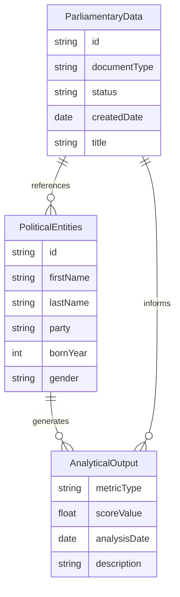

## 📊 Political Entities Data Model

**👤 Person Focus:** Illustrates the structure of political persons (politicians) and their relationships to parties, committees, and other entities.

**🏛️ Organization Focus:** Shows how political organizations are modeled and their relationships within the system.

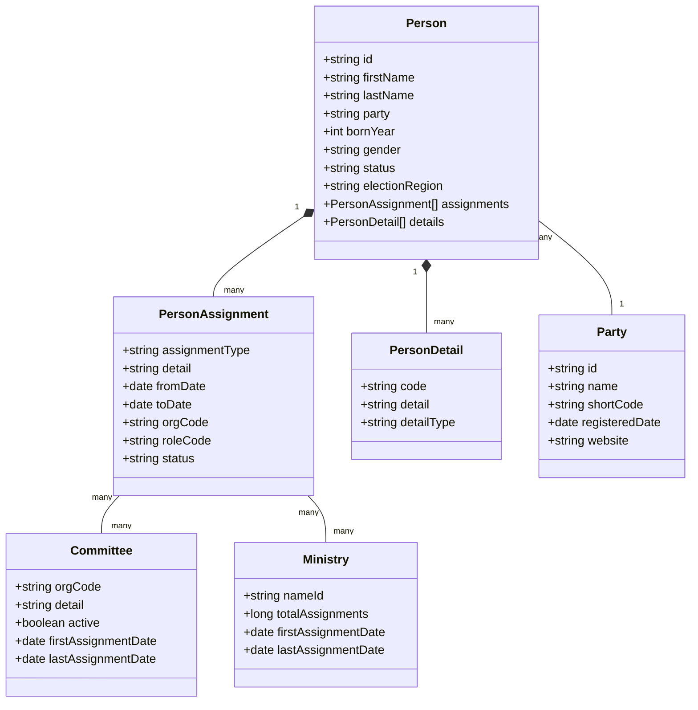

## 📑 Parliamentary Document Data Model

**📄 Document Focus:** Illustrates the structure of parliamentary documents and their relationships.

**🔄 Process Focus:** Shows how documents flow through the parliamentary process.

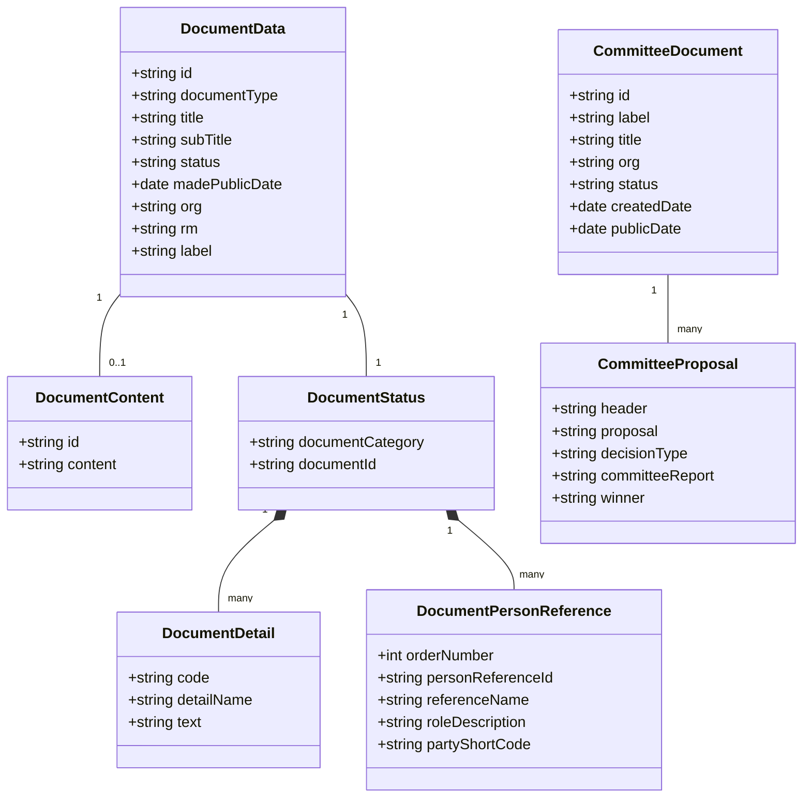

## 🗳️ Voting Data Model

**🗳️ Vote Focus:** Illustrates the structure of voting data from parliamentary sessions.

**📊 Analysis Focus:** Shows how vote data is organized to enable analytical insights.

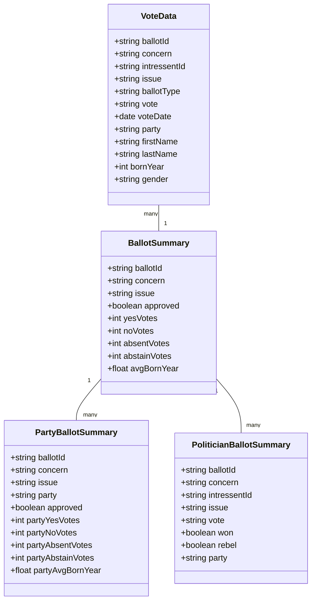

## 🌍 External Data Sources Model

**🌐 Integration Focus:** Illustrates the structure of data from external sources like World Bank.

**🔄 Standardization Focus:** Shows how external data is standardized for platform integration.

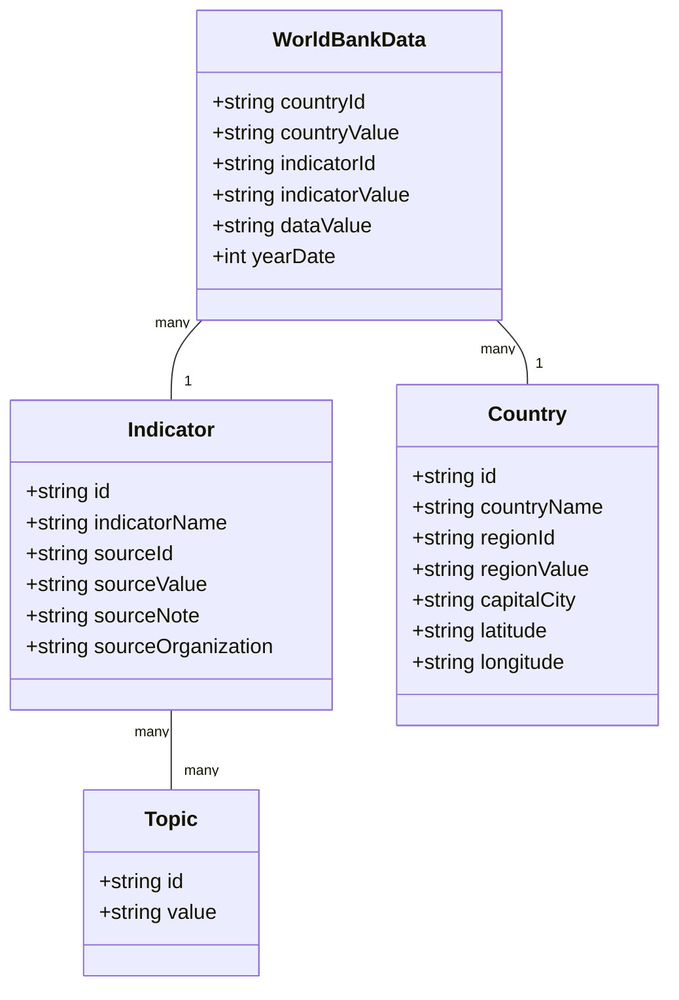

## 🗄️ Electoral Data Model

**🗳️ Election Focus:** Illustrates the structure of electoral data from the Swedish Election Authority.

**🏛️ Geographic Focus:** Shows how electoral regions are organized within the system.

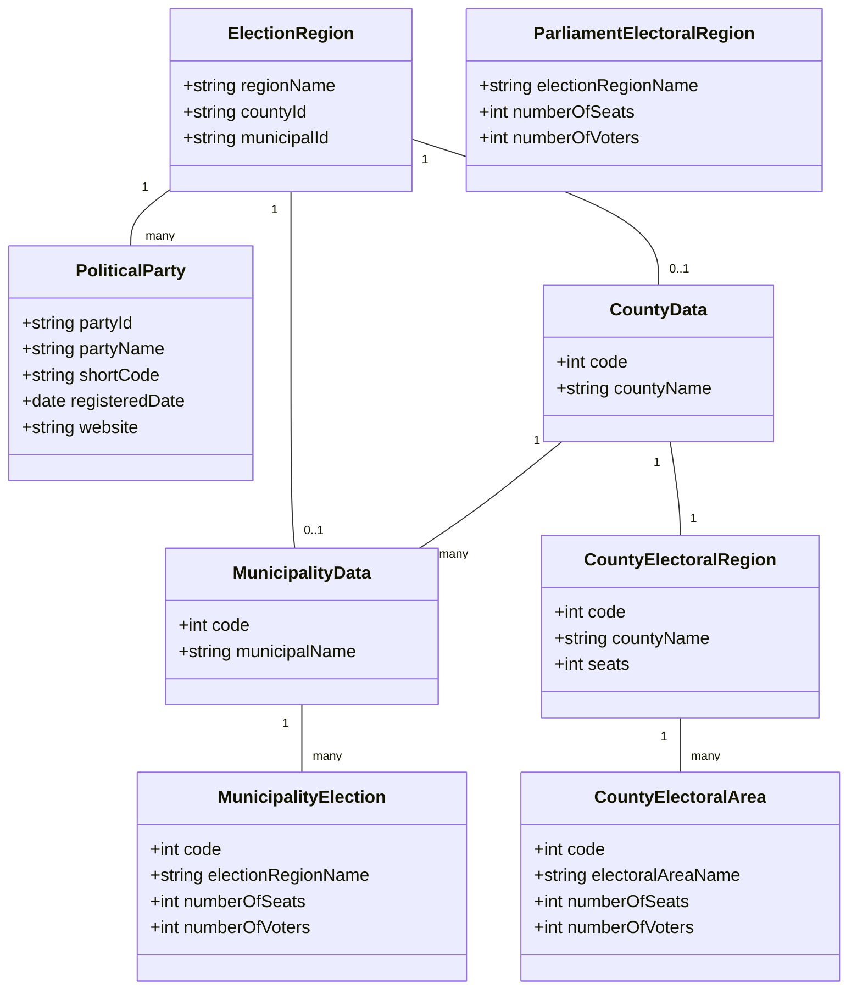

## 👤 User and System Data Model

**👤 User Focus:** Illustrates the structure of user accounts and session data.

**🔧 System Focus:** Shows how system configuration and operation data is organized.

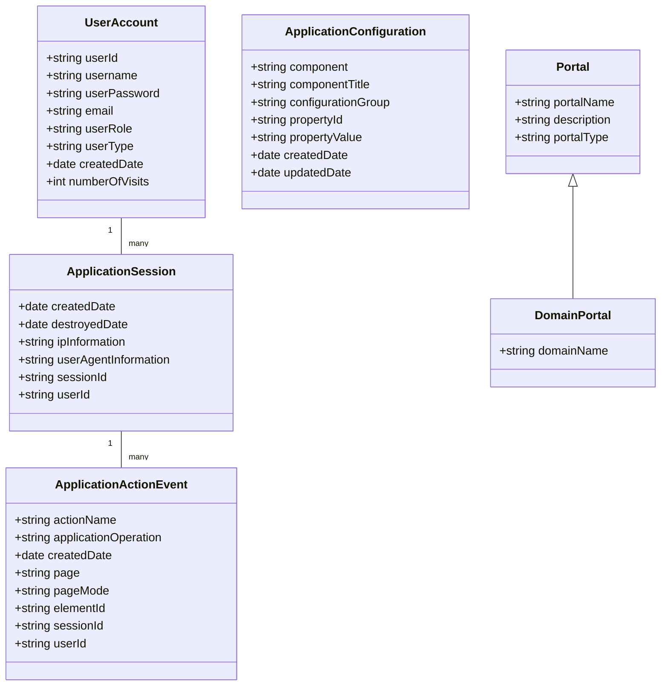

## 🔍 Analytical Views Data Model

**📊 Analytics Focus:** Illustrates the structure of analytical views for political metrics.

**📊 Performance Focus:** Shows how performance metrics are calculated and stored.

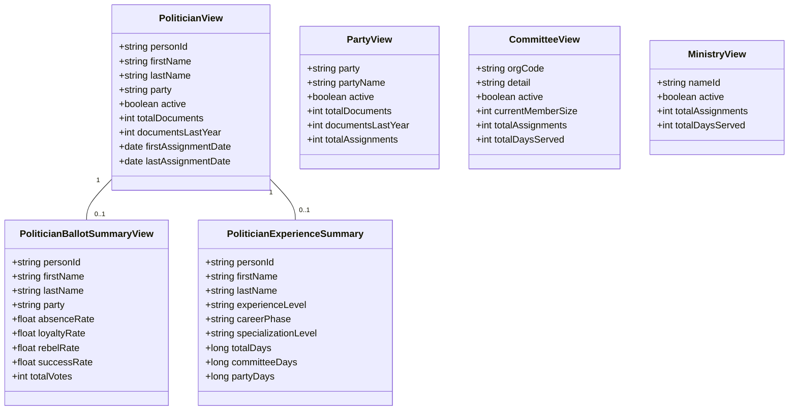

## 🔄 Data Flow Diagram

This diagram illustrates how data flows through the system from various sources to the analytical outputs and user interfaces.

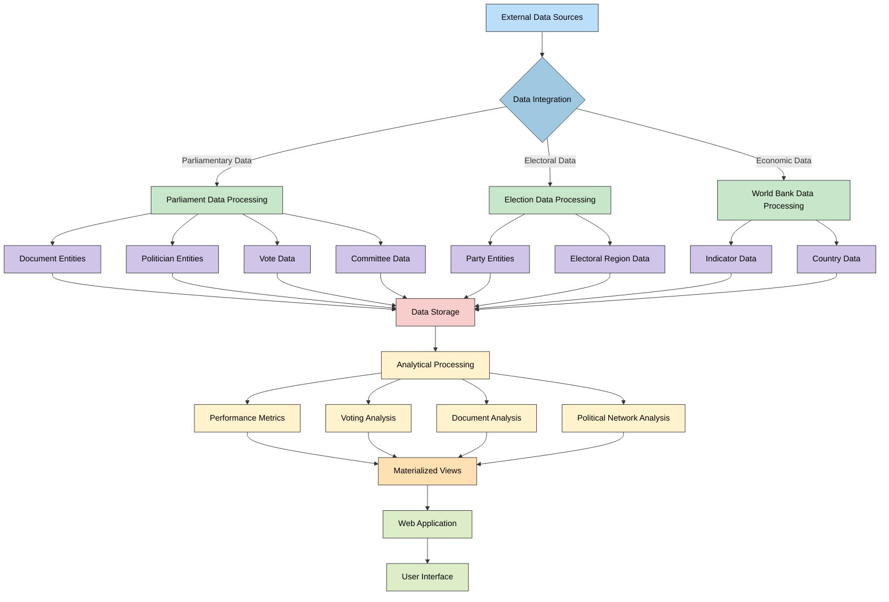

## 🧩 Key Database Tables

| Category | Table Name | Description | Primary Keys | Key Relationships |
|----------|------------|-------------|--------------|-------------------|
| 👤 **Person Data** | `PERSON_DATA` | Political person entities | `ID` | `PERSON_ASSIGNMENT_DATA`, `PERSON_DETAIL_DATA` |
| 👤 **Person Data** | `ASSIGNMENT_DATA` | Political assignments | `HJID` | `PERSON_DATA` (many-to-one) |
| 📑 **Document Data** | `DOCUMENT_DATA` | Parliamentary documents | `ID` | `DOCUMENT_STATUS_CONTAINER` |
| 📑 **Document Data** | `DOCUMENT_CONTENT_DATA` | Document content | `HJID`, `ID` | `DOCUMENT_DATA` (one-to-one) |
| 🏢 **Committee Data** | `COMMITTEE_DOCUMENT_DATA` | Committee documents | `ID` | `COMMITTEE_PROPOSAL_DATA` |
| 🗳️ **Vote Data** | `VOTE_DATA` | Parliamentary votes | Composite (`BALLOT_ID`, `CONCERN`, `INTRESSENT_ID`, `ISSUE`) | - |
| 🌍 **World Bank** | `WORLD_BANK_DATA` | Economic indicators | `HJID` | `DATA_ELEMENT` |
| 🌍 **World Bank** | `COUNTRY_ELEMENT` | Country data | `HJID` | `COUNTRIES_ELEMENT` |
| 🗄️ **Electoral Data** | `SWEDEN_ELECTION_REGION` | Electoral regions | `HJID` | `SWEDEN_POLITICAL_PARTY` |
| 🗄️ **Electoral Data** | `SWEDEN_POLITICAL_PARTY` | Political parties | `HJID` | `SWEDEN_ELECTION_REGION` |
| 👤 **User Data** | `USER_ACCOUNT` | User accounts | `HJID` | `APPLICATION_SESSION` |
| 👤 **User Data** | `APPLICATION_SESSION` | User sessions | `HJID` | `APPLICATION_ACTION_EVENT` |
| 🔧 **System Data** | `APPLICATION_CONFIGURATION` | System configuration | `HJID` | - |

## 📊 Materialized Views for Analytics

The CIA platform uses materialized views to provide efficient access to analytical data. These views transform raw data into meaningful insights about political entities and activities.

| View Name | Purpose | Key Metrics | Base Tables |
|-----------|---------|-------------|------------|
| `VIEW_RIKSDAGEN_POLITICIAN` | Politician profile metrics | Activity levels, document counts, assignment history | `PERSON_DATA`, `ASSIGNMENT_DATA` |
| `VIEW_RIKSDAGEN_PARTY` | Party performance metrics | Member counts, document counts, activity levels | `SWEDEN_POLITICAL_PARTY`, related person tables |
| `VIEW_RIKSDAGEN_COMMITTEE` | Committee activity metrics | Member counts, document counts, assignment data | `COMMITTEE_DOCUMENT_DATA`, related assignment tables |
| `VIEW_RIKSDAGEN_POLITICIAN_BALLOT_SUMMARY` | Voting performance | Loyalty rate, rebel rate, success rate, absence rate | `VOTE_DATA` |
| `View_Riksdagen_Vote_Data_Ballot_Summary` | Vote outcome analysis | Yes/no percentages, absence rates, approval stats | `VOTE_DATA` |
| `view_riksdagen_politician_experience_summary` | Experience analysis | Career phase, knowledge areas, leadership profile | `ASSIGNMENT_DATA`, `PERSON_DATA` |

## 🔄 Database Relationships

This diagram illustrates key relationships between major tables in the database:

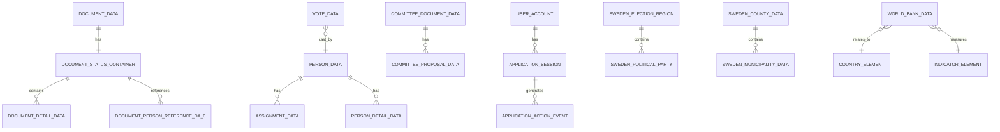

## 📈 Data Flow for Analytics

**🔄 Process Focus:** Illustrates how raw data is transformed into analytical metrics.

**📊 Metrics Focus:** Shows the key transformations that generate political insights.

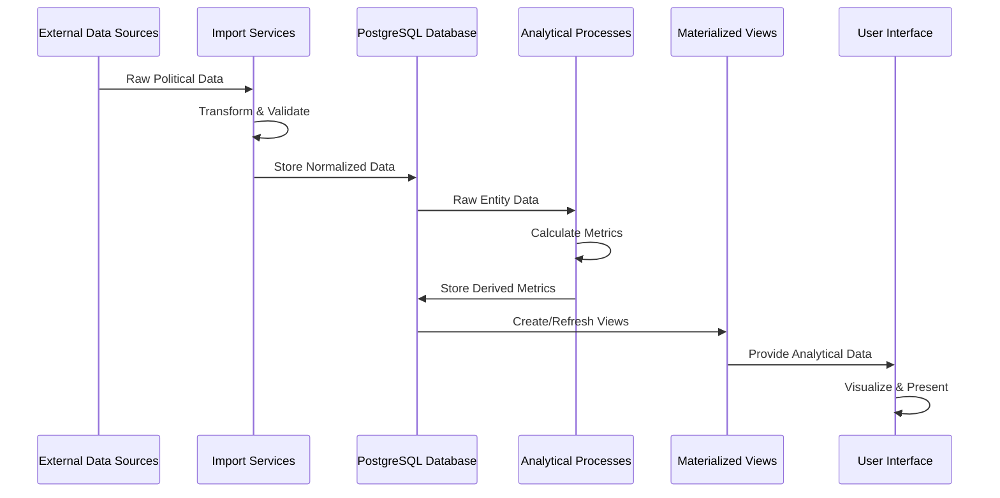

## 💾 PostgreSQL Implementation

The CIA platform uses a PostgreSQL database with:

- 60+ base tables for entity storage
- 30+ materialized views for analytical queries
- Complex relationships modeled through foreign keys
- Composite primary keys for many-to-many relationships
- Audit and tracking capabilities through timestamp fields
- Large text fields for document content (up to 10MB)
- Enumerated types for categorization

### Schema Highlights

```sql
-- Political Person Entity
CREATE TABLE PERSON_DATA (
    ID varchar(255) NOT NULL,
    BORN_YEAR int4,
    ELECTION_REGION varchar(255),
    FIRST_NAME varchar(255),
    LAST_NAME varchar(255),
    GENDER varchar(255),
    PARTY varchar(255),
    STATUS varchar(255),
    PERSON_ASSIGNMENT_DATA_PERSO_0 int8,
    PERSON_DETAIL_DATA_PERSON_DA_0 int8,
    PRIMARY KEY (ID)
);

-- Parliamentary Vote Data
CREATE TABLE VOTE_DATA (
    EMBEDDED_ID_BALLOT_ID varchar(255) NOT NULL,
    EMBEDDED_ID_CONCERN varchar(255) NOT NULL,
    EMBEDDED_ID_INTRESSENT_ID varchar(255) NOT NULL,
    EMBEDDED_ID_ISSUE varchar(255) NOT NULL,
    BALLOT_TYPE varchar(255),
    VOTE varchar(255),
    VOTE_DATE date,
    PARTY varchar(255),
    FIRST_NAME varchar(255),
    LAST_NAME varchar(255),
    BORN_YEAR int4,
    GENDER varchar(255),
    PRIMARY KEY (EMBEDDED_ID_BALLOT_ID, EMBEDDED_ID_CONCERN, EMBEDDED_ID_INTRESSENT_ID, EMBEDDED_ID_ISSUE)
);

-- Political Performance View
CREATE TABLE VIEW_RIKSDAGEN_POLITICIAN_BALLOT_SUMMARY (
    PERSON_ID varchar(255) NOT NULL,
    ABSENCE_RATE float8,
    LOYALTY_RATE float8,
    REBEL_RATE float8,
    SUCCESS_RATE float8,
    TOTAL_VOTES int8,
    FIRST_NAME varchar(255),
    LAST_NAME varchar(255),
    PARTY varchar(255),
    PRIMARY KEY (PERSON_ID)
);
```

## 🔄 Data Model Evolution

**🚀 Future Focus:** Shows how the current data model will evolve in line with the future architecture vision.

**🔍 Enhancement Focus:** Illustrates the planned data model improvements.

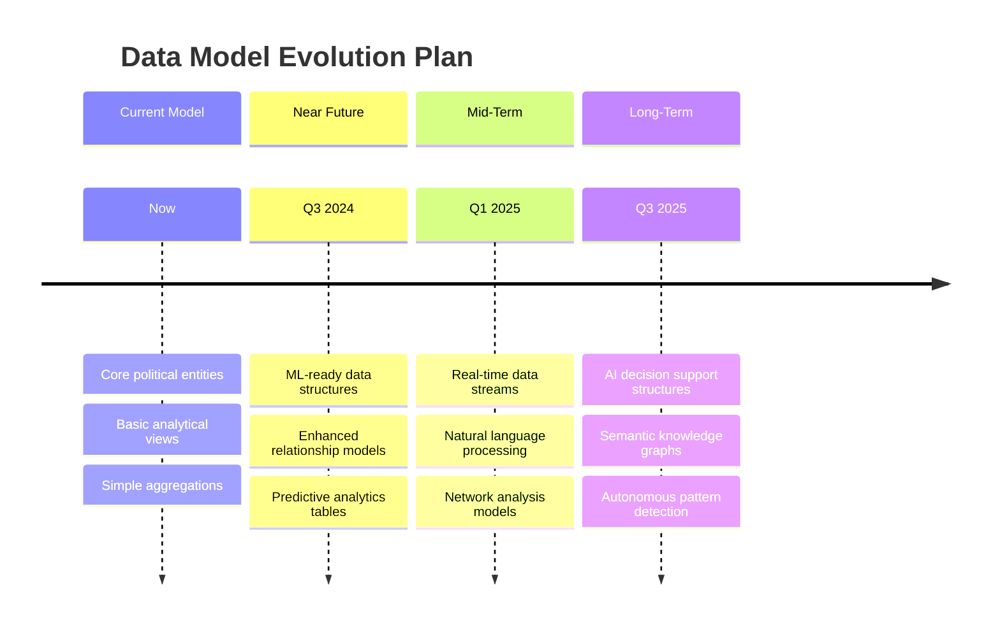

## 🧩 Key Data Model Implementation Features

| Feature | Implementation | Purpose | Examples |
|---------|----------------|---------|----------|
| 🔑 **Entity Tracking** | Unique identifiers | Track entities across data sources | `PERSON_DATA.ID`, `DOCUMENT_DATA.ID` |
| 🔄 **Historical Tracking** | Date fields | Track changes over time | `FROM_DATE`, `TO_DATE`, `CREATED_DATE` |
| 📊 **Analytical Aggregation** | Materialized views | Pre-compute metrics for performance | `VIEW_RIKSDAGEN_POLITICIAN`, `VIEW_RIKSDAGEN_PARTY` |
| 🔍 **Multi-dimensional Analysis** | Time-based aggregation views | Enable time-series analysis | `*_DAILY_SUMMARY`, `*_MONTHLY_SUMMARY`, `*_ANNUAL_SUMMARY` views |
| 🌐 **External Integration** | Standardized entity mapping | Connect with external data sources | World Bank tables, riksdagen tables |
| 👤 **User Behavior Tracking** | Session and event tables | Track user interactions | `APPLICATION_SESSION`, `APPLICATION_ACTION_EVENT` |
| 🔒 **Security Implementation** | User account structures | Manage authentication and authorization | `USER_ACCOUNT`, `EncryptedValue` |

This data model documentation provides a comprehensive view of the CIA platform's current data structures and relationships. It illustrates how political data is organized, analyzed, and presented to enable transparency and citizen engagement with political processes.

For more detailed information on specific entities, please refer to the [Entity Model Documentation](https://hack23.github.io/cia/service.data.impl/hbm2doc/entities/index.html).

## Related Documentation

- [Architecture Documentation](ARCHITECTURE.md) - System architecture overview
- [Entity Model Documentation](https://hack23.github.io/cia/service.data.impl/hbm2doc/entities/index.html) - Detailed entity documentation
- [Future Vision](FUTURE_MINDMAP.md) - Roadmap for AI-enhanced capabilities
- [MINDMAP Documentation](MINDMAP.md) - Conceptual overview of system components
- [AWS Services Stack](README.md#aws-services-stack) - Cloud deployment architecture
