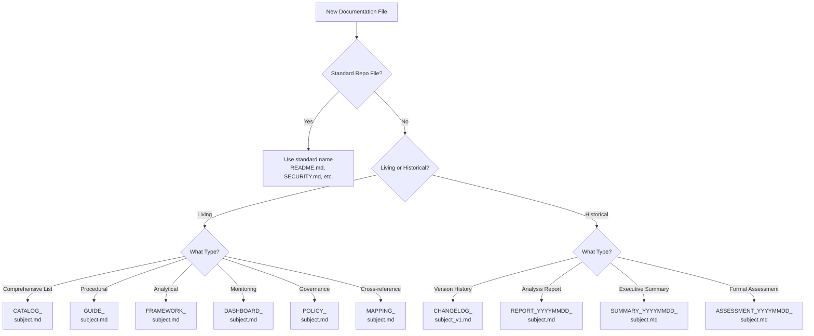

# CIA Documentation Naming Convention

**Version:** 1.0  
**Effective Date:** 2025-12-11  
**Classification:** Internal Standard  
**Maintained By:** Citizen Intelligence Agency Intelligence Operations Team  
**Scope:** Guidelines for NEW documentation files only

> ⚠️ **IMPORTANT**: This convention applies to **NEW documentation files only**. **DO NOT rename existing documentation files** as they have external references from hack23.com blog posts, GitHub links, and other external sources. Breaking these links would harm SEO, user experience, and documentation accessibility.

---

## 🎯 Purpose

This document establishes standardized naming conventions for **NEW** CIA project documentation files to ensure:
- **Clarity**: Document type and purpose immediately identifiable from filename
- **Currency**: Clear distinction between living documents and point-in-time reports
- **Consistency**: Uniform naming patterns for new documentation
- **Discoverability**: Predictable filenames that facilitate navigation
- **Lifecycle Management**: Proper versioning and temporal tracking
- **Link Stability**: Preservation of existing URLs for external references

---

## 📋 Standardized Metadata Headers

All documentation files should include a standardized metadata header following this format:

### Standard Metadata Fields (in order)

```markdown
# Document Title

**Document Type:** [Catalog|Guide|Framework|Dashboard|Policy|Report|Summary|Assessment] (Living Document|Point-in-Time Snapshot)
**Status:** [Active - Continuously Updated|Archived|Deprecated]
**Last Updated:** YYYY-MM-DD
**Version:** [Optional - for versioned documents, e.g., 1.0, 2.0.0]
**Purpose:** [One-line description of document purpose]
**Classification:** [Optional - e.g., Public Documentation, Internal]
**Target Audience:** [Optional - e.g., Database Administrators, Developers]
**External References:** [Yes/No - Details if Yes]
**Maintained By:** [Optional - Team or person responsible]
```

### Field Descriptions

| Field | Required | Description | Example |
|-------|----------|-------------|---------|
| **Document Type** | Yes | Type and lifecycle status | `Catalog (Living Document)` |
| **Status** | Yes | Current document status | `Active - Continuously Updated` |
| **Last Updated** | Yes | Date of last significant update | `2025-12-11` |
| **Version** | Optional | Version number for versioned docs | `1.0` or `2.0.0` |
| **Purpose** | Yes | Brief description of purpose | `Comprehensive catalog of database views` |
| **Classification** | Optional | Access/visibility level | `Public Documentation` |
| **Target Audience** | Optional | Intended readers | `Database Administrators, DevOps` |
| **External References** | Yes | Whether externally linked | `Yes - Referenced in blog posts` |
| **Maintained By** | Optional | Responsible party | `Intelligence Operations Team` |

### Examples

**Living Document Example:**
```markdown
# Database View Intelligence Catalog

**Document Type:** Catalog (Living Document)  
**Status:** Active - Continuously Updated  
**Last Updated:** 2025-12-11  
**Version:** 1.0  
**Purpose:** Single source of truth for database view definitions and usage patterns  
**Classification:** Public Documentation  
**External References:** Yes - Referenced in hack23.com blog posts  
**Maintained By:** Intelligence Operations Team
```

**Point-in-Time Report Example:**
```markdown
# OSINT Validation Report - November 2025

**Document Type:** Report (Point-in-Time Snapshot)  
**Status:** Archived  
**Last Updated:** 2025-11-25  
**Purpose:** Validation results for OSINT data sources as of November 2025  
**External References:** No
```

---

## 📋 Document Type Prefixes

### Living Documents (Current State - Always Up-to-Date)

Documents that are continuously maintained to reflect current state:

| Prefix | Description | Examples | Update Frequency |
|--------|-------------|----------|------------------|
| **CATALOG_** | Comprehensive listings and inventories | `DATABASE_VIEW_INTELLIGENCE_CATALOG.md`, `RISK_RULES_INTOP_OSINT.md` | Continuous |
| **GUIDE_** | How-to and procedural documents | `README-SCHEMA-MAINTENANCE.md`, `GUIDE_DEPLOYMENT.md` | As needed |
| **FRAMEWORK_** | Analytical/methodological frameworks | `DATA_ANALYSIS_INTOP_OSINT.md`, `FRAMEWORK_INTELLIGENCE_DATA_FLOW.md` | Major updates |
| **DASHBOARD_** | Monitoring and metrics dashboards | `DATA_QUALITY_MONITORING_DASHBOARD.md` | Continuous |
| **POLICY_** | Rules, standards, and governance | `POLICY_DATA_CLASSIFICATION.md`, `POLICY_SECURITY.md` | Quarterly review |
| **MAPPING_** | Cross-reference and relationship documents | `ENTITY_VIEW_MAPPING.md` | As schema changes |

### Historical/Versioned Documents

Documents representing specific points in time or versions:

| Prefix | Description | Examples | Retention |
|--------|-------------|----------|-----------|
| **CHANGELOG_** | Version history and evolution tracking | `CHANGELOG_INTELLIGENCE.md` | Permanent |
| **REPORT_YYYYMMDD_** | Point-in-time analysis reports | `REPORT_20251125_OSINT_VALIDATION.md` | Archive after 6 months |
| **SUMMARY_YYYYMMDD_** | Executive summaries of specific work | `SUMMARY_20251201_MINISTRY_FIXES.md` | Archive after 6 months |
| **ASSESSMENT_YYYYMMDD_** | Formal assessments and evaluations | `ASSESSMENT_20250115_SECURITY.md` | Archive after 12 months |

### Special Documents (No Prefix)

Standard repository files that follow GitHub/industry conventions:

- `README.md` - Primary project documentation
- `ARCHITECTURE.md` - System architecture overview
- `SECURITY.md` - Security policy and vulnerability reporting
- `CONTRIBUTING.md` - Contribution guidelines
- `CODE_OF_CONDUCT.md` - Community standards
- `LICENSE.txt` - Legal license information
- `CODEOWNERS` - Code ownership definitions

---

## 📏 Naming Rules (For NEW Files Only)

### 1. Case Conventions

- **Prefixes**: UPPERCASE (e.g., `CATALOG_`, `GUIDE_`)
- **Document Type Keywords**: UPPERCASE (e.g., `DATABASE`, `RISK`, `OSINT`)
- **Descriptive Words**: Lowercase for prepositions/connectors (e.g., `_and_`, `_for_`)
- **Acronyms**: UPPERCASE (e.g., `OSINT`, `SQL`, `API`)

### 2. Separators

- **Prefix Separation**: Single underscore after prefix (`CATALOG_`)
- **Word Separation**: Underscores within filename (`DATABASE_VIEWS`)
- **Date Stamps**: YYYYMMDD format without separators (`20251125`)

### 3. Date Formats

- **Point-in-Time Reports**: `YYYYMMDD` immediately after prefix
  - Example: `REPORT_20251125_OSINT_VALIDATION.md`
  - Format: ISO 8601 compact date (e.g., 2025-11-25 → 20251125)

### 4. Version Indicators

- **Major Versions**: `_v1`, `_v2`, etc. at end of base filename
  - Example: `CHANGELOG_INTELLIGENCE_v1.md`
- **Semantic Versioning**: When detailed versioning needed in content, not filename
- **Version History**: Track in changelog, not duplicate files

### 5. Length Constraints

- **Target**: Keep under 50 characters when possible
- **Maximum**: 80 characters (filesystem compatibility)
- **Balance**: Descriptive vs. concise

---

## ✅ Good Naming Examples (For NEW Files)

### Living Documents

```
✅ DATABASE_VIEW_INTELLIGENCE_CATALOG.md
   - Clear type (catalog), clear subject (database views)

✅ README-SCHEMA-MAINTENANCE.md
   - Procedural guide for schema operations

✅ DATA_ANALYSIS_INTOP_OSINT.md
   - Analytical framework with domain specification

✅ DATA_QUALITY_MONITORING_DASHBOARD.md
   - Monitoring dashboard for data quality metrics

✅ POLICY_DATA_CLASSIFICATION.md
   - Governance policy for data handling

✅ ENTITY_VIEW_MAPPING.md
   - Cross-reference mapping document
```

### Historical/Versioned Documents

```
✅ CHANGELOG_INTELLIGENCE.md
   - Versioned changelog (major version 1)

✅ REPORT_20251125_OSINT_VALIDATION.md
   - Point-in-time validation report with date

✅ SUMMARY_20251201_MINISTRY_FIXES.md
   - Executive summary of specific work completed

✅ ASSESSMENT_20250115_SECURITY.md
   - Formal security assessment conducted on specific date
```

### Special Documents

```
✅ README.md
   - Standard GitHub convention

✅ ARCHITECTURE.md
   - Industry-standard architecture documentation

✅ SECURITY.md
   - GitHub security policy convention
```

---

## ❌ Bad Naming Examples (For NEW Files)

### Avoid These Patterns for NEW Documentation

> **Note**: The examples below show naming patterns to AVOID when creating NEW documentation files. These are NOT recommendations to rename existing files, which must be preserved to maintain external link integrity.

```
❌ database_view_catalog.md
   - Lowercase (inconsistent), no type prefix

❌ Analysis_Data_OSINT.md
   - Mixed case (inconsistent), no type prefix, unclear structure

❌ ministry_fixes_summary.md
   - No date stamp for point-in-time document, lowercase, no type prefix

❌ validation_report.md
   - No date stamp, unclear if current or historical, lowercase, no type prefix

❌ view_catalog.md
   - Lowercase (inconsistent), no prefix

❌ DatabaseViews.md
   - CamelCase (inconsistent), no prefix

❌ db-view-catalog.md
   - Hyphens instead of underscores, lowercase, no prefix
```

---

## 📝 Naming Process for NEW Files

> **IMPORTANT**: This section applies ONLY to creating NEW documentation files. DO NOT use these steps to rename existing files.

### Step 1: Assess Document Requirements

1. **Determine Document Type**:
   - Is it continuously updated (living) or point-in-time (historical)?
   - What category does it fit (catalog, guide, framework, report)?

2. **Check Naming Conflicts**:
   - Does a similar file already exist?
   - Would this name conflict with existing documentation?

### Step 2: Choose Appropriate Name

Apply the appropriate prefix and structure for NEW files:

**Examples for NEW Files:**

```
Scenario: Creating a new database views catalog
Recommended: CATALOG_DATABASE_VIEWS.md

Scenario: Creating a new OSINT analysis framework
Recommended: FRAMEWORK_DATA_ANALYSIS_OSINT.md

Scenario: Creating a point-in-time validation report
Recommended: REPORT_20251201_OSINT_VALIDATION.md
```

### Step 3: Create File with Metadata Header

Include standardized metadata at the top:

```markdown
# Document Title

**Document Type:** [Catalog|Guide|Framework|Dashboard|Report|Summary]
**Status:** [Active - Continuously Updated|Point-in-Time Snapshot]
**Last Updated:** YYYY-MM-DD
**Purpose:** [Brief description]
**External References:** [Yes/No - Details if applicable]
```

### Step 4: Register in Documentation Index

Add reference to the new file in:
- README.md (if appropriate)
- Relevant documentation index files
- Cross-reference from related documents

---

## 📦 Archive Strategy (For NEW Point-in-Time Reports)

### When to Archive

- **Point-in-Time Reports**: After 6 months or when superseded
- **Historical Summaries**: After 6 months or when integrated into living docs
- **Deprecated Documentation**: Immediately upon replacement

### Archive Location

```
docs/archive/
├── reports-2025-11/
│   ├── REPORT_20251125_OSINT_VALIDATION.md
│   └── REPORT_20251125_SQL_VALIDATION.md
├── summaries-2025-12/
│   ├── SUMMARY_20251201_MINISTRY_FIXES.md
│   └── SUMMARY_20251205_IMPLEMENTATION.md
└── deprecated/
    └── LEGACY_DOCUMENTATION.md
```

### Archive Header Template

Add to top of archived documents:

```markdown
> ⚠️ **ARCHIVED DOCUMENT**  
> This document was archived on YYYY-MM-DD.  
> Current documentation: [Link to replacement document]
```

---

## 🎯 Decision Tree (For NEW Files)

Use this flowchart to determine correct naming for **NEW** documentation files:



---

## 📚 Existing Files - Reference Only

**These files have established names with external references. DO NOT rename:**

| Current Name | Document Type | Status | External Links |
|--------------|---------------|--------|----------------|
| `DATABASE_VIEW_INTELLIGENCE_CATALOG.md` | Catalog | Living | Yes - Blog posts |
| `DATA_ANALYSIS_INTOP_OSINT.md` | Framework | Living | Yes - Blog posts |
| `RISK_RULES_INTOP_OSINT.md` | Catalog | Living | Yes - Blog posts |
| `service.data.impl/README-SCHEMA-MAINTENANCE.md` | Guide | Living | Yes - Workflows |
| `INTELLIGENCE_DATA_FLOW.md` | Framework | Living | Yes - Documentation |
| `DATA_QUALITY_MONITORING_DASHBOARD.md` | Dashboard | Living | Yes - Documentation |
| `ENTITY_VIEW_MAPPING.md` | Mapping | Living | Yes - Documentation |
| `LIQUIBASE_CHANGELOG_INTELLIGENCE_ANALYSIS.md` | Analysis | Living | Yes - Documentation |
| `CHANGELOG_INTELLIGENCE.md` | Changelog | Versioned | Yes - Release notes |

### What These Names Would Be If Creating NEW Files

> **For reference only** - showing what ideal names would be for NEW files with similar purpose:

| Existing File (Keep As-Is) | Ideal Name for NEW Similar File | Rationale |
|----------------------------|----------------------------------|-----------|
| `DATABASE_VIEW_INTELLIGENCE_CATALOG.md` | `CATALOG_DATABASE_VIEWS.md` | Type prefix first |
| `DATA_ANALYSIS_INTOP_OSINT.md` | `FRAMEWORK_DATA_ANALYSIS_OSINT.md` | Clear framework type |
| `RISK_RULES_INTOP_OSINT.md` | `CATALOG_RISK_RULES.md` | Type prefix first |
| `INTELLIGENCE_DATA_FLOW.md` | `FRAMEWORK_INTELLIGENCE_DATA_FLOW.md` | Clear framework type |
| `DATA_QUALITY_MONITORING_DASHBOARD.md` | `DASHBOARD_DATA_QUALITY.md` | Type prefix first |
| `ENTITY_VIEW_MAPPING.md` | `MAPPING_ENTITY_VIEW.md` | Type prefix first |

**These are examples only - existing files are preserved to maintain external link integrity.**

---

## 🔍 Validation Checklist (For NEW Files)

When creating a new documentation file, verify:

- [ ] All markdown links updated and working
- [ ] Git history preserved (`git log --follow new-filename.md`)
- [ ] No broken cross-references (`grep -r "old-filename"`)
- [ ] Workflows updated (`.github/workflows/*.yml`)
- [ ] README.md references updated
- [ ] Copilot instructions updated (`.github/copilot-instructions.md`)
- [ ] Archive headers added to archived documents

---

## 📖 Related Documentation

- [README.md](README.md) - Project overview and navigation
- [CONTRIBUTING.md](CONTRIBUTING.md) - Contribution guidelines
- [ARCHITECTURE.md](ARCHITECTURE.md) - System architecture

---

## 📝 Amendment History

| Version | Date | Changes | Author |
|---------|------|---------|--------|
| 1.0 | 2025-12-11 | Initial standard established | Intelligence Operations Team |

---

**Questions or Clarifications?**  
Contact the Intelligence Operations Team or open an issue with tag `type:docs`.
