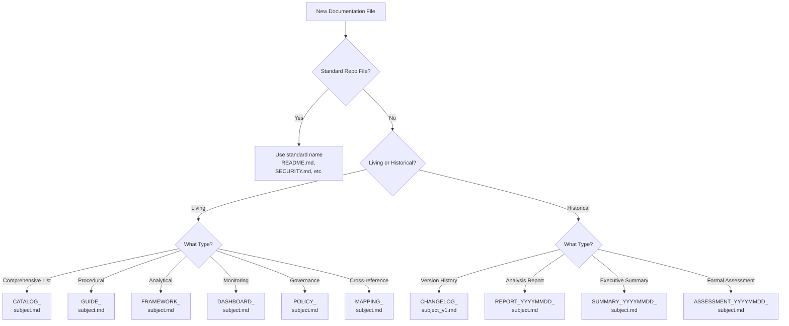

# CIA Documentation Naming Convention

**Version:** 1.0  
**Effective Date:** 2025-12-11  
**Classification:** Internal Standard  
**Maintained By:** Citizen Intelligence Agency Intelligence Operations Team  
**Scope:** Guidelines for NEW documentation files only

> ⚠️ **IMPORTANT**: This convention applies to **NEW documentation files only**. **DO NOT rename existing documentation files** as they have external references from hack23.com blog posts, GitHub links, and other external sources. Breaking these links would harm SEO, user experience, and documentation accessibility.

---

## 🎯 Purpose

This document establishes standardized naming conventions for **NEW** CIA project documentation files to ensure:
- **Clarity**: Document type and purpose immediately identifiable from filename
- **Currency**: Clear distinction between living documents and point-in-time reports
- **Consistency**: Uniform naming patterns for new documentation
- **Discoverability**: Predictable filenames that facilitate navigation
- **Lifecycle Management**: Proper versioning and temporal tracking
- **Link Stability**: Preservation of existing URLs for external references

---

## 📋 Document Type Prefixes

### Living Documents (Current State - Always Up-to-Date)

Documents that are continuously maintained to reflect current state:

| Prefix | Description | Examples | Update Frequency |
|--------|-------------|----------|------------------|
| **CATALOG_** | Comprehensive listings and inventories | `DATABASE_VIEW_INTELLIGENCE_CATALOG.md`, `RISK_RULES_INTOP_OSINT.md` | Continuous |
| **GUIDE_** | How-to and procedural documents | `README-SCHEMA-MAINTENANCE.md`, `GUIDE_DEPLOYMENT.md` | As needed |
| **FRAMEWORK_** | Analytical/methodological frameworks | `DATA_ANALYSIS_INTOP_OSINT.md`, `FRAMEWORK_INTELLIGENCE_DATA_FLOW.md` | Major updates |
| **DASHBOARD_** | Monitoring and metrics dashboards | `DATA_QUALITY_MONITORING_DASHBOARD.md` | Continuous |
| **POLICY_** | Rules, standards, and governance | `POLICY_DATA_CLASSIFICATION.md`, `POLICY_SECURITY.md` | Quarterly review |
| **MAPPING_** | Cross-reference and relationship documents | `ENTITY_VIEW_MAPPING.md` | As schema changes |

### Historical/Versioned Documents

Documents representing specific points in time or versions:

| Prefix | Description | Examples | Retention |
|--------|-------------|----------|-----------|
| **CHANGELOG_** | Version history and evolution tracking | `CHANGELOG_INTELLIGENCE.md` | Permanent |
| **REPORT_YYYYMMDD_** | Point-in-time analysis reports | `REPORT_20251125_OSINT_VALIDATION.md` | Archive after 6 months |
| **SUMMARY_YYYYMMDD_** | Executive summaries of specific work | `SUMMARY_20251201_MINISTRY_FIXES.md` | Archive after 6 months |
| **ASSESSMENT_YYYYMMDD_** | Formal assessments and evaluations | `ASSESSMENT_20250115_SECURITY.md` | Archive after 12 months |

### Special Documents (No Prefix)

Standard repository files that follow GitHub/industry conventions:

- `README.md` - Primary project documentation
- `ARCHITECTURE.md` - System architecture overview
- `SECURITY.md` - Security policy and vulnerability reporting
- `CONTRIBUTING.md` - Contribution guidelines
- `CODE_OF_CONDUCT.md` - Community standards
- `LICENSE.txt` - Legal license information
- `CODEOWNERS` - Code ownership definitions

---

## 📏 Naming Rules (For NEW Files Only)

### 1. Case Conventions

- **Prefixes**: UPPERCASE (e.g., `CATALOG_`, `GUIDE_`)
- **Document Type Keywords**: UPPERCASE (e.g., `DATABASE`, `RISK`, `OSINT`)
- **Descriptive Words**: Lowercase for prepositions/connectors (e.g., `_and_`, `_for_`)
- **Acronyms**: UPPERCASE (e.g., `OSINT`, `SQL`, `API`)

### 2. Separators

- **Prefix Separation**: Single underscore after prefix (`CATALOG_`)
- **Word Separation**: Underscores within filename (`DATABASE_VIEWS`)
- **Date Stamps**: YYYYMMDD format without separators (`20251125`)

### 3. Date Formats

- **Point-in-Time Reports**: `YYYYMMDD` immediately after prefix
  - Example: `REPORT_20251125_OSINT_VALIDATION.md`
  - Format: ISO 8601 compact date (e.g., 2025-11-25 → 20251125)

### 4. Version Indicators

- **Major Versions**: `_v1`, `_v2`, etc. at end of base filename
  - Example: `CHANGELOG_INTELLIGENCE.md`
- **Semantic Versioning**: When detailed versioning needed in content, not filename
- **Version History**: Track in changelog, not duplicate files

### 5. Length Constraints

- **Target**: Keep under 50 characters when possible
- **Maximum**: 80 characters (filesystem compatibility)
- **Balance**: Descriptive vs. concise

---

## ✅ Good Naming Examples (For NEW Files)

### Living Documents

```
✅ DATABASE_VIEW_INTELLIGENCE_CATALOG.md
   - Clear type (catalog), clear subject (database views)

✅ README-SCHEMA-MAINTENANCE.md
   - Procedural guide for schema operations

✅ DATA_ANALYSIS_INTOP_OSINT.md
   - Analytical framework with domain specification

✅ DATA_QUALITY_MONITORING_DASHBOARD.md
   - Monitoring dashboard for data quality metrics

✅ POLICY_DATA_CLASSIFICATION.md
   - Governance policy for data handling

✅ ENTITY_VIEW_MAPPING.md
   - Cross-reference mapping document
```

### Historical/Versioned Documents

```
✅ CHANGELOG_INTELLIGENCE.md
   - Versioned changelog (major version 1)

✅ REPORT_20251125_OSINT_VALIDATION.md
   - Point-in-time validation report with date

✅ SUMMARY_20251201_MINISTRY_FIXES.md
   - Executive summary of specific work completed

✅ ASSESSMENT_20250115_SECURITY.md
   - Formal security assessment conducted on specific date
```

### Special Documents

```
✅ README.md
   - Standard GitHub convention

✅ ARCHITECTURE.md
   - Industry-standard architecture documentation

✅ SECURITY.md
   - GitHub security policy convention
```

---

## ❌ Bad Naming Examples

### Avoid These Patterns

```
❌ DATABASE_VIEW_INTELLIGENCE_CATALOG.md
   - No type prefix, ambiguous document type, subject buried

❌ DATA_ANALYSIS_INTOP_OSINT.md
   - No type prefix, unclear abbreviation (INTOP)

❌ MINISTRY_VIEW_FIXES_SUMMARY.md
   - No date stamp for historical document, confusing order

❌ VALIDATION_REPORT.md
   - No date stamp, unclear if current or historical

❌ view_catalog.md
   - Lowercase (inconsistent), no prefix

❌ DatabaseViews.md
   - CamelCase (inconsistent), no prefix

❌ db-view-catalog.md
   - Hyphens instead of underscores, lowercase, no prefix
```

---

## 🔄 Migration Strategy

### Step 1: Assess Current Document

1. **Determine Document Type**:
   - Is it continuously updated (living) or point-in-time (historical)?
   - What category does it fit (catalog, guide, framework, report)?

2. **Check for Dependencies**:
   - What documents reference this file?
   - Are there hardcoded paths in code or workflows?

### Step 2: Choose New Name

Apply the appropriate prefix and structure:

```
Old: DATABASE_VIEW_INTELLIGENCE_CATALOG.md
Analysis: Living catalog of database views
New: DATABASE_VIEW_INTELLIGENCE_CATALOG.md

Old: DATA_ANALYSIS_INTOP_OSINT.md
Analysis: Analytical framework document
New: DATA_ANALYSIS_INTOP_OSINT.md

Old: MINISTRY_VIEW_FIXES_SUMMARY.md
Analysis: Historical summary from 2025-12-01
New: SUMMARY_20251201_MINISTRY_FIXES.md
```

### Step 3: Execute Rename

**Always use `git mv` to preserve history:**

```bash
git mv old-filename.md new-filename.md
```

### Step 4: Update Cross-References

Search for all references and update systematically:

```bash
# Find all references to old filename
grep -r "old-filename.md" --include="*.md"

# Update references (review before committing)
find . -name "*.md" -type f -exec sed -i 's|old-filename\.md|new-filename.md|g' {} +
```

### Step 5: Update Workflows

Check and update any GitHub Actions or CI/CD references:

```bash
find .github/workflows -name "*.yml" -type f -exec grep -l "old-filename" {} \;
```

---

## 📦 Archive Strategy (For NEW Point-in-Time Reports)

### When to Archive

- **Point-in-Time Reports**: After 6 months or when superseded
- **Historical Summaries**: After 6 months or when integrated into living docs
- **Deprecated Documentation**: Immediately upon replacement

### Archive Location

```
docs/archive/
├── reports-2025-11/
│   ├── REPORT_20251125_OSINT_VALIDATION.md
│   └── REPORT_20251125_SQL_VALIDATION.md
├── summaries-2025-12/
│   ├── SUMMARY_20251201_MINISTRY_FIXES.md
│   └── SUMMARY_20251205_IMPLEMENTATION.md
└── deprecated/
    └── LEGACY_DOCUMENTATION.md
```

### Archive Header Template

Add to top of archived documents:

```markdown
> ⚠️ **ARCHIVED DOCUMENT**  
> This document was archived on YYYY-MM-DD.  
> Current documentation: [Link to replacement document]
```

---

## 🎯 Decision Tree (For NEW Files)

Use this flowchart to determine correct naming for **NEW** documentation files:



---

## 📚 Complete Migration Mapping

### Living Documents

| Current Name | New Name | Rationale |
|--------------|----------|-----------|
| `DATABASE_VIEW_INTELLIGENCE_CATALOG.md` | `DATABASE_VIEW_INTELLIGENCE_CATALOG.md` | Catalog of database views |
| `DATA_ANALYSIS_INTOP_OSINT.md` | `DATA_ANALYSIS_INTOP_OSINT.md` | Analytical framework |
| `RISK_RULES_INTOP_OSINT.md` | `RISK_RULES_INTOP_OSINT.md` | Catalog of risk rules |
| `service.data.impl/README-SCHEMA-MAINTENANCE.md` | `service.data.impl/README-SCHEMA-MAINTENANCE.md` | Procedural guide |
| `INTELLIGENCE_DATA_FLOW.md` | `FRAMEWORK_INTELLIGENCE_DATA_FLOW.md` | Data flow framework |
| `DATA_QUALITY_MONITORING_DASHBOARD.md` | `DATA_QUALITY_MONITORING_DASHBOARD.md` | Monitoring dashboard |
| `ENTITY_VIEW_MAPPING.md` | `ENTITY_VIEW_MAPPING.md` | Cross-reference mapping |
| `LIQUIBASE_CHANGELOG_INTELLIGENCE_ANALYSIS.md` | `LIQUIBASE_CHANGELOG_INTELLIGENCE_ANALYSIS.md` | Analysis of changelog |

### Changelog Documents

| Current Name | New Name | Rationale |
|--------------|----------|-----------|
| `CHANGELOG_INTELLIGENCE.md` | `CHANGELOG_INTELLIGENCE.md` | Add version indicator |

### No Change Required

| Document | Reason |
|----------|--------|
| `README.md` | Standard GitHub convention |
| `ARCHITECTURE.md` | Industry standard |
| `SECURITY.md` | GitHub security policy |
| `CONTRIBUTING.md` | Standard convention |
| `CODE_OF_CONDUCT.md` | Standard convention |
| `SWOT.md` | Established document |
| `DATA_MODEL.md` | Established document |
| `THREAT_MODEL.md` | Established document |

---

## 🔍 Validation Checklist (For NEW Files)

When creating a new documentation file, verify:

- [ ] All markdown links updated and working
- [ ] Git history preserved (`git log --follow new-filename.md`)
- [ ] No broken cross-references (`grep -r "old-filename"`)
- [ ] Workflows updated (`.github/workflows/*.yml`)
- [ ] README.md references updated
- [ ] Copilot instructions updated (`.github/copilot-instructions.md`)
- [ ] Archive headers added to archived documents

---

## 📖 Related Documentation

- [README.md](README.md) - Project overview and navigation
- [CONTRIBUTING.md](CONTRIBUTING.md) - Contribution guidelines
- [ARCHITECTURE.md](ARCHITECTURE.md) - System architecture

---

## 📝 Amendment History

| Version | Date | Changes | Author |
|---------|------|---------|--------|
| 1.0 | 2025-12-11 | Initial standard established | Intelligence Operations Team |

---

**Questions or Clarifications?**  
Contact the Intelligence Operations Team or open an issue with tag `type:docs`.
