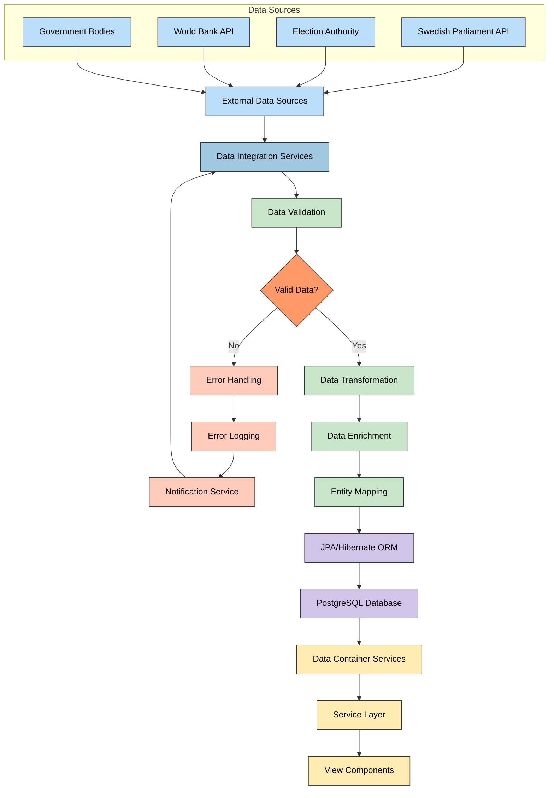
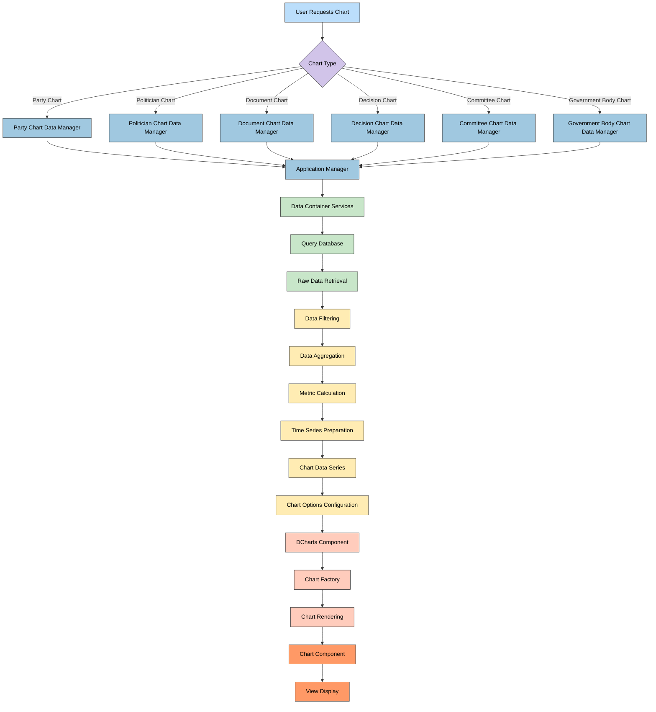
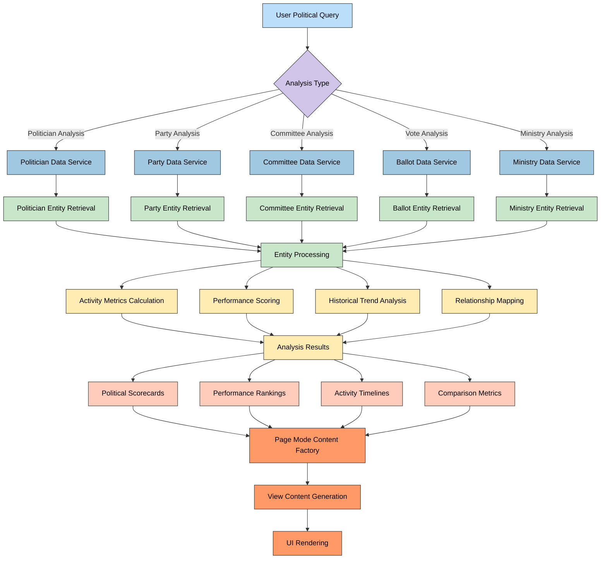
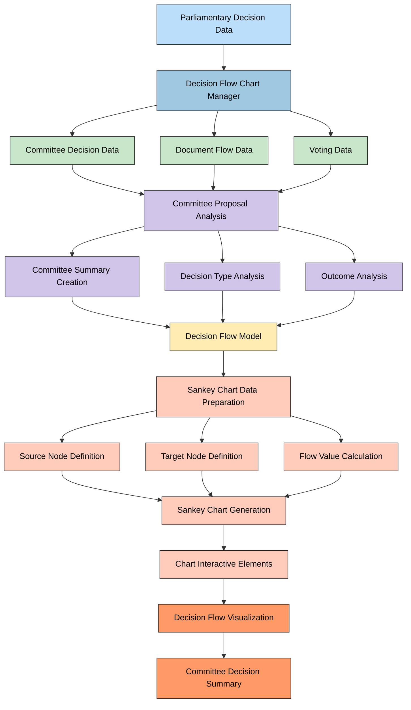
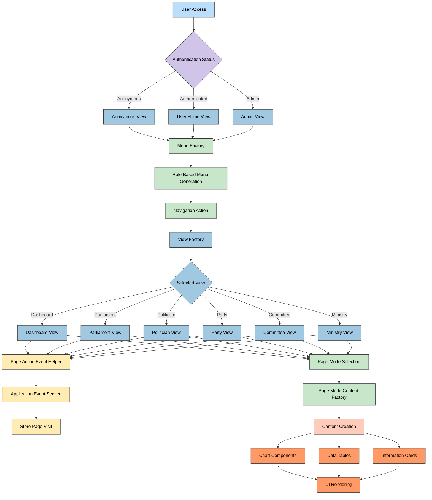
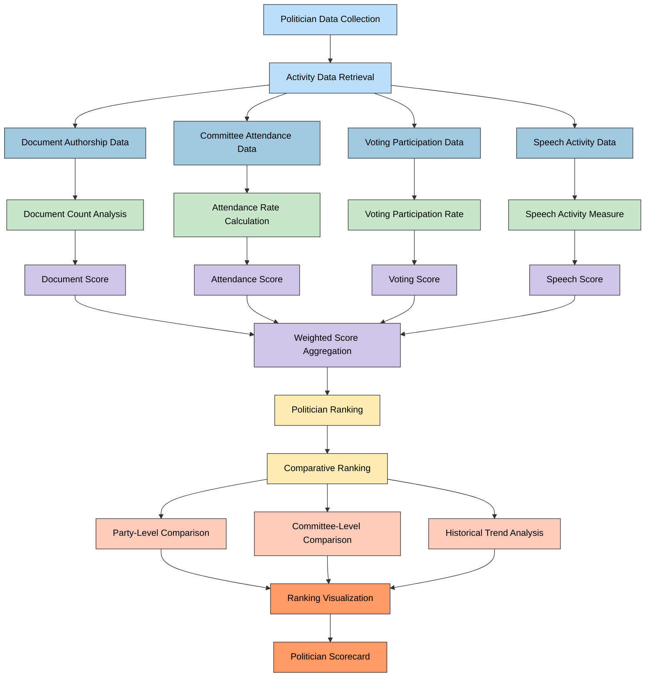
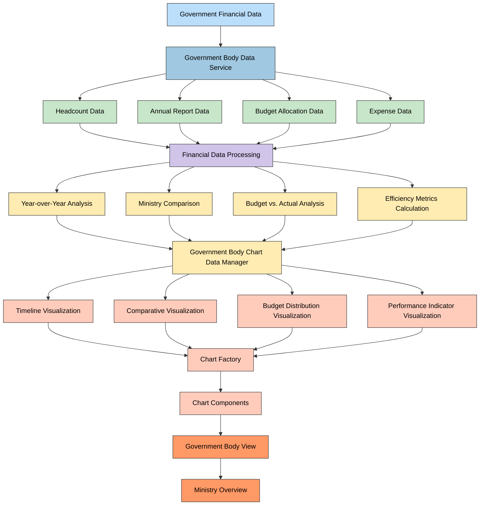

  

<h1 align="center">🔄 Citizen Intelligence Agency — Process Flows</h1>

  <strong>📋 Data Processing and Application Workflow Documentation</strong> 
  <em>🎯 Visual Representations of Data Acquisition Through Presentation Pipelines</em>

  
  
  
  

**📋 Document Owner:** CEO | **📄 Version:** 1.1 | **📅 Last Updated:** 2026-04-20 (UTC)  
**🔄 Review Cycle:** Annual | **⏰ Next Review:** 2027-04-20
**🏷️ Classification:** Public (Open Civic Transparency Platform)

---

## 🎯 Purpose

This document illustrates the key data processing and application workflows within the Citizen Intelligence Agency platform. These flowcharts provide visual representations of how data moves through the system from acquisition to presentation.

## 📚 Related Architecture Documentation

| Document                                            | Focus           | Description                               | Documentation Link                                                              |
| --------------------------------------------------- | --------------- | ----------------------------------------- | ------------------------------------------------------------------------------- |
| **[Architecture](ARCHITECTURE.md)**                 | 🏛️ Architecture | C4 model showing current system structure | [View Source](https://github.com/Hack23/cia/blob/master/ARCHITECTURE.md)         |
| **[Future Architecture](FUTURE_ARCHITECTURE.md)**   | 🏛️ Architecture | C4 model showing future system structure | [View Source](https://github.com/Hack23/cia/blob/master/FUTURE_ARCHITECTURE.md)         |
| **[Mindmaps](MINDMAP.md)**                          | 🧠 Concept      | Current system component relationships    | [View Source](https://github.com/Hack23/cia/blob/master/MINDMAP.md)             |
| **[Future Mindmaps](FUTURE_MINDMAP.md)**            | 🧠 Concept      | Future capability evolution               | [View Source](https://github.com/Hack23/cia/blob/master/FUTURE_MINDMAP.md)      |
| **[SWOT Analysis](SWOT.md)**                        | 💼 Business     | Current strategic assessment              | [View Source](https://github.com/Hack23/cia/blob/master/SWOT.md)                |
| **[Future SWOT Analysis](FUTURE_SWOT.md)**          | 💼 Business     | Future strategic opportunities            | [View Source](https://github.com/Hack23/cia/blob/master/FUTURE_SWOT.md)         |
| **[Data Model](DATA_MODEL.md)**                     | 📊 Data         | Current data structures and relationships | [View Source](https://github.com/Hack23/cia/blob/master/DATA_MODEL.md)          |
| **[Future Data Model](FUTURE_DATA_MODEL.md)**       | 📊 Data         | Enhanced political data architecture      | [View Source](https://github.com/Hack23/cia/blob/master/FUTURE_DATA_MODEL.md)   |
| **[Flowcharts](FLOWCHART.md)**                      | 🔄 Process      | Current data processing workflows         | [View Source](https://github.com/Hack23/cia/blob/master/FLOWCHART.md)           |
| **[Future Flowcharts](FUTURE_FLOWCHART.md)**        | 🔄 Process      | Enhanced AI-driven workflows              | [View Source](https://github.com/Hack23/cia/blob/master/FUTURE_FLOWCHART.md)    |
| **[State Diagrams](STATEDIAGRAM.md)**               | 🔄 Behavior     | Current system state transitions          | [View Source](https://github.com/Hack23/cia/blob/master/STATEDIAGRAM.md)        |
| **[Future State Diagrams](FUTURE_STATEDIAGRAM.md)** | 🔄 Behavior     | Enhanced adaptive state transitions       | [View Source](https://github.com/Hack23/cia/blob/master/FUTURE_STATEDIAGRAM.md) |
| **[CI/CD Workflows](WORKFLOWS.md)**                 | 🔧 DevOps       | Current automation processes              | [View Source](https://github.com/Hack23/cia/blob/master/WORKFLOWS.md)           |
| **[Future Workflows](FUTURE_WORKFLOWS.md)**         | 🔧 DevOps       | Enhanced CI/CD with ML                    | [View Source](https://github.com/Hack23/cia/blob/master/FUTURE_WORKFLOWS.md)    |
| **[End-of-Life Strategy](End-of-Life-Strategy.md)** | 📅 Lifecycle    | Maintenance and EOL planning              | [View Source](https://github.com/Hack23/cia/blob/master/End-of-Life-Strategy.md) |
| **[Financial Security Plan](FinancialSecurityPlan.md)** | 💰 Security | Cost and security implementation          | [View Source](https://github.com/Hack23/cia/blob/master/FinancialSecurityPlan.md) |
| **[CIA Features](https://hack23.com/cia-features.html)** | 🚀 Features | Platform features overview                | [View on hack23.com](https://hack23.com/cia-features.html)                     |
| **[Threat Model](THREAT_MODEL.md)**                 | 🛡️ Security     | Data flow threat perspectives             | [View Source](https://github.com/Hack23/cia/blob/master/THREAT_MODEL.md)        |
| **[Security Architecture](SECURITY_ARCHITECTURE.md)** | 🛡️ Security | Defense-in-depth security overview        | [View Source](https://github.com/Hack23/cia/blob/master/SECURITY_ARCHITECTURE.md) |
| **[CRA Assessment](CRA-ASSESSMENT.md)**             | 🛡️ Compliance   | EU Cyber Resilience Act conformity        | [View Source](https://github.com/Hack23/cia/blob/master/CRA-ASSESSMENT.md)      |
| **[Business Continuity Plan](BCPPlan.md)**           | 📋 Resilience   | RTO/RPO targets and recovery procedures   | [View Source](https://github.com/Hack23/cia/blob/master/BCPPlan.md)             |
| **[Business Product Document](BUSINESS_PRODUCT_DOCUMENT.md)** | 💼 Business | Data analytics and risk intelligence products | [View Source](https://github.com/Hack23/cia/blob/master/BUSINESS_PRODUCT_DOCUMENT.md) |

## 🔄 Data Integration Workflow

**🏛️ Processing Focus:** Shows the current data pipeline from external political data sources through integration, processing, and storage.

**📊 Data Flow Focus:** Illustrates how data flows through the system, with transformation and validation steps.

```mermaid
flowchart TD
    A[External Data Sources] --> B[Data Integration Services]
    
    subgraph "Data Sources"
        A1[Swedish Parliament API]
        A2[Election Authority]
        A3[World Bank API]
        A4[Government Bodies]
    end
    
    A1 & A2 & A3 & A4 --> A
    
    B --> C[Data Validation]
    C --> D{Valid Data?}
    
    D -->|No| E[Error Handling]
    E --> F[Error Logging]
    F --> G[Notification Service]
    G --> B
    
    D -->|Yes| H[Data Transformation]
    H --> I[Data Enrichment]
    I --> J[Entity Mapping]
    
    J --> K[JPA/Hibernate ORM]
    K --> L[PostgreSQL Database]
    
    L --> M[Data Container Services]
    M --> N[Service Layer]
    N --> O[View Components]
    
    classDef sources fill:#bbdefb,stroke:#333,stroke-width:1px,color:black
    classDef integration fill:#a0c8e0,stroke:#333,stroke-width:1px,color:black
    classDef processing fill:#c8e6c9,stroke:#333,stroke-width:1px,color:black
    classDef error fill:#ffccbc,stroke:#333,stroke-width:1px,color:black
    classDef storage fill:#d1c4e9,stroke:#333,stroke-width:1px,color:black
    classDef service fill:#ffecb3,stroke:#333,stroke-width:1px,color:black
    classDef decision fill:#ff9966,stroke:#333,stroke-width:1px,color:black
    
    class A,A1,A2,A3,A4 sources
    class B integration
    class C,H,I,J processing
    class D decision
    class E,F,G error
    class K,L storage
    class M,N,O service
```

## 📊 Chart Data Generation Process

**📈 Visualization Focus:** Illustrates how the ChartFactory components transform political data into visual representations.

**🔍 Analytics Focus:** Shows the data flow from raw political data to analytical visualizations.

```mermaid
flowchart TD
    A[User Requests Chart] --> B{Chart Type}
    
    B -->|Party Chart| C1[Party Chart Data Manager]
    B -->|Politician Chart| C2[Politician Chart Data Manager]
    B -->|Document Chart| C3[Document Chart Data Manager]
    B -->|Decision Chart| C4[Decision Chart Data Manager]
    B -->|Committee Chart| C5[Committee Chart Data Manager]
    B -->|Government Body Chart| C6[Government Body Chart Data Manager]
    
    C1 & C2 & C3 & C4 & C5 & C6 --> D[Application Manager]
    
    D --> E[Data Container Services]
    E --> F[Query Database]
    F --> G[Raw Data Retrieval]
    
    G --> H1[Data Filtering]
    H1 --> H2[Data Aggregation]
    H2 --> H3[Metric Calculation]
    H3 --> H4[Time Series Preparation]
    
    H4 --> I[Chart Data Series]
    I --> J[Chart Options Configuration]
    
    J --> K[DCharts Component]
    K --> L[Chart Factory]
    L --> M[Chart Rendering]
    
    M --> N[Chart Component]
    N --> O[View Display]
    
    classDef user fill:#bbdefb,stroke:#333,stroke-width:1px,color:black
    classDef decision fill:#d1c4e9,stroke:#333,stroke-width:1px,color:black
    classDef managers fill:#a0c8e0,stroke:#333,stroke-width:1px,color:black
    classDef data fill:#c8e6c9,stroke:#333,stroke-width:1px,color:black
    classDef processing fill:#ffecb3,stroke:#333,stroke-width:1px,color:black
    classDef chart fill:#ffccbc,stroke:#333,stroke-width:1px,color:black
    classDef display fill:#ff9966,stroke:#333,stroke-width:1px,color:black
    
    class A user
    class B decision
    class C1,C2,C3,C4,C5,C6,D managers
    class E,F,G data
    class H1,H2,H3,H4,I,J processing
    class K,L,M chart
    class N,O display
```

## 🔍 Political Analysis Workflow

**🏛️ Political Focus:** Illustrates the workflow for analyzing political entities, activities, and relationships.

**📊 Metrics Focus:** Shows how political performance metrics are calculated and presented.

```mermaid
flowchart TD
    A[User Political Query] --> B{Analysis Type}
    
    B -->|Politician Analysis| C1[Politician Data Service]
    B -->|Party Analysis| C2[Party Data Service]
    B -->|Committee Analysis| C3[Committee Data Service]
    B -->|Vote Analysis| C4[Ballot Data Service]
    B -->|Ministry Analysis| C5[Ministry Data Service]
    
    C1 --> D1[Politician Entity Retrieval]
    C2 --> D2[Party Entity Retrieval]
    C3 --> D3[Committee Entity Retrieval]
    C4 --> D4[Ballot Entity Retrieval]
    C5 --> D5[Ministry Entity Retrieval]
    
    D1 & D2 & D3 & D4 & D5 --> E[Entity Processing]
    
    E --> F1[Activity Metrics Calculation]
    E --> F2[Performance Scoring]
    E --> F3[Historical Trend Analysis]
    E --> F4[Relationship Mapping]
    
    F1 & F2 & F3 & F4 --> G[Analysis Results]
    
    G --> H1[Political Scorecards]
    G --> H2[Performance Rankings]
    G --> H3[Activity Timelines]
    G --> H4[Comparison Metrics]
    
    H1 & H2 & H3 & H4 --> I[Page Mode Content Factory]
    I --> J[View Content Generation]
    J --> K[UI Rendering]
    
    classDef user fill:#bbdefb,stroke:#333,stroke-width:1px,color:black
    classDef decision fill:#d1c4e9,stroke:#333,stroke-width:1px,color:black
    classDef service fill:#a0c8e0,stroke:#333,stroke-width:1px,color:black
    classDef data fill:#c8e6c9,stroke:#333,stroke-width:1px,color:black
    classDef processing fill:#ffecb3,stroke:#333,stroke-width:1px,color:black
    classDef results fill:#ffccbc,stroke:#333,stroke-width:1px,color:black
    classDef display fill:#ff9966,stroke:#333,stroke-width:1px,color:black
    
    class A user
    class B decision
    class C1,C2,C3,C4,C5 service
    class D1,D2,D3,D4,D5,E data
    class F1,F2,F3,F4,G processing
    class H1,H2,H3,H4 results
    class I,J,K display
```

## 🗳️ Decision Flow Analysis Process

**⚖️ Political Process Focus:** Illustrates how the system tracks and visualizes decision flows in the parliamentary process.

**🔄 Workflow Focus:** Shows the complete process from committee proposal to final decision visualization.

```mermaid
flowchart TD
    A[Parliamentary Decision Data] --> B[Decision Flow Chart Manager]
    
    B --> C1[Committee Decision Data]
    B --> C2[Document Flow Data]
    B --> C3[Voting Data]
    
    C1 & C2 & C3 --> D[Committee Proposal Analysis]
    
    D --> E1[Committee Summary Creation]
    D --> E2[Decision Type Analysis]
    D --> E3[Outcome Analysis]
    
    E1 & E2 & E3 --> F[Decision Flow Model]
    
    F --> G[Sankey Chart Data Preparation]
    G --> H1[Source Node Definition]
    G --> H2[Target Node Definition]
    G --> H3[Flow Value Calculation]
    
    H1 & H2 & H3 --> I[Sankey Chart Generation]
    I --> J[Chart Interactive Elements]
    
    J --> K[Decision Flow Visualization]
    K --> L[Committee Decision Summary]
    
    classDef data fill:#bbdefb,stroke:#333,stroke-width:1px,color:black
    classDef manager fill:#a0c8e0,stroke:#333,stroke-width:1px,color:black
    classDef component fill:#c8e6c9,stroke:#333,stroke-width:1px,color:black
    classDef analysis fill:#d1c4e9,stroke:#333,stroke-width:1px,color:black
    classDef model fill:#ffecb3,stroke:#333,stroke-width:1px,color:black
    classDef chart fill:#ffccbc,stroke:#333,stroke-width:1px,color:black
    classDef visual fill:#ff9966,stroke:#333,stroke-width:1px,color:black
    
    class A data
    class B manager
    class C1,C2,C3 component
    class D,E1,E2,E3 analysis
    class F model
    class G,H1,H2,H3,I,J chart
    class K,L visual
```

## 👤 User Interaction Workflow

**👥 User Focus:** Maps the flow of user interactions within the system, from initial navigation to content display and tracking.

**📊 Usage Focus:** Shows how user actions are tracked for analytics and personalization.

```mermaid
flowchart TD
    A[User Access] --> B{Authentication Status}
    
    B -->|Anonymous| C1[Anonymous View]
    B -->|Authenticated| C2[User Home View]
    B -->|Admin| C3[Admin View]
    
    C1 & C2 & C3 --> D[Menu Factory]
    D --> E[Role-Based Menu Generation]
    
    E --> F[Navigation Action]
    F --> G[View Factory]
    
    G --> H{Selected View}
    
    H -->|Dashboard| I1[Dashboard View]
    H -->|Parliament| I2[Parliament View]
    H -->|Politician| I3[Politician View]
    H -->|Party| I4[Party View]
    H -->|Committee| I5[Committee View]
    H -->|Ministry| I6[Ministry View]
    
    I1 & I2 & I3 & I4 & I5 & I6 --> J[Page Action Event Helper]
    J --> K[Application Event Service]
    K --> L[Store Page Visit]
    
    I1 & I2 & I3 & I4 & I5 & I6 --> M[Page Mode Selection]
    M --> N[Page Mode Content Factory]
    N --> O[Content Creation]
    
    O --> P[Chart Components]
    O --> Q[Data Tables]
    O --> R[Information Cards]
    
    P & Q & R --> S[UI Rendering]
    
    classDef user fill:#bbdefb,stroke:#333,stroke-width:1px,color:black
    classDef authentication fill:#d1c4e9,stroke:#333,stroke-width:1px,color:black
    classDef view fill:#a0c8e0,stroke:#333,stroke-width:1px,color:black
    classDef navigation fill:#c8e6c9,stroke:#333,stroke-width:1px,color:black
    classDef tracking fill:#ffecb3,stroke:#333,stroke-width:1px,color:black
    classDef content fill:#ffccbc,stroke:#333,stroke-width:1px,color:black
    classDef component fill:#ff9966,stroke:#333,stroke-width:1px,color:black
    
    class A user
    class B authentication
    class C1,C2,C3,G,H,I1,I2,I3,I4,I5,I6 view
    class D,E,F,M,N navigation
    class J,K,L tracking
    class O content
    class P,Q,R,S component
```

## 📊 Politician Ranking Process

**🏆 Scoring Focus:** Details the process of calculating and assigning rankings to politicians based on their parliamentary activities.

**📈 Metrics Focus:** Shows how different political activities contribute to overall performance metrics.

```mermaid
flowchart TD
    A[Politician Data Collection] --> B[Activity Data Retrieval]
    
    B --> C1[Document Authorship Data]
    B --> C2[Committee Attendance Data]
    B --> C3[Voting Participation Data]
    B --> C4[Speech Activity Data]
    
    C1 --> D1[Document Count Analysis]
    C2 --> D2[Attendance Rate Calculation]
    C3 --> D3[Voting Participation Rate]
    C4 --> D4[Speech Activity Measure]
    
    D1 --> E1[Document Score]
    D2 --> E2[Attendance Score]
    D3 --> E3[Voting Score]
    D4 --> E4[Speech Score]
    
    E1 & E2 & E3 & E4 --> F[Weighted Score Aggregation]
    
    F --> G[Politician Ranking]
    G --> H[Comparative Ranking]
    
    H --> I1[Party-Level Comparison]
    H --> I2[Committee-Level Comparison]
    H --> I3[Historical Trend Analysis]
    
    I1 & I2 & I3 --> J[Ranking Visualization]
    J --> K[Politician Scorecard]
    
    classDef data fill:#bbdefb,stroke:#333,stroke-width:1px,color:black
    classDef collection fill:#a0c8e0,stroke:#333,stroke-width:1px,color:black
    classDef metrics fill:#c8e6c9,stroke:#333,stroke-width:1px,color:black
    classDef calculation fill:#d1c4e9,stroke:#333,stroke-width:1px,color:black
    classDef scoring fill:#ffecb3,stroke:#333,stroke-width:1px,color:black
    classDef ranking fill:#ffccbc,stroke:#333,stroke-width:1px,color:black
    classDef visualization fill:#ff9966,stroke:#333,stroke-width:1px,color:black
    
    class A,B data
    class C1,C2,C3,C4 collection
    class D1,D2,D3,D4 metrics
    class E1,E2,E3,E4,F calculation
    class G,H scoring
    class I1,I2,I3 ranking
    class J,K visualization
```

## 📄 Government Body Finance Analysis

**💰 Financial Focus:** Maps the workflow for analyzing financial data of government bodies and ministries.

**🔍 Analytics Focus:** Shows how financial data is processed and visualized for transparency.

```mermaid
flowchart TD
    A[Government Financial Data] --> B[Government Body Data Service]
    
    B --> C1[Headcount Data]
    B --> C2[Annual Report Data]
    B --> C3[Budget Allocation Data]
    B --> C4[Expense Data]
    
    C1 & C2 & C3 & C4 --> D[Financial Data Processing]
    
    D --> E1[Year-over-Year Analysis]
    D --> E2[Ministry Comparison]
    D --> E3[Budget vs. Actual Analysis]
    D --> E4[Efficiency Metrics Calculation]
    
    E1 & E2 & E3 & E4 --> F[Government Body Chart Data Manager]
    
    F --> G1[Timeline Visualization]
    F --> G2[Comparative Visualization]
    F --> G3[Budget Distribution Visualization]
    F --> G4[Performance Indicator Visualization]
    
    G1 & G2 & G3 & G4 --> H[Chart Factory]
    H --> I[Chart Components]
    
    I --> J[Government Body View]
    J --> K[Ministry Overview]
    
    classDef data fill:#bbdefb,stroke:#333,stroke-width:1px,color:black
    classDef service fill:#a0c8e0,stroke:#333,stroke-width:1px,color:black
    classDef collection fill:#c8e6c9,stroke:#333,stroke-width:1px,color:black
    classDef processing fill:#d1c4e9,stroke:#333,stroke-width:1px,color:black
    classDef analysis fill:#ffecb3,stroke:#333,stroke-width:1px,color:black
    classDef chart fill:#ffccbc,stroke:#333,stroke-width:1px,color:black
    classDef view fill:#ff9966,stroke:#333,stroke-width:1px,color:black
    
    class A data
    class B service
    class C1,C2,C3,C4 collection
    class D processing
    class E1,E2,E3,E4,F analysis
    class G1,G2,G3,G4,H,I chart
    class J,K view
```

## Color Legend

The color scheme used in these flowcharts follows these conventions:

| Element Type             | Color                  | Description                                       |
| ------------------------ | ---------------------- | ------------------------------------------------- |
| Data Sources             | #bbdefb (Light Blue)   | External and internal data sources                |
| Processing Components    | #a0c8e0 (Medium Blue)  | Data processing and transformation services       |
| Analytical Components    | #c8e6c9 (Light Green)  | Analysis and computation services                 |
| User Interface           | #ffccbc (Light Coral)  | UI components and visualization                   |
| Decision Points          | #d1c4e9 (Light Purple) | Logic branching and decision making               |
| Services                 | #ffecb3 (Light Yellow) | Service-layer components                          |
| Results & Output         | #ff9966 (Light Orange) | Final outputs and presentation elements           |

This consistent color scheme helps distinguish between different types of process steps and creates visual continuity across all flowcharts in the documentation.

## Related Documentation

- [Architecture](ARCHITECTURE.md) - Detailed system architecture including components
- [Mindmaps](MINDMAP.md) - Conceptual overview of system components and relationships
- [Future Flowcharts](FUTURE_FLOWCHART.md) - Enhanced AI-driven workflows vision
- [CIA Features](https://hack23.com/cia-features.html) - Detailed feature overview with screenshots
- [Project Documentation](https://hack23.github.io/cia/) - Comprehensive technical documentation

---

**📋 Document Control:**  
**✅ Approved by:** James Pether Sörling, CEO - Hack23 AB  
**📤 Distribution:** Public  
**🏷️ Classification:**     
**📅 Effective Date:** 2026-04-20  
**⏰ Next Review:** 2027-04-20  
**🎯 Framework Compliance:**   
