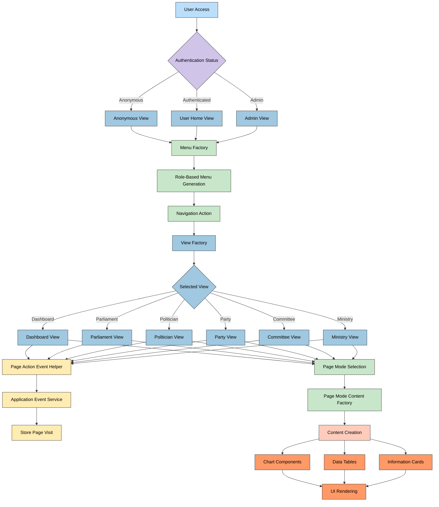

# 🔄 Citizen Intelligence Agency Process Flows

This document illustrates the key data processing and application workflows within the Citizen Intelligence Agency platform. These flowcharts provide visual representations of how data moves through the system from acquisition to presentation.

## 📚 Related Architecture Documentation

| Document                                            | Focus           | Description                               | Documentation Link                                                              |
| --------------------------------------------------- | --------------- | ----------------------------------------- | ------------------------------------------------------------------------------- |
| **[Architecture](ARCHITECTURE.md)**                 | 🏛️ Architecture | C4 model showing current system structure | [View Source](https://github.com/Hack23/cia/blob/master/ARCHITECTURE.md)         |
| **[Future Architecture](FUTURE_ARCHITECTURE.md)**   | 🏛️ Architecture | C4 model showing future system structure | [View Source](https://github.com/Hack23/cia/blob/master/FUTURE_ARCHITECTURE.md)         |
| **[Mindmaps](MINDMAP.md)**                          | 🧠 Concept      | Current system component relationships    | [View Source](https://github.com/Hack23/cia/blob/master/MINDMAP.md)             |
| **[Future Mindmaps](FUTURE_MINDMAP.md)**            | 🧠 Concept      | Future capability evolution               | [View Source](https://github.com/Hack23/cia/blob/master/FUTURE_MINDMAP.md)      |
| **[SWOT Analysis](SWOT.md)**                        | 💼 Business     | Current strategic assessment              | [View Source](https://github.com/Hack23/cia/blob/master/SWOT.md)                |
| **[Future SWOT Analysis](FUTURE_SWOT.md)**          | 💼 Business     | Future strategic opportunities            | [View Source](https://github.com/Hack23/cia/blob/master/FUTURE_SWOT.md)         |
| **[Data Model](DATA_MODEL.md)**                     | 📊 Data         | Current data structures and relationships | [View Source](https://github.com/Hack23/cia/blob/master/DATA_MODEL.md)          |
| **[Future Data Model](FUTURE_DATA_MODEL.md)**       | 📊 Data         | Enhanced political data architecture      | [View Source](https://github.com/Hack23/cia/blob/master/FUTURE_DATA_MODEL.md)   |
| **[Flowcharts](FLOWCHART.md)**                      | 🔄 Process      | Current data processing workflows         | [View Source](https://github.com/Hack23/cia/blob/master/FLOWCHART.md)           |
| **[Future Flowcharts](FUTURE_FLOWCHART.md)**        | 🔄 Process      | Enhanced AI-driven workflows              | [View Source](https://github.com/Hack23/cia/blob/master/FUTURE_FLOWCHART.md)    |
| **[State Diagrams](STATEDIAGRAM.md)**               | 🔄 Behavior     | Current system state transitions          | [View Source](https://github.com/Hack23/cia/blob/master/STATEDIAGRAM.md)        |
| **[Future State Diagrams](FUTURE_STATEDIAGRAM.md)** | 🔄 Behavior     | Enhanced adaptive state transitions       | [View Source](https://github.com/Hack23/cia/blob/master/FUTURE_STATEDIAGRAM.md) |
| **[CI/CD Workflows](WORKFLOWS.md)**                 | 🔧 DevOps       | Current automation processes              | [View Source](https://github.com/Hack23/cia/blob/master/WORKFLOWS.md)           |
| **[Future Workflows](FUTURE_WORKFLOWS.md)**         | 🔧 DevOps       | Enhanced CI/CD with ML                    | [View Source](https://github.com/Hack23/cia/blob/master/FUTURE_WORKFLOWS.md)    |
| **[End-of-Life Strategy](End-of-Life-Strategy.md)** | 📅 Lifecycle    | Maintenance and EOL planning              | [View Source](https://github.com/Hack23/cia/blob/master/End-of-Life-Strategy.md) |
| **[Financial Security Plan](FinancialSecurityPlan.md)** | 💰 Security | Cost and security implementation          | [View Source](https://github.com/Hack23/cia/blob/master/FinancialSecurityPlan.md) |
| **[CIA Features](https://hack23.com/cia-features.html)** | 🚀 Features | Platform features overview                | [View on hack23.com](https://hack23.com/cia-features.html)                     |
| **[Threat Model](THREAT_MODEL.md)**                 | 🛡️ Security     | Data flow threat perspectives             | [View Source](https://github.com/Hack23/cia/blob/master/THREAT_MODEL.md)        |

## 🔄 Data Integration Workflow

**🏛️ Processing Focus:** Shows the current data pipeline from external political data sources through integration, processing, and storage.

**📊 Data Flow Focus:** Illustrates how data flows through the system, with transformation and validation steps.

## 📊 Chart Data Generation Process

**📈 Visualization Focus:** Illustrates how the ChartFactory components transform political data into visual representations.

**🔍 Analytics Focus:** Shows the data flow from raw political data to analytical visualizations.

## 🔍 Political Analysis Workflow

**🏛️ Political Focus:** Illustrates the workflow for analyzing political entities, activities, and relationships.

**📊 Metrics Focus:** Shows how political performance metrics are calculated and presented.

## 🗳️ Decision Flow Analysis Process

**⚖️ Political Process Focus:** Illustrates how the system tracks and visualizes decision flows in the parliamentary process.

**🔄 Workflow Focus:** Shows the complete process from committee proposal to final decision visualization.

## 👤 User Interaction Workflow

**👥 User Focus:** Maps the flow of user interactions within the system, from initial navigation to content display and tracking.

**📊 Usage Focus:** Shows how user actions are tracked for analytics and personalization.

## 📊 Politician Ranking Process

**🏆 Scoring Focus:** Details the process of calculating and assigning rankings to politicians based on their parliamentary activities.

**📈 Metrics Focus:** Shows how different political activities contribute to overall performance metrics.

## 📄 Government Body Finance Analysis

**💰 Financial Focus:** Maps the workflow for analyzing financial data of government bodies and ministries.

**🔍 Analytics Focus:** Shows how financial data is processed and visualized for transparency.

## Color Legend

The color scheme used in these flowcharts follows these conventions:

| Element Type             | Color                  | Description                                       |
| ------------------------ | ---------------------- | ------------------------------------------------- |
| Data Sources             | #bbdefb (Light Blue)   | External and internal data sources                |
| Processing Components    | #a0c8e0 (Medium Blue)  | Data processing and transformation services       |
| Analytical Components    | #c8e6c9 (Light Green)  | Analysis and computation services                 |
| User Interface           | #ffccbc (Light Coral)  | UI components and visualization                   |
| Decision Points          | #d1c4e9 (Light Purple) | Logic branching and decision making               |
| Services                 | #ffecb3 (Light Yellow) | Service-layer components                          |
| Results & Output         | #ff9966 (Light Orange) | Final outputs and presentation elements           |

This consistent color scheme helps distinguish between different types of process steps and creates visual continuity across all flowcharts in the documentation.

## Related Documentation

- [Architecture](ARCHITECTURE.md) - Detailed system architecture including components
- [Mindmaps](MINDMAP.md) - Conceptual overview of system components and relationships
- [Future Flowcharts](FUTURE_FLOWCHART.md) - Enhanced AI-driven workflows vision
- [CIA Features](https://hack23.com/cia-features.html) - Detailed feature overview with screenshots
- [Project Documentation](https://hack23.github.io/cia/) - Comprehensive technical documentation
