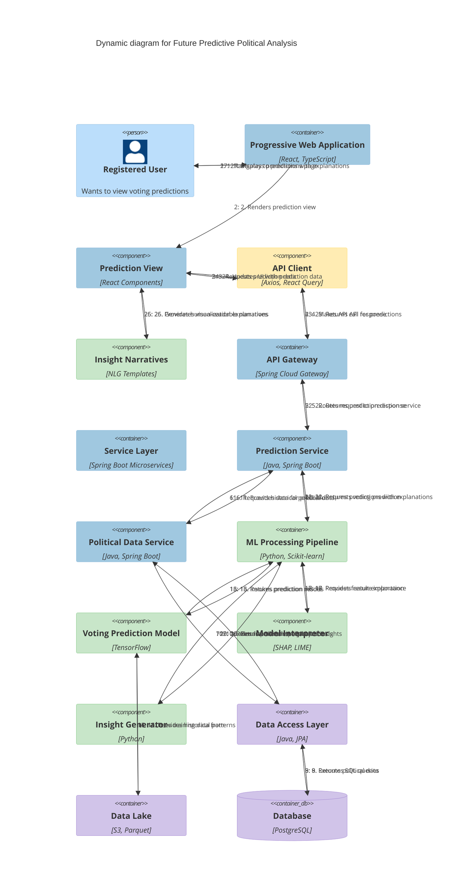

# 🏛️ Citizen Intelligence Agency Future Architecture

This document outlines the future architectural vision for the Citizen Intelligence Agency, describing how the system will evolve to incorporate AI/ML capabilities, enhanced data integration, and improved user experiences. It builds upon the [current architecture](ARCHITECTURE.md) while presenting a roadmap for technological advancement.

## 📚 Related Architecture Documentation

<div class="documentation-map">

| Document                                            | Focus           | Description                               | Documentation Link                                                              |
| --------------------------------------------------- | --------------- | ----------------------------------------- | ------------------------------------------------------------------------------- |
| **[Architecture](ARCHITECTURE.md)**                 | 🏛️ Architecture | C4 model showing current system structure | [View Source](https://github.com/Hack23/cia/blob/master/ARCHITECTURE.md)         |
| **[Future Architecture](FUTURE_ARCHITECTURE.md)**   | 🏛️ Architecture | C4 model showing future system structure | [View Source](https://github.com/Hack23/cia/blob/master/FUTURE_ARCHITECTURE.md)         |
| **[Mindmaps](MINDMAP.md)**                          | 🧠 Concept      | Current system component relationships    | [View Source](https://github.com/Hack23/cia/blob/master/MINDMAP.md)             |
| **[Future Mindmaps](FUTURE_MINDMAP.md)**            | 🧠 Concept      | Future capability evolution               | [View Source](https://github.com/Hack23/cia/blob/master/FUTURE_MINDMAP.md)      |
| **[SWOT Analysis](SWOT.md)**                        | 💼 Business     | Current strategic assessment              | [View Source](https://github.com/Hack23/cia/blob/master/SWOT.md)                |
| **[Future SWOT Analysis](FUTURE_SWOT.md)**          | 💼 Business     | Future strategic opportunities            | [View Source](https://github.com/Hack23/cia/blob/master/FUTURE_SWOT.md)         |
| **[Data Model](DATA_MODEL.md)**                     | 📊 Data         | Current data structures and relationships | [View Source](https://github.com/Hack23/cia/blob/master/DATA_MODEL.md)          |
| **[Future Data Model](FUTURE_DATA_MODEL.md)**       | 📊 Data         | Enhanced political data architecture      | [View Source](https://github.com/Hack23/cia/blob/master/FUTURE_DATA_MODEL.md)   |
| **[Flowcharts](FLOWCHART.md)**                      | 🔄 Process      | Current data processing workflows         | [View Source](https://github.com/Hack23/cia/blob/master/FLOWCHART.md)           |
| **[Future Flowcharts](FUTURE_FLOWCHART.md)**        | 🔄 Process      | Enhanced AI-driven workflows              | [View Source](https://github.com/Hack23/cia/blob/master/FUTURE_FLOWCHART.md)    |
| **[State Diagrams](STATEDIAGRAM.md)**               | 🔄 Behavior     | Current system state transitions          | [View Source](https://github.com/Hack23/cia/blob/master/STATEDIAGRAM.md)        |
| **[Future State Diagrams](FUTURE_STATEDIAGRAM.md)** | 🔄 Behavior     | Enhanced adaptive state transitions       | [View Source](https://github.com/Hack23/cia/blob/master/FUTURE_STATEDIAGRAM.md) |
| **[CI/CD Workflows](WORKFLOWS.md)**                 | 🔧 DevOps       | Current automation processes              | [View Source](https://github.com/Hack23/cia/blob/master/WORKFLOWS.md)           |
| **[Future Workflows](FUTURE_WORKFLOWS.md)**         | 🔧 DevOps       | Enhanced CI/CD with ML                    | [View Source](https://github.com/Hack23/cia/blob/master/FUTURE_WORKFLOWS.md)    |
| **[End-of-Life Strategy](End-of-Life-Strategy.md)** | 📅 Lifecycle    | Maintenance and EOL planning              | [View Source](https://github.com/Hack23/cia/blob/master/End-of-Life-Strategy.md) |
| **[Financial Security Plan](FinancialSecurityPlan.md)** | 💰 Security | Cost and security implementation          | [View Source](https://github.com/Hack23/cia/blob/master/FinancialSecurityPlan.md) |
| **[CIA Features](https://hack23.com/cia-features.html)** | 🚀 Features | Platform features overview                | [View on hack23.com](https://hack23.com/cia-features.html)                     |

</div>

## 🌐 Future C4 System Context Diagram

This diagram illustrates how the Citizen Intelligence Agency system will evolve to interact with an expanded ecosystem of data sources and stakeholders. This builds upon the [current context diagram](ARCHITECTURE.md#-c4-system-context-diagram) to show future integrations.

```mermaid
C4Context
  title Future System Context diagram for Citizen Intelligence Agency

  Person(anonymousUser, "Anonymous User", "Accesses public political data and metrics")
  Person(registeredUser, "Registered User", "Creates account and accesses personalized features")
  Person(adminUser, "System Administrator", "Manages system configuration and user accounts")
  Person(researcher, "Academic Researcher", "Accesses API for political science research")
  Person(journalist, "Journalist", "Uses platform for investigative reporting")
  
  System(cia, "Citizen Intelligence Agency", "Provides AI-enhanced analysis of political activities")
  
  System_Ext(riksdagenAPI, "Swedish Parliament API", "Source of parliamentary data")
  System_Ext(electionAuthority, "Swedish Election Authority", "Election data source")
  System_Ext(worldBankAPI, "World Bank Open Data", "Source of global economic indicators")
  System_Ext(governmentBodies, "Swedish Government Bodies", "Financial and headcount data")
  System_Ext(euParliament, "EU Parliament", "European-level political data")
  System_Ext(mediaAPI, "Media & News APIs", "News coverage and public discourse data")
  System_Ext(socialAPI, "Social Media APIs", "Public opinion and trending topics")
  System_Ext(localGov, "Local Government APIs", "Municipal-level political data")
  System_Ext(researchDB, "Academic Research Databases", "Political science research and findings")
  
  Rel(anonymousUser, cia, "Views political data and metrics")
  Rel(registeredUser, cia, "Creates account, receives personalized insights")
  Rel(adminUser, cia, "Configures system and manages user accounts")
  Rel(researcher, cia, "Accesses political data API")
  Rel(journalist, cia, "Uses embedded visualizations and reports")
  
  Rel(cia, riksdagenAPI, "Retrieves parliamentary data")
  Rel(cia, electionAuthority, "Retrieves election data")
  Rel(cia, worldBankAPI, "Retrieves economic indicators")
  Rel(cia, governmentBodies, "Retrieves government body data")
  Rel(cia, euParliament, "Retrieves EU legislation and voting data")
  Rel(cia, mediaAPI, "Analyzes political news coverage")
  Rel(cia, socialAPI, "Monitors public opinion on political topics")
  Rel(cia, localGov, "Integrates municipal government data")
  Rel(cia, researchDB, "Incorporates academic research findings")
  
  UpdateLayoutConfig($c4ShapeInRow="3", $c4BoundaryInRow="1")
  
  UpdateElementStyle(anonymousUser, $fontColor="#333333", $bgColor="#bbdefb", $borderColor="#86b5d9")
  UpdateElementStyle(registeredUser, $fontColor="#333333", $bgColor="#bbdefb", $borderColor="#86b5d9")
  UpdateElementStyle(adminUser, $fontColor="#333333", $bgColor="#bbdefb", $borderColor="#86b5d9")
  UpdateElementStyle(researcher, $fontColor="#333333", $bgColor="#bbdefb", $borderColor="#86b5d9")
  UpdateElementStyle(journalist, $fontColor="#333333", $bgColor="#bbdefb", $borderColor="#86b5d9")
  
  UpdateElementStyle(cia, $fontColor="#333333", $bgColor="#a0c8e0", $borderColor="#86b5d9")
  UpdateElementStyle(riksdagenAPI, $fontColor="#333333", $bgColor="#d1c4e9", $borderColor="#9575cd")
  UpdateElementStyle(electionAuthority, $fontColor="#333333", $bgColor="#d1c4e9", $borderColor="#9575cd")
  UpdateElementStyle(worldBankAPI, $fontColor="#333333", $bgColor="#d1c4e9", $borderColor="#9575cd")
  UpdateElementStyle(governmentBodies, $fontColor="#333333", $bgColor="#d1c4e9", $borderColor="#9575cd")
  UpdateElementStyle(euParliament, $fontColor="#333333", $bgColor="#d1c4e9", $borderColor="#9575cd")
  UpdateElementStyle(mediaAPI, $fontColor="#333333", $bgColor="#d1c4e9", $borderColor="#9575cd")
  UpdateElementStyle(socialAPI, $fontColor="#333333", $bgColor="#d1c4e9", $borderColor="#9575cd")
  UpdateElementStyle(localGov, $fontColor="#333333", $bgColor="#d1c4e9", $borderColor="#9575cd")
  UpdateElementStyle(researchDB, $fontColor="#333333", $bgColor="#d1c4e9", $borderColor="#9575cd")
```



## 🏛️ Future C4 Container Diagram

This diagram reveals the evolved modular architecture of the future CIA platform, introducing new ML/AI containers and a microservices approach. This builds upon the [current container diagram](ARCHITECTURE.md#-c4-container-diagram).

```mermaid
C4Container
  title Future Container diagram for Citizen Intelligence Agency

  Person(anonymousUser, "Anonymous User", "Accesses public political data and metrics")
  Person(registeredUser, "Registered User", "Creates account and accesses personalized features")
  Person(adminUser, "System Administrator", "Manages system configuration and user accounts")
  Person(researcher, "Academic Researcher", "Accesses API for political science research")
  
  System_Boundary(cia, "Citizen Intelligence Agency") {
    Container(webApplication, "Progressive Web Application", "React, TypeScript, Responsive Design", "Provides interactive UI for political data visualization and analysis")
    
    Container(apiGateway, "API Gateway", "Spring Cloud Gateway", "Provides unified API access point with authentication and rate limiting")
    
    Container(serviceLayer, "Service Layer", "Java, Spring Boot, Microservices", "Implements business logic and manages application services")
    
    Container(mlPipeline, "ML Processing Pipeline", "Python, Scikit-learn, TensorFlow", "Processes data for prediction and pattern detection")
    
    Container(dataAccess, "Data Access Layer", "Java, Hibernate, JPA", "Handles database interactions and entity management")
    
    Container(dataIntegration, "Data Integration Services", "Java, Spring Integration, Kafka", "Fetches and processes data from external sources")
    
    Container(nlpEngine, "Natural Language Processing Engine", "Python, spaCy, BERT", "Analyzes political text and documents")
    
    Container(predictionEngine, "Prediction Engine", "Python, TensorFlow, PyTorch", "Generates political predictions and forecasts")
    
    ContainerDb(database, "Database", "PostgreSQL, TimescaleDB", "Stores political data and time-series metrics")
    
    ContainerDb(dataLake, "Data Lake", "S3, Parquet", "Stores raw political data for ML training")
    
    Container(securityModule, "Security Module", "Spring Security, OAuth2", "Manages authentication, authorization, and security controls")
    
    Container(monitoringModule, "Monitoring Module", "Prometheus, Grafana", "Monitors application performance and generates alerts")
    
    Container(eventBus, "Event Bus", "Kafka", "Enables asynchronous event-driven architecture")
  }
  
  System_Ext(externalAPIs, "External Political Data APIs", "Multiple sources of political data")
  
  Rel(anonymousUser, webApplication, "Uses", "HTTPS")
  Rel(registeredUser, webApplication, "Uses", "HTTPS")
  Rel(adminUser, webApplication, "Manages", "HTTPS")
  Rel(researcher, apiGateway, "Accesses data via", "HTTPS/REST")
  
  Rel(webApplication, apiGateway, "Makes API calls to", "HTTPS/REST")
  Rel(apiGateway, serviceLayer, "Routes requests to", "HTTP/REST")
  Rel(apiGateway, securityModule, "Authenticates via")
  
  Rel(serviceLayer, dataAccess, "Uses")
  Rel(serviceLayer, mlPipeline, "Requests insights from")
  Rel(serviceLayer, eventBus, "Publishes/subscribes to events")
  
  Rel(mlPipeline, predictionEngine, "Uses for forecasting")
  Rel(mlPipeline, nlpEngine, "Uses for text analysis")
  Rel(mlPipeline, dataLake, "Trains models from")
  
  Rel(dataAccess, database, "Reads from and writes to")
  Rel(dataIntegration, externalAPIs, "Fetches data from", "HTTPS")
  Rel(dataIntegration, dataLake, "Stores raw data in")
  Rel(dataIntegration, eventBus, "Publishes data updates to")
  
  Rel(predictionEngine, dataLake, "Reads training data from")
  Rel(nlpEngine, dataLake, "Reads document corpus from")
  
  Rel(monitoringModule, webApplication, "Monitors")
  Rel(monitoringModule, serviceLayer, "Monitors")
  Rel(monitoringModule, mlPipeline, "Monitors")
  Rel(monitoringModule, dataAccess, "Monitors")
  
  UpdateLayoutConfig($c4ShapeInRow="3", $c4BoundaryInRow="1")
  
  UpdateElementStyle(anonymousUser, $fontColor="#333333", $bgColor="#bbdefb", $borderColor="#86b5d9")
  UpdateElementStyle(registeredUser, $fontColor="#333333", $bgColor="#bbdefb", $borderColor="#86b5d9")
  UpdateElementStyle(adminUser, $fontColor="#333333", $bgColor="#bbdefb", $borderColor="#86b5d9")
  UpdateElementStyle(researcher, $fontColor="#333333", $bgColor="#bbdefb", $borderColor="#86b5d9")
  
  UpdateElementStyle(webApplication, $fontColor="#333333", $bgColor="#a0c8e0", $borderColor="#86b5d9")
  UpdateElementStyle(apiGateway, $fontColor="#333333", $bgColor="#a0c8e0", $borderColor="#86b5d9")
  UpdateElementStyle(serviceLayer, $fontColor="#333333", $bgColor="#a0c8e0", $borderColor="#86b5d9")
  UpdateElementStyle(dataAccess, $fontColor="#333333", $bgColor="#a0c8e0", $borderColor="#86b5d9")
  UpdateElementStyle(dataIntegration, $fontColor="#333333", $bgColor="#a0c8e0", $borderColor="#86b5d9")
  UpdateElementStyle(mlPipeline, $fontColor="#333333", $bgColor="#c8e6c9", $borderColor="#66bb6a")
  UpdateElementStyle(nlpEngine, $fontColor="#333333", $bgColor="#c8e6c9", $borderColor="#66bb6a")
  UpdateElementStyle(predictionEngine, $fontColor="#333333", $bgColor="#c8e6c9", $borderColor="#66bb6a")
  UpdateElementStyle(database, $fontColor="#333333", $bgColor="#d1c4e9", $borderColor="#9575cd")
  UpdateElementStyle(dataLake, $fontColor="#333333", $bgColor="#d1c4e9", $borderColor="#9575cd")
  UpdateElementStyle(securityModule, $fontColor="#333333", $bgColor="#ffecb3", $borderColor="#ffd54f")
  UpdateElementStyle(monitoringModule, $fontColor="#333333", $bgColor="#ffecb3", $borderColor="#ffd54f")
  UpdateElementStyle(eventBus, $fontColor="#333333", $bgColor="#ffecb3", $borderColor="#ffd54f")
```



## 🧩 Future C4 Component Diagram for ML-Enhanced Web Application

This diagram shows how the Web Application will evolve to incorporate machine learning-driven components and enhanced visualizations. This builds upon the [current web application component diagram](ARCHITECTURE.md#-c4-component-diagram-for-web-application).

```mermaid
C4Component
  title Component diagram for Future CIA Web Application

  Container_Boundary(webApplication, "Progressive Web Application") {
    Component(reactApp, "React Application", "TypeScript, React", "Main application entry point and routing")
    
    Component(componentLibrary, "Component Library", "Styled Components, Material UI", "Shared UI components")
    
    Component(dashboardView, "AI-Enhanced Dashboard", "React Components", "Displays overview with predictive insights")
    Component(parliamentView, "Parliament View", "React Components", "Shows parliament composition with network analysis")
    Component(politicianView, "Politician View", "React Components", "Displays politician profiles with predictive metrics")
    Component(partyView, "Political Party View", "React Components", "Shows party relationships and behavioral patterns")
    Component(networkView, "Political Network View", "React Components", "Visualizes relationship networks and influence patterns")
    Component(predictionView, "Prediction View", "React Components", "Shows forecasts and predictive political models")
    
    Component(advancedVisualization, "Advanced Visualization Engine", "D3.js, Three.js", "Creates interactive 3D visualizations")
    Component(networkGraph, "Network Graph Engine", "Sigma.js, Neo4j-Bloom", "Creates political network visualizations")
    
    Component(personalizationEngine, "Personalization Engine", "React, Context API", "Tailors content to user interests")
    Component(insightNarratives, "Insight Narratives", "NLG Templates", "Generates explanatory text for visualizations")
    
    Component(apiClient, "API Client", "Axios, React Query", "Handles API communication")
    Component(eventTracking, "Event Tracking", "React Tracking, Analytics", "Tracks user interactions")
  }
  
  Container(apiGateway, "API Gateway")
  Container(serviceLayer, "Service Layer")
  
  Rel(reactApp, componentLibrary, "Uses")
  Rel(reactApp, dashboardView, "Renders")
  Rel(reactApp, parliamentView, "Renders")
  Rel(reactApp, politicianView, "Renders")
  Rel(reactApp, partyView, "Renders")
  Rel(reactApp, networkView, "Renders")
  Rel(reactApp, predictionView, "Renders")
  
  Rel(dashboardView, advancedVisualization, "Uses")
  Rel(parliamentView, advancedVisualization, "Uses")
  Rel(politicianView, advancedVisualization, "Uses")
  Rel(partyView, advancedVisualization, "Uses")
  
  Rel(networkView, networkGraph, "Uses")
  Rel(predictionView, advancedVisualization, "Uses")
  
  Rel(dashboardView, personalizationEngine, "Customized by")
  Rel(dashboardView, insightNarratives, "Enhanced with")
  Rel(politicianView, insightNarratives, "Enhanced with")
  Rel(predictionView, insightNarratives, "Enhanced with")
  
  Rel(dashboardView, apiClient, "Retrieves data via")
  Rel(parliamentView, apiClient, "Retrieves data via")
  Rel(politicianView, apiClient, "Retrieves data via")
  Rel(partyView, apiClient, "Retrieves data via")
  Rel(networkView, apiClient, "Retrieves data via")
  Rel(predictionView, apiClient, "Retrieves data via")
  
  Rel(dashboardView, eventTracking, "Logs interactions via")
  Rel(parliamentView, eventTracking, "Logs interactions via")
  Rel(politicianView, eventTracking, "Logs interactions via")
  
  Rel(apiClient, apiGateway, "Makes API calls to")
  Rel(eventTracking, apiGateway, "Sends events to")
  
  UpdateLayoutConfig($c4ShapeInRow="3", $c4BoundaryInRow="1")
  
  UpdateElementStyle(reactApp, $fontColor="#333333", $bgColor="#a0c8e0", $borderColor="#86b5d9")
  UpdateElementStyle(componentLibrary, $fontColor="#333333", $bgColor="#a0c8e0", $borderColor="#86b5d9")
  UpdateElementStyle(dashboardView, $fontColor="#333333", $bgColor="#a0c8e0", $borderColor="#86b5d9")
  UpdateElementStyle(parliamentView, $fontColor="#333333", $bgColor="#a0c8e0", $borderColor="#86b5d9")
  UpdateElementStyle(politicianView, $fontColor="#333333", $bgColor="#a0c8e0", $borderColor="#86b5d9")
  UpdateElementStyle(partyView, $fontColor="#333333", $bgColor="#a0c8e0", $borderColor="#86b5d9")
  UpdateElementStyle(networkView, $fontColor="#333333", $bgColor="#a0c8e0", $borderColor="#86b5d9")
  UpdateElementStyle(predictionView, $fontColor="#333333", $bgColor="#a0c8e0", $borderColor="#86b5d9")
  UpdateElementStyle(advancedVisualization, $fontColor="#333333", $bgColor="#c8e6c9", $borderColor="#66bb6a")
  UpdateElementStyle(networkGraph, $fontColor="#333333", $bgColor="#c8e6c9", $borderColor="#66bb6a")
  UpdateElementStyle(personalizationEngine, $fontColor="#333333", $bgColor="#c8e6c9", $borderColor="#66bb6a")
  UpdateElementStyle(insightNarratives, $fontColor="#333333", $bgColor="#c8e6c9", $borderColor="#66bb6a")
  UpdateElementStyle(apiClient, $fontColor="#333333", $bgColor="#ffecb3", $borderColor="#ffd54f")
  UpdateElementStyle(eventTracking, $fontColor="#333333", $bgColor="#ffecb3", $borderColor="#ffd54f")
```



## 🧠 Future C4 Component Diagram for ML Pipeline

This diagram shows the machine learning pipeline components that will power predictive analytics and advanced insights. This is a new addition to the [current service layer components](ARCHITECTURE.md#-c4-component-diagram-for-service-layer).

```mermaid
C4Component
  title Component diagram for Future CIA ML Pipeline

  Container_Boundary(mlPipeline, "ML Processing Pipeline") {
    Component(dataProcessor, "Data Processor", "Python, Pandas", "Prepares and transforms political data for ML models")
    
    Component(featureEngineering, "Feature Engineering", "Python, Scikit-learn", "Extracts and transforms features from raw data")
    
    Component(modelManager, "Model Manager", "MLflow", "Manages ML model lifecycle and versioning")
    
    Component(votingPredictionModel, "Voting Prediction Model", "TensorFlow", "Predicts voting patterns and outcomes")
    Component(politicalNetworkModel, "Political Network Model", "PyTorch, NetworkX", "Analyzes political relationships and influences")
    Component(anomalyDetectionModel, "Anomaly Detection Model", "Isolation Forest", "Identifies unusual political behaviors")
    Component(trendDetectionModel, "Trend Detection Model", "Prophet, ARIMA", "Detects and forecasts political trends")
    Component(documentClassifierModel, "Document Classifier Model", "BERT, transformers", "Categorizes political documents")
    Component(sentimentAnalysisModel, "Sentiment Analysis Model", "VADER, RoBERTa", "Analyzes sentiment in political texts")
    
    Component(modelEvaluator, "Model Evaluator", "Scikit-learn Metrics", "Evaluates model performance and accuracy")
    
    Component(modelInterpreter, "Model Interpreter", "SHAP, LIME", "Provides explainability for model predictions")
    
    Component(insightGenerator, "Insight Generator", "Python, Template Engine", "Generates human-readable insights from model outputs")
  }
  
  Container(serviceLayer, "Service Layer")
  Container(dataLake, "Data Lake")
  Container(predictionEngine, "Prediction Engine")
  Container(nlpEngine, "NLP Engine")
  
  Rel(mlPipeline, dataLake, "Reads training data from")
  Rel(mlPipeline, serviceLayer, "Provides insights to")
  
  Rel(dataProcessor, dataLake, "Extracts data from")
  Rel(dataProcessor, featureEngineering, "Provides processed data to")
  
  Rel(featureEngineering, votingPredictionModel, "Feeds features to")
  Rel(featureEngineering, politicalNetworkModel, "Feeds features to")
  Rel(featureEngineering, anomalyDetectionModel, "Feeds features to")
  Rel(featureEngineering, trendDetectionModel, "Feeds features to")
  
  Rel(votingPredictionModel, modelEvaluator, "Evaluated by")
  Rel(politicalNetworkModel, modelEvaluator, "Evaluated by")
  Rel(anomalyDetectionModel, modelEvaluator, "Evaluated by")
  Rel(trendDetectionModel, modelEvaluator, "Evaluated by")
  Rel(documentClassifierModel, modelEvaluator, "Evaluated by")
  Rel(sentimentAnalysisModel, modelEvaluator, "Evaluated by")
  
  Rel(votingPredictionModel, modelInterpreter, "Explained by")
  Rel(anomalyDetectionModel, modelInterpreter, "Explained by")
  Rel(trendDetectionModel, modelInterpreter, "Explained by")
  
  Rel(modelInterpreter, insightGenerator, "Provides explanations to")
  Rel(modelEvaluator, insightGenerator, "Provides metrics to")
  
  Rel(insightGenerator, serviceLayer, "Delivers insights to")
  
  Rel(modelManager, votingPredictionModel, "Manages")
  Rel(modelManager, politicalNetworkModel, "Manages")
  Rel(modelManager, anomalyDetectionModel, "Manages")
  Rel(modelManager, trendDetectionModel, "Manages")
  Rel(modelManager, documentClassifierModel, "Manages")
  Rel(modelManager, sentimentAnalysisModel, "Manages")
  
  Rel(documentClassifierModel, nlpEngine, "Used by")
  Rel(sentimentAnalysisModel, nlpEngine, "Used by")
  Rel(votingPredictionModel, predictionEngine, "Used by")
  Rel(trendDetectionModel, predictionEngine, "Used by")
  
  UpdateLayoutConfig($c4ShapeInRow="3", $c4BoundaryInRow="1")
  
  UpdateElementStyle(dataProcessor, $fontColor="#333333", $bgColor="#a0c8e0", $borderColor="#86b5d9")
  UpdateElementStyle(featureEngineering, $fontColor="#333333", $bgColor="#a0c8e0", $borderColor="#86b5d9")
  UpdateElementStyle(modelManager, $fontColor="#333333", $bgColor="#a0c8e0", $borderColor="#86b5d9")
  UpdateElementStyle(votingPredictionModel, $fontColor="#333333", $bgColor="#c8e6c9", $borderColor="#66bb6a")
  UpdateElementStyle(politicalNetworkModel, $fontColor="#333333", $bgColor="#c8e6c9", $borderColor="#66bb6a")
  UpdateElementStyle(anomalyDetectionModel, $fontColor="#333333", $bgColor="#c8e6c9", $borderColor="#66bb6a")
  UpdateElementStyle(trendDetectionModel, $fontColor="#333333", $bgColor="#c8e6c9", $borderColor="#66bb6a")
  UpdateElementStyle(documentClassifierModel, $fontColor="#333333", $bgColor="#c8e6c9", $borderColor="#66bb6a")
  UpdateElementStyle(sentimentAnalysisModel, $fontColor="#333333", $bgColor="#c8e6c9", $borderColor="#66bb6a")
  UpdateElementStyle(modelEvaluator, $fontColor="#333333", $bgColor="#a0c8e0", $borderColor="#86b5d9")
  UpdateElementStyle(modelInterpreter, $fontColor="#333333", $bgColor="#a0c8e0", $borderColor="#86b5d9")
  UpdateElementStyle(insightGenerator, $fontColor="#333333", $bgColor="#a0c8e0", $borderColor="#86b5d9")
```

## 🔄 Future C4 Dynamic Diagram for Predictive Analysis

This diagram maps the sequence of interactions when a user accesses predictive political analytics, showing how data flows through the AI-enhanced components. This builds upon the [current dynamic diagram](ARCHITECTURE.md#-c4-dynamic-diagram).



## 📚 Future Architecture Layers

The future CIA platform will be organized into these expanded architectural layers:

### 1. Presentation Layer
- **Progressive Web Application**: React-based, responsive UI for all devices
- **Interactive Visualizations**: Enhanced D3.js, Three.js visualizations
- **Network Visualizations**: Graph-based political relationship visualizations
- **Personalization Components**: User interest-tailored interface
- **Insight Narratives**: Natural language explanations of data and predictions

### 2. API Layer
- **API Gateway**: Unified access point with authentication and rate limiting
- **OpenAPI Specifications**: Comprehensive API documentation
- **GraphQL Interface**: Flexible data querying for researchers
- **Websocket Services**: Real-time updates and notifications

### 3. Business Logic Layer
- **Microservices**: Domain-specific services
- **Event-Driven Architecture**: Kafka-based event bus
- **Prediction Services**: Integration of ML model outputs
- **Insight Generation**: Analysis of political patterns and anomalies

### 4. Machine Learning Layer
- **Data Preparation Pipeline**: Feature extraction and transformation
- **Model Training Framework**: Supervised learning for predictive models
- **Model Serving**: Production deployment of ML models
- **Explainable AI**: Tools for model interpretation and transparency

### 5. Data Access Layer
- **JPA/Hibernate**: Object-relational mapping
- **Data Repositories**: Entity-specific data access
- **Time-series Storage**: Specialized storage for temporal data
- **Graph Database Integration**: Storage for political network data

### 6. Integration Layer
- **Event-Driven Integration**: Kafka-based event ingestion 
- **Batch Processing**: Apache Spark for large-scale data processing
- **API Clients**: Connectors to external political data sources
- **Data Transformation**: Conversion between diverse data formats

### 7. Security Layer
- **OAuth2 Authentication**: Modern identity management
- **Role-Based Access Control**: Granular permissions
- **API Security**: Rate limiting and DDoS protection
- **ML Model Security**: Protection against adversarial attacks
- **Privacy-Preserving Analytics**: Techniques to ensure data privacy

### 8. Monitoring & Operations Layer
- **Metrics Collection**: Prometheus-based metrics
- **Distributed Tracing**: Request flow visualization
- **Log Aggregation**: Centralized logging
- **ML Model Monitoring**: Tracking of model drift and performance

## 🔐 Future Security Architecture

The future security architecture will include AI-enhanced protections while maintaining a strong security posture:

### 1. Authentication and Authorization
- **OAuth2/OIDC**: Modern identity federation
- **Multi-Factor Authentication**: Enhanced login security
- **Fine-Grained RBAC**: Microservice-level permissions
- **API Key Management**: For researcher and third-party access

### 2. Data Security
- **End-to-End Encryption**: For sensitive user data
- **Privacy-Preserving ML**: Differential privacy techniques
- **Data Anonymization**: For research datasets
- **Federated Learning**: Privacy-respecting model training

### 3. Application Security
- **ML Model Security**: Protection against model poisoning
- **Adversarial Defense**: Detection of attacks on ML models
- **API Gateway Security**: Rate limiting, input validation
- **Real-time Threat Detection**: ML-based anomaly detection

### 4. Infrastructure Security
- **Zero-Trust Architecture**: Fine-grained access control
- **Container Security**: Hardened container images
- **Secret Management**: Vault-based credential management
- **Automated Compliance Checks**: Continuous security validation

## 💾 Future Data Model

The future data model will extend the current model with these key enhancements:

1. **Graph Data Model**: Political network relationships stored in a graph structure
2. **Time Series Extensions**: Enhanced temporal data for trend analysis
3. **Document Vectors**: Embeddings of political documents for similarity analysis
4. **Feature Stores**: Pre-computed ML features for efficient model training
5. **Prediction Results**: Storage of model outputs and predictions
6. **Model Metadata**: Information about ML models and their performance
7. **User Interest Profiles**: Personalization data based on user behavior

For detailed entity documentation and the current data model, see the [Entity Model](https://hack23.github.io/cia/service.data.impl/hbm2doc/entities/index.html).

## 🚀 Future Technology Stack

### Core Framework:
- **API Gateway**: Gateway Services
- **Microservices**: Modern Service Framework
- **Frontend**: Modern UI Framework
- **Data Management**: ORM Framework, Relational Database, Graph Database, Time-Series Database

### Machine Learning:
- **ML Framework**: General-purpose ML Frameworks
- **NLP**: Natural Language Processing Libraries
- **Model Serving**: Model Deployment Services
- **Explainable AI**: Model Interpretation Frameworks

### Data Processing:
- **Stream Processing**: Event Streaming Platform
- **Batch Processing**: Distributed Computing Framework
- **ETL**: Workflow Orchestration Tools
- **Feature Store**: Feature Management System

### UI Components:
- **Component Library**: UI Component Framework
- **Visualization**: Data Visualization Libraries
- **Network Visualization**: Graph Visualization Libraries
- **Map Visualization**: Geospatial Visualization Libraries

### Security:
- **Authentication**: Identity Federation Standards
- **API Security**: Web Application Firewall, Rate Limiting
- **Privacy**: Privacy-Preserving Computation
- **Secrets Management**: Secret Management Service

### Operations:
- **Containerization**: Container Orchestration Platform
- **Monitoring**: Metrics Collection and Visualization
- **Tracing**: Distributed Tracing System
- **Logging**: Centralized Logging Platform

### DevOps:
- **CI/CD**: Continuous Integration and Deployment
- **Infrastructure as Code**: Infrastructure Provisioning Tools
- **ML Pipelines**: ML Lifecycle Management

## 📈 Implementation Strategy

The transition to this future architecture will follow a phased approach:

### Phase 1: Foundation (12 months)
- Refactor current application into microservices
- Implement API Gateway
- Create data lake for ML training data
- Develop initial ML infrastructure
- Implement event-driven architecture

### Phase 2: ML Capabilities (12 months)
- Develop core ML models (voting prediction, document classification)
- Implement NLP capabilities for document analysis
- Create model evaluation and monitoring pipeline
- Build insight generation framework
- Develop explainable AI components

### Phase 3: Enhanced UI (6 months)
- Migrate to React-based frontend
- Implement advanced visualizations
- Develop personalization features
- Create network visualization components
- Build insight narratives

### Phase 4: Advanced Analytics (12 months)
- Implement political network analysis
- Develop anomaly detection capabilities
- Build trend detection and forecasting
- Create cross-entity correlation detection
- Develop public opinion correlation

### Phase 5: Integration Expansion (6 months)
- Integrate EU parliamentary data
- Add media and social media analysis
- Incorporate local government data
- Build academic research integration
- Develop comprehensive API ecosystem

## Related Documentation

- [Current Architecture](ARCHITECTURE.md) - Details of the current system structure
- [Future Mindmaps](FUTURE_MINDMAP.md) - Conceptual overview of future capabilities
- [Future SWOT Analysis](FUTURE_SWOT.md) - Strategic assessment of future opportunities
- [End-of-Life Strategy](End-of-Life-Strategy.md) - Current technology lifecycle management
- [Financial Security Plan](FinancialSecurityPlan.md) - Infrastructure and security implementation
- [CIA Features](https://hack23.com/cia-features.html) - Current feature showcase
