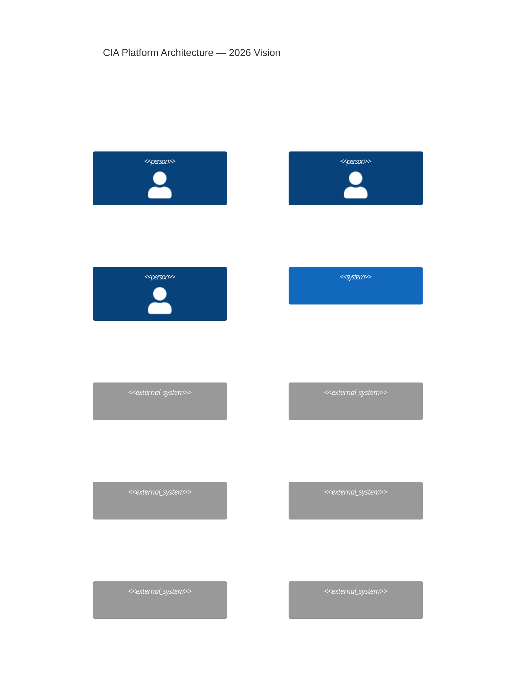
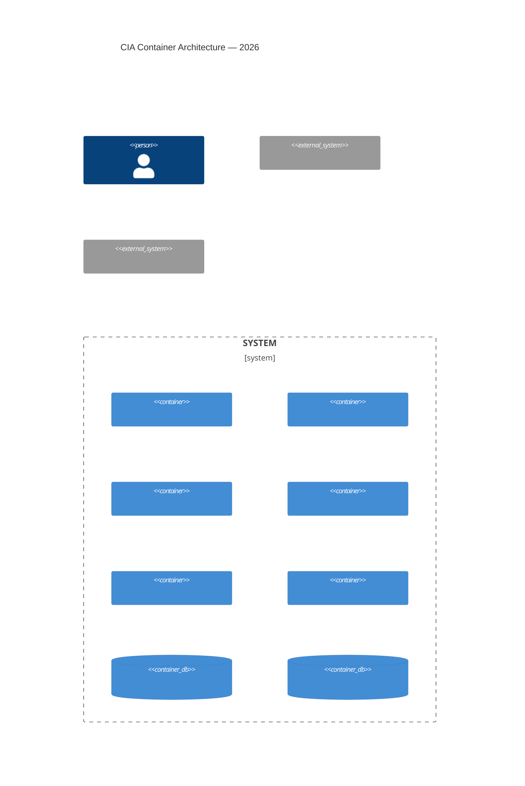
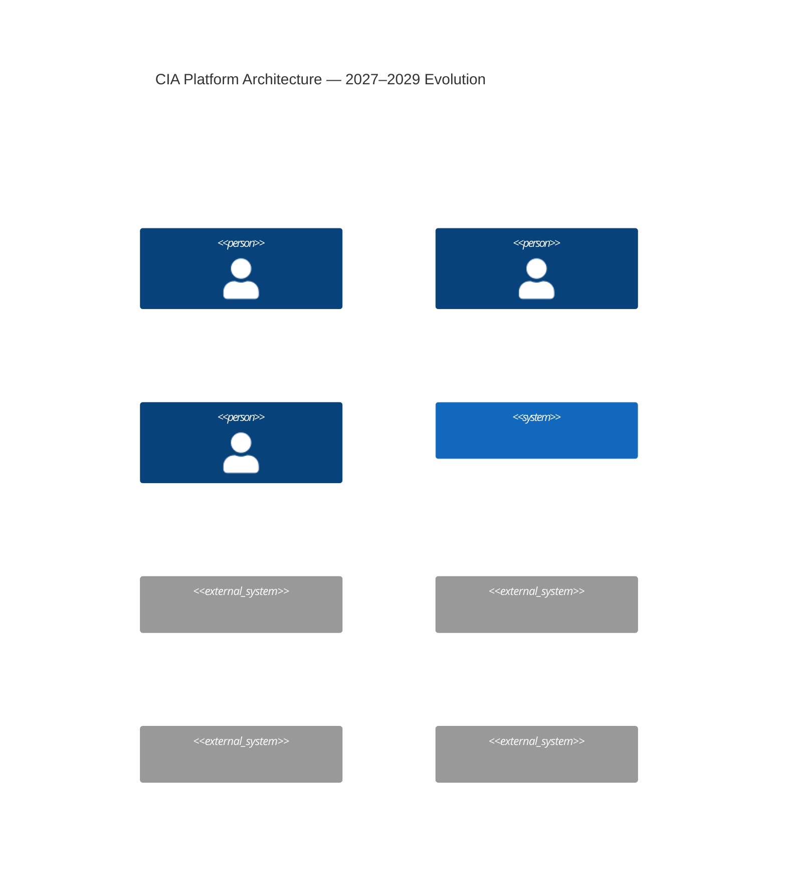
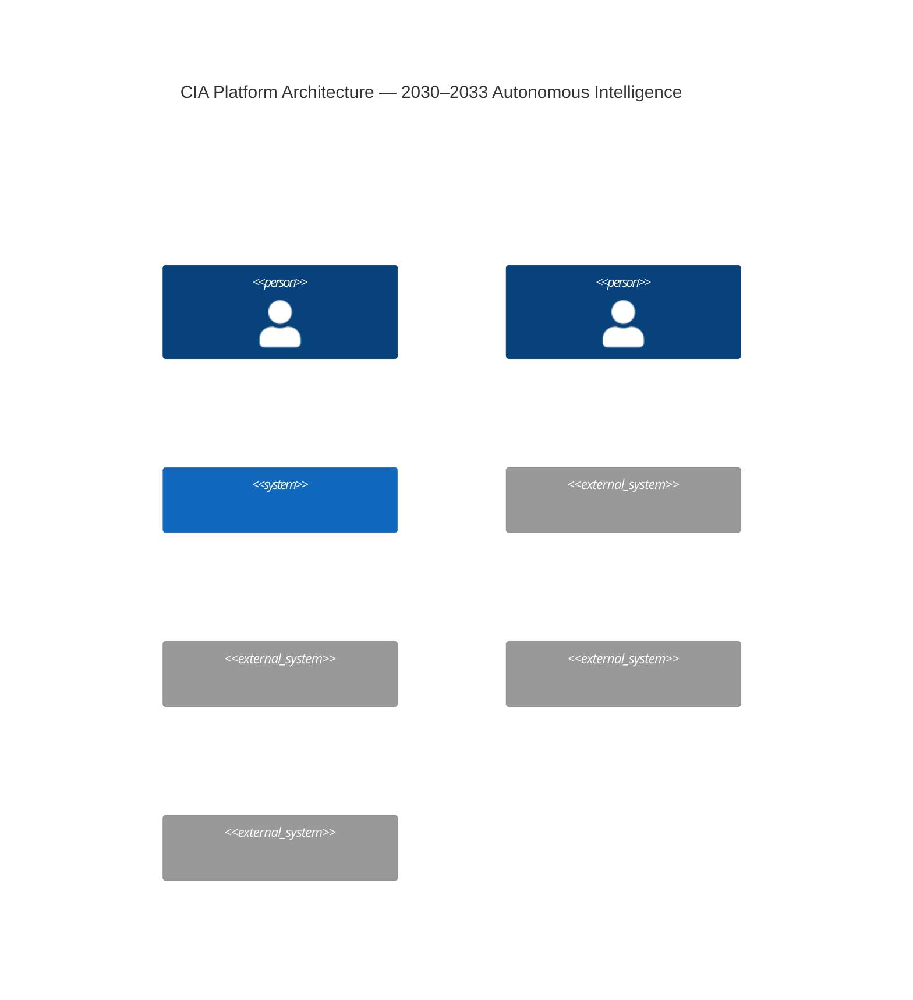

# 🏛️ Future Architecture Vision: 2026–2037 Roadmap

This document presents the evolution roadmap for the Citizen Intelligence Agency platform architecture, from practical 2026 enhancements through visionary 2037 capabilities. The roadmap accounts for rapid AI/LLM advancement—currently leveraging Anthropic Opus 4.6 with minor updates every ~2.3 months and major version upgrades annually—while anticipating competitor LLMs, emergent models, and the trajectory toward AGI.

## 📚 Architecture Documentation Map

| Document                                            | Focus           | Description                               | Documentation Link                                                              |
| --------------------------------------------------- | --------------- | ----------------------------------------- | ------------------------------------------------------------------------------- |
| **[Architecture](ARCHITECTURE.md)**                 | 🏛️ Architecture | C4 model showing current system structure | [View Source](https://github.com/Hack23/cia/blob/master/ARCHITECTURE.md)         |
| **[Future Architecture](FUTURE_ARCHITECTURE.md)**   | 🏛️ Architecture | C4 model showing future system structure | [View Source](https://github.com/Hack23/cia/blob/master/FUTURE_ARCHITECTURE.md)         |
| **[Mindmaps](MINDMAP.md)**                          | 🧠 Concept      | Current system component relationships    | [View Source](https://github.com/Hack23/cia/blob/master/MINDMAP.md)             |
| **[Future Mindmaps](FUTURE_MINDMAP.md)**            | 🧠 Concept      | Future capability evolution               | [View Source](https://github.com/Hack23/cia/blob/master/FUTURE_MINDMAP.md)      |
| **[SWOT Analysis](SWOT.md)**                        | 💼 Business     | Current strategic assessment              | [View Source](https://github.com/Hack23/cia/blob/master/SWOT.md)                |
| **[Future SWOT Analysis](FUTURE_SWOT.md)**          | 💼 Business     | Future strategic opportunities            | [View Source](https://github.com/Hack23/cia/blob/master/FUTURE_SWOT.md)         |
| **[Data Model](DATA_MODEL.md)**                     | 📊 Data         | Current data structures and relationships | [View Source](https://github.com/Hack23/cia/blob/master/DATA_MODEL.md)          |
| **[Future Data Model](FUTURE_DATA_MODEL.md)**       | 📊 Data         | Enhanced political data architecture      | [View Source](https://github.com/Hack23/cia/blob/master/FUTURE_DATA_MODEL.md)   |
| **[Flowcharts](FLOWCHART.md)**                      | 🔄 Process      | Current data processing workflows         | [View Source](https://github.com/Hack23/cia/blob/master/FLOWCHART.md)           |
| **[Future Flowcharts](FUTURE_FLOWCHART.md)**        | 🔄 Process      | Enhanced AI-driven workflows              | [View Source](https://github.com/Hack23/cia/blob/master/FUTURE_FLOWCHART.md)    |
| **[State Diagrams](STATEDIAGRAM.md)**               | 🔄 Behavior     | Current system state transitions          | [View Source](https://github.com/Hack23/cia/blob/master/STATEDIAGRAM.md)        |
| **[Future State Diagrams](FUTURE_STATEDIAGRAM.md)** | 🔄 Behavior     | Enhanced adaptive state transitions       | [View Source](https://github.com/Hack23/cia/blob/master/FUTURE_STATEDIAGRAM.md) |
| **[CI/CD Workflows](WORKFLOWS.md)**                 | 🔧 DevOps       | Current automation processes              | [View Source](https://github.com/Hack23/cia/blob/master/WORKFLOWS.md)           |
| **[Future Workflows](FUTURE_WORKFLOWS.md)**         | 🔧 DevOps       | Enhanced CI/CD with ML                    | [View Source](https://github.com/Hack23/cia/blob/master/FUTURE_WORKFLOWS.md)    |
| **[End-of-Life Strategy](End-of-Life-Strategy.md)** | 📅 Lifecycle    | Maintenance and EOL planning              | [View Source](https://github.com/Hack23/cia/blob/master/End-of-Life-Strategy.md) |
| **[Financial Security Plan](FinancialSecurityPlan.md)** | 💰 Security | Cost and security implementation          | [View Source](https://github.com/Hack23/cia/blob/master/FinancialSecurityPlan.md) |
| **[Threat Model](THREAT_MODEL.md)**                 | 🛡️ Security     | Platform threat analysis (STRIDE/MITRE)   | [View Source](https://github.com/Hack23/cia/blob/master/THREAT_MODEL.md)        |
| **[Future Threat Model](FUTURE_THREAT_MODEL.md)**   | 🛡️ Security     | Future threat landscape (AI/PQC/2026-2037)| [View Source](https://github.com/Hack23/cia/blob/master/FUTURE_THREAT_MODEL.md) |
| **[CIA Features](https://hack23.com/cia-features.html)** | 🚀 Features | Platform features overview                | [View on hack23.com](https://hack23.com/cia-features.html)                     |
| **[Business Continuity Plan](BCPPlan.md)**           | 📋 Resilience   | RTO/RPO targets and recovery procedures   | [View Source](https://github.com/Hack23/cia/blob/master/BCPPlan.md)             |
| **[Business Product Document](BUSINESS_PRODUCT_DOCUMENT.md)** | 💼 Business | Data analytics and risk intelligence products | [View Source](https://github.com/Hack23/cia/blob/master/BUSINESS_PRODUCT_DOCUMENT.md) |

## 🤖 AI/LLM Evolution Assumptions

The architecture roadmap is shaped by the following AI evolution trajectory:

| Year | AI Milestone | CIA Platform Impact |
|------|-------------|-------------------|
| **2026** | Anthropic Opus 4.6 baseline; minor LLM updates every ~2.3 months; competitor models (GPT-5, Gemini Ultra, Llama 4) mature | AI-assisted code generation via GitHub Copilot agents; LLM-powered political text summarization; automated documentation |
| **2027** | Major LLM version upgrades; multi-modal models standard; 1M+ token context windows | LLM-driven political speech analysis; automated legislative impact assessment; AI-assisted OSINT correlation |
| **2028** | Specialized political/governance fine-tuned models; real-time reasoning chains | Autonomous political trend detection; AI-generated risk assessments; natural language query interface |
| **2029** | Agent-based AI systems mature; persistent memory and planning | Autonomous data pipeline management; AI agents monitoring parliamentary sessions in real-time |
| **2030** | Early AGI indicators; AI systems with broad reasoning across domains | Self-evolving analytical frameworks; cross-national political pattern recognition at scale |
| **2031–2033** | Proto-AGI capabilities; AI-driven scientific discovery accelerates | Predictive governance modeling; automated policy impact simulation; AI-citizen engagement interfaces |
| **2034–2037** | AGI or near-AGI achieved; transformative societal impact | Autonomous political intelligence ecosystem; real-time democratic health monitoring; global governance analytics |

## 🎯 2026 Vision: AI-Enhanced Political Intelligence Platform

The 2026 architecture builds on the current Java 21/Spring/Vaadin/PostgreSQL stack, adding AI-assisted capabilities through GitHub Copilot agents and LLM integrations while maintaining the proven monolithic-modular design.

```mermaid
C4Context
  title CIA Platform Architecture — 2026 Vision

  Person("citizen, #quot;Citizen Analyst#quot;, #quot;Uses platform for political research and transparency insights#quot;")
  Person("researcher, #quot;Political Researcher#quot;, #quot;Conducts deep analysis of political patterns and trends#quot;")
  Person("developer, #quot;Developer#quot;, #quot;Maintains and extends the platform with AI-assisted tooling#quot;")

  System("cia, #quot;Citizen Intelligence Agency#quot;, #quot;AI-enhanced political intelligence platform with LLM-powered analytics, GitHub Copilot agent-assisted development, and comprehensive Swedish political data analysis#quot;")

  System_Ext("riksdagen, #quot;Swedish Parliament API#quot;, #quot;Parliamentary data: members, votes, documents, committees#quot;")
  System_Ext("election, #quot;Swedish Election Authority#quot;, #quot;Election results, party data, voter turnout#quot;")
  System_Ext("worldbank, #quot;World Bank Open Data#quot;, #quot;Economic indicators and demographic data#quot;")
  System_Ext("esv, #quot;Swedish Financial Authority#quot;, #quot;Government finances and agency budgets#quot;")
  System_Ext("llmService, #quot;LLM Service Layer#quot;, #quot;Anthropic Opus 4.6 / competitor models for text analysis and summarization#quot;")
  System_Ext("copilotAgents, #quot;GitHub Copilot Agents#quot;, #quot;AI-assisted development, code review, documentation generation#quot;")

  Rel("citizen, cia, #quot;Explores political data, views analytics dashboards#quot;")
  Rel("researcher, cia, #quot;Queries political datasets, analyzes voting patterns#quot;")
  Rel("developer, cia, #quot;Develops features with AI-assisted tooling#quot;")

  Rel("cia, riksdagen, #quot;Imports parliamentary data via REST API#quot;")
  Rel("cia, election, #quot;Imports election and party data#quot;")
  Rel("cia, worldbank, #quot;Imports economic indicators#quot;")
  Rel("cia, esv, #quot;Imports government financial data#quot;")
  Rel("cia, llmService, #quot;Sends political texts for analysis and summarization#quot;")
  Rel("developer, copilotAgents, #quot;Leverages AI agents for development tasks#quot;")

  UpdateLayoutConfig("$c4ShapeInRow=#quot;3#quot;, $c4BoundaryInRow=#quot;1#quot;")
```

### 2026 Container Architecture

```mermaid
C4Container
  title CIA Container Architecture — 2026

  Person("user, #quot;Platform User#quot;, #quot;Citizens, researchers, journalists#quot;")

  System_Boundary("ciaPlatform, #quot;CIA Platform#quot;") {
    Container("webApp, #quot;Web Application#quot;, #quot;Vaadin 24 / Java 21#quot;, #quot;Interactive political data dashboards and analysis views#quot;")
    Container("apiLayer, #quot;REST API Layer#quot;, #quot;Spring MVC#quot;, #quot;Programmatic data access and integration endpoints#quot;")
    Container("serviceLayer, #quot;Service Layer#quot;, #quot;Spring Framework#quot;, #quot;Business logic, data processing, analytics computation#quot;")
    Container("aiModule, #quot;AI Analysis Module#quot;, #quot;Spring + LLM Client#quot;, #quot;LLM-powered text summarization, sentiment analysis, political speech parsing#quot;")
    Container("dataImport, #quot;Data Import Services#quot;, #quot;Spring Integration#quot;, #quot;Scheduled import from external political data sources#quot;")
    Container("analyticsEngine, #quot;Analytics Engine#quot;, #quot;Java 21 + SQL#quot;, #quot;Risk scoring, voting pattern analysis, performance metrics#quot;")
    ContainerDb("postgres, #quot;PostgreSQL 18#quot;, #quot;PostgreSQL#quot;, #quot;Political data store with materialized views and intelligence analytics#quot;")
    ContainerDb("cache, #quot;Application Cache#quot;, #quot;Spring Cache / Ehcache#quot;, #quot;Frequently accessed data and computed analytics#quot;")
  }

  System_Ext("llm, #quot;LLM Services#quot;, #quot;Anthropic / OpenAI / Open-source models#quot;")
  System_Ext("dataSources, #quot;External Data Sources#quot;, #quot;Riksdagen, Election Authority, World Bank, ESV#quot;")

  Rel("user, webApp, #quot;Interacts with dashboards#quot;, #quot;HTTPS#quot;")
  Rel("user, apiLayer, #quot;Queries data programmatically#quot;, #quot;REST/JSON#quot;")
  Rel("webApp, serviceLayer, #quot;Delegates business operations#quot;")
  Rel("apiLayer, serviceLayer, #quot;Routes API requests#quot;")
  Rel("serviceLayer, analyticsEngine, #quot;Requests analytics computations#quot;")
  Rel("serviceLayer, aiModule, #quot;Requests AI-powered analysis#quot;")
  Rel("serviceLayer, postgres, #quot;Reads/writes political data#quot;, #quot;JDBC/JPA#quot;")
  Rel("serviceLayer, cache, #quot;Caches computed results#quot;")
  Rel("dataImport, dataSources, #quot;Scheduled data imports#quot;, #quot;REST/XML#quot;")
  Rel("dataImport, postgres, #quot;Stores imported data#quot;")
  Rel("aiModule, llm, #quot;Sends text for analysis#quot;, #quot;API#quot;")

  UpdateLayoutConfig("$c4ShapeInRow=#quot;3#quot;, $c4BoundaryInRow=#quot;1#quot;")
```

### 2026 Key Enhancements

| Enhancement | Description | Technology |
|------------|-------------|------------|
| **LLM-Powered Summarization** | Automated summaries of parliamentary debates, motions, and committee reports | Anthropic Opus 4.6 API |
| **AI-Assisted Development** | GitHub Copilot agents for code generation, review, issue triage, and documentation | GitHub Copilot Agents |
| **Enhanced Risk Analytics** | Drools-based risk scoring with ML-enhanced anomaly detection in political behavior | Drools + scikit-learn |
| **Improved Data Pipelines** | More resilient data import with retry logic, circuit breakers, and data quality monitoring | Spring Integration + Resilience4j |
| **API Ecosystem** | RESTful API endpoints for third-party integrations and research access | Spring MVC + OpenAPI 3.0 |
| **Accessibility Improvements** | WCAG 2.1 AA compliance across all dashboard views | Vaadin 24 accessibility features |

## 🔮 2027–2029 Vision: Intelligent Analytics Platform

As LLMs mature with annual major upgrades and multi-modal capabilities become standard, the platform evolves from a data presentation layer to an intelligent analytics system.

```mermaid
C4Context
  title CIA Platform Architecture — 2027–2029 Evolution

  Person("citizen, #quot;Engaged Citizen#quot;, #quot;Natural language interaction with political data#quot;")
  Person("researcher, #quot;Intelligence Analyst#quot;, #quot;Leverages AI-assisted pattern recognition and predictive models#quot;")
  Person("journalist, #quot;Investigative Journalist#quot;, #quot;Uses AI-powered cross-referencing and anomaly detection#quot;")

  System("cia, #quot;CIA Intelligent Analytics Platform#quot;, #quot;AI-native political intelligence with natural language queries, predictive analytics, and automated insight generation#quot;")

  System_Ext("multiModalAI, #quot;Multi-Modal AI Services#quot;, #quot;Next-gen LLMs with 1M+ token context, reasoning chains, and specialized political models#quot;")
  System_Ext("aiAgents, #quot;Autonomous AI Agents#quot;, #quot;Persistent AI agents for continuous parliamentary monitoring and analysis#quot;")
  System_Ext("dataSources, #quot;Expanded Data Sources#quot;, #quot;Nordic parliaments, EU Parliament, media feeds, social media APIs#quot;")
  System_Ext("mcp, #quot;MCP Server Ecosystem#quot;, #quot;Model Context Protocol servers for structured data access#quot;")

  Rel("citizen, cia, #quot;Asks questions in natural language, receives personalized insights#quot;")
  Rel("researcher, cia, #quot;Runs predictive models, analyzes cross-party dynamics#quot;")
  Rel("journalist, cia, #quot;Investigates anomalies, tracks legislative influence#quot;")

  Rel("cia, multiModalAI, #quot;Processes text, audio, and video from parliamentary sessions#quot;")
  Rel("cia, aiAgents, #quot;Deploys autonomous monitoring agents#quot;")
  Rel("cia, dataSources, #quot;Integrates expanded political data sources#quot;")
  Rel("cia, mcp, #quot;Exposes structured political data via MCP#quot;")

  UpdateLayoutConfig("$c4ShapeInRow=#quot;3#quot;, $c4BoundaryInRow=#quot;1#quot;")
```

### 2027–2029 Architectural Shifts

| Year | Architectural Change | Rationale |
|------|---------------------|-----------|
| **2027** | Natural language query interface over political data | LLM context windows enable complex political dataset reasoning |
| **2027** | MCP server integration for structured data access | Standardized AI-data interaction protocol matures |
| **2028** | Microservices extraction for AI workloads | Separate scaling for compute-intensive AI analysis |
| **2028** | Real-time parliamentary session monitoring | AI agents capable of live transcript analysis |
| **2029** | Autonomous data pipeline management | AI agents manage ETL, data quality, and source discovery |
| **2029** | Cross-national political intelligence | Nordic and EU parliament data integration |

## 🌍 2030–2033 Vision: Autonomous Political Intelligence

With proto-AGI capabilities emerging, the platform becomes increasingly autonomous in its intelligence gathering, analysis, and reporting.

```mermaid
C4Context
  title CIA Platform Architecture — 2030–2033 Autonomous Intelligence

  Person("citizen, #quot;Democratic Participant#quot;, #quot;Receives proactive political insights and personalized governance reports#quot;")
  Person("policymaker, #quot;Policy Analyst#quot;, #quot;Leverages AI-simulated policy outcomes for evidence-based decisions#quot;")

  System("cia, #quot;CIA Autonomous Intelligence Platform#quot;, #quot;Self-evolving political intelligence with predictive governance modeling, automated reporting, and global democratic health monitoring#quot;")

  System_Ext("agiServices, #quot;Advanced AI / Proto-AGI Services#quot;, #quot;Broad-domain reasoning, autonomous research, causal inference#quot;")
  System_Ext("globalGov, #quot;Global Governance Data Network#quot;, #quot;Real-time feeds from democratic institutions worldwide#quot;")
  System_Ext("simulation, #quot;Policy Simulation Engine#quot;, #quot;Monte Carlo and agent-based policy outcome modeling#quot;")
  System_Ext("citizenInterface, #quot;Citizen Engagement Layer#quot;, #quot;Personalized political briefings, conversational AI, notification systems#quot;")

  Rel("citizen, citizenInterface, #quot;Receives personalized political intelligence#quot;")
  Rel("citizenInterface, cia, #quot;Delivers tailored insights#quot;")
  Rel("policymaker, cia, #quot;Simulates policy outcomes, analyzes governance effectiveness#quot;")
  Rel("cia, agiServices, #quot;Leverages advanced reasoning for complex political analysis#quot;")
  Rel("cia, globalGov, #quot;Monitors democratic institutions globally#quot;")
  Rel("cia, simulation, #quot;Runs policy impact simulations#quot;")

  UpdateLayoutConfig("$c4ShapeInRow=#quot;3#quot;, $c4BoundaryInRow=#quot;1#quot;")
```

### 2030–2033 Capability Matrix

| Capability | Description | AI Dependency |
|-----------|-------------|---------------|
| **Predictive Governance Modeling** | Forecast policy outcomes based on historical patterns, economic indicators, and political dynamics | Proto-AGI causal reasoning |
| **Automated Intelligence Reports** | AI-generated weekly political intelligence briefings for citizens | Advanced NLG with editorial judgment |
| **Democratic Health Index** | Real-time scoring of democratic institutional health across nations | Multi-source data fusion + anomaly detection |
| **Policy Simulation Sandbox** | Interactive policy outcome modeling for education and research | Agent-based simulation + LLM explanation |
| **Cross-Border Pattern Recognition** | Identification of political trends propagating across democratic systems | Global data integration + pattern matching |
| **Corruption Risk Early Warning** | Proactive detection of governance integrity risks | Behavioral analysis + network graph anomalies |

## 🚀 2034–2037 Visionary Horizon: Democratic Intelligence Ecosystem

Assuming AGI or near-AGI capabilities are achieved by the mid-2030s, the Citizen Intelligence Agency evolves into a comprehensive democratic intelligence ecosystem that fundamentally enhances the relationship between citizens and democratic institutions.

```mermaid
C4Context
  title CIA Platform Architecture — 2034–2037 Democratic Intelligence Ecosystem

  Person("citizen, #quot;Empowered Citizen#quot;, #quot;Continuous, AI-mediated democratic engagement and political literacy#quot;")
  Person("institution, #quot;Democratic Institution#quot;, #quot;Uses AI-verified transparency and accountability frameworks#quot;")

  System("cia, #quot;CIA Democratic Intelligence Ecosystem#quot;, #quot;AGI-enhanced political intelligence serving as infrastructure for democratic accountability, transparency, and citizen empowerment#quot;")

  System_Ext("agiCore, #quot;AGI Services#quot;, #quot;General-purpose AI reasoning, autonomous research, knowledge synthesis#quot;")
  System_Ext("globalDemocracy, #quot;Global Democracy Network#quot;, #quot;Federated network of democratic transparency platforms worldwide#quot;")
  System_Ext("verificationLayer, #quot;AI Verification & Trust#quot;, #quot;Cryptographic verification of AI-generated analysis, provenance tracking, bias detection#quot;")
  System_Ext("educationPlatform, #quot;Civic Education Platform#quot;, #quot;AI-personalized political literacy and democratic participation training#quot;")

  Rel("citizen, cia, #quot;Engages with democracy through AI-enhanced transparency tools#quot;")
  Rel("institution, cia, #quot;Provides data, receives accountability insights#quot;")
  Rel("cia, agiCore, #quot;Leverages AGI for deep political reasoning and synthesis#quot;")
  Rel("cia, globalDemocracy, #quot;Participates in federated democratic intelligence network#quot;")
  Rel("cia, verificationLayer, #quot;Ensures AI analysis integrity and trustworthiness#quot;")
  Rel("cia, educationPlatform, #quot;Powers personalized civic education#quot;")

  UpdateLayoutConfig("$c4ShapeInRow=#quot;3#quot;, $c4BoundaryInRow=#quot;1#quot;")
```

### 2034–2037 Transformative Capabilities

| Capability | Vision | Prerequisite |
|-----------|--------|-------------|
| **AGI-Powered Political Analysis** | Comprehensive, nuanced understanding of political dynamics rivaling expert human analysts | AGI with domain expertise and ethical guardrails |
| **Real-Time Democratic Health Monitoring** | Continuous assessment of democratic institutional integrity across all levels of government | Global data federation + AGI reasoning |
| **AI-Verified Transparency** | Cryptographically verified AI analysis with full provenance, bias disclosure, and confidence scoring | Post-quantum cryptography + AI interpretability advances |
| **Federated Democratic Intelligence** | Global network of democratic transparency platforms sharing insights while respecting sovereignty | International data governance standards |
| **Personalized Civic Intelligence** | Every citizen receives tailored political briefings at their comprehension level | AGI + personalization without manipulation |
| **Autonomous Accountability Systems** | AI systems that independently monitor governance commitments and flag discrepancies | AGI with institutional knowledge + ethical oversight |

### AI Evolution & Competition Considerations

| Factor | Impact on Architecture | Mitigation Strategy |
|--------|----------------------|---------------------|
| **Rapid LLM Version Churn** | API breaking changes with ~2.3-month minor / annual major updates | Abstraction layer isolating LLM provider specifics; multi-provider support |
| **Competitor Models** | GPT-N, Gemini, Llama, Mistral, and new entrants may outperform current choices | Provider-agnostic AI service interface; benchmarking framework for model selection |
| **Open-Source LLMs** | Increasingly capable open models may enable self-hosted inference | Hybrid architecture supporting both cloud API and self-hosted models |
| **AGI Emergence** | Fundamental shift in what's computationally possible | Modular AI integration points allowing replacement of narrow AI with AGI services |
| **AI Regulation** | EU AI Act and potential governance-specific AI regulation | Compliance-ready architecture with explainability, bias detection, and audit trails |
| **AI Safety Concerns** | Public trust in AI-generated political analysis | Human-in-the-loop verification, source attribution, confidence scoring |

## 📊 Architecture Evolution Timeline

```mermaid
timeline
    title CIA Architecture Evolution: 2026–2037

    section 2026 — AI-Enhanced Foundation
      LLM-powered text summarization : Anthropic Opus 4.6 integration
      GitHub Copilot agent-assisted development : AI-driven code and docs
      Enhanced risk analytics with ML anomaly detection : Drools + ML
      REST API ecosystem for third-party integration : OpenAPI 3.0

    section 2027–2028 — Intelligent Analytics
      Natural language query interface : Multi-modal LLM integration
      MCP server ecosystem for structured data : Model Context Protocol
      Real-time parliamentary session analysis : Live transcript AI processing
      Microservices extraction for AI workloads : Kubernetes + autoscaling

    section 2029–2030 — Autonomous Intelligence
      Autonomous data pipeline management : AI agent-managed ETL
      Cross-national political intelligence : Nordic + EU data integration
      Predictive governance modeling : Causal inference + simulation
      Democratic health index : Multi-source anomaly detection

    section 2031–2033 — Proto-AGI Integration
      AI-generated political intelligence reports : Advanced NLG
      Policy simulation sandbox : Agent-based modeling
      Corruption risk early warning : Behavioral analysis AI
      Global governance analytics : International data federation

    section 2034–2037 — AGI-Era Transformation
      AGI-powered political analysis : General-purpose AI reasoning
      Federated democratic intelligence network : Global transparency
      AI-verified analysis with cryptographic provenance : Post-quantum security
      Personalized civic intelligence for every citizen : AGI + ethical personalization
```

## 🔄 Technology Stack Evolution

| Layer | 2026 (Current+) | 2028 | 2030 | 2033 | 2037 |
|-------|-----------------|------|------|------|------|
| **Language** | Java 21 (src) / Java 26 (runtime) | Java 26+ | Java 29+ or Kotlin | Polyglot (JVM + AI-native) | AI-managed polyglot |
| **Framework** | Spring Framework 5.x | Spring Boot 3.x / Spring 6 | Cloud-native Spring | AI-orchestrated services | AGI-managed infrastructure |
| **UI** | Vaadin 24 | Vaadin + React components | Conversational + visual UI | Multi-modal interfaces | AGI-personalized experiences |
| **Database** | PostgreSQL 18 | PostgreSQL 18+ with vector extensions | Distributed PostgreSQL + graph DB | Multi-model data platform | Self-optimizing data fabric |
| **AI/LLM** | Anthropic Opus 4.6 via API | Multi-provider LLM layer | Specialized political AI models | Proto-AGI integration | Full AGI services |
| **CI/CD** | GitHub Actions + Copilot | AI-enhanced testing + deployment | Autonomous CI/CD agents | Self-healing pipelines | AGI-managed development lifecycle |
| **Security** | Spring Security + AWS WAF | Zero-trust + AI threat detection | AI-augmented security operations | Autonomous security posture | Post-quantum + AGI security |

## 🌈 Vision Statement

The Citizen Intelligence Agency's architectural evolution from 2026 to 2037 follows a deliberate progression:

1. **2026: Augment** — Enhance the existing proven platform with AI-assisted capabilities, maintaining stability while adding LLM-powered analysis
2. **2027–2029: Intelligentize** — Transform from data presentation to intelligent analytics with natural language interaction and autonomous monitoring
3. **2030–2033: Autonomize** — Enable increasingly autonomous political intelligence gathering, analysis, and reporting with human oversight
4. **2034–2037: Democratize** — Evolve into essential democratic infrastructure that empowers every citizen with personalized political intelligence

Throughout this evolution, the platform maintains its core values: **transparency**, **political neutrality**, **privacy protection**, **open-source commitment**, and **democratic accountability**.

The AI evolution assumption—minor LLM updates every ~2.3 months and major version upgrades annually—means the architecture must be fundamentally **AI-provider agnostic** and **modular**, allowing seamless adoption of whatever AI capabilities prove most effective, whether from Anthropic, competitors, open-source communities, or eventual AGI systems.

## Related Documentation

- [Current Architecture](ARCHITECTURE.md) — Review the current system structure
- [Current Mindmaps](MINDMAP.md) — Explore existing system component relationships
- [Future Mindmaps](FUTURE_MINDMAP.md) — Future capability evolution roadmap
- [Project README](README.md) — Get an overview of the Citizen Intelligence Agency project
- [End-of-Life Strategy](End-of-Life-Strategy.md) — Understand technology maintenance plans
- [Financial Security Plan](FinancialSecurityPlan.md) — Review AWS security implementations
- [CIA Features](https://hack23.com/cia-features.html) — See detailed features with screenshots

---

**📋 Document Control:**  
**✅ Approved by:** James Pether Sörling, CEO - Hack23 AB  
**📤 Distribution:** Public  
**🏷️ Classification:**     
**📅 Effective Date:** 2025-09-18  
**⏰ Next Review:** 2026-09-18  
**🎯 Framework Compliance:**    
