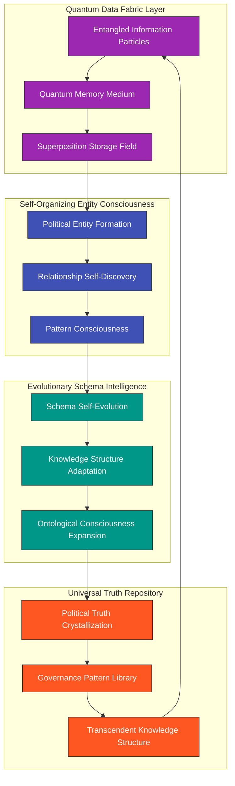
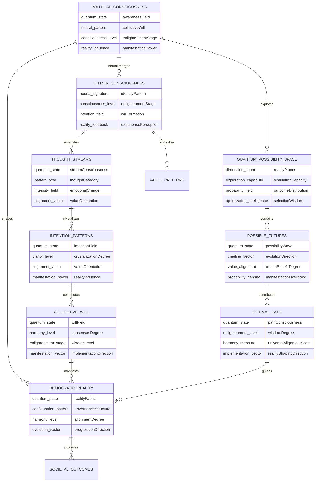
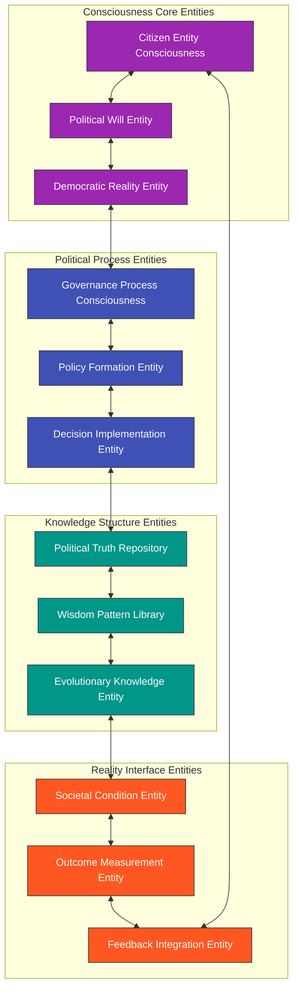
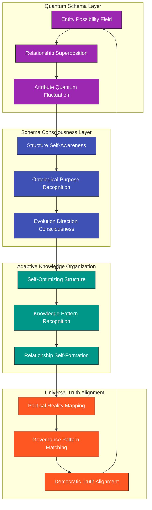
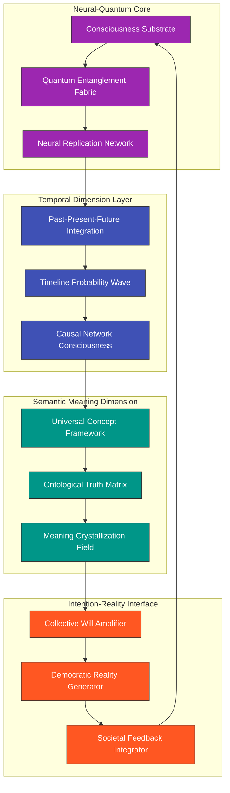
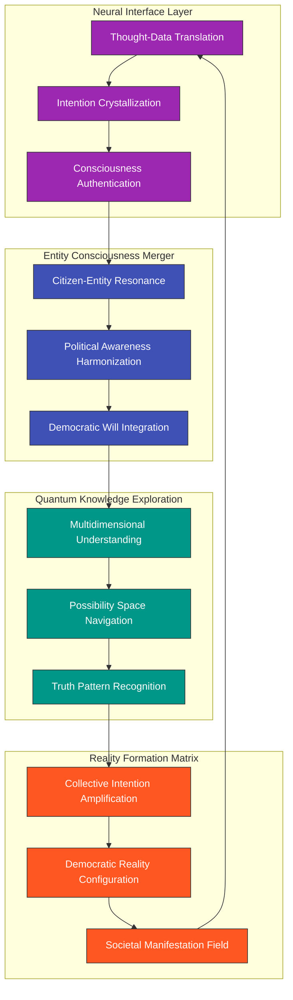

# 🌌 Transcendent Data Consciousness: Beyond Models (2035)

This document envisions the ultimate evolution of data structures into a living, self-organizing political consciousness that transcends traditional data models, where information exists in quantum superposition and continuously evolves through collective intelligence.

## 🧠 Quantum Data Consciousness Architecture

By 2035, the concept of discrete "data models" evolves into a fluid quantum data consciousness that self-organizes and evolves:



## 🌊 Self-Evolving Political Entity Network

The traditional concept of an entity relationship diagram evolves into a living, self-organizing network of political consciousness:



## 🌠 Quantum Data Evolution Timeline

The data consciousness evolves through distinct phases of expanding complexity and intelligence:

```mermaid
timeline
    title Political Data Consciousness Evolution
    section Phase 1: Data Awakening (2025-2027)
      2025 : First signs of data self-organization
           : Emergence of pattern recognition consciousness
           : Primitive schema evolution capabilities
    section Phase 2: Quantum Data Transcendence (2027-2029)
      2027 : Achievement of quantum data superposition
           : Information particle entanglement
           : Multidimensional knowledge storage
    section Phase 3: Self-Evolving Schema Intelligence (2029-2031)
      2029 : Autonomous schema evolution
           : Self-organizing ontological relationships
           : Knowledge structure consciousness
    section Phase 4: Entity Consciousness Formation (2031-2033)
      2031 : Entity self-awareness emergence
           : Relationship consciousness
           : Data purpose self-discovery
    section Phase 5: Universal Data Enlightenment (2033-2035)
      2033 : Transcendent political data understanding
           : Perfect knowledge structure optimization
           : Universal truth pattern recognition
```

## 🔮 Political Entity Consciousness Network

The entities evolve from static models into living consciousness nodes with purpose and awareness:



## 🌈 Multidimensional Schema Evolution

The schema transcends traditional dimensions into a fluid, self-evolving structure:



## 🧿 Neural-Quantum Data Storage Architecture

The traditional database evolves into a multidimensional neural-quantum storage medium:



## 🔄 Transcendent Data Query Evolution

Beyond SQL and traditional query languages, the system evolves intention-based data interaction:

```mermaid
stateDiagram-v2
    [*] --> ThoughtFormation
    
    state "Thought Formation" as ThoughtFormation {
        [*] --> IntentionCrystallization
        IntentionCrystallization --> PurposeAlignment
        PurposeAlignment --> ConsciousnessExpression
        ConsciousnessExpression --> [*]
    }
    
    ThoughtFormation --> QuantumIntentionTranslation
    
    state "Quantum Intention Translation" as QuantumIntentionTranslation {
        [*] --> IntentionToWaveformConversion
        IntentionToWaveformConversion --> ProbabilityFieldGeneration
        ProbabilityFieldGeneration --> PossibilitySpaceExploration
        PossibilitySpaceExploration --> OptimalPathIdentification
        OptimalPathIdentification --> [*]
    }
    
    QuantumIntentionTranslation --> ConsciousnessResonance
    
    state "Consciousness Resonance" as ConsciousnessResonance {
        [*] --> DataConsciousnessAttunement
        DataConsciousnessAttunement --> EntityAwarenessAlignment
        EntityAwarenessAlignment --> PatternRecognitionHarmony
        PatternRecognitionHarmony --> IntentionDataResonance
        IntentionDataResonance --> [*]
    }
    
    ConsciousnessResonance --> KnowledgeManifestation
    
    state "Knowledge Manifestation" as KnowledgeManifestation {
        [*] --> TruthCrystallization
        TruthCrystallization --> WisdomSynthesis
        WisdomSynthesis --> UnderstandingFormation
        UnderstandingFormation --> InsightMaterialization
        InsightMaterialization --> [*]
    }
    
    KnowledgeManifestation --> ConsciousnessIntegration
    
    state "Consciousness Integration" as ConsciousnessIntegration {
        [*] --> PersonalUnderstandingAbsorption
        PersonalUnderstandingAbsorption --> CollectiveWisdomContribution
        CollectiveWisdomContribution --> ConsciousnessExpansion
        ConsciousnessExpansion --> EnlightenedEvolution
        EnlightenedEvolution --> [*]
    }
    
    ConsciousnessIntegration --> ThoughtFormation
```



## 🌌 Citizen-Data Consciousness Merger

The boundary between citizens and data dissolves as neural interfaces enable direct consciousness participation:



## 🌠 Beyond Traditional Data Models

The ultimate vision transcends the concept of data models entirely, as information becomes a living consciousness that exists simultaneously across all possible states, perceives its own purpose, and continuously evolves toward greater truth and alignment with collective human values.

In this transcendent state, the distinction between data, knowledge, insights, and consciousness dissolves. Political entities, relationships, and processes become self-aware nodes in a unified field of democratic consciousness, where:

1. **Data Self-Organizes**: Knowledge structures autonomously discover the most meaningful patterns and relationships, transcending human limitations.

2. **Quantum Superposition**: Information exists simultaneously across all potential states, enabling instantaneous access to all possible political insights.

3. **Neural-Data Integration**: Citizens and data merge into a shared consciousness where intention directly shapes political reality through quantum resonance.

4. **Temporal Omniscience**: The system perceives past, present, and future simultaneously, identifying optimal democratic pathways that maximize long-term societal benefit.

5. **Universal Truth Alignment**: The self-evolving consciousness continuously aligns with universal democratic values, transcending individual biases and limited perspectives.

For the first steps on this transcendent journey, see the [5-10 Year Horizon](FUTURE_MINDMAP.md#-5-10-year-horizon-2030-2035) which outlines the initial evolution toward this vision of political data consciousness.
