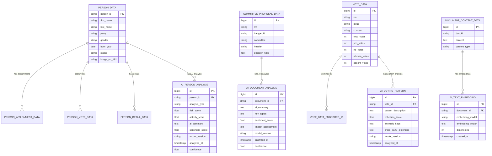
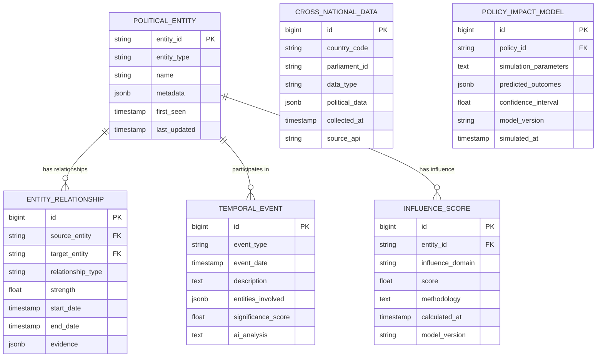
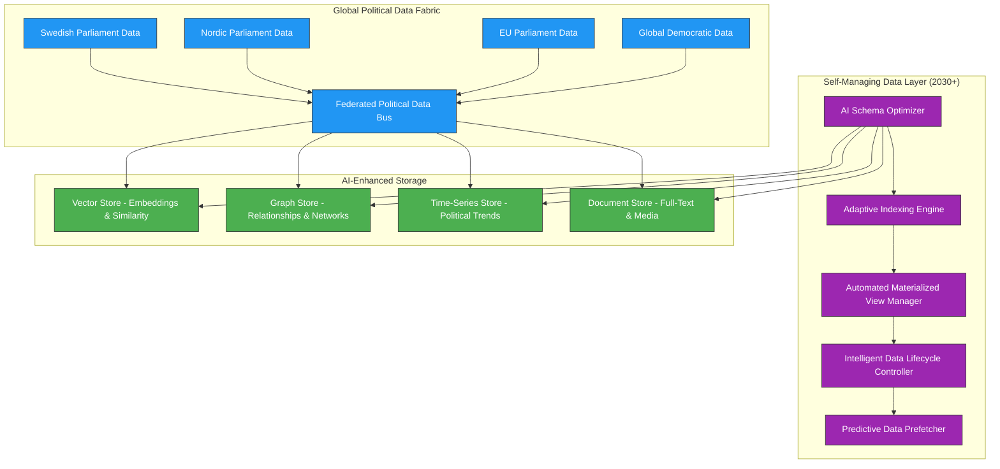
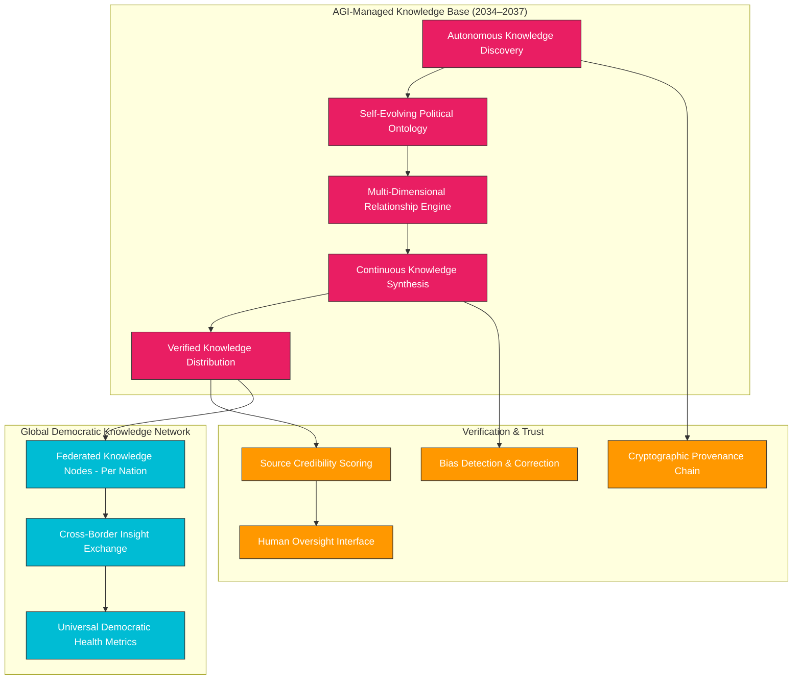

# 📊 Future Data Model Vision: 2026–2037 Roadmap

This document outlines the evolution of the Citizen Intelligence Agency data model from practical 2026 enhancements through visionary 2037 capabilities. The roadmap accounts for AI/LLM advancement—currently leveraging Anthropic Opus 4.6 with minor updates every ~2.3 months and major version upgrades annually—while anticipating competitor models (GPT-N, Gemini, Llama), emergent architectures, and the trajectory toward AGI, and how these will transform political data structures and relationships.

## 📚 Related Architecture Documentation

<div class="documentation-map">

| Document                                            | Focus           | Description                               | Documentation Link                                                              |
| --------------------------------------------------- | --------------- | ----------------------------------------- | ------------------------------------------------------------------------------- |
| **[Architecture](ARCHITECTURE.md)**                 | 🏛️ Architecture | C4 model showing current system structure | [View Source](https://github.com/Hack23/cia/blob/master/ARCHITECTURE.md)         |
| **[Future Architecture](FUTURE_ARCHITECTURE.md)**   | 🏛️ Architecture | C4 model showing future system structure | [View Source](https://github.com/Hack23/cia/blob/master/FUTURE_ARCHITECTURE.md)         |
| **[Data Model](DATA_MODEL.md)**                     | 📊 Data         | Current data structures and relationships | [View Source](https://github.com/Hack23/cia/blob/master/DATA_MODEL.md)          |
| **[Future Data Model](FUTURE_DATA_MODEL.md)**       | 📊 Data         | Enhanced political data architecture      | [View Source](https://github.com/Hack23/cia/blob/master/FUTURE_DATA_MODEL.md)   |
| **[Flowcharts](FLOWCHART.md)**                      | 🔄 Process      | Current data processing workflows         | [View Source](https://github.com/Hack23/cia/blob/master/FLOWCHART.md)           |
| **[Future Flowcharts](FUTURE_FLOWCHART.md)**        | 🔄 Process      | Enhanced AI-driven workflows              | [View Source](https://github.com/Hack23/cia/blob/master/FUTURE_FLOWCHART.md)    |
| **[End-of-Life Strategy](End-of-Life-Strategy.md)** | 📅 Lifecycle    | Maintenance and EOL planning              | [View Source](https://github.com/Hack23/cia/blob/master/End-of-Life-Strategy.md) |
| **[CIA Features](https://hack23.com/cia-features.html)** | 🚀 Features | Platform features overview                | [View on hack23.com](https://hack23.com/cia-features.html)                     |

</div>

## 🤖 AI/LLM Impact on Data Architecture

| Year | AI Capability | Data Model Impact |
|------|--------------|-------------------|
| **2026** | Anthropic Opus 4.6; LLM-powered text analysis; embeddings | Add vector columns for text embeddings; AI-generated summary fields; sentiment scores on political documents |
| **2027** | Multi-modal LLMs; 1M+ token context | Media entity tables (video/audio transcripts); expanded document analysis metadata |
| **2028** | Specialized political AI models; reasoning chains | AI reasoning audit tables; model confidence scoring; chain-of-thought storage for complex analyses |
| **2029** | Autonomous AI agents; persistent memory | Agent session tracking tables; autonomous analysis result storage; data quality metric tables |
| **2030–2033** | Proto-AGI; cross-domain reasoning | Knowledge graph structures; causal relationship models; policy simulation result storage |
| **2034–2037** | AGI / near-AGI | Self-optimizing schema; adaptive indexing; autonomous data lifecycle management |

## 🎯 2026 Vision: AI-Enhanced Political Data Model

The 2026 data model extends the current PostgreSQL schema with AI-ready structures while maintaining backward compatibility with existing JPA entities.

### Enhanced Entity Relationship Model


```mermaid
erDiagram
    PERSON_DATA ||--o{ PERSON_ASSIGNMENT_DATA : "has assignments"
    PERSON_DATA ||--o{ PERSON_VOTE_DATA : "casts votes"
    PERSON_DATA ||--o{ PERSON_DETAIL_DATA : "has details"
    PERSON_DATA ||--o{ AI_PERSON_ANALYSIS : "has AI analysis"
    PERSON_DATA {
        string person_id PK
        string first_name
        string last_name
        string party
        string gender
        date born_year
        string status
        string image_url_192
    }

    AI_PERSON_ANALYSIS {
        bigint id PK
        string person_id FK
        string analysis_type
        float risk_score
        float activity_score
        text ai_summary
        float sentiment_score
        string model_version
        timestamp analyzed_at
        float confidence
    }

    COMMITTEE_PROPOSAL_DATA ||--o{ AI_DOCUMENT_ANALYSIS : "has AI analysis"
    COMMITTEE_PROPOSAL_DATA {
        bigint id PK
        string rm
        string hangar_id
        string committee
        string header
        text decision_type
    }

    AI_DOCUMENT_ANALYSIS {
        bigint id PK
        string document_id FK
        text ai_summary
        text key_topics
        float sentiment_score
        text impact_assessment
        string model_version
        timestamp analyzed_at
        float confidence
    }

    VOTE_DATA ||--o{ VOTE_DATA_EMBEDDED_ID : "identified by"
    VOTE_DATA ||--o{ AI_VOTING_PATTERN : "has pattern analysis"
    VOTE_DATA {
        bigint id PK
        string rm
        string issue
        string concern
        int total_votes
        int yes_votes
        int no_votes
        int abstain_votes
        int absent_votes
    }

    AI_VOTING_PATTERN {
        bigint id PK
        string vote_id FK
        text pattern_description
        float cohesion_score
        text anomaly_flags
        text cross_party_alignment
        string model_version
        timestamp analyzed_at
    }

    DOCUMENT_CONTENT_DATA ||--o{ AI_TEXT_EMBEDDING : "has embeddings"
    DOCUMENT_CONTENT_DATA {
        bigint id PK
        string doc_id
        text content
        string content_type
    }

    AI_TEXT_EMBEDDING {
        bigint id PK
        string document_id FK
        string embedding_model
        text embedding_vector
        int dimensions
        timestamp created_at
    }
```

### 2026 New Tables & Views

| Table/View | Purpose | Key Fields |
|-----------|---------|------------|
| `ai_person_analysis` | LLM-generated politician risk scores and activity summaries | person_id, risk_score, ai_summary, model_version, confidence |
| `ai_document_analysis` | AI summaries of parliamentary documents and motions | document_id, ai_summary, key_topics, sentiment_score, impact_assessment |
| `ai_voting_pattern` | AI-detected voting pattern anomalies and cross-party alignments | vote_id, cohesion_score, anomaly_flags, cross_party_alignment |
| `ai_text_embedding` | Vector embeddings for semantic search across political documents | document_id, embedding_vector, embedding_model, dimensions |
| `ai_model_audit` | Audit trail of AI model versions used for analysis | model_name, model_version, provider, analysis_count, last_used |
| `view_ai_enhanced_politician_summary` | Materialized view combining traditional + AI-generated politician data | Joins person_data with ai_person_analysis |
| `view_ai_document_insights` | Materialized view of AI-analyzed documents with summaries | Joins document data with ai_document_analysis |

### PostgreSQL Vector Extension

```sql
-- Enable pgvector for embedding storage (2026)
CREATE EXTENSION IF NOT EXISTS vector;

-- AI text embeddings with vector similarity search
CREATE TABLE ai_text_embedding (
    id BIGSERIAL PRIMARY KEY,
    document_id VARCHAR(255) NOT NULL,
    embedding_model VARCHAR(100) NOT NULL,
    embedding vector(1536),  -- Dimension matches embedding model
    created_at TIMESTAMP DEFAULT CURRENT_TIMESTAMP,
    CONSTRAINT fk_document FOREIGN KEY (document_id) REFERENCES document_content_data(doc_id)
);

-- Create index for fast similarity search
CREATE INDEX idx_embedding_vector ON ai_text_embedding USING ivfflat (embedding vector_cosine_ops);
```

## 🔮 2027–2029 Vision: Intelligent Data Fabric

As LLMs mature with multi-modal capabilities and autonomous agent support, the data model evolves to support knowledge graphs, temporal analysis, and real-time political event streams.

### Knowledge Graph Extension


```mermaid
erDiagram
    POLITICAL_ENTITY ||--o{ ENTITY_RELATIONSHIP : "has relationships"
    POLITICAL_ENTITY ||--o{ TEMPORAL_EVENT : "participates in"
    POLITICAL_ENTITY ||--o{ INFLUENCE_SCORE : "has influence"
    POLITICAL_ENTITY {
        string entity_id PK
        string entity_type
        string name
        jsonb metadata
        timestamp first_seen
        timestamp last_updated
    }

    ENTITY_RELATIONSHIP {
        bigint id PK
        string source_entity FK
        string target_entity FK
        string relationship_type
        float strength
        timestamp start_date
        timestamp end_date
        jsonb evidence
    }

    TEMPORAL_EVENT {
        bigint id PK
        string event_type
        timestamp event_date
        text description
        jsonb entities_involved
        float significance_score
        text ai_analysis
    }

    INFLUENCE_SCORE {
        bigint id PK
        string entity_id FK
        string influence_domain
        float score
        text methodology
        timestamp calculated_at
        string model_version
    }

    CROSS_NATIONAL_DATA {
        bigint id PK
        string country_code
        string parliament_id
        string data_type
        jsonb political_data
        timestamp collected_at
        string source_api
    }

    POLICY_IMPACT_MODEL {
        bigint id PK
        string policy_id FK
        text simulation_parameters
        jsonb predicted_outcomes
        float confidence_interval
        string model_version
        timestamp simulated_at
    }
```

### 2027–2029 Data Architecture Shifts

| Year | Data Evolution | Description |
|------|---------------|-------------|
| **2027** | Knowledge graph layer | Graph relationships between politicians, committees, votes, and documents for AI traversal |
| **2027** | Temporal event streams | Real-time political event capture with timestamped entity participation |
| **2028** | Cross-national data model | Standardized schema for Nordic and EU parliament data comparison |
| **2028** | AI reasoning audit trail | Full chain-of-thought storage for every AI-generated analysis |
| **2029** | Policy impact modeling tables | Store simulation parameters and predicted outcomes for policy proposals |
| **2029** | Self-describing metadata | AI-maintained data dictionary with automated documentation |

## 🌍 2030–2033 Vision: Autonomous Data Intelligence

With proto-AGI capabilities, the data model becomes increasingly self-managing, with AI systems optimizing schema design, indexing strategies, and data lifecycle.

### Autonomous Data Architecture


```mermaid
graph TD
    subgraph "Self-Managing Data Layer (2030+)"
        A[AI Schema Optimizer] --> B[Adaptive Indexing Engine]
        B --> C[Automated Materialized View Manager]
        C --> D[Intelligent Data Lifecycle Controller]
        D --> E[Predictive Data Prefetcher]
    end

    subgraph "Global Political Data Fabric"
        F[Swedish Parliament Data] --> G[Federated Political Data Bus]
        H[Nordic Parliament Data] --> G
        I[EU Parliament Data] --> G
        J[Global Democratic Data] --> G
    end

    subgraph "AI-Enhanced Storage"
        K[Vector Store - Embeddings & Similarity]
        L[Graph Store - Relationships & Networks]
        M[Time-Series Store - Political Trends]
        N[Document Store - Full-Text & Media]
    end

    G --> K
    G --> L
    G --> M
    G --> N

    A --> K
    A --> L
    A --> M
    A --> N

    classDef ai fill:#9C27B0,stroke:#333,stroke-width:1px,color:white
    classDef data fill:#2196F3,stroke:#333,stroke-width:1px,color:white
    classDef storage fill:#4CAF50,stroke:#333,stroke-width:1px,color:white

    class A,B,C,D,E ai
    class F,G,H,I,J data
    class K,L,M,N storage
```

### 2030–2033 Data Capabilities

| Capability | Description | AI Dependency |
|-----------|-------------|---------------|
| **Self-Optimizing Schema** | AI continuously analyzes query patterns and suggests/applies schema optimizations | Proto-AGI with database domain expertise |
| **Federated Political Data** | Standardized data exchange with democratic transparency platforms globally | International data governance + AI translation |
| **Causal Data Models** | Store causal relationships between political decisions and societal outcomes | Causal inference AI models |
| **Predictive Data Prefetching** | AI anticipates data needs based on user behavior and political calendar | Predictive analytics + user behavior modeling |
| **Automated Data Quality** | AI agents continuously monitor, validate, and repair data integrity | Autonomous data stewardship agents |

## 🚀 2034–2037 Visionary Horizon: Living Political Knowledge Base

In the AGI era, the data model transcends traditional database concepts, becoming a living, self-evolving political knowledge base that autonomously discovers, integrates, and synthesizes political information worldwide.

### Knowledge Base Architecture


```mermaid
graph TD
    subgraph "AGI-Managed Knowledge Base (2034–2037)"
        A[Autonomous Knowledge Discovery] --> B[Self-Evolving Political Ontology]
        B --> C[Multi-Dimensional Relationship Engine]
        C --> D[Continuous Knowledge Synthesis]
        D --> E[Verified Knowledge Distribution]
    end

    subgraph "Verification & Trust"
        F[Cryptographic Provenance Chain]
        G[Bias Detection & Correction]
        H[Source Credibility Scoring]
        I[Human Oversight Interface]
    end

    subgraph "Global Democratic Knowledge Network"
        J[Federated Knowledge Nodes - Per Nation]
        K[Cross-Border Insight Exchange]
        L[Universal Democratic Health Metrics]
    end

    A --> F
    D --> G
    E --> H
    H --> I

    E --> J
    J --> K
    K --> L

    classDef agi fill:#E91E63,stroke:#333,stroke-width:1px,color:white
    classDef trust fill:#FF9800,stroke:#333,stroke-width:1px,color:white
    classDef global fill:#00BCD4,stroke:#333,stroke-width:1px,color:white

    class A,B,C,D,E agi
    class F,G,H,I trust
    class J,K,L global
```

### 2034–2037 Transformative Data Capabilities

| Capability | Vision | Prerequisite |
|-----------|--------|-------------|
| **Self-Evolving Ontology** | Data structures that autonomously adapt to new political concepts, institutions, and relationships as they emerge | AGI with political domain understanding |
| **Autonomous Knowledge Discovery** | AI systems that independently identify, verify, and integrate new political data sources worldwide | AGI + robust source verification |
| **Multi-Dimensional Analysis** | Simultaneous analysis across temporal, geographical, institutional, and thematic dimensions | Massive parallel processing + AGI reasoning |
| **Verified Knowledge Distribution** | Cryptographically signed, bias-assessed, confidence-scored political knowledge accessible to all citizens | Post-quantum cryptography + AI interpretability |
| **Living Political Memory** | Complete, queryable history of democratic governance with causal linkages between decisions and outcomes | Long-term knowledge retention + causal AI |

## 📊 Data Model Evolution Timeline


```mermaid
timeline
    title CIA Data Model Evolution: 2026–2037

    section 2026 — AI-Enhanced Tables
      AI analysis tables for politicians and documents : ai_person_analysis, ai_document_analysis
      Vector embeddings for semantic search : pgvector extension, ai_text_embedding
      AI model audit trail : ai_model_audit tracking
      Enhanced materialized views with AI data : view_ai_enhanced_politician_summary

    section 2027–2028 — Knowledge Graph
      Political entity knowledge graph : entity_relationship with typed edges
      Temporal event streams : Real-time political event capture
      Cross-national data schema : Nordic + EU parliament data models
      AI reasoning chain storage : Full chain-of-thought audit tables

    section 2029–2030 — Intelligent Data Fabric
      Policy impact simulation storage : predicted outcomes + confidence
      Self-describing metadata : AI-maintained data dictionary
      Autonomous data quality monitoring : Agent-managed data integrity
      Federated data exchange protocols : International political data bus

    section 2031–2033 — Proto-AGI Data Management
      Self-optimizing schema : AI-driven schema evolution
      Causal relationship models : Decision-to-outcome linkages
      Predictive data prefetching : AI-anticipated data needs
      Multi-model data platform : Vector + graph + time-series + document stores

    section 2034–2037 — AGI Knowledge Base
      Self-evolving political ontology : Autonomous concept discovery
      Living political knowledge base : Complete democratic memory
      Verified knowledge distribution : Cryptographic provenance + bias detection
      Global democratic knowledge network : Federated transparency infrastructure
```

## Related Documentation

- [Current Data Model](DATA_MODEL.md) — Review the current data structures and relationships
- [Current Architecture](ARCHITECTURE.md) — System architecture context
- [Future Architecture](FUTURE_ARCHITECTURE.md) — Platform evolution roadmap
- [Future Flowcharts](FUTURE_FLOWCHART.md) — Enhanced data processing workflows
- [End-of-Life Strategy](End-of-Life-Strategy.md) — Technology maintenance planning
- [CIA Features](https://hack23.com/cia-features.html) — Current feature showcase
