# 📊 Future Citizen Intelligence Agency Data Model

This document outlines the future data architecture for the Citizen Intelligence Agency as it evolves into an AI-enhanced political intelligence platform. The enhanced data model will support machine learning capabilities, expanded international coverage, and integration with additional data sources to provide deeper political insights.

## 📚 Related Architecture Documentation

<div class="documentation-map">

| Document                                            | Focus           | Description                               | Documentation Link                                                              |
| --------------------------------------------------- | --------------- | ----------------------------------------- | ------------------------------------------------------------------------------- |
| **[Architecture](ARCHITECTURE.md)**                 | 🏛️ Architecture | C4 model showing current system structure | [View Source](https://github.com/Hack23/cia/blob/master/ARCHITECTURE.md)         |
| **[Future Architecture](FUTURE_ARCHITECTURE.md)**   | 🏛️ Architecture | C4 model showing future system structure | [View Source](https://github.com/Hack23/cia/blob/master/FUTURE_ARCHITECTURE.md)         |
| **[Mindmaps](MINDMAP.md)**                          | 🧠 Concept      | Current system component relationships    | [View Source](https://github.com/Hack23/cia/blob/master/MINDMAP.md)             |
| **[Future Mindmaps](FUTURE_MINDMAP.md)**            | 🧠 Concept      | Future capability evolution               | [View Source](https://github.com/Hack23/cia/blob/master/FUTURE_MINDMAP.md)      |
| **[SWOT Analysis](SWOT.md)**                        | 💼 Business     | Current strategic assessment              | [View Source](https://github.com/Hack23/cia/blob/master/SWOT.md)                |
| **[Future SWOT Analysis](FUTURE_SWOT.md)**          | 💼 Business     | Future strategic opportunities            | [View Source](https://github.com/Hack23/cia/blob/master/FUTURE_SWOT.md)         |
| **[Data Model](DATA_MODEL.md)**                     | 📊 Data         | Current data structures and relationships | [View Source](https://github.com/Hack23/cia/blob/master/DATA_MODEL.md)          |
| **[Future Data Model](FUTURE_DATA_MODEL.md)**       | 📊 Data         | Enhanced political data architecture      | [View Source](https://github.com/Hack23/cia/blob/master/FUTURE_DATA_MODEL.md)   |
| **[Flowcharts](FLOWCHART.md)**                      | 🔄 Process      | Current data processing workflows         | [View Source](https://github.com/Hack23/cia/blob/master/FLOWCHART.md)           |
| **[Future Flowcharts](FUTURE_FLOWCHART.md)**        | 🔄 Process      | Enhanced AI-driven workflows              | [View Source](https://github.com/Hack23/cia/blob/master/FUTURE_FLOWCHART.md)    |
| **[State Diagrams](STATEDIAGRAM.md)**               | 🔄 Behavior     | Current system state transitions          | [View Source](https://github.com/Hack23/cia/blob/master/STATEDIAGRAM.md)        |
| **[Future State Diagrams](FUTURE_STATEDIAGRAM.md)** | 🔄 Behavior     | Enhanced adaptive state transitions       | [View Source](https://github.com/Hack23/cia/blob/master/FUTURE_STATEDIAGRAM.md) |
| **[CI/CD Workflows](WORKFLOWS.md)**                 | 🔧 DevOps       | Current automation processes              | [View Source](https://github.com/Hack23/cia/blob/master/WORKFLOWS.md)           |
| **[Future Workflows](FUTURE_WORKFLOWS.md)**         | 🔧 DevOps       | Enhanced CI/CD with ML                    | [View Source](https://github.com/Hack23/cia/blob/master/FUTURE_WORKFLOWS.md)    |
| **[End-of-Life Strategy](End-of-Life-Strategy.md)** | 📅 Lifecycle    | Maintenance and EOL planning              | [View Source](https://github.com/Hack23/cia/blob/master/End-of-Life-Strategy.md) |
| **[Financial Security Plan](FinancialSecurityPlan.md)** | 💰 Security | Cost and security implementation          | [View Source](https://github.com/Hack23/cia/blob/master/FinancialSecurityPlan.md) |
| **[CIA Features](https://hack23.com/cia-features.html)** | 🚀 Features | Platform features overview                | [View on hack23.com](https://hack23.com/cia-features.html)                     |

</div>

## 🧩 Core Data Model Overview

The future data model expands the current structure to incorporate machine learning capabilities, enriched political data, and extensive international comparison. The diagram below illustrates the high-level relationships between key data domains.


## 🏛️ Enhanced Political Entity Data Model

The enhanced political entity model expands beyond basic profiles to include sophisticated relationship mapping, predictive attributes, and cross-jurisdictional comparisons.


## 🧠 Machine Learning Data Model

The machine learning model enables predictive analytics, pattern detection, and automated insights across the political landscape.


## 🔌 Expanded Integration Ecosystem

The integration model enables the platform to connect with a wider range of data sources and external systems.


## 🌍 International Politics Data Model

The international model supports comparative analysis of political systems and processes across countries.


## 📊 Enhanced Political Analytics Model

The analytics model supports advanced political analysis, pattern detection, and predictive insights.


## 📈 Schema Evolution Roadmap

The data model will evolve through several phases to support the platform's transformation:

```mermaid
timeline
    title Data Schema Evolution Roadmap
    section Phase 1: Core AI Foundation
        Q3 2024 : ML model schema
                : Predictive voting models
                : Enhanced political profiles
    section Phase 2: Advanced Political Analysis
        Q1 2025 : Network analysis structures
                : Policy position mapping
                : Media influence tracking
    section Phase 3: International Expansion
        Q3 2025 : Cross-country comparison schema
                : International organization models
                : Standardized political metrics
    section Phase 4: Integrated Intelligence
        Q1 2026 : Full integration ecosystem
                : Comprehensive analytics model
                : Feedback learning systems
    section Phase 5: Autonomous Political Intelligence
        Q3 2026 : Self-evolving models
                : Contextual understanding framework
                : Political insight generation
```

## 🔄 Schema Migration Strategy

To support the evolutionary development of the data model while ensuring backward compatibility, a comprehensive migration strategy will be implemented:


| Migration Phase           | Key Activities                                | Compatibility Strategy                   | Rollback Plan                            |
|---------------------------|----------------------------------------------|------------------------------------------|------------------------------------------|
| 🔄 Schema Version Control | Define schema versioning system               | Version tagging and metadata             | Version history in repository            |
| 🔄 Compatibility Layer    | Implement data transformation adapters        | Bidirectional transformers               | Runtime fallback to previous versions    |
| 🔄 Migration Testing      | Create comprehensive test suite               | Test cases for all schema versions       | Automated validation of migrations       |
| 🔄 Incremental Deployment | Roll out schema changes in phases             | Partial schema upgrades                  | Isolated deployments with safe fallback  |
| 🔄 Data Backfill         | Process existing data for new schema          | Background processing with verification  | Transaction-based backfill with rollback |

## 📊 Data Flow Diagram

The data flow diagram illustrates how information moves through the future Citizen Intelligence Agency architecture:


## 🔐 Data Security and Privacy Architecture

The future data model incorporates comprehensive security and privacy controls:


| Security Component         | Implementation Approach                                       | Regulatory Alignment                                      |
|---------------------------|--------------------------------------------------------------|----------------------------------------------------------|
| 🔒 Data Classification    | Automated classification based on sensitivity and context     | GDPR Art. 30, ISO 27001 A.8.2                           |
| 🔐 Encryption             | End-to-end encryption for sensitive data                      | GDPR Art. 32, ISO 27001 A.10.1                          |
| 🔑 Access Control         | Context-aware, least privilege access model                   | GDPR Art. 25, ISO 27001 A.9.2                           |
| 👤 Privacy Controls       | Privacy by design implementation                              | GDPR Art. 25, ISO 27701                                 |
| 📊 Differential Privacy   | Statistical noise addition to ML training data                | GDPR Art. 89, data minimization principles              |
| 🧠 Federated Learning     | Distributed model training without central data collection    | GDPR Art. 5 (data minimization)                          |
| 📜 Consent Management     | Granular, purpose-specific data usage permissions             | GDPR Art. 7, consent requirements                        |
| 🔍 Data Lineage           | End-to-end tracking of data sources and transformations       | GDPR Art. 30 (records of processing)                     |
| 📝 Audit Logging          | Comprehensive logging of data access and processing           | GDPR Art. 30, ISO 27001 A.12.4                          |

## 🔄 Future Data Architecture Design Principles

The evolution of the Citizen Intelligence Agency data model is guided by several key design principles:

```mermaid
mindmap
  root((Data Architecture<br>Principles))
    🔄 Evolvability
      Schema Versioning
      Progressive Enhancement
      Backward Compatibility
      Incremental Migration
    🔌 Interoperability
      Standard Data Formats
      API-First Design
      Universal Exchange Formats
      Integration Patterns
    📊 Context Awareness
      Multi-dimensional Politics
      Regional Adaptation
      Temporal Awareness
      Cross-Entity Relationships
    🔒 Security by Design
      Classification-driven Protection
      Privacy-enhancing Technologies
      Least Privilege Enforcement
      Data Residency Controls
    🧠 ML Readiness
      Training Data Structures
      Feature Engineering Support
      Feedback Loop Integration
      Model Versioning
    🌐 International Awareness
      Cross-Country Comparability
      Standardized Political Metrics
      Multi-Language Support
      Jurisdictional Context
```



These principles provide guidance for all data model evolutions, ensuring that the system remains adaptable, secure, and aligned with the vision of AI-enhanced political intelligence.

<div class="data-evolution-notes">
This data model architecture forms the foundation for the Citizen Intelligence Agency's transformation into an AI-enhanced political intelligence platform. By building a flexible, evolvable data architecture that supports machine learning, expanded data sources, and comprehensive security controls, the platform can deliver increasingly sophisticated and tailored political insights.

The phased evolution approach ensures that each enhancement builds upon previous capabilities while maintaining backward compatibility, allowing users to benefit from new features without disrupting existing functionality. The focus on privacy and security by design ensures that the platform can meet stringent regulatory requirements while protecting sensitive political data.

This model supports the broader vision outlined in the Future Architecture Mindmap, providing the data foundation needed to realize advanced political analytics, international comparative capabilities, and predictive insights.
</div>
