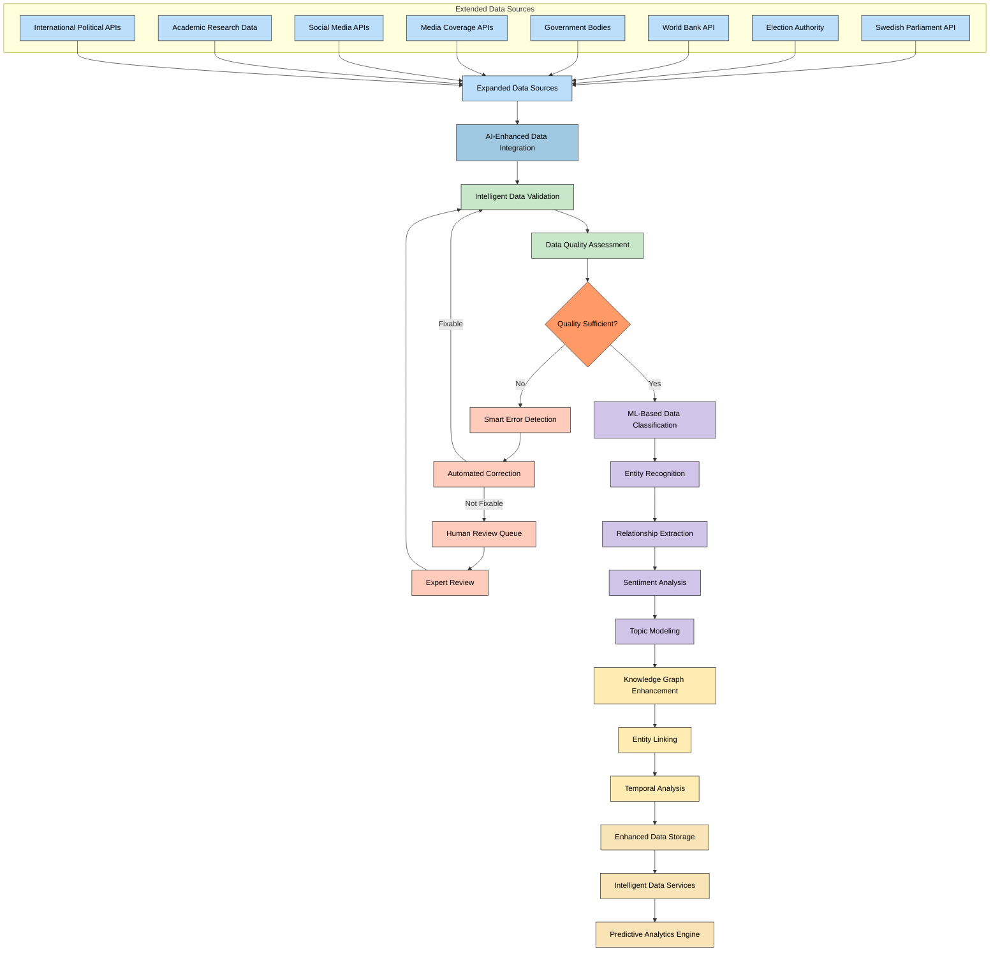
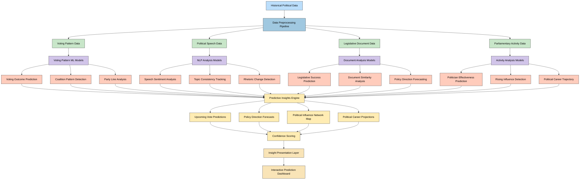
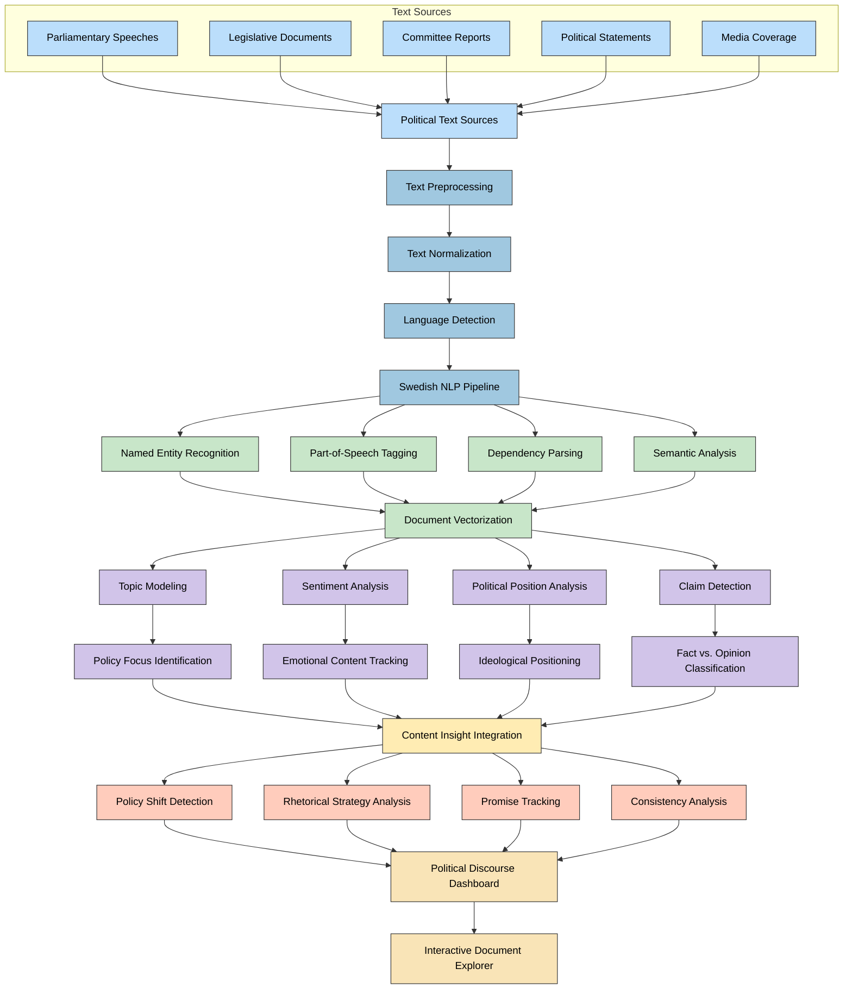
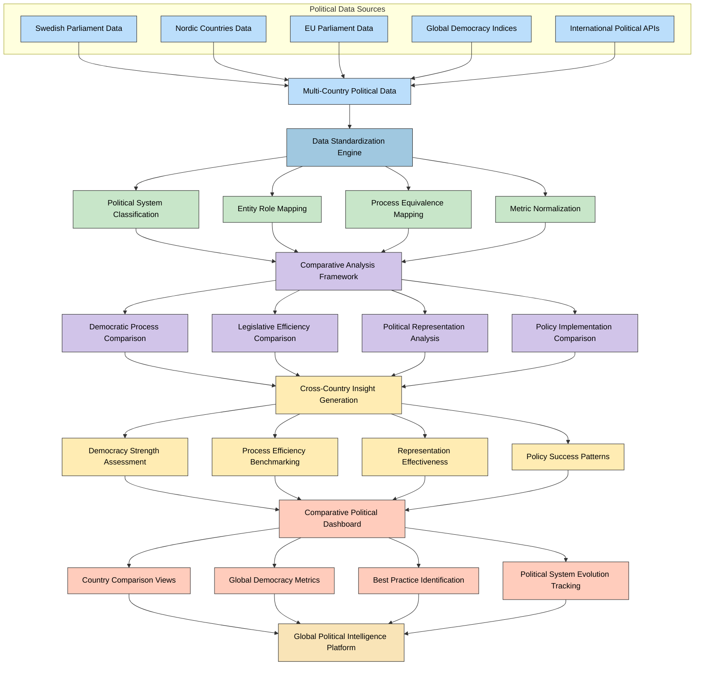
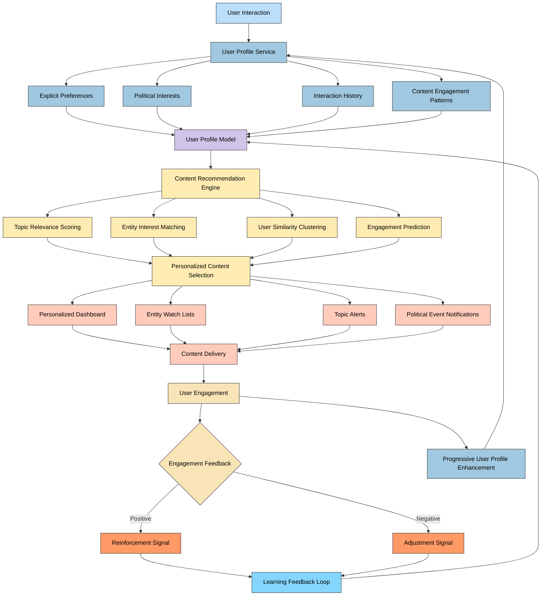
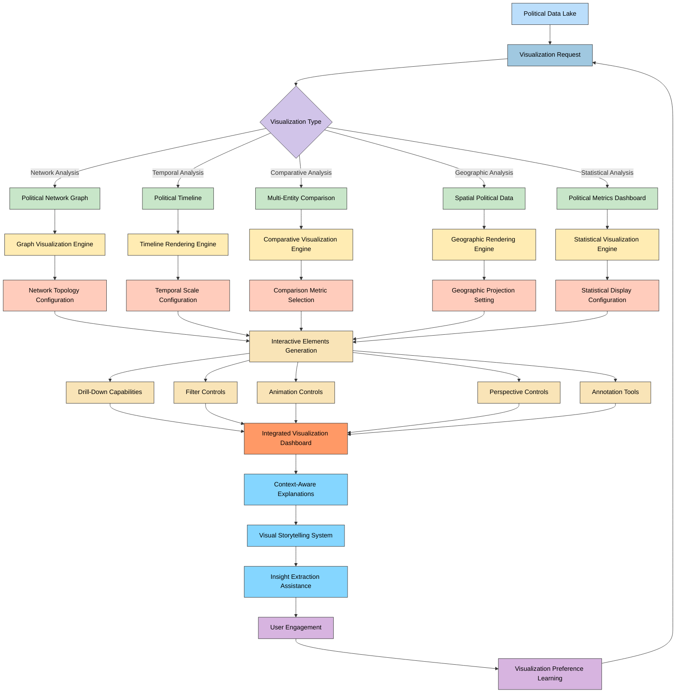
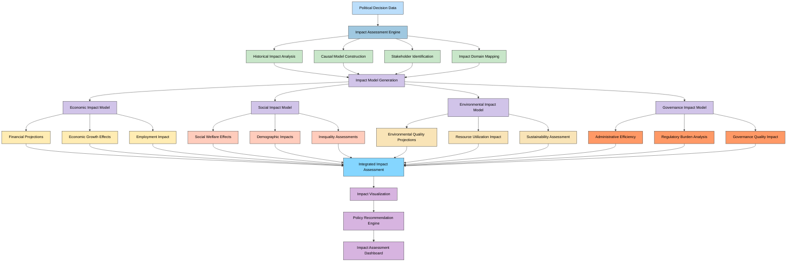
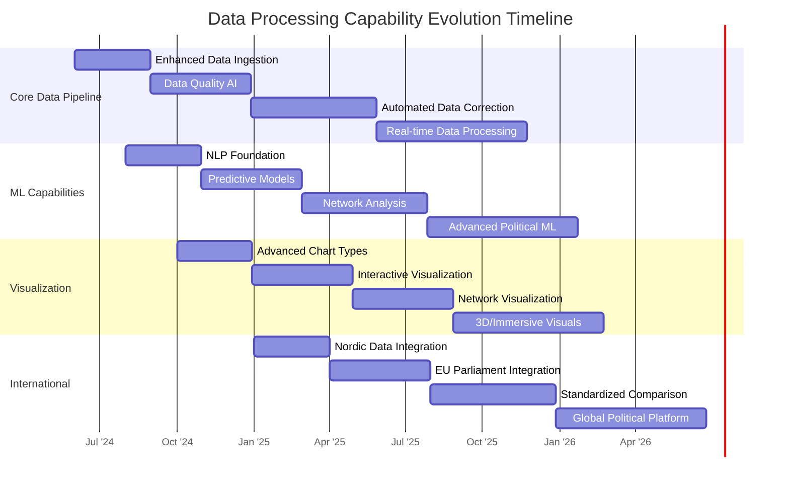

# 🔄 Future Citizen Intelligence Agency Process Flows

This document outlines the future process flows for the Citizen Intelligence Agency as it evolves into an AI-enhanced political intelligence platform. These enhanced workflows incorporate machine learning, predictive analytics, and context-aware systems to provide deeper insights into political processes.

## 📚 Related Architecture Documentation

<div class="documentation-map">

| Document                                            | Focus           | Description                               | Documentation Link                                                              |
| --------------------------------------------------- | --------------- | ----------------------------------------- | ------------------------------------------------------------------------------- |
| **[Architecture](ARCHITECTURE.md)**                 | 🏛️ Architecture | C4 model showing current system structure | [View Source](https://github.com/Hack23/cia/blob/master/ARCHITECTURE.md)         |
| **[Future Architecture](FUTURE_ARCHITECTURE.md)**   | 🏛️ Architecture | C4 model showing future system structure | [View Source](https://github.com/Hack23/cia/blob/master/FUTURE_ARCHITECTURE.md)         |
| **[Mindmaps](MINDMAP.md)**                          | 🧠 Concept      | Current system component relationships    | [View Source](https://github.com/Hack23/cia/blob/master/MINDMAP.md)             |
| **[Future Mindmaps](FUTURE_MINDMAP.md)**            | 🧠 Concept      | Future capability evolution               | [View Source](https://github.com/Hack23/cia/blob/master/FUTURE_MINDMAP.md)      |
| **[SWOT Analysis](SWOT.md)**                        | 💼 Business     | Current strategic assessment              | [View Source](https://github.com/Hack23/cia/blob/master/SWOT.md)                |
| **[Future SWOT Analysis](FUTURE_SWOT.md)**          | 💼 Business     | Future strategic opportunities            | [View Source](https://github.com/Hack23/cia/blob/master/FUTURE_SWOT.md)         |
| **[Data Model](DATA_MODEL.md)**                     | 📊 Data         | Current data structures and relationships | [View Source](https://github.com/Hack23/cia/blob/master/DATA_MODEL.md)          |
| **[Future Data Model](FUTURE_DATA_MODEL.md)**       | 📊 Data         | Enhanced political data architecture      | [View Source](https://github.com/Hack23/cia/blob/master/FUTURE_DATA_MODEL.md)   |
| **[Flowcharts](FLOWCHART.md)**                      | 🔄 Process      | Current data processing workflows         | [View Source](https://github.com/Hack23/cia/blob/master/FLOWCHART.md)           |
| **[Future Flowcharts](FUTURE_FLOWCHART.md)**        | 🔄 Process      | Enhanced AI-driven workflows              | [View Source](https://github.com/Hack23/cia/blob/master/FUTURE_FLOWCHART.md)    |
| **[State Diagrams](STATEDIAGRAM.md)**               | 🔄 Behavior     | Current system state transitions          | [View Source](https://github.com/Hack23/cia/blob/master/STATEDIAGRAM.md)        |
| **[Future State Diagrams](FUTURE_STATEDIAGRAM.md)** | 🔄 Behavior     | Enhanced adaptive state transitions       | [View Source](https://github.com/Hack23/cia/blob/master/FUTURE_STATEDIAGRAM.md) |
| **[CI/CD Workflows](WORKFLOWS.md)**                 | 🔧 DevOps       | Current automation processes              | [View Source](https://github.com/Hack23/cia/blob/master/WORKFLOWS.md)           |
| **[Future Workflows](FUTURE_WORKFLOWS.md)**         | 🔧 DevOps       | Enhanced CI/CD with ML                    | [View Source](https://github.com/Hack23/cia/blob/master/FUTURE_WORKFLOWS.md)    |
| **[End-of-Life Strategy](End-of-Life-Strategy.md)** | 📅 Lifecycle    | Maintenance and EOL planning              | [View Source](https://github.com/Hack23/cia/blob/master/End-of-Life-Strategy.md) |
| **[Financial Security Plan](FinancialSecurityPlan.md)** | 💰 Security | Cost and security implementation          | [View Source](https://github.com/Hack23/cia/blob/master/FinancialSecurityPlan.md) |
| **[CIA Features](https://hack23.com/cia-features.html)** | 🚀 Features | Platform features overview                | [View on hack23.com](https://hack23.com/cia-features.html)                     |

</div>

## 🧠 AI-Enhanced Data Processing Pipeline

**🔄 Processing Focus:** Illustrates how AI and ML will transform data processing from simple ingestion to intelligent data enrichment and pattern detection.

**📊 Data Flow Focus:** Shows the enhanced data flow with AI-powered data quality, enrichment, and analysis capabilities.



## 🔮 Predictive Political Analytics Pipeline

**🔍 Predictive Focus:** Shows how machine learning models will analyze historical political data to forecast outcomes, trends, and behaviors.

**🏛️ Political Focus:** Illustrates how predictive capabilities will enhance understanding of political processes.



## 🕸️ Political Network Analysis Process

**🔍 Relationship Focus:** Illustrates the process of analyzing and visualizing complex political relationships and influence networks.

**📊 Network Focus:** Shows how graph analysis techniques reveal hidden patterns in political interactions.

```mermaid
flowchart TD
    A[Political Entity Data] --> B[Entity Relationship Extraction]
    
    B --> C1[Parliamentary Voting Patterns]
    B --> C2[Committee Memberships]
    B --> C3[Document Co-authorship]
    B --> C4[Speech References]
    B --> C5[Official Position Relationships]
    
    C1 & C2 & C3 & C4 & C5 --> D[Network Graph Construction]
    
    D --> E1[Node Definition]
    D --> E2[Edge Weight Calculation]
    D --> E3[Temporal Relationship Analysis]
    
    E1 & E2 & E3 --> F[Graph Analysis Engine]
    
    F --> G1[Centrality Analysis]
    F --> G2[Community Detection]
    F --> G3[Influence Path Mapping]
    F --> G4[Temporal Evolution Analysis]
    
    G1 --> H1[Key Influencer Identification]
    G2 --> H2[Political Coalition Detection]
    G3 --> H3[Power Structure Mapping]
    G4 --> H4[Influence Trend Analysis]
    
    H1 & H2 & H3 & H4 --> I[Network Insight Generation]
    
    I --> J[Graph Visualization Engine]
    J --> K[Interactive Network Explorer]
    K --> L[Contextual Network Insights]
    
    classDef data fill:#bbdefb,stroke:#333,stroke-width:1px,color:black
    classDef extraction fill:#a0c8e0,stroke:#333,stroke-width:1px,color:black
    classDef relationships fill:#c8e6c9,stroke:#333,stroke-width:1px,color:black
    classDef graph fill:#d1c4e9,stroke:#333,stroke-width:1px,color:black
    classDef analysis fill:#ffecb3,stroke:#333,stroke-width:1px,color:black
    classDef insights fill:#ffccbc,stroke:#333,stroke-width:1px,color:black
    classDef visualization fill:#f9e4b7,stroke:#333,stroke-width:1px,color:black
    
    class A data
    class B extraction
    class C1,C2,C3,C4,C5 relationships
    class D,E1,E2,E3,F graph
    class G1,G2,G3,G4,H1,H2,H3,H4 analysis
    class I insights
    class J,K,L visualization
```

## 📄 Natural Language Processing for Political Documents

**📝 Document Focus:** Shows how NLP techniques will be applied to extract deeper insights from political documents and speeches.

**🔍 Content Focus:** Illustrates the workflow from raw text to semantic understanding and content analysis.



## 🌐 International Political Comparison Process

**🌍 Global Focus:** Illustrates how the platform will enable cross-country political analysis and comparison.

**🔍 Comparative Focus:** Shows the workflow for standardizing and comparing political metrics across different governmental systems.



## 👤 Personalized Political Intelligence Experience

**👥 User Focus:** Shows how the platform will deliver personalized political insights based on user interests and behavior.

**🔄 Adaptation Focus:** Illustrates the learning process that drives personalization of content and recommendations.



## 📊 Advanced Political Visualization System

**🎨 Visual Focus:** Shows the enhanced visualization capabilities that will transform complex political data into intuitive visual insights.

**👥 Interaction Focus:** Illustrates how users will interact with and explore multi-dimensional political data.



## 🚀 Political Impact Assessment Flow

**💼 Policy Focus:** Shows how the system will analyze and predict the impact of political decisions and policy changes.

**📊 Impact Focus:** Illustrates the workflow for assessing multi-dimensional impacts of political actions.



## 🔄 Platform Evolution Roadmap

This timeline outlines the strategic evolution of the CIA platform's data processing capabilities:



<div class="evolution-vision">
This evolution roadmap outlines the progressive enhancement of the Citizen Intelligence Agency's data processing and analysis capabilities. The platform will evolve from its current state to an advanced political intelligence system through a structured series of upgrades:

1. **Core Data Pipeline Enhancement**: From improved ingestion to real-time processing
2. **ML Capability Introduction**: Beginning with NLP and evolving to advanced political ML
3. **Visualization Transformation**: From enhanced charts to immersive visuals
4. **International Expansion**: From Nordic integration to global political data

This phased approach ensures continuous delivery of value while progressing toward the comprehensive AI-enhanced political intelligence vision described in the [Future Architecture](FUTURE_ARCHITECTURE.md) and [Future Mindmap](FUTURE_MINDMAP.md) documents.
</div>

## Color Legend

The color scheme used throughout these flowcharts follows a consistent pattern to enhance readability:

| Element Type              | Color                  | Description                                         |
| ------------------------- | ---------------------- | --------------------------------------------------- |
| Data Sources              | #bbdefb (Light Blue)   | Political data sources and inputs                   |
| Processing Components     | #a0c8e0 (Medium Blue)  | Data processing and transformation services         |
| Analysis & ML Components  | #c8e6c9 (Light Green)  | Analytical and machine learning processes           |
| Models & Engines          | #d1c4e9 (Light Purple) | AI models and specialized processing engines        |
| Insights & Extraction     | #ffecb3 (Light Yellow) | Insight generation and pattern detection            |
| Visualization Components  | #ffccbc (Light Coral)  | Visualization generation and rendering              |
| User Interaction          | #f9e4b7 (Light Beige)  | User interface and interaction elements             |
| Special Processing        | #ff9966 (Light Orange) | Special-purpose analysis and processing components  |
| Integration Components    | #85d6ff (Light Azure)  | Components that connect and integrate various parts |
| User-Focused Components   | #d7b4e0 (Light Violet) | Components focused on user experience               |

This consistent color scheme helps distinguish between different types of process elements while creating visual continuity across all future flowcharts.

## Related Documentation

- [Future Architecture](FUTURE_ARCHITECTURE.md) - Vision for ML-enhanced platform architecture
- [Future Mindmaps](FUTURE_MINDMAP.md) - Conceptual overview of future capabilities
- [Process Flowcharts](FLOWCHART.md) - Current data processing workflows
- [Project Documentation](https://hack23.github.io/cia/) - Comprehensive technical documentation
