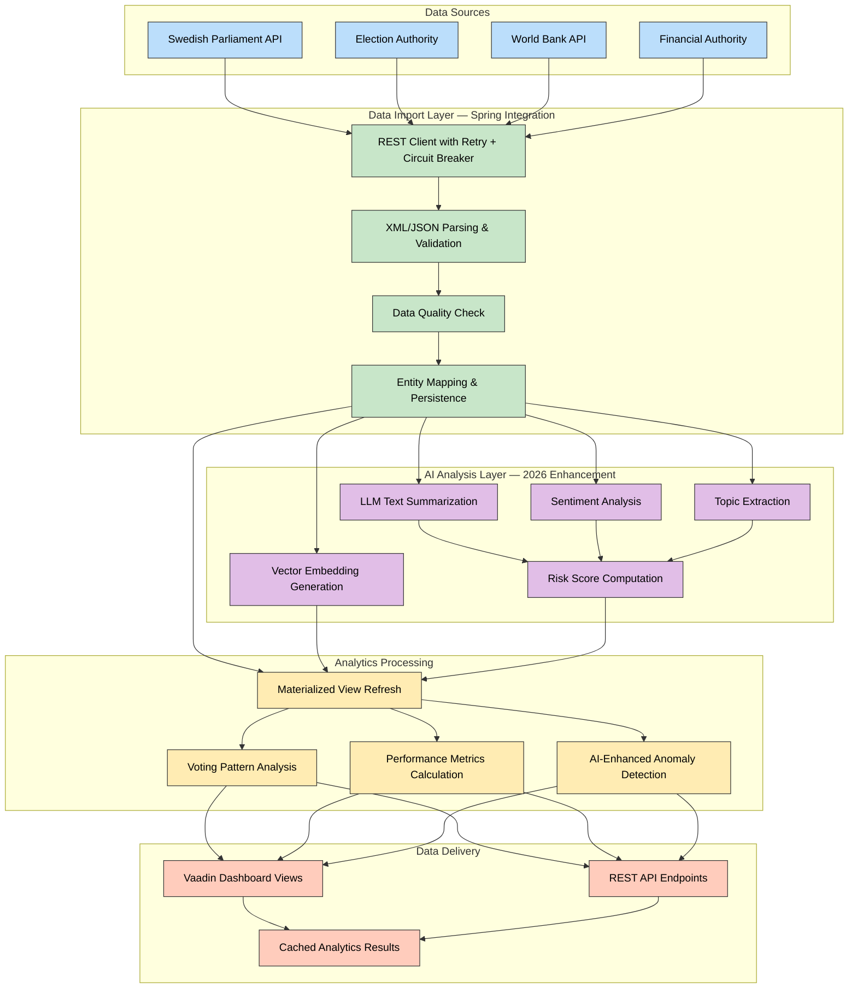
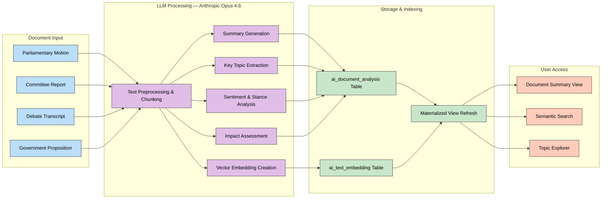
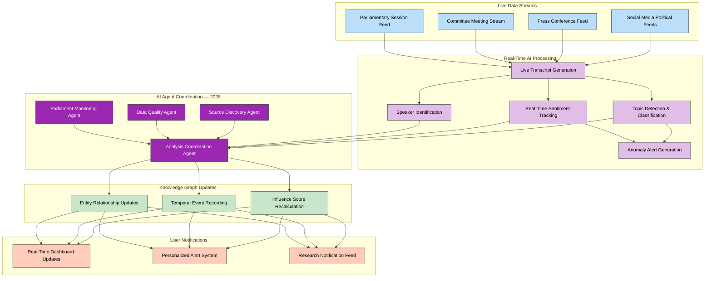
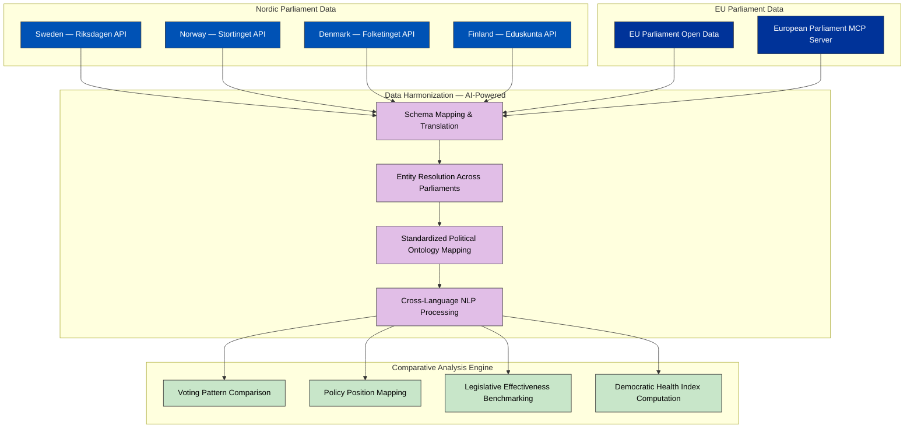
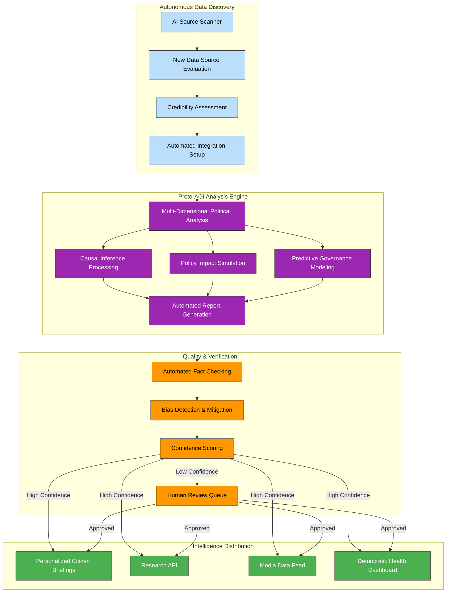
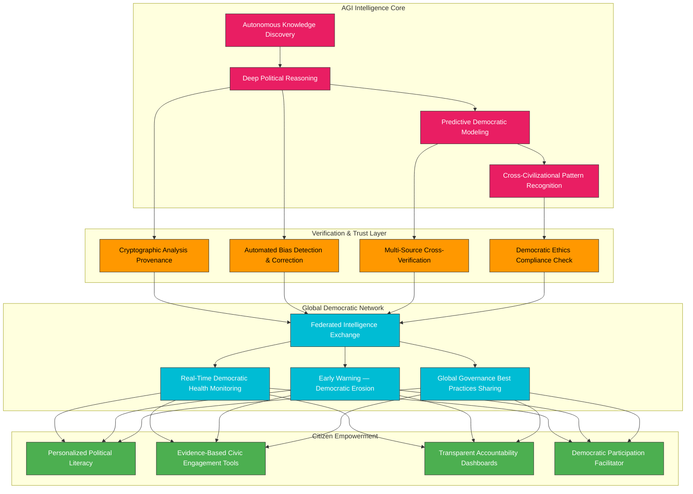

# 🔄 Future Flowchart Vision: 2026–2037 Roadmap

This document presents the future evolution of data processing and analytical workflows for the Citizen Intelligence Agency platform. The roadmap progresses from practical 2026 AI-enhanced pipelines through visionary 2037 autonomous intelligence workflows, accounting for Anthropic Opus 4.6 with minor updates every ~2.3 months, annual major LLM upgrades, competitor models, and the trajectory toward AGI.

## 📚 Related Architecture Documentation

| Document                                            | Focus           | Description                               | Documentation Link                                                              |
| --------------------------------------------------- | --------------- | ----------------------------------------- | ------------------------------------------------------------------------------- |
| **[Architecture](ARCHITECTURE.md)**                 | 🏛️ Architecture | C4 model showing current system structure | [View Source](https://github.com/Hack23/cia/blob/master/ARCHITECTURE.md)         |
| **[Future Architecture](FUTURE_ARCHITECTURE.md)**   | 🏛️ Architecture | C4 model showing future system structure | [View Source](https://github.com/Hack23/cia/blob/master/FUTURE_ARCHITECTURE.md)         |
| **[Flowcharts](FLOWCHART.md)**                      | 🔄 Process      | Current data processing workflows         | [View Source](https://github.com/Hack23/cia/blob/master/FLOWCHART.md)           |
| **[Future Flowcharts](FUTURE_FLOWCHART.md)**        | 🔄 Process      | Enhanced AI-driven workflows              | [View Source](https://github.com/Hack23/cia/blob/master/FUTURE_FLOWCHART.md)    |
| **[Data Model](DATA_MODEL.md)**                     | 📊 Data         | Current data structures and relationships | [View Source](https://github.com/Hack23/cia/blob/master/DATA_MODEL.md)          |
| **[Future Data Model](FUTURE_DATA_MODEL.md)**       | 📊 Data         | Enhanced political data architecture      | [View Source](https://github.com/Hack23/cia/blob/master/FUTURE_DATA_MODEL.md)   |
| **[End-of-Life Strategy](End-of-Life-Strategy.md)** | 📅 Lifecycle    | Maintenance and EOL planning              | [View Source](https://github.com/Hack23/cia/blob/master/End-of-Life-Strategy.md) |
| **[CIA Features](https://hack23.com/cia-features.html)** | 🚀 Features | Platform features overview                | [View on hack23.com](https://hack23.com/cia-features.html)                     |

## 🤖 AI/LLM Impact on Data Processing Workflows

| Year | AI Capability | Workflow Impact |
|------|--------------|-----------------|
| **2026** | Anthropic Opus 4.6; text analysis; embeddings | LLM-powered document summarization pipeline; AI-enhanced data quality validation |
| **2027** | Multi-modal LLMs; extended context | Video/audio transcript processing; parliamentary session real-time analysis |
| **2028** | Specialized political models; reasoning chains | Automated legislative impact assessment pipeline; AI reasoning audit trail |
| **2029** | Autonomous AI agents | Self-managing data import pipelines; AI-driven source discovery |
| **2030–2033** | Proto-AGI capabilities | Autonomous intelligence gathering; predictive pipeline orchestration |
| **2034–2037** | AGI / near-AGI | Self-evolving analytical workflows; autonomous democratic monitoring |

## 🎯 2026 Vision: AI-Enhanced Data Processing Pipeline

The 2026 workflows add AI-powered analysis stages to the existing Spring Integration data pipelines while maintaining the proven import architecture.

### AI-Enhanced Data Import & Analysis Pipeline

```mermaid
flowchart TB
    subgraph "Data Sources"
        S1[Swedish Parliament API]
        S2[Election Authority]
        S3[World Bank API]
        S4[Financial Authority]
    end

    subgraph "Data Import Layer — Spring Integration"
        I1[REST Client with Retry + Circuit Breaker]
        I2[XML/JSON Parsing & Validation]
        I3[Data Quality Check]
        I4[Entity Mapping & Persistence]
    end

    subgraph "AI Analysis Layer — 2026 Enhancement"
        A1[LLM Text Summarization]
        A2[Sentiment Analysis]
        A3[Topic Extraction]
        A4[Vector Embedding Generation]
        A5[Risk Score Computation]
    end

    subgraph "Analytics Processing"
        P1[Materialized View Refresh]
        P2[Voting Pattern Analysis]
        P3[Performance Metrics Calculation]
        P4[AI-Enhanced Anomaly Detection]
    end

    subgraph "Data Delivery"
        D1[Vaadin Dashboard Views]
        D2[REST API Endpoints]
        D3[Cached Analytics Results]
    end

    S1 & S2 & S3 & S4 --> I1
    I1 --> I2 --> I3 --> I4

    I4 --> A1 & A2 & A3 & A4
    A1 & A2 & A3 --> A5

    I4 --> P1
    A4 --> P1
    A5 --> P1
    P1 --> P2 & P3 & P4

    P2 & P3 & P4 --> D1
    P2 & P3 & P4 --> D2
    D1 & D2 --> D3

    classDef source fill:#bbdefb,stroke:#333,stroke-width:1px,color:black
    classDef import fill:#c8e6c9,stroke:#333,stroke-width:1px,color:black
    classDef ai fill:#e1bee7,stroke:#333,stroke-width:1px,color:black
    classDef analytics fill:#ffecb3,stroke:#333,stroke-width:1px,color:black
    classDef delivery fill:#ffccbc,stroke:#333,stroke-width:1px,color:black

    class S1,S2,S3,S4 source
    class I1,I2,I3,I4 import
    class A1,A2,A3,A4,A5 ai
    class P1,P2,P3,P4 analytics
    class D1,D2,D3 delivery
```

### LLM Document Analysis Flow (2026)

```mermaid
flowchart LR
    subgraph "Document Input"
        D1[Parliamentary Motion]
        D2[Committee Report]
        D3[Debate Transcript]
        D4[Government Proposition]
    end

    subgraph "LLM Processing — Anthropic Opus 4.6"
        L1[Text Preprocessing & Chunking]
        L2[Summary Generation]
        L3[Key Topic Extraction]
        L4[Sentiment & Stance Analysis]
        L5[Impact Assessment]
        L6[Vector Embedding Creation]
    end

    subgraph "Storage & Indexing"
        S1[ai_document_analysis Table]
        S2[ai_text_embedding Table]
        S3[Materialized View Refresh]
    end

    subgraph "User Access"
        U1[Document Summary View]
        U2[Semantic Search]
        U3[Topic Explorer]
    end

    D1 & D2 & D3 & D4 --> L1
    L1 --> L2 & L3 & L4 & L5
    L1 --> L6
    L2 & L3 & L4 & L5 --> S1
    L6 --> S2
    S1 & S2 --> S3
    S3 --> U1 & U2 & U3

    classDef doc fill:#bbdefb,stroke:#333,stroke-width:1px,color:black
    classDef llm fill:#e1bee7,stroke:#333,stroke-width:1px,color:black
    classDef store fill:#c8e6c9,stroke:#333,stroke-width:1px,color:black
    classDef user fill:#ffccbc,stroke:#333,stroke-width:1px,color:black

    class D1,D2,D3,D4 doc
    class L1,L2,L3,L4,L5,L6 llm
    class S1,S2,S3 store
    class U1,U2,U3 user
```

## 🔮 2027–2029 Vision: Intelligent Processing Pipelines

### Real-Time Parliamentary Monitoring Flow (2027)

```mermaid
flowchart TB
    subgraph "Live Data Streams"
        LS1[Parliamentary Session Feed]
        LS2[Committee Meeting Stream]
        LS3[Press Conference Feed]
        LS4[Social Media Political Feeds]
    end

    subgraph "Real-Time AI Processing"
        RT1[Live Transcript Generation]
        RT2[Speaker Identification]
        RT3[Real-Time Sentiment Tracking]
        RT4[Topic Detection & Classification]
        RT5[Anomaly Alert Generation]
    end

    subgraph "AI Agent Coordination — 2028"
        AG1[Parliament Monitoring Agent]
        AG2[Data Quality Agent]
        AG3[Source Discovery Agent]
        AG4[Analysis Coordination Agent]
    end

    subgraph "Knowledge Graph Updates"
        KG1[Entity Relationship Updates]
        KG2[Temporal Event Recording]
        KG3[Influence Score Recalculation]
    end

    subgraph "User Notifications"
        UN1[Real-Time Dashboard Updates]
        UN2[Personalized Alert System]
        UN3[Research Notification Feed]
    end

    LS1 & LS2 & LS3 & LS4 --> RT1
    RT1 --> RT2 & RT3 & RT4
    RT3 & RT4 --> RT5

    RT2 & RT3 & RT4 --> AG4
    AG1 --> AG4
    AG2 --> AG4
    AG3 --> AG4

    AG4 --> KG1 & KG2 & KG3

    KG1 & KG2 & KG3 --> UN1 & UN2 & UN3

    classDef stream fill:#bbdefb,stroke:#333,stroke-width:1px,color:black
    classDef realtime fill:#e1bee7,stroke:#333,stroke-width:1px,color:black
    classDef agent fill:#9C27B0,stroke:#333,stroke-width:1px,color:white
    classDef knowledge fill:#c8e6c9,stroke:#333,stroke-width:1px,color:black
    classDef notify fill:#ffccbc,stroke:#333,stroke-width:1px,color:black

    class LS1,LS2,LS3,LS4 stream
    class RT1,RT2,RT3,RT4,RT5 realtime
    class AG1,AG2,AG3,AG4 agent
    class KG1,KG2,KG3 knowledge
    class UN1,UN2,UN3 notify
```

### Cross-National Analysis Pipeline (2029)

```mermaid
flowchart TB
    subgraph "Nordic Parliament Data"
        N1[Sweden — Riksdagen API]
        N2[Norway — Stortinget API]
        N3[Denmark — Folketinget API]
        N4[Finland — Eduskunta API]
    end

    subgraph "EU Parliament Data"
        E1[EU Parliament Open Data]
        E2[European Parliament MCP Server]
    end

    subgraph "Data Harmonization — AI-Powered"
        H1[Schema Mapping & Translation]
        H2[Entity Resolution Across Parliaments]
        H3[Standardized Political Ontology Mapping]
        H4[Cross-Language NLP Processing]
    end

    subgraph "Comparative Analysis Engine"
        C1[Voting Pattern Comparison]
        C2[Policy Position Mapping]
        C3[Legislative Effectiveness Benchmarking]
        C4[Democratic Health Index Computation]
    end

    N1 & N2 & N3 & N4 --> H1
    E1 & E2 --> H1
    H1 --> H2 --> H3 --> H4
    H4 --> C1 & C2 & C3 & C4

    classDef nordic fill:#0052B5,stroke:#333,stroke-width:1px,color:white
    classDef eu fill:#003399,stroke:#333,stroke-width:1px,color:white
    classDef harmonize fill:#e1bee7,stroke:#333,stroke-width:1px,color:black
    classDef analysis fill:#c8e6c9,stroke:#333,stroke-width:1px,color:black

    class N1,N2,N3,N4 nordic
    class E1,E2 eu
    class H1,H2,H3,H4 harmonize
    class C1,C2,C3,C4 analysis
```

## 🌍 2030–2033 Vision: Autonomous Intelligence Workflows

### Autonomous Political Intelligence Pipeline (2030+)

```mermaid
flowchart TB
    subgraph "Autonomous Data Discovery"
        AD1[AI Source Scanner]
        AD2[New Data Source Evaluation]
        AD3[Credibility Assessment]
        AD4[Automated Integration Setup]
    end

    subgraph "Proto-AGI Analysis Engine"
        PA1[Multi-Dimensional Political Analysis]
        PA2[Causal Inference Processing]
        PA3[Policy Impact Simulation]
        PA4[Predictive Governance Modeling]
        PA5[Automated Report Generation]
    end

    subgraph "Quality & Verification"
        QV1[Automated Fact Checking]
        QV2[Bias Detection & Mitigation]
        QV3[Confidence Scoring]
        QV4[Human Review Queue]
    end

    subgraph "Intelligence Distribution"
        ID1[Personalized Citizen Briefings]
        ID2[Research API]
        ID3[Media Data Feed]
        ID4[Democratic Health Dashboard]
    end

    AD1 --> AD2 --> AD3 --> AD4
    AD4 --> PA1
    PA1 --> PA2 & PA3 & PA4
    PA2 & PA3 & PA4 --> PA5

    PA5 --> QV1 --> QV2 --> QV3
    QV3 -->|Low Confidence| QV4
    QV3 -->|High Confidence| ID1 & ID2 & ID3 & ID4
    QV4 -->|Approved| ID1 & ID2 & ID3 & ID4

    classDef discovery fill:#bbdefb,stroke:#333,stroke-width:1px,color:black
    classDef agi fill:#9C27B0,stroke:#333,stroke-width:1px,color:white
    classDef verify fill:#FF9800,stroke:#333,stroke-width:1px,color:black
    classDef distribute fill:#4CAF50,stroke:#333,stroke-width:1px,color:white

    class AD1,AD2,AD3,AD4 discovery
    class PA1,PA2,PA3,PA4,PA5 agi
    class QV1,QV2,QV3,QV4 verify
    class ID1,ID2,ID3,ID4 distribute
```

## 🚀 2034–2037 Visionary Horizon: Self-Evolving Intelligence Ecosystem

### AGI-Era Democratic Intelligence Flow (2034–2037)

```mermaid
flowchart TB
    subgraph "AGI Intelligence Core"
        AGI1[Autonomous Knowledge Discovery]
        AGI2[Deep Political Reasoning]
        AGI3[Predictive Democratic Modeling]
        AGI4[Cross-Civilizational Pattern Recognition]
    end

    subgraph "Verification & Trust Layer"
        VT1[Cryptographic Analysis Provenance]
        VT2[Automated Bias Detection & Correction]
        VT3[Multi-Source Cross-Verification]
        VT4[Democratic Ethics Compliance Check]
    end

    subgraph "Global Democratic Network"
        GD1[Federated Intelligence Exchange]
        GD2[Real-Time Democratic Health Monitoring]
        GD3[Early Warning — Democratic Erosion]
        GD4[Global Governance Best Practices Sharing]
    end

    subgraph "Citizen Empowerment"
        CE1[Personalized Political Literacy]
        CE2[Evidence-Based Civic Engagement Tools]
        CE3[Transparent Accountability Dashboards]
        CE4[Democratic Participation Facilitator]
    end

    AGI1 --> AGI2 --> AGI3 --> AGI4
    AGI2 --> VT1 & VT2
    AGI3 --> VT3
    AGI4 --> VT4

    VT1 & VT2 & VT3 & VT4 --> GD1
    GD1 --> GD2 & GD3 & GD4

    GD2 & GD3 & GD4 --> CE1 & CE2 & CE3 & CE4

    classDef agi fill:#E91E63,stroke:#333,stroke-width:1px,color:white
    classDef trust fill:#FF9800,stroke:#333,stroke-width:1px,color:black
    classDef global fill:#00BCD4,stroke:#333,stroke-width:1px,color:white
    classDef citizen fill:#4CAF50,stroke:#333,stroke-width:1px,color:white

    class AGI1,AGI2,AGI3,AGI4 agi
    class VT1,VT2,VT3,VT4 trust
    class GD1,GD2,GD3,GD4 global
    class CE1,CE2,CE3,CE4 citizen
```

## 📊 Workflow Evolution Timeline

```mermaid
timeline
    title CIA Workflow Evolution: 2026–2037

    section 2026 — AI-Enhanced Pipelines
      LLM document summarization pipeline : Anthropic Opus 4.6
      AI-enhanced data quality validation : Automated anomaly detection
      Vector embedding generation : Semantic search enablement
      Risk score computation pipeline : ML-enhanced Drools rules

    section 2027–2028 — Real-Time Intelligence
      Live parliamentary session monitoring : Real-time transcript analysis
      Multi-modal data processing : Video and audio political content
      AI agent-coordinated pipelines : Autonomous monitoring agents
      Cross-language NLP processing : Nordic parliament data integration

    section 2029–2030 — Autonomous Operations
      Self-managing data import pipelines : AI-driven ETL orchestration
      Cross-national data harmonization : Automated schema mapping
      Autonomous source discovery : AI credibility assessment
      Predictive pipeline orchestration : AI-anticipated data needs

    section 2031–2033 — Proto-AGI Workflows
      Causal inference processing : Policy impact analysis
      Automated intelligence report generation : AI editorial judgment
      Predictive governance modeling : Monte Carlo simulations
      Self-healing data pipelines : Autonomous error recovery

    section 2034–2037 — AGI Intelligence Ecosystem
      Autonomous knowledge discovery : AGI-powered OSINT
      Deep political reasoning workflows : Cross-civilizational analysis
      Federated intelligence exchange : Global democratic network
      Self-evolving analytical workflows : Continuous methodology improvement
```

## AI Provider Considerations for Workflow Design

| Design Principle | Rationale |
|-----------------|-----------|
| **Provider-Agnostic LLM Interface** | Abstract LLM calls behind a service interface to swap providers (Anthropic, OpenAI, open-source) as capabilities evolve every ~2.3 months |
| **Graceful Degradation** | All AI-enhanced pipelines must function without AI when LLM services are unavailable; AI adds value but isn't a hard dependency |
| **Model Version Tracking** | Every AI-generated result records the model name, version, and provider for reproducibility and audit |
| **Batch vs. Real-Time Separation** | Separate batch analysis (document summarization) from real-time analysis (live session monitoring) for cost and latency optimization |
| **Human-in-the-Loop Checkpoints** | Critical analyses require human verification before publication, especially for risk scores and anomaly alerts |
| **Cost Management** | Monitor LLM API costs per pipeline; implement smart caching and result reuse to control expenses as usage scales |

## Related Documentation

- [Current Flowcharts](FLOWCHART.md) — Review current data processing workflows
- [Current Architecture](ARCHITECTURE.md) — System architecture context
- [Future Architecture](FUTURE_ARCHITECTURE.md) — Platform evolution roadmap
- [Future Data Model](FUTURE_DATA_MODEL.md) — Enhanced data structures
- [End-of-Life Strategy](End-of-Life-Strategy.md) — Technology maintenance planning
- [CIA Features](https://hack23.com/cia-features.html) — Current feature showcase
