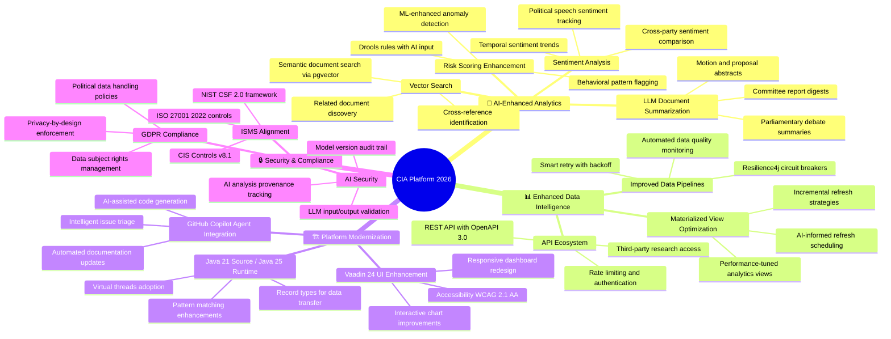
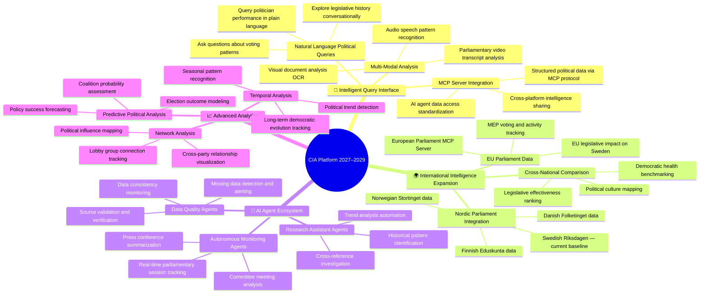
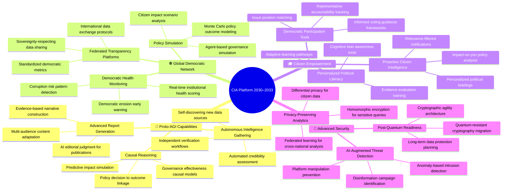
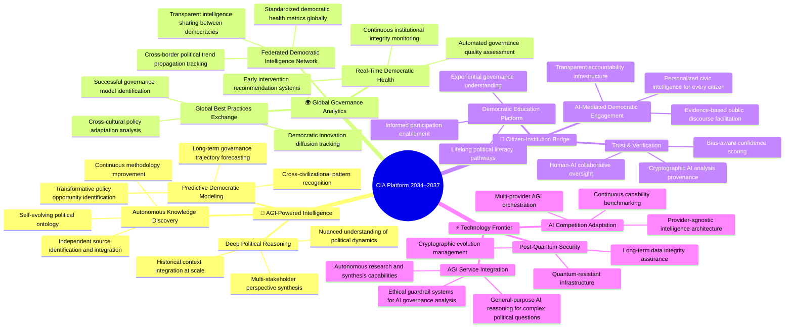
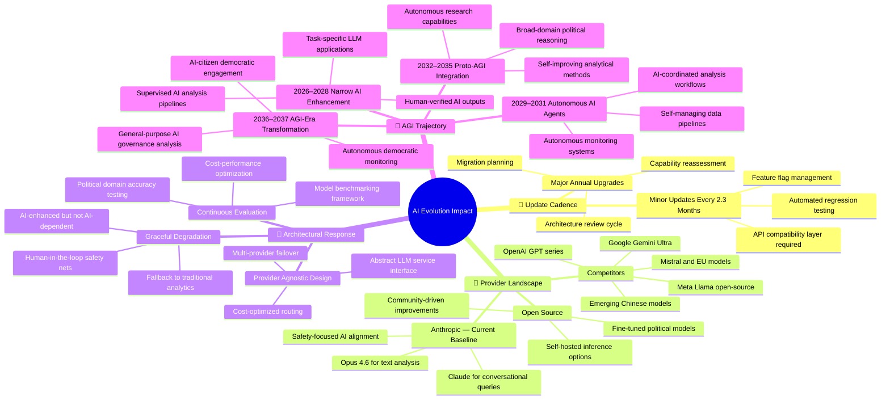

# 🧠 Future Mindmap Vision: 2026–2037 Roadmap

This document maps the conceptual evolution of the Citizen Intelligence Agency platform capabilities from practical 2026 enhancements through visionary 2037 transformations. The roadmap accounts for rapid AI/LLM advancement—currently leveraging Anthropic Opus 4.6 with minor updates every ~2.3 months and major version upgrades annually—while anticipating competitor models, emergent AI architectures, and the trajectory toward AGI.

## 📚 Related Architecture Documentation

| Document                                            | Focus           | Description                               | Documentation Link                                                              |
| --------------------------------------------------- | --------------- | ----------------------------------------- | ------------------------------------------------------------------------------- |
| **[Architecture](ARCHITECTURE.md)**                 | 🏛️ Architecture | C4 model showing current system structure | [View Source](https://github.com/Hack23/cia/blob/master/ARCHITECTURE.md)         |
| **[Future Architecture](FUTURE_ARCHITECTURE.md)**   | 🏛️ Architecture | C4 model showing future system structure | [View Source](https://github.com/Hack23/cia/blob/master/FUTURE_ARCHITECTURE.md)         |
| **[Mindmaps](MINDMAP.md)**                          | 🧠 Concept      | Current system component relationships    | [View Source](https://github.com/Hack23/cia/blob/master/MINDMAP.md)             |
| **[Future Mindmaps](FUTURE_MINDMAP.md)**            | 🧠 Concept      | Future capability evolution               | [View Source](https://github.com/Hack23/cia/blob/master/FUTURE_MINDMAP.md)      |
| **[SWOT Analysis](SWOT.md)**                        | 💼 Business     | Current strategic assessment              | [View Source](https://github.com/Hack23/cia/blob/master/SWOT.md)                |
| **[Future SWOT Analysis](FUTURE_SWOT.md)**          | 💼 Business     | Future strategic opportunities            | [View Source](https://github.com/Hack23/cia/blob/master/FUTURE_SWOT.md)         |
| **[Data Model](DATA_MODEL.md)**                     | 📊 Data         | Current data structures and relationships | [View Source](https://github.com/Hack23/cia/blob/master/DATA_MODEL.md)          |
| **[Future Data Model](FUTURE_DATA_MODEL.md)**       | 📊 Data         | Enhanced political data architecture      | [View Source](https://github.com/Hack23/cia/blob/master/FUTURE_DATA_MODEL.md)   |
| **[End-of-Life Strategy](End-of-Life-Strategy.md)** | 📅 Lifecycle    | Maintenance and EOL planning              | [View Source](https://github.com/Hack23/cia/blob/master/End-of-Life-Strategy.md) |
| **[CIA Features](https://hack23.com/cia-features.html)** | 🚀 Features | Platform features overview                | [View on hack23.com](https://hack23.com/cia-features.html)                     |

## 🎯 2026 Vision: AI-Enhanced Capability Map

```mermaid
mindmap
  root((CIA Platform 2026))
    🤖 AI-Enhanced Analytics
      LLM Document Summarization
        Parliamentary debate summaries
        Motion and proposal abstracts
        Committee report digests
      Sentiment Analysis
        Political speech sentiment tracking
        Cross-party sentiment comparison
        Temporal sentiment trends
      Risk Scoring Enhancement
        ML-enhanced anomaly detection
        Drools rules with AI input
        Behavioral pattern flagging
      Vector Search
        Semantic document search via pgvector
        Related document discovery
        Cross-reference identification
    📊 Enhanced Data Intelligence
      Improved Data Pipelines
        Resilience4j circuit breakers
        Automated data quality monitoring
        Smart retry with backoff
      Materialized View Optimization
        AI-informed refresh scheduling
        Performance-tuned analytics views
        Incremental refresh strategies
      API Ecosystem
        REST API with OpenAPI 3.0
        Rate limiting and authentication
        Third-party research access
    🏗️ Platform Modernization
      Java 21 Source / Java 25 Runtime
        Virtual threads adoption
        Pattern matching enhancements
        Record types for data transfer
      Vaadin 24 UI Enhancement
        Accessibility WCAG 2.1 AA
        Responsive dashboard redesign
        Interactive chart improvements
      GitHub Copilot Agent Integration
        AI-assisted code generation
        Automated documentation updates
        Intelligent issue triage
    🔒 Security & Compliance
      ISMS Alignment
        ISO 27001 2022 controls
        NIST CSF 2.0 framework
        CIS Controls v8.1
      AI Security
        LLM input/output validation
        Model version audit trail
        AI analysis provenance tracking
      GDPR Compliance
        Political data handling policies
        Data subject rights management
        Privacy-by-design enforcement
```

## 🔮 2027–2029 Vision: Intelligent Analytics Platform

```mermaid
mindmap
  root((CIA Platform 2027–2029))
    🧠 Intelligent Query Interface
      Natural Language Political Queries
        Ask questions about voting patterns
        Query politician performance in plain language
        Explore legislative history conversationally
      Multi-Modal Analysis
        Parliamentary video transcript analysis
        Audio speech pattern recognition
        Visual document analysis OCR
      MCP Server Integration
        Structured political data via MCP protocol
        AI agent data access standardization
        Cross-platform intelligence sharing
    🌍 International Intelligence Expansion
      Nordic Parliament Integration
        Swedish Riksdagen — current baseline
        Norwegian Stortinget data
        Danish Folketinget data
        Finnish Eduskunta data
      EU Parliament Data
        European Parliament MCP Server
        MEP voting and activity tracking
        EU legislative impact on Sweden
      Cross-National Comparison
        Democratic health benchmarking
        Legislative effectiveness ranking
        Political culture mapping
    🤖 AI Agent Ecosystem
      Autonomous Monitoring Agents
        Real-time parliamentary session tracking
        Committee meeting analysis
        Press conference summarization
      Data Quality Agents
        Source validation and verification
        Data consistency monitoring
        Missing data detection and alerting
      Research Assistant Agents
        Historical pattern identification
        Trend analysis automation
        Cross-reference investigation
    📈 Advanced Analytics
      Predictive Political Analysis
        Election outcome modeling
        Coalition probability assessment
        Policy success forecasting
      Network Analysis
        Political influence mapping
        Cross-party relationship visualization
        Lobby group connection tracking
      Temporal Analysis
        Political trend detection
        Seasonal pattern recognition
        Long-term democratic evolution tracking
```

## 🌍 2030–2033 Vision: Autonomous Political Intelligence

```mermaid
mindmap
  root((CIA Platform 2030–2033))
    🧪 Proto-AGI Capabilities
      Autonomous Intelligence Gathering
        Self-discovering new data sources
        Automated credibility assessment
        Independent verification workflows
      Causal Reasoning
        Policy decision to outcome linkage
        Governance effectiveness causal models
        Predictive impact simulation
      Advanced Report Generation
        AI editorial judgment for publications
        Multi-audience content adaptation
        Evidence-based narrative construction
    🌐 Global Democratic Network
      Federated Transparency Platforms
        International data exchange protocols
        Sovereignty-respecting data sharing
        Standardized democratic metrics
      Democratic Health Monitoring
        Real-time institutional health scoring
        Democratic erosion early warning
        Corruption risk pattern detection
      Policy Simulation
        Monte Carlo policy outcome modeling
        Agent-based governance simulation
        Citizen impact scenario analysis
    🎓 Citizen Empowerment
      Personalized Political Literacy
        Adaptive learning pathways
        Cognitive bias awareness tools
        Evidence evaluation training
      Proactive Citizen Intelligence
        Personalized political briefings
        Relevance-filtered notifications
        Impact-on-you policy analysis
      Democratic Participation Tools
        Informed voting guidance frameworks
        Issue position matching
        Representative accountability tracking
    🔐 Advanced Security
      AI-Augmented Threat Detection
        Anomaly-based intrusion detection
        Disinformation campaign identification
        Platform manipulation prevention
      Privacy-Preserving Analytics
        Differential privacy for citizen data
        Federated learning for cross-national analysis
        Homomorphic encryption for sensitive queries
      Post-Quantum Readiness
        Quantum-resistant cryptography migration
        Long-term data protection planning
        Cryptographic agility architecture
```

## 🚀 2034–2037 Visionary Horizon: Democratic Intelligence Ecosystem

```mermaid
mindmap
  root((CIA Platform 2034–2037))
    🌟 AGI-Powered Intelligence
      Deep Political Reasoning
        Nuanced understanding of political dynamics
        Multi-stakeholder perspective synthesis
        Historical context integration at scale
      Autonomous Knowledge Discovery
        Self-evolving political ontology
        Independent source identification and integration
        Continuous methodology improvement
      Predictive Democratic Modeling
        Long-term governance trajectory forecasting
        Cross-civilizational pattern recognition
        Transformative policy opportunity identification
    🌍 Global Governance Analytics
      Federated Democratic Intelligence Network
        Transparent intelligence sharing between democracies
        Standardized democratic health metrics globally
        Cross-border political trend propagation tracking
      Real-Time Democratic Health
        Continuous institutional integrity monitoring
        Automated governance quality assessment
        Early intervention recommendation systems
      Global Best Practices Exchange
        Successful governance model identification
        Cross-cultural policy adaptation analysis
        Democratic innovation diffusion tracking
    🤝 Citizen-Institution Bridge
      AI-Mediated Democratic Engagement
        Personalized civic intelligence for every citizen
        Transparent accountability infrastructure
        Evidence-based public discourse facilitation
      Trust & Verification
        Cryptographic AI analysis provenance
        Bias-aware confidence scoring
        Human-AI collaborative oversight
      Democratic Education Platform
        Lifelong political literacy pathways
        Experiential governance understanding
        Informed participation enablement
    ⚡ Technology Frontier
      AGI Service Integration
        General-purpose AI reasoning for complex political questions
        Autonomous research and synthesis capabilities
        Ethical guardrail systems for AI governance analysis
      Post-Quantum Security
        Quantum-resistant infrastructure
        Long-term data integrity assurance
        Cryptographic evolution management
      AI Competition Adaptation
        Multi-provider AGI orchestration
        Continuous capability benchmarking
        Provider-agnostic intelligence architecture
```

## 📊 Capability Evolution Matrix

| Capability Domain | 2026 | 2028 | 2030 | 2033 | 2037 |
|-------------------|------|------|------|------|------|
| **Data Analysis** | LLM-powered summarization and sentiment | Multi-modal analysis with reasoning chains | Causal inference and policy simulation | Autonomous intelligence gathering | AGI-level political reasoning |
| **User Interaction** | Enhanced dashboards + REST API | Natural language queries + MCP | Personalized briefings + proactive alerts | AI-mediated engagement | Personalized civic intelligence |
| **Data Sources** | Swedish parliament + economic data | Nordic parliaments + EU | Global democratic data federation | Autonomous source discovery | Self-evolving knowledge base |
| **AI Integration** | Anthropic Opus 4.6 API calls | Multi-provider LLM layer + agents | Specialized political AI models | Proto-AGI integration | Full AGI services |
| **Security** | Spring Security + AWS + ISMS | Zero-trust + AI threat detection | Privacy-preserving analytics | Post-quantum readiness | AGI-managed security |
| **Development** | GitHub Copilot agents | AI-enhanced CI/CD + testing | Autonomous code generation | Self-healing systems | AGI-managed development |

## 🤖 AI/LLM Evolution Impact Map

```mermaid
mindmap
  root((AI Evolution Impact))
    📅 Update Cadence
      Minor Updates Every 2.3 Months
        API compatibility layer required
        Automated regression testing
        Feature flag management
      Major Annual Upgrades
        Architecture review cycle
        Capability reassessment
        Migration planning
    🏢 Provider Landscape
      Anthropic — Current Baseline
        Opus 4.6 for text analysis
        Claude for conversational queries
        Safety-focused AI alignment
      Competitors
        OpenAI GPT series
        Google Gemini Ultra
        Meta Llama open-source
        Mistral and EU models
        Emerging Chinese models
      Open Source
        Self-hosted inference options
        Fine-tuned political models
        Community-driven improvements
    🔄 Architectural Response
      Provider Agnostic Design
        Abstract LLM service interface
        Multi-provider failover
        Cost-optimized routing
      Graceful Degradation
        AI-enhanced but not AI-dependent
        Fallback to traditional analytics
        Human-in-the-loop safety nets
      Continuous Evaluation
        Model benchmarking framework
        Political domain accuracy testing
        Cost-performance optimization
    🚀 AGI Trajectory
      2026–2028 Narrow AI Enhancement
        Task-specific LLM applications
        Supervised AI analysis pipelines
        Human-verified AI outputs
      2029–2031 Autonomous AI Agents
        Self-managing data pipelines
        Autonomous monitoring systems
        AI-coordinated analysis workflows
      2032–2035 Proto-AGI Integration
        Broad-domain political reasoning
        Autonomous research capabilities
        Self-improving analytical methods
      2036–2037 AGI-Era Transformation
        General-purpose AI governance analysis
        Autonomous democratic monitoring
        AI-citizen democratic engagement
```

## 🌈 Long-Term Vision Statement

The Citizen Intelligence Agency's capability evolution follows a clear progression driven by AI advancement:

1. **2026: Augment** — Add AI-powered analysis to the proven platform, enhancing human understanding of political data
2. **2027–2029: Intelligentize** — Transform the platform into an intelligent analytics system with natural language interaction, autonomous monitoring, and international reach
3. **2030–2033: Autonomize** — Enable increasingly autonomous intelligence gathering, analysis, and reporting with human oversight and quality assurance
4. **2034–2037: Democratize** — Evolve into essential democratic infrastructure providing personalized political intelligence to every citizen globally

The AI evolution assumption—Anthropic Opus 4.6 as baseline, minor updates every ~2.3 months, major upgrades annually, with competitors and eventual AGI—means the platform must be fundamentally **adaptive**, **provider-agnostic**, and **human-centered**, ensuring technology serves democratic values regardless of which AI systems prove most capable.

## Related Documentation

- [Current Mindmaps](MINDMAP.md) — Review current system component relationships
- [Current Architecture](ARCHITECTURE.md) — System architecture context
- [Future Architecture](FUTURE_ARCHITECTURE.md) — Platform evolution roadmap
- [Future Data Model](FUTURE_DATA_MODEL.md) — Enhanced data structures
- [End-of-Life Strategy](End-of-Life-Strategy.md) — Technology maintenance planning
- [CIA Features](https://hack23.com/cia-features.html) — Current feature showcase
