# 🧠 Citizen Intelligence Agency Future Architecture Mindmap

This document outlines the future vision and architecture evolution for the Citizen Intelligence Agency, focusing on enhanced analytics capabilities, integration of AI/ML technologies, and expanded political data coverage. This vision builds upon the [current architecture](ARCHITECTURE.md) and [existing capabilities](MINDMAP.md).

## 📚 Related Architecture Documentation

<div class="documentation-map">

| Document                                            | Focus           | Description                               | Documentation Link                                                              |
| --------------------------------------------------- | --------------- | ----------------------------------------- | ------------------------------------------------------------------------------- |
| **[Current Architecture](ARCHITECTURE.md)**         | 🏛️ Architecture | C4 model showing current system structure | [View in Portal](https://hack23.github.io/cia/architecture.html)                |
| **[Future Architecture](FUTURE_ARCHITECTURE.md)**   | 🏛️ Architecture | Vision for ML-enhanced platform           | [View in Portal](https://hack23.github.io/cia/future-architecture.html)         |
| **[State Diagrams](STATEDIAGRAM.md)**               | 🔄 Behavior     | Current system state transitions          | [View in Portal](https://hack23.github.io/cia/statediagram.html)               |
| **[Future State Diagrams](FUTURE_STATEDIAGRAM.md)** | 🔄 Behavior     | Enhanced adaptive state transitions       | [View in Portal](https://hack23.github.io/cia/future-statediagram.html)        |
| **[Process Flowcharts](FLOWCHART.md)**              | 🔄 Process      | Current data processing workflows         | [View in Portal](https://hack23.github.io/cia/flowchart.html)                  |
| **[Future Flowcharts](FUTURE_FLOWCHART.md)**        | 🔄 Process      | Enhanced AI-driven workflows              | [View in Portal](https://hack23.github.io/cia/future-flowchart.html)           |
| **[Mindmaps](MINDMAP.md)**                          | 🧠 Concept      | Current system component relationships    | [View in Portal](https://hack23.github.io/cia/mindmap.html)                    |
| **[SWOT Analysis](SWOT.md)**                        | 💼 Business     | Current strategic assessment              | [View in Portal](https://hack23.github.io/cia/swot.html)                       |
| **[Future SWOT Analysis](FUTURE_SWOT.md)**          | 💼 Business     | Future strategic opportunities            | [View in Portal](https://hack23.github.io/cia/future-swot.html)                |
| **[CI/CD Workflows](WORKFLOWS.md)**                 | 🔧 DevOps       | Current automation processes              | [View in Portal](https://hack23.github.io/cia/workflows.html)                  |
| **[Future Workflows](FUTURE_WORKFLOWS.md)**         | 🔧 DevOps       | Enhanced CI/CD with ML                    | [View in Portal](https://hack23.github.io/cia/future-workflows.html)           |
| **[Future Data Model](FUTURE_DATA_MODEL.md)**       | 📊 Data         | Enhanced political data architecture      | [View in Portal](https://hack23.github.io/cia/future-data-model.html)          |
| **[End-of-Life Strategy](End-of-Life-Strategy.md)** | 📅 Lifecycle    | Maintenance and EOL planning              | [View in Portal](https://hack23.github.io/cia/end-of-life-strategy.html)       |
| **[Financial Security Plan](FinancialSecurityPlan.md)** | 💰 Security | Cost and security implementation          | [View in Portal](https://hack23.github.io/cia/financial-security-plan.html)    |
| **[CIA Features](https://hack23.com/cia-features.html)** | 🚀 Features | Platform features overview                | [View on hack23.com](https://hack23.com/cia-features.html)                     |

</div>

## 🚀 Evolution Vision Overview

This mindmap presents the future evolution of the CIA platform, building upon the [current features](https://hack23.com/cia-features.html) and [existing architecture](ARCHITECTURE.md). Visit the [project documentation](https://hack23.github.io/cia/) for additional technical details.

```mermaid
mindmap
  root((Future CIA<br/>Platform))
    🧠 AI-Enhanced Analytics
      🔮 Predictive Political Analysis
        Voting pattern prediction
        Legislative outcome forecasting
        Political trend projection
        Policy impact simulation
      🔍 Advanced Entity Analysis
        Political network visualization
        Influence relationship mapping
        Cross-entity correlation detection
        Hidden pattern discovery
      📊 Natural Language Processing
        Automated document classification
        Sentiment analysis on political statements
        Topic modeling and clustering
        Intent recognition in proposals
      👓 Computer Vision Integration
        Parliamentary session video analysis
        Speaker recognition and tracking
        Body language and engagement metrics
        Visual presence analytics
    📈 Enhanced Visualization
      🌐 Interactive Network Graphs
        Dynamic relationship mapping
        Interactive filtering and exploration
        Temporal evolution visualization
        Influence flow diagrams
      🎨 Immersive Data Experiences
        3D data visualization options
        AR/VR data exploration interfaces
        Mobile-optimized interactive dashboards
        Personalized data viewports
      🗺️ Geographic Data Integration
        Electoral district visualization
        Regional policy impact mapping
        Geo-political trend analysis
        Constituency-level insights
      📊 Real-time Data Streaming
        Live parliamentary session analytics
        Real-time voting visualizations
        Dynamic scorecard updates
        Event-triggered alerts and highlights
    🔌 Expanded Data Integration
      🌍 International Politics Integration
        EU Parliament data integration
        Nordic countries political comparison
        Global democracy index correlation
        International policy impact analysis
      📰 Media & Public Opinion
        News coverage integration and analysis
        Social media sentiment correlation
        Public opinion poll aggregation
        Media bias and coverage analysis
      🏙️ Regional & Local Government
        Municipal government data integration
        Regional policy implementation tracking
        Local-national policy alignment analysis
        Multi-level governance visualization
      🔬 Academic & Research Integration
        Political science research integration
        Academic analysis incorporation
        Citation and reference tracking
        Research-based metric development
    🤖 Platform Modernization
      🌩️ Cloud-Native Architecture
        Containerized microservices
        Kubernetes orchestration
        Serverless functions for analytics
        Event-driven architecture
      📱 Progressive Web Application
        Cross-platform responsive design
        Offline capabilities
        Push notifications for alerts
        Mobile-first user experience
      🔄 Real-time Processing
        Event streaming architecture
        Real-time analytics processing
        WebSocket communication
        Push-based data updates
      🔐 Enhanced Security Framework
        Zero-trust security model
        Advanced threat protection
        Privacy-preserving analytics
        GDPR-compliant data handling
    💡 User Experience Revolution
      🎯 Personalized Political Insights
        User interest-based dashboards
        Personal watchlist for entities
        Custom alert configurations
        User-specific data views
      🧩 Insights-as-a-Service
        API-driven political data platform
        Embeddable widgets and visualizations
        Integration with research platforms
        Data export in multiple formats
      🌟 Gamification Elements
        Political literacy challenges
        Citizen engagement incentives
        Knowledge-building pathways
        Community contribution recognition
      🔎 Guided Analytics Journeys
        Contextual storytelling with data
        Guided exploration paths
        Educational political data tours
        Issue-based analytical workflows
```



## 🎯 AI-Enhanced Political Analysis Architecture

**🧠 AI Focus:** Shows how machine learning and AI will enhance political data analysis. This represents an evolution from the [current data analysis capabilities](MINDMAP.md#-political-data-ecosystem).

**📊 Analytics Focus:** Demonstrates how advanced analytics will provide deeper political insights. For current implementations, see the [Entity Model](https://hack23.github.io/cia/service.data.impl/hbm2doc/entities/index.html).


## 🧠 Machine Learning Component Architecture

**🤖 ML Focus:** Illustrates the machine learning components that will enhance political data analysis and visualization. This builds upon the [current technical stack](README.md#project-technology-stack-overview).

**🔧 Technical Focus:** Shows the technical implementation of ML models within the system. See the [End-of-Life Strategy](End-of-Life-Strategy.md) for considerations regarding the current technology lifecycle.

```mermaid
mindmap
  root((ML-Enhanced<br/>Components))
    🔮 Predictive Analytics
      Voting Behavior Models
        Individual politician prediction
        Party-line voting forecasting
        Coalition behavior modeling
        Decision outcome probability
      Legislative Trend Analysis
        Bill passage prediction
        Committee recommendation forecasting
        Amendment success probability
        Procedural timing estimation
      Political Career Trajectories
        Leadership position prediction
        Committee assignment forecasting
        Political influence projection
        Career longevity estimation
      Election Outcome Modeling
        Party performance prediction
        Regional voting pattern forecasting
        Demographic voting analysis
        Swing district identification
    🔍 Pattern Detection
      Political Network Analysis
        Influence network mapping
        Voting bloc identification
        Cross-party collaboration patterns
        Committee relationship mapping
      Anomaly Detection
        Unusual voting patterns
        Statistical outlier identification
        Behavior change detection
        Inconsistency highlighting
      Temporal Pattern Recognition
        Seasonal political activity patterns
        Election cycle behavior changes
        Long-term policy evolution
        Career-stage behavior analysis
      Cross-Entity Correlations
        Party-committee relationship mapping
        Ministry-committee influence analysis
        Document-voting correlation
        Speech-action consistency measurement
    📊 Natural Language Processing
      Document Classification
        Automated topic categorization
        Policy area classification
        Priority level assessment
        Complexity analysis
      Sentiment Analysis
        Speech sentiment extraction
        Document tone assessment
        Debate intensity measurement
        Partisan language detection
      Content Summarization
        Automated document summarization
        Key point extraction
        Legislative intent distillation
        Simplified citizen-friendly versions
      Semantic Search Enhancement
        Context-aware political search
        Entity relationship search
        Intent-based query processing
        Similar document discovery
    📈 Political Impact Assessment
      Policy Implementation Tracking
        Promise-to-implementation tracking
        Legislative effectiveness scoring
        Implementation timeline modeling
        Impact measurement frameworks
      Public Opinion Correlation
        Policy-opinion alignment analysis
        Representation accuracy assessment
        Constituency alignment scoring
        Media coverage influence measurement
      Budget Impact Analysis
        Spending effectiveness modeling
        Budget allocation optimization
        Financial impact forecasting
        Value-for-money assessment
      Political Performance Indicators
        Enhanced politician scoring models
        Multi-dimensional performance metrics
        Context-aware benchmarking
        Constituent value assessment
```



## 🔌 Integration Ecosystem Vision

**🔄 Integration Focus:** Shows the comprehensive ecosystem of external systems and data sources that will connect with the future CIA platform. This expands upon the [current data integration flow](MINDMAP.md#-data-integration-flow).

**🏛️ Political Focus:** Illustrates how the platform will integrate with multiple political ecosystems. For current political entity tracking, see [CIA Features](https://hack23.com/cia-features.html).

```mermaid
mindmap
  root((Future<br/>Integration<br/>Ecosystem))
    🌐 International Political Data
      European Union
        EU Parliament data
        Commission decisions
        EU Council votes
        Directive implementation tracking
      Nordic Countries
        Comparative political systems
        Cross-border policy analysis
        Regional cooperation metrics
        Similar political structures
      Global Democracy Indices
        Freedom House metrics
        Democracy index scores
        Governance indicators
        Transparency measurements
      United Nations
        SDG implementation tracking
        UN voting patterns
        International treaty compliance
        Global policy frameworks
    📰 Media & Public Opinion
      News Media Analytics
        Political coverage analysis
        Media focus tracking
        Topic prominence measurement
        Frame analysis
      Social Media Integration
        Political discussion monitoring
        Hashtag and trend analysis
        Engagement metrics
        Influence measurement
      Public Opinion Research
        Poll aggregation and analysis
        Survey data integration
        Opinion-policy alignment
        Public sentiment tracking
      Academic Research
        Political science paper integration
        Research finding correlation
        Citation and impact metrics
        Evidence-based policy assessment
    🏙️ Multi-level Governance
      Regional Government
        County-level administration
        Regional development policies
        Infrastructure project tracking
        Regional budget allocation
      Municipal Government
        Local council decisions
        Municipal policy implementation
        Local budget tracking
        Community impact assessment
      Public Sector Agencies
        Agency performance metrics
        Public service delivery KPIs
        Administrative efficiency
        Public sector innovation
      Public-Private Partnerships
        Project tracking and monitoring
        Value-for-money assessment
        Accountability frameworks
        Impact measurement
    📊 Advanced Analytics Platforms
      Open-Source Intelligence
        OSINT platform integration
        Multi-source data fusion
        Signal detection algorithms
        Pattern recognition tools
      Business Intelligence
        BI dashboard integration
        Custom analytics exports
        Report generation APIs
        Data visualization interoperability
      Research Platforms
        Academic research integration
        DataCite/DOI correlation
        Research paper linkage
        Evidence citation tracking
      Citizen Science Platforms
        Crowdsourced data collection
        Community monitoring initiatives
        Participatory sensing networks
        Citizen-generated insights
```



## 🔍 Future Political Analysis Capabilities Matrix

The table below shows how different future analytical capabilities will enhance political transparency and accountability. These capabilities build upon the [current political analysis features](MINDMAP.md#-key-political-analysis-features).

| Capability                        | Political Value                                       | Technical Implementation                             | Citizen Benefit                                       |
|-----------------------------------|------------------------------------------------------|------------------------------------------------------|------------------------------------------------------|
| 🔮 Predictive Voting Analysis     | Forecast political decisions before formal votes      | ML models trained on historical voting patterns      | Advance notice of likely political outcomes           |
| 🌐 Political Network Mapping      | Visualize hidden relationships and power structures   | Graph analysis algorithms and influence modeling     | Transparent view of political power dynamics          |
| 📊 Policy Impact Simulation       | Project outcomes of proposed legislation              | Bayesian causal modeling and scenario simulation     | Better understanding of policy consequences           |
| 🔍 Anomaly Detection              | Identify unusual political behavior and outliers      | Statistical modeling and pattern deviation detection | Early warning of political shifts or corruption       |
| 📑 Advanced Document Analysis     | Extract meaning and relationships from political text | NLP, topic modeling, and semantic analysis           | Simplified access to complex political documents      |
| 📊 Multi-dimensional Performance  | Holistic assessment of political effectiveness        | Composite scoring with contextual weighting          | Comprehensive politician and party evaluation         |
| 🌍 Comparative Political Analysis | Benchmark Swedish politics against other democracies  | Standardized metrics and cross-country comparison    | Global context for Swedish democratic performance     |
| 📱 Personalized Political Alerts  | Custom notifications on topics of citizen interest    | User preference modeling and event detection         | Stay informed on personally relevant political events |

## 🔄 Future Data Processing Architecture

This diagram shows the flow of data processing in the future CIA architecture. For details on security implementation, see the [Financial Security Plan](FinancialSecurityPlan.md).


## 🔮 Future Evolution Roadmap

This timeline outlines the strategic evolution of the platform. For considerations regarding the current technology stack, see the [End-of-Life Strategy](End-of-Life-Strategy.md).

```mermaid
timeline
    title Citizen Intelligence Agency Evolution Roadmap
    section Phase 1: Enhanced Data Integration
        Q3 2024 : Expanded political data sources
                : International comparative data
                : Media coverage integration
    section Phase 2: Advanced Analytics
        Q1 2025 : Natural language processing for documents
                : Political network analysis
                : Pattern detection algorithms
    section Phase 3: Machine Learning Capabilities
        Q3 2025 : Predictive voting models
                : Anomaly detection systems
                : Personalized political insights
    section Phase 4: Platform Modernization
        Q1 2026 : Microservices architecture
                : Real-time data processing
                : Mobile-first responsive design
    section Phase 5: Democratized Political Intelligence
        Q3 2026 : API platform for researchers
                : Embeddable political widgets
                : Citizen engagement features
```

<div class="evolution-phases">
This evolution roadmap outlines the progressive enhancement of the Citizen Intelligence Agency from its current state to a comprehensive political intelligence platform with advanced AI capabilities. Each phase builds upon the previous one, gradually introducing more sophisticated analytics and visualization capabilities while maintaining the core mission of political transparency.

The transition will emphasize continual enhancement of political data accessibility and insights, with each phase providing meaningful improvements to citizen understanding of political processes. This approach ensures that all stakeholders can benefit from enhanced capabilities throughout the evolution process.

For more information about the current platform features, visit the [CIA Features page](https://hack23.com/cia-features.html) or explore the [project documentation](https://hack23.github.io/cia/).
</div>

## Related Documentation

- [Current Architecture](ARCHITECTURE.md) - Review the current system structure
- [Current Mindmaps](MINDMAP.md) - Explore existing system component relationships
- [Project README](README.md) - Get an overview of the Citizen Intelligence Agency project
- [End-of-Life Strategy](End-of-Life-Strategy.md) - Understand technology maintenance plans
- [Financial Security Plan](FinancialSecurityPlan.md) - Review AWS security implementations
- [CIA Features](https://hack23.com/cia-features.html) - See detailed features with screenshots
