<p align="center">
  
</p>

<h1 align="center">🚀 Citizen Intelligence Agency — Future Security Architecture</h1>

<p align="center">
  <strong>🔮 Advanced Security Capabilities Roadmap</strong><br>
  <em>🎯 Zero Trust, AI-Augmented, and Quantum-Resistant Security Vision</em>
</p>

<p align="center">
  <a href="#"></a>
  <a href="#"></a>
  <a href="#"></a>
  <a href="#"></a>
</p>

**📋 Document Owner:** CEO | **📄 Version:** 1.0 | **📅 Last Updated:** 2025-09-18 (UTC)  
**🔄 Review Cycle:** Quarterly | **⏰ Next Review:** 2025-12-18

---

## 🎯 Purpose

This document outlines the future security architecture vision for the Citizen Intelligence Agency platform, describing advanced security capabilities leveraging cutting-edge AWS security services, zero trust principles, and AI-driven security operations to protect political intelligence data.

## 📚 Table of Contents

- [Executive Overview](#-executive-overview)
- [Security Architecture Framework](#-security-architecture-framework)
- [AWS Well-Architected Framework Integration](#-aws-well-architected-framework-integration)
- [Network & DNS Security](#-network--dns-security)
  - [Route 53 DNS Firewall](#route-53-dns-firewall)
  - [VPC IP Address Management (IPAM)](#vpc-ip-address-management-ipam)
  - [AWS Network Firewall](#aws-network-firewall)
- [Identity & Access Security](#-identity--access-security)
  - [AWS Verified Access](#aws-verified-access)
  - [Zero Trust Implementation](#zero-trust-implementation)
  - [IAM Identity Center Integration](#iam-identity-center-integration)
- [Data & Secrets Protection](#-data--secrets-protection)
  - [AWS KMS & Quantum-Resistant Cryptography](#aws-kms--quantum-resistant-cryptography)
  - [Secrets Manager Enhanced Rotation](#secrets-manager-enhanced-rotation)
  - [Data Loss Prevention](#data-loss-prevention)
- [Compliance & Governance](#-compliance--governance)
  - [AWS Audit Manager](#aws-audit-manager)
  - [Security Hub Integration](#security-hub-integration)
  - [Automated Compliance Controls](#automated-compliance-controls)
- [AI-Augmented Security](#-ai-augmented-security)
  - [AWS Bedrock for Security](#aws-bedrock-for-security)
  - [Security Lake Integration](#security-lake-integration)
  - [Intelligent Threat Detection](#intelligent-threat-detection)
- [Security Operations](#-security-operations)
  - [Security Intelligence Platform](#security-intelligence-platform)
  - [Automated Incident Response](#automated-incident-response)
  - [Security Metrics & Reporting](#security-metrics--reporting)
- [Conclusion](#-conclusion)

## 🔍 Executive Overview

The Citizen Intelligence Agency has implemented a comprehensive security architecture that leverages advanced AWS security services, zero trust principles, and AI-driven security operations. This vision document describes our current security posture and capabilities that protect the platform's sensitive political data and analytics.

Our security architecture is built around six core pillars that work together to provide defense-in-depth protection:

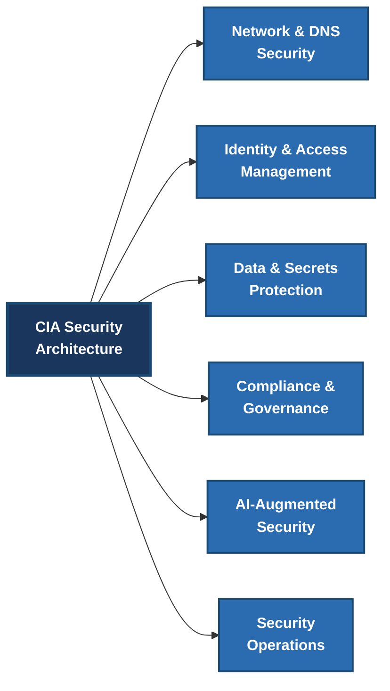

## 🏗️ Security Architecture Framework

Our security architecture implements defense-in-depth through multiple coordinated layers of security controls:

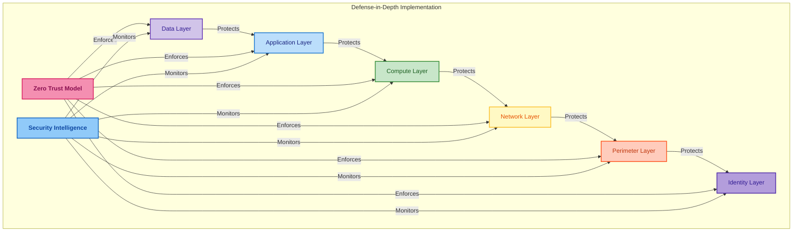

## 🏛️ AWS Well-Architected Framework Integration

Our security architecture is fully aligned with the AWS Well-Architected Framework, with security controls implemented across all six pillars:

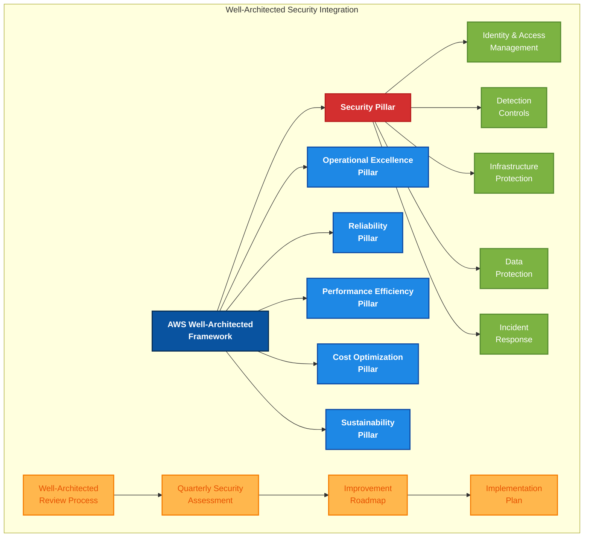

### Well-Architected Implementation

We maintain a rigorous Well-Architected review process focused on security excellence:

1. **Security Pillar Excellence**
   - 🔒 **SEC 1:** How do you securely operate your workload?
     - *Implementation:* Comprehensive IAM policies with least privilege, MFA, and centralized logging
   - 🔒 **SEC 2:** How do you manage identities for people and machines?
     - *Implementation:* AWS IAM Identity Center with attribute-based access control and temporary credentials
   - 🔒 **SEC 3:** How do you manage permissions for people and machines?
     - *Implementation:* Granular permission sets with JIT access and service control policies
   - 🔒 **SEC 4:** How do you detect and investigate security events?
     - *Implementation:* Security Lake with Bedrock-powered analytics and automated incident response
   - 🔒 **SEC 5:** How do you protect your network resources?
     - *Implementation:* Multi-layered defense with DNS Firewall, Network Firewall, and micro-segmentation
   - 🔒 **SEC 6:** How do you protect your compute resources?
     - *Implementation:* Immutable infrastructure, runtime protection, and automated patching
   - 🔒 **SEC 7:** How do you classify your data?
     - *Implementation:* Political data classification system with automated discovery and tagging
   - 🔒 **SEC 8:** How do you protect your data at rest?
     - *Implementation:* KMS encryption with quantum-resistant algorithms for sensitive political data
   - 🔒 **SEC 9:** How do you protect your data in transit?
     - *Implementation:* TLS 1.3 enforcement with certificate monitoring and rotation
   - 🔒 **SEC 10:** How do you anticipate, respond to, and recover from incidents?
     - *Implementation:* Automated incident playbooks with ML-enhanced investigation capabilities

2. **Cross-Pillar Security Integration**
   - 🔄 **Operational Excellence:** Security automation pipelines with immutable infrastructure
   - ⚡ **Reliability:** Security controls designed for high availability and fault tolerance
   - 🚀 **Performance Efficiency:** Security services optimized for minimal performance impact
   - 💰 **Cost Optimization:** Security controls with efficient resource utilization
   - 🌱 **Sustainability:** Energy-efficient security architecture minimizing carbon footprint

3. **Well-Architected Review Process**
   - 📋 **Quarterly Assessment:** Regular evaluation against Well-Architected Framework
   - 📈 **Continuous Improvement:** Prioritized roadmap for security enhancements
   - 📊 **Workload Review:** Detailed analysis of each security component
   - 🔍 **Security Findings:** Tracked and remediated via Security Hub

## 🌐 Network & DNS Security

Our multi-layered network security strategy forms the foundation of our defense system, protecting our infrastructure from the edge to the core.

### Route 53 DNS Firewall

Route 53 DNS Firewall provides DNS-level protection against data exfiltration attempts and connections to malicious domains:

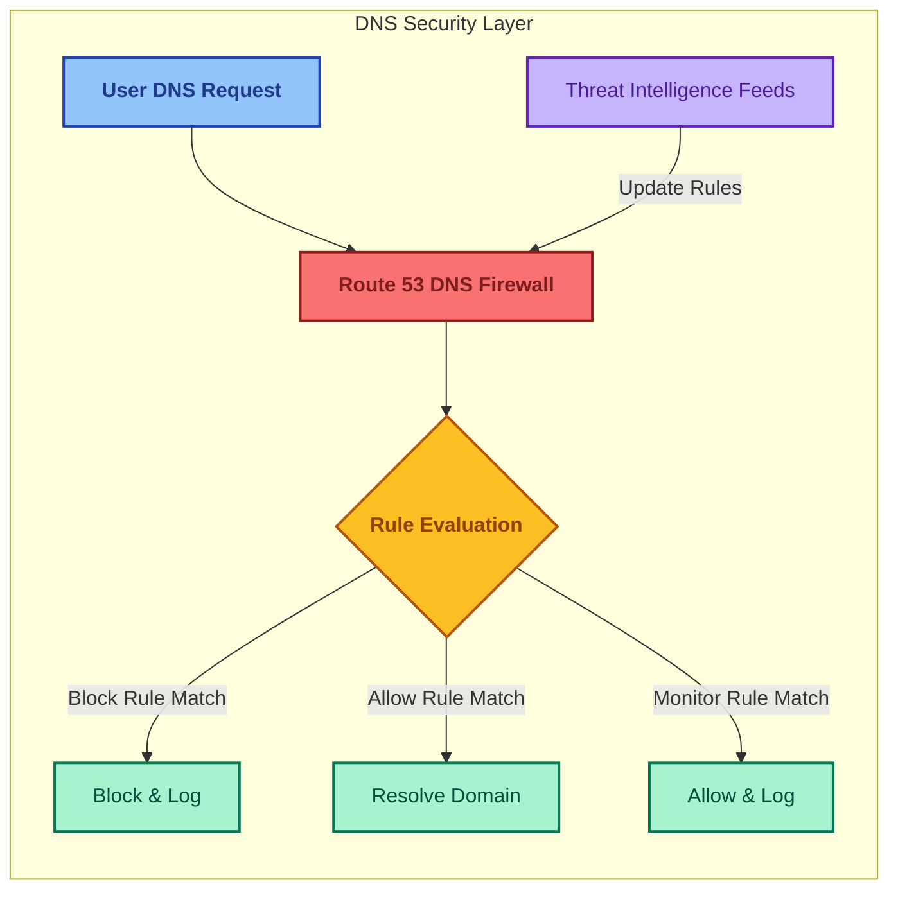

#### Key DNS Firewall Implementation

- 🔒 **Advanced Rule Groups**: Custom rules blocking malicious domains and DNS tunneling techniques
- 🔄 **Threat Intelligence Integration**: Real-time updates from threat feeds focused on political security
- 🔍 **DNS Analytics Pipeline**: Integration with Security Lake for advanced pattern analysis
- 🛡️ **Domain Protection**: Custom rules protecting Swedish political domain infrastructure
- 📊 **Monitoring Dashboard**: Real-time visualization of DNS security metrics

### VPC IP Address Management (IPAM)

Our VPC IPAM implementation provides centralized management of IP address allocation across our multi-account environment:

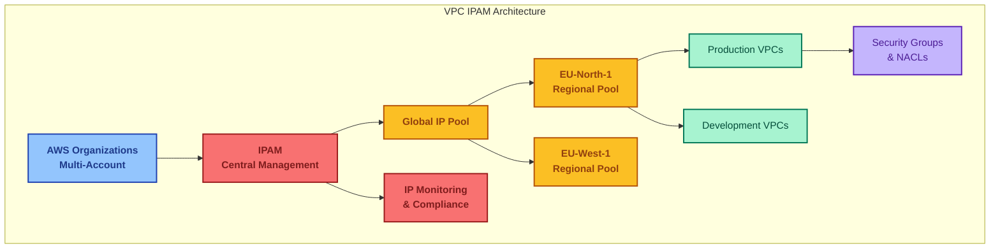

#### IPAM Security Benefits

- 📊 **IP Security Observability**: Complete visibility into all network resources
- 🔍 **Security Boundary Enforcement**: IP allocation aligned with security zones
- 🚫 **Overlap Prevention**: Automatic detection of security-risky CIDR overlaps
- 🔄 **Resource Tagging**: Enhanced tracking for security and compliance
- 🌐 **Centralized Management**: Single pane of glass for all network addresses

### AWS Network Firewall

Our AWS Network Firewall implementation provides advanced traffic inspection and filtering:

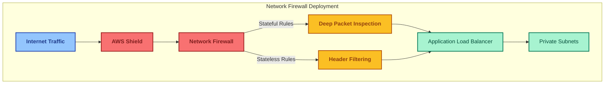

#### Network Firewall Capabilities

- 🔍 **Advanced Protocol Analysis**: Inspects traffic for politically-targeted attacks
- 🛡️ **Suricata Rules Integration**: Custom rule sets for Swedish political context
- 🌐 **Centralized Deployment**: Protection across all application environments
- 📊 **Traffic Intelligence**: Behavioral analysis of network patterns
- 🔄 **Security Lake Integration**: Real-time logging for advanced analytics

## 🔐 Identity & Access Security

Our identity-centric security model implements zero trust principles where identity becomes the primary security perimeter.

### AWS Verified Access

AWS Verified Access provides context-aware access decisions without requiring a VPN:

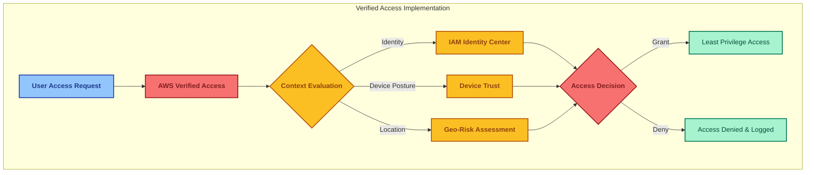

#### Verified Access Implementation

- 🔑 **Contextual Access Control**: Access decisions based on comprehensive context
- 🛡️ **Continuous Verification**: Ongoing evaluation throughout user sessions
- 📱 **Device Trust Integration**: Verification of device security posture
- 🌐 **Location Intelligence**: Risk-based filtering for geolocation context
- 🔄 **Real-time Adaptation**: Dynamic permission adjustments based on risk

### Zero Trust Implementation

Our zero trust architecture eliminates implicit trust and continuously validates every access request:

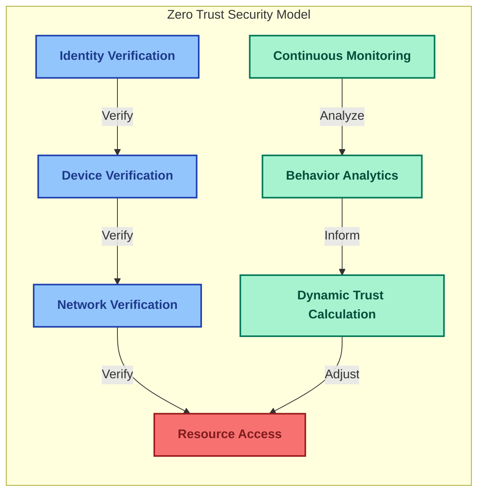

#### Zero Trust Key Components

- 🔒 **Identity as Primary Perimeter**: All access decisions start with identity verification
- 🚫 **Least Privilege Enforcement**: Minimal access rights by default
- 🔍 **Micro-Segmentation**: Fine-grained isolation for sensitive political data
- 🔄 **Just-in-Time Access**: Temporary, purpose-based permission grants
- 🛡️ **Explicit Trust Verification**: All trust is earned through verification

### IAM Identity Center Integration

Our IAM Identity Center implementation provides centralized identity governance:

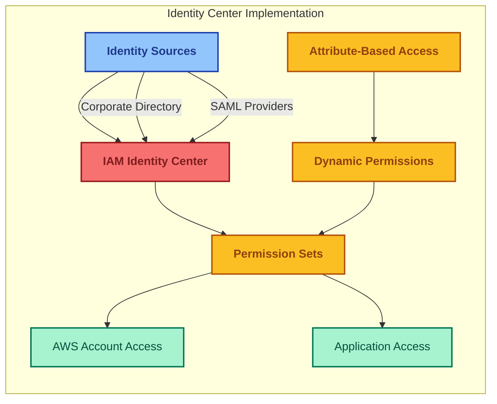

#### Identity Center Features

- 🔑 **Single Sign-On**: Unified authentication across AWS accounts and applications
- 👤 **Advanced User Management**: Centralized control of user lifecycle
- 🔒 **Fine-grained Permissions**: Precise access control based on job functions
- 🔄 **Attribute-Based Access Control**: Dynamic permissions based on user attributes
- 📊 **Access Reporting**: Comprehensive visibility into identity access patterns

## 💾 Data & Secrets Protection

Our data protection strategy ensures that sensitive political information is secured throughout its lifecycle.

### AWS KMS & Quantum-Resistant Cryptography

Our encryption strategy leverages AWS KMS with quantum-resistant algorithms:

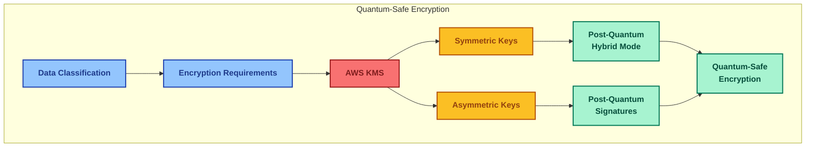

#### Quantum-Resistant Implementation

- 🔍 **Risk-Based Encryption**: Strongest protection for political analysis data
- 🔄 **Cryptographic Agility**: Framework for algorithm transitions
- 🔐 **Hybrid Approach**: Combining classical and post-quantum algorithms
- 🗝️ **Automated Key Rotation**: Scheduled rotation of encryption keys
- 🛡️ **Long-term Protection**: Securing data against future quantum threats

### Secrets Manager Enhanced Rotation

Our secrets management strategy automates credential rotation with zero downtime:

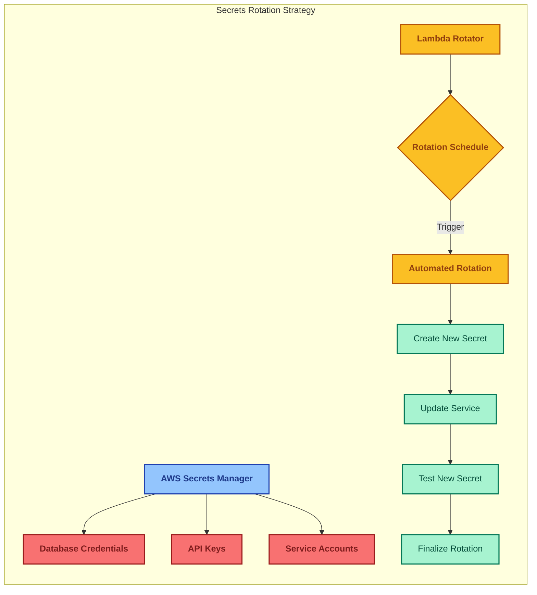

#### Secrets Management Features

- 🔄 **Automated Rotation**: Continuous cycling of sensitive credentials
- 🔒 **Secure Distribution**: Just-in-time delivery of secrets to services
- 📝 **Comprehensive Audit**: Complete history of secret access and changes
- 🔐 **Encryption by Default**: KMS integration for key-level protection
- 🔗 **Service Integration**: Native integration with RDS, Lambda, and other services

### Data Loss Prevention

Our DLP strategy prevents unauthorized exfiltration of sensitive political data:

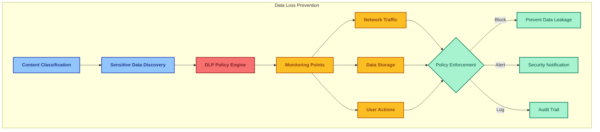

#### DLP Implementation

- 🔍 **Political Data Classification**: Identification of sensitive political information
- 🚫 **Exfiltration Prevention**: Blocking unauthorized data transfers
- 📊 **User Behavior Monitoring**: Tracking access to sensitive data
- 🔄 **Continuous Scanning**: Real-time analysis of data movements
- 📝 **Comprehensive Logging**: Complete audit trail of data access

## 📋 Compliance & Governance

Our compliance framework ensures adherence to regulatory requirements while enabling business agility.

### AWS Audit Manager

AWS Audit Manager automates evidence collection and compliance reporting:

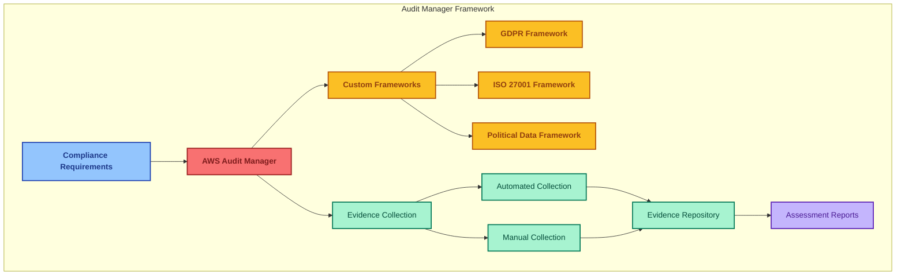

#### Custom Political Data Framework

Our custom AWS Audit Manager framework includes specialized controls for political data:

1. **Political Data Governance**
   - PD.1: Political data classification policy
   - PD.2: Political data handling procedures
   - PD.3: Political data access review
   - PD.4: Political data retention controls

2. **Political Source Protection**
   - PS.1: Anonymous source protection mechanisms
   - PS.2: Source identity segregation
   - PS.3: Source metadata protection

3. **Political Analysis Controls**
   - PA.1: Analysis methodology documentation
   - PA.2: Analysis bias prevention
   - PA.3: Analysis conclusions validation
   - PA.4: Political influence safeguards

4. **Political Data Publication**
   - PP.1: Pre-publication security review
   - PP.2: Attribution verification
   - PP.3: Public interest assessment
   - PP.4: Data de-identification validation

### Security Hub Integration

Security Hub provides a comprehensive view of our security posture:

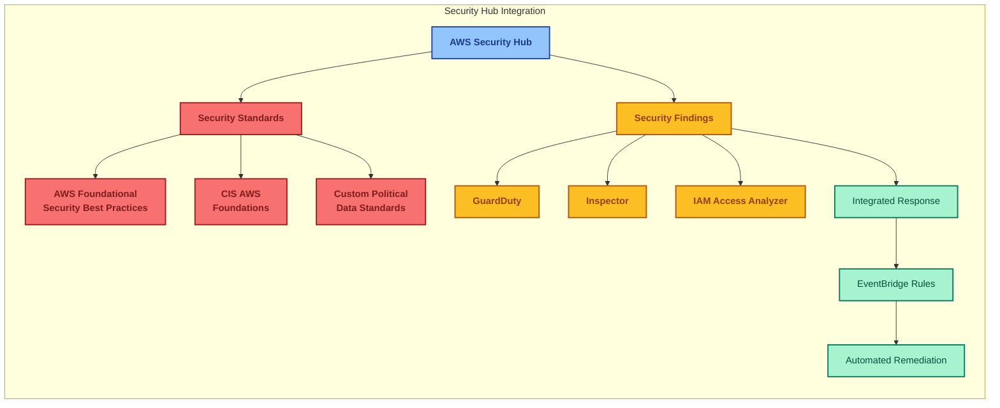

#### Security Hub Capabilities

- 📊 **Centralized Dashboard**: Single pane of glass for security posture
- 🔍 **Automated Checks**: Continuous evaluation against security standards
- 🔄 **Finding Aggregation**: Consolidated view of security issues
- 🚨 **Prioritized Alerts**: Risk-based ranking of security findings
- 🤖 **Automated Remediation**: Event-driven response to security findings

### Automated Compliance Controls

Our automated compliance controls ensure continuous adherence to requirements:

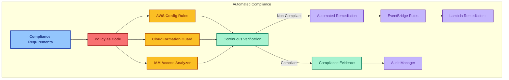

#### Automated Controls Features

- 🔄 **Continuous Compliance**: Real-time evaluation of security posture
- 📝 **Policy as Code**: Infrastructure and security policies defined as code
- 🤖 **Automated Remediation**: Self-healing for compliance violations
- 📊 **Compliance Metrics**: Real-time visibility into compliance status
- 📋 **Evidence Collection**: Automated gathering of compliance evidence

## 🧠 AI-Augmented Security

Our AI-augmented security capabilities leverage machine learning to enhance threat detection and response.

### AWS Bedrock for Security

AWS Bedrock provides AI capabilities for security analysis:

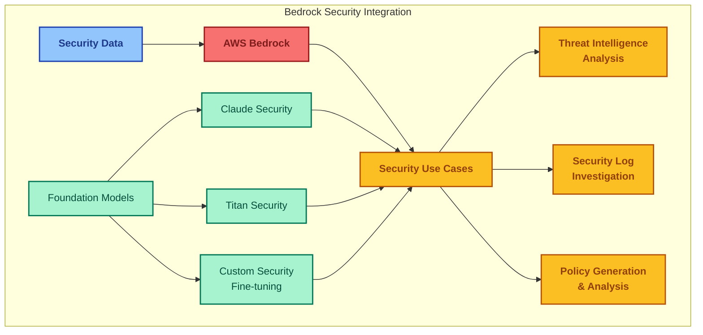

#### Bedrock Security Features

- 🧠 **Political Context Understanding**: Models fine-tuned for political security domain
- 🔍 **Pattern Recognition**: Identification of novel political threats
- 📝 **Natural Language Security**: Security policy analysis and generation
- 🔄 **Continuous Learning**: Adaptation to evolving political threats
- 🤖 **Security Assistant**: AI-powered support for security analysts

### Security Lake Integration

Security Lake provides a foundation for AI-driven security analytics:

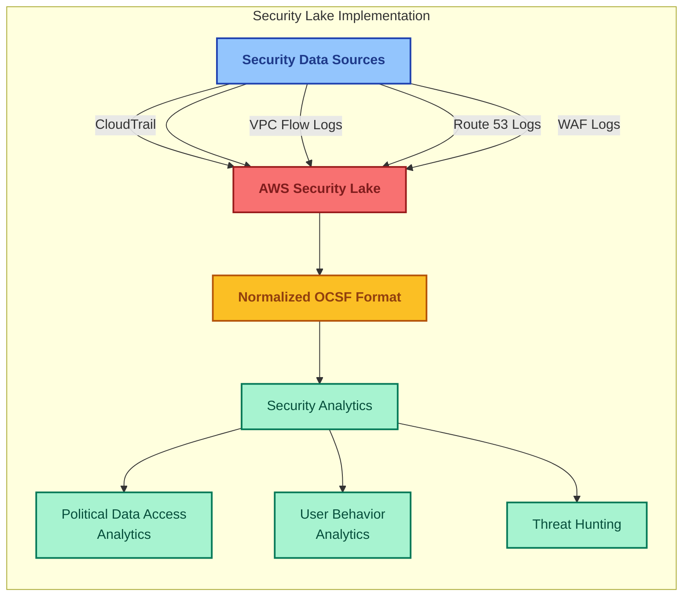

#### Security Lake Implementation

- 📊 **Centralized Security Data**: Single repository for all security telemetry
- 🔄 **OCSF Standardization**: Normalized data for consistent analysis
- 🔍 **Advanced Query Capabilities**: Complex security pattern detection
- 📈 **Historical Analysis**: Long-term storage for trend analysis
- 🔗 **Partner Integrations**: Connections to specialized security tools

### Intelligent Threat Detection

Our AI-driven threat detection capabilities identify sophisticated attacks:

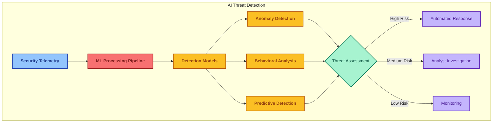

#### AI Threat Detection Features

- 🧠 **Political Context Awareness**: Understanding of political data value and risks
- 🔍 **Advanced Pattern Recognition**: Identification of sophisticated attack patterns
- 📊 **Behavioral Baselines**: Modeling of normal user interactions with political data
- 🚨 **Early Warning System**: Proactive detection of emerging threats
- 🔄 **Adaptive Learning**: Continuous improvement from new threat data

## 🚨 Security Operations

Our security operations center provides continuous monitoring, detection, and response capabilities.

### Security Intelligence Platform

Our Security Intelligence Platform integrates telemetry from multiple sources:

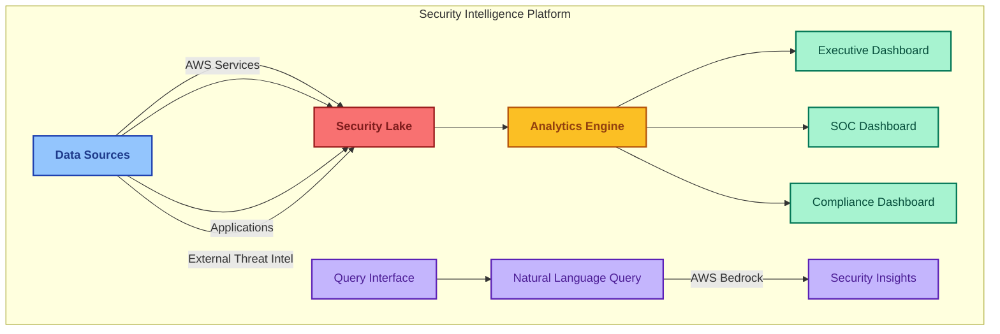

#### Intelligence Platform Features

- 📊 **Role-Based Dashboards**: Customized views for different stakeholders
- 🔍 **Advanced Visualization**: Interactive exploration of security data
- 📈 **Trend Analysis**: Historical patterns and emerging threats
- 🗣️ **Natural Language Interface**: Accessible security insights through conversational queries
- 🔄 **Real-time Updates**: Live monitoring of security posture

### Automated Incident Response

Our automated incident response system accelerates threat mitigation:

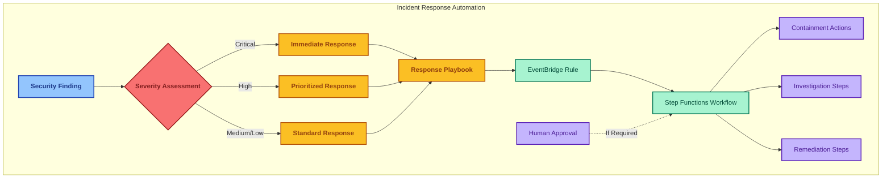

#### Incident Response Features

- 🚨 **Automated Triage**: Risk-based prioritization of security incidents
- 🤖 **Orchestrated Response**: Pre-defined playbooks for common threats
- 🔄 **Human-in-the-Loop**: Approval workflows for critical actions
- 📝 **Comprehensive Documentation**: Automatic incident documentation
- 📊 **Response Metrics**: Tracking of mean time to detection and resolution

### Security Metrics & Reporting

Our security metrics framework provides insights into security effectiveness:

```mermaid
flowchart LR
    subgraph "Security Metrics Framework"
        A[Data Collection] --> B[Security Metrics]
        
        B --> C[Operational Metrics]
        C --> D[Mean Time to Detect]
        C --> E[Mean Time to Respond]
        
        B --> F[Risk Metrics]
        F --> G[Vulnerability Exposure]
        F --> H[Threat Landscape]
        
        B --> I[Compliance Metrics]
        I --> J[Control Effectiveness]
        I --> K[Audit Findings]
        
        L[Executive Reporting] --> M[Security Posture Score]
    end
    
    %% Styling
    classDef data fill:#93c5fd,stroke:#1e40af,stroke-width:2px,color:#1e3a8a,font-weight:bold
    classDef metrics fill:#f87171,stroke:#991b1b,stroke-width:2px,color:#7f1d1d,font-weight:bold
    classDef ops fill:#fbbf24,stroke:#b45309,stroke-width:2px,color:#92400e,font-weight:bold
    classDef risk fill:#a7f3d0,stroke:#047857,stroke-width:2px,color:#064e3b
    classDef comply fill:#c4b5fd,stroke:#5b21b6,stroke-width:2px,color:#4c1d95
    classDef exec fill:#e9d5ff,stroke:#7e22ce,stroke-width:2px,color:#581c87
    
    class A data
    class B metrics
    class C,D,E ops
    class F,G,H risk
    class I,J,K comply
    class L,M exec
```

#### Security Metrics Implementation

- 📊 **KPI Dashboard**: Real-time view of security key performance indicators
- 📈 **Trend Visualization**: Security posture evolution over time
- 🎯 **Benchmarking**: Comparison against industry security standards
- 📝 **Automated Reporting**: Scheduled security posture reports
- 💼 **Business Context**: Security metrics aligned with political intelligence objectives

## 📝 Conclusion

The Citizen Intelligence Agency's advanced security architecture leverages the latest AWS security services, zero trust principles, and AI capabilities to protect sensitive political intelligence data. Our comprehensive approach addresses security across all layers—from network protection with Route 53 DNS Firewall and AWS Network Firewall to identity-centric security with AWS Verified Access and IAM Identity Center.

By implementing AI-augmented security through AWS Bedrock and Security Lake, we've created an intelligent security ecosystem capable of detecting and responding to sophisticated threats targeting political data. Our quantum-resistant cryptography strategy ensures long-term protection of sensitive information, while our automated compliance framework with AWS Audit Manager provides continuous assurance of our security posture.

Our security architecture is fully aligned with the AWS Well-Architected Framework, integrating security best practices across all six pillars and maintaining rigorous quarterly reviews to ensure continuous improvement. This holistic approach not only protects our political intelligence platform but also enables reliability, operational excellence, performance efficiency, cost optimization, and sustainability.

This security architecture will continue to evolve in response to emerging threats and AWS service innovations, maintaining our position at the forefront of political intelligence security.

---

## 📚 Related Documents

- [🛡️ Security Architecture](SECURITY_ARCHITECTURE.md) - Current security implementation
- [🎯 Threat Model](THREAT_MODEL.md) - STRIDE/MITRE ATT&CK threat analysis
- [💰 Financial Security Plan](FinancialSecurityPlan.md) - Security investment and costs
- [📅 End-of-Life Strategy](End-of-Life-Strategy.md) - Technology lifecycle management
- [⚡ CI/CD Workflows](WORKFLOWS.md) - Security automation and DevSecOps
- [🔐 ISMS Compliance Mapping](ISMS_COMPLIANCE_MAPPING.md) - ISMS policy framework

---

**📋 Document Control:**  
**✅ Approved by:** James Pether Sörling, CEO - Hack23 AB  
**📤 Distribution:** Public  
**🏷️ Classification:** [](https://github.com/Hack23/ISMS-PUBLIC/blob/main/CLASSIFICATION.md#confidentiality-levels)  
**📅 Effective Date:** 2025-09-18  
**⏰ Next Review:** 2025-12-18  
**🎯 Framework Compliance:** [](https://github.com/Hack23/ISMS-PUBLIC/blob/main/CLASSIFICATION.md) [](https://github.com/Hack23/ISMS-PUBLIC/blob/main/CLASSIFICATION.md) [](https://github.com/Hack23/ISMS-PUBLIC/blob/main/CLASSIFICATION.md) [](https://github.com/Hack23/ISMS-PUBLIC/blob/main/CLASSIFICATION.md)
