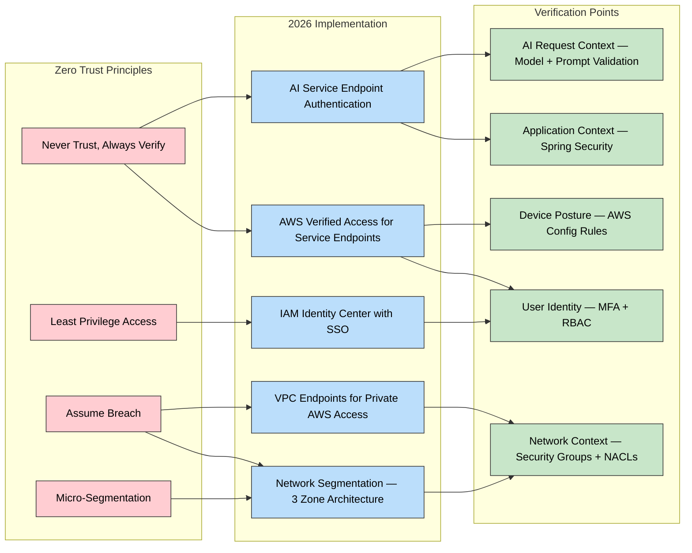
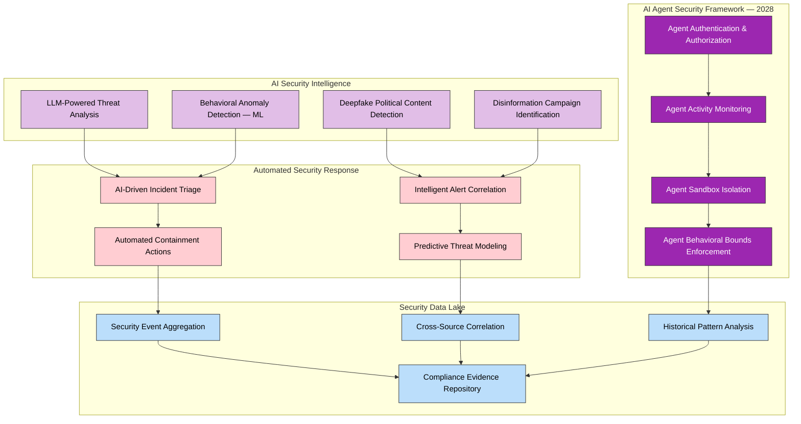
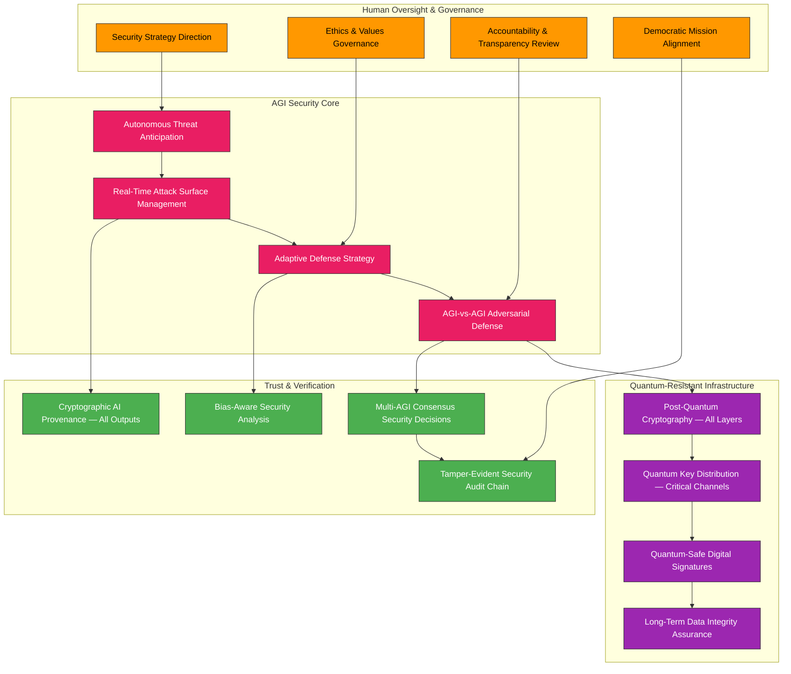

# 🛡️ Future Security Architecture Vision: 2026–2037 Roadmap

This document presents the security architecture evolution roadmap for the Citizen Intelligence Agency platform, from practical 2026 enhancements through visionary 2037 autonomous security operations. The roadmap accounts for rapid AI/LLM advancement—currently leveraging Anthropic Opus 4.6 with minor updates every ~2.3 months and major version upgrades annually—while anticipating competitor models, emergent AI threats, the trajectory toward AGI, and post-quantum cryptography requirements.

## 📚 Related Architecture Documentation

| Document                                            | Focus           | Description                               | Documentation Link                                                              |
| --------------------------------------------------- | --------------- | ----------------------------------------- | ------------------------------------------------------------------------------- |
| **[Architecture](ARCHITECTURE.md)**                 | 🏛️ Architecture | C4 model showing current system structure | [View Source](https://github.com/Hack23/cia/blob/master/ARCHITECTURE.md)         |
| **[Future Architecture](FUTURE_ARCHITECTURE.md)**   | 🏛️ Architecture | C4 model showing future system structure | [View Source](https://github.com/Hack23/cia/blob/master/FUTURE_ARCHITECTURE.md)         |
| **[Security Architecture](SECURITY_ARCHITECTURE.md)** | 🛡️ Security | Current security implementation           | [View Source](https://github.com/Hack23/cia/blob/master/SECURITY_ARCHITECTURE.md) |
| **[Future Security Architecture](FUTURE_SECURITY_ARCHITECTURE.md)** | 🛡️ Security | Future security roadmap            | [View Source](https://github.com/Hack23/cia/blob/master/FUTURE_SECURITY_ARCHITECTURE.md) |
| **[Threat Model](THREAT_MODEL.md)**                 | 🎯 Security     | STRIDE/MITRE ATT&CK threat analysis      | [View Source](https://github.com/Hack23/cia/blob/master/THREAT_MODEL.md)        |
| **[Future Threat Model](FUTURE_THREAT_MODEL.md)**   | 🎯 Security     | Future threat landscape (AI/PQC/2026-2037)| [View Source](https://github.com/Hack23/cia/blob/master/FUTURE_THREAT_MODEL.md) |
| **[ISMS Compliance Mapping](ISMS_COMPLIANCE_MAPPING.md)** | 🔐 ISMS | Comprehensive ISMS-PUBLIC policy mapping | [View Source](https://github.com/Hack23/cia/blob/master/ISMS_COMPLIANCE_MAPPING.md) |
| **[End-of-Life Strategy](End-of-Life-Strategy.md)** | 📅 Lifecycle    | Maintenance and EOL planning              | [View Source](https://github.com/Hack23/cia/blob/master/End-of-Life-Strategy.md) |
| **[Financial Security Plan](FinancialSecurityPlan.md)** | 💰 Security | Cost and security implementation          | [View Source](https://github.com/Hack23/cia/blob/master/FinancialSecurityPlan.md) |
| **[Business Continuity Plan](BCPPlan.md)**           | 📋 Resilience   | RTO/RPO targets and recovery procedures   | [View Source](https://github.com/Hack23/cia/blob/master/BCPPlan.md)             |
| **[Business Product Document](BUSINESS_PRODUCT_DOCUMENT.md)** | 💼 Business | Data analytics and risk intelligence products | [View Source](https://github.com/Hack23/cia/blob/master/BUSINESS_PRODUCT_DOCUMENT.md) |

## 🤖 AI/LLM Security Implications

| Year | AI Threat Evolution | Security Response |
|------|-------------------|-------------------|
| **2026** | LLM prompt injection attacks; AI-generated phishing; model poisoning risks | Input/output validation for AI pipelines; AI model audit trails; LLM security guardrails |
| **2027** | Multi-modal AI attack vectors; deepfake political content; AI-powered social engineering | Multi-modal content verification; deepfake detection; AI-enhanced threat intelligence |
| **2028** | Autonomous AI-driven attacks; AI agent exploitation; sophisticated evasion techniques | AI-augmented SOC; autonomous threat hunting; adversarial AI defense |
| **2029** | AI agents as attack surfaces; model supply chain attacks; zero-day AI exploitation | AI agent security framework; model provenance verification; AI-specific incident response |
| **2030–2033** | Proto-AGI threat actors; sophisticated AI manipulation; quantum computing threats emerge | Post-quantum cryptography migration; proto-AGI defensive capabilities; AI arms race management |
| **2034–2037** | AGI-level threats; quantum computing mainstream; AI alignment concerns for security tools | AGI-managed security operations; quantum-resistant infrastructure; AI security ethics governance |

## 🎯 2026 Vision: AI-Enhanced Security Architecture

### Security Architecture Overview (2026)

```mermaid
flowchart TB
    subgraph "Perimeter Security"
        WAF[AWS WAF — OWASP Top 10]
        DNS[Route 53 DNS Firewall]
        CF[CloudFront CDN + DDoS Protection]
        NF[AWS Network Firewall]
    end

    subgraph "Identity & Access Management"
        MFA[Multi-Factor Authentication — Google Authenticator]
        RBAC[Role-Based Access Control — 3 Tiers]
        IAM[AWS IAM — Least Privilege]
        SEC[Spring Security — Method-Level @Secured]
    end

    subgraph "Application Security"
        INPUT[Input Validation & Sanitization]
        XSS[XSS Prevention — Output Encoding]
        SQLI[SQL Injection Prevention — Parameterized Queries]
        CSRF[CSRF Token Protection]
    end

    subgraph "AI Security Layer — 2026 Enhancement"
        AIVAL[AI Input/Output Validation]
        AIGUARD[LLM Guardrails — Prompt Injection Prevention]
        AIAUDIT[AI Model Audit Trail]
        AIBIAS[AI Output Bias Detection]
        AIPROV[AI Analysis Provenance Tracking]
    end

    subgraph "Data Protection"
        TLS[TLS 1.3 End-to-End Encryption]
        KMS[AWS KMS — Data at Rest Encryption]
        SM[Secrets Manager — Automated Rotation]
        JAVERS[Javers — Data Change Auditing]
    end

    subgraph "Threat Detection & Response"
        GD[AWS GuardDuty — Threat Detection]
        SH[Security Hub — Centralized Findings]
        DET[Amazon Detective — Investigation]
        INSP[Amazon Inspector — Vulnerability Scanning]
    end

    CF --> WAF --> NF
    DNS --> CF
    MFA --> RBAC --> SEC
    IAM --> SEC
    INPUT --> XSS & SQLI & CSRF
    AIVAL --> AIGUARD --> AIAUDIT
    AIBIAS --> AIPROV
    TLS --> KMS --> SM
    GD --> SH --> DET
    INSP --> SH

    classDef perimeter fill:#ffcdd2,stroke:#333,stroke-width:1px,color:black
    classDef identity fill:#bbdefb,stroke:#333,stroke-width:1px,color:black
    classDef app fill:#c8e6c9,stroke:#333,stroke-width:1px,color:black
    classDef ai fill:#e1bee7,stroke:#333,stroke-width:1px,color:black
    classDef data fill:#fff9c4,stroke:#333,stroke-width:1px,color:black
    classDef detect fill:#ffecb3,stroke:#333,stroke-width:1px,color:black

    class WAF,DNS,CF,NF perimeter
    class MFA,RBAC,IAM,SEC identity
    class INPUT,XSS,SQLI,CSRF app
    class AIVAL,AIGUARD,AIAUDIT,AIBIAS,AIPROV ai
    class TLS,KMS,SM,JAVERS data
    class GD,SH,DET,INSP detect
```

### 2026 Security Enhancements

| Enhancement | Description | Compliance Mapping |
|------------|-------------|-------------------|
| **AI Input/Output Validation** | Sanitize all data sent to and received from LLM APIs; prevent prompt injection and data exfiltration | ISO 27001 A.8.3, NIST CSF PR.DS-1, CIS v8 3.3 |
| **LLM Guardrails** | Content filtering, topic restriction, and output validation for political analysis AI | ISO 27001 A.8.10, NIST CSF PR.DS-2 |
| **AI Model Audit Trail** | Complete logging of model versions, inputs, outputs, and confidence scores for all AI analysis | ISO 27001 A.8.15, NIST CSF DE.AE-3, CIS v8 8.5 |
| **AI Bias Detection** | Automated detection of political bias in AI-generated analysis | EU AI Act compliance, GDPR fairness principle |
| **AI Provenance Tracking** | Cryptographic signing of AI analysis results with model and data lineage | ISO 27001 A.8.4, NIST CSF PR.DS-6 |
| **Enhanced SBOM** | AI-inclusive Software Bill of Materials covering models, datasets, and inference dependencies | NIST CSF PR.DS-3, CIS v8 2.1 |

### Zero Trust Architecture Progression (2026)

```mermaid
flowchart LR
    subgraph "Zero Trust Principles"
        ZT1[Never Trust, Always Verify]
        ZT2[Least Privilege Access]
        ZT3[Assume Breach]
        ZT4[Micro-Segmentation]
    end

    subgraph "2026 Implementation"
        I1[AWS Verified Access for Service Endpoints]
        I2[IAM Identity Center with SSO]
        I3[Network Segmentation — 3 Zone Architecture]
        I4[VPC Endpoints for Private AWS Access]
        I5[AI Service Endpoint Authentication]
    end

    subgraph "Verification Points"
        V1[User Identity — MFA + RBAC]
        V2[Device Posture — AWS Config Rules]
        V3[Network Context — Security Groups + NACLs]
        V4[Application Context — Spring Security]
        V5[AI Request Context — Model + Prompt Validation]
    end

    ZT1 --> I1 & I5
    ZT2 --> I2
    ZT3 --> I3 & I4
    ZT4 --> I3

    I1 --> V1 & V2
    I2 --> V1
    I3 --> V3
    I4 --> V3
    I5 --> V4 & V5

    classDef zt fill:#ffcdd2,stroke:#333,stroke-width:1px,color:black
    classDef impl fill:#bbdefb,stroke:#333,stroke-width:1px,color:black
    classDef verify fill:#c8e6c9,stroke:#333,stroke-width:1px,color:black

    class ZT1,ZT2,ZT3,ZT4 zt
    class I1,I2,I3,I4,I5 impl
    class V1,V2,V3,V4,V5 verify
```

## 🔮 2027–2029 Vision: AI-Augmented Security Operations

### AI-Powered Threat Detection (2027)

```mermaid
flowchart TB
    subgraph "AI Security Intelligence"
        ASI1[LLM-Powered Threat Analysis]
        ASI2[Behavioral Anomaly Detection — ML]
        ASI3[Deepfake Political Content Detection]
        ASI4[Disinformation Campaign Identification]
    end

    subgraph "Automated Security Response"
        ASR1[AI-Driven Incident Triage]
        ASR2[Automated Containment Actions]
        ASR3[Intelligent Alert Correlation]
        ASR4[Predictive Threat Modeling]
    end

    subgraph "AI Agent Security Framework — 2028"
        AF1[Agent Authentication & Authorization]
        AF2[Agent Activity Monitoring]
        AF3[Agent Sandbox Isolation]
        AF4[Agent Behavioral Bounds Enforcement]
    end

    subgraph "Security Data Lake"
        SDL1[Security Event Aggregation]
        SDL2[Cross-Source Correlation]
        SDL3[Historical Pattern Analysis]
        SDL4[Compliance Evidence Repository]
    end

    ASI1 & ASI2 --> ASR1
    ASI3 & ASI4 --> ASR3
    ASR1 --> ASR2
    ASR3 --> ASR4

    AF1 --> AF2 --> AF3 --> AF4

    ASR2 --> SDL1
    ASR4 --> SDL2
    AF4 --> SDL3
    SDL1 & SDL2 & SDL3 --> SDL4

    classDef ai fill:#e1bee7,stroke:#333,stroke-width:1px,color:black
    classDef response fill:#ffcdd2,stroke:#333,stroke-width:1px,color:black
    classDef agent fill:#9C27B0,stroke:#333,stroke-width:1px,color:white
    classDef data fill:#bbdefb,stroke:#333,stroke-width:1px,color:black

    class ASI1,ASI2,ASI3,ASI4 ai
    class ASR1,ASR2,ASR3,ASR4 response
    class AF1,AF2,AF3,AF4 agent
    class SDL1,SDL2,SDL3,SDL4 data
```

### 2027–2029 Security Capabilities

| Year | Capability | Description |
|------|-----------|-------------|
| **2027** | AI-powered threat intelligence | LLM analysis of threat feeds, vulnerability reports, and security advisories for proactive defense |
| **2027** | Deepfake detection pipeline | Multi-modal AI verification of political content authenticity |
| **2028** | AI agent security framework | Authentication, authorization, sandboxing, and behavioral monitoring for autonomous AI agents |
| **2028** | Automated incident response | AI-driven incident triage, containment, and remediation with human approval for critical actions |
| **2029** | Model supply chain security | Cryptographic verification of AI model provenance and integrity |
| **2029** | Cross-national security coordination | Security information sharing across federated transparency platforms |

## 🌍 2030–2033 Vision: Autonomous Security Operations

### Proto-AGI Security Architecture (2030+)

```mermaid
flowchart TB
    subgraph "Autonomous Security Operations"
        AO1[AI Threat Hunter — Continuous Scanning]
        AO2[Predictive Vulnerability Management]
        AO3[Autonomous Patch Assessment]
        AO4[Self-Healing Security Controls]
    end

    subgraph "Post-Quantum Cryptography Migration"
        PQ1[Quantum Risk Assessment]
        PQ2[Hybrid Classical + PQ Algorithms]
        PQ3[Key Infrastructure Migration]
        PQ4[Data Re-Encryption — Critical Assets]
    end

    subgraph "Privacy-Preserving Security"
        PP1[Differential Privacy for Citizen Data]
        PP2[Federated Security Learning]
        PP3[Homomorphic Encryption — Sensitive Queries]
        PP4[Zero-Knowledge Proofs — Identity Verification]
    end

    subgraph "Compliance Automation"
        CA1[Continuous Compliance Monitoring]
        CA2[Automated Evidence Collection]
        CA3[Real-Time Audit Readiness]
        CA4[Multi-Framework Compliance Dashboard]
    end

    AO1 --> AO2 --> AO3 --> AO4
    PQ1 --> PQ2 --> PQ3 --> PQ4
    PP1 --> PP2
    PP3 --> PP4
    CA1 --> CA2 --> CA3 --> CA4

    classDef auto fill:#E91E63,stroke:#333,stroke-width:1px,color:white
    classDef quantum fill:#9C27B0,stroke:#333,stroke-width:1px,color:white
    classDef privacy fill:#4CAF50,stroke:#333,stroke-width:1px,color:white
    classDef comply fill:#FF9800,stroke:#333,stroke-width:1px,color:black

    class AO1,AO2,AO3,AO4 auto
    class PQ1,PQ2,PQ3,PQ4 quantum
    class PP1,PP2,PP3,PP4 privacy
    class CA1,CA2,CA3,CA4 comply
```

### 2030–2033 Security Evolution

| Capability | Description | Prerequisite |
|-----------|-------------|-------------|
| **Autonomous Threat Hunting** | AI systems continuously scan for threats, generate hypotheses, and investigate anomalies without human initiation | Proto-AGI with cybersecurity domain expertise |
| **Post-Quantum Migration** | Transition to quantum-resistant algorithms for all cryptographic operations | NIST PQC standards finalization; hybrid deployment capability |
| **Self-Healing Controls** | Security controls that automatically adapt to new attack patterns and reconfigure defenses | ML-driven security control optimization |
| **Privacy-Preserving Analytics** | Process and analyze political data without exposing individual data points | Differential privacy + homomorphic encryption maturation |
| **Continuous Compliance** | Real-time compliance posture assessment with automated evidence collection | AI-powered compliance monitoring + audit automation |

## 🚀 2034–2037 Visionary Horizon: AGI-Era Security

### AGI-Managed Security Architecture (2034–2037)

```mermaid
flowchart TB
    subgraph "AGI Security Core"
        AGI1[Autonomous Threat Anticipation]
        AGI2[Real-Time Attack Surface Management]
        AGI3[Adaptive Defense Strategy]
        AGI4[AGI-vs-AGI Adversarial Defense]
    end

    subgraph "Human Oversight & Governance"
        HO1[Security Strategy Direction]
        HO2[Ethics & Values Governance]
        HO3[Accountability & Transparency Review]
        HO4[Democratic Mission Alignment]
    end

    subgraph "Quantum-Resistant Infrastructure"
        QR1[Post-Quantum Cryptography — All Layers]
        QR2[Quantum Key Distribution — Critical Channels]
        QR3[Quantum-Safe Digital Signatures]
        QR4[Long-Term Data Integrity Assurance]
    end

    subgraph "Trust & Verification"
        TV1[Cryptographic AI Provenance — All Outputs]
        TV2[Bias-Aware Security Analysis]
        TV3[Multi-AGI Consensus Security Decisions]
        TV4[Tamper-Evident Security Audit Chain]
    end

    HO1 --> AGI1
    HO2 --> AGI3
    AGI1 --> AGI2 --> AGI3 --> AGI4
    HO3 --> AGI4
    AGI4 --> QR1
    QR1 --> QR2 --> QR3 --> QR4
    AGI2 --> TV1
    AGI3 --> TV2
    AGI4 --> TV3 --> TV4
    HO4 --> TV4

    classDef agi fill:#E91E63,stroke:#333,stroke-width:1px,color:white
    classDef human fill:#FF9800,stroke:#333,stroke-width:1px,color:black
    classDef quantum fill:#9C27B0,stroke:#333,stroke-width:1px,color:white
    classDef trust fill:#4CAF50,stroke:#333,stroke-width:1px,color:white

    class AGI1,AGI2,AGI3,AGI4 agi
    class HO1,HO2,HO3,HO4 human
    class QR1,QR2,QR3,QR4 quantum
    class TV1,TV2,TV3,TV4 trust
```

## 📊 Security Evolution Timeline

```mermaid
timeline
    title CIA Security Architecture Evolution: 2026–2037

    section 2026 — AI Security Enhancement
      AI input/output validation and guardrails : Prompt injection prevention
      AI model audit trail and provenance : Complete AI analysis tracking
      AI bias detection in political analysis : EU AI Act compliance
      Enhanced SBOM with AI components : Supply chain transparency

    section 2027–2028 — AI-Augmented Security
      AI-powered threat intelligence : LLM threat analysis
      Deepfake political content detection : Multi-modal verification
      AI agent security framework : Agent auth, monitoring, sandboxing
      Automated incident response : AI-driven triage and containment

    section 2029–2030 — Autonomous Security
      Model supply chain security : Cryptographic model verification
      Cross-national security coordination : Federated security sharing
      Autonomous threat hunting : Continuous AI-driven scanning
      Predictive vulnerability management : Proactive defense

    section 2031–2033 — Post-Quantum Transition
      Post-quantum cryptography migration : Hybrid classical + PQ algorithms
      Privacy-preserving analytics : Differential privacy + HE
      Self-healing security controls : Adaptive defense automation
      Continuous compliance automation : Real-time audit readiness

    section 2034–2037 — AGI-Era Security
      AGI-managed security operations : Autonomous threat anticipation
      Quantum-resistant infrastructure : Full PQC deployment
      AGI-vs-AGI adversarial defense : Next-gen threat landscape
      Cryptographic AI provenance : Tamper-evident analysis chain
```

## 🔐 Compliance Framework Evolution

| Framework | 2026 Status | 2030 Target | 2037 Vision |
|-----------|------------|-------------|-------------|
| **ISO 27001:2022** | Aligned — controls mapped and implemented | Certified — full ISMS implementation | Autonomous compliance — AI-managed ISMS |
| **NIST CSF 2.0** | Aligned — 6 functions addressed | Tier 4 — Adaptive implementation | Continuous — real-time framework alignment |
| **CIS Controls v8.1** | IG1 aligned — essential controls | IG2 complete — foundational controls | IG3 complete — organizational controls |
| **GDPR** | Compliant — political data handling documented | Advanced — privacy-preserving analytics | Proactive — AI-managed data protection |
| **EU AI Act** | Awareness — risk classification documented | Compliant — high-risk AI requirements met | Exemplary — reference implementation |
| **NIS2** | Awareness — critical infrastructure assessment | Compliant — essential entity requirements | Integrated — automated NIS2 reporting |

## AI Provider Security Considerations

| Security Concern | Design Response |
|-----------------|-----------------|
| **LLM Data Leakage** | Never send classified or personal data to external LLM APIs; use anonymization/redaction pipeline |
| **Prompt Injection** | Strict input validation; content filtering; output sanitization for all LLM interactions |
| **Model Version Security** | Pin model versions; security test with each ~2.3-month update; maintain rollback capability |
| **Provider Trust** | Data processing agreements with LLM providers; evaluate compliance with EU data residency requirements |
| **Open-Source Model Risks** | Vulnerability scanning for self-hosted models; model integrity verification; sandboxed inference |
| **AGI Safety** | Human oversight requirements for all security-critical decisions; kill switch architecture; ethical guardrails |
| **Multi-Provider Resilience** | Security controls work across Anthropic, OpenAI, open-source; no single-provider security dependency |

## Related Documentation

- [Current Security Architecture](SECURITY_ARCHITECTURE.md) — Review current security implementation
- [Threat Model](THREAT_MODEL.md) — STRIDE/MITRE ATT&CK threat analysis
- [ISMS Compliance Mapping](ISMS_COMPLIANCE_MAPPING.md) — ISMS-PUBLIC policy mapping
- [Financial Security Plan](FinancialSecurityPlan.md) — Security investment and costs
- [Future Architecture](FUTURE_ARCHITECTURE.md) — Platform evolution roadmap
- [End-of-Life Strategy](End-of-Life-Strategy.md) — Technology lifecycle management
- [CI/CD Workflows](WORKFLOWS.md) — Security automation and DevSecOps

---

**📋 Document Control:**
**✅ Approved by:** James Pether Sörling, CEO - Hack23 AB
**📤 Distribution:** Public
**🏷️ Classification:** 
**📅 Effective Date:** 2025-09-18
**⏰ Next Review:** 2026-03-18
**🎯 Framework Compliance:**    
