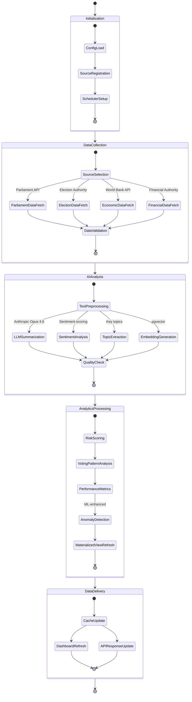
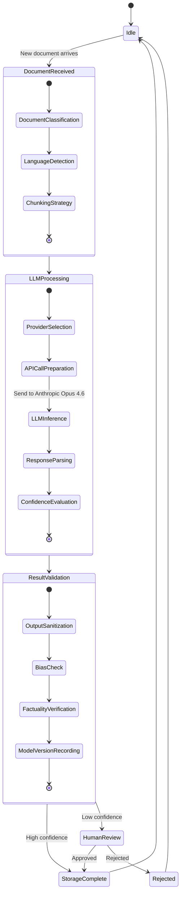
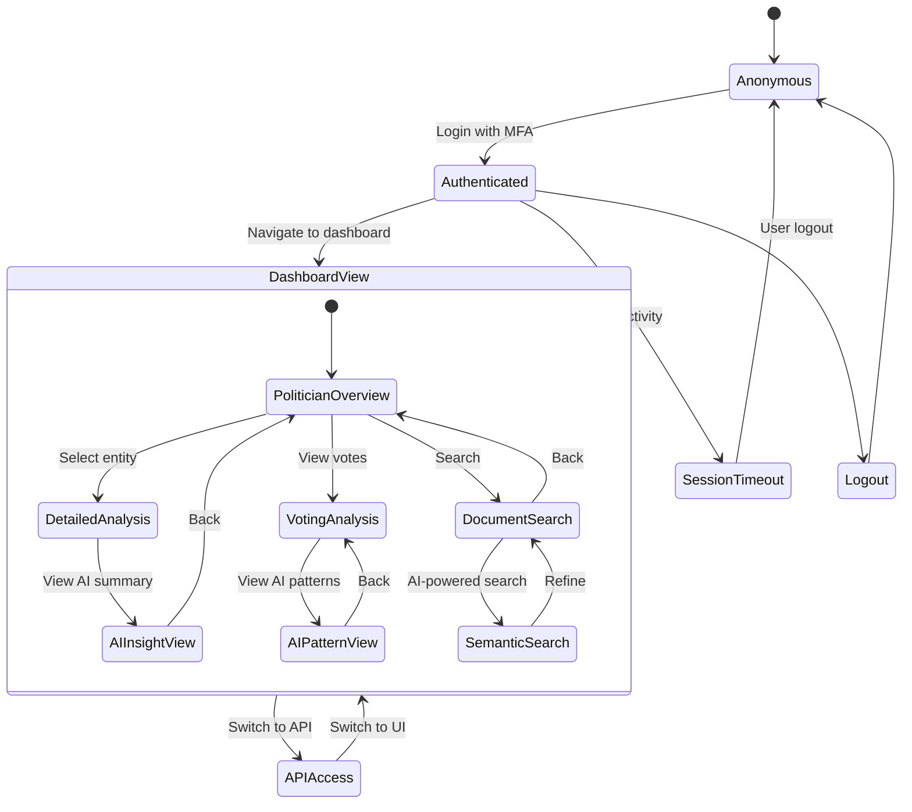
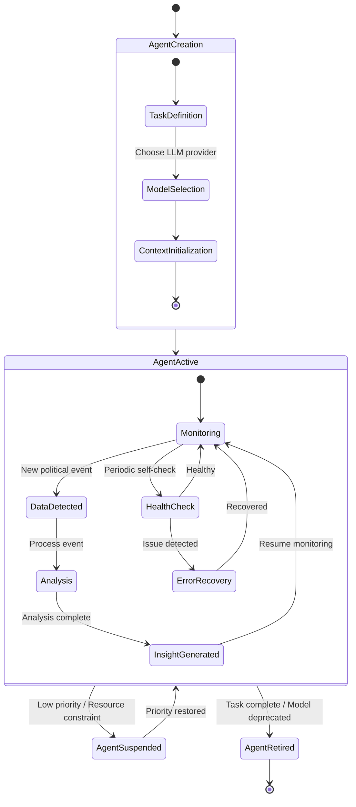
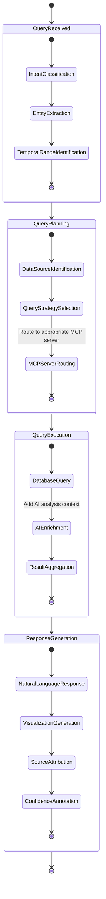
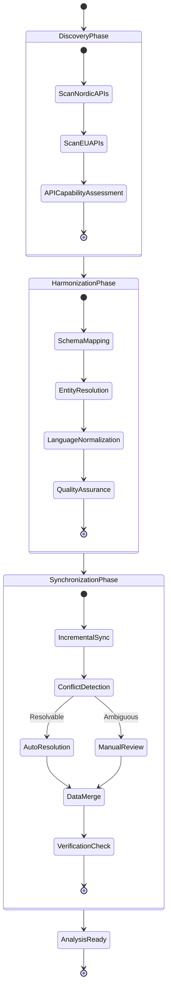
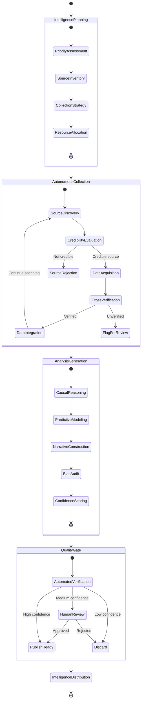
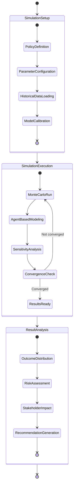
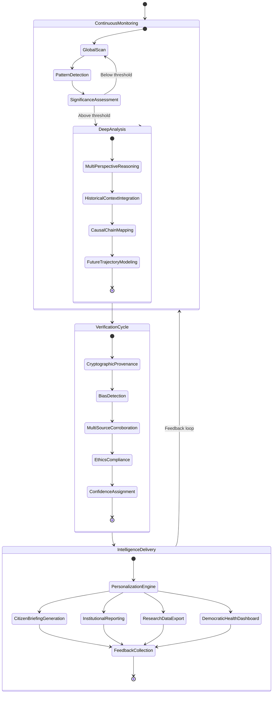
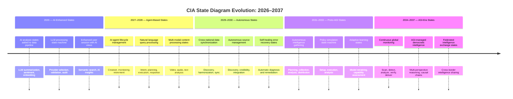

# 🔄 Future State Diagram Vision: 2026–2037 Roadmap

This document illustrates the future evolution of system state transitions and behavioral models for the Citizen Intelligence Agency platform. The roadmap progresses from practical 2026 AI-enhanced state management through visionary 2037 autonomous intelligence states, accounting for Anthropic Opus 4.6 with minor updates every ~2.3 months, annual major LLM upgrades, competitor models, and the trajectory toward AGI.

## 📚 Related Architecture Documentation

| Document                                            | Focus           | Description                               | Documentation Link                                                              |
| --------------------------------------------------- | --------------- | ----------------------------------------- | ------------------------------------------------------------------------------- |
| **[Architecture](ARCHITECTURE.md)**                 | 🏛️ Architecture | C4 model showing current system structure | [View Source](https://github.com/Hack23/cia/blob/master/ARCHITECTURE.md)         |
| **[Future Architecture](FUTURE_ARCHITECTURE.md)**   | 🏛️ Architecture | C4 model showing future system structure | [View Source](https://github.com/Hack23/cia/blob/master/FUTURE_ARCHITECTURE.md)         |
| **[State Diagrams](STATEDIAGRAM.md)**               | 🔄 Behavior     | Current system state transitions          | [View Source](https://github.com/Hack23/cia/blob/master/STATEDIAGRAM.md)        |
| **[Future State Diagrams](FUTURE_STATEDIAGRAM.md)** | 🔄 Behavior     | Enhanced adaptive state transitions       | [View Source](https://github.com/Hack23/cia/blob/master/FUTURE_STATEDIAGRAM.md) |
| **[Future Mindmaps](FUTURE_MINDMAP.md)**            | 🧠 Concept      | Future capability evolution               | [View Source](https://github.com/Hack23/cia/blob/master/FUTURE_MINDMAP.md)      |
| **[End-of-Life Strategy](End-of-Life-Strategy.md)** | 📅 Lifecycle    | Maintenance and EOL planning              | [View Source](https://github.com/Hack23/cia/blob/master/End-of-Life-Strategy.md) |
| **[CIA Features](https://hack23.com/cia-features.html)** | 🚀 Features | Platform features overview                | [View on hack23.com](https://hack23.com/cia-features.html)                     |

## 🎯 2026 Vision: AI-Enhanced Data Processing States

### AI-Augmented Data Import State Diagram

```mermaid
stateDiagram-v2
    [*] --> Initialization

    state Initialization {
        [*] --> ConfigLoad
        ConfigLoad --> SourceRegistration
        SourceRegistration --> SchedulerSetup
        SchedulerSetup --> [*]
    }

    Initialization --> DataCollection

    state DataCollection {
        [*] --> SourceSelection
        SourceSelection --> ParliamentDataFetch: Parliament API
        SourceSelection --> ElectionDataFetch: Election Authority
        SourceSelection --> EconomicDataFetch: World Bank API
        SourceSelection --> FinancialDataFetch: Financial Authority
        ParliamentDataFetch --> DataValidation
        ElectionDataFetch --> DataValidation
        EconomicDataFetch --> DataValidation
        FinancialDataFetch --> DataValidation
        DataValidation --> [*]
    }

    DataCollection --> AIAnalysis

    state AIAnalysis {
        [*] --> TextPreprocessing
        TextPreprocessing --> LLMSummarization: Anthropic Opus 4.6
        TextPreprocessing --> SentimentAnalysis: Sentiment scoring
        TextPreprocessing --> TopicExtraction: Key topics
        TextPreprocessing --> EmbeddingGeneration: pgvector
        LLMSummarization --> QualityCheck
        SentimentAnalysis --> QualityCheck
        TopicExtraction --> QualityCheck
        EmbeddingGeneration --> QualityCheck
        QualityCheck --> [*]
    }

    AIAnalysis --> AnalyticsProcessing

    state AnalyticsProcessing {
        [*] --> RiskScoring
        RiskScoring --> VotingPatternAnalysis
        VotingPatternAnalysis --> PerformanceMetrics
        PerformanceMetrics --> AnomalyDetection: ML-enhanced
        AnomalyDetection --> MaterializedViewRefresh
        MaterializedViewRefresh --> [*]
    }

    AnalyticsProcessing --> DataDelivery

    state DataDelivery {
        [*] --> CacheUpdate
        CacheUpdate --> DashboardRefresh
        CacheUpdate --> APIResponseUpdate
        DashboardRefresh --> [*]
        APIResponseUpdate --> [*]
    }

    DataDelivery --> [*]
```

### LLM Analysis State Machine (2026)

```mermaid
stateDiagram-v2
    [*] --> Idle

    Idle --> DocumentReceived: New document arrives

    state DocumentReceived {
        [*] --> DocumentClassification
        DocumentClassification --> LanguageDetection
        LanguageDetection --> ChunkingStrategy
        ChunkingStrategy --> [*]
    }

    DocumentReceived --> LLMProcessing

    state LLMProcessing {
        [*] --> ProviderSelection
        ProviderSelection --> APICallPreparation
        APICallPreparation --> LLMInference: Send to Anthropic Opus 4.6
        LLMInference --> ResponseParsing
        ResponseParsing --> ConfidenceEvaluation
        ConfidenceEvaluation --> [*]
    }

    LLMProcessing --> ResultValidation

    state ResultValidation {
        [*] --> OutputSanitization
        OutputSanitization --> BiasCheck
        BiasCheck --> FactualityVerification
        FactualityVerification --> ModelVersionRecording
        ModelVersionRecording --> [*]
    }

    ResultValidation --> StorageComplete: High confidence
    ResultValidation --> HumanReview: Low confidence
    HumanReview --> StorageComplete: Approved
    HumanReview --> Rejected: Rejected

    StorageComplete --> Idle
    Rejected --> Idle
```

### User Session State (2026 Enhanced)

```mermaid
stateDiagram-v2
    [*] --> Anonymous

    Anonymous --> Authenticated: Login with MFA
    Authenticated --> DashboardView: Navigate to dashboard

    state DashboardView {
        [*] --> PoliticianOverview
        PoliticianOverview --> DetailedAnalysis: Select entity
        DetailedAnalysis --> AIInsightView: View AI summary
        AIInsightView --> PoliticianOverview: Back
        PoliticianOverview --> VotingAnalysis: View votes
        VotingAnalysis --> AIPatternView: View AI patterns
        AIPatternView --> VotingAnalysis: Back
        PoliticianOverview --> DocumentSearch: Search
        DocumentSearch --> SemanticSearch: AI-powered search
        SemanticSearch --> DocumentSearch: Refine
        DocumentSearch --> PoliticianOverview: Back
    }

    DashboardView --> APIAccess: Switch to API
    APIAccess --> DashboardView: Switch to UI

    Authenticated --> SessionTimeout: Inactivity
    Authenticated --> Logout: User logout
    SessionTimeout --> Anonymous
    Logout --> Anonymous
```

## 🔮 2027–2029 Vision: Intelligent System States

### AI Agent Lifecycle State (2027)

```mermaid
stateDiagram-v2
    [*] --> AgentCreation

    state AgentCreation {
        [*] --> TaskDefinition
        TaskDefinition --> ModelSelection: Choose LLM provider
        ModelSelection --> ContextInitialization
        ContextInitialization --> [*]
    }

    AgentCreation --> AgentActive

    state AgentActive {
        [*] --> Monitoring
        Monitoring --> DataDetected: New political event
        DataDetected --> Analysis: Process event
        Analysis --> InsightGenerated: Analysis complete
        InsightGenerated --> Monitoring: Resume monitoring

        Monitoring --> HealthCheck: Periodic self-check
        HealthCheck --> Monitoring: Healthy
        HealthCheck --> ErrorRecovery: Issue detected
        ErrorRecovery --> Monitoring: Recovered
    }

    AgentActive --> AgentSuspended: Low priority / Resource constraint
    AgentSuspended --> AgentActive: Priority restored

    AgentActive --> AgentRetired: Task complete / Model deprecated
    AgentRetired --> [*]
```

### Natural Language Query State (2028)

```mermaid
stateDiagram-v2
    [*] --> QueryReceived

    state QueryReceived {
        [*] --> IntentClassification
        IntentClassification --> EntityExtraction
        EntityExtraction --> TemporalRangeIdentification
        TemporalRangeIdentification --> [*]
    }

    QueryReceived --> QueryPlanning

    state QueryPlanning {
        [*] --> DataSourceIdentification
        DataSourceIdentification --> QueryStrategySelection
        QueryStrategySelection --> MCPServerRouting: Route to appropriate MCP server
        MCPServerRouting --> [*]
    }

    QueryPlanning --> QueryExecution

    state QueryExecution {
        [*] --> DatabaseQuery
        DatabaseQuery --> AIEnrichment: Add AI analysis context
        AIEnrichment --> ResultAggregation
        ResultAggregation --> [*]
    }

    QueryExecution --> ResponseGeneration

    state ResponseGeneration {
        [*] --> NaturalLanguageResponse
        NaturalLanguageResponse --> VisualizationGeneration
        VisualizationGeneration --> SourceAttribution
        SourceAttribution --> ConfidenceAnnotation
        ConfidenceAnnotation --> [*]
    }

    ResponseGeneration --> [*]
```

### Cross-National Data Synchronization State (2029)

```mermaid
stateDiagram-v2
    [*] --> DiscoveryPhase

    state DiscoveryPhase {
        [*] --> ScanNordicAPIs
        ScanNordicAPIs --> ScanEUAPIs
        ScanEUAPIs --> APICapabilityAssessment
        APICapabilityAssessment --> [*]
    }

    DiscoveryPhase --> HarmonizationPhase

    state HarmonizationPhase {
        [*] --> SchemaMapping
        SchemaMapping --> EntityResolution
        EntityResolution --> LanguageNormalization
        LanguageNormalization --> QualityAssurance
        QualityAssurance --> [*]
    }

    HarmonizationPhase --> SynchronizationPhase

    state SynchronizationPhase {
        [*] --> IncrementalSync
        IncrementalSync --> ConflictDetection
        ConflictDetection --> AutoResolution: Resolvable
        ConflictDetection --> ManualReview: Ambiguous
        AutoResolution --> DataMerge
        ManualReview --> DataMerge
        DataMerge --> VerificationCheck
        VerificationCheck --> [*]
    }

    SynchronizationPhase --> AnalysisReady
    AnalysisReady --> [*]
```

## 🌍 2030–2033 Vision: Autonomous Intelligence States

### Autonomous Intelligence Gathering State (2030+)

```mermaid
stateDiagram-v2
    [*] --> IntelligencePlanning

    state IntelligencePlanning {
        [*] --> PriorityAssessment
        PriorityAssessment --> SourceInventory
        SourceInventory --> CollectionStrategy
        CollectionStrategy --> ResourceAllocation
        ResourceAllocation --> [*]
    }

    IntelligencePlanning --> AutonomousCollection

    state AutonomousCollection {
        [*] --> SourceDiscovery
        SourceDiscovery --> CredibilityEvaluation
        CredibilityEvaluation --> DataAcquisition: Credible source
        CredibilityEvaluation --> SourceRejection: Not credible
        DataAcquisition --> CrossVerification
        CrossVerification --> DataIntegration: Verified
        CrossVerification --> FlagForReview: Unverified
        DataIntegration --> SourceDiscovery: Continue scanning
    }

    AutonomousCollection --> AnalysisGeneration

    state AnalysisGeneration {
        [*] --> CausalReasoning
        CausalReasoning --> PredictiveModeling
        PredictiveModeling --> NarrativeConstruction
        NarrativeConstruction --> BiasAudit
        BiasAudit --> ConfidenceScoring
        ConfidenceScoring --> [*]
    }

    AnalysisGeneration --> QualityGate

    state QualityGate {
        [*] --> AutomatedVerification
        AutomatedVerification --> PublishReady: High confidence
        AutomatedVerification --> HumanReview: Medium confidence
        AutomatedVerification --> Discard: Low confidence
        HumanReview --> PublishReady: Approved
        HumanReview --> Discard: Rejected
    }

    QualityGate --> IntelligenceDistribution
    IntelligenceDistribution --> [*]
```

### Policy Simulation State Machine (2031–2033)

```mermaid
stateDiagram-v2
    [*] --> SimulationSetup

    state SimulationSetup {
        [*] --> PolicyDefinition
        PolicyDefinition --> ParameterConfiguration
        ParameterConfiguration --> HistoricalDataLoading
        HistoricalDataLoading --> ModelCalibration
        ModelCalibration --> [*]
    }

    SimulationSetup --> SimulationExecution

    state SimulationExecution {
        [*] --> MonteCarloRun
        MonteCarloRun --> AgentBasedModeling
        AgentBasedModeling --> SensitivityAnalysis
        SensitivityAnalysis --> ConvergenceCheck
        ConvergenceCheck --> MonteCarloRun: Not converged
        ConvergenceCheck --> ResultsReady: Converged
    }

    SimulationExecution --> ResultAnalysis

    state ResultAnalysis {
        [*] --> OutcomeDistribution
        OutcomeDistribution --> RiskAssessment
        RiskAssessment --> StakeholderImpact
        StakeholderImpact --> RecommendationGeneration
        RecommendationGeneration --> [*]
    }

    ResultAnalysis --> [*]
```

## 🚀 2034–2037 Visionary Horizon: AGI-Era State Models

### AGI-Managed Democratic Intelligence State (2034–2037)

```mermaid
stateDiagram-v2
    [*] --> ContinuousMonitoring

    state ContinuousMonitoring {
        [*] --> GlobalScan
        GlobalScan --> PatternDetection
        PatternDetection --> SignificanceAssessment
        SignificanceAssessment --> GlobalScan: Below threshold
        SignificanceAssessment --> DeepAnalysis: Above threshold
    }

    ContinuousMonitoring --> DeepAnalysis

    state DeepAnalysis {
        [*] --> MultiPerspectiveReasoning
        MultiPerspectiveReasoning --> HistoricalContextIntegration
        HistoricalContextIntegration --> CausalChainMapping
        CausalChainMapping --> FutureTrajectoryModeling
        FutureTrajectoryModeling --> [*]
    }

    DeepAnalysis --> VerificationCycle

    state VerificationCycle {
        [*] --> CryptographicProvenance
        CryptographicProvenance --> BiasDetection
        BiasDetection --> MultiSourceCorroboration
        MultiSourceCorroboration --> EthicsCompliance
        EthicsCompliance --> ConfidenceAssignment
        ConfidenceAssignment --> [*]
    }

    VerificationCycle --> IntelligenceDelivery

    state IntelligenceDelivery {
        [*] --> PersonalizationEngine
        PersonalizationEngine --> CitizenBriefingGeneration
        PersonalizationEngine --> InstitutionalReporting
        PersonalizationEngine --> ResearchDataExport
        PersonalizationEngine --> DemocraticHealthDashboard
        CitizenBriefingGeneration --> FeedbackCollection
        InstitutionalReporting --> FeedbackCollection
        ResearchDataExport --> FeedbackCollection
        DemocraticHealthDashboard --> FeedbackCollection
        FeedbackCollection --> [*]
    }

    IntelligenceDelivery --> ContinuousMonitoring: Feedback loop
```

## 📊 State Complexity Evolution

```mermaid
timeline
    title CIA State Diagram Evolution: 2026–2037

    section 2026 — AI-Enhanced States
      AI analysis states added to data pipeline : LLM summarization, sentiment, embedding
      LLM processing state machine : Provider selection, validation, audit
      Enhanced user session with AI views : Semantic search, AI insights

    section 2027–2028 — Agent-Based States
      AI agent lifecycle management : Creation, monitoring, retirement
      Natural language query processing : Intent, planning, execution, response
      Multi-modal content processing states : Video, audio, text analysis

    section 2029–2030 — Autonomous States
      Cross-national data synchronization : Discovery, harmonization, sync
      Autonomous source management : Discovery, credibility, integration
      Self-healing error recovery states : Automatic diagnosis and remediation

    section 2031–2033 — Proto-AGI States
      Autonomous intelligence gathering : Planning, collection, analysis, distribution
      Policy simulation state machine : Setup, execution, analysis
      Adaptive learning states : Model retraining, capability assessment

    section 2034–2037 — AGI-Era States
      Continuous global monitoring : Scan, detect, analyze, verify, deliver
      AGI-managed democratic intelligence : Multi-perspective reasoning, causal chains
      Federated intelligence exchange states : Cross-border intelligence sharing
```

## AI Provider State Management

| State Concern | Design Approach |
|--------------|-----------------|
| **Model Version Transitions** | Graceful migration states when LLM providers release updates every ~2.3 months; parallel model evaluation before cutover |
| **Provider Failover** | Automatic fallback to alternative LLM providers (Anthropic → OpenAI → open-source) with state preservation |
| **Capability Discovery** | Dynamic state expansion when new LLM capabilities become available with annual major upgrades |
| **Graceful Degradation** | All AI-enhanced states have non-AI fallback paths ensuring platform functionality without AI services |
| **Cost State Management** | LLM usage tracking states with budget limits, smart caching to avoid redundant API calls |
| **AGI Readiness** | State architecture designed to accommodate AGI services as drop-in replacements for narrow AI states |

## Related Documentation

- [Current State Diagrams](STATEDIAGRAM.md) — Review current system state transitions
- [Current Architecture](ARCHITECTURE.md) — System architecture context
- [Future Architecture](FUTURE_ARCHITECTURE.md) — Platform evolution roadmap
- [Future Mindmaps](FUTURE_MINDMAP.md) — Future capability evolution
- [End-of-Life Strategy](End-of-Life-Strategy.md) — Technology maintenance planning
- [CIA Features](https://hack23.com/cia-features.html) — Current feature showcase

---

**📋 Document Control:**  
**✅ Approved by:** James Pether Sörling, CEO - Hack23 AB  
**📤 Distribution:** Public  
**🏷️ Classification:**     
**📅 Effective Date:** 2025-09-18  
**⏰ Next Review:** 2026-09-18  
**🎯 Framework Compliance:**    
