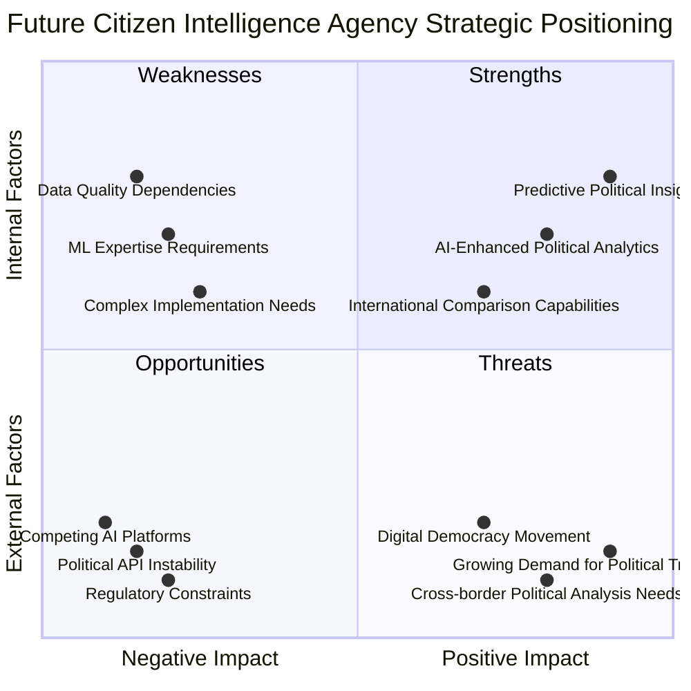
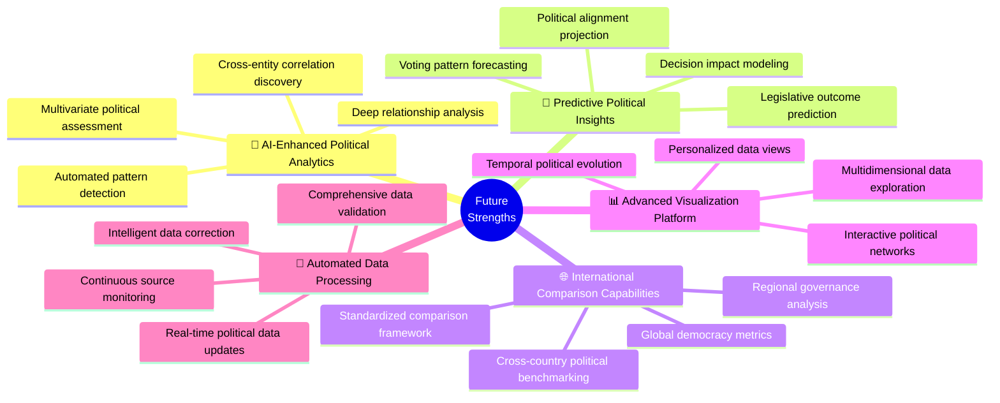
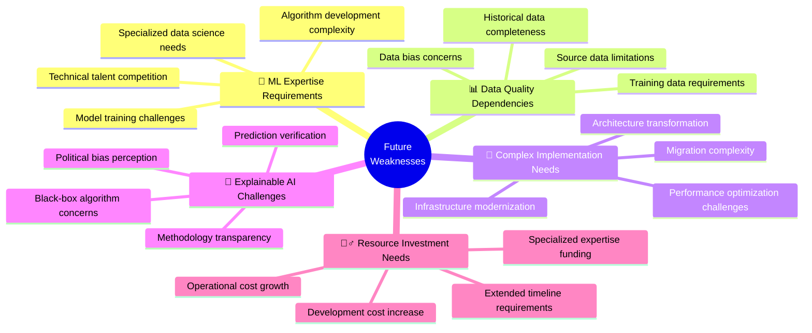
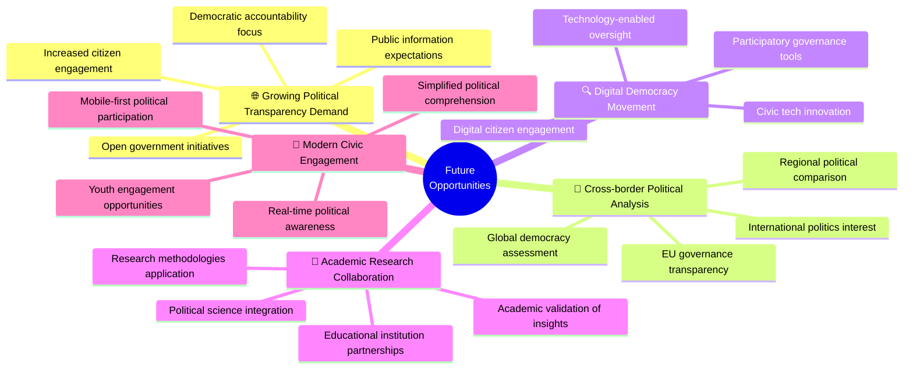
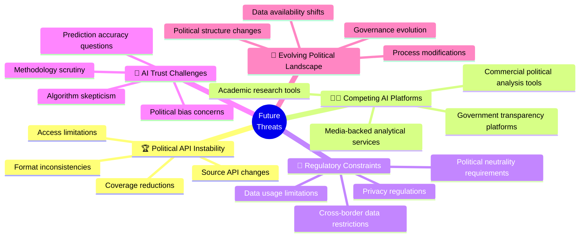
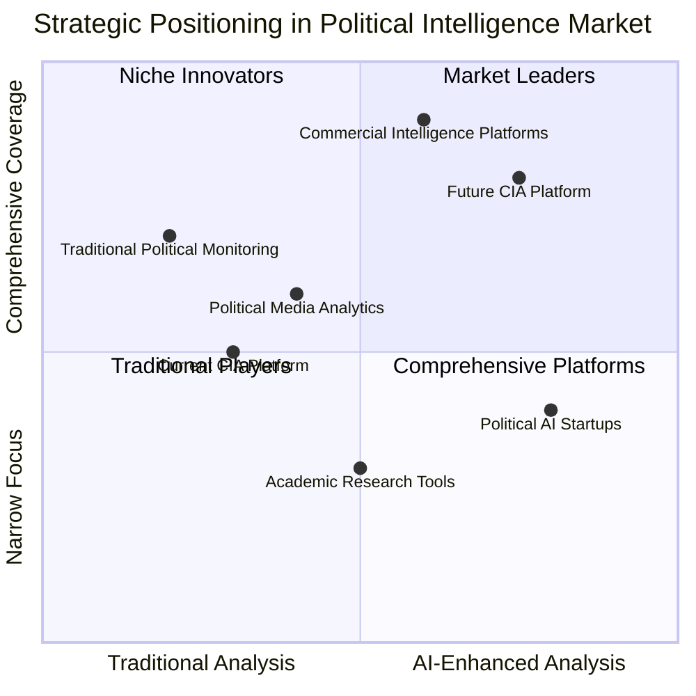
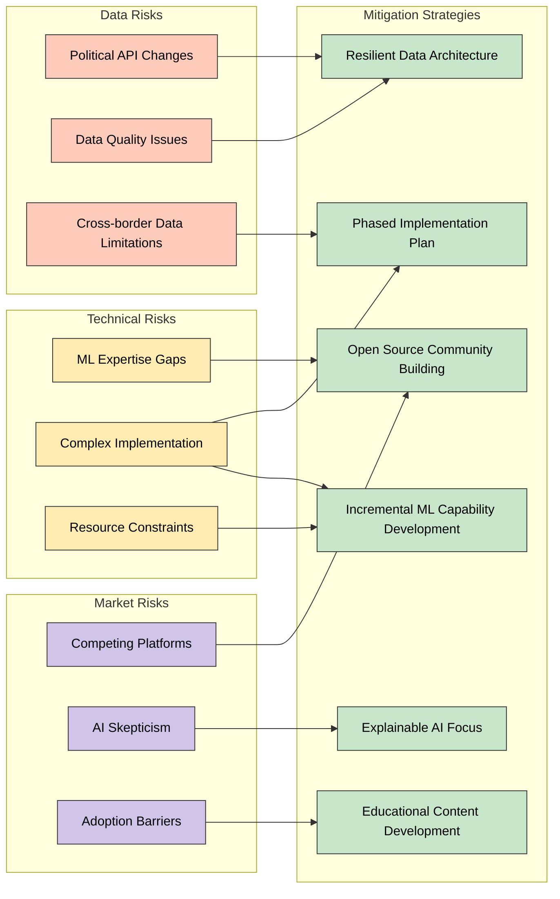
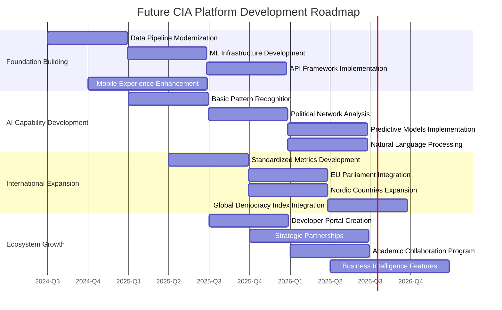
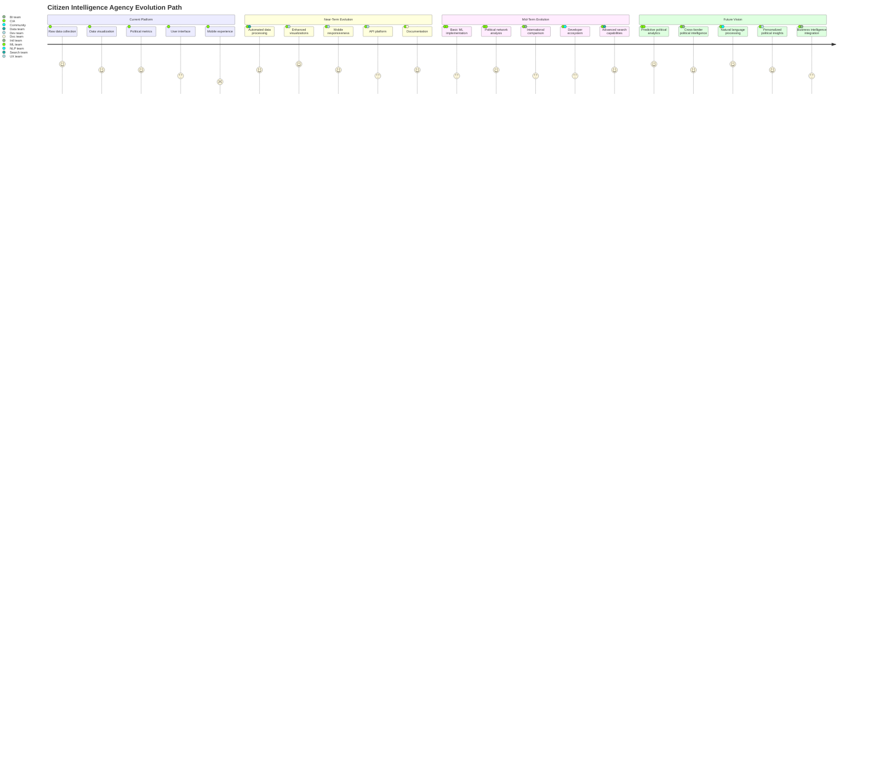

# 💼 Future Citizen Intelligence Agency SWOT Analysis

This document provides a strategic analysis of the Citizen Intelligence Agency's future evolution into an AI-enhanced political transparency platform.  It assesses the strengths, weaknesses, opportunities, and threats associated with this transformation, building upon the current SWOT analysis to guide long-term strategic planning.

## 📚 Related Architecture Documentation

| Document                                            | Focus           | Description                               | Documentation Link                                                              |
| --------------------------------------------------- | --------------- | ----------------------------------------- | ------------------------------------------------------------------------------- |
| **[Architecture](ARCHITECTURE.md)**                 | 🏛️ Architecture | C4 model showing current system structure | [View Source](https://github.com/Hack23/cia/blob/master/ARCHITECTURE.md)        |
| **[Future Architecture](FUTURE_ARCHITECTURE.md)**   | 🏛️ Architecture | C4 model showing future system structure | [View Source](https://github.com/Hack23/cia/blob/master/FUTURE_ARCHITECTURE. md) |
| **[Mindmaps](MINDMAP.md)**                          | 🧠 Concept      | Current system component relationships    | [View Source](https://github.com/Hack23/cia/blob/master/MINDMAP.md)             |
| **[Future Mindmaps](FUTURE_MINDMAP.md)**            | 🧠 Concept      | Future capability evolution               | [View Source](https://github.com/Hack23/cia/blob/master/FUTURE_MINDMAP.md)      |
| **[SWOT Analysis](SWOT.md)**                        | 💼 Business     | Current strategic assessment              | [View Source](https://github.com/Hack23/cia/blob/master/SWOT.md)                |
| **[Future SWOT Analysis](FUTURE_SWOT.md)**          | 💼 Business     | Future strategic opportunities            | [View Source](https://github.com/Hack23/cia/blob/master/FUTURE_SWOT. md)         |
| **[Data Model](DATA_MODEL.md)**                     | 📊 Data         | Current data structures and relationships | [View Source](https://github.com/Hack23/cia/blob/master/DATA_MODEL. md)          |
| **[Future Data Model](FUTURE_DATA_MODEL.md)**       | 📊 Data         | Enhanced political data architecture      | [View Source](https://github.com/Hack23/cia/blob/master/FUTURE_DATA_MODEL.md)   |
| **[Flowcharts](FLOWCHART.md)**                      | 🔄 Process      | Current data processing workflows         | [View Source](https://github.com/Hack23/cia/blob/master/FLOWCHART.md)           |
| **[Future Flowcharts](FUTURE_FLOWCHART.md)**        | 🔄 Process      | Enhanced AI-driven workflows              | [View Source](https://github.com/Hack23/cia/blob/master/FUTURE_FLOWCHART.md)    |
| **[State Diagrams](STATEDIAGRAM.md)**               | 🔄 Behavior     | Current system state transitions          | [View Source](https://github.com/Hack23/cia/blob/master/STATEDIAGRAM.md)        |
| **[Future State Diagrams](FUTURE_STATEDIAGRAM.md)** | 🔄 Behavior     | Enhanced adaptive state transitions       | [View Source](https://github.com/Hack23/cia/blob/master/FUTURE_STATEDIAGRAM.md) |
| **[CI/CD Workflows](WORKFLOWS.md)**                 | 🔧 DevOps       | Current automation processes              | [View Source](https://github.com/Hack23/cia/blob/master/WORKFLOWS. md)           |
| **[Future Workflows](FUTURE_WORKFLOWS.md)**         | 🔧 DevOps       | Enhanced CI/CD with ML                    | [View Source](https://github.com/Hack23/cia/blob/master/FUTURE_WORKFLOWS.md)    |
| **[End-of-Life Strategy](End-of-Life-Strategy.md)** | 📅 Lifecycle    | Maintenance and EOL planning              | [View Source](https://github.com/Hack23/cia/blob/master/End-of-Life-Strategy.md) |
| **[Financial Security Plan](FinancialSecurityPlan.md)** | 💰 Security | Cost and security implementation          | [View Source](https://github.com/Hack23/cia/blob/master/FinancialSecurityPlan.md) |
| **[CIA Features](https://hack23.com/cia-features. html)** | 🚀 Features | Platform features overview                | [View on hack23.com](https://hack23.com/cia-features.html)                      |

## 📊 Strategic SWOT Overview

## 💪 Strengths

| Strength                           | Impact Level | Description                                                                     | Strategic Advantage                                            |
|------------------------------------|--------------|---------------------------------------------------------------------------------|----------------------------------------------------------------|
| 🧠 AI-Enhanced Political Analytics | High         | Platform leverages ML for political data analysis beyond human capacity         | Uncovers insights impossible with manual analysis              |
| 🔮 Predictive Political Insights   | High         | Forecasting capabilities for voting patterns and political outcomes             | Anticipates political developments with data-driven predictions|
| 🌐 International Comparison        | Medium-High  | Cross-country political benchmarking and standardized comparison                | Contextualizes Swedish politics in global democratic landscape |
| 📊 Advanced Visualization          | Medium-High  | Interactive, multidimensional visualization of complex political relationships   | Makes complex political data accessible and meaningful         |
| 🔄 Automated Data Processing       | Medium       | Intelligent automation of data collection, validation, and integration          | Ensures timely, accurate political data with minimal effort    |
| 📱 Mobile-First Experience         | Medium       | Responsive design enabling full platform capabilities on mobile devices         | Reaches broader audience with consistent experience            |
| 🔌 Open API Ecosystem              | Medium       | Comprehensive API supporting third-party integration and extension              | Creates platform for innovation and ecosystem growth           |
| 📈 Business Intelligence Features  | Medium       | Tools connecting political activities to business impact and policy effects     | Expands relevance to corporate and organizational users        |
| 🧩 Microservices Architecture      | Medium-Low   | Cloud-native architecture supporting scalability and component independence     | Enables independent scaling and technology evolution           |

## 🔄 Weaknesses

| Weakness                        | Impact Level | Description                                                                 | Mitigation Strategy                                          |
|---------------------------------|--------------|-----------------------------------------------------------------------------|--------------------------------------------------------------|
| 🧩 ML Expertise Requirements    | High         | Need for specialized data science and ML engineering skills                 | Phased skill development and strategic partnerships           |
| 📊 Data Quality Dependencies    | High         | Heavy reliance on high-quality training data for ML model accuracy          | Robust data validation pipeline and synthetic data generation |
| 🔌 Complex Implementation Needs | Medium-High  | Significant architectural changes required for AI/ML integration            | Microservices transition allowing incremental implementation  |
| 🧠 Explainable AI Challenges    | Medium       | Ensuring transparency and explainability of AI-generated insights          | Focus on interpretable models and clear methodology docs      |
| 🏋️‍♂️ Resource Investment Needs  | Medium       | Increased development and operational costs for AI-enhanced features        | Prioritized implementation roadmap and cloud cost optimization|
| ⏱️ Extended Development Timeline| Medium       | Longer timeframes needed for sophisticated ML feature development           | Incremental capability delivery with continuous value         |
| 🔍 Testing Complexity           | Medium-Low   | Advanced testing requirements for ML models and predictions                 | Automated ML testing framework and validation metrics         |
| 📚 Knowledge Transfer Challenges| Low          | Complexity of transferring ML expertise across volunteer contributors       | Documentation focus and knowledge sharing initiatives         |
| 🔒 Data Privacy Considerations  | Low          | Handling sensitive data while maintaining privacy in training               | Privacy-preserving ML techniques and strict data governance   |

## 🚀 Opportunities

| Opportunity                           | Impact Level | Description                                                              | Strategic Response                                            |
|--------------------------------------|--------------|--------------------------------------------------------------------------|--------------------------------------------------------------|
| 🌐 Growing Transparency Demand        | High         | Increasing public interest in political transparency and accountability   | Position as leading political intelligence platform            |
| 📝 Cross-border Political Analysis    | High         | Need for comparative political analysis across national boundaries        | Develop standardized international political metrics           |
| 🔍 Digital Democracy Movement         | Medium-High  | Growth of civic tech and digital tools for democratic participation       | Integrate with broader civic technology ecosystem              |
| 🧪 Academic Research Collaboration    | Medium       | Potential partnerships with political science academic institutions       | Develop research-grade datasets and methodologies              |
| 📱 Modern Civic Engagement            | Medium       | Evolution of citizen participation through mobile and digital channels    | Create engagement-focused features and simplified interfaces   |
| 🏛️ Government Transparency Initiatives| Medium       | Government programs promoting open data and public access                 | Align with open government standards and initiatives           |
| 🎓 Political Education                | Medium-Low   | Growing focus on civic education and political literacy                   | Develop educational features and simplified explanations       |
| 🔄 API Economy Growth                 | Medium-Low   | Expansion of API-driven ecosystems for government and political data      | Position platform as API hub for political data                |
| 🏢 Corporate Political Intelligence   | Medium-Low   | Business need for understanding political impacts on operations           | Develop business-focused analysis and impact assessment        |

## ⚠️ Threats

| Threat                          | Impact Level | Description                                                                | Strategic Response                                           |
|---------------------------------|--------------|----------------------------------------------------------------------------|--------------------------------------------------------------|
| 🏆 Political API Instability     | High         | Vulnerability to changes in underlying data sources and access methods     | Diversify data sources and build resilient data architecture  |
| 👨‍💻 Competing AI Platforms      | High         | Growth of similar political analysis platforms with AI capabilities        | Differentiate through unique features and open-source approach|
| 📜 Regulatory Constraints        | Medium       | Potential limitations on data usage, privacy compliance, or neutrality     | Design for compliance and transparent methodology             |
| 🧠 AI Trust Challenges           | Medium       | Skepticism about AI-generated political insights and potential bias        | Focus on explainable AI and methodological transparency       |
| 🔄 Evolving Political Landscape  | Medium       | Changes to political structures requiring model adjustments                | Build adaptable models with governance-independent approaches |
| 💰 Sustainable Funding           | Medium-Low   | Challenges securing resources for advanced platform development            | Develop contributory funding model and partnership strategy   |
| 🏢 Organizational Adoption       | Medium-Low   | Barriers to adoption by institutions and organizational users              | Create clear value propositions and integration solutions      |
| 🔍 Quality Expectations          | Low          | Higher user expectations for analysis accuracy and insight quality         | Implement rigorous validation and confidence metrics           |
| 🛡️ Security Considerations       | Low          | Enhanced security needs for ML infrastructure and political data           | Implement ML-specific security measures and monitoring         |

## 📊 Strategic Position Matrix

## 🎯 Strategic Recommendations

Based on the SWOT analysis, the following strategic recommendations will guide the future development of the Citizen Intelligence Agency platform:

### 🥇 Primary Strategic Objectives

1. **🧠 Develop AI-Enhanced Political Intelligence**
   - Build predictive models for voting patterns and political outcomes
   - Create relationship analysis capabilities identifying hidden political connections
   - Implement impact assessment modeling for political decisions

2. **🌐 Expand International Comparative Capabilities**
   - Develop standardized metrics for cross-country political comparison
   - Build EU governance transparency features
   - Create global democracy indices integration

3. **🔌 Establish Open Political Intelligence API**
   - Develop comprehensive API for political data and insights
   - Create developer ecosystem and documentation
   - Build integration capabilities with civic tech platforms

### 🛡️ Risk Mitigation Strategies

### 🧠 Innovation Focus Areas

1. **🔮 Predictive Political Analytics**
   - Voting pattern prediction models
   - Legislative outcome forecasting
   - Political alignment trajectory analysis
   - Decision impact simulation

2. **🕸️ Political Network Analysis**
   - Relationship mapping between political entities
   - Influence network visualization
   - Cross-entity correlation detection
   - Temporal network evolution analysis

3. **📊 Personalized Political Intelligence**
   - User interest-based political monitoring
   - Customized political impact assessment
   - Tailored alert and notification systems
   - Personal political knowledge management

## 🚀 Execution Strategy

This execution strategy balances technical development with market expansion, allowing for the phased introduction of advanced capabilities while building a sustainable platform for political transparency and intelligence.

## Evolution Path

The future evolution of the Citizen Intelligence Agency into an AI-enhanced political intelligence platform represents a significant opportunity to address the growing demand for sophisticated political transparency tools. By leveraging machine learning for predictive analytics, pattern detection, and relationship mapping, the platform can deliver unique value that extends beyond traditional political monitoring. 

This strategic analysis indicates that while technical challenges exist in ML expertise and implementation complexity, the combination of AI-enhanced analytics with international comparison capabilities creates a distinctive market position. The phased execution strategy allows for progressive capability development while managing both technical and market risks effectively. 

As democratic institutions worldwide face increasing scrutiny and citizens demand greater transparency, the future CIA platform is well-positioned to become a leading resource for political intelligence—not just in Sweden but potentially across multiple democratic systems. 

