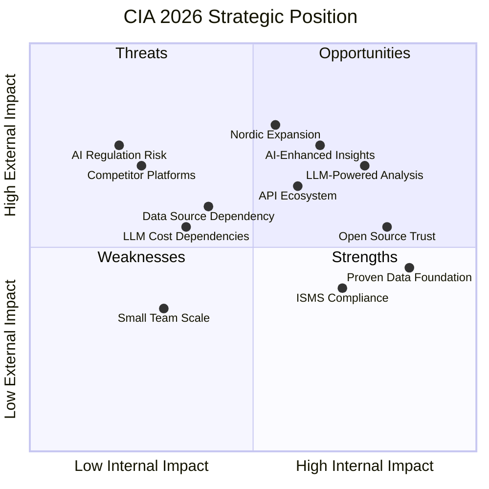
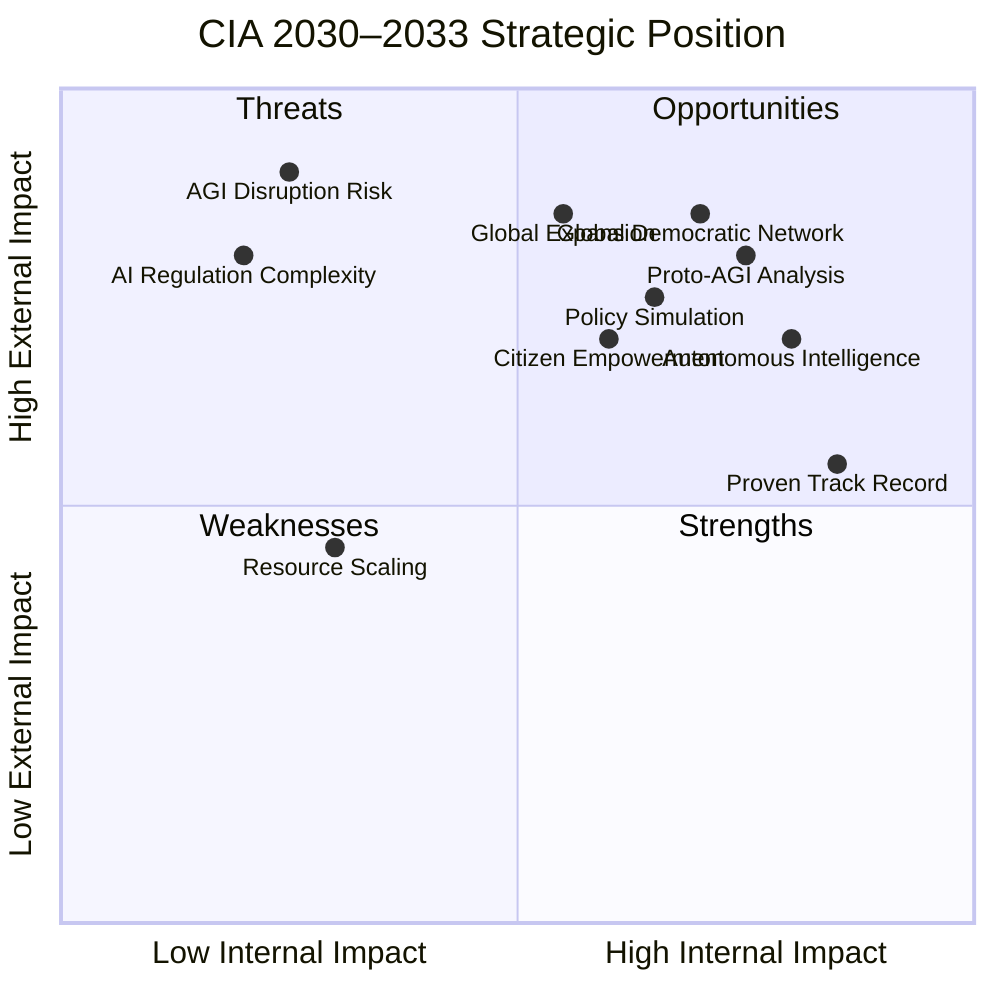

# 💼 Future SWOT Analysis: 2026–2037 Strategic Roadmap

This document presents the strategic SWOT (Strengths, Weaknesses, Opportunities, Threats) analysis for the Citizen Intelligence Agency platform evolution from 2026 through 2037. The analysis accounts for rapid AI/LLM advancement—currently leveraging Anthropic Opus 4.6 with minor updates every ~2.3 months and major version upgrades annually—while anticipating competitor models, emergent AI architectures, and the trajectory toward AGI.

## 📚 Related Architecture Documentation

| Document                                            | Focus           | Description                               | Documentation Link                                                              |
| --------------------------------------------------- | --------------- | ----------------------------------------- | ------------------------------------------------------------------------------- |
| **[Architecture](ARCHITECTURE.md)**                 | 🏛️ Architecture | C4 model showing current system structure | [View Source](https://github.com/Hack23/cia/blob/master/ARCHITECTURE.md)         |
| **[Future Architecture](FUTURE_ARCHITECTURE.md)**   | 🏛️ Architecture | C4 model showing future system structure | [View Source](https://github.com/Hack23/cia/blob/master/FUTURE_ARCHITECTURE.md)         |
| **[SWOT Analysis](SWOT.md)**                        | 💼 Business     | Current strategic assessment              | [View Source](https://github.com/Hack23/cia/blob/master/SWOT.md)                |
| **[Future SWOT Analysis](FUTURE_SWOT.md)**          | 💼 Business     | Future strategic opportunities            | [View Source](https://github.com/Hack23/cia/blob/master/FUTURE_SWOT.md)         |
| **[Future Mindmaps](FUTURE_MINDMAP.md)**            | 🧠 Concept      | Future capability evolution               | [View Source](https://github.com/Hack23/cia/blob/master/FUTURE_MINDMAP.md)      |
| **[End-of-Life Strategy](End-of-Life-Strategy.md)** | 📅 Lifecycle    | Maintenance and EOL planning              | [View Source](https://github.com/Hack23/cia/blob/master/End-of-Life-Strategy.md) |
| **[CIA Features](https://hack23.com/cia-features.html)** | 🚀 Features | Platform features overview                | [View on hack23.com](https://hack23.com/cia-features.html)                     |

## 🎯 2026 SWOT Analysis: AI-Enhanced Platform

### SWOT Overview Diagram (2026)

```mermaid
quadrantChart
    title CIA 2026 Strategic Position
    x-axis Low Internal Impact --> High Internal Impact
    y-axis Low External Impact --> High External Impact
    quadrant-1 Opportunities
    quadrant-2 Threats
    quadrant-3 Weaknesses
    quadrant-4 Strengths
    LLM-Powered Analysis: [0.75, 0.70]
    Open Source Trust: [0.80, 0.55]
    Proven Data Foundation: [0.85, 0.45]
    ISMS Compliance: [0.70, 0.40]
    Nordic Expansion: [0.55, 0.80]
    AI-Enhanced Insights: [0.65, 0.75]
    API Ecosystem: [0.60, 0.65]
    Small Team Scale: [0.30, 0.35]
    LLM Cost Dependencies: [0.35, 0.55]
    Competitor Platforms: [0.25, 0.70]
    AI Regulation Risk: [0.20, 0.75]
    Data Source Dependency: [0.40, 0.60]
```

### 💪 Strengths (2026)

| Strength | Description | Impact |
|----------|-------------|--------|
| **Proven Political Data Foundation** | 10+ years of Swedish parliamentary data with comprehensive coverage of votes, documents, committees, and financial data | 🟢 High |
| **Open-Source Trust & Transparency** | Full source code transparency builds trust for political intelligence; no hidden algorithms or biases | 🟢 High |
| **AI-Ready Architecture** | Modular Spring/Java architecture enables incremental AI integration without full rewrite | 🟢 High |
| **ISMS Compliance Framework** | ISO 27001, NIST CSF 2.0, CIS Controls v8.1 alignment provides enterprise-grade security posture | 🟡 Medium |
| **GitHub Copilot Agent Integration** | AI-assisted development accelerates feature delivery and documentation quality | 🟡 Medium |
| **LLM-Powered Analysis** | Anthropic Opus 4.6 integration enables automated document summarization, sentiment analysis, and semantic search | 🟢 High |
| **Comprehensive Documentation** | Architecture Documentation Matrix with current + future state docs across all dimensions | 🟡 Medium |
| **Political Neutrality** | Non-partisan analysis approach essential for public trust in political intelligence | 🟢 High |

### 📉 Weaknesses (2026)

| Weakness | Description | Mitigation Strategy |
|----------|-------------|-------------------|
| **Small Development Team** | Volunteer-driven project with limited development capacity | Maximize AI-assisted development; GitHub Copilot agents for code generation and review |
| **LLM API Cost Dependency** | AI analysis features depend on paid API calls to Anthropic/competitors | Implement smart caching, batch processing, and result reuse; evaluate open-source models |
| **Single-Country Focus** | Currently limited to Swedish parliamentary data only | Phased Nordic expansion starting 2027; standardized data schema for multi-country support |
| **Monolithic Architecture** | Single deployable unit limits independent scaling of AI workloads | Extract AI analysis as microservice by 2028; maintain monolith for core data operations |
| **Limited User Base** | Political transparency tools have niche audience | API ecosystem and embeddable widgets to expand reach; media partnerships for visibility |
| **Java UI Framework** | Vaadin server-side rendering limits modern frontend flexibility | Evaluate React/TypeScript components for high-interaction views; keep Vaadin for data-heavy dashboards |

### 🌟 Opportunities (2026)

| Opportunity | Description | Timeline | Priority |
|------------|-------------|----------|----------|
| **AI-Enhanced Political Insights** | LLM-powered analysis transforms raw data into actionable intelligence for citizens | 2026 | 🔴 Critical |
| **API Ecosystem for Researchers** | RESTful API enables academic research, journalism, and third-party innovation | 2026 | 🟢 High |
| **Nordic Parliament Expansion** | Standardized schema enables Norwegian, Danish, Finnish parliament data integration | 2027–2028 | 🟢 High |
| **EU Parliament Integration** | European Parliament MCP Server enables cross-border political intelligence | 2027–2028 | 🟡 Medium |
| **Open-Source LLM Self-Hosting** | Llama, Mistral, and other open models enable cost-effective AI analysis without API dependency | 2027 | 🟡 Medium |
| **MCP Protocol Standard** | Model Context Protocol enables structured AI-data interaction for political datasets | 2027 | 🟡 Medium |
| **Media Partnership Opportunities** | News organizations need reliable political data analysis for reporting | 2026–2027 | 🟡 Medium |

### ⚠️ Threats (2026)

| Threat | Description | Risk Level | Mitigation |
|--------|-------------|-----------|------------|
| **AI Regulation (EU AI Act)** | Political analysis AI may face regulatory scrutiny under high-risk AI classification | 🔴 High | Maintain transparency, bias documentation, and human-in-the-loop for all AI outputs |
| **Competitor Platforms** | Commercial political intelligence platforms with larger budgets and teams | 🟡 Medium | Differentiate through open-source transparency and political neutrality |
| **LLM Provider Disruption** | Rapid model updates (~2.3 months minor, annual major) may break integrations | 🟡 Medium | Provider-agnostic abstraction layer; multi-provider failover architecture |
| **Data Source API Changes** | Riksdagen or other data source APIs may change without notice | 🟡 Medium | Robust data import layer with versioned API clients and fallback strategies |
| **Disinformation Weaponization** | Platform data could be selectively quoted to support disinformation campaigns | 🟡 Medium | Context-rich data presentation; clear methodology documentation; abuse monitoring |
| **GDPR Enforcement Tightening** | Stricter interpretation of political data processing under GDPR special categories | 🟡 Medium | Legal basis documentation; DPIA for all AI processing; privacy-by-design architecture |

## 🔮 2027–2029 SWOT Evolution

### New Strengths Emerging

| Strength | By When | Description |
|----------|---------|-------------|
| **Multi-National Data Coverage** | 2028 | Nordic + EU parliament data provides unique comparative political intelligence |
| **AI Agent Ecosystem** | 2028 | Autonomous monitoring agents provide 24/7 political event coverage |
| **Natural Language Interface** | 2027 | Citizens can query political data in plain language, democratizing access |
| **MCP Server Integration** | 2027 | Standardized AI-data protocol positions CIA as reference implementation |
| **Cross-Language NLP** | 2028 | AI-powered translation enables cross-border political analysis |

### New Threats Emerging

| Threat | By When | Description |
|--------|---------|-------------|
| **AGI Competition** | 2029 | Early AGI systems from tech giants may subsume political analysis capabilities |
| **AI Deepfakes in Politics** | 2027 | Deepfake political content requires sophisticated detection and verification |
| **Sovereignty Concerns** | 2028 | Cross-national political intelligence may face data sovereignty restrictions |
| **AI Arms Race** | 2028 | Authoritarian states developing counter-transparency AI tools |
| **Open-Source Model Risks** | 2027 | Self-hosted models may introduce vulnerabilities or biases without vendor oversight |

## 🌍 2030–2033 SWOT Evolution

### Strategic Position Shift

```mermaid
quadrantChart
    title CIA 2030–2033 Strategic Position
    x-axis Low Internal Impact --> High Internal Impact
    y-axis Low External Impact --> High External Impact
    quadrant-1 Opportunities
    quadrant-2 Threats
    quadrant-3 Weaknesses
    quadrant-4 Strengths
    Global Democratic Network: [0.70, 0.85]
    Proto-AGI Analysis: [0.75, 0.80]
    Autonomous Intelligence: [0.80, 0.70]
    Proven Track Record: [0.85, 0.55]
    AGI Disruption Risk: [0.25, 0.90]
    AI Regulation Complexity: [0.20, 0.80]
    Resource Scaling: [0.30, 0.45]
    Global Expansion: [0.55, 0.85]
    Policy Simulation: [0.65, 0.75]
    Citizen Empowerment: [0.60, 0.70]
```

### 2030–2033 Key SWOT Shifts

| Category | Factor | Description |
|----------|--------|-------------|
| **Strength** | First-mover in open democratic intelligence | Decade of data + AI integration creates unmatched political knowledge base |
| **Strength** | Autonomous intelligence capabilities | Proto-AGI enables self-managing analysis pipelines with human oversight |
| **Weakness** | Scaling governance complexity | Global federation requires sophisticated governance for data sharing |
| **Weakness** | AGI integration uncertainty | Unclear how to integrate emergent AGI capabilities safely and ethically |
| **Opportunity** | Global democratic health monitoring | No existing platform provides real-time democratic institutional health assessment |
| **Opportunity** | Policy simulation as a service | Governments and researchers need evidence-based policy outcome modeling |
| **Threat** | AGI disruption | General-purpose AGI may make specialized political intelligence platforms redundant |
| **Threat** | Digital sovereignty fragmentation | Nations may restrict cross-border political data sharing |

## 🚀 2034–2037 Visionary SWOT Horizon

### AGI-Era Strategic Analysis

| Category | Factor | Description |
|----------|--------|-------------|
| **Strength** | Ethical AI governance expertise | 10+ years of responsible AI in political analysis creates trusted governance framework |
| **Strength** | Global democratic data federation | Largest open-source democratic intelligence network worldwide |
| **Strength** | Verified AI provenance | Cryptographic AI analysis verification establishes new trust standard |
| **Weakness** | Human team capacity vs AGI scope | AGI capabilities may exceed team's ability to govern and verify |
| **Weakness** | Legacy architecture burden | Pre-AGI architecture may limit full AGI integration potential |
| **Opportunity** | Democratic infrastructure status | Platform becomes essential democratic infrastructure like voting systems |
| **Opportunity** | AGI-citizen engagement | Personalized civic intelligence for every citizen globally |
| **Opportunity** | Democratic AI standards body | CIA project leads establishment of democratic AI analysis standards |
| **Threat** | AGI alignment concerns | Misaligned AGI could manipulate political analysis for unknown objectives |
| **Threat** | Post-quantum security transition | Quantum computing threatens historical data integrity and privacy |
| **Threat** | Societal AI dependency risk | Over-reliance on AI for democratic processes creates fragility |

## 📊 Strategic Evolution Timeline

```mermaid
timeline
    title CIA SWOT Evolution: 2026–2037

    section 2026 — AI Enhancement
      Strength — LLM-powered political analysis : Anthropic Opus 4.6 integration
      Opportunity — API ecosystem launch : Research and media access
      Threat — EU AI Act compliance : High-risk AI classification management
      Action — Provider-agnostic AI architecture : Multi-LLM abstraction layer

    section 2027–2028 — International Expansion
      Strength — Nordic parliament data coverage : Multi-country comparative analysis
      Opportunity — Natural language political queries : Citizen accessibility
      Threat — AI deepfake political content : Detection and verification needs
      Action — Cross-national data harmonization : Standardized political ontology

    section 2029–2030 — Autonomous Intelligence
      Strength — AI agent ecosystem : 24/7 autonomous monitoring
      Opportunity — Global democratic network : Federated transparency platforms
      Threat — Early AGI competition : Tech giant capabilities
      Action — Proto-AGI integration architecture : Safe and governed AI autonomy

    section 2031–2033 — Proto-AGI Era
      Strength — Autonomous intelligence capabilities : Self-managing analysis
      Opportunity — Policy simulation as a service : Government partnerships
      Threat — AGI disruption risk : Potential platform redundancy
      Action — AGI governance framework : Ethical AI analysis standards

    section 2034–2037 — AGI Transformation
      Strength — Ethical AI governance expertise : Decade of responsible AI
      Opportunity — Democratic infrastructure status : Essential civic technology
      Threat — AGI alignment concerns : Manipulation risk management
      Action — Post-quantum security migration : Long-term data protection
```

## 🤖 AI Competition & Evolution Impact

| AI Evolution Factor | SWOT Impact | Strategic Response |
|--------------------|-------------|-------------------|
| **Minor LLM updates (~2.3 months)** | Continuous capability improvement but integration maintenance burden | Automated compatibility testing; abstraction layer insulation |
| **Major annual LLM upgrades** | Step-function capability gains requiring architecture adaptation | Annual architecture review cycle; modular AI integration points |
| **Competitor models (GPT-N, Gemini, Llama)** | Best-of-breed model selection opportunity; vendor lock-in risk | Multi-provider support; benchmarking framework; cost-performance optimization |
| **Open-source LLM maturation** | Self-hosting option reduces cost and sovereignty risk | Hybrid cloud + self-hosted architecture; political model fine-tuning |
| **AGI emergence (2030s)** | Transformative opportunity and existential threat simultaneously | Modular architecture ready for AGI drop-in; ethical governance framework; human oversight |
| **AI regulation evolution** | Compliance complexity increases; competitive moat for compliant platforms | Proactive compliance architecture; regulatory monitoring; transparency-first design |

## 🌈 Strategic Vision Statement

The Citizen Intelligence Agency's strategic position evolves through four distinct phases:

1. **2026: Differentiate** — Leverage AI-powered analysis to transform political data into actionable intelligence, establishing the platform as the premier open-source political transparency tool
2. **2027–2029: Expand** — Scale to Nordic and EU coverage with natural language interaction, building the foundation for global democratic intelligence
3. **2030–2033: Lead** — Establish first-mover advantage in autonomous political intelligence and global democratic health monitoring
4. **2034–2037: Transform** — Evolve into essential democratic infrastructure serving as the foundation for AI-verified, globally federated political transparency

Throughout this evolution, the platform's core competitive advantages remain: **open-source transparency**, **political neutrality**, **data integrity**, and **ethical AI governance**—values that become increasingly valuable as AI capabilities grow and public trust in AI-generated analysis becomes critical.

## Related Documentation

- [Current SWOT Analysis](SWOT.md) — Review current strategic assessment
- [Current Architecture](ARCHITECTURE.md) — System architecture context
- [Future Architecture](FUTURE_ARCHITECTURE.md) — Platform evolution roadmap
- [Future Mindmaps](FUTURE_MINDMAP.md) — Future capability evolution
- [End-of-Life Strategy](End-of-Life-Strategy.md) — Technology maintenance planning
- [CIA Features](https://hack23.com/cia-features.html) — Current feature showcase

---

**📋 Document Control:**  
**✅ Approved by:** James Pether Sörling, CEO - Hack23 AB  
**📤 Distribution:** Public  
**🏷️ Classification:**     
**📅 Effective Date:** 2025-09-18  
**⏰ Next Review:** 2026-09-18  
**🎯 Framework Compliance:**    
